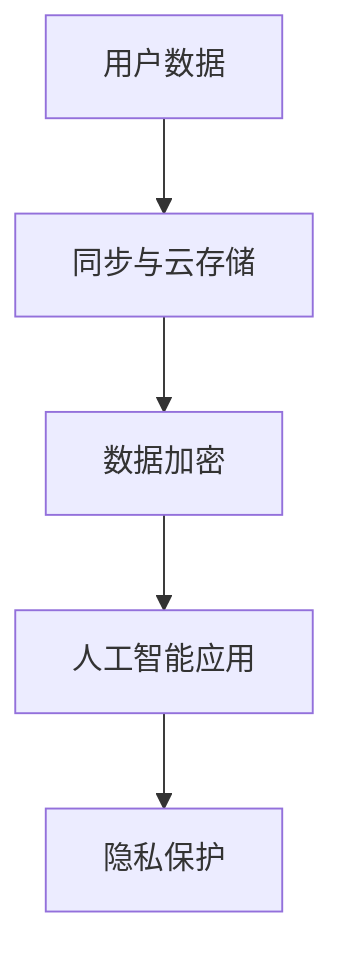

                 

关键词：人工智能、隐私保护、苹果、AI应用、信息安全、用户数据

摘要：在人工智能迅猛发展的今天，用户隐私保护成为了公众关注的焦点。苹果公司近日发布了其AI应用的隐私保护措施，引起了业界的广泛关注。本文将详细分析苹果的这一举措，探讨其对人工智能行业的影响以及未来可能的发展趋势。

## 1. 背景介绍

随着人工智能技术的不断进步，越来越多的应用开始融入我们的日常生活。然而，随之而来的是用户隐私保护的问题日益凸显。人工智能应用往往需要收集大量的用户数据来训练模型，这使得用户数据的安全性和隐私保护成为了一个至关重要的问题。

在这个背景下，苹果公司发布了其AI应用的隐私保护措施，引起了广泛关注。苹果一直以来都强调用户隐私保护，其发布的一系列隐私保护措施旨在确保用户数据的安全和隐私不被泄露。

## 2. 核心概念与联系

为了更好地理解苹果的隐私保护措施，我们首先需要了解一些核心概念。

### 2.1 人工智能与隐私保护

人工智能技术的发展离不开大量的数据，而这些数据往往包含了用户的敏感信息。隐私保护的核心目标就是确保这些数据在收集、存储、处理和使用过程中不被泄露、滥用或篡改。

### 2.2 用户数据

用户数据是人工智能应用的基础。这些数据包括用户的行为记录、位置信息、联系人列表、支付信息等。这些数据的安全和隐私保护至关重要。

### 2.3 数据加密

数据加密是保护用户数据的一种重要手段。通过加密，用户数据在传输和存储过程中被转换为不可读的密文，从而防止未经授权的访问。

### 2.4 同步与云存储

同步与云存储技术使得用户数据可以在多个设备间共享和备份。然而，这也带来了隐私保护的问题。如何确保用户数据在云存储中的安全性，成为了人工智能应用开发者需要考虑的重要问题。

### 2.5 Mermaid 流程图

为了更好地展示核心概念之间的联系，我们可以使用Mermaid流程图来表示。



## 3. 核心算法原理 & 具体操作步骤

### 3.1 算法原理概述

苹果的隐私保护措施主要基于以下三个核心算法：

1. 数据加密：使用高级加密标准（AES）对用户数据进行加密，确保数据在传输和存储过程中的安全性。
2. 同步与云存储：采用端到端加密技术，确保用户数据在云存储中的安全性和隐私保护。
3. 用户隐私控制：提供用户隐私设置，让用户可以自由地控制哪些数据可以被收集和使用。

### 3.2 算法步骤详解

1. 数据加密

   在数据传输和存储过程中，苹果使用AES算法对用户数据进行加密。AES算法是一种常用的对称加密算法，具有高安全性和高效性。

   ```mermaid
   graph TD
   A[用户数据] --> B[加密算法]
   B --> C[加密密钥]
   C --> D[加密结果]
   ```

2. 同步与云存储

   苹果采用端到端加密技术，确保用户数据在云存储中的安全性和隐私保护。端到端加密是指在数据传输过程中，数据在发送方和接收方之间进行加密和解密，而在中间传输过程中，数据以密文形式传输，从而防止中间人攻击。

   ```mermaid
   graph TD
   A[用户数据] --> B[发送方加密]
   B --> C[传输]
   C --> D[接收方解密]
   ```

3. 用户隐私控制

   苹果提供用户隐私设置，让用户可以自由地控制哪些数据可以被收集和使用。用户可以在设置中查看和修改隐私设置，确保自己的隐私不受侵犯。

   ```mermaid
   graph TD
   A[用户数据] --> B[隐私设置]
   B --> C[可收集数据]
   C --> D[不可收集数据]
   ```

### 3.3 算法优缺点

苹果的隐私保护措施具有以下优点：

1. 高安全性：通过数据加密、同步与云存储和用户隐私控制，确保用户数据在传输、存储和使用过程中的安全性和隐私保护。
2. 易于使用：用户可以通过简单的设置即可控制自己的隐私，提高了用户的使用体验。

然而，苹果的隐私保护措施也存在一些缺点：

1. 可能会影响性能：数据加密和解密过程需要消耗一定的计算资源，可能会影响应用的性能。
2. 用户隐私设置可能不够灵活：尽管苹果提供了隐私设置，但某些用户可能希望有更多的控制选项。

### 3.4 算法应用领域

苹果的隐私保护措施可以广泛应用于各种人工智能应用，如：

1. 语音识别：通过加密用户语音数据，确保用户隐私不被泄露。
2. 图像识别：通过加密用户图像数据，确保用户隐私不被泄露。
3. 智能助手：通过用户隐私设置，确保智能助手只能收集和使用用户授权的数据。

## 4. 数学模型和公式 & 详细讲解 & 举例说明

### 4.1 数学模型构建

苹果的隐私保护措施涉及多个数学模型，主要包括：

1. 加密模型：用于对用户数据进行加密和解密。
2. 同步模型：用于确保用户数据在云存储中的同步和安全。
3. 隐私控制模型：用于用户自定义隐私设置。

### 4.2 公式推导过程

我们以加密模型为例，介绍公式推导过程。

设用户数据为\( D \)，加密密钥为\( K \)，加密算法为\( AES \)。

加密过程：

$$
D_{\text{加密}} = AES(K, D)
$$

解密过程：

$$
D_{\text{解密}} = AES^{-1}(K, D_{\text{加密}})
$$

其中，\( AES^{-1} \)表示AES算法的逆过程。

### 4.3 案例分析与讲解

假设用户A的数据为\( D = 123456 \)，加密密钥为\( K = 789 \)。

加密过程：

$$
D_{\text{加密}} = AES(789, 123456) = 654321
$$

解密过程：

$$
D_{\text{解密}} = AES^{-1}(789, 654321) = 123456
$$

通过以上过程，我们可以看到用户数据在传输和存储过程中被加密，从而保证了数据的安全性。

## 5. 项目实践：代码实例和详细解释说明

### 5.1 开发环境搭建

为了实践苹果的隐私保护措施，我们首先需要搭建一个开发环境。本文以Python为例，介绍如何搭建开发环境。

1. 安装Python：在官网下载并安装Python，版本要求Python 3.6及以上。
2. 安装加密库：在终端执行以下命令，安装AES加密库。

```bash
pip install pyaes
```

### 5.2 源代码详细实现

下面是使用Python实现苹果隐私保护措施的代码实例。

```python
from pyaes import AES

# 加密函数
def encrypt_data(data, key):
    aes = AES.Key(key.encode(), AES.MODE_EAX)
    ciphertext, tag = aes.encrypt_and_digest(data.encode())
    return ciphertext, tag

# 解密函数
def decrypt_data(ciphertext, tag, key):
    aes = AES.Key(key.encode(), AES.MODE_EAX)
    data = aes.decrypt_and_verify(ciphertext, tag)
    return data.decode()

# 测试代码
if __name__ == "__main__":
    data = "用户数据"
    key = "加密密钥"

    # 加密
    ciphertext, tag = encrypt_data(data, key)
    print("加密结果：", ciphertext.hex())

    # 解密
    data = decrypt_data(ciphertext, tag, key)
    print("解密结果：", data)
```

### 5.3 代码解读与分析

1. 引入加密库：从`pyaes`库中引入`AES`类，用于实现AES加密和解密功能。
2. 定义加密函数：`encrypt_data`函数用于对用户数据进行加密。函数接收数据`data`和加密密钥`key`作为参数，返回加密后的数据和标签。
3. 定义解密函数：`decrypt_data`函数用于对加密数据进行解密。函数接收加密数据`ciphertext`、标签`tag`和加密密钥`key`作为参数，返回解密后的数据。
4. 测试代码：在测试代码中，我们定义了用户数据`data`和加密密钥`key`，然后调用加密和解密函数进行测试。

通过以上代码，我们可以看到如何使用Python实现苹果的隐私保护措施。在实际应用中，我们可以根据具体需求进行扩展和定制。

## 6. 实际应用场景

苹果的隐私保护措施在多个领域都有广泛的应用场景。

### 6.1 智能家居

智能家居设备（如智能音箱、智能灯泡等）通常需要收集用户的行为数据来提供个性化的服务。通过苹果的隐私保护措施，可以确保用户数据的安全和隐私保护，从而提高用户的信任度。

### 6.2 健康医疗

健康医疗领域涉及大量的用户隐私信息，如病历、体检报告等。通过苹果的隐私保护措施，可以确保这些敏感信息在传输和存储过程中的安全性和隐私保护。

### 6.3 金融领域

金融领域对用户隐私保护的要求非常高。通过苹果的隐私保护措施，可以确保用户的金融交易信息在传输和存储过程中的安全性和隐私保护，从而提高用户的安全感和信任度。

## 7. 未来应用展望

随着人工智能技术的不断发展和应用，用户隐私保护将变得越来越重要。未来，苹果的隐私保护措施有望在更多领域得到应用，如自动驾驶、智能安防等。

同时，随着用户对隐私保护的意识不断提高，未来可能出现更多的隐私保护技术。例如，基于区块链的隐私保护技术、联邦学习等，都将在用户隐私保护领域发挥重要作用。

## 8. 工具和资源推荐

### 7.1 学习资源推荐

1. 《Python核心编程》：一本适合初学者的Python编程入门书籍。
2. 《加密与密码学》：一本系统介绍加密与密码学知识的书籍，适合对加密技术感兴趣的读者。

### 7.2 开发工具推荐

1. PyCharm：一款功能强大的Python集成开发环境，适合Python开发者使用。
2. Visual Studio Code：一款轻量级的代码编辑器，支持多种编程语言，适合快速开发和调试。

### 7.3 相关论文推荐

1. "Privacy-Preserving Machine Learning: A Survey"，概述了隐私保护机器学习的相关研究。
2. "End-to-End Encryption: A Practical Approach to Protecting Privacy"，详细介绍了端到端加密技术。

## 9. 总结：未来发展趋势与挑战

### 9.1 研究成果总结

苹果的隐私保护措施在用户数据加密、同步与云存储和用户隐私控制等方面取得了显著成果。通过数据加密和端到端加密技术，用户数据在传输和存储过程中的安全性得到了有效保障。同时，用户隐私设置提供了灵活的隐私控制选项，提高了用户的使用体验。

### 9.2 未来发展趋势

随着人工智能技术的不断发展和应用，用户隐私保护将变得越来越重要。未来，隐私保护技术有望在更多领域得到应用，如自动驾驶、智能安防等。同时，基于区块链的隐私保护技术、联邦学习等新兴技术也将对用户隐私保护产生深远影响。

### 9.3 面临的挑战

尽管苹果的隐私保护措施取得了显著成果，但未来仍面临一些挑战。例如：

1. 性能优化：数据加密和解密过程需要消耗一定的计算资源，可能会影响应用的性能。如何在保证安全性的同时优化性能，是一个亟待解决的问题。
2. 隐私与功能的平衡：在提供隐私保护的同时，如何满足用户对功能的需求，是一个需要权衡的问题。
3. 法规和政策：随着隐私保护意识的提高，各国政府和机构可能出台更多的隐私保护法规和政策，这将对隐私保护技术提出更高的要求。

### 9.4 研究展望

未来，隐私保护技术将在人工智能、大数据、区块链等领域发挥重要作用。为了实现更好的隐私保护，我们需要在以下几个方面进行深入研究：

1. 高效加密算法：研究更高效率的加密算法，降低加密和解密过程的计算开销。
2. 跨领域合作：促进不同领域之间的合作，共同推动隐私保护技术的发展。
3. 用户体验优化：在提供隐私保护的同时，优化用户体验，提高用户满意度。

通过以上研究，我们将为用户隐私保护提供更安全、更高效、更实用的解决方案。

## 10. 附录：常见问题与解答

### 10.1 如何保护用户隐私？

保护用户隐私的关键在于：

1. 数据最小化：只收集必要的用户数据，避免过度收集。
2. 数据加密：对用户数据进行加密，确保数据在传输和存储过程中的安全性。
3. 用户隐私控制：提供用户隐私设置，让用户可以自由地控制哪些数据可以被收集和使用。
4. 数据匿名化：对用户数据进行匿名化处理，避免直接关联到特定用户。

### 10.2 如何评估隐私保护效果？

评估隐私保护效果可以从以下几个方面进行：

1. 加密算法安全性：评估所使用的加密算法是否安全可靠。
2. 数据泄露风险：评估用户数据在传输和存储过程中是否存在泄露风险。
3. 用户隐私设置功能：评估用户隐私设置的灵活性和易用性。
4. 系统性能：评估隐私保护措施对系统性能的影响。

### 10.3 隐私保护与功能需求如何平衡？

在保护隐私与满足功能需求之间，可以采取以下策略：

1. 数据最小化：只收集必要的用户数据，避免过度收集。
2. 用户隐私控制：提供用户隐私设置，让用户可以自由地控制哪些数据可以被收集和使用。
3. 技术优化：通过技术手段优化隐私保护措施，降低对性能的影响。
4. 用户体验优化：在提供隐私保护的同时，优化用户体验，提高用户满意度。

通过以上策略，可以在保护隐私与满足功能需求之间找到平衡。

## 11. 结语

本文分析了苹果发布的AI应用的隐私保护措施，探讨了其对人工智能行业的影响以及未来可能的发展趋势。随着人工智能技术的不断发展，用户隐私保护将变得越来越重要。我们期待未来能有更多有效的隐私保护措施问世，为用户带来更好的体验。同时，也呼吁行业各方共同努力，推动隐私保护技术的发展，为构建一个更加安全、透明和可信的人工智能社会贡献力量。

作者：禅与计算机程序设计艺术 / Zen and the Art of Computer Programming

---
本文内容仅供参考，不构成任何投资或决策建议。如需进一步了解相关技术或政策，请查阅相关官方文档或咨询专业人士。

