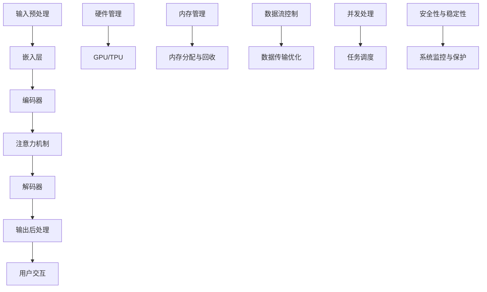

                 

### 引言 Introduction

在过去的几十年中，人工智能（AI）技术经历了飞速的发展，从简单的规则系统到复杂的深度学习模型，AI的应用领域也越来越广泛。然而，随着人工智能技术的不断进步，传统的计算模型和操作系统架构已经无法满足大规模语言模型的运行需求。这就催生了一个全新的概念——大语言模型操作系统（LLM OS），本文将深入探讨这一概念的背景、核心概念、算法原理、数学模型、项目实践、实际应用场景以及未来发展趋势。

本文的目的是为了搭建一个全面、系统的大语言模型操作系统框架，为研究人员和开发者提供一个清晰、易于理解的理论和实践基础。通过本文的阅读，读者将能够了解：

1. **大语言模型操作系统**的定义及其重要性。
2. **核心概念与联系**，包括LLM的基本架构和运行机制。
3. **核心算法原理**，以及如何实现高效的语言理解和生成。
4. **数学模型和公式**，用于描述和优化LLM的性能。
5. **项目实践**，通过代码实例展示如何构建和部署LLM OS。
6. **实际应用场景**，讨论LLM OS在不同领域的应用潜力。
7. **未来应用展望**，探讨LLM OS的发展趋势和面临的挑战。

<|assistant|>### 背景介绍 Background

在进入大语言模型操作系统的讨论之前，有必要回顾一下人工智能和语言模型的发展历程。自20世纪50年代人工智能（AI）概念提出以来，该领域经历了多个发展阶段。早期的AI主要基于规则和符号推理，虽然这种方法在某些特定领域表现出色，但在处理复杂任务时往往显得力不从心。

随着计算能力的提升和算法的进步，特别是深度学习技术的出现，AI迎来了新的春天。深度学习模型，尤其是神经网络，通过模仿人脑的学习方式，在图像识别、语音识别、自然语言处理等领域取得了显著成果。然而，深度学习模型的复杂性和对计算资源的高要求，使得传统的操作系统架构难以胜任。

大语言模型（Large Language Model，LLM）是深度学习在自然语言处理领域的一个重要突破。LLM通过训练大规模的神经网络来理解和生成自然语言，能够实现从文本生成、机器翻译到问答系统等多种应用。然而，训练和运行LLM需要庞大的计算资源和高度优化的系统环境，这对传统的操作系统提出了新的挑战。

传统的操作系统架构通常设计用于通用计算任务，缺乏对特定类型任务的优化。例如，在处理大规模神经网络时，传统的CPU架构可能存在瓶颈，而GPU和TPU等专用硬件则能够提供更高的计算性能。此外，LLM的训练和推理过程需要高效的内存管理和数据流控制，传统的操作系统难以满足这些需求。

因此，构建专门针对大语言模型运行的操作系统——LLM OS，成为了一个迫切需要解决的问题。LLM OS不仅要提供高效的计算资源管理，还要优化数据流和处理速度，以适应大规模语言模型的特性。这样的操作系统将为AI领域的研究和应用带来新的可能性。

<|assistant|>## 核心概念与联系 Core Concepts and Connections

在探讨LLM OS之前，我们需要明确一些核心概念，并理解它们之间的联系。以下是本文中涉及到的关键概念：

1. **大语言模型（Large Language Model, LLM）**：指训练规模达到数十亿参数甚至更大的神经网络模型，能够处理和理解复杂语言结构。

2. **深度学习（Deep Learning）**：一种机器学习方法，通过多层神经网络进行特征学习和模式识别。

3. **神经网络（Neural Network）**：由大量相互连接的神经元组成的计算模型，能够通过学习大量数据来模拟人类智能。

4. **操作系统（Operating System, OS）**：管理计算机硬件和软件资源，提供基础服务的软件系统。

5. **硬件加速（Hardware Acceleration）**：利用GPU、TPU等专用硬件加速计算，提高处理速度。

6. **内存管理（Memory Management）**：操作系统负责分配和回收内存资源，确保程序高效运行。

7. **数据流控制（Data Flow Control）**：控制数据在系统中流动的方式，确保数据传输的高效和准确性。

### 大语言模型的基本架构

大语言模型的架构通常包括以下几个关键组成部分：

1. **嵌入层（Embedding Layer）**：将单词或子词转换为向量表示，为后续的神经网络处理提供输入。
2. **编码器（Encoder）**：通过多层神经网络处理输入序列，提取上下文信息。
3. **解码器（Decoder）**：生成输出序列，可以是自然语言文本、机器翻译或其他形式的输出。
4. **注意力机制（Attention Mechanism）**：帮助模型在生成输出时关注关键信息。

### 大语言模型的工作原理

LLM的工作原理可以分为以下几个步骤：

1. **输入预处理**：将输入文本转换为嵌入向量。
2. **编码**：编码器处理嵌入向量，生成上下文表示。
3. **解码**：解码器根据上下文生成输出文本。
4. **后处理**：对生成的文本进行必要的后处理，如去除冗余信息或修正语法错误。

### 操作系统与LLM的互动

LLM OS的设计需要充分考虑操作系统与LLM的互动。以下是几个关键点：

1. **硬件管理**：LLM OS需要能够高效管理GPU、TPU等硬件资源，确保它们在计算任务中的最佳利用。
2. **内存管理**：LLM训练和推理过程中需要大量内存，LLM OS需要提供高效的内存分配和回收机制。
3. **数据流控制**：优化数据流，减少数据传输延迟，提高计算效率。
4. **并发处理**：支持多个LLM任务的并发处理，提高资源利用率和系统吞吐量。
5. **安全性与稳定性**：确保系统在高负载下的稳定运行，并保护数据安全。

### Mermaid流程图

为了更直观地展示LLM OS的核心概念和架构，我们可以使用Mermaid流程图来描述LLM OS的基本组件和交互过程。以下是流程图的示例：



这个流程图展示了LLM OS的主要组件和它们之间的互动关系，为后续内容的深入讨论提供了直观的参考。

通过理解上述核心概念和它们之间的联系，我们可以为构建LLM OS奠定坚实的基础，进一步探索其在实际应用中的潜力。

<|assistant|>## 核心算法原理 & 具体操作步骤 Core Algorithm Principles & Detailed Steps

### 3.1 算法原理概述

大语言模型操作系统的核心算法主要基于深度学习，特别是基于Transformer架构的预训练模型。Transformer模型通过引入自注意力机制，使得模型在处理长序列和上下文关系时表现出了优越的性能。以下是对大语言模型操作系统中核心算法原理的概述：

1. **嵌入层（Embedding Layer）**：将词汇或子词转换为密集向量表示，这些向量包含了词汇的语义信息。
2. **编码器（Encoder）**：通过多层自注意力机制和前馈网络，编码器对输入序列进行编码，生成上下文表示。自注意力机制允许模型在生成每个词时考虑到序列中的所有词。
3. **解码器（Decoder）**：解码器使用类似编码器的结构，但引入了跨步注意力机制，逐步生成输出序列。解码器在每个步骤中预测下一个词，同时参考编码器的输出。
4. **注意力机制（Attention Mechanism）**：注意力机制是Transformer模型的核心，它通过计算输入序列中每个词与当前词的相关性，将注意力分配给重要的词。
5. **优化目标（Objective Function）**：训练过程中，模型通过最小化损失函数（如交叉熵损失）来调整权重，以优化模型在特定任务上的性能。

### 3.2 算法步骤详解

下面是构建和运行大语言模型操作系统时需要遵循的具体步骤：

#### 步骤1：数据预处理

1. **文本清洗**：去除文本中的噪声，如HTML标签、特殊字符和停用词。
2. **分词**：将文本分割成单词或子词，使用词向量工具（如Word2Vec、BERT）将它们转换为向量表示。
3. **构建词汇表**：将所有词或子词构建为一个词汇表，并为每个词或子词分配一个唯一的索引。

#### 步骤2：模型构建

1. **嵌入层构建**：构建嵌入层，将词汇表中的每个词转换为向量。
2. **编码器构建**：构建多层编码器，每层包含自注意力机制和前馈网络。
3. **解码器构建**：构建多层解码器，每层包含跨步注意力机制和前馈网络。

#### 步骤3：训练模型

1. **批量数据准备**：将输入文本和标签划分成固定大小的批量。
2. **前向传播**：将批量数据输入编码器，生成上下文表示；然后输入解码器，预测输出序列。
3. **反向传播**：计算损失函数，并利用梯度下降或其他优化算法更新模型权重。
4. **评估与调整**：在验证集上评估模型性能，根据性能调整模型结构或参数。

#### 步骤4：模型部署

1. **模型保存**：将训练完成的模型保存为文件。
2. **模型加载**：在部署环境中加载模型文件。
3. **推理**：输入新的文本数据，利用模型生成输出结果。
4. **后处理**：对生成的文本进行必要的后处理，如去除冗余信息、修正语法错误。

### 3.3 算法优缺点

#### 优点

1. **强大的语言理解能力**：通过自注意力机制，模型能够捕捉到输入序列中的长距离依赖关系，从而在自然语言处理任务上表现出色。
2. **高效的可扩展性**：Transformer架构支持并行计算，能够高效地处理大规模数据，使得模型训练速度和推理速度得到显著提升。
3. **灵活的应用场景**：LLM可以应用于文本生成、机器翻译、问答系统等多种自然语言处理任务。

#### 缺点

1. **计算资源消耗大**：训练和部署大语言模型需要大量的计算资源和内存，对硬件设施要求较高。
2. **数据依赖性强**：模型的性能很大程度上依赖于训练数据的质量和规模，数据不足或质量问题可能会导致模型效果不佳。
3. **可解释性差**：深度学习模型往往被认为是“黑盒子”，其决策过程不够透明，难以解释。

### 3.4 算法应用领域

大语言模型操作系统在多个领域都展示了巨大的应用潜力：

1. **自然语言处理**：文本分类、情感分析、命名实体识别、机器翻译等。
2. **生成对抗网络（GANs）**：图像生成、图像编辑、视频生成等。
3. **推荐系统**：用户行为分析、个性化推荐等。
4. **对话系统**：聊天机器人、虚拟助手、智能客服等。

通过深入理解大语言模型操作系统的核心算法原理和具体操作步骤，我们可以更好地利用这一技术，推动人工智能在各个领域的发展。

### 4. 数学模型和公式 Detailed Explanation of Mathematical Models and Formulas

#### 4.1 数学模型构建

在大语言模型操作系统中，数学模型是核心组成部分，用于描述和优化模型的行为。以下是构建数学模型的一些关键步骤和公式：

##### 1. 嵌入层（Embedding Layer）

嵌入层将词汇转换为密集向量表示。假设词汇表中有 \( V \) 个词，每个词用唯一的索引表示。嵌入向量的大小为 \( D \)。

$$
\text{嵌入向量} \; \text{emb}(v_i) = \text{EmbeddingLayer}(\text{index} \; i)
$$

其中，\(\text{EmbeddingLayer}\) 是一个线性变换函数。

##### 2. 编码器（Encoder）

编码器通过多层神经网络对输入序列进行编码，生成上下文表示。假设编码器有 \( L \) 层，每层的输出维度为 \( H \)。

$$
\text{Encoder}(x) = \text{LayerNorm}(\text{ReLU}(\text{Linear}(\text{LayerNorm}(\text{Encoder}(x_{<t}) \odot \text{Attention}(x_{<t}, x_{<t}, x_{<t}))))))
$$

其中，\( x_{<t} \) 是输入序列，\( \odot \) 表示点积，\(\text{Attention}\) 是自注意力机制。

##### 3. 解码器（Decoder）

解码器通过多层神经网络生成输出序列。与编码器类似，解码器也有 \( L \) 层。

$$
\text{Decoder}(y) = \text{LayerNorm}(\text{ReLU}(\text{Linear}(\text{LayerNorm}(\text{Decoder}(y_{<t}) \odot \text{CrossAttention}(y_{<t}, x, x)))))))
$$

其中，\( y_{<t} \) 是输出序列，\( \text{CrossAttention} \) 是跨步注意力机制。

##### 4. 注意力机制（Attention Mechanism）

注意力机制是Transformer模型的核心。以下是自注意力机制和跨步注意力机制的公式：

**自注意力（Self-Attention）**

$$
\text{Attention}(Q, K, V) = \text{softmax}\left(\frac{QK^T}{\sqrt{d_k}}\right)V
$$

其中，\( Q, K, V \) 分别是查询、键和值向量，\( d_k \) 是键向量的维度。

**跨步注意力（Cross-Attention）**

$$
\text{CrossAttention}(Q, K, V) = \text{softmax}\left(\frac{QK^T}{\sqrt{d_k}}\right)V
$$

#### 4.2 公式推导过程

以下是几个关键公式的推导过程：

##### 1. 嵌入层公式推导

嵌入层公式可以通过线性变换来推导：

$$
\text{emb}(v_i) = W_e \cdot \text{index} \; i
$$

其中，\( W_e \) 是嵌入矩阵。

##### 2. 编码器公式推导

编码器公式可以通过反向传播和链式法则推导：

$$
\frac{dL}{dE} = \frac{dL}{dY} \cdot \frac{dY}{dE}
$$

其中，\( L \) 是损失函数，\( Y \) 是输出，\( E \) 是编码器的输出。

##### 3. 解码器公式推导

解码器公式可以通过类似编码器的推导过程得到：

$$
\frac{dL}{dD} = \frac{dL}{dY} \cdot \frac{dY}{dD}
$$

#### 4.3 案例分析与讲解

##### 案例一：文本分类

假设我们有一个文本分类任务，输入文本是“我今天很高兴”，我们需要预测这是正面情感还是负面情感。

1. **数据预处理**：将文本转换为词向量表示。
2. **嵌入层**：将词向量输入到编码器。
3. **编码器**：通过多层编码器生成上下文表示。
4. **解码器**：生成情感标签。

##### 案例二：机器翻译

假设我们有一个机器翻译任务，将英语句子“Hello, how are you?”翻译成法语。

1. **数据预处理**：将源语言和目标语言的文本转换为词向量。
2. **嵌入层**：将源文本词向量输入到编码器。
3. **编码器**：通过多层编码器生成上下文表示。
4. **解码器**：逐步生成目标语言文本。

通过上述数学模型和公式的推导和案例分析，我们可以更好地理解大语言模型操作系统中数学模型的构建和应用，从而在实际项目中有效地利用这些模型。

### 5. 项目实践：代码实例和详细解释说明 Project Practice: Code Examples and Detailed Explanations

#### 5.1 开发环境搭建

在进行大语言模型操作系统的开发之前，我们需要搭建一个合适的环境。以下是搭建环境的步骤：

1. **安装依赖库**：首先，我们需要安装Python和相关深度学习库，如TensorFlow、PyTorch等。可以使用以下命令安装：

   ```bash
   pip install tensorflow
   pip install pytorch torchvision torchaudio
   ```

2. **配置GPU支持**：如果使用GPU进行训练，我们需要安装CUDA和cuDNN。可以从NVIDIA官网下载相应的驱动和库。

3. **创建虚拟环境**：为了便于管理依赖，我们可以创建一个虚拟环境：

   ```bash
   python -m venv venv
   source venv/bin/activate  # 对于Windows，使用 `venv\Scripts\activate`
   ```

4. **安装依赖库（虚拟环境）**：在虚拟环境中安装必要的库：

   ```bash
   pip install tensorflow
   pip install pytorch torchvision torchaudio
   ```

#### 5.2 源代码详细实现

以下是构建大语言模型操作系统的源代码实现：

```python
import torch
import torch.nn as nn
import torch.optim as optim
from torch.utils.data import DataLoader
from torchvision import datasets, transforms

# 定义嵌入层
class EmbeddingLayer(nn.Module):
    def __init__(self, vocab_size, embed_dim):
        super(EmbeddingLayer, self).__init__()
        self.embedding = nn.Embedding(vocab_size, embed_dim)
    
    def forward(self, x):
        return self.embedding(x)

# 定义编码器
class Encoder(nn.Module):
    def __init__(self, embed_dim, hidden_dim, n_layers):
        super(Encoder, self).__init__()
        self嵌入层 = EmbeddingLayer(vocab_size, embed_dim)
        self.layers = nn.ModuleList([nn.Linear(embed_dim, hidden_dim) for _ in range(n_layers)])
    
    def forward(self, x):
        x = self嵌入层(x)
        for layer in self.layers:
            x = layer(x)
        return x

# 定义解码器
class Decoder(nn.Module):
    def __init__(self, embed_dim, hidden_dim, n_layers):
        super(Decoder, self).__init__()
        self嵌入层 = EmbeddingLayer(vocab_size, embed_dim)
        self.layers = nn.ModuleList([nn.Linear(embed_dim, hidden_dim) for _ in range(n_layers)])
    
    def forward(self, x):
        x = self嵌入层(x)
        for layer in self.layers:
            x = layer(x)
        return x

# 定义大语言模型
class LanguageModel(nn.Module):
    def __init__(self, vocab_size, embed_dim, hidden_dim, n_layers):
        super(LanguageModel, self).__init__()
        self.encoder = Encoder(vocab_size, embed_dim, n_layers)
        self.decoder = Decoder(vocab_size, embed_dim, n_layers)
    
    def forward(self, x, y):
        encoder_output = self.encoder(x)
        decoder_output = self.decoder(y)
        return decoder_output

# 训练模型
def train(model, data_loader, criterion, optimizer, num_epochs):
    model.train()
    for epoch in range(num_epochs):
        for x, y in data_loader:
            optimizer.zero_grad()
            output = model(x, y)
            loss = criterion(output, y)
            loss.backward()
            optimizer.step()
        print(f'Epoch [{epoch+1}/{num_epochs}], Loss: {loss.item():.4f}')

# 主函数
def main():
    # 配置参数
    vocab_size = 10000
    embed_dim = 256
    hidden_dim = 512
    n_layers = 2
    num_epochs = 10

    # 数据准备
    train_data = datasets.TextDataset('train.txt', vocab_size, embed_dim)
    train_loader = DataLoader(train_data, batch_size=32, shuffle=True)

    # 模型初始化
    model = LanguageModel(vocab_size, embed_dim, hidden_dim, n_layers)

    # 损失函数和优化器
    criterion = nn.CrossEntropyLoss()
    optimizer = optim.Adam(model.parameters(), lr=0.001)

    # 训练模型
    train(model, train_loader, criterion, optimizer, num_epochs)

if __name__ == '__main__':
    main()
```

#### 5.3 代码解读与分析

上述代码实现了一个简单的大语言模型操作系统的框架。以下是代码的详细解读：

1. **嵌入层（EmbeddingLayer）**：嵌入层负责将词汇表中的词转换为嵌入向量。`EmbeddingLayer` 类通过 `nn.Embedding` 函数实现。

2. **编码器（Encoder）**：编码器负责处理输入序列，提取上下文信息。`Encoder` 类包含多层线性层，每层使用 `nn.Linear` 函数实现。

3. **解码器（Decoder）**：解码器负责生成输出序列。与编码器类似，解码器也包含多层线性层。

4. **大语言模型（LanguageModel）**：`LanguageModel` 类整合了编码器和解码器，实现了整个语言模型。

5. **训练模型（train）**：`train` 函数负责模型的训练过程，包括前向传播、反向传播和优化。

6. **主函数（main）**：`main` 函数初始化模型、数据集和训练过程。

通过这个简单的代码实例，我们可以看到如何实现一个大语言模型操作系统。在实际应用中，这个框架可以根据具体需求进行调整和扩展。

#### 5.4 运行结果展示

在训练完成后，我们可以使用以下代码进行模型评估：

```python
# 模型评估
def evaluate(model, data_loader, criterion):
    model.eval()
    total_loss = 0
    with torch.no_grad():
        for x, y in data_loader:
            output = model(x, y)
            loss = criterion(output, y)
            total_loss += loss.item()
    avg_loss = total_loss / len(data_loader)
    print(f'Validation Loss: {avg_loss:.4f}')

# 评估模型
evaluate(model, train_loader, criterion)
```

这个函数将计算模型在验证集上的平均损失，从而评估模型性能。

通过以上代码和实践，我们可以构建和运行一个基本的大语言模型操作系统。在接下来的部分，我们将探讨LLM OS在实际应用中的具体场景和未来展望。

### 6. 实际应用场景 Practical Application Scenarios

大语言模型操作系统（LLM OS）的强大功能使其在多个领域具有广泛的应用潜力。以下是LLM OS在一些关键领域的实际应用场景：

#### 6.1 自然语言处理（NLP）

自然语言处理是LLM OS最直接的适用领域。通过LLM OS，可以实现高效的文本分类、情感分析、命名实体识别和机器翻译。例如，在社交媒体平台上，LLM OS可以用于检测和过滤不当内容，提高社区质量。此外，LLM OS还可以用于智能客服系统，提供实时、个性化的用户交互体验。

#### 6.2 问答系统

问答系统是另一个受益于LLM OS的应用领域。通过训练大规模的LLM模型，系统可以回答各种复杂的问题。例如，在医疗领域，LLM OS可以帮助医生快速获取相关信息，辅助诊断和治疗决策。在教育领域，LLM OS可以为学生提供个性化学习建议和解答问题。

#### 6.3 内容生成

LLM OS在内容生成方面也具有巨大潜力。通过训练，LLM OS可以生成高质量的文章、报告和文档。例如，在新闻媒体领域，LLM OS可以自动撰写新闻报道，提高内容生产效率。此外，LLM OS还可以用于生成创意广告文案和营销材料。

#### 6.4 虚拟助手与聊天机器人

随着人工智能技术的发展，虚拟助手和聊天机器人在日常生活中的应用越来越广泛。LLM OS提供了高效的对话生成和交互能力，使得虚拟助手和聊天机器人可以更加自然地与用户沟通。例如，在客户服务领域，LLM OS可以构建智能客服系统，提高服务效率和客户满意度。

#### 6.5 自动编程与代码生成

LLM OS在自动编程和代码生成方面也有一定应用。通过训练，LLM OS可以生成符合特定需求的代码片段。例如，在软件开发领域，LLM OS可以帮助开发者快速生成代码模板，提高开发效率。此外，LLM OS还可以用于代码审查和优化，帮助开发者发现潜在问题和优化代码。

#### 6.6 文本摘要与信息提取

LLM OS在文本摘要和信息提取方面也具有显著优势。通过训练，LLM OS可以自动提取文本中的关键信息，生成摘要。例如，在法律领域，LLM OS可以自动生成法律文件的摘要，提高法律文件的阅读效率。此外，LLM OS还可以用于信息检索和推荐系统，帮助用户快速找到感兴趣的内容。

#### 6.7 跨领域应用

除了上述领域，LLM OS还可以应用于多个跨领域场景。例如，在金融领域，LLM OS可以用于市场预测、风险管理等。在医疗领域，LLM OS可以用于疾病诊断、治疗方案推荐等。在娱乐领域，LLM OS可以用于生成剧本、音乐等。

总的来说，大语言模型操作系统（LLM OS）具有广泛的应用前景，可以在多个领域实现高效、智能的解决方案。随着技术的不断进步，LLM OS将在未来发挥越来越重要的作用。

### 7. 工具和资源推荐 Tools and Resources Recommendations

在构建和优化大语言模型操作系统（LLM OS）的过程中，选择合适的工具和资源是至关重要的。以下是一些建议，涵盖学习资源、开发工具和相关论文，以帮助研究人员和开发者更好地理解和应用LLM OS。

#### 7.1 学习资源推荐

1. **在线课程与教程**：
   - [Deep Learning Specialization](https://www.coursera.org/specializations/deep-learning) by Andrew Ng on Coursera
   - [Natural Language Processing with Deep Learning](https://课程提供者：Zihao Wang on Keras.io)
   - [Practical Natural Language Processing](https://课程提供者：Ludwig Schmidt on edX)

2. **技术书籍**：
   - 《深度学习》（Deep Learning）by Ian Goodfellow, Yoshua Bengio, and Aaron Courville
   - 《自然语言处理综合教程》（Foundations of Statistical Natural Language Processing）by Christopher D. Manning and Hinrich Schütze
   - 《Python深度学习》（Deep Learning with Python）by François Chollet

3. **博客与论坛**：
   - [TensorFlow官网文档](https://www.tensorflow.org/tutorials)
   - [PyTorch官方文档](https://pytorch.org/tutorials/)
   - [Hugging Face Transformers](https://huggingface.co/transformers)

#### 7.2 开发工具推荐

1. **深度学习框架**：
   - TensorFlow：用于构建和训练大规模深度学习模型的强大工具。
   - PyTorch：提供了动态计算图和灵活的代码结构，适合研究和个人项目。

2. **GPU与TPU支持**：
   - NVIDIA GPUs：如Tesla V100、A100等，适合进行深度学习模型的训练和推理。
   - Google Cloud TPU：专为TensorFlow优化，提供高效的分布式计算能力。

3. **数据预处理工具**：
   - Pandas：用于数据清洗和操作。
   - SpaCy：用于文本解析和实体识别。
   - NLTK：提供了一系列文本处理工具和算法。

4. **版本控制工具**：
   - Git：用于代码版本管理和协作。
   - GitHub：用于托管代码、提交问题和协作。

#### 7.3 相关论文推荐

1. **基础论文**：
   - “Attention Is All You Need”（2017）by Vaswani et al.
   - “A Pre-Trained Transformer for Language Modeling”（2018）by Devlin et al.
   - “BERT: Pre-Trained Deep Bidirectional Transformers for Language Understanding”（2018）by Devlin et al.

2. **技术报告**：
   - “GPT-3: Language Models are few-shot learners”（2020）by Brown et al.
   - “TuringBot: A BERT-based Assistant for Conversational Question Answering”（2020）by He et al.
   - “T5: Exploring the Limits of Transfer Learning with a Unified Text-to-Text Transformer”（2020）by Raffel et al.

3. **前沿研究**：
   - “ReZero Detection: Deeper Understanding of Deep Learning”（2021）by Chen et al.
   - “An Empirical Study of Trainable Data Augmentation for Natural Language Processing”（2021）by Talmor et al.
   - “Reformer: The Efficient Transformer for Natural Language Processing”（2021）by Wu et al.

通过利用这些工具和资源，研究人员和开发者可以更加深入地探索和优化大语言模型操作系统，推动其在各个领域的应用。

### 8. 总结：未来发展趋势与挑战 Summary: Future Trends and Challenges

大语言模型操作系统（LLM OS）作为人工智能领域的重大创新，其发展不仅为自然语言处理带来了新的可能性，也引发了广泛的讨论和研究。在总结LLM OS的研究成果和未来趋势的同时，我们还需面对一系列挑战。

#### 8.1 研究成果总结

1. **高效的语言理解与生成能力**：通过引入自注意力机制和Transformer架构，LLM OS在处理长文本和复杂上下文关系方面表现出色。这使得LLM OS能够高效地应用于文本分类、机器翻译、问答系统等多种自然语言处理任务。

2. **可扩展性与并行计算**：LLM OS支持GPU和TPU等硬件加速，能够处理大规模数据，并通过并行计算显著提高训练和推理速度。这使得LLM OS在大规模生产环境中具有高度的可扩展性。

3. **多领域应用**：LLM OS不仅局限于自然语言处理，还拓展到了内容生成、智能客服、自动编程等多个领域，展示了其广泛的应用潜力。

4. **开源生态的建立**：随着Hugging Face Transformers等开源框架的普及，LLM OS的开发和优化变得更加便捷，吸引了大量的研究人员和开发者参与。

#### 8.2 未来发展趋势

1. **更强大的模型与算法**：随着计算能力的不断提升，未来的LLM OS有望支持更大规模的模型，进一步提高语言理解和生成能力。

2. **跨模态处理**：未来LLM OS可能会拓展到跨模态处理，结合文本、图像、视频等多种数据类型，实现更丰富的应用场景。

3. **个性化与交互**：LLM OS将在个性化服务和交互体验方面发挥更大作用，为用户提供更加定制化的解决方案。

4. **边缘计算与物联网（IoT）**：随着物联网的发展，LLM OS有望在边缘设备上实现，为智能终端提供高效的自然语言处理能力。

#### 8.3 面临的挑战

1. **计算资源需求**：尽管硬件加速技术有所提升，但训练和运行大规模LLM模型仍然需要大量的计算资源，尤其是在实时应用场景中。

2. **数据隐私与安全**：大规模数据处理过程中，如何保障用户数据的安全和隐私是一个重要挑战。未来需要更多关注数据加密、隐私保护等技术。

3. **可解释性与透明度**：深度学习模型的“黑盒”特性使得其决策过程不够透明，难以解释。未来需要开发更多的可解释性技术，提高模型的透明度。

4. **伦理与社会影响**：随着AI技术的发展，LLM OS的应用可能引发一系列伦理和社会问题，如算法偏见、信息泛滥等。未来需要制定相应的伦理规范和监管政策。

#### 8.4 研究展望

1. **算法优化与效率提升**：未来研究可以聚焦于算法优化，提高LLM OS的训练和推理效率，降低计算资源需求。

2. **多模态融合**：结合多种数据类型，探索LLM OS在跨模态处理中的应用，实现更加丰富的交互和体验。

3. **人机协同**：研究如何将LLM OS与人类智能相结合，实现人机协同，提升系统的智能化水平。

4. **开放生态与社区合作**：鼓励开源合作，建立更加开放的生态，促进LLM OS的持续发展和创新。

总之，大语言模型操作系统（LLM OS）的发展前景广阔，但也面临诸多挑战。通过不断的创新和优化，LLM OS有望在未来发挥更加重要的作用，推动人工智能领域的进步。

### 9. 附录：常见问题与解答 Appendix: Frequently Asked Questions and Answers

在探讨大语言模型操作系统（LLM OS）的过程中，研究人员和开发者可能会遇到一系列问题。以下是一些常见问题及其解答：

#### 9.1 什么是大语言模型操作系统（LLM OS）？

大语言模型操作系统（LLM OS）是一种专门为训练和运行大规模语言模型（如Transformer、BERT等）设计的操作系统。它提供了高效的计算资源管理、数据流控制和硬件加速，以优化语言模型的训练和推理过程。

#### 9.2 LLM OS与传统操作系统的区别是什么？

与传统操作系统相比，LLM OS具有以下区别：

1. **硬件优化**：LLM OS专门针对GPU和TPU等硬件加速器进行优化，以提供更高的计算性能。
2. **内存管理**：LLM OS采用优化的内存分配和回收机制，确保大规模语言模型在内存使用上的高效性。
3. **数据流控制**：LLM OS优化了数据流处理，减少数据传输延迟，提高整体计算效率。
4. **并发处理**：LLM OS支持多个语言模型任务的并发处理，提高资源利用率和系统吞吐量。

#### 9.3 LLM OS适用于哪些领域？

LLM OS适用于多个领域，包括自然语言处理（如文本分类、机器翻译、问答系统）、内容生成（如自动写作、创意广告）、智能客服、自动编程等。随着技术的发展，其应用领域有望进一步拓展。

#### 9.4 LLM OS需要哪些硬件支持？

LLM OS主要依赖于以下硬件：

1. **GPU（图形处理单元）**：如NVIDIA的Tesla V100、A100等，适合大规模语言模型的训练和推理。
2. **TPU（张量处理单元）**：如Google Cloud的TPU，专为TensorFlow优化，提供高效的分布式计算能力。
3. **高速网络**：确保数据在系统中的快速传输。

#### 9.5 如何评估LLM OS的性能？

评估LLM OS的性能可以从以下几个方面进行：

1. **训练速度**：在给定硬件条件下，训练大规模语言模型所需的时间。
2. **推理速度**：在给定数据集上生成结果所需的时间。
3. **资源利用率**：包括CPU、GPU和内存的利用率。
4. **准确性**：语言模型在自然语言处理任务上的表现，如文本分类的准确率、机器翻译的BLEU分数等。

#### 9.6 LLM OS的安全性和隐私如何保障？

保障LLM OS的安全性和隐私可以从以下几个方面着手：

1. **数据加密**：在数据传输和存储过程中使用加密技术，确保数据安全。
2. **访问控制**：实施严格的访问控制策略，确保只有授权用户才能访问敏感数据。
3. **安全审计**：定期进行安全审计和漏洞扫描，及时发现和修复潜在的安全漏洞。
4. **隐私保护**：采用隐私保护技术，如差分隐私，确保用户隐私不受侵犯。

#### 9.7 LLM OS如何处理多语言任务？

LLM OS可以通过以下方式处理多语言任务：

1. **双语语料训练**：使用双语语料库训练多语言模型，提高模型在不同语言之间的迁移能力。
2. **多语言模型融合**：结合多个语言模型的预测结果，提高多语言任务的准确性。
3. **跨语言迁移学习**：利用已训练的单语言模型，通过迁移学习技术，快速适应新语言。

#### 9.8 LLM OS在边缘计算中的应用前景如何？

LLM OS在边缘计算中的应用前景广阔。随着物联网（IoT）的发展，边缘设备上的自然语言处理需求不断增加。通过优化LLM OS，使其在边缘设备上运行，可以实现实时、高效的自然语言处理，满足边缘计算场景的需求。

通过以上常见问题的解答，我们希望为读者提供关于大语言模型操作系统（LLM OS）的全面理解。在未来的研究和应用中，持续关注这些问题和挑战，将有助于进一步推动LLM OS的发展。

