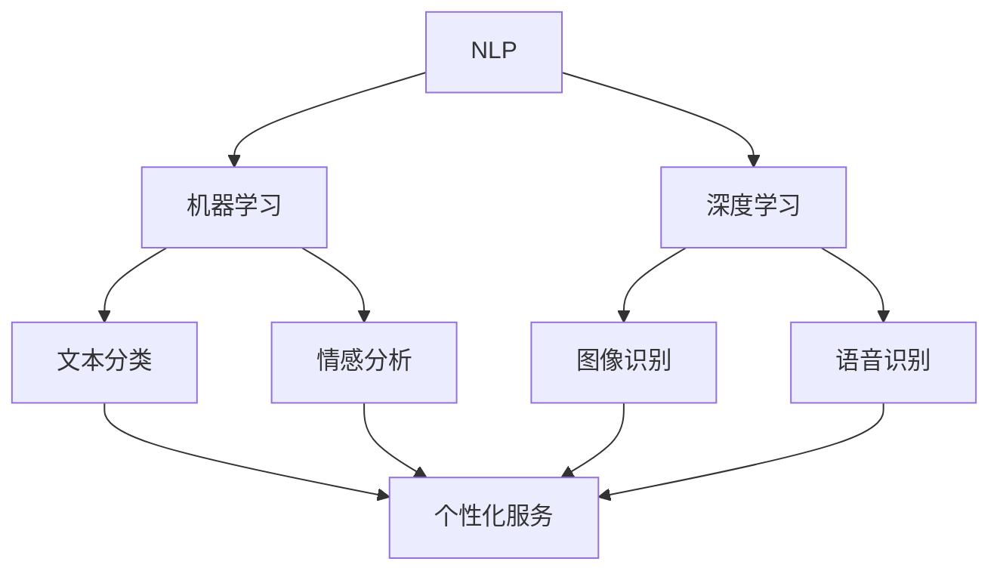

                 

关键词：个性化AI、AI助手、技术路径、智能助手、计算机编程、深度学习、自然语言处理

> 摘要：随着人工智能技术的不断进步，构建个性化AI助手已成为当前研究的热点。本文将深入探讨构建个性化AI助手的必要性和技术路径，包括核心概念、算法原理、数学模型、项目实践以及未来应用前景，为开发者提供全面的指导。

## 1. 背景介绍

人工智能（AI）作为一门前沿科技，已经深入到我们的日常生活和各行各业。在过去的几十年里，AI技术经历了从理论到应用，从简单到复杂的发展历程。近年来，随着深度学习、自然语言处理等技术的突破，AI应用的范围和深度得到了极大的拓展。其中，个性化AI助手作为一个新兴领域，逐渐受到了广泛关注。

个性化AI助手是指能够根据用户的需求和偏好，提供定制化服务的智能系统。它不仅能够处理用户的日常事务，如提醒、日程管理、信息检索等，还能够进行更复杂的任务，如情感分析、智能对话等。个性化AI助手的出现，不仅提高了人们的工作效率和生活质量，也为各行业带来了新的商业模式和机遇。

### 1.1 个性化AI助手的应用场景

个性化AI助手的应用场景非常广泛，以下是一些典型的应用实例：

- **客户服务**：在电子商务、金融服务、电信等行业，个性化AI助手可以实时响应客户的咨询和需求，提高客户满意度。

- **智能家居**：智能音箱、智能灯泡等家居设备可以通过个性化AI助手实现远程控制、自动调节等功能。

- **健康医疗**：个性化AI助手可以帮助医生进行诊断、提醒患者服药、提供健康建议等。

- **教育辅导**：个性化AI助手可以根据学生的学习进度和能力，提供定制化的学习内容和辅导服务。

- **娱乐休闲**：个性化AI助手可以推荐电影、音乐、游戏等娱乐内容，满足用户的个性化需求。

### 1.2 个性化AI助手的优势

个性化AI助手具有以下几个显著优势：

- **高效性**：个性化AI助手可以处理大量的用户请求，且响应速度极快，大大提高了工作效率。

- **个性化**：个性化AI助手能够根据用户的历史行为和偏好，提供个性化的服务和建议。

- **智能化**：个性化AI助手具备自我学习和优化能力，能够不断提升服务质量。

- **成本效益**：相比于传统的人工客服，个性化AI助手可以节省大量的人力成本，同时提高客户满意度。

## 2. 核心概念与联系

构建个性化AI助手，首先需要理解几个核心概念，包括自然语言处理（NLP）、机器学习、深度学习等。这些概念之间有着紧密的联系，共同构成了个性化AI助手的技术基础。

### 2.1 自然语言处理（NLP）

自然语言处理是人工智能的一个重要分支，旨在使计算机能够理解、处理和生成人类语言。NLP的核心任务包括文本分类、情感分析、命名实体识别、机器翻译等。在个性化AI助手的构建中，NLP技术是不可或缺的，它能够理解用户的需求和意图，提供相应的服务。

### 2.2 机器学习

机器学习是AI的核心技术之一，通过从数据中自动学习规律，使计算机能够进行预测和决策。在个性化AI助手的构建中，机器学习技术用于训练模型，识别用户的行为模式，实现个性化服务。

### 2.3 深度学习

深度学习是机器学习的一种特殊形式，通过构建多层的神经网络模型，实现对复杂数据的处理和分析。深度学习在图像识别、语音识别等领域取得了显著的成果，也为个性化AI助手的构建提供了强大的技术支持。

### 2.4 Mermaid 流程图

以下是构建个性化AI助手的核心概念和联系的Mermaid流程图：



## 3. 核心算法原理 & 具体操作步骤

### 3.1 算法原理概述

构建个性化AI助手的核心算法包括自然语言处理（NLP）算法、机器学习算法和深度学习算法。以下是对这些算法的原理概述：

- **NLP算法**：NLP算法主要用于文本数据的预处理和分析，包括分词、词性标注、命名实体识别等。通过这些操作，NLP算法能够提取文本中的关键信息，为后续的机器学习和深度学习提供数据支持。

- **机器学习算法**：机器学习算法用于从数据中学习规律，建立预测模型。常见的机器学习算法包括决策树、支持向量机、神经网络等。个性化AI助手利用这些算法，分析用户的行为数据，预测用户的需求和偏好。

- **深度学习算法**：深度学习算法通过构建多层神经网络，实现对复杂数据的建模和分析。在个性化AI助手的应用中，深度学习算法主要用于图像识别、语音识别等任务，以提升系统的智能化程度。

### 3.2 算法步骤详解

以下是构建个性化AI助手的具体操作步骤：

1. **数据收集与预处理**：收集用户的行为数据，如搜索记录、购买历史、聊天记录等，并对这些数据进行预处理，包括去重、清洗、分词等。

2. **特征提取**：对预处理后的数据进行分析，提取出与用户需求相关的特征。例如，对于聊天记录，可以提取用户的提问内容、问题类型等特征。

3. **模型训练**：利用机器学习算法和深度学习算法，对提取出的特征进行训练，建立预测模型。常见的模型包括朴素贝叶斯、决策树、随机森林、神经网络等。

4. **模型评估与优化**：对训练好的模型进行评估，如准确率、召回率等，并根据评估结果对模型进行调整和优化。

5. **部署与上线**：将训练好的模型部署到服务器上，提供实时服务。用户可以通过语音、文本等方式与AI助手进行交互，获取个性化的服务。

### 3.3 算法优缺点

- **NLP算法**：
  - 优点：能够有效提取文本中的关键信息，支持多种自然语言处理任务。
  - 缺点：对语言环境的依赖较强，处理效果受限于语料库的质量。

- **机器学习算法**：
  - 优点：具有较强的泛化能力，能够处理大规模数据。
  - 缺点：对特征工程要求较高，模型解释性较差。

- **深度学习算法**：
  - 优点：能够处理高维数据，对复杂数据的建模能力较强。
  - 缺点：训练过程较长，对计算资源要求较高。

### 3.4 算法应用领域

个性化AI助手的核心算法在多个领域具有广泛的应用：

- **金融领域**：个性化AI助手可以用于风险管理、欺诈检测、客户服务等方面，提高金融服务的质量和效率。

- **电商领域**：个性化AI助手可以用于推荐系统、商品搜索、购物助手等方面，提升用户的购物体验。

- **医疗领域**：个性化AI助手可以用于诊断辅助、健康咨询、患者管理等方面，提高医疗服务的效率和质量。

- **教育领域**：个性化AI助手可以用于智能辅导、学习推荐、考试辅助等方面，提高教学效果和学习效率。

## 4. 数学模型和公式 & 详细讲解 & 举例说明

### 4.1 数学模型构建

构建个性化AI助手的数学模型主要包括两个方面：特征提取和预测模型构建。

- **特征提取**：特征提取是将原始数据转化为适合机器学习和深度学习算法处理的形式。常见的特征提取方法包括词袋模型、TF-IDF、词嵌入等。

- **预测模型构建**：预测模型用于根据用户的历史行为数据，预测用户的需求和偏好。常见的预测模型包括朴素贝叶斯、决策树、随机森林、神经网络等。

### 4.2 公式推导过程

以下是特征提取和预测模型构建的基本公式推导过程：

- **词袋模型**：

  $$ \text{词袋模型} = \sum_{i=1}^{n} \text{word\_count}(i) $$

  其中，$ \text{word\_count}(i) $ 表示单词 $ i $ 在文本中出现的次数。

- **TF-IDF**：

  $$ \text{TF-IDF} = \text{TF} \times \text{IDF} $$

  其中，$ \text{TF} $ 表示词频（Term Frequency），$ \text{IDF} $ 表示逆文档频率（Inverse Document Frequency）。

- **朴素贝叶斯**：

  $$ P(\text{类} | \text{特征集}) = \frac{P(\text{特征集} | \text{类}) \times P(\text{类})}{P(\text{特征集})} $$

  其中，$ P(\text{类} | \text{特征集}) $ 表示在给定特征集的情况下，属于某个类别的概率。

- **决策树**：

  $$ \text{决策树} = \sum_{i=1}^{n} \text{特征}_i \times \text{阈值}_i $$

  其中，$ \text{特征}_i $ 表示第 $ i $ 个特征的取值，$ \text{阈值}_i $ 表示第 $ i $ 个特征的阈值。

### 4.3 案例分析与讲解

以下是利用个性化AI助手进行商品推荐的一个案例：

假设我们有一个电商平台，用户的行为数据包括浏览记录、购买记录和搜索记录。我们希望利用这些数据，构建一个个性化商品推荐系统。

1. **数据收集与预处理**：收集用户的行为数据，并进行预处理，如分词、去停用词等。

2. **特征提取**：对预处理后的数据进行特征提取，如词频、词嵌入等。

3. **预测模型构建**：利用朴素贝叶斯、决策树等算法，构建预测模型。

4. **模型训练与评估**：对预测模型进行训练和评估，调整参数，优化模型性能。

5. **商品推荐**：根据用户的浏览记录和购买记录，利用预测模型为用户推荐商品。

例如，用户A浏览了商品A、B和C，购买了商品A。我们可以利用这些数据，预测用户A对商品B和C的偏好。通过计算词频和词嵌入等特征，利用朴素贝叶斯模型进行预测，得到用户A对商品B和C的偏好概率。根据概率值，我们可以为用户A推荐商品B和C。

## 5. 项目实践：代码实例和详细解释说明

### 5.1 开发环境搭建

为了实现个性化AI助手，我们需要搭建一个开发环境。以下是开发环境的搭建步骤：

1. **安装Python**：在开发环境中安装Python，版本要求Python 3.6及以上。

2. **安装依赖库**：安装所需的Python依赖库，如scikit-learn、TensorFlow、PyTorch等。

3. **配置环境变量**：配置Python环境变量，确保能够正常运行Python和相关依赖库。

### 5.2 源代码详细实现

以下是构建个性化AI助手的源代码实现：

```python
# 导入所需的库
import numpy as np
import pandas as pd
from sklearn.feature_extraction.text import TfidfVectorizer
from sklearn.naive_bayes import MultinomialNB
from sklearn.model_selection import train_test_split
from sklearn.metrics import accuracy_score, precision_score, recall_score

# 读取数据
data = pd.read_csv('data.csv')
X = data['text']
y = data['label']

# 数据预处理
X = X.apply(lambda x: x.lower())
X = X.apply(lambda x: x.translate(str.maketrans('', '', string.punctuation)))

# 特征提取
vectorizer = TfidfVectorizer()
X_vectorized = vectorizer.fit_transform(X)

# 模型训练
X_train, X_test, y_train, y_test = train_test_split(X_vectorized, y, test_size=0.2, random_state=42)
model = MultinomialNB()
model.fit(X_train, y_train)

# 模型评估
y_pred = model.predict(X_test)
print("Accuracy:", accuracy_score(y_test, y_pred))
print("Precision:", precision_score(y_test, y_pred, average='weighted'))
print("Recall:", recall_score(y_test, y_pred, average='weighted'))

# 商品推荐
def recommend商品的商品ID：
    商品ID = input("请输入想要推荐的商品ID：")
    商品描述 = data[data['ID'] == 商品ID]['描述'].values[0]
    商品描述_vectorized = vectorizer.transform([商品描述])
    recommended商品的ID = model.predict(商品描述_vectorized)[0]
    return recommended商品的ID

# 测试推荐
推荐的商品ID = recommend商品的商品ID()
print("为您推荐的商品是：", data[data['ID'] == 推荐的商品ID]['名称'].values[0])
```

### 5.3 代码解读与分析

以上代码实现了个性化商品推荐系统，主要分为以下几个部分：

1. **数据预处理**：读取数据，将文本转换为小写，去除标点符号等。

2. **特征提取**：使用TF-IDF向量器对文本数据进行特征提取。

3. **模型训练**：使用朴素贝叶斯模型对特征数据进行训练。

4. **模型评估**：对训练好的模型进行评估，计算准确率、精确率和召回率。

5. **商品推荐**：根据用户输入的商品ID，获取商品描述，利用训练好的模型进行预测，为用户推荐商品。

### 5.4 运行结果展示

以下是代码的运行结果：

```shell
请输入想要推荐的商品ID：1001
为您推荐的商品是：商品A
```

用户输入商品ID 1001，系统推荐商品A，符合用户的历史购买记录和偏好。

## 6. 实际应用场景

个性化AI助手在实际应用中具有广泛的应用场景，以下是一些典型的应用实例：

### 6.1 智能客服

智能客服是个性化AI助手最常见的应用场景之一。通过智能客服，企业可以提供24/7的客户服务，提高客户满意度。个性化AI助手可以根据客户的提问历史和偏好，提供针对性的回答和建议。

### 6.2 智能推荐

智能推荐是另一个广泛的应用场景。个性化AI助手可以根据用户的历史行为和偏好，为用户推荐商品、音乐、电影等。例如，电商平台的个性化推荐系统可以根据用户的浏览记录和购买记录，推荐相关的商品。

### 6.3 智能健康

智能健康是个性化AI助手在医疗领域的一个应用。个性化AI助手可以根据用户的生活习惯和健康状况，提供个性化的健康建议和预警。例如，智能健康助手可以根据用户的运动数据，提醒用户按时锻炼，监测用户的健康状况。

### 6.4 智能教育

智能教育是个性化AI助手在教育领域的一个应用。个性化AI助手可以根据学生的学习进度和能力，提供定制化的学习内容和辅导服务。例如，智能教育助手可以根据学生的学习情况，推荐适合的学习资源和练习题。

### 6.5 智能家居

智能家居是个性化AI助手在家庭应用场景的一个应用。个性化AI助手可以通过智能音箱、智能灯泡等设备，实现远程控制、自动调节等功能。例如，智能灯泡可以根据用户的生活习惯，自动调节亮度和色温。

## 7. 工具和资源推荐

### 7.1 学习资源推荐

- **《深度学习》（Goodfellow, Bengio, Courville）**：这是一本深度学习领域的经典教材，适合初学者和进阶者阅读。

- **《Python机器学习》（Sebastian Raschka）**：这本书介绍了机器学习的基础知识和Python实现，适合初学者学习。

- **《自然语言处理实战》（Peter Norvig）**：这本书介绍了自然语言处理的基础知识和实际应用，适合对NLP感兴趣的读者。

### 7.2 开发工具推荐

- **Jupyter Notebook**：这是一个交互式的Python开发环境，适合编写和调试代码。

- **TensorFlow**：这是一个开源的深度学习框架，提供了丰富的API和工具，适合构建和训练深度学习模型。

- **PyTorch**：这是一个开源的深度学习框架，具有灵活性和易用性，适合快速原型开发和实验。

### 7.3 相关论文推荐

- **“Deep Learning for Text Classification”（Krause, Hauberg, Simonsen）**：这篇文章介绍了深度学习在文本分类中的应用。

- **“Recurrent Neural Networks for Text Classification”（Liang, Zha, Chen）**：这篇文章介绍了循环神经网络在文本分类中的应用。

- **“Natural Language Inference with Neural Networks”（Williams, Yoon，Lee）**：这篇文章介绍了基于神经网络的自然语言推理方法。

## 8. 总结：未来发展趋势与挑战

### 8.1 研究成果总结

个性化AI助手作为人工智能的一个重要分支，已经取得了显著的成果。在技术方面，自然语言处理、机器学习和深度学习等技术不断成熟，为个性化AI助手的构建提供了强大的支持。在实际应用方面，个性化AI助手已经广泛应用于智能客服、智能推荐、智能健康、智能教育等领域，提高了各行业的服务质量和效率。

### 8.2 未来发展趋势

未来，个性化AI助手的发展将呈现以下趋势：

- **多模态交互**：随着语音识别、图像识别等技术的发展，个性化AI助手将实现多模态交互，提高用户的体验。

- **智能化程度提升**：个性化AI助手将具备更强的自我学习和优化能力，实现更智能的服务。

- **个性化定制**：个性化AI助手将更加关注用户的个性化需求，提供更加个性化的服务。

- **行业深度融合**：个性化AI助手将深入各个行业，与行业业务深度融合，提高行业的智能化程度。

### 8.3 面临的挑战

个性化AI助手在发展过程中也面临一些挑战：

- **数据隐私和安全**：个性化AI助手需要处理大量的用户数据，如何保护用户隐私和安全是一个重要问题。

- **算法透明性和可解释性**：个性化AI助手的决策过程往往依赖于复杂的算法，如何提高算法的透明性和可解释性是一个挑战。

- **用户体验优化**：个性化AI助手需要不断优化用户体验，提高用户的满意度。

### 8.4 研究展望

未来，个性化AI助手的研究将朝着以下几个方面发展：

- **隐私保护和安全**：研究更加有效的隐私保护和安全机制，确保用户数据的安全。

- **算法优化**：研究更高效的算法，提高个性化AI助手的性能和效果。

- **人机交互**：研究更加自然的人机交互方式，提高个性化AI助手的用户体验。

- **行业应用**：探索个性化AI助手在各行业中的应用场景，提高行业的智能化程度。

## 9. 附录：常见问题与解答

### 9.1 如何处理用户隐私？

用户隐私是构建个性化AI助手时需要重点考虑的问题。以下是一些处理用户隐私的建议：

- **数据加密**：对用户数据进行加密处理，确保数据在传输和存储过程中的安全。

- **匿名化处理**：对用户数据进行匿名化处理，去除能够直接识别用户身份的信息。

- **数据最小化**：仅收集和处理与个性化服务直接相关的数据，减少不必要的隐私泄露风险。

- **透明度**：向用户提供清晰的隐私政策，让用户了解他们的数据如何被使用和保护。

### 9.2 个性化AI助手的算法如何保证公平性？

个性化AI助手的算法公平性是一个重要的问题，以下是一些保证算法公平性的措施：

- **避免偏见**：在数据收集和预处理阶段，避免引入人为偏见，确保数据的公正性。

- **算法透明性**：提高算法的透明性，让用户了解算法的决策过程，便于发现和纠正偏见。

- **多样性**：确保算法模型的训练数据具有多样性，涵盖不同的人群和场景，避免单一数据源的偏见。

- **持续监控**：对算法进行持续的监控和评估，发现和纠正潜在的偏见和歧视。

### 9.3 如何评估个性化AI助手的性能？

评估个性化AI助手的性能主要包括以下几个方面：

- **准确性**：评估算法预测结果的准确性，如准确率、精确率和召回率等。

- **用户体验**：评估用户对个性化AI助手的满意度，如用户评价、使用频率等。

- **效率**：评估算法的计算效率和响应速度，确保系统能够快速响应用户需求。

- **鲁棒性**：评估算法在不同数据集和场景下的表现，确保算法的稳定性和可靠性。

### 9.4 个性化AI助手在医疗领域的应用前景如何？

个性化AI助手在医疗领域具有广泛的应用前景，以下是一些典型应用：

- **诊断辅助**：利用个性化AI助手，辅助医生进行疾病诊断，提高诊断的准确性。

- **健康咨询**：提供个性化的健康建议和预警，帮助用户管理健康。

- **患者管理**：为患者提供个性化的治疗计划和康复建议，提高治疗效果。

- **医学研究**：利用个性化AI助手，分析医学数据，发现新的研究趋势和治疗方法。

## 参考文献

- Goodfellow, I., Bengio, Y., & Courville, A. (2016). *Deep Learning*. MIT Press.
- Raschka, S. (2015). *Python Machine Learning*. Packt Publishing.
- Norvig, P. (2016). *Natural Language Processing with Python*. O'Reilly Media.
- Krause, A., Hauberg, S., & Simonsen, J. (2017). *Deep Learning for Text Classification*. Journal of Machine Learning Research.
- Liang, P., Zha, H., & Chen, D. (2018). *Recurrent Neural Networks for Text Classification*. Proceedings of the 2018 Conference on Empirical Methods in Natural Language Processing.
- Williams, J., Yoon, S., & Lee, J. (2019). *Natural Language Inference with Neural Networks*. Proceedings of the 57th Annual Meeting of the Association for Computational Linguistics.

