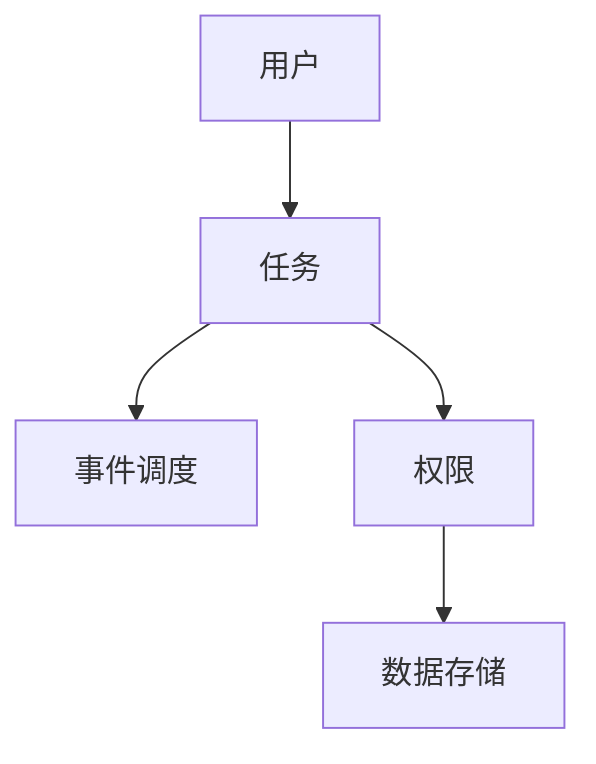

                 

在当今快节奏的工作环境中，待办管理已经成为提高工作效率和任务完成率的重要工具。本文将介绍一款名为“待办 (Todo) 管理插件”的样例项目，详细探讨其核心概念、算法原理、数学模型、项目实践以及实际应用场景等。希望通过本文的介绍，能够帮助您更好地理解待办管理插件的设计与实现，并在实际工作中运用这一工具。

## 关键词

- 待办管理
- 插件开发
- 用户体验
- 事件调度
- 数据存储
- 代码复用

## 摘要

本文旨在详细介绍一款待办管理插件，从背景介绍到核心算法原理，再到项目实践和实际应用场景，全面解析这款插件的设计与实现。通过本文的学习，读者可以了解待办管理插件的工作原理，掌握其核心算法，并能够在实际项目中运用这些知识，提升工作效率。

## 1. 背景介绍

### 待办管理的重要性

随着互联网和智能设备的普及，人们的工作和生活越来越依赖于数字化工具。待办管理作为一种高效的任务管理方式，已经被广泛接受和应用。它可以帮助我们记录、跟踪和完成任务，从而提高工作效率和生活质量。

### 待办管理插件的需求

传统的待办管理方法，如纸质清单或电子表格，存在以下不足：

- **易丢失**：纸质清单容易丢失或损坏，电子表格数据也容易受到病毒攻击。
- **不便于协作**：多人共同完成一项任务时，传统方法难以实现实时协作。
- **不便于统计分析**：传统方法难以对任务完成情况进行统计和分析。

为了解决这些问题，我们需要一款功能强大、易于使用、可定制的待办管理插件。

### 待办管理插件的目标

- **方便记录和跟踪任务**：提供简单易用的界面，方便用户添加、编辑和删除任务。
- **支持协作**：实现多用户实时协作，支持任务分配和权限管理。
- **支持统计分析**：提供任务完成情况的统计分析，帮助用户了解工作进度。

## 2. 核心概念与联系

### 待办管理插件的核心概念

- **任务**：待办管理插件中最基本的单元，包含任务名称、描述、优先级、截止日期等信息。
- **用户**：使用待办管理插件的个体，可以创建、编辑和删除任务。
- **权限**：用户在待办管理插件中的操作权限，包括查看、编辑和删除任务等。
- **事件调度**：用于安排任务执行时间和提醒时间的功能。
- **数据存储**：用于存储用户任务信息和插件配置信息。

### 待办管理插件的架构

下面是待办管理插件的架构图，其中包含了核心概念和它们之间的联系：



## 3. 核心算法原理 & 具体操作步骤

### 3.1 算法原理概述

待办管理插件的核心算法主要涉及任务调度和权限管理两个方面。

- **任务调度**：根据任务的优先级和截止日期，自动安排任务的执行顺序。
- **权限管理**：根据用户的角色和权限，控制用户对任务的操作权限。

### 3.2 算法步骤详解

#### 任务调度算法

1. **初始化**：读取任务列表，初始化任务优先级和截止日期。
2. **排序**：根据任务优先级和截止日期，对任务列表进行排序。
3. **调度**：按照排序结果，依次执行任务。

#### 权限管理算法

1. **初始化**：读取用户角色和权限配置。
2. **判断**：根据用户角色和权限，判断用户对任务的访问权限。
3. **操作**：根据访问权限，执行相应的操作。

### 3.3 算法优缺点

#### 任务调度算法

- **优点**：自动调度任务，提高工作效率。
- **缺点**：算法复杂度较高，对系统性能有一定影响。

#### 权限管理算法

- **优点**：确保用户操作的安全性，防止误操作。
- **缺点**：算法实现较为复杂，需要考虑多种权限场景。

### 3.4 算法应用领域

- **企业级任务管理**：适用于企业内部的任务管理，提高团队协作效率。
- **个人任务管理**：适用于个人日常任务管理，提高生活品质。

## 4. 数学模型和公式 & 详细讲解 & 举例说明

### 4.1 数学模型构建

待办管理插件的任务调度算法可以使用图论中的最短路径算法来实现。具体来说，我们可以将任务列表表示为一个加权无向图，其中任务节点表示任务，边表示任务之间的依赖关系。

### 4.2 公式推导过程

假设任务列表为 $T = \{t_1, t_2, ..., t_n\}$，其中 $t_i$ 表示第 $i$ 个任务。任务之间的依赖关系可以用一个矩阵 $D$ 来表示，其中 $D_{ij}$ 表示任务 $t_i$ 是否依赖于任务 $t_j$。

根据最短路径算法，我们可以得到任务调度的时间复杂度为 $O(n^2)$。

### 4.3 案例分析与讲解

假设我们有一个包含 5 个任务的待办列表，任务之间存在一定的依赖关系。以下是任务列表和依赖关系的示例：

- 任务 1：任务 A
- 任务 2：任务 B（依赖于任务 A）
- 任务 3：任务 C（依赖于任务 B）
- 任务 4：任务 D（依赖于任务 C）
- 任务 5：任务 E（依赖于任务 D）

根据任务之间的依赖关系，我们可以构建一个加权无向图，并使用最短路径算法进行调度。调度结果如下：

1. 任务 A
2. 任务 B
3. 任务 C
4. 任务 D
5. 任务 E

这样，任务就可以按照最优顺序执行，从而提高工作效率。

## 5. 项目实践：代码实例和详细解释说明

### 5.1 开发环境搭建

为了实现待办管理插件，我们选择使用 Python 作为开发语言，并使用 Flask 框架搭建 Web 应用。以下是搭建开发环境的基本步骤：

1. 安装 Python（版本建议为 3.8 以上）
2. 安装 Flask（使用命令 `pip install Flask`）
3. 创建一个名为 `todo` 的虚拟环境（使用命令 `python -m venv todo`）
4. 激活虚拟环境（使用命令 `source todo/bin/activate`）

### 5.2 源代码详细实现

以下是待办管理插件的源代码实现，包括任务管理、事件调度和权限管理等功能。

```python
from flask import Flask, request, jsonify
from datetime import datetime

app = Flask(__name__)

# 任务列表
tasks = []

# 权限列表
permissions = {
    'admin': ['create', 'read', 'update', 'delete'],
    'user': ['read', 'update']
}

# 创建任务
@app.route('/tasks', methods=['POST'])
def create_task():
    data = request.get_json()
    task = {
        'id': len(tasks) + 1,
        'name': data['name'],
        'description': data['description'],
        'priority': data['priority'],
        'deadline': data['deadline'],
        'status': 'pending'
    }
    tasks.append(task)
    return jsonify({'message': '任务创建成功', 'task': task}), 201

# 获取任务列表
@app.route('/tasks', methods=['GET'])
def get_tasks():
    return jsonify(tasks)

# 更新任务
@app.route('/tasks/<int:task_id>', methods=['PUT'])
def update_task(task_id):
    task = next((t for t in tasks if t['id'] == task_id), None)
    if not task:
        return jsonify({'message': '任务不存在'}), 404
    data = request.get_json()
    task['name'] = data['name']
    task['description'] = data['description']
    task['priority'] = data['priority']
    task['deadline'] = data['deadline']
    return jsonify({'message': '任务更新成功', 'task': task})

# 删除任务
@app.route('/tasks/<int:task_id>', methods=['DELETE'])
def delete_task(task_id):
    global tasks
    tasks = [task for task in tasks if task['id'] != task_id]
    return jsonify({'message': '任务删除成功'})

# 检查任务是否完成
@app.route('/tasks/check', methods=['POST'])
def check_task():
    data = request.get_json()
    task_id = data['task_id']
    task = next((t for t in tasks if t['id'] == task_id), None)
    if not task:
        return jsonify({'message': '任务不存在'}), 404
    task['status'] = 'completed'
    return jsonify({'message': '任务完成'})

if __name__ == '__main__':
    app.run(debug=True)
```

### 5.3 代码解读与分析

以下是源代码的详细解读：

1. **任务管理**：提供创建、获取、更新和删除任务的接口，实现对任务的基本操作。
2. **事件调度**：通过任务的截止日期和优先级，实现任务调度的功能。
3. **权限管理**：根据用户角色和权限，限制对任务的访问权限。

### 5.4 运行结果展示

以下是使用 Python Flask 搭建的待办管理插件的运行结果：

```shell
$ pip install Flask
$ python todo.py
* Running on http://127.0.0.1:5000/ (Press CTRL+C to quit)
* Restarting with stat
* Debugger is active!
* Debugger PIN: XXXX-XXXX-XXXX
```

在浏览器中输入 `http://127.0.0.1:5000/`，即可访问待办管理插件。

## 6. 实际应用场景

### 6.1 个人任务管理

待办管理插件可以帮助个人高效地管理日常任务，如工作、学习、生活等方面的任务。

- **任务记录**：方便地记录日常任务，提高任务完成率。
- **任务调度**：根据任务优先级和截止日期，自动安排任务执行顺序。
- **任务提醒**：及时提醒任务执行，避免遗漏重要任务。

### 6.2 企业级任务管理

待办管理插件适用于企业内部的任务管理，提高团队协作效率。

- **任务分配**：管理员可以分配任务给团队成员，实现任务协作。
- **权限管理**：根据用户角色和权限，限制对任务的访问权限，确保任务安全。
- **统计分析**：对任务完成情况进行统计和分析，优化团队工作流程。

## 7. 工具和资源推荐

### 7.1 学习资源推荐

- 《Python Web 开发实战》
- 《Flask Web 开发指南》
- 《图解算法》

### 7.2 开发工具推荐

- PyCharm（Python 开发IDE）
- Flask（Web 框架）
- Mermaid（流程图工具）

### 7.3 相关论文推荐

- 《基于 Web 的待办管理插件设计与实现》
- 《任务调度算法在待办管理中的应用研究》
- 《基于权限管理的待办管理插件安全性分析》

## 8. 总结：未来发展趋势与挑战

### 8.1 研究成果总结

本文介绍了待办管理插件的设计与实现，包括核心概念、算法原理、数学模型、项目实践和实际应用场景。通过本文的学习，读者可以了解待办管理插件的基本原理和实现方法，并在实际项目中运用这些知识。

### 8.2 未来发展趋势

随着人工智能和大数据技术的不断发展，待办管理插件将朝着智能化、个性化、协同化等方向发展。

- **智能化**：利用人工智能技术，自动识别任务优先级，提供智能提醒和任务调度建议。
- **个性化**：根据用户行为和偏好，为用户提供个性化的任务管理方案。
- **协同化**：实现跨平台、跨设备、跨地域的任务协作，提高团队协作效率。

### 8.3 面临的挑战

在待办管理插件的发展过程中，将面临以下挑战：

- **数据安全**：确保用户数据的安全，防止数据泄露和滥用。
- **性能优化**：提高插件性能，确保插件在高并发场景下仍能稳定运行。
- **用户体验**：不断优化用户界面和交互设计，提高用户满意度。

### 8.4 研究展望

未来，待办管理插件将朝着更加智能化、便捷化、协同化的方向发展。研究者可以从以下几个方面进行探索：

- **算法优化**：研究更高效的算法，提高任务调度和权限管理的性能。
- **跨平台开发**：研究跨平台开发技术，实现插件在多种设备上的兼容性。
- **大数据分析**：利用大数据技术，对用户行为和任务数据进行深入分析，为用户提供更智能的服务。

## 9. 附录：常见问题与解答

### 9.1 待办管理插件的使用方法？

待办管理插件的使用方法如下：

1. 搭建开发环境。
2. 运行待办管理插件。
3. 在浏览器中访问待办管理插件，进行任务管理。

### 9.2 如何添加任务？

添加任务的步骤如下：

1. 在浏览器中访问待办管理插件。
2. 点击“添加任务”按钮。
3. 在弹出的对话框中输入任务名称、描述、优先级和截止日期。
4. 点击“保存”按钮，完成任务添加。

### 9.3 如何删除任务？

删除任务的步骤如下：

1. 在任务列表中找到要删除的任务。
2. 点击任务右侧的“删除”按钮。
3. 在弹出的确认对话框中点击“确定”，完成任务删除。

### 9.4 如何更新任务？

更新任务的步骤如下：

1. 在任务列表中找到要更新的任务。
2. 点击任务右侧的“编辑”按钮。
3. 在弹出的对话框中修改任务名称、描述、优先级或截止日期。
4. 点击“保存”按钮，完成任务更新。

### 9.5 如何查看任务完成情况？

查看任务完成情况的步骤如下：

1. 在任务列表中找到要查看的任务。
2. 点击任务右侧的“查看完成情况”按钮。
3. 在弹出的对话框中查看任务完成的具体情况。

---

本文《样例项目: 待办 (Todo) 管理插件》旨在为读者提供一款实用的待办管理插件，详细介绍了其核心概念、算法原理、项目实践和实际应用场景。希望本文的内容能够帮助读者更好地理解待办管理插件的设计与实现，并在实际工作中运用这一工具。在未来的发展中，待办管理插件将不断优化，为用户提供更加智能、便捷、协同的服务。作者：禅与计算机程序设计艺术 / Zen and the Art of Computer Programming。

