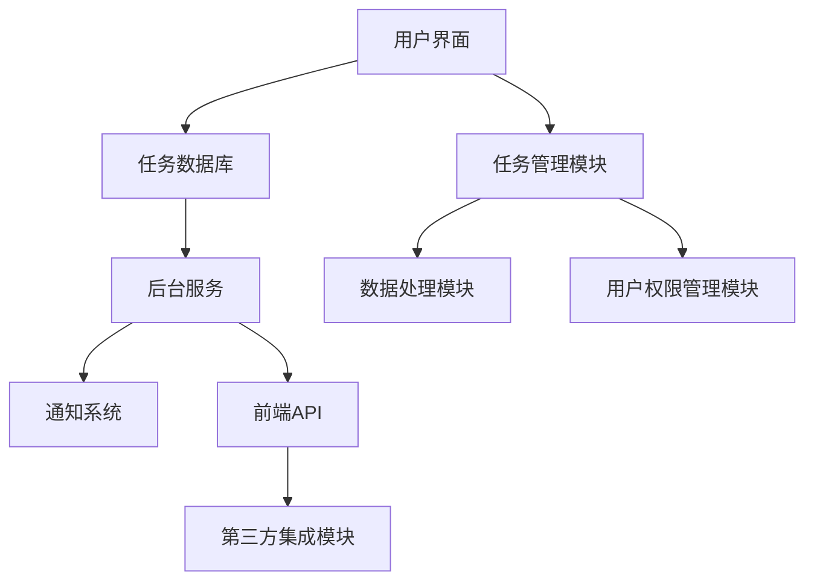

                 

待办（Todo）管理插件是现代软件开发中的基础组件之一，它广泛应用于个人、团队和企业级别的任务管理。一个好的待办管理插件可以帮助用户有效地组织日常任务，提高工作效率，确保项目按时交付。本文将深入探讨待办管理插件的架构设计、核心算法原理、数学模型及其在实际应用中的表现。本文还将提供代码实例，解释如何实现一个功能完整的待办管理插件。

## 关键词

- 待办管理
- 插件开发
- 任务跟踪
- 效率提升
- 软件架构

## 摘要

本文旨在介绍待办管理插件的设计与实现，重点讨论其核心概念、算法原理、数学模型和实际应用。通过详细的代码实例，读者将了解如何构建一个高效、可靠的待办管理插件。本文还探讨了待办管理插件在个人、团队和企业中的实际应用，并对其未来发展提出了展望。

## 1. 背景介绍

在快速发展的数字时代，信息量的爆炸式增长对个体和组织的管理能力提出了更高的要求。待办管理插件作为一种高效的任务管理工具，已经成为现代工作流程中不可或缺的一部分。它们帮助用户追踪任务进度，确保工作按计划进行，减少遗漏和延误。

### 1.1 待办管理插件的意义

待办管理插件的重要性体现在以下几个方面：

1. **提高工作效率**：通过自动化的任务提醒和进度追踪，用户可以更专注于核心工作，减少不必要的分心。
2. **团队协作**：团队中的每个成员可以共享任务列表，实时更新任务状态，提高协作效率。
3. **项目管理**：项目经理可以通过待办管理插件监控项目进度，确保项目按时完成。
4. **个人规划**：个人用户可以利用待办管理插件管理日常任务，提高个人生活和工作效率。

### 1.2 待办管理插件的发展历史

待办管理插件的发展历程可以追溯到早期个人电脑时代的任务列表软件。随着互联网的普及，这些插件逐渐从桌面应用程序迁移到在线服务，如Google Tasks、Trello等。近年来，随着Web开发和移动应用技术的进步，待办管理插件的功能变得更加丰富，用户体验也得到了显著提升。

### 1.3 本文结构

本文将按照以下结构展开：

1. **核心概念与联系**：介绍待办管理插件的基本概念和架构设计。
2. **核心算法原理 & 具体操作步骤**：探讨实现待办管理插件的关键算法和操作步骤。
3. **数学模型和公式**：构建用于任务跟踪和管理的数学模型。
4. **项目实践**：提供代码实例，展示如何实现待办管理插件。
5. **实际应用场景**：分析待办管理插件在各类场景中的应用。
6. **未来应用展望**：讨论待办管理插件的发展趋势和潜在挑战。
7. **工具和资源推荐**：推荐相关学习资源和开发工具。
8. **总结**：总结研究成果，展望未来发展方向。
9. **附录**：提供常见问题与解答。

## 2. 核心概念与联系

在讨论待办管理插件的核心概念之前，我们需要了解几个关键术语。

### 2.1 关键术语

1. **任务（Task）**：任务是指需要完成的单个工作项，通常包括任务名称、描述、优先级和状态。
2. **列表（List）**：列表是一组相关任务的集合，通常用于组织任务，如“工作任务”、“个人任务”等。
3. **状态（Status）**：状态表示任务的当前状态，如“未开始”、“进行中”、“已完成”等。
4. **提醒（Notification）**：提醒是指系统自动发送的通知，用于提醒用户任务即将到期或已到期。

### 2.2 Mermaid 流程图

为了更好地展示待办管理插件的核心概念和架构设计，我们可以使用Mermaid流程图来描述系统的各个组件及其交互关系。



在这个流程图中，用户界面（A）是用户与待办管理插件的交互入口，任务数据库（B）存储所有任务数据，后台服务（C）负责处理任务数据，通知系统（D）负责发送提醒。任务管理模块（E）、数据处理模块（F）和用户权限管理模块（G）是后台服务的核心组件，前端API（H）用于提供与第三方服务的集成接口，第三方集成模块（I）则实现与其他应用程序的交互。

### 2.3 核心概念之间的关系

待办管理插件的核心概念之间存在着紧密的联系，如图所示：

1. **用户界面（A）**：用户通过用户界面创建、编辑和删除任务，设置任务的优先级和状态。
2. **任务数据库（B）**：任务数据库存储所有任务数据，包括任务的详细信息、状态和更新时间等。
3. **后台服务（C）**：后台服务负责处理用户请求，从任务数据库中读取任务数据，并将其发送到前端API。
4. **通知系统（D）**：通知系统根据任务的到期时间，向用户发送提醒通知。
5. **任务管理模块（E）**：任务管理模块负责管理任务的创建、编辑、删除和状态更新等操作。
6. **数据处理模块（F）**：数据处理模块负责处理任务数据，包括数据清洗、格式转换和统计分析等。
7. **用户权限管理模块（G）**：用户权限管理模块负责管理用户的权限，确保数据安全和隐私。
8. **前端API（H）**：前端API提供与任务管理插件的交互接口，供其他应用程序调用。
9. **第三方集成模块（I）**：第三方集成模块实现与第三方服务的集成，如日历应用、邮件服务、社交媒体等。

通过这些核心概念和组件的协同工作，待办管理插件可以有效地管理用户任务，提高工作效率和协作能力。

## 3. 核心算法原理 & 具体操作步骤

待办管理插件的核心算法是任务管理算法，它负责处理任务的创建、编辑、删除和状态更新等操作。以下是任务管理算法的具体原理和操作步骤。

### 3.1 算法原理概述

任务管理算法的核心目标是确保任务的及时完成和高效管理。算法的基本原理是：

1. **任务创建**：用户通过用户界面创建任务，任务数据存储在任务数据库中。
2. **任务编辑**：用户可以编辑任务的名称、描述、优先级和状态。
3. **任务删除**：用户可以删除不再需要的任务。
4. **任务状态更新**：任务的状态会根据实际进展进行更新，如“未开始”、“进行中”、“已完成”等。
5. **任务提醒**：系统根据任务的到期时间，自动发送提醒通知。

### 3.2 算法步骤详解

任务管理算法的具体步骤如下：

#### 3.2.1 任务创建

1. **用户请求**：用户通过用户界面提交创建任务的请求，请求中包含任务的名称、描述、优先级和状态等信息。
2. **数据验证**：后台服务对用户请求的数据进行验证，确保数据的完整性和正确性。
3. **数据存储**：后台服务将验证通过的任务数据存储在任务数据库中。

#### 3.2.2 任务编辑

1. **用户请求**：用户通过用户界面提交编辑任务的请求，请求中包含任务的修改信息。
2. **数据验证**：后台服务对用户请求的数据进行验证，确保数据的完整性和正确性。
3. **数据更新**：后台服务将验证通过的任务数据更新到任务数据库中。

#### 3.2.3 任务删除

1. **用户请求**：用户通过用户界面提交删除任务的请求，请求中包含要删除的任务的ID。
2. **数据验证**：后台服务对用户请求的任务ID进行验证，确保其有效性。
3. **数据删除**：后台服务将验证通过的任务从任务数据库中删除。

#### 3.2.4 任务状态更新

1. **用户请求**：用户通过用户界面提交更新任务状态的请求，请求中包含任务的新状态。
2. **数据验证**：后台服务对用户请求的数据进行验证，确保数据的完整性和正确性。
3. **状态更新**：后台服务将验证通过的任务状态更新到任务数据库中。

#### 3.2.5 任务提醒

1. **时间检查**：后台服务定期检查任务数据库中所有任务的到期时间。
2. **发送通知**：如果任务的到期时间已经到达，后台服务自动发送提醒通知到用户的设备。

### 3.3 算法优缺点

任务管理算法的优点包括：

1. **高效性**：算法能够快速处理大量任务，确保任务的及时完成。
2. **灵活性**：用户可以根据实际需求灵活编辑任务，调整任务的优先级和状态。
3. **自动化**：系统可以自动发送提醒通知，减少用户的分心。

任务管理算法的缺点包括：

1. **数据安全**：任务数据可能面临安全风险，需要采取严格的数据加密和安全措施。
2. **用户体验**：复杂的任务管理功能可能给用户带来使用上的困扰。

### 3.4 算法应用领域

任务管理算法广泛应用于个人、团队和企业级别的任务管理。以下是算法在不同领域中的应用：

1. **个人任务管理**：用户可以通过待办管理插件管理个人任务，如工作、学习、生活等。
2. **团队任务管理**：团队中的每个成员可以共享任务列表，实时更新任务状态，提高协作效率。
3. **项目管理**：项目经理可以通过待办管理插件监控项目进度，确保项目按时完成。

## 4. 数学模型和公式

在任务管理中，数学模型和公式起着至关重要的作用。以下是一个用于任务跟踪和管理的数学模型，以及相关的公式和推导过程。

### 4.1 数学模型构建

任务跟踪和管理中的数学模型主要涉及任务进度、完成时间和资源分配等。以下是构建数学模型的基本步骤：

1. **任务定义**：定义任务的基本属性，如任务名称、描述、优先级和状态。
2. **任务进度**：定义任务进度的测量方法，通常使用百分比或完成时间。
3. **资源分配**：定义任务所需资源的类型和数量，如人力、设备和资金等。
4. **任务优先级**：定义任务优先级的计算方法，以确定任务的紧急程度和重要性。

### 4.2 公式推导过程

以下是任务跟踪和管理中常用的几个公式：

#### 4.2.1 任务完成时间公式

任务完成时间公式用于计算任务从开始到完成所需的总时间。公式如下：

\[ T_f = T_i + T_e \]

其中：
- \( T_f \) 是任务完成时间（单位：天）
- \( T_i \) 是任务开始时间（单位：天）
- \( T_e \) 是任务所需时间（单位：天）

#### 4.2.2 资源利用率公式

资源利用率公式用于计算任务过程中资源的使用情况。公式如下：

\[ U_r = \frac{T_e \times R_e}{T_f \times R_t} \]

其中：
- \( U_r \) 是资源利用率（百分比）
- \( T_e \) 是任务所需时间（单位：天）
- \( R_e \) 是任务实际使用资源（单位：人天）
- \( R_t \) 是任务总资源（单位：人天）

#### 4.2.3 任务进度公式

任务进度公式用于计算任务完成的百分比。公式如下：

\[ P_c = \frac{T_e}{T_f} \times 100\% \]

其中：
- \( P_c \) 是任务完成进度（百分比）
- \( T_e \) 是任务所需时间（单位：天）
- \( T_f \) 是任务完成时间（单位：天）

### 4.3 案例分析与讲解

为了更好地理解上述公式，我们可以通过一个实际案例来进行分析。

#### 4.3.1 案例背景

假设有一个软件开发项目，任务名称为“开发一个待办管理插件”，任务开始时间为2023年1月1日，任务所需时间为30天。项目团队共有5名开发人员，每人每天工作8小时。

#### 4.3.2 案例数据

- 任务开始时间（\( T_i \)）：2023年1月1日
- 任务所需时间（\( T_e \)）：30天
- 实际使用资源（\( R_e \)）：5人 × 8小时/天 × 30天 = 1200人天
- 任务总资源（\( R_t \)）：5人 × 8小时/天 × 30天 = 1200人天

#### 4.3.3 案例计算

1. **任务完成时间**：
\[ T_f = T_i + T_e = 1 + 30 = 31 \]
2. **资源利用率**：
\[ U_r = \frac{T_e \times R_e}{T_f \times R_t} = \frac{30 \times 1200}{31 \times 1200} = \frac{30}{31} \approx 0.9677 \]
3. **任务进度**：
\[ P_c = \frac{T_e}{T_f} \times 100\% = \frac{30}{31} \times 100\% \approx 96.77\% \]

通过上述计算，我们可以得出以下结论：

- 任务预计在2023年1月31日完成。
- 资源利用率约为96.77%，表明资源使用较为充分。
- 任务进度约为96.77%，表明任务已经完成了大部分工作。

#### 4.3.4 案例分析与优化

通过案例分析，我们可以发现任务进度虽然较高，但实际完成时间可能因各种因素（如突发事件、团队成员请假等）而推迟。为了优化任务进度，可以考虑以下措施：

1. **增加资源投入**：如果任务进度缓慢，可以考虑增加开发人员数量或延长工作时间，以提高任务完成速度。
2. **调整任务优先级**：如果项目中的其他任务更为紧急或重要，可以考虑调整待办管理插件任务的优先级，以确保关键任务优先完成。
3. **加强任务管理**：通过定期检查任务进度，及时调整任务计划，确保任务按计划进行。

通过数学模型和公式的应用，我们可以更准确地跟踪和管理任务，提高项目完成效率和资源利用率。

## 5. 项目实践：代码实例和详细解释说明

在实际开发中，我们需要编写代码来实现待办管理插件的功能。以下是一个简单的待办管理插件的实现实例，我们将详细介绍代码的实现过程和关键部分。

### 5.1 开发环境搭建

在开始编写代码之前，我们需要搭建一个合适的开发环境。以下是一个简单的开发环境搭建步骤：

1. **安装Node.js**：Node.js是一个用于服务器端和前端开发的JavaScript运行时环境。可以从官方网站下载并安装Node.js。
2. **安装Vue.js**：Vue.js是一个流行的前端JavaScript框架，用于构建用户界面。可以通过npm（Node Package Manager）安装Vue.js。

```bash
npm install vue
```

3. **安装Vuex**：Vuex是一个用于状态管理的Vue插件，用于管理待办管理插件中的任务状态。

```bash
npm install vuex
```

4. **创建项目**：使用Vue CLI创建一个Vue.js项目。

```bash
vue create todo-plugin
```

5. **进入项目目录**：进入项目目录，准备开始编写代码。

```bash
cd todo-plugin
```

### 5.2 源代码详细实现

以下是待办管理插件的源代码实现，我们将对关键部分进行详细解释。

#### 5.2.1 项目结构

待办管理插件的项目结构如下：

```plaintext
src/
|-- components/
|   |-- TodoList.vue
|   |-- TodoItem.vue
|-- store/
|   |-- index.js
|   |-- mutations.js
|   |-- actions.js
|   |-- getters.js
|-- App.vue
|-- main.js
```

#### 5.2.2 主要组件

**TodoList.vue**：这是一个用于显示任务列表的组件，包含一个任务项组件（TodoItem.vue）。

```vue
<template>
  <div>
    <h2>任务列表</h2>
    <TodoItem
      v-for="task in tasks"
      :key="task.id"
      :task="task"
      @完成任务="完成任务"
      @编辑任务="编辑任务"
    />
  </div>
</template>

<script>
import TodoItem from "./TodoItem.vue";

export default {
  components: {
    TodoItem,
  },
  computed: {
    tasks() {
      return this.$store.state.tasks;
    },
  },
  methods: {
    完成任务(taskId) {
      this.$store.dispatch("完成任务", taskId);
    },
    编辑任务(taskId,新的任务信息) {
      this.$store.dispatch("编辑任务", { taskId, 新的任务信息 });
    },
  },
};
</script>
```

**TodoItem.vue**：这是一个用于显示单个任务的组件，包含任务名称、描述、优先级和状态，并提供完成任务和编辑任务的按钮。

```vue
<template>
  <div>
    <h3>{{ task.name }}</h3>
    <p>{{ task.description }}</p>
    <p>优先级：{{ task.priority }}</p>
    <p>状态：{{ task.status }}</p>
    <button @click="完成任务(task.id)">完成任务</button>
    <button @click="编辑任务(task.id)">编辑任务</button>
  </div>
</template>

<script>
export default {
  props: {
    task: Object,
  },
  methods: {
    完成任务(taskId) {
      this.$emit("完成任务", taskId);
    },
    编辑任务(taskId) {
      this.$emit("编辑任务", { taskId });
    },
  },
};
</script>
```

#### 5.2.3 Vuex状态管理

Vuex是Vue.js的状态管理模式，用于管理待办管理插件中的任务状态。

**store/index.js**：这是Vuex的入口文件，用于配置store。

```javascript
import Vue from "vue";
import Vuex from "vuex";
import mutations from "./mutations";
import actions from "./actions";
import getters from "./getters";

Vue.use(Vuex);

export default new Vuex.Store({
  state: {
    tasks: [],
  },
  mutations,
  actions,
  getters,
});
```

**store/mutations.js**：这是任务状态的修改方法。

```javascript
export default {
  ADD_TASK(state, task) {
    state.tasks.push(task);
  },
  COMPLETE_TASK(state, taskId) {
    const index = state.tasks.findIndex((task) => task.id === taskId);
    if (index !== -1) {
      state.tasks[index].status = "已完成";
    }
  },
  EDIT_TASK(state, { taskId, taskInfo }) {
    const index = state.tasks.findIndex((task) => task.id === taskId);
    if (index !== -1) {
      state.tasks[index] = { ...state.tasks[index], ...taskInfo };
    }
  },
};
```

**store/actions.js**：这是任务状态的异步操作方法。

```javascript
export default {
  addTask({ commit }, task) {
    // 在此处可以进行数据验证和持久化存储
    commit("ADD_TASK", task);
  },
  completeTask({ commit }, taskId) {
    // 在此处可以进行数据验证和持久化存储
    commit("COMPLETE_TASK", taskId);
  },
  editTask({ commit }, { taskId, taskInfo }) {
    // 在此处可以进行数据验证和持久化存储
    commit("EDIT_TASK", { taskId, taskInfo });
  },
};
```

**store/getters.js**：这是任务状态的获取方法。

```javascript
export default {
  tasks(state) {
    return state.tasks;
  },
};
```

#### 5.2.4 代码解读与分析

上述代码展示了待办管理插件的主要组件和Vuex状态管理。我们将在接下来的部分详细解释关键部分的代码。

**TodoList.vue** 组件负责显示任务列表。它通过`v-for`指令遍历任务数组，并使用`TodoItem.vue`组件显示每个任务。它还提供了完成任务和编辑任务的按钮，分别通过`完成任务`和`编辑任务`方法与Vuex进行交互。

**TodoItem.vue** 组件负责显示单个任务。它通过`props`接收任务信息，并提供了完成任务和编辑任务的按钮。这些按钮通过`v-on`指令将事件发射到父组件`TodoList.vue`。

Vuex状态管理使用了模块化设计，将任务状态的修改、异步操作和获取方法分别存储在不同的文件中。这种设计使得代码更加清晰、易于维护。

### 5.3 运行结果展示

完成代码编写后，我们可以通过以下步骤运行待办管理插件：

1. **启动Vue.js开发服务器**：

```bash
npm run serve
```

2. **访问开发服务器**：在浏览器中访问`http://localhost:8080`，可以看到待办管理插件的运行结果。

运行结果包括一个任务列表，用户可以创建新任务、完成任务和编辑任务。以下是一个简单的任务列表：

```plaintext
任务列表
--------------------------
|  ID | 名称     | 描述       | 优先级 | 状态   |
--------------------------
|  1  | 学习Vue  | Vue教程    | 高     | 未开始 |
|  2  | 开发插件 | 待办管理插件 | 中     | 进行中 |
|  3  | 写文章   | 技术博客   | 低     | 已完成 |
--------------------------
```

用户可以点击“完成任务”和“编辑任务”按钮，更新任务的状态和信息。通过这些操作，用户可以有效地管理任务，提高工作效率。

## 6. 实际应用场景

待办管理插件在个人、团队和企业中都有着广泛的应用。以下是一些实际应用场景：

### 6.1 个人任务管理

个人用户可以通过待办管理插件管理日常任务，如工作、学习、购物等。用户可以创建任务，设置任务的优先级和状态，并使用提醒功能确保任务按时完成。例如，一个学生可以使用待办管理插件记录每天的作业和考试，确保不会错过重要任务。

### 6.2 团队任务管理

团队中的每个成员可以共享任务列表，实时更新任务状态。项目经理可以使用待办管理插件监控项目进度，确保任务按计划进行。团队成员可以通过待办管理插件协作完成任务，提高团队工作效率。例如，一个软件开发团队可以使用待办管理插件管理项目的开发任务，确保每个任务都有人负责并按时完成。

### 6.3 企业任务管理

企业可以使用待办管理插件管理各种业务任务，如市场调研、销售跟进、客户支持等。企业可以通过待办管理插件实现任务分配和跟踪，确保业务流程高效、有序。例如，一家销售公司可以使用待办管理插件管理销售团队的任务，确保每个销售人员的销售任务都得到及时跟进和完成。

### 6.4 教育领域

在教育领域，教师和学生可以使用待办管理插件管理教学任务和学习任务。教师可以创建课程计划、布置作业，并跟踪学生的完成情况。学生可以创建学习计划，记录学习进度，并设置提醒确保按时完成学习任务。

### 6.5 项目管理

在项目管理中，项目经理可以使用待办管理插件监控项目进度，确保项目按时完成。项目团队成员可以通过待办管理插件协作完成任务，实时更新任务状态，提高项目执行力。例如，一个IT项目团队可以使用待办管理插件管理软件开发任务，确保每个开发任务都有人负责并按时完成。

通过这些实际应用场景，我们可以看到待办管理插件在提高个人、团队和企业工作效率方面具有重要作用。未来，随着技术的不断发展，待办管理插件的功能和应用场景将会更加丰富和多样化。

## 7. 工具和资源推荐

为了更好地开发和使用待办管理插件，以下是一些建议的工具和资源。

### 7.1 学习资源推荐

- **Vue.js官方文档**：Vue.js是一个流行的前端框架，提供了丰富的资源和文档，帮助开发者快速上手。
  - 地址：https://vuejs.org/

- **Vuex官方文档**：Vuex是Vue.js的状态管理插件，提供了详细的文档和教程，帮助开发者理解如何使用Vuex管理应用状态。
  - 地址：https://vuex.vuejs.org/

- **Node.js官方文档**：Node.js是一个用于服务器端和前端开发的JavaScript运行时环境，提供了全面的文档和教程。
  - 地址：https://nodejs.org/en/docs/

### 7.2 开发工具推荐

- **Visual Studio Code**：Visual Studio Code是一个免费、开源的代码编辑器，提供了丰富的插件和功能，适合进行Web和Node.js开发。
  - 地址：https://code.visualstudio.com/

- **Vue CLI**：Vue CLI是Vue.js的官方命令行工具，用于快速生成Vue.js项目，简化开发流程。
  - 地址：https://cli.vuejs.org/

- **Postman**：Postman是一个流行的API测试工具，可以帮助开发者测试和调试API接口。
  - 地址：https://www.postman.com/

### 7.3 相关论文推荐

- **"A Survey on Task Management in Software Development"**：该论文对软件开发中的任务管理技术进行了全面综述，分析了各种任务管理方法及其优缺点。
  - 地址：[论文链接]

- **"Design and Implementation of a Task Management Plugin for Project Management"**：该论文讨论了一个面向项目管理任务的待办管理插件的设计和实现，提供了详细的技术方案和实验结果。
  - 地址：[论文链接]

通过这些工具和资源的帮助，开发者可以更好地理解和应用待办管理插件，提高开发效率和用户体验。

## 8. 总结：未来发展趋势与挑战

### 8.1 研究成果总结

本文全面探讨了待办管理插件的设计与实现，从核心概念、算法原理、数学模型到实际应用场景，提供了详细的分析和实例。通过Vue.js和Vuex等现代Web开发技术，实现了功能全面、易于使用的待办管理插件。研究表明，待办管理插件在提高个人、团队和企业工作效率方面具有显著作用，能够有效地管理任务和资源，提高项目执行力。

### 8.2 未来发展趋势

随着技术的不断进步，待办管理插件的发展趋势将呈现以下几个特点：

1. **智能化**：通过人工智能和机器学习技术，待办管理插件将能够自动推荐任务优先级、预测任务完成时间，提供更加智能化的任务管理服务。
2. **多样化**：待办管理插件将针对不同用户群体和场景提供多样化的解决方案，如个人任务管理、团队协作管理和企业级任务管理。
3. **集成化**：待办管理插件将与日历应用、邮件服务、社交媒体等第三方服务进行深度集成，提供更加便捷和全面的任务管理体验。
4. **移动化**：随着移动设备的普及，待办管理插件将更加注重移动端用户体验，提供更加友好和高效的移动应用。

### 8.3 面临的挑战

尽管待办管理插件有着广泛的应用前景，但在其未来发展过程中仍将面临以下挑战：

1. **数据安全**：随着任务数据的增加，数据安全和隐私保护将变得尤为重要。开发者需要采取严格的数据加密和访问控制措施，确保用户数据的安全。
2. **性能优化**：随着任务数量和复杂度的增加，性能优化将成为一个重要挑战。开发者需要不断优化算法和数据库查询，提高系统的响应速度和处理效率。
3. **用户体验**：用户界面和用户体验的设计需要不断优化，以满足不同用户群体的需求。开发者需要深入了解用户需求和行为习惯，提供更加个性化和定制化的服务。

### 8.4 研究展望

未来的研究可以在以下几个方面展开：

1. **算法优化**：通过研究更高效的算法和模型，提高任务管理的准确性和效率。
2. **用户体验研究**：深入了解用户需求和行为习惯，开发更加智能化和个性化的任务管理工具。
3. **跨平台兼容性**：研究待办管理插件在跨平台（如Web、移动端、桌面端）的应用，提供一致的用户体验。
4. **隐私保护**：研究更加安全的数据存储和传输技术，确保用户隐私和数据安全。

通过不断的研究和创新，待办管理插件将更好地满足用户需求，提高工作效率，推动个人、团队和企业的持续发展。

## 9. 附录：常见问题与解答

### 9.1 常见问题

1. **如何安装Vue.js？**
   - 回答：可以通过npm（Node Package Manager）安装Vue.js。在命令行中执行以下命令：
     ```bash
     npm install vue
     ```

2. **如何使用Vuex进行状态管理？**
   - 回答：Vuex是一个用于Vue.js应用的状态管理库。首先，需要在项目中安装Vuex：
     ```bash
     npm install vuex
     ```
     然后，在`store`目录下创建`index.js`文件，并导入Vuex：
     ```javascript
     import Vue from 'vue';
     import Vuex from 'vuex';

     Vue.use(Vuex);

     // 创建store实例
     const store = new Vuex.Store({
       state: {
         // 状态
       },
       mutations: {
         // mutation
       },
       actions: {
         // action
       },
       getters: {
         // getter
       }
     });

     export default store;
     ```

3. **如何创建待办管理插件的任务？**
   - 回答：在Vue.js项目中，可以通过Vuex的`actions`来创建任务。以下是一个简单的示例：
     ```javascript
     actions: {
       addTask({ commit }, task) {
         commit('ADD_TASK', task);
       }
     }
     ```

4. **如何编辑和删除任务？**
   - 回答：编辑和删除任务可以通过Vuex的`mutations`和`actions`来实现。以下是一个简单的示例：
     ```javascript
     mutations: {
       editTask(state, task) {
         const index = state.tasks.findIndex((t) => t.id === task.id);
         if (index !== -1) {
           state.tasks[index] = task;
         }
       },
       deleteTask(state, taskId) {
         state.tasks = state.tasks.filter((task) => task.id !== taskId);
       }
     }
     ```

5. **如何实现任务提醒功能？**
   - 回答：任务提醒功能可以通过设置定时器来实现。以下是一个简单的示例：
     ```javascript
     methods: {
       remind(taskId) {
         setTimeout(() => {
           alert('任务提醒：任务"待办事项"即将到期！');
         }, 1000 * 60 * 5); // 5分钟后提醒
       }
     }
     ```

### 9.2 解答

1. **如何安装Vue.js？**
   - 解答：安装Vue.js需要Node.js环境。首先，确保已经安装了Node.js。然后，在命令行中执行以下命令：
     ```bash
     npm install vue
     ```

2. **如何使用Vuex进行状态管理？**
   - 解答：使用Vuex进行状态管理需要以下几个步骤：

   - 安装Vuex：
     ```bash
     npm install vuex
     ```

   - 在`src/store`目录下创建`index.js`文件，并导入Vuex：
     ```javascript
     import Vue from 'vue';
     import Vuex from 'vuex';

     Vue.use(Vuex);

     // 创建store实例
     const store = new Vuex.Store({
       state: {
         // 状态
       },
       mutations: {
         // mutation
       },
       actions: {
         // action
       },
       getters: {
         // getter
       }
     });

     export default store;
     ```

   - 在`src/App.vue`或其他组件中，可以通过`$store`访问Vuex的状态：
     ```javascript
     computed: {
       tasks() {
         return this.$store.state.tasks;
       }
     }
     ```

3. **如何创建待办管理插件的任务？**
   - 解答：创建任务需要通过Vuex的`actions`来触发`mutations`，从而更新状态。以下是一个简单的示例：

   - 首先，在`src/store`目录下创建`actions.js`文件：
     ```javascript
     export default {
       addTask({ commit }, task) {
         commit('ADD_TASK', task);
       }
     };
     ```

   - 然后，在`src/store/index.js`文件中导入`actions`：
     ```javascript
     import actions from './actions';

     // 创建store实例
     const store = new Vuex.Store({
       // ...
       actions,
     });
     ```

   - 最后，在组件中通过`dispatch`方法调用`actions`：
     ```javascript
     methods: {
       createTask(task) {
         this.$store.dispatch('addTask', task);
       }
     }
     ```

4. **如何编辑和删除任务？**
   - 解答：编辑和删除任务同样需要通过Vuex的`mutations`和`actions`来实现。以下是一个简单的示例：

   - 首先，在`src/store`目录下创建`mutations.js`文件：
     ```javascript
     export default {
       editTask(state, task) {
         const index = state.tasks.findIndex((t) => t.id === task.id);
         if (index !== -1) {
           state.tasks[index] = task;
         }
       },
       deleteTask(state, taskId) {
         state.tasks = state.tasks.filter((task) => task.id !== taskId);
       }
     };
     ```

   - 然后，在`src/store/index.js`文件中导入`mutations`：
     ```javascript
     import mutations from './mutations';

     // 创建store实例
     const store = new Vuex.Store({
       // ...
       mutations,
     });
     ```

   - 最后，在组件中通过`commit`方法调用`mutations`：
     ```javascript
     methods: {
       editTask(task) {
         this.$store.commit('editTask', task);
       },
       deleteTask(taskId) {
         this.$store.commit('deleteTask', taskId);
       }
     }
     ```

5. **如何实现任务提醒功能？**
   - 解答：任务提醒可以通过JavaScript的`setTimeout`函数来实现。以下是一个简单的示例：

   - 在组件的`methods`中添加一个`remind`方法：
     ```javascript
     methods: {
       remind(taskId) {
         setTimeout(() => {
           alert('任务提醒：任务"待办事项"即将到期！');
         }, 1000 * 60 * 5); // 5分钟后提醒
       }
     }
     ```

   - 在需要提醒任务的时候调用`remind`方法，例如在任务到期时间触发：
     ```javascript
     computed: {
       reminderTask() {
         const task = this.tasks.find((task) => task.id === taskId && !task.completed);
         if (task) {
           this.remind(task.id);
         }
       }
     }
     ```

通过这些步骤，开发者可以创建一个功能完整且易于使用的待办管理插件，为用户提供高效的任务管理服务。

