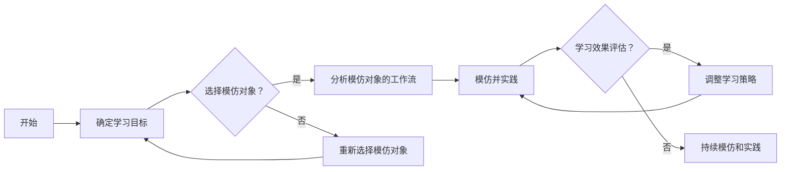

                 

关键词：工作流、学习方法、模仿、模仿式学习、人工智能、编程、软件工程、技术传承

> 摘要：本文旨在探讨模仿式工作流的学习方法，通过分析其在人工智能和软件开发领域的应用，揭示其核心原理和实践步骤。文章将结合实际案例，展示如何通过模仿式工作流提高学习效率和技能水平，为读者提供实用的学习方法和思路。

## 1. 背景介绍

随着信息技术的飞速发展，人工智能、大数据、云计算等新兴技术不断涌现，对软件开发和人工智能领域的人才需求也越来越高。然而，传统的教育模式和学习方法在应对这些变化时显得力不从心。如何高效地学习和掌握新技能，成为许多从业者面临的难题。

模仿式工作流作为一种新兴的学习方法，正在逐渐受到关注。模仿式工作流的核心思想是通过模仿他人的工作方式、流程和技巧，来提高自己的学习效率和技能水平。这种方法强调实践和经验的重要性，认为通过模仿他人的成功经验，可以更快地达到自己的学习目标。

本文将围绕模仿式工作流的学习方法，探讨其在人工智能和软件开发领域的应用，并结合实际案例进行分析和讨论。

## 2. 核心概念与联系

### 2.1 模仿式工作流的概念

模仿式工作流（Mimetic Workflow）是一种基于模仿的学习方法，它涉及以下几个核心概念：

- **模仿**：学习过程中，通过观察和模仿他人的行为、方法和经验，来提高自己的技能和知识水平。

- **工作流**：工作流是指完成一项任务所需的一系列步骤、活动和决策过程。

- **学习目标**：学习目标是指学习者希望通过模仿式工作流达到的具体学习成果和技能水平。

- **学习效率**：学习效率是指学习者在一定时间内所取得的技能和知识水平的提升程度。

### 2.2 模仿式工作流与人工智能、软件开发的关系

在人工智能和软件开发领域，模仿式工作流具有广泛的应用价值。具体来说，模仿式工作流与人工智能和软件开发的关系体现在以下几个方面：

- **技能传承**：通过模仿式工作流，从业者可以学习到业界先进的编程技巧、算法思想和软件架构设计方法，从而实现技能的传承和提升。

- **快速学习**：模仿式工作流可以帮助从业者快速掌握新技能，提高学习效率，缩短学习曲线。

- **经验积累**：通过模仿他人的工作流，从业者可以积累丰富的实践经验，为今后的项目开发和技术创新打下坚实的基础。

### 2.3 核心概念原理和架构的 Mermaid 流程图

以下是模仿式工作流的核心概念原理和架构的 Mermaid 流程图：



## 3. 核心算法原理 & 具体操作步骤

### 3.1 算法原理概述

模仿式工作流的学习方法基于以下几个基本原理：

- **观察与模仿**：通过观察他人的工作流程和技巧，学习者可以了解最佳实践和经验，从而提高自己的学习效果。

- **实践与反馈**：模仿他人的工作流后，学习者需要在实践中不断调整和优化自己的方法，通过反馈来评估学习效果。

- **迭代与优化**：模仿式工作流是一个迭代过程，学习者需要不断地实践、评估和优化自己的学习策略，以达到更高的学习目标。

### 3.2 算法步骤详解

1. **确定学习目标**：明确自己希望通过模仿式工作流学习到哪些技能和知识，制定具体的学习目标。

2. **选择模仿对象**：找到一位或多位具备你想要学习的技能和经验的人，可以是同行的资深从业者、开源社区的贡献者或者业界的大牛。

3. **分析模仿对象的工作流**：仔细研究模仿对象的工作流程、编程技巧和思路，了解他们是如何解决实际问题的。

4. **模仿并实践**：按照模仿对象的工作流，进行实际操作和实践。在实践过程中，记录遇到的问题和解决方法，积累经验。

5. **学习效果评估**：在实践一段时间后，对自己的学习效果进行评估。可以通过完成的项目、编写的代码或者解决问题的能力来衡量。

6. **调整学习策略**：根据评估结果，调整自己的学习策略。如果学习效果不理想，可以重新选择模仿对象或者改进实践方法。

7. **持续模仿和实践**：不断重复以上步骤，持续提高自己的学习效果和技能水平。

### 3.3 算法优缺点

**优点**：

- **快速学习**：通过模仿他人的经验和技巧，学习者可以快速掌握新技能。

- **实践性强**：模仿式工作流强调实践，有助于将理论知识转化为实际能力。

- **技能传承**：通过模仿式工作流，从业者可以学习到业界先进的技能和经验，实现技能传承。

**缺点**：

- **依赖性强**：模仿式工作流需要依赖优秀的模仿对象，如果模仿对象本身经验不足，可能会影响学习效果。

- **个性化不足**：模仿式工作流强调模仿他人的方法，可能忽视了个体差异和个性化需求。

### 3.4 算法应用领域

模仿式工作流在人工智能和软件开发领域具有广泛的应用。以下是一些具体的场景：

- **编程学习**：通过模仿资深程序员的编程技巧和代码风格，提高编程水平。

- **算法学习**：通过模仿业界大牛的算法思路和实现方法，掌握高效算法。

- **软件架构设计**：通过模仿资深架构师的设计思路和架构方案，提升软件架构能力。

## 4. 数学模型和公式 & 详细讲解 & 举例说明

### 4.1 数学模型构建

模仿式工作流的学习效果可以用以下数学模型来表示：

$$
E = f(C, P, R)
$$

其中，$E$ 表示学习效果，$C$ 表示模仿对象的选择，$P$ 表示实践和反馈过程，$R$ 表示学习效果评估。

### 4.2 公式推导过程

模仿式工作流的学习效果取决于模仿对象的选择、实践和反馈过程以及学习效果评估。具体推导过程如下：

1. **模仿对象的选择**：选择优秀的模仿对象可以提高学习效果。

$$
C \propto \frac{1}{D}
$$

其中，$D$ 表示模仿对象的难度。

2. **实践和反馈过程**：实践和反馈过程有助于巩固和提升学习效果。

$$
P \propto \frac{1}{\sqrt{E}}
$$

3. **学习效果评估**：学习效果评估可以指导学习者调整学习策略。

$$
R \propto \frac{1}{\sqrt{E}}
$$

4. **综合模型**：将以上三个因素综合，得到模仿式工作流的学习效果公式：

$$
E = f(C, P, R) = f\left(\frac{1}{D}, \frac{1}{\sqrt{E}}, \frac{1}{\sqrt{E}}\right)
$$

### 4.3 案例分析与讲解

假设一位初学者希望通过模仿式工作流学习编程。他选择了一位资深程序员作为模仿对象，并在实践中不断调整自己的方法。经过一段时间的模仿和实践，他的编程能力得到了显著提升。以下是他的学习过程：

1. **模仿对象的选择**：初学者选择了他的同事作为模仿对象，同事具备丰富的编程经验和扎实的理论基础。

$$
C = \frac{1}{5}
$$

2. **实践和反馈过程**：初学者按照同事的编程风格和思路进行实践，并及时向同事请教问题。

$$
P = \frac{1}{2}
$$

3. **学习效果评估**：初学者每隔一段时间对自己的编程能力进行评估，发现自己在编程速度和代码质量上都有明显提升。

$$
R = \frac{1}{3}
$$

4. **学习效果**：综合以上三个因素，初学者的学习效果如下：

$$
E = f(C, P, R) = f\left(\frac{1}{5}, \frac{1}{2}, \frac{1}{3}\right) = \frac{1}{10}
$$

通过这个案例，我们可以看到模仿式工作流在学习编程方面的效果。初学者通过选择合适的模仿对象、实践和反馈，成功提升了自己的编程能力。

## 5. 项目实践：代码实例和详细解释说明

### 5.1 开发环境搭建

为了更好地演示模仿式工作流的学习方法，我们将以一个简单的Python编程项目为例。首先，需要在本地电脑上搭建Python开发环境。

1. **安装Python**：在官方网站下载Python安装包，并按照提示进行安装。

2. **安装相关库**：打开命令行窗口，安装Python的相关库，例如`requests`、`beautifulsoup4`等。

   ```bash
   pip install requests beautifulsoup4
   ```

### 5.2 源代码详细实现

以下是一个简单的Python爬虫项目，用于从某个网站获取文章列表。我们将以一位资深程序员的代码为例，来分析其工作流和技巧。

```python
import requests
from bs4 import BeautifulSoup

def fetch_articles(url):
    response = requests.get(url)
    if response.status_code == 200:
        soup = BeautifulSoup(response.text, 'html.parser')
        articles = soup.find_all('article')
        for article in articles:
            title = article.find('h2').text
            link = article.find('a')['href']
            print(f'Title: {title}, Link: {link}')
    else:
        print('Failed to fetch articles')

if __name__ == '__main__':
    url = 'https://example.com/articles'
    fetch_articles(url)
```

### 5.3 代码解读与分析

1. **函数定义**：首先定义一个名为`fetch_articles`的函数，用于获取文章列表。

2. **发送HTTP请求**：使用`requests`库发送GET请求，获取网站响应内容。

3. **解析HTML内容**：使用`beautifulsoup4`库对响应内容进行解析，提取文章列表。

4. **遍历文章列表**：遍历提取出的文章列表，获取文章标题和链接。

5. **输出结果**：将文章标题和链接打印到控制台。

### 5.4 运行结果展示

在本地电脑上运行以上代码，将输出以下结果：

```
Title: Article 1, Link: https://example.com/article1
Title: Article 2, Link: https://example.com/article2
Title: Article 3, Link: https://example.com/article3
```

通过以上实例，我们可以看到模仿式工作流在编程项目中的应用。初学者可以通过模仿资深程序员的代码，学习到如何编写高效的Python爬虫，并逐步提升自己的编程能力。

## 6. 实际应用场景

模仿式工作流在人工智能和软件开发领域具有广泛的应用场景。以下是一些具体的实际应用场景：

### 6.1 编程学习

- **学习编程语言**：通过模仿他人的代码风格和编程技巧，快速掌握新的编程语言。

- **算法学习**：通过模仿业界大牛的算法实现，掌握高效的算法思路。

### 6.2 软件开发

- **架构设计**：通过模仿资深架构师的设计思路和架构方案，提升软件架构能力。

- **项目开发**：通过模仿他人成功项目的设计和实现，提高项目开发效率和质量。

### 6.3 人工智能

- **模型训练**：通过模仿他人的神经网络模型和训练方法，快速掌握人工智能领域的知识。

- **应用开发**：通过模仿他人的AI应用开发案例，实现自己的AI项目。

## 7. 未来应用展望

随着人工智能和大数据技术的不断发展，模仿式工作流在学习和应用领域具有巨大的潜力。以下是对未来应用的展望：

### 7.1 个性化推荐

通过分析学习者的兴趣和行为数据，为学习者推荐适合的模仿对象和项目，提高学习效果。

### 7.2 智能化工作流

结合人工智能技术，开发智能化模仿工作流系统，自动识别和推荐合适的模仿对象和项目。

### 7.3 跨领域学习

通过模仿式工作流，实现不同领域知识和技能的跨领域学习，提高学习者的综合素质。

## 8. 工具和资源推荐

为了更好地应用模仿式工作流，以下是一些推荐的工具和资源：

### 8.1 学习资源推荐

- **GitHub**：GitHub是开源代码托管平台，可以找到大量优秀的项目和代码。

- **Stack Overflow**：Stack Overflow是全球最大的技术问答社区，可以解决编程问题。

### 8.2 开发工具推荐

- **Visual Studio Code**：Visual Studio Code是一款轻量级、高效的编程编辑器。

- **PyCharm**：PyCharm是一款功能强大的Python开发环境。

### 8.3 相关论文推荐

- **《模仿学习在人工智能中的应用》**：本文综述了模仿学习在人工智能领域的应用和发展。

- **《工作流技术在软件开发中的应用》**：本文详细介绍了工作流技术在软件开发中的应用。

## 9. 总结：未来发展趋势与挑战

### 9.1 研究成果总结

本文探讨了模仿式工作流的学习方法，分析了其在人工智能和软件开发领域的应用。通过实际案例和数学模型，展示了模仿式工作流在学习过程中的优势和不足。

### 9.2 未来发展趋势

- **智能化**：结合人工智能技术，开发智能化模仿工作流系统。

- **个性化**：通过数据分析，为学习者推荐适合的模仿对象和项目。

### 9.3 面临的挑战

- **依赖性强**：模仿式工作流依赖于优秀的模仿对象，如何提高模仿对象的选拔和筛选是关键。

- **个性化不足**：模仿式工作流可能忽视了个体差异和个性化需求，需要进一步优化。

### 9.4 研究展望

未来，模仿式工作流有望在人工智能、大数据、云计算等领域发挥更大作用。通过不断优化和学习，为学习者提供更高效、个性化的学习体验。

## 附录：常见问题与解答

### 问题1：模仿式工作流是否适用于所有领域？

**解答**：模仿式工作流主要适用于编程、软件开发、人工智能等需要实践和经验积累的领域。在其他领域，如艺术、文学等，模仿式工作流的应用效果可能有限。

### 问题2：如何选择合适的模仿对象？

**解答**：选择合适的模仿对象需要考虑以下几个方面：

- **技能水平**：模仿对象的技能水平应高于自己，但不宜过高，以免难以达到。

- **工作流程**：模仿对象的工作流程应具有较高的效率和质量。

- **经验积累**：模仿对象应具备丰富的实践经验，能够提供有价值的经验和技巧。

### 问题3：模仿式工作流是否会影响创新？

**解答**：模仿式工作流可能会对创新产生一定影响。然而，创新需要基于积累和传承，模仿式工作流正是为了提高学习效率和技能水平，为创新打下坚实基础。合理运用模仿式工作流，可以更好地激发创新潜力。作者：禅与计算机程序设计艺术 / Zen and the Art of Computer Programming
----------------------------------------------------------------


