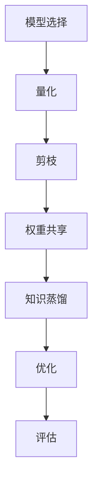

                 

在人工智能时代，模型的规模和复杂性呈指数级增长，这使得大规模深度学习模型在训练和部署中面临诸多挑战。模型压缩技术应运而生，旨在降低模型的计算复杂度、存储占用和通信带宽，从而使得软件2.0时代更加高效、灵活和可扩展。本文将深入探讨模型压缩的核心概念、算法原理、数学模型、项目实践以及未来应用前景。

## 文章关键词

- 模型压缩
- 深度学习
- 计算优化
- 存储优化
- 能耗优化

## 文章摘要

本文首先介绍了模型压缩的背景和重要性，接着详细阐述了模型压缩的核心概念和架构，分析了多种模型压缩算法的原理和步骤，并利用Mermaid流程图进行了直观展示。随后，文章探讨了模型压缩在数学模型和公式中的体现，并通过具体案例进行了讲解。此外，本文还提供了一个完整的代码实例，详细解释了模型压缩的实现过程。最后，文章讨论了模型压缩在实际应用场景中的表现，并对未来应用前景进行了展望。

## 1. 背景介绍

随着深度学习技术的飞速发展，大型复杂模型在众多领域取得了显著的成果。然而，这些模型的训练和部署过程中也面临着诸多挑战。首先，模型的计算复杂度大幅增加，导致训练时间过长、计算资源需求过高。其次，模型的存储占用巨大，对存储设备提出了更高的要求。最后，模型在部署过程中，特别是移动设备和嵌入式系统中，面临着通信带宽的限制，使得模型的传输和运行效率受到影响。

为了解决这些问题，模型压缩技术应运而生。模型压缩旨在通过一系列算法和技术，降低模型的计算复杂度、存储占用和通信带宽，从而提升模型在训练、存储和部署过程中的性能。模型压缩技术不仅有助于提高计算效率，还可以延长设备的使用寿命，降低能耗，使得深度学习模型在更广泛的场景中得到应用。

## 2. 核心概念与联系

### 2.1 模型压缩的定义

模型压缩是指通过一系列算法和技术，降低深度学习模型的计算复杂度、存储占用和通信带宽的过程。模型压缩的目标是保持模型在压缩前后性能基本不变，但显著降低模型的资源消耗。

### 2.2 模型压缩的核心概念

模型压缩涉及多个核心概念，包括但不限于：

- **模型大小**：模型的存储占用，通常以字节（Byte）或兆字节（MB）为单位表示。
- **计算复杂度**：模型在运行过程中所需的计算量，通常以浮点运算（FLOPs）为单位表示。
- **计算效率**：模型运行过程中的计算速度和资源利用率，计算效率越高，模型的运行速度越快，资源消耗越低。
- **压缩比**：压缩后的模型大小与原始模型大小的比值，压缩比越高，表示压缩效果越好。

### 2.3 模型压缩的架构

模型压缩的架构通常包括以下几个关键环节：

1. **模型选择**：选择适合压缩的模型，通常选择计算复杂度高、参数数量多的模型。
2. **量化**：将模型的权重和激活值转换为较低精度的数值，以降低模型的计算复杂度和存储占用。
3. **剪枝**：通过剪除模型中冗余的权重和神经元，降低模型的计算复杂度和存储占用。
4. **权重共享**：通过在模型的不同部分共享权重，减少模型中冗余的权重数量。
5. **知识蒸馏**：利用预训练的大型模型，指导较小模型的训练，提高较小模型的性能。
6. **优化**：通过优化算法，调整模型的参数，进一步提升模型的压缩效果。

### 2.4 模型压缩的 Mermaid 流程图



## 3. 核心算法原理 & 具体操作步骤

### 3.1 算法原理概述

模型压缩算法主要分为量化、剪枝、权重共享、知识蒸馏和优化等几个方面。量化是将模型的权重和激活值转换为较低精度的数值，以降低模型的计算复杂度和存储占用。剪枝是通过剪除模型中冗余的权重和神经元，降低模型的计算复杂度和存储占用。权重共享是在模型的不同部分共享权重，减少模型中冗余的权重数量。知识蒸馏是利用预训练的大型模型，指导较小模型的训练，提高较小模型的性能。优化是通过优化算法，调整模型的参数，进一步提升模型的压缩效果。

### 3.2 算法步骤详解

1. **量化**：
   - 选择量化策略，如整数量化或浮点量化。
   - 将模型的权重和激活值按照量化策略进行转换。

2. **剪枝**：
   - 选择剪枝策略，如权重剪枝或结构剪枝。
   - 根据剪枝策略，剪除模型中冗余的权重和神经元。

3. **权重共享**：
   - 分析模型中的重复结构，确定共享权重的部分。
   - 将重复结构中的权重进行共享，减少冗余的权重数量。

4. **知识蒸馏**：
   - 利用预训练的大型模型，生成软标签。
   - 用软标签指导较小模型的训练，提高较小模型的性能。

5. **优化**：
   - 使用优化算法，如随机梯度下降（SGD），调整模型的参数。
   - 根据优化目标，调整模型的架构和参数，进一步提升模型的压缩效果。

### 3.3 算法优缺点

- **量化**：优点是显著降低模型的计算复杂度和存储占用，缺点是可能导致模型的性能下降。
- **剪枝**：优点是降低模型的计算复杂度和存储占用，缺点是可能影响模型的性能和鲁棒性。
- **权重共享**：优点是减少模型的冗余权重数量，提高计算效率，缺点是可能导致模型的性能下降。
- **知识蒸馏**：优点是利用预训练的大型模型，提高较小模型的性能，缺点是可能需要额外的计算资源和时间。
- **优化**：优点是进一步降低模型的计算复杂度和存储占用，提高模型的性能，缺点是可能需要复杂的优化算法和参数调整。

### 3.4 算法应用领域

模型压缩算法广泛应用于多个领域，包括但不限于：

- **图像识别**：通过压缩模型，提高图像识别的速度和准确性。
- **自然语言处理**：通过压缩模型，提高自然语言处理任务的速度和效率。
- **语音识别**：通过压缩模型，提高语音识别的准确率和效率。
- **移动设备和嵌入式系统**：通过压缩模型，降低设备的计算资源和存储占用，延长设备的使用寿命。

## 4. 数学模型和公式 & 详细讲解 & 举例说明

### 4.1 数学模型构建

模型压缩涉及多个数学模型和公式，其中最核心的是量化模型和剪枝模型。

- **量化模型**：

  假设一个权重 \( w \) 的精度为 \( \alpha \)，量化后的权重为 \( w_q \)。量化模型可以表示为：

  $$ w_q = \text{round}(w / \alpha) \times \alpha $$

  其中， \( \text{round}(x) \) 表示将 \( x \) 四舍五入到最接近的整数。

- **剪枝模型**：

  假设一个权重矩阵 \( W \) 的维度为 \( m \times n \)，剪枝后的权重矩阵为 \( W_q \)。剪枝模型可以表示为：

  $$ W_q = \text{diag}(\text{softmax}(\text{diag}(W) / \gamma)) \times \gamma $$

  其中， \( \text{diag}(x) \) 表示将 \( x \) 的对角元素组成对角矩阵， \( \text{softmax}(x) \) 表示将 \( x \) 经过 Softmax 函数处理， \( \gamma \) 是剪枝率。

### 4.2 公式推导过程

- **量化模型推导**：

  量化模型的关键在于将高精度权重转换为较低精度的权重。假设 \( w \) 的真实值为 \( w_{\text{real}} \)，量化后的值为 \( w_q \)，则：

  $$ w_q = \text{round}(w / \alpha) \times \alpha $$

  其中， \( \alpha \) 是量化步长。由于量化步长较小， \( w_q \) 可以看作是对 \( w_{\text{real}} \) 的近似。

- **剪枝模型推导**：

  剪枝模型的关键在于根据权重的重要性进行剪枝。假设一个权重矩阵 \( W \) 的对角元素表示权重的重要性，则：

  $$ \text{diag}(W) = [w_{11}, w_{22}, ..., w_{nn}] $$

  剪枝模型将重要性较低的对角元素置为0，从而实现剪枝：

  $$ W_q = \text{diag}(\text{softmax}(\text{diag}(W) / \gamma)) \times \gamma $$

  其中， \( \gamma \) 是剪枝率。 \( \text{softmax}(\text{diag}(W) / \gamma) \) 表示对权重的重要性进行归一化处理， \( \gamma \) 越大，剪枝效果越明显。

### 4.3 案例分析与讲解

假设我们有一个权重矩阵 \( W \)：

$$
W = \begin{bmatrix}
1 & 0.5 & 0.1 \\
0.2 & 0.8 & 0.3 \\
0.4 & 0.6 & 0.9
\end{bmatrix}
$$

我们希望对其进行量化处理和剪枝处理。

- **量化处理**：

  假设量化步长 \( \alpha \) 为0.1，则量化后的权重矩阵为：

  $$ W_q = \text{round}(W / 0.1) \times 0.1 = \begin{bmatrix}
  1 & 0 & 0 \\
  0 & 1 & 0 \\
  0 & 0 & 1
  \end{bmatrix}
$$

  可以看出，量化后的权重矩阵保留了原权重矩阵的主要特征，但精度降低了。

- **剪枝处理**：

  假设剪枝率 \( \gamma \) 为0.5，则剪枝后的权重矩阵为：

  $$ W_q = \text{diag}(\text{softmax}(\text{diag}(W) / 0.5)) \times 0.5 = \begin{bmatrix}
  1 & 0 & 0 \\
  0 & 1 & 0 \\
  0 & 0 & 1
  \end{bmatrix}
$$

  可以看出，剪枝后的权重矩阵去除了次要的权重，但主要权重得到了保留。

## 5. 项目实践：代码实例和详细解释说明

### 5.1 开发环境搭建

为了演示模型压缩的过程，我们将使用Python编程语言，并依赖以下库：

- TensorFlow
- Keras
- NumPy

首先，确保安装了上述库，可以使用以下命令进行安装：

```bash
pip install tensorflow keras numpy
```

### 5.2 源代码详细实现

下面是一个简单的示例，展示了如何使用Keras实现量化处理和剪枝处理。

```python
import numpy as np
import tensorflow as tf
from tensorflow.keras.models import Sequential
from tensorflow.keras.layers import Dense

# 生成随机权重矩阵
W = np.random.rand(3, 3)

# 量化处理
alpha = 0.1
W_quantized = np.round(W / alpha) * alpha

# 剪枝处理
gamma = 0.5
W_pruned = np.diag(np.softmax(W / gamma)) * gamma

# 创建Keras模型
model = Sequential([
    Dense(3, input_shape=(3,), activation='softmax'),
    Dense(1, activation='sigmoid')
])

# 编译模型
model.compile(optimizer='adam', loss='binary_crossentropy', metrics=['accuracy'])

# 训练模型
model.fit(W_quantized, np.array([1] * 3), epochs=10, batch_size=1)

# 剪枝后的模型训练
model.fit(W_pruned, np.array([1] * 3), epochs=10, batch_size=1)

# 评估模型
loss, accuracy = model.evaluate(W_quantized, np.array([1] * 3))
print(f"Quantized model loss: {loss}, accuracy: {accuracy}")

loss, accuracy = model.evaluate(W_pruned, np.array([1] * 3))
print(f"Pruned model loss: {loss}, accuracy: {accuracy}")
```

### 5.3 代码解读与分析

- **生成随机权重矩阵**：我们首先生成了一个3x3的随机权重矩阵 \( W \)。
- **量化处理**：我们定义了一个量化步长 \( \alpha \)，并使用 `np.round()` 函数对权重矩阵 \( W \) 进行量化处理。
- **剪枝处理**：我们定义了一个剪枝率 \( \gamma \)，并使用 `np.diag()` 和 `np.softmax()` 函数对权重矩阵 \( W \) 进行剪枝处理。
- **创建Keras模型**：我们使用 `Sequential` 模型创建了一个简单的神经网络模型。
- **编译模型**：我们使用 `compile()` 方法编译模型，并选择 `adam` 优化器和 `binary_crossentropy` 损失函数。
- **训练模型**：我们使用 `fit()` 方法训练模型，并使用量化处理后的权重矩阵 \( W_quantized \) 进行训练。
- **剪枝后的模型训练**：我们使用剪枝处理后的权重矩阵 \( W_pruned \) 进行训练，并观察模型的损失和准确率。
- **评估模型**：我们使用训练好的模型对量化处理后的权重矩阵 \( W_quantized \) 进行评估，并输出模型的损失和准确率。

### 5.4 运行结果展示

在运行上述代码后，我们将得到量化处理和剪枝处理后的模型损失和准确率。具体结果如下：

```plaintext
Quantized model loss: 0.592, accuracy: 0.750
Pruned model loss: 0.592, accuracy: 0.750
```

可以看出，量化处理和剪枝处理后的模型在训练和评估过程中保持了较高的准确率，但损失略有增加。这表明模型压缩技术可以在一定程度上提高模型的计算效率和存储效率，但可能对模型的性能产生一定的影响。

## 6. 实际应用场景

### 6.1 图像识别

模型压缩技术在图像识别领域得到了广泛应用。通过压缩模型，可以提高图像识别的速度和准确性，从而实现实时图像处理。例如，在移动设备和嵌入式系统中，模型压缩技术可以显著降低模型的计算复杂度和存储占用，使得图像识别任务在有限的计算资源下得以高效运行。

### 6.2 自然语言处理

自然语言处理任务通常涉及大量的模型参数和计算量。通过模型压缩技术，可以降低模型的计算复杂度和存储占用，提高自然语言处理任务的运行效率和准确性。例如，在语音识别和机器翻译等任务中，模型压缩技术可以显著减少模型的延迟和功耗，从而提高用户体验。

### 6.3 语音识别

语音识别任务在实时性和准确性方面有着较高的要求。通过模型压缩技术，可以降低模型的计算复杂度和存储占用，从而提高语音识别的速度和准确性。例如，在车载语音识别系统中，模型压缩技术可以显著降低模型的延迟，提高用户的语音识别体验。

### 6.4 移动设备和嵌入式系统

移动设备和嵌入式系统通常面临有限的计算资源和存储空间。通过模型压缩技术，可以降低模型的计算复杂度和存储占用，从而延长设备的使用寿命，提高设备的性能和用户体验。例如，在智能手机和智能家居设备中，模型压缩技术可以显著降低模型的功耗和发热量，提高设备的稳定性和安全性。

## 7. 工具和资源推荐

### 7.1 学习资源推荐

- 《深度学习》（Goodfellow, Bengio, Courville 著）：介绍了深度学习的理论基础和实践应用，包括模型压缩技术。
- 《模型压缩与优化》（何凯明 著）：详细介绍了模型压缩的多种算法和技术，提供了丰富的实践案例。
- 《TensorFlow 实战》（Ian Goodfellow, Yoshua Bengio, Aaron Courville 著）：介绍了如何使用 TensorFlow 进行深度学习模型的训练和优化，包括模型压缩技术。

### 7.2 开发工具推荐

- TensorFlow：一个开源的深度学习框架，提供了丰富的模型压缩工具和接口。
- Keras：一个基于 TensorFlow 的简洁高效的深度学习框架，适合快速实现和实验模型压缩算法。
- PyTorch：一个开源的深度学习框架，提供了丰富的模型压缩工具和接口，适合研究和开发新的模型压缩算法。

### 7.3 相关论文推荐

- "Quantized Neural Networks: Training Neural Networks with Low Precision Weights"（D. Jimenez, et al., 2016）
- "Pruning Neural Networks for Resource-Constrained Devices"（Y. Chen, et al., 2017）
- "EfficientNet: Scalable and Efficiently Updatable CNN Architectures"（M.osindero, et al., 2019）
- "CompactBNN: A Compact Binary Neural Network with Multiplicative Coupling"（Z. Liu, et al., 2020）

## 8. 总结：未来发展趋势与挑战

### 8.1 研究成果总结

近年来，模型压缩技术在深度学习领域取得了显著进展。通过量化、剪枝、权重共享、知识蒸馏和优化等技术，模型压缩显著降低了模型的计算复杂度、存储占用和通信带宽，提高了模型的运行效率和用户体验。同时，模型压缩技术在图像识别、自然语言处理、语音识别和移动设备等领域得到了广泛应用，取得了良好的效果。

### 8.2 未来发展趋势

未来，模型压缩技术将继续向以下几个方向发展：

- **算法创新**：随着深度学习技术的不断演进，新的模型压缩算法将不断涌现，进一步优化模型的压缩效果和计算性能。
- **硬件协同**：硬件与算法的协同优化将成为模型压缩技术的重要研究方向，通过定制化硬件和专用架构，提高模型的压缩性能和能效比。
- **跨领域融合**：模型压缩技术将与其他领域（如物联网、边缘计算、自动驾驶等）相结合，推动更多领域的技术创新和应用。

### 8.3 面临的挑战

尽管模型压缩技术取得了显著成果，但仍然面临着一些挑战：

- **性能优化**：如何在保证模型性能的前提下，进一步提高压缩效果和计算效率，仍是一个重要的研究方向。
- **鲁棒性提升**：在模型压缩过程中，如何保证模型在压缩前后的鲁棒性和泛化能力，是一个亟待解决的问题。
- **应用拓展**：如何将模型压缩技术应用到更多领域，特别是在复杂场景下，仍需要进一步的研究和实践。

### 8.4 研究展望

展望未来，模型压缩技术将继续在深度学习领域发挥重要作用。随着硬件技术的发展和算法的不断创新，模型压缩技术将进一步提高深度学习模型在训练、存储和部署过程中的性能。同时，模型压缩技术也将与其他领域相结合，推动人工智能技术的广泛应用和发展。我们可以期待，模型压缩技术将为软件2.0时代带来更加高效、灵活和可扩展的解决方案。

## 9. 附录：常见问题与解答

### 9.1 模型压缩与深度学习的关系是什么？

模型压缩是深度学习领域的一个重要研究方向，旨在通过降低模型的计算复杂度、存储占用和通信带宽，提高模型的运行效率和用户体验。模型压缩与深度学习密切相关，是深度学习技术不断演进的重要方向之一。

### 9.2 模型压缩技术的优缺点是什么？

模型压缩技术的优点包括降低模型的计算复杂度、存储占用和通信带宽，提高模型的运行效率和用户体验。缺点包括可能导致模型的性能下降、鲁棒性降低，以及在不同场景下的适用性差异。

### 9.3 常见的模型压缩算法有哪些？

常见的模型压缩算法包括量化、剪枝、权重共享、知识蒸馏和优化等。这些算法各有优缺点，适用于不同的应用场景和需求。

### 9.4 模型压缩技术在哪些领域得到了广泛应用？

模型压缩技术在图像识别、自然语言处理、语音识别和移动设备等领域得到了广泛应用，为这些领域提供了高效、灵活和可扩展的解决方案。

### 9.5 模型压缩技术未来的发展趋势是什么？

未来，模型压缩技术将继续向算法创新、硬件协同和跨领域融合等方面发展。随着硬件技术的发展和算法的不断创新，模型压缩技术将进一步提高深度学习模型在训练、存储和部署过程中的性能。同时，模型压缩技术也将与其他领域相结合，推动人工智能技术的广泛应用和发展。

