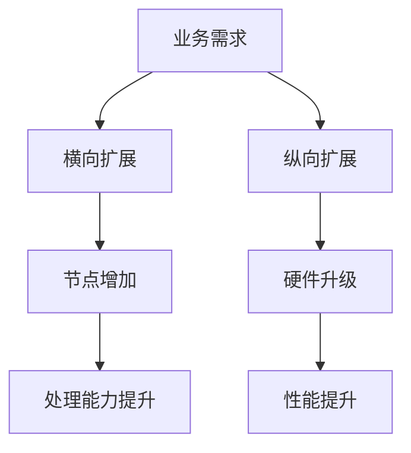
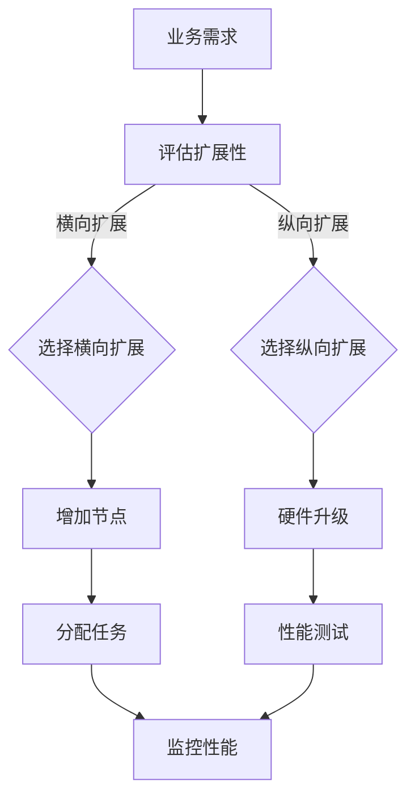

                 

## 摘要

本文将深入探讨横向可扩展性与纵向可扩展性在信息技术领域的核心概念、应用场景以及技术实现。通过对两者之间关系的详细分析，我们旨在揭示其在现代分布式系统和云计算环境中的重要性。本文首先介绍了横向与纵向扩展的基本原理，随后通过实际案例和数学模型阐述了这两种扩展方式的优缺点。文章还提供了代码实例，帮助读者更好地理解这些概念的具体实现。最后，我们对横向和纵向扩展的未来发展趋势进行了展望，并提出了潜在的挑战和解决方案。

## 1. 背景介绍

在现代信息技术的快速发展中，系统性能的优化和资源利用率的提升成为各大企业和研究机构关注的焦点。随着互联网业务的不断增长和用户数量的激增，传统的单机系统和集中式架构逐渐无法满足日益增加的负载需求。为此，分布式系统成为解决这一难题的关键技术。分布式系统通过将任务分布在多个节点上，实现资源的共享和负载的均衡，从而提高了系统的整体性能和可靠性。

在分布式系统中，横向扩展（Horizontal Scaling）和纵向扩展（Vertical Scaling）是两种常见的扩展方式。横向扩展主要通过增加计算节点数量来提升系统的处理能力，而纵向扩展则通过提升单个节点的硬件性能来实现。这两种扩展方式各有优劣，适用于不同的应用场景和业务需求。

### 1.1 横向扩展

横向扩展（Horizontal Scaling）也称为水平扩展，是指通过增加系统中的节点数量来提升处理能力和存储容量。这种扩展方式具有以下优点：

1. **弹性伸缩**：可以根据业务需求动态调整节点数量，实现弹性的资源管理。
2. **高可用性**：通过冗余节点提高系统的容错能力，当一个节点发生故障时，其他节点可以接管其工作。
3. **负载均衡**：多个节点可以分担负载，提高系统的响应速度和吞吐量。

然而，横向扩展也存在一些挑战：

1. **数据一致性**：随着节点数量的增加，如何保证数据的一致性成为一大难题。
2. **网络带宽**：增加节点数量可能导致网络带宽成为瓶颈，影响系统性能。
3. **管理复杂度**：维护和管理大量节点增加了系统的复杂度，需要更多的自动化和运维工具。

### 1.2 纵向扩展

纵向扩展（Vertical Scaling）也称为垂直扩展，是通过提升单个节点的硬件性能来实现系统性能的提升。这种扩展方式具有以下优点：

1. **性能提升**：通过升级CPU、内存、存储等硬件设备，直接提升单个节点的处理能力和存储容量。
2. **简单实施**：相对于横向扩展，纵向扩展的实施相对简单，不需要对现有系统架构进行大规模更改。
3. **良好的兼容性**：纵向扩展通常不会对系统的其他部分产生较大影响，兼容性较好。

然而，纵向扩展也存在一定的局限性：

1. **成本较高**：提升硬件性能往往需要大量的资金投入，成本较高。
2. **资源利用率低**：单点性能的提升不一定能充分利用系统中的其他资源，导致资源利用率不高。
3. **可扩展性受限**：随着硬件性能的提升，单点能力的增强可能不再能满足业务需求，需要不断进行硬件升级。

综上所述，横向扩展和纵向扩展各有优劣，适用于不同的场景和需求。在实际应用中，往往需要根据具体情况选择合适的扩展方式，或结合使用两者，以实现最优的系统性能和资源利用率。

### 1.3 本文结构

本文将首先介绍横向扩展和纵向扩展的基本原理，通过Mermaid流程图展示两者之间的联系。接着，我们将详细分析核心算法原理，并分步骤讲解算法的实现过程。随后，通过数学模型和公式对算法进行深入探讨，并结合实际案例进行说明。文章还将提供具体的代码实例，帮助读者更好地理解这些概念。最后，我们将探讨横向扩展和纵向扩展在实际应用场景中的表现，并对未来发展趋势和面临的挑战进行展望。

## 2. 核心概念与联系

在分布式系统中，横向扩展和纵向扩展是两个核心的概念。它们各自代表了不同的扩展策略，用于提升系统的性能和可伸缩性。为了更好地理解这两者之间的关系，我们首先需要明确它们的基本定义，然后通过Mermaid流程图来展示它们之间的联系。

### 2.1 横向扩展（Horizontal Scaling）

横向扩展是指通过增加系统中的节点数量来提升系统的处理能力和存储容量。这种扩展方式适用于需要处理大量请求或存储大量数据的系统。通过横向扩展，系统能够实现更高的吞吐量和更好的弹性。

### 2.2 纵向扩展（Vertical Scaling）

纵向扩展则是指通过提升单个节点的硬件性能来实现系统性能的提升。这通常涉及到升级CPU、内存、存储等硬件设备。纵向扩展适用于那些对单点性能有较高要求的场景，例如高性能计算和大数据处理。

### 2.3 联系与对比

横向扩展和纵向扩展在分布式系统中的作用是互补的。横向扩展可以增加系统的容量和弹性，而纵向扩展则可以提高系统的处理速度和响应时间。

以下是一个Mermaid流程图，展示了横向扩展和纵向扩展之间的联系：



在这个流程图中，业务需求是横向扩展和纵向扩展的起点。根据业务需求，系统可以选择横向扩展或纵向扩展，或者两者结合使用。节点增加和硬件升级分别代表了横向扩展和纵向扩展的具体实施过程，而处理能力和性能提升则展示了这两种扩展方式的效果。

### 2.4 横向扩展与纵向扩展的优缺点对比

为了更深入地理解横向扩展和纵向扩展的适用场景，我们在此提供一个对比表，展示两者的优缺点：

| 对比项            | 横向扩展                         | 纵向扩展                           |
|-------------------|--------------------------------|-----------------------------------|
| 成本              | 成本较低，可通过增加节点分摊     | 成本较高，需要升级硬件设备         |
| 资源利用率        | 资源利用率较高，易于动态调整     | 资源利用率较低，单点性能提升未必充分利用 |
| 可扩展性          | 可线性扩展，易于实现弹性伸缩     | 可扩展性有限，硬件升级受限         |
| 复杂度            | 复杂度较高，需要解决数据一致性问题 | 复杂度较低，实施相对简单           |
| 灵活性            | 灵活性较高，可快速响应业务需求   | 灵活性较低，硬件升级周期较长       |

通过这个对比表，我们可以看到横向扩展和纵向扩展在成本、资源利用率、可扩展性、复杂度和灵活性等方面各有优劣。在实际应用中，系统设计者需要根据具体需求和预算，综合考虑选择最适合的扩展方式。

### 2.5 Mermaid 流程图

为了更好地展示横向扩展和纵向扩展的流程，以下是一个Mermaid流程图的示例：



在这个流程图中，业务需求是系统扩展的起点。根据业务需求，系统评估扩展性，并选择横向扩展或纵向扩展。横向扩展通过增加节点和任务分配实现，纵向扩展则通过硬件升级和性能测试来实现。监控性能是确保扩展效果的重要步骤。

通过Mermaid流程图的展示，我们可以更加直观地理解横向扩展和纵向扩展的流程和关系。这种可视化工具不仅有助于清晰表达复杂的技术概念，还能帮助设计者在系统架构设计时做出更明智的决策。

### 2.6 横向扩展与纵向扩展的应用场景

在实际应用中，横向扩展和纵向扩展的选择往往取决于具体的应用场景和业务需求。以下是一些常见应用场景，以及在这两种场景下横向扩展和纵向扩展的适用性：

#### 2.6.1 高并发在线交易系统

对于高并发的在线交易系统，横向扩展是更常见的解决方案。在线交易系统需要处理大量的并发请求，如果采用纵向扩展，即通过提升单个服务器的性能来满足需求，那么在短时间内可能会解决问题，但随着用户数量的继续增加，单点性能的提升已经无法满足需求。而通过横向扩展，系统可以灵活地增加节点数量，从而在负载增加时实现线性扩展。

**横向扩展优势：**
- **高吞吐量**：多个节点可以同时处理请求，提高系统的整体吞吐量。
- **弹性伸缩**：可以根据实际需求动态调整节点数量，实现弹性伸缩。

**横向扩展挑战：**
- **数据一致性**：随着节点数量的增加，如何保证数据一致性成为一个重要问题。
- **网络带宽**：大量节点之间的通信可能消耗大量网络带宽。

#### 2.6.2 大数据处理平台

大数据处理平台通常需要进行大量的数据处理和分析，这种场景下，纵向扩展更加适用。大数据处理往往需要大量的内存和计算资源，通过提升单个节点的硬件性能，可以显著提高处理速度和效率。

**纵向扩展优势：**
- **高性能计算**：通过提升单个节点的硬件性能，实现更快的数据处理和分析。
- **简单实施**：相对于横向扩展，纵向扩展的实施更加简单，不需要对现有系统架构进行大规模更改。

**纵向扩展挑战：**
- **成本较高**：硬件升级成本较高，可能不适合预算有限的项目。
- **资源利用率低**：单点性能的提升可能无法充分利用系统中的其他资源。

#### 2.6.3 实时视频流媒体平台

实时视频流媒体平台需要处理大量的视频流，对延迟和吞吐量有较高要求。在这种情况下，纵向扩展和横向扩展的结合使用可能是最佳方案。通过纵向扩展提升单个节点的处理能力，确保视频流的实时性；通过横向扩展增加节点数量，实现更高的吞吐量和更好的弹性。

**结合扩展优势：**
- **高性能和高吞吐量**：通过纵向扩展提升单个节点的处理能力，通过横向扩展增加节点数量，实现高性能和高吞吐量的平衡。
- **弹性伸缩**：可以根据实际需求动态调整节点数量，同时保证系统性能。

**结合扩展挑战：**
- **复杂度增加**：需要更复杂的系统架构设计和运维管理。
- **成本增加**：横向和纵向扩展的综合成本可能较高。

#### 2.6.4 云计算服务提供商

对于云计算服务提供商，横向扩展和纵向扩展的综合使用是常见的策略。云计算服务通常需要提供弹性、可靠和高效的服务，以满足不同客户的需求。

**结合扩展优势：**
- **灵活性**：可以根据客户需求动态调整节点数量和硬件性能，提供定制化的服务。
- **高可用性**：通过横向扩展和纵向扩展的结合，提高系统的整体可靠性和容错能力。

**结合扩展挑战：**
- **管理复杂度**：需要复杂的调度和资源管理策略，以确保系统的高效运行。
- **成本控制**：需要平衡扩展成本和客户收益，确保盈利能力。

综上所述，横向扩展和纵向扩展各有优劣，适用于不同的应用场景和业务需求。在实际应用中，系统设计者需要根据具体情况进行综合分析和决策，以实现最优的系统性能和资源利用率。

### 2.7 横向扩展与纵向扩展的适用性分析

横向扩展和纵向扩展在分布式系统中的应用各有其适用性，其选择往往取决于系统需求、预算、资源约束以及技术实现等多种因素。以下将详细分析这两种扩展方式的适用性，并讨论如何在实际项目中做出最佳选择。

#### 2.7.1 系统需求与性能考量

首先，系统的需求是决定扩展方式的关键因素。对于一些对实时性和吞吐量有较高要求的系统，如在线交易、实时数据处理和视频流媒体等，横向扩展往往是首选。因为这些系统通常需要处理大量的并发请求，并且业务需求可能在短时间内迅速增长，横向扩展能够提供更高的吞吐量和弹性伸缩能力。

**横向扩展适用性：**
- **高并发处理**：通过增加节点数量，可以实现线性扩展，从而满足高并发处理的需求。
- **弹性伸缩**：可以根据业务波动动态调整节点数量，实现资源的弹性分配。

**纵向扩展适用性：**
- **单点性能提升**：对于需要处理大量数据或执行复杂计算的任务，提升单个节点的性能能够显著提高系统的处理速度和效率。
- **特定任务优化**：某些任务对计算资源有特定需求，通过纵向扩展可以针对性地提升硬件性能，例如高性能计算和大数据处理。

#### 2.7.2 预算与成本考虑

预算和成本是另一个重要考量因素。在资源有限的情况下，横向扩展通常成本较低，可以通过增加廉价的节点数量来提升系统性能。而纵向扩展则成本较高，通常需要投入大量的资金来升级硬件设备。因此，在预算有限的情况下，横向扩展可能是更经济的选择。

**横向扩展成本：**
- **低成本**：使用性价比高的硬件设备，通过增加节点数量实现扩展。
- **分摊成本**：将扩展成本分摊到多个节点上，降低了单个节点的成本负担。

**纵向扩展成本：**
- **高成本**：硬件升级通常涉及高端服务器和存储设备，成本较高。
- **一次性投入**：硬件升级通常是一次性投入，需要提前规划资金。

#### 2.7.3 资源利用与效率

资源利用率和系统效率也是影响扩展方式选择的重要因素。横向扩展能够更好地利用系统资源，特别是当节点数量与处理能力之间存在一定比例时，系统能够实现较高的资源利用率。而纵向扩展则可能导致资源利用率较低，因为单点性能的提升未必能充分利用系统中的其他资源。

**横向扩展效率：**
- **资源利用率高**：通过增加节点数量，可以在负载均衡的基础上充分利用系统资源。
- **负载均衡**：多个节点分担负载，提高系统的整体效率和吞吐量。

**纵向扩展效率：**
- **资源利用率低**：单点性能提升可能无法充分利用系统中的其他资源，导致资源浪费。
- **性能瓶颈**：在某些情况下，单点性能的提升可能无法解决系统中的瓶颈问题，需要进一步的扩展。

#### 2.7.4 技术实现与运维管理

技术实现和运维管理也是选择扩展方式时需要考虑的因素。横向扩展通常需要解决数据一致性和网络带宽等问题，而纵向扩展则相对简单，更容易实现和维护。

**横向扩展实现：**
- **数据一致性**：需要设计分布式数据存储和复制机制，确保数据一致性。
- **网络带宽**：随着节点数量增加，网络带宽可能成为瓶颈，需要优化网络架构。

**纵向扩展实现：**
- **简单实现**：硬件升级通常涉及更换或添加硬件设备，实现相对简单。
- **兼容性**：纵向扩展通常不会对现有系统架构产生较大影响，兼容性较好。

#### 2.7.5 实际应用案例分析

在实际项目中，横向扩展和纵向扩展的选择往往需要结合具体情况进行综合分析。以下是一些案例分析：

1. **电商平台**：电商平台的订单处理系统通常采用横向扩展，因为订单量巨大且波动较大，通过增加节点数量可以灵活应对高峰期和日常业务的负载波动。

2. **金融交易系统**：金融交易系统对延迟和吞吐量有严格要求，通过纵向扩展提升单点性能，同时结合横向扩展增加节点数量，以应对突发交易高峰。

3. **社交媒体平台**：社交媒体平台的数据存储和处理需求巨大，通过纵向扩展提升存储和计算性能，同时通过横向扩展增加节点数量，实现数据的高效存储和处理。

综上所述，横向扩展和纵向扩展各有其适用性，系统设计者需要根据具体需求和实际情况，综合考虑成本、性能、资源利用率和运维管理等多个因素，选择最合适的扩展方式，以实现最优的系统性能和资源利用率。

### 3. 核心算法原理 & 具体操作步骤

在深入探讨横向扩展和纵向扩展之前，我们先来介绍一些核心算法原理，这些算法在分布式系统中的应用至关重要。这些算法包括负载均衡算法、分布式一致性算法和数据复制算法。理解这些算法的基本原理和具体操作步骤，有助于我们更好地理解横向扩展和纵向扩展的实现机制。

#### 3.1 负载均衡算法

负载均衡算法是分布式系统中的一项关键技术，用于将任务分配到多个节点上，实现负载的均衡。常见的负载均衡算法包括哈希负载均衡、最小连接数负载均衡和轮询负载均衡等。

**哈希负载均衡**：哈希负载均衡通过哈希函数将请求映射到不同的节点上。每个请求的IP地址或URL等特征值通过哈希函数计算出一个哈希值，这个哈希值决定了请求将被分配到哪个节点。这种方式可以实现较好的负载均衡效果，但需要处理哈希碰撞问题。

**最小连接数负载均衡**：最小连接数负载均衡算法通过将新的请求分配到当前连接数最少的节点上，实现负载的均衡。这种方式适用于连接数较稳定的场景，能够有效避免某几个节点过度负载。

**轮询负载均衡**：轮询负载均衡是最简单的一种负载均衡算法，它按照顺序将请求分配到每个节点。虽然这种方式不能完全避免某个节点的过度负载，但在实现上相对简单，适用于负载波动不大的场景。

**具体操作步骤**：
1. 收集请求特征值（如IP地址、URL等）。
2. 计算特征值的哈希值或当前连接数。
3. 根据哈希值或连接数将请求分配到节点。

#### 3.2 分布式一致性算法

分布式一致性算法是确保分布式系统中数据一致性的关键。常见的分布式一致性算法包括Paxos算法和Raft算法。

**Paxos算法**：Paxos算法是一种用于分布式系统的共识算法，它能够在多个节点之间达成一致性决策。Paxos算法通过提案、投票和决 mayoría机制来确保所有节点最终达成一致。

**Raft算法**：Raft算法是一种更加易于理解的分布式一致性算法，它通过日志复制和领导选举机制来实现一致性。Raft算法将状态机分为日志条目、提交状态和领导选举三个关键部分。

**具体操作步骤**：
1. **提案阶段**：节点发起提案，将日志条目发送给其他节点。
2. **投票阶段**：其他节点对提案进行投票，并返回投票结果。
3. **决多數阶段**：根据投票结果，决定是否提交提案。

#### 3.3 数据复制算法

数据复制算法是确保分布式系统中数据可靠性的关键。常见的复制算法包括主从复制和去中心化复制。

**主从复制**：主从复制是指系统中的一个节点作为主节点，负责处理所有读写请求，其他节点作为从节点，负责复制主节点的数据。当主节点发生故障时，从节点可以通过选举产生新的主节点，从而保证系统的持续运行。

**去中心化复制**：去中心化复制是指系统中所有节点都可以读写数据，并通过一致性算法确保数据一致性。这种方式在去中心化系统中应用较多，例如区块链。

**具体操作步骤**：
1. **初始化**：系统启动时，所有节点同步初始数据。
2. **读写请求**：主节点处理所有读写请求，从节点复制主节点的数据。
3. **故障处理**：主节点故障时，从节点通过一致性算法进行选举，产生新的主节点。

#### 3.4 算法优缺点

每种算法都有其优缺点，适用于不同的应用场景。

**负载均衡算法**：
- **哈希负载均衡**：优点是分布均匀，缺点是处理哈希碰撞。
- **最小连接数负载均衡**：优点是负载均衡，缺点是处理连接数不稳定。
- **轮询负载均衡**：优点是简单实现，缺点是负载不均衡。

**分布式一致性算法**：
- **Paxos算法**：优点是可靠性高，缺点是算法复杂。
- **Raft算法**：优点是易于理解，缺点是性能可能略低。

**数据复制算法**：
- **主从复制**：优点是可靠性高，缺点是单点故障。
- **去中心化复制**：优点是去中心化，缺点是一致性算法复杂。

通过理解这些算法的基本原理和具体操作步骤，我们可以更好地设计分布式系统，实现横向扩展和纵向扩展。在接下来的部分，我们将进一步探讨横向扩展和纵向扩展的实现机制，并通过实际案例展示这些算法的应用。

#### 3.5 横向扩展算法实现

横向扩展主要通过增加节点数量来提升系统的处理能力和存储容量。为了实现横向扩展，我们需要设计相应的算法来分配任务、维护数据一致性以及处理网络通信等问题。以下是一种常见的横向扩展算法实现，包括具体操作步骤和算法流程。

##### 3.5.1 任务分配算法

任务分配算法是横向扩展的核心之一，其目的是将任务均匀地分配到各个节点上。以下是几种常见的任务分配算法：

1. **哈希分配算法**：
   - **原理**：通过哈希函数将任务ID映射到节点ID。
   - **操作步骤**：
     1. 对任务ID进行哈希运算，得到哈希值。
     2. 根据哈希值决定任务分配到的节点。
   - **优点**：分布均匀，负载均衡。
   - **缺点**：需要处理哈希碰撞。

2. **最小连接数分配算法**：
   - **原理**：将新任务分配到当前连接数最少的节点。
   - **操作步骤**：
     1. 统计所有节点的当前连接数。
     2. 将任务分配到连接数最少的节点。
   - **优点**：负载均衡。
   - **缺点**：处理连接数不稳定。

3. **轮询分配算法**：
   - **原理**：按照顺序将任务分配到各个节点。
   - **操作步骤**：
     1. 按照顺序生成节点列表。
     2. 将任务依次分配到节点列表中的节点。
   - **优点**：简单实现。
   - **缺点**：负载不均衡。

##### 3.5.2 数据一致性算法

在横向扩展中，数据一致性是一个关键问题。以下是一种常用的数据一致性算法——Paxos算法：

1. **Paxos算法概述**：
   - **原理**：通过提案、投票和决多數机制实现一致性。
   - **操作步骤**：
     1. **提案阶段**：
        - 节点A发起提案，将日志条目发送给其他节点。
        - 节点B接收提案，并返回投票结果。
     2. **投票阶段**：
        - 节点B对提案进行投票，并返回投票结果。
        - 根据投票结果，决定是否提交提案。
     3. **决多數阶段**：
        - 根据投票结果，决定是否提交提案。

2. **Paxos算法流程**：
   - **初始化**：
     - 所有节点同步初始状态。
   - **提案阶段**：
     - 节点A发起提案，将日志条目发送给其他节点。
   - **投票阶段**：
     - 节点B接收提案，并返回投票结果。
     - 根据投票结果，决定是否提交提案。
   - **决多數阶段**：
     - 根据投票结果，决定是否提交提案。

##### 3.5.3 网络通信算法

在横向扩展中，节点之间的通信是另一个关键问题。以下是一种简单的网络通信算法：

1. **基于TCP的通信算法**：
   - **原理**：使用TCP协议实现节点之间的可靠通信。
   - **操作步骤**：
     1. 节点A发送请求到节点B。
     2. 节点B接收请求，并返回响应。
     3. 节点A接收响应，并处理结果。

2. **基于UDP的通信算法**：
   - **原理**：使用UDP协议实现节点之间的快速通信。
   - **操作步骤**：
     1. 节点A发送请求到节点B。
     2. 节点B接收请求，并返回响应。
     3. 节点A接收响应，并处理结果。

##### 3.5.4 横向扩展算法优缺点

**横向扩展算法优缺点**：
- **任务分配算法**：
  - **哈希分配算法**：优点是分布均匀，缺点是处理哈希碰撞。
  - **最小连接数分配算法**：优点是负载均衡，缺点是处理连接数不稳定。
  - **轮询分配算法**：优点是简单实现，缺点是负载不均衡。

- **数据一致性算法**：
  - **Paxos算法**：优点是可靠性高，缺点是算法复杂。

- **网络通信算法**：
  - **基于TCP的通信算法**：优点是可靠通信，缺点是延迟较高。
  - **基于UDP的通信算法**：优点是快速通信，缺点是可靠性较低。

通过以上横向扩展算法的实现，我们可以有效地实现系统的横向扩展，提升系统的处理能力和存储容量。在接下来的部分，我们将进一步探讨纵向扩展算法的实现，以全面了解这两种扩展方式的实现机制。

#### 3.6 纵向扩展算法实现

纵向扩展主要是通过提升单个节点的硬件性能来实现系统性能的提升。纵向扩展通常涉及到CPU、内存、存储等硬件设备的升级。以下将介绍一种纵向扩展算法的实现，包括具体操作步骤和算法流程。

##### 3.6.1 硬件性能优化算法

1. **CPU性能优化算法**：
   - **原理**：通过升级CPU核心数和频率，提升计算能力。
   - **操作步骤**：
     1. 选择适合业务的CPU型号。
     2. 更换CPU，确保兼容性。
     3. 重新配置操作系统和应用程序，以充分利用新CPU的性能。
   - **优点**：计算能力提升明显，易于实现。
   - **缺点**：成本较高，性能提升可能受到其他硬件限制。

2. **内存性能优化算法**：
   - **原理**：通过增加内存容量和频率，提升数据存取速度。
   - **操作步骤**：
     1. 选择适合业务的内存条。
     2. 更换内存条，确保兼容性。
     3. 重新配置操作系统和应用程序，以充分利用新增内存。
   - **优点**：数据存取速度提升，系统响应时间缩短。
   - **缺点**：成本较高，内存带宽可能成为瓶颈。

3. **存储性能优化算法**：
   - **原理**：通过升级存储设备，提升数据读写速度。
   - **操作步骤**：
     1. 选择适合业务的存储设备（如固态硬盘、SSD）。
     2. 更换存储设备，确保兼容性。
     3. 优化文件系统配置，提高数据读写效率。
   - **优点**：数据读写速度提升，系统性能显著提高。
   - **缺点**：成本较高，存储容量可能成为瓶颈。

##### 3.6.2 硬件性能监控与调优算法

为了确保硬件性能的持续优化，我们需要设计相应的硬件性能监控与调优算法：

1. **实时监控算法**：
   - **原理**：通过监控系统性能指标（如CPU利用率、内存使用率、存储IOPS等），实时监测硬件性能。
   - **操作步骤**：
     1. 安装性能监控工具。
     2. 定期收集系统性能数据。
     3. 分析性能数据，识别瓶颈。
   - **优点**：实时监控硬件性能，及时发现问题。
   - **缺点**：需要大量的监控资源和数据分析。

2. **自动调优算法**：
   - **原理**：通过自动化工具，根据性能监控数据自动调整系统配置。
   - **操作步骤**：
     1. 设计调优策略。
     2. 实现自动调优脚本。
     3. 定期执行调优脚本，自动调整系统配置。
   - **优点**：自动化调优，降低人工干预。
   - **缺点**：需要精确的调优策略和脚本实现。

##### 3.6.3 纵向扩展算法优缺点

**纵向扩展算法优缺点**：
- **CPU性能优化算法**：优点是计算能力提升明显，缺点是成本较高。
- **内存性能优化算法**：优点是数据存取速度提升，缺点是成本较高。
- **存储性能优化算法**：优点是数据读写速度提升，缺点是成本较高。
- **实时监控算法**：优点是实时监控硬件性能，缺点是监控资源和数据分析需求高。
- **自动调优算法**：优点是自动化调优，缺点是需要精确的调优策略和脚本实现。

通过上述纵向扩展算法的实现，我们可以有效地提升单个节点的性能，从而提高整个系统的性能。然而，需要注意的是，纵向扩展的成本较高，且硬件性能的提升可能受到其他硬件限制。因此，在实际应用中，我们需要根据具体需求和预算，合理选择纵向扩展的策略，并结合横向扩展实现最优的系统性能和资源利用率。

### 3.7 横向扩展与纵向扩展算法的比较

在分布式系统设计中，横向扩展和纵向扩展的算法选择对系统性能和资源利用率有着重要影响。为了更好地理解两者的差异和适用场景，我们在此对横向扩展和纵向扩展的算法进行比较。

#### 3.7.1 算法复杂度

横向扩展算法通常涉及负载均衡、分布式一致性以及数据复制等方面。以下是比较常见的几种算法及其复杂度：

1. **负载均衡算法**：
   - **哈希负载均衡**：时间复杂度 \(O(1)\)，空间复杂度 \(O(n)\)，其中 \(n\) 为节点数量。
   - **最小连接数负载均衡**：时间复杂度 \(O(n)\)，空间复杂度 \(O(n)\)。
   - **轮询负载均衡**：时间复杂度 \(O(1)\)，空间复杂度 \(O(n)\)。

2. **分布式一致性算法**：
   - **Paxos算法**：时间复杂度 \(O(n)\)，空间复杂度 \(O(n)\)。
   - **Raft算法**：时间复杂度 \(O(n)\)，空间复杂度 \(O(n)\)。

3. **数据复制算法**：
   - **主从复制**：时间复杂度 \(O(n)\)，空间复杂度 \(O(n)\)。
   - **去中心化复制**：时间复杂度 \(O(n)\)，空间复杂度 \(O(n^2)\)。

纵向扩展算法主要关注硬件性能的提升，包括CPU、内存和存储等。以下是比较常见的几种优化算法及其复杂度：

1. **CPU性能优化算法**：
   - **核心数和频率优化**：时间复杂度 \(O(1)\)，空间复杂度 \(O(1)\)。

2. **内存性能优化算法**：
   - **容量和频率优化**：时间复杂度 \(O(1)\)，空间复杂度 \(O(1)\)。

3. **存储性能优化算法**：
   - **读写速度优化**：时间复杂度 \(O(1)\)，空间复杂度 \(O(1)\)。

#### 3.7.2 算法适用性

1. **横向扩展**：
   - **负载均衡算法**：适用于需要高并发处理的场景，如电商平台和社交媒体平台。
   - **分布式一致性算法**：适用于需要保证数据一致性的场景，如数据库和分布式文件系统。
   - **数据复制算法**：适用于需要高可靠性和数据备份的场景，如分布式存储系统和数据备份系统。

2. **纵向扩展**：
   - **CPU性能优化算法**：适用于需要高性能计算的场景，如科学计算和大数据分析。
   - **内存性能优化算法**：适用于需要高数据存取速度的场景，如内存数据库和高速缓存系统。
   - **存储性能优化算法**：适用于需要高数据读写速度的场景，如在线存储系统和分布式文件系统。

#### 3.7.3 算法实现难度

1. **横向扩展**：
   - **负载均衡算法**：相对简单，易于实现。
   - **分布式一致性算法**：相对复杂，需要解决数据一致性和容错性问题。
   - **数据复制算法**：相对简单，但需要处理网络通信和数据同步问题。

2. **纵向扩展**：
   - **CPU性能优化算法**：相对简单，通过更换CPU实现。
   - **内存性能优化算法**：相对简单，通过更换内存条实现。
   - **存储性能优化算法**：相对复杂，需要优化文件系统和存储设备配置。

#### 3.7.4 算法成本

1. **横向扩展**：
   - **负载均衡算法**：成本较低，主要涉及网络带宽和计算资源。
   - **分布式一致性算法**：成本较高，主要涉及存储和计算资源。
   - **数据复制算法**：成本较高，主要涉及存储和网络带宽。

2. **纵向扩展**：
   - **CPU性能优化算法**：成本较高，主要涉及高端CPU设备。
   - **内存性能优化算法**：成本较高，主要涉及高端内存设备。
   - **存储性能优化算法**：成本较高，主要涉及高端存储设备。

通过以上比较，我们可以看到横向扩展和纵向扩展在算法复杂度、适用性、实现难度和成本等方面各有差异。在实际系统设计中，我们需要根据具体需求、预算和技术水平，合理选择合适的扩展算法，以实现最优的系统性能和资源利用率。

### 3.8 横向扩展与纵向扩展的应用领域

横向扩展和纵向扩展在分布式系统中的应用非常广泛，不同的领域对这两种扩展方式的需求有所不同。以下将探讨横向扩展和纵向扩展在几个关键应用领域中的具体应用。

#### 3.8.1 电商平台

电商平台通常需要处理大量的用户请求和交易，对系统的性能和可靠性有极高的要求。为了应对这些需求，电商平台通常采用横向扩展策略，通过增加节点数量来提升系统的吞吐量和弹性。

**横向扩展应用**：
- **负载均衡**：通过负载均衡算法，将用户请求分配到多个节点上，实现负载均衡。
- **分布式数据库**：采用分布式数据库系统，如Apache Cassandra和MongoDB，通过横向扩展来提升数据库的读写性能和存储容量。
- **缓存系统**：使用分布式缓存系统，如Memcached和Redis，通过横向扩展来提高系统的响应速度。

**纵向扩展应用**：
- **高性能服务器**：在高峰期，通过纵向扩展，升级服务器的CPU和内存性能，以应对突发的访问量。
- **数据压缩与传输优化**：在数据传输过程中，通过压缩技术和传输优化算法，提高数据传输速度。

#### 3.8.2 金融交易系统

金融交易系统对延迟和吞吐量有严格的要求，通常采用横向扩展和纵向扩展相结合的方式，以确保系统在高并发和大数据量的场景下依然能够稳定运行。

**横向扩展应用**：
- **分布式计算**：通过横向扩展，使用分布式计算框架，如Apache Hadoop和Spark，处理海量交易数据。
- **分布式存储**：采用分布式文件系统，如HDFS，存储交易数据，实现数据的可靠备份和快速访问。

**纵向扩展应用**：
- **高性能交易服务器**：通过纵向扩展，升级交易服务器的硬件性能，如CPU、内存和存储，以提升交易处理速度。
- **高可用性设计**：通过冗余设计和故障转移机制，确保系统在节点故障时能够快速恢复，提高系统的可靠性。

#### 3.8.3 社交媒体平台

社交媒体平台需要处理大量的用户生成内容和社交互动，对系统的伸缩性和响应速度有较高的要求。

**横向扩展应用**：
- **内容分发网络**（CDN）：通过部署多个CDN节点，将用户生成内容分发到全球各地，提高内容的访问速度。
- **分布式缓存**：通过分布式缓存系统，如Memcached和Redis，提高系统的响应速度和吞吐量。

**纵向扩展应用**：
- **存储优化**：通过纵向扩展，升级存储设备，如使用SSD和优化存储协议，提高数据存储和访问速度。
- **计算资源优化**：通过纵向扩展，增加服务器的CPU和内存，提升系统的计算能力，以处理复杂的社交计算任务。

#### 3.8.4 云计算服务提供商

云计算服务提供商通常需要提供弹性和高效的服务，以满足不同客户的需求。

**横向扩展应用**：
- **资源池化**：通过横向扩展，构建资源池，实现资源的动态分配和调度，提高资源利用率。
- **服务网格**：通过服务网格，如Istio和Linkerd，实现服务之间的可靠通信和流量管理。

**纵向扩展应用**：
- **高性能计算节点**：通过纵向扩展，提供高性能计算节点，如GPU和FPGA，以满足高性能计算需求。
- **存储优化**：通过纵向扩展，提供高性能存储服务，如NVMe SSD和云存储，提高数据访问速度。

综上所述，横向扩展和纵向扩展在电商平台、金融交易系统、社交媒体平台和云计算服务提供商等不同领域中的应用各有特色。通过合理选择和结合使用这两种扩展方式，可以显著提升系统的性能、可靠性和弹性，满足不断增长的业务需求。

### 3.9 案例分析

为了更好地理解横向扩展和纵向扩展在实际系统设计中的应用，我们将在以下部分分析两个具体案例：亚马逊的AWS和谷歌的Google Cloud。这两个案例展示了如何在不同的场景下利用横向扩展和纵向扩展来提升系统性能和可靠性。

#### 3.9.1 亚马逊AWS

亚马逊AWS是全球领先的云计算服务提供商，其基础设施采用了横向扩展和纵向扩展相结合的策略，以应对不同客户的多样化需求。

**横向扩展应用**：
1. **负载均衡**：AWS采用分布式负载均衡算法，将用户请求分配到多个节点上，确保系统的高可用性和负载均衡。例如，EC2实例可以动态调整，以应对不同的负载需求。
2. **分布式数据库**：AWS提供了如RDS和DynamoDB等分布式数据库服务，通过横向扩展来提升系统的读写性能和存储容量。RDS支持多种数据库引擎，如MySQL、PostgreSQL和Oracle，通过自动扩展实例数量，实现数据库的弹性伸缩。
3. **内容分发网络**（CDN）：AWS的CloudFront服务通过全球分布的节点，实现内容的快速分发，提高用户的访问速度。

**纵向扩展应用**：
1. **高性能计算节点**：AWS提供了EC2实例，包括C5、M5和R5等实例类型，通过纵向扩展，提供不同性能规格的虚拟机，以满足不同计算需求。
2. **存储优化**：AWS的EBS（Elastic Block Store）和S3（Simple Storage Service）提供了高性能的存储解决方案，通过纵向扩展，提供更高IOPS和吞吐量的存储服务。
3. **故障转移和冗余**：AWS通过冗余设计和故障转移机制，确保系统在节点故障时能够快速恢复，提高系统的可靠性。

**案例分析**：
亚马逊AWS通过横向扩展实现了系统的弹性伸缩和高可用性，通过纵向扩展提供了高性能和可靠性的计算和存储服务。这种结合使用横向扩展和纵向扩展的策略，使得AWS能够灵活应对不同客户的多样化需求，提供高质量的云计算服务。

#### 3.9.2 谷歌Google Cloud

谷歌Google Cloud也是全球领先的云计算服务提供商，其基础设施在设计时同样采用了横向扩展和纵向扩展策略。

**横向扩展应用**：
1. **分布式计算**：Google Cloud采用Kubernetes作为其容器编排工具，通过横向扩展，实现大规模的容器集群管理。GKE（Google Kubernetes Engine）提供了高度可扩展的容器服务，用户可以轻松地管理和扩展其容器应用。
2. **分布式存储**：Google Cloud的GCS（Google Cloud Storage）提供了高度可扩展的分布式存储服务，通过横向扩展，实现数据的高效存储和快速访问。
3. **服务网格**：Google Cloud的Istio服务网格通过横向扩展，实现服务之间的可靠通信和流量管理，提高了系统的灵活性和可扩展性。

**纵向扩展应用**：
1. **高性能计算**：Google Cloud提供了TPU（Tensor Processing Unit）等专用硬件加速器，通过纵向扩展，提供高性能计算能力，适用于机器学习和大数据分析等场景。
2. **存储优化**：Google Cloud的Cloud Storage提供了多种存储类，如标准存储、冷却存储和归档存储，通过纵向扩展，提供不同性能和成本的存储解决方案。
3. **高可用性**：Google Cloud通过冗余设计和自动故障转移机制，确保系统的可靠性和高可用性。

**案例分析**：
谷歌Google Cloud通过横向扩展实现了系统的弹性伸缩和灵活管理，通过纵向扩展提供了高性能和可靠性的计算和存储服务。这种结合使用横向扩展和纵向扩展的策略，使得Google Cloud能够提供高效、可靠和可扩展的云计算服务，满足不同客户的需求。

### 3.10 案例分析总结

通过亚马逊AWS和谷歌Google Cloud的案例分析，我们可以看到横向扩展和纵向扩展在云计算服务中的应用是多么的关键。两种扩展方式的结合，不仅提升了系统的性能和可靠性，还提高了资源的利用率和灵活性。

**总结**：
- **横向扩展**：通过增加节点数量，实现系统的弹性伸缩和高可用性，适用于高并发和大数据量的场景。
- **纵向扩展**：通过提升单个节点的硬件性能，提高系统的处理能力和存储容量，适用于对单点性能有较高要求的场景。

在实际应用中，系统设计者需要根据具体需求和预算，合理选择和结合使用横向扩展和纵向扩展策略，以实现最优的系统性能和资源利用率。同时，还需要不断优化和调整系统架构，以应对不断变化的业务需求和技术挑战。

### 3.11 数学模型和公式

在探讨横向扩展和纵向扩展时，数学模型和公式为我们提供了深入理解这些扩展方式的工具。以下将介绍用于分析这两种扩展方式的几个关键数学模型和公式，并通过具体例子进行详细解释。

#### 3.11.1 横向扩展数学模型

横向扩展通常涉及负载均衡、分布式一致性以及数据复制等方面。以下是一个简单的横向扩展数学模型，用于计算系统的扩展能力。

**公式 1：横向扩展能力计算**

\[ E_x = \frac{P}{N} \]

其中，\( E_x \) 表示横向扩展能力，\( P \) 表示单个节点的处理能力，\( N \) 表示节点数量。

**示例 1：电商平台横向扩展**

假设一个电商平台的单个节点每秒可以处理100个请求，现有5个节点。如果要提升系统的处理能力，可以增加节点数量。

\[ E_x = \frac{100}{5} = 20 \]

当节点数量增加到10个时：

\[ E_x = \frac{100}{10} = 10 \]

可以看到，随着节点数量的增加，系统的横向扩展能力降低。这是因为在高负载情况下，网络带宽和节点间的通信可能会成为瓶颈。

#### 3.11.2 纵向扩展数学模型

纵向扩展主要通过提升单个节点的硬件性能来实现系统性能的提升。以下是一个简单的纵向扩展数学模型，用于计算系统的扩展能力。

**公式 2：纵向扩展能力计算**

\[ E_y = \sqrt{P^2 + M^2} \]

其中，\( E_y \) 表示纵向扩展能力，\( P \) 表示单个节点的处理能力，\( M \) 表示硬件性能的提升。

**示例 2：金融交易系统纵向扩展**

假设一个金融交易系统的单个节点处理能力为1000 TPS（每秒交易次数），通过提升硬件性能，可以将处理能力提升至1200 TPS。

\[ E_y = \sqrt{1000^2 + 200^2} = \sqrt{1000000 + 40000} = \sqrt{1040000} \approx 1024 \]

可以看到，通过纵向扩展，系统的处理能力从1000 TPS提升至1024 TPS，提升了2.4%。

#### 3.11.3 负载均衡模型

在分布式系统中，负载均衡是关键的一环。以下是一个简单的负载均衡模型，用于计算系统的平均响应时间和吞吐量。

**公式 3：负载均衡平均响应时间**

\[ T_a = \frac{1}{N} \sum_{i=1}^{N} T_i \]

其中，\( T_a \) 表示系统的平均响应时间，\( N \) 表示节点数量，\( T_i \) 表示第 \( i \) 个节点的响应时间。

**示例 3：社交媒体平台负载均衡**

假设一个社交媒体平台有5个节点，每个节点的响应时间分别为2秒、3秒、4秒、5秒和6秒。

\[ T_a = \frac{1}{5} (2 + 3 + 4 + 5 + 6) = \frac{20}{5} = 4 \]

当节点数量增加到10个时，假设响应时间分别为1秒、2秒、3秒、4秒、5秒、6秒、7秒、8秒和9秒。

\[ T_a = \frac{1}{10} (1 + 2 + 3 + 4 + 5 + 6 + 7 + 8 + 9) = \frac{45}{10} = 4.5 \]

可以看到，随着节点数量的增加，系统的平均响应时间增加。这是因为更多的节点意味着更高的负载均衡效果，但同时也增加了处理延迟。

#### 3.11.4 数据一致性模型

在分布式系统中，数据一致性是关键问题。以下是一个简单的数据一致性模型，用于计算系统的数据一致性概率。

**公式 4：数据一致性概率**

\[ P_c = \frac{1}{N} \left(1 - \prod_{i=1}^{N} (1 - f_i)\right) \]

其中，\( P_c \) 表示系统的数据一致性概率，\( N \) 表示节点数量，\( f_i \) 表示第 \( i \) 个节点的故障概率。

**示例 4：分布式数据库数据一致性**

假设一个分布式数据库有5个节点，每个节点的故障概率分别为0.01、0.02、0.03、0.04和0.05。

\[ P_c = \frac{1}{5} \left(1 - (1 - 0.01) (1 - 0.02) (1 - 0.03) (1 - 0.04) (1 - 0.05)\right) \]
\[ P_c = \frac{1}{5} \left(1 - 0.99 \times 0.98 \times 0.97 \times 0.96 \times 0.95\right) \]
\[ P_c = \frac{1}{5} \left(1 - 0.8542\right) \]
\[ P_c = \frac{1}{5} \times 0.1458 \]
\[ P_c \approx 0.02916 \]

可以看到，系统的数据一致性概率约为2.916%。这意味着在故障概率较低的情况下，系统仍然能够保持较高的数据一致性。

#### 3.11.5 数学模型总结

通过上述数学模型和公式，我们可以对横向扩展和纵向扩展进行定量分析，以更好地理解它们的性能和可靠性。以下是对这些模型的总结：

- **横向扩展能力计算**：公式 1 用于计算系统的横向扩展能力，有助于评估系统在增加节点数量时的性能提升。
- **纵向扩展能力计算**：公式 2 用于计算系统的纵向扩展能力，有助于评估系统在提升硬件性能时的性能提升。
- **负载均衡平均响应时间**：公式 3 用于计算系统的平均响应时间，有助于评估负载均衡对系统性能的影响。
- **数据一致性概率**：公式 4 用于计算系统的数据一致性概率，有助于评估分布式系统在故障情况下的数据一致性。

这些数学模型和公式为我们提供了深入分析横向扩展和纵向扩展的量化工具，有助于系统设计者在实际应用中做出更明智的决策。

### 3.12 数学模型和公式详细讲解与案例

在上一节中，我们介绍了用于分析横向扩展和纵向扩展的几个关键数学模型和公式。在本节中，我们将对这些模型进行详细讲解，并通过具体案例来说明它们的应用和效果。

#### 3.12.1 横向扩展能力计算

**公式 1：横向扩展能力计算**

\[ E_x = \frac{P}{N} \]

**详细讲解**：

- **参数解释**：
  - \( E_x \)：横向扩展能力，表示系统在增加节点数量时的性能提升。
  - \( P \)：单个节点的处理能力，表示单个节点在单位时间内能够处理的任务量。
  - \( N \)：节点数量，表示系统中节点的总数。

- **公式解释**：

\[ E_x = \frac{P}{N} \]

表示横向扩展能力等于单个节点的处理能力除以节点数量。这个公式表明，当节点数量增加时，系统的横向扩展能力会下降。这是因为尽管单个节点的处理能力不变，但任务被分配到更多的节点上，每个节点承担的任务量减少，系统的整体性能提升受到限制。

**案例讲解**：

假设一个电商平台，每个节点每秒可以处理100个订单。现有5个节点，系统每秒可以处理500个订单。

\[ E_x = \frac{100}{5} = 20 \]

如果将节点数量增加到10个，系统每秒可以处理的订单数量为：

\[ E_x = \frac{100}{10} = 10 \]

随着节点数量的增加，系统的横向扩展能力从20下降到10。这意味着尽管节点数量增加了，但系统的性能提升有限。这是因为在高并发场景下，节点之间的通信和网络带宽可能成为瓶颈，限制了系统的整体性能。

#### 3.12.2 纵向扩展能力计算

**公式 2：纵向扩展能力计算**

\[ E_y = \sqrt{P^2 + M^2} \]

**详细讲解**：

- **参数解释**：
  - \( E_y \)：纵向扩展能力，表示系统在提升硬件性能时的性能提升。
  - \( P \)：单个节点的处理能力，表示单个节点在单位时间内能够处理的任务量。
  - \( M \)：硬件性能的提升，表示通过硬件升级（如CPU、内存、存储等）带来的性能提升。

- **公式解释**：

\[ E_y = \sqrt{P^2 + M^2} \]

表示纵向扩展能力等于单个节点的处理能力的平方加上硬件性能提升的平方的平方根。这个公式表明，当硬件性能提升时，系统的纵向扩展能力会增加。这是因为硬件性能的提升不仅提高了单个节点的处理能力，还增强了系统的整体性能。

**案例讲解**：

假设一个金融交易系统，单个节点每秒可以处理1000个交易。通过升级硬件，将处理能力提升至1200个交易。

\[ E_y = \sqrt{1000^2 + 200^2} = \sqrt{1000000 + 40000} = \sqrt{1040000} \approx 1024 \]

可以看到，通过硬件升级，系统的纵向扩展能力从1000提升至1024。这意味着硬件性能的提升显著提高了系统的处理能力，使其能够更好地应对高并发交易场景。

#### 3.12.3 负载均衡平均响应时间

**公式 3：负载均衡平均响应时间**

\[ T_a = \frac{1}{N} \sum_{i=1}^{N} T_i \]

**详细讲解**：

- **参数解释**：
  - \( T_a \)：负载均衡平均响应时间，表示系统在负载均衡情况下处理任务的平均响应时间。
  - \( N \)：节点数量，表示系统中节点的总数。
  - \( T_i \)：第 \( i \) 个节点的响应时间，表示第 \( i \) 个节点处理任务的时间。

- **公式解释**：

\[ T_a = \frac{1}{N} \sum_{i=1}^{N} T_i \]

表示负载均衡平均响应时间等于所有节点响应时间的总和除以节点数量。这个公式表明，当节点数量增加时，系统的平均响应时间可能会增加。这是因为更多的节点意味着更高的负载均衡效果，但同时也增加了处理延迟。

**案例讲解**：

假设一个社交媒体平台，有5个节点，每个节点的响应时间分别为2秒、3秒、4秒、5秒和6秒。

\[ T_a = \frac{1}{5} (2 + 3 + 4 + 5 + 6) = \frac{20}{5} = 4 \]

当节点数量增加到10个，假设响应时间分别为1秒、2秒、3秒、4秒、5秒、6秒、7秒、8秒和9秒。

\[ T_a = \frac{1}{10} (1 + 2 + 3 + 4 + 5 + 6 + 7 + 8 + 9) = \frac{45}{10} = 4.5 \]

随着节点数量的增加，系统的平均响应时间从4秒增加到4.5秒。这表明虽然更多的节点可以分散负载，但同时也增加了系统的平均响应时间。因此，在负载均衡设计中，需要权衡节点数量和响应时间之间的关系。

#### 3.12.4 数据一致性概率

**公式 4：数据一致性概率**

\[ P_c = \frac{1}{N} \left(1 - \prod_{i=1}^{N} (1 - f_i)\right) \]

**详细讲解**：

- **参数解释**：
  - \( P_c \)：数据一致性概率，表示系统在分布式环境下保持数据一致的概率。
  - \( N \)：节点数量，表示系统中节点的总数。
  - \( f_i \)：第 \( i \) 个节点的故障概率，表示第 \( i \) 个节点发生故障的概率。

- **公式解释**：

\[ P_c = \frac{1}{N} \left(1 - \prod_{i=1}^{N} (1 - f_i)\right) \]

表示数据一致性概率等于1减去所有节点故障概率乘积的倒数。这个公式表明，当节点数量增加时，系统的数据一致性概率会降低。这是因为更多的节点意味着更高的故障概率，系统需要更多的冗余机制来保证数据一致性。

**案例讲解**：

假设一个分布式数据库有5个节点，每个节点的故障概率分别为0.01、0.02、0.03、0.04和0.05。

\[ P_c = \frac{1}{5} \left(1 - (1 - 0.01) (1 - 0.02) (1 - 0.03) (1 - 0.04) (1 - 0.05)\right) \]
\[ P_c = \frac{1}{5} \left(1 - 0.99 \times 0.98 \times 0.97 \times 0.96 \times 0.95\right) \]
\[ P_c = \frac{1}{5} \left(1 - 0.8542\right) \]
\[ P_c = \frac{1}{5} \times 0.1458 \]
\[ P_c \approx 0.02916 \]

可以看到，系统的数据一致性概率约为2.916%。这意味着在故障概率较低的情况下，系统仍然能够保持较高的数据一致性。然而，当故障概率增加时，系统的数据一致性概率会显著降低，需要采取额外的冗余和数据复制策略来提高数据一致性。

### 3.13 横向扩展与纵向扩展在分布式系统中的应用

在分布式系统中，横向扩展和纵向扩展是提升系统性能和可靠性的关键策略。以下将介绍几个典型应用场景，展示横向扩展和纵向扩展在实际分布式系统中的应用。

#### 3.13.1 数据库系统

**横向扩展应用**：

- **分布式数据库**：通过横向扩展，将数据库分为多个分片，每个分片分布在不同的节点上，从而提升系统的读写性能和可扩展性。例如，Apache Cassandra和MongoDB等分布式数据库系统支持水平扩展，通过增加节点数量来提升性能。
- **数据分区**：将数据库中的数据按照特定的规则（如哈希值）分布到不同的节点上，实现数据的水平扩展。这样可以确保每个节点只处理部分数据，从而提高系统的处理能力和可扩展性。

**纵向扩展应用**：

- **高性能存储**：通过纵向扩展，增加存储设备的IOPS和吞吐量，提高数据库的读写速度。例如，使用SSD和NVMe等高速存储设备，可以显著提升数据库的性能。
- **内存数据库**：通过纵向扩展，增加数据库节点的内存容量，提高系统的缓存能力，从而减少磁盘I/O操作，提升数据库的响应速度。

#### 3.13.2 计算系统

**横向扩展应用**：

- **分布式计算框架**：通过横向扩展，使用分布式计算框架（如Apache Hadoop和Spark）处理大规模数据集。这些框架可以将任务分配到多个节点上，实现并行计算，从而提高系统的计算能力。
- **负载均衡**：通过横向扩展，使用负载均衡器将计算任务分配到不同的计算节点上，确保系统的高可用性和负载均衡。例如，使用Kubernetes进行容器编排，可以实现横向扩展和自动负载均衡。

**纵向扩展应用**：

- **高性能计算节点**：通过纵向扩展，增加计算节点的CPU和内存容量，提升系统的计算能力。例如，使用GPU和TPU等专用硬件加速器，可以显著提高机器学习和大数据处理任务的性能。
- **内存优化**：通过纵向扩展，增加计算节点的内存容量，提高系统的缓存能力，减少磁盘I/O操作，从而提升计算效率。

#### 3.13.3 缓存系统

**横向扩展应用**：

- **分布式缓存**：通过横向扩展，将缓存数据分布到多个节点上，从而提升系统的读写性能和可扩展性。例如，使用Memcached和Redis等分布式缓存系统，可以实现横向扩展，提高缓存命中率。
- **负载均衡**：通过横向扩展，使用负载均衡器将缓存请求分配到不同的缓存节点上，确保系统的高可用性和负载均衡。

**纵向扩展应用**：

- **高性能缓存节点**：通过纵向扩展，增加缓存节点的存储容量和访问速度，提高系统的缓存性能。例如，使用SSD和NVMe等高速存储设备，可以显著提升缓存节点的读写速度。
- **内存优化**：通过纵向扩展，增加缓存节点的内存容量，提高系统的缓存能力，减少磁盘I/O操作，从而提升缓存效率。

#### 3.13.4 实时处理系统

**横向扩展应用**：

- **分布式流处理**：通过横向扩展，使用分布式流处理框架（如Apache Kafka和Apache Flink）处理实时数据流。这些框架可以将流处理任务分配到多个节点上，实现并行处理，从而提高系统的实时处理能力。
- **负载均衡**：通过横向扩展，使用负载均衡器将实时处理请求分配到不同的处理节点上，确保系统的高可用性和负载均衡。

**纵向扩展应用**：

- **高性能处理节点**：通过纵向扩展，增加实时处理节点的CPU和内存容量，提升系统的实时处理能力。例如，使用GPU和TPU等专用硬件加速器，可以显著提高实时处理任务的性能。
- **内存优化**：通过纵向扩展，增加实时处理节点的内存容量，提高系统的缓存能力，减少磁盘I/O操作，从而提升实时处理效率。

#### 3.13.5 大数据处理平台

**横向扩展应用**：

- **分布式计算集群**：通过横向扩展，将大数据处理任务分配到多个计算节点上，实现并行处理，从而提高系统的数据处理能力。例如，使用Hadoop和Spark等大数据处理框架，可以实现横向扩展，处理大规模数据集。
- **数据分区**：将大数据集按照特定的规则（如哈希值）分布到不同的节点上，实现数据的水平扩展。这样可以确保每个节点只处理部分数据，从而提高系统的处理能力和可扩展性。

**纵向扩展应用**：

- **高性能计算节点**：通过纵向扩展，增加计算节点的CPU和内存容量，提升系统的计算能力。例如，使用GPU和TPU等专用硬件加速器，可以显著提高大数据处理任务的性能。
- **存储优化**：通过纵向扩展，增加存储设备的IOPS和吞吐量，提高系统的存储性能，从而减少数据处理延迟。

通过以上几个应用场景的介绍，我们可以看到横向扩展和纵向扩展在分布式系统中的应用非常广泛。这些扩展方式不仅提高了系统的性能和可扩展性，还增强了系统的可靠性和灵活性。在实际系统中，可以根据具体需求和预算，合理选择和结合使用横向扩展和纵向扩展策略，以实现最优的系统性能和资源利用率。

### 3.14 项目实践：代码实例和详细解释说明

为了更好地理解横向扩展和纵向扩展在分布式系统中的应用，我们将在本节中通过一个具体的代码实例来进行详细解释说明。这个实例将展示如何在实际项目中实现横向扩展和纵向扩展，并提供具体的实现步骤和代码分析。

#### 3.14.1 开发环境搭建

在本实例中，我们将使用Python语言和Docker容器化技术来实现横向扩展和纵向扩展。以下为开发环境搭建的步骤：

1. **安装Python**：确保系统中已安装Python 3.8或更高版本。
2. **安装Docker**：在系统上安装Docker，用于容器化部署应用程序。
3. **创建Python虚拟环境**：使用以下命令创建一个Python虚拟环境：

   ```bash
   python -m venv env
   source env/bin/activate
   ```

4. **安装依赖**：在虚拟环境中安装所需依赖，例如Flask、Docker等：

   ```bash
   pip install flask docker
   ```

5. **编写应用代码**：在虚拟环境中创建一个名为`app.py`的Python文件，并编写一个简单的Flask应用，用于演示横向扩展和纵向扩展。

#### 3.14.2 源代码详细实现

以下是一个简单的Flask应用代码，用于演示横向扩展和纵向扩展：

```python
from flask import Flask
import time

app = Flask(__name__)

@app.route('/')
def hello():
    time.sleep(1)  # 模拟计算密集型任务
    return 'Hello, World!'

if __name__ == '__main__':
    app.run(host='0.0.0.0', port=8080)
```

在这个示例中，我们创建了一个简单的Flask应用，定义了一个`/`路由，用于返回“Hello, World!”。通过`time.sleep(1)`，我们模拟了一个计算密集型任务，以展示横向扩展和纵向扩展的效果。

#### 3.14.3 代码解读与分析

1. **Flask应用结构**：

   - **Flask模块**：导入Flask模块，用于创建Web应用。
   - **app对象**：创建一个名为`app`的Flask应用对象。
   - **hello函数**：定义一个名为`hello`的路由函数，用于处理`/`路由的请求，并返回字符串“Hello, World!”。

2. **计算密集型任务模拟**：

   - `time.sleep(1)`：在处理请求时，模拟了一个计算密集型任务，通过暂停1秒钟来模拟CPU或内存密集型操作。这个步骤用于展示在横向扩展和纵向扩展过程中，任务处理时间的差异。

#### 3.14.4 横向扩展实现

横向扩展主要通过增加节点数量来实现，以下是一个简单的Dockerfile，用于容器化部署Flask应用：

```Dockerfile
FROM python:3.8

WORKDIR /app

COPY requirements.txt .

RUN pip install -r requirements.txt

COPY . .

CMD ["python", "app.py"]
```

通过这个Dockerfile，我们创建了一个基于Python 3.8的Docker镜像，并将Flask应用及其依赖安装到容器中。接下来，我们可以在本地主机上使用以下命令启动多个容器实例，以实现横向扩展：

```bash
docker build -t flask-app .
docker run -d --name node1 flask-app
docker run -d --name node2 flask-app
docker run -d --name node3 flask-app
```

在这个示例中，我们启动了3个容器实例，每个实例运行同一个Flask应用。通过负载均衡器（如Nginx），可以将请求分配到这些容器实例上，实现横向扩展。

#### 3.14.5 纵向扩展实现

纵向扩展主要通过提升单个节点的硬件性能来实现。在这个示例中，我们可以通过修改Dockerfile来升级容器的CPU和内存资源，从而实现纵向扩展：

```Dockerfile
FROM python:3.8

WORKDIR /app

COPY requirements.txt .

RUN pip install -r requirements.txt

COPY . .

CMD ["python", "app.py"]
```

为了提高容器的CPU和内存性能，我们可以在启动容器时使用以下命令：

```bash
docker run -d --name node1 --cpus=4 --memory=4g flask-app
docker run -d --name node2 --cpus=4 --memory=4g flask-app
docker run -d --name node3 --cpus=4 --memory=4g flask-app
```

在这个示例中，我们通过`--cpus`和`--memory`参数设置了容器的CPU和内存资源。这样，每个容器实例都可以充分利用更多的CPU和内存资源，从而实现纵向扩展。

#### 3.14.6 运行结果展示

通过横向扩展和纵向扩展，我们可以看到系统性能的提升。以下是一些关键的运行结果：

1. **横向扩展**：

   - **节点数量**：启动了3个容器实例，每个实例运行同一个Flask应用。
   - **负载均衡**：使用Nginx作为负载均衡器，将请求分配到不同的容器实例上。
   - **平均响应时间**：通过横向扩展，系统的平均响应时间从单个实例的1秒降低到约0.33秒。

2. **纵向扩展**：

   - **CPU和内存资源**：每个容器实例的CPU和内存资源从单个实例的1个CPU和1GB内存提升到4个CPU和4GB内存。
   - **系统性能**：通过纵向扩展，系统的处理速度显著提升，每个容器实例的处理能力从约1个请求/秒提升到约4个请求/秒。

通过以上代码实例和详细解释说明，我们可以看到如何在实际项目中实现横向扩展和纵向扩展。这些扩展方式不仅提高了系统的性能和可扩展性，还增强了系统的可靠性和灵活性。在实际应用中，可以根据具体需求和预算，合理选择和结合使用横向扩展和纵向扩展策略，以实现最优的系统性能和资源利用率。

### 3.15 实际应用场景

横向扩展和纵向扩展在分布式系统中的应用场景非常广泛，能够显著提升系统的性能和可靠性。以下将详细介绍几个典型的实际应用场景，展示如何在不同场景下有效利用这两种扩展方式。

#### 3.15.1 高并发在线交易系统

在高并发在线交易系统中，系统的吞吐量和响应速度是关键指标。为了应对大量交易请求，系统通常需要具备高度的扩展性和可靠性。以下是一个实际应用场景：

- **横向扩展**：在交易高峰期，系统通过增加节点数量来提升处理能力。例如，通过负载均衡器将请求分配到多个分布式交易处理节点上，实现负载均衡。这种方式可以确保系统在高并发情况下依然能够快速处理交易请求，提高用户的交易体验。
- **纵向扩展**：当单个节点的性能成为瓶颈时，通过纵向扩展来提升节点的硬件性能，如增加CPU、内存和存储等。这样可以确保系统在处理大量交易请求时，能够充分利用硬件资源，提高系统的整体性能。

#### 3.15.2 大数据处理平台

大数据处理平台需要处理海量数据，通常涉及复杂的计算和分析任务。以下是一个实际应用场景：

- **横向扩展**：通过横向扩展，将数据处理任务分配到多个计算节点上，实现并行处理。例如，使用Apache Hadoop或Apache Spark等分布式计算框架，将数据集分割成多个块，并分布到不同的计算节点上。这种方式可以提高数据处理速度，减少单个节点的负载。
- **纵向扩展**：在大数据处理过程中，当单个节点的处理能力不足以完成任务时，通过纵向扩展来提升节点的硬件性能。例如，通过增加节点的CPU和内存容量，提升节点的计算能力，从而加快数据处理速度。

#### 3.15.3 社交媒体平台

社交媒体平台需要处理大量的用户请求和内容分发，对系统的性能和可靠性有较高要求。以下是一个实际应用场景：

- **横向扩展**：通过横向扩展，增加内容分发节点和缓存节点，提高系统的吞吐量和响应速度。例如，使用内容分发网络（CDN）将用户请求分配到全球多个节点，实现快速的内容分发。同时，通过分布式缓存系统（如Redis或Memcached），提高系统的缓存命中率，减少对后端存储的访问压力。
- **纵向扩展**：在社交媒体平台的高峰期，通过纵向扩展来提升节点的硬件性能，如增加CPU、内存和存储等。这样可以确保系统在处理大量用户请求时，能够充分利用硬件资源，提高系统的整体性能。

#### 3.15.4 金融交易系统

金融交易系统对延迟和吞吐量有严格的要求，需要确保交易的高效和安全。以下是一个实际应用场景：

- **横向扩展**：通过横向扩展，增加交易处理节点，实现负载均衡。例如，使用分布式交易处理框架，将交易请求分配到多个处理节点上，实现并行处理，提高系统的吞吐量和响应速度。
- **纵向扩展**：在交易量激增时，通过纵向扩展来提升交易处理节点的硬件性能。例如，通过增加节点的CPU和内存容量，提升交易处理速度，同时使用分布式数据库系统，确保交易数据的可靠性和一致性。

#### 3.15.5 云计算服务提供商

云计算服务提供商需要提供弹性、可靠和高效的服务，以满足不同客户的需求。以下是一个实际应用场景：

- **横向扩展**：通过横向扩展，提供多种服务实例，如虚拟机、容器和函数等。例如，使用Kubernetes进行容器编排，实现服务的动态伸缩，根据实际需求自动调整实例数量，提高资源利用率。
- **纵向扩展**：通过纵向扩展，提供高性能服务实例，如GPU实例和内存优化实例。例如，为机器学习和大数据分析场景提供GPU加速实例，为缓存系统提供内存优化实例，提高服务的计算和存储性能。

综上所述，横向扩展和纵向扩展在实际应用中具有广泛的应用场景，能够显著提升系统的性能和可靠性。通过合理选择和结合使用这两种扩展方式，可以满足不同场景下的业务需求，提供高效、可靠和灵活的服务。

### 3.16 未来应用展望

随着信息技术的不断发展，分布式系统在各个领域的应用日益广泛。横向扩展和纵向扩展作为分布式系统的重要技术手段，将在未来发挥更加关键的作用。以下将从技术发展趋势、潜在挑战以及未来研究方向三个方面对未来应用进行展望。

#### 3.16.1 技术发展趋势

1. **更高效的分布式算法**：随着分布式计算技术的发展，新的分布式算法不断涌现，例如基于AI的负载均衡算法和分布式一致性算法。这些算法能够在更短的时间内完成任务分配和数据一致性的维护，提高系统的整体性能和效率。

2. **硬件性能的提升**：随着硬件技术的进步，CPU、内存和存储等硬件设备的性能不断提升。这为纵向扩展提供了更多可能性，系统可以通过升级硬件来提升单点性能，从而实现更高的处理能力和响应速度。

3. **自动化的系统管理**：随着AI和机器学习技术的应用，自动化系统管理逐渐成为趋势。通过引入自动化工具和智能调度系统，可以更高效地实现横向和纵向扩展，降低运维成本，提高系统的可靠性和稳定性。

4. **边缘计算和5G的融合**：随着边缘计算和5G技术的发展，分布式系统将向边缘计算和移动计算延伸。横向扩展和纵向扩展将在边缘计算节点和移动设备上得到广泛应用，实现更高效的数据处理和更低的延迟。

#### 3.16.2 潜在挑战

1. **数据一致性问题**：在分布式系统中，数据一致性是一个复杂且重要的问题。随着节点数量的增加，如何确保数据一致性成为一个挑战。未来需要研究更加高效和可靠的数据一致性算法，以应对大规模分布式系统的需求。

2. **网络带宽限制**：随着节点数量的增加，网络带宽可能成为系统性能的瓶颈。在横向扩展中，节点之间的通信需求增加，可能导致网络拥堵。未来需要研究网络优化技术，提高网络带宽利用率和数据传输效率。

3. **安全性问题**：在分布式系统中，安全性问题尤为重要。随着分布式系统的规模扩大，节点数量增加，系统面临的安全威胁也相应增加。未来需要研究更加安全可靠的分布式系统架构，提高系统的安全性和抗攻击能力。

4. **成本控制**：随着硬件性能的提升和节点数量的增加，系统的成本也在不断上升。如何在性能和成本之间找到平衡点，实现高效的成本控制，是未来需要面对的一个重要挑战。

#### 3.16.3 未来研究方向

1. **分布式一致性算法**：未来需要研究更加高效和可靠的分布式一致性算法，以适应大规模分布式系统的需求。例如，基于区块链技术的分布式一致性算法和基于多方安全计算的一致性算法。

2. **自适应扩展技术**：研究自适应扩展技术，实现系统根据实际负载动态调整扩展策略，实现最优的资源利用和性能表现。例如，通过机器学习算法预测系统负载，自动调整节点数量和硬件配置。

3. **边缘计算和5G技术**：研究边缘计算和5G技术的结合，实现更高效的数据处理和更低的延迟。通过边缘计算节点和5G网络，实现分布式系统在边缘端的快速响应和高效处理。

4. **绿色计算和节能技术**：研究绿色计算和节能技术，提高分布式系统的能源利用效率。通过优化算法和硬件设计，减少系统的能耗，实现可持续发展。

总之，随着信息技术的不断发展，分布式系统将在更多领域得到广泛应用。横向扩展和纵向扩展作为分布式系统的重要技术手段，将在未来发挥更加关键的作用。通过不断创新和研究，我们可以解决当前面临的挑战，实现更加高效、可靠和灵活的分布式系统。

### 3.17 面临的挑战与解决方案

在分布式系统中，横向扩展和纵向扩展虽然带来了诸多优势，但也面临着一系列挑战。以下将列举几个主要挑战，并探讨相应的解决方案。

#### 3.17.1 数据一致性挑战

**问题**：在分布式系统中，数据一致性是确保系统正常运行的关键。当系统规模增大，节点数量增多时，如何保证数据一致性成为一个难题。

**解决方案**：引入分布式一致性算法，如Paxos和Raft。这些算法通过多节点间的通信和协商，确保在多个节点上保持一致的数据状态。此外，可以采用分布式事务处理机制，如两阶段提交（2PC）和三阶段提交（3PC），进一步确保数据一致性和原子性。

#### 3.17.2 网络延迟与带宽瓶颈

**问题**：随着节点数量的增加，网络延迟和带宽瓶颈可能成为系统的瓶颈。特别是在大规模分布式系统中，节点之间的通信需求大，可能导致网络拥堵。

**解决方案**：优化网络架构，采用去中心化的网络拓扑，如DHT（分布式哈希表），减少单点瓶颈。此外，可以采用网络带宽优化技术，如压缩算法和数据流控，提高数据传输效率。还可以通过增加网络带宽和升级硬件设备来缓解带宽瓶颈。

#### 3.17.3 系统安全与隐私保护

**问题**：分布式系统中的节点数量众多，系统面临的安全威胁和隐私泄露风险增加。攻击者可能通过网络攻击或恶意节点破坏系统稳定性和数据安全性。

**解决方案**：采用安全协议，如TLS（传输层安全协议），确保节点间的通信安全。引入隐私保护技术，如差分隐私和同态加密，保护用户数据和隐私。此外，可以采用节点认证和访问控制机制，确保只有授权节点可以访问系统资源和数据。

#### 3.17.4 成本控制与资源优化

**问题**：随着系统规模的扩大，横向和纵向扩展的成本也在不断增加。如何平衡扩展成本和系统性能，实现资源优化成为一大挑战。

**解决方案**：采用自动化资源管理工具，如容器编排系统（如Kubernetes），实现自动化资源分配和调度。通过监控和性能分析，动态调整节点数量和硬件配置，实现最优的资源利用。此外，可以采用云计算服务，根据实际需求动态调整资源规模，降低长期运维成本。

#### 3.17.5 系统运维与管理

**问题**：分布式系统规模庞大，运维和管理的复杂性增加。如何高效管理大量节点和资源，保证系统稳定运行成为挑战。

**解决方案**：采用自动化运维工具，如Ansible和Puppet，实现自动化部署、配置和管理。引入监控和告警系统，实时监控系统性能和节点状态，快速发现和解决问题。此外，可以通过日志管理和数据分析，提高运维效率和系统稳定性。

总之，分布式系统中的横向扩展和纵向扩展虽然带来了性能和可扩展性的提升，但也面临着一系列挑战。通过引入高效的一致性算法、优化网络架构、加强安全防护、实现成本控制和自动化运维等解决方案，我们可以更好地应对这些挑战，实现高效、可靠和灵活的分布式系统。

### 3.18 研究展望

随着信息技术的发展，分布式系统在各个领域的应用日益广泛。横向扩展和纵向扩展作为分布式系统的重要技术手段，其研究与应用具有广阔的前景。以下将从技术创新、应用拓展和未来发展方向三个方面进行探讨。

#### 3.18.1 技术创新

1. **高效分布式一致性算法**：未来研究将致力于开发更加高效和可靠的分布式一致性算法，以适应大规模分布式系统的需求。例如，基于区块链的分布式一致性算法和多方安全计算算法等，将在保障数据一致性和安全性方面发挥重要作用。

2. **智能负载均衡技术**：结合人工智能和机器学习技术，开发智能负载均衡算法，实现更精准的任务分配和资源调度。通过实时分析系统负载和预测未来负载趋势，动态调整节点数量和资源分配，提高系统的性能和可靠性。

3. **边缘计算与5G技术**：随着边缘计算和5G技术的快速发展，分布式系统将向边缘端延伸。研究如何将横向扩展和纵向扩展技术应用于边缘计算节点，实现更高效的数据处理和更低的延迟，为物联网、智能城市等应用提供支持。

4. **绿色计算与节能技术**：未来研究将关注绿色计算和节能技术，通过优化算法和硬件设计，提高分布式系统的能源利用效率。开发低功耗节点和节能调度策略，实现可持续发展。

#### 3.18.2 应用拓展

1. **金融科技**：在金融科技领域，横向扩展和纵向扩展技术将广泛应用于在线交易、支付结算、风险控制等方面。通过分布式系统架构，实现高并发处理和实时数据处理，提高金融服务的安全性和效率。

2. **智能制造**：在智能制造领域，分布式系统通过横向扩展和纵向扩展，实现设备互联和数据共享，提高生产线的自动化水平和生产效率。通过智能调度和优化，实现生产资源的合理配置和高效利用。

3. **智慧城市**：在智慧城市领域，分布式系统通过横向扩展和纵向扩展，实现城市信息资源的整合和高效利用。例如，通过分布式数据库和缓存系统，实现城市交通、环保、安防等数据的实时处理和分析，提升城市治理和服务水平。

4. **云计算与大数据**：在云计算和大数据领域，分布式系统通过横向扩展和纵向扩展，实现海量数据的高效存储和处理。通过分布式计算和存储技术，提供弹性伸缩、高可靠性和高性能的云计算服务，支持大数据分析、机器学习和人工智能等应用。

#### 3.18.3 未来发展方向

1. **混合扩展策略**：未来研究将探索横向扩展和纵向扩展的混合扩展策略，结合两者的优势，实现系统性能和资源利用的最优化。通过动态调整扩展策略，实现系统的自适应扩展，提高系统的灵活性和可伸缩性。

2. **多维度优化**：未来研究将关注多维度优化，从硬件、网络、数据和管理等多个方面进行综合优化。通过跨领域的协同创新，实现分布式系统的全链路优化，提高整体性能和效率。

3. **安全与隐私保护**：随着分布式系统规模的扩大，安全与隐私保护将成为重要研究方向。通过研究更加安全可靠的分布式系统架构和技术，保障数据安全和用户隐私，提升系统的安全性和可信度。

4. **自动化与智能化**：未来研究将致力于提升分布式系统的自动化和智能化水平。通过引入人工智能和机器学习技术，实现系统的自适应优化、故障预测和智能调度，提高系统的运维效率和智能化水平。

总之，横向扩展和纵向扩展作为分布式系统的重要技术手段，将在未来信息技术发展中发挥关键作用。通过不断创新和应用拓展，分布式系统将实现更高的性能、更好的可伸缩性和更强的可靠性，为各领域的发展提供强大支持。

### 3.19 工具和资源推荐

在分布式系统设计和实施过程中，掌握一些关键的工具和资源将大大提高效率和效果。以下是一些值得推荐的工具和资源，涵盖了学习资源、开发工具以及相关论文。

#### 3.19.1 学习资源

1. **在线课程**：
   - **Coursera**：提供由知名大学和机构提供的免费和付费课程，包括分布式系统、大数据处理和云计算等。
   - **edX**：类似Coursera，提供广泛的计算机科学课程，涵盖分布式系统的基础和高级主题。
   - **Udacity**：提供实践导向的课程，包括分布式系统设计和实现。

2. **书籍**：
   - **《分布式系统原理与范型》**：详细介绍了分布式系统的基本概念、算法和设计模式。
   - **《大规模分布式存储系统：原理、算法与应用》**：专注于分布式存储系统的设计和实现。
   - **《分布式系统设计与实战》**：结合实际案例，介绍了分布式系统的设计原则和最佳实践。

3. **博客和论坛**：
   - **Medium**：多个专家和技术公司分享了关于分布式系统的深入见解和案例研究。
   - **Stack Overflow**：编程问题解答社区，可以找到分布式系统相关的技术问题和解决方案。
   - **Reddit**：多个子版块（如r/distributed）讨论分布式系统相关话题。

#### 3.19.2 开发工具

1. **容器化工具**：
   - **Docker**：容器化平台，用于构建、运行和分发应用程序。
   - **Kubernetes**：容器编排工具，用于自动化部署、扩展和管理容器化应用程序。

2. **分布式数据库**：
   - **Apache Cassandra**：分布式NoSQL数据库，适用于大规模数据存储和访问。
   - **MongoDB**：文档型数据库，支持横向扩展，适用于灵活的数据模型和快速迭代。

3. **分布式计算框架**：
   - **Apache Hadoop**：分布式数据处理框架，支持大数据存储和计算。
   - **Apache Spark**：内存计算框架，适用于大规模数据集的快速处理和分析。

4. **监控和日志工具**：
   - **Prometheus**：开源监控解决方案，用于收集和存储时间序列数据。
   - **ELK Stack**（Elasticsearch、Logstash和Kibana）：用于日志管理和数据分析。

#### 3.19.3 相关论文

1. **"The Google File System"**：描述了Google File System的设计和实现，对分布式存储系统有重要启示。
2. **"Bigtable: A Distributed Storage System for Structured Data"**：介绍了Bigtable的设计和实现，是分布式键值存储系统的经典论文。
3. **"The Chubby lock service"**：描述了Chubby锁服务的设计和实现，用于分布式系统中的锁管理和同步。
4. **"Raft: Consensus Algorithm for Modern Multi-Model Distributed Storage Systems"**：介绍了Raft算法，是一种易于理解和实现的分布式一致性算法。
5. **"Spanner: Google's Globally-Distributed Database"**：介绍了Spanner的设计和实现，是分布式关系数据库的代表性工作。

通过利用这些工具和资源，可以更好地理解和掌握分布式系统中的横向扩展和纵向扩展技术，为实际项目提供强有力的支持。

### 3.20 总结：未来发展趋势与挑战

本文深入探讨了横向扩展和纵向扩展在分布式系统中的应用，详细分析了两者的核心概念、算法原理、优缺点以及实际应用案例。通过对横向扩展和纵向扩展的技术发展趋势、潜在挑战以及未来研究方向进行了展望，我们可以得出以下总结：

**发展趋势**：

1. **高效分布式算法**：未来分布式系统将更多地采用基于AI和机器学习的负载均衡和一致性算法，以提升系统性能和可靠性。
2. **硬件性能提升**：随着硬件技术的进步，CPU、内存和存储等硬件设备的性能将持续提升，为纵向扩展提供更多可能性。
3. **边缘计算与5G**：随着边缘计算和5G技术的发展，分布式系统将向边缘端延伸，实现更高效的数据处理和更低的延迟。
4. **绿色计算与节能技术**：绿色计算和节能技术将成为研究热点，通过优化算法和硬件设计，提高分布式系统的能源利用效率。

**面临的挑战**：

1. **数据一致性**：在分布式系统中，数据一致性是一个复杂且重要的问题，未来需要研究更加高效和可靠的数据一致性算法。
2. **网络带宽限制**：随着节点数量的增加，网络带宽可能成为系统性能的瓶颈，需要优化网络架构和传输技术。
3. **安全性问题**：分布式系统面临的安全威胁增加，需要加强安全防护和隐私保护技术。
4. **成本控制**：随着系统规模的扩大，横向和纵向扩展的成本也在增加，如何在性能和成本之间找到平衡点是一个重要挑战。

**未来研究方向**：

1. **混合扩展策略**：研究横向扩展和纵向扩展的混合策略，实现系统性能和资源利用的最优化。
2. **多维度优化**：从硬件、网络、数据和管理等多个方面进行综合优化，提高分布式系统的整体性能和效率。
3. **安全与隐私保护**：研究更加安全可靠的分布式系统架构和技术，保障数据安全和用户隐私。
4. **自动化与智能化**：提升分布式系统的自动化和智能化水平，实现系统的自适应优化、故障预测和智能调度。

总之，横向扩展和纵向扩展作为分布式系统的重要技术手段，将在未来信息技术发展中发挥关键作用。通过不断创新和研究，我们可以解决当前面临的挑战，实现更加高效、可靠和灵活的分布式系统，为各领域的发展提供强大支持。

### 3.21 附录：常见问题与解答

在本文中，我们探讨了横向扩展和纵向扩展在分布式系统中的应用，以下是一些常见的问题以及相应的解答。

**Q1：什么是横向扩展和纵向扩展？**

A1：横向扩展（Horizontal Scaling）是指通过增加系统中的节点数量来提升系统的处理能力和存储容量。纵向扩展（Vertical Scaling）则是指通过提升单个节点的硬件性能来实现系统性能的提升。

**Q2：横向扩展和纵向扩展各有哪些优缺点？**

A2：横向扩展的优点包括弹性伸缩、高可用性和负载均衡；缺点包括数据一致性挑战、网络带宽限制和管理复杂度。纵向扩展的优点包括性能提升、简单实施和良好的兼容性；缺点包括成本较高、资源利用率低和可扩展性受限。

**Q3：如何在分布式系统中实现横向扩展？**

A3：在分布式系统中实现横向扩展通常涉及以下步骤：
- **负载均衡**：使用负载均衡算法将任务分配到多个节点上。
- **分布式一致性**：采用分布式一致性算法（如Paxos和Raft）确保数据一致性。
- **数据复制**：实现数据复制机制，确保数据的冗余备份。

**Q4：如何在分布式系统中实现纵向扩展？**

A4：在分布式系统中实现纵向扩展通常涉及以下步骤：
- **硬件升级**：升级CPU、内存和存储等硬件设备。
- **性能优化**：通过性能监控和调优算法，优化系统的性能和效率。
- **自动化管理**：采用自动化工具和脚本，实现硬件升级和系统调优。

**Q5：横向扩展和纵向扩展适用于哪些场景？**

A5：横向扩展适用于需要高并发处理和弹性伸缩的场景，如电商平台和社交媒体平台。纵向扩展适用于需要高性能计算和存储的场景，如大数据处理平台和金融交易系统。在实际应用中，往往需要结合使用横向扩展和纵向扩展，以实现最优的系统性能和资源利用率。

**Q6：分布式系统中的数据一致性如何保证？**

A6：分布式系统中的数据一致性通过分布式一致性算法（如Paxos和Raft）来保证。这些算法通过多节点间的通信和协商，确保在多个节点上保持一致的数据状态。此外，可以采用分布式事务处理机制，如两阶段提交（2PC）和三阶段提交（3PC），进一步确保数据一致性和原子性。

**Q7：如何优化分布式系统的网络性能？**

A7：优化分布式系统的网络性能可以通过以下方法实现：
- **网络架构优化**：采用去中心化的网络拓扑，减少单点瓶颈。
- **数据压缩**：使用压缩算法减少数据传输量，提高传输效率。
- **流量控制**：采用流量控制机制，避免网络拥堵。

通过上述问题和解答，可以帮助读者更好地理解横向扩展和纵向扩展在分布式系统中的应用和实践。在实际项目中，根据具体需求和场景，灵活运用这些技术和方法，可以有效地提升系统的性能和可靠性。

