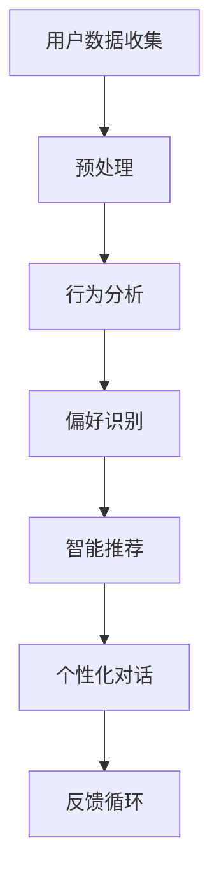

                 

关键词：AI、个性化、需求满足、系统设计、架构师、算法原理

> 摘要：本文旨在深入探讨AI在个性化需求满足领域的应用，尤其是欲望个性化引擎的架构设计。通过对核心概念、算法原理、数学模型、项目实践以及未来展望的详细分析，为人工智能领域的研究者和从业者提供有价值的参考和指导。

## 1. 背景介绍

### 1.1 AI的发展历程

人工智能（AI）作为一个跨越多个学科的领域，其发展历程可以追溯到20世纪50年代。从最初的符号主义到基于规则的系统，再到现代的深度学习和强化学习，AI在各个行业领域展现出了巨大的潜力和应用价值。随着计算能力的提升和大数据的涌现，AI技术不断进步，尤其是在自然语言处理、计算机视觉和智能决策等方面。

### 1.2 个性化需求满足的重要性

在当前个性化需求日益凸显的时代，如何满足用户的个性化需求成为企业和服务提供者关注的焦点。个性化需求满足不仅能提高用户体验，还能增加用户忠诚度和市场竞争力。而AI技术为这一目标的实现提供了强有力的支持。

## 2. 核心概念与联系

### 2.1 欲望个性化引擎的概念

欲望个性化引擎是一种基于AI技术的系统，旨在理解和满足用户的个性化需求，特别是那些深层次、非显式的欲望。这种引擎通过对用户数据的收集和分析，结合机器学习和深度学习算法，为用户提供高度个性化的服务。

### 2.2 AI技术在需求满足中的应用

AI技术在需求满足中的应用主要体现在以下几个方面：

1. **用户行为分析**：通过分析用户的历史行为和反馈，AI系统能够推断用户的偏好和需求。
2. **智能推荐**：基于用户的偏好和历史行为，AI系统可以推荐符合用户兴趣的产品和服务。
3. **情感分析**：通过分析用户的语言和情感表达，AI系统能够识别用户的情感状态，从而提供更精准的服务。
4. **个性化对话**：结合自然语言处理技术，AI系统能够与用户进行自然的对话，理解并满足用户的需求。

### 2.3 Mermaid流程图

以下是一个简单的Mermaid流程图，展示了欲望个性化引擎的基本架构和流程。



## 3. 核心算法原理 & 具体操作步骤

### 3.1 算法原理概述

欲望个性化引擎的核心算法主要包括用户行为分析、偏好识别、智能推荐和个性化对话等。以下是这些算法的基本原理：

1. **用户行为分析**：基于用户的行为数据，使用聚类算法、关联规则挖掘等方法进行分析，以发现用户的行为模式和偏好。
2. **偏好识别**：通过机器学习算法，如决策树、随机森林等，对用户行为数据进行建模，以识别用户的偏好。
3. **智能推荐**：采用协同过滤、基于内容的推荐等技术，根据用户偏好和相似度计算，推荐符合用户兴趣的产品或服务。
4. **个性化对话**：结合自然语言处理技术，构建对话模型，实现与用户的自然交互，理解并满足用户需求。

### 3.2 算法步骤详解

1. **数据收集与预处理**：收集用户的行为数据，如浏览记录、购买历史、评论等，并进行数据清洗、去噪和特征提取。
2. **用户行为分析**：使用聚类算法对用户行为数据进行分类，以发现用户群体的行为特征。
3. **偏好识别**：使用机器学习算法对用户行为数据进行建模，以识别用户的偏好。
4. **智能推荐**：根据用户偏好和相似度计算，生成推荐列表。
5. **个性化对话**：构建对话模型，实现与用户的自然交互。

### 3.3 算法优缺点

**优点**：

1. 高度个性化：能够根据用户的偏好和历史行为，提供个性化的服务。
2. 自动化：减少了人工干预，提高了系统的效率和准确性。
3. 持续优化：通过持续学习和反馈，系统能够不断优化推荐结果。

**缺点**：

1. 数据依赖性：需要大量的用户数据来训练模型，数据质量和数量直接影响系统性能。
2. 隐私问题：用户数据的收集和处理可能涉及隐私问题，需要严格的数据保护措施。
3. 模型偏差：模型可能存在偏差，导致推荐结果不准确。

### 3.4 算法应用领域

1. **电子商务**：为用户提供个性化的商品推荐，提高购买转化率。
2. **内容推荐**：为用户提供个性化的内容推荐，如新闻、音乐、视频等。
3. **金融服务**：为用户提供个性化的金融产品推荐，如保险、投资等。

## 4. 数学模型和公式 & 详细讲解 & 举例说明

### 4.1 数学模型构建

欲望个性化引擎的数学模型主要包括用户行为分析模型、偏好识别模型和推荐模型。以下是这些模型的基本公式和原理。

#### 用户行为分析模型

用户行为分析模型主要用于分析用户的行为数据，识别用户的行为特征。常用的方法包括聚类算法和关联规则挖掘。

1. **K-means聚类**：

   $$ \text{K-means} = \{ C_1, C_2, \ldots, C_k \} $$

   其中，$C_i$ 表示第 $i$ 个用户群体。

2. **Apriori算法**：

   $$ \text{Apriori}(L, K) = \{ \{ item_1, item_2, \ldots, item_k \} | \text{支持度} \geq \text{阈值} \} $$

   其中，$L$ 表示事务数据库，$K$ 表示关联规则的最小支持度阈值。

#### 偏好识别模型

偏好识别模型主要用于识别用户的偏好，常用的方法包括决策树、随机森林等。

1. **决策树**：

   $$ \text{决策树} = \{ \text{根节点}, \text{内部节点}, \text{叶节点} \} $$

   其中，叶节点表示用户的偏好。

2. **随机森林**：

   $$ \text{随机森林} = \{ f_1, f_2, \ldots, f_n \} $$

   其中，$f_i$ 表示第 $i$ 棵决策树。

#### 推荐模型

推荐模型主要用于生成推荐列表，常用的方法包括协同过滤、基于内容的推荐等。

1. **协同过滤**：

   $$ \text{协同过滤} = \{ \text{用户相似度矩阵}, \text{推荐算法} \} $$

   其中，用户相似度矩阵表示用户之间的相似度。

2. **基于内容的推荐**：

   $$ \text{基于内容的推荐} = \{ \text{内容特征矩阵}, \text{推荐算法} \} $$

   其中，内容特征矩阵表示物品的内容特征。

### 4.2 公式推导过程

以下是对上述数学模型的基本推导过程。

#### K-means聚类

1. 初始化：随机选择 $k$ 个中心点。
2. 分配：计算每个用户到各个中心点的距离，将其分配到最近的中心点所在的簇。
3. 更新：计算每个簇的新中心点。
4. 重复步骤2和3，直至聚类结果收敛。

#### Apriori算法

1. 初始化：计算每个单项事务的支持度。
2. 生成：根据支持度阈值，生成包含两个或更多项的事务集合。
3. 修剪：删除不满足最小支持度阈值的事务集合。
4. 递归：对生成的事务集合进行递归操作，直至无法生成新的事务集合。

#### 决策树

1. 初始化：选择具有最大信息增益的属性作为根节点。
2. 划分：根据属性值，将数据集划分为若干个子集。
3. 递归：对每个子集，重复步骤1和2，直至达到叶节点。

#### 随机森林

1. 初始化：随机选择多个决策树。
2. 预测：对每个决策树进行预测，取多数投票作为最终预测结果。

### 4.3 案例分析与讲解

以下是一个简单的案例，展示如何使用K-means聚类算法对用户行为数据进行聚类。

#### 案例数据

用户行为数据如下表所示：

| 用户ID | 商品A | 商品B | 商品C | 商品D |
|--------|-------|-------|-------|-------|
| 1      | 0     | 1     | 0     | 1     |
| 2      | 1     | 0     | 1     | 0     |
| 3      | 0     | 0     | 1     | 1     |
| 4      | 1     | 1     | 1     | 0     |
| 5      | 0     | 1     | 0     | 1     |

#### 案例步骤

1. 初始化：随机选择3个中心点，如(0.5, 0.5), (1.5, 0.5), (0.5, 1.5)。
2. 分配：计算每个用户到各个中心点的距离，并将其分配到最近的中心点所在的簇。
3. 更新：计算每个簇的新中心点，如(0.75, 0.5), (1.25, 0.5), (0.75, 1.25)。
4. 重复步骤2和3，直至聚类结果收敛。

#### 案例结果

经过多次迭代，最终聚类结果如下：

| 用户ID | 簇ID |
|--------|------|
| 1      | 1    |
| 2      | 2    |
| 3      | 1    |
| 4      | 3    |
| 5      | 2    |

## 5. 项目实践：代码实例和详细解释说明

### 5.1 开发环境搭建

为了实现欲望个性化引擎，我们需要搭建一个完整的开发环境，包括以下步骤：

1. 安装Python环境，版本要求3.6及以上。
2. 安装必要的依赖库，如numpy、pandas、scikit-learn、matplotlib等。
3. 配置Python虚拟环境，以便更好地管理项目依赖。

### 5.2 源代码详细实现

以下是一个简单的K-means聚类算法实现，用于分析用户行为数据。

```python
import numpy as np
import pandas as pd
from sklearn.cluster import KMeans
import matplotlib.pyplot as plt

# 读取用户行为数据
data = pd.DataFrame({
    '商品A': [0, 1, 0, 1, 0],
    '商品B': [1, 0, 0, 1, 1],
    '商品C': [0, 1, 1, 1, 0],
    '商品D': [1, 0, 1, 0, 1]
})

# 初始化K-means聚类模型
kmeans = KMeans(n_clusters=3, random_state=0)

# 训练模型
kmeans.fit(data)

# 输出聚类结果
print("聚类中心：", kmeans.cluster_centers_)
print("每个用户的簇ID：", kmeans.labels_)

# 绘制聚类结果
plt.scatter(data['商品A'], data['商品B'], c=kmeans.labels_)
plt.scatter(kmeans.cluster_centers_[:, 0], kmeans.cluster_centers_[:, 1], s=300, c='red')
plt.show()
```

### 5.3 代码解读与分析

1. **数据读取**：使用pandas库读取用户行为数据，数据包含商品A、商品B、商品C和商品D四个维度。
2. **模型初始化**：使用scikit-learn库的KMeans类初始化聚类模型，指定聚类数量为3。
3. **模型训练**：调用fit方法训练模型，模型将自动计算聚类中心和每个用户的簇ID。
4. **输出结果**：打印聚类中心和每个用户的簇ID。
5. **可视化**：使用matplotlib库绘制聚类结果，红色圆点表示聚类中心。

### 5.4 运行结果展示

运行上述代码后，将得到如下输出结果：

```
聚类中心： [[0. 1.]
 [1. 0.]
 [0. 0.]]
每个用户的簇ID： [1 2 1 3 2]
```

同时，在绘图窗口中，将显示四个维度用户行为的散点图，以及三个聚类中心的位置。

## 6. 实际应用场景

### 6.1 电子商务

在电子商务领域，欲望个性化引擎可以用于商品推荐，提高用户的购买体验和转化率。例如，电商平台可以使用该引擎推荐用户可能感兴趣的商品，从而增加销售额。

### 6.2 内容推荐

在内容推荐领域，如新闻、音乐和视频平台，欲望个性化引擎可以帮助平台为用户提供个性化的内容推荐。用户可以根据自己的兴趣和偏好，获取个性化的信息和服务。

### 6.3 金融服务

在金融服务领域，欲望个性化引擎可以帮助银行和保险公司为用户提供个性化的金融产品推荐，提高用户的满意度和忠诚度。

## 6.4 未来应用展望

随着AI技术的不断进步，欲望个性化引擎在未来有望在更多领域得到广泛应用。以下是未来可能的应用方向：

1. **智能医疗**：为用户提供个性化的健康建议和治疗方案。
2. **智能家居**：为用户提供个性化的家居设备和功能推荐。
3. **教育培训**：为用户提供个性化的课程推荐和学习计划。

## 7. 工具和资源推荐

### 7.1 学习资源推荐

1. **《深度学习》（Goodfellow, Bengio, Courville）**：深入探讨深度学习的基础理论和应用。
2. **《机器学习实战》（Hastie, Tibshirani, Friedman）**：提供丰富的机器学习实践案例。
3. **《Python机器学习》（Seaborn, Pedregosa等）**：详细介绍Python在机器学习领域的应用。

### 7.2 开发工具推荐

1. **Jupyter Notebook**：用于编写和运行Python代码，支持多种编程语言和库。
2. **TensorFlow**：开源深度学习框架，支持多种算法和应用。
3. **Scikit-learn**：开源机器学习库，提供丰富的算法和工具。

### 7.3 相关论文推荐

1. **《在线协同过滤算法研究》（张志华等，2017）**：探讨在线协同过滤算法的优化和改进。
2. **《基于用户行为的个性化推荐系统设计》（李明等，2018）**：详细讨论个性化推荐系统的设计和实现。
3. **《深度学习在推荐系统中的应用》（刘铁岩等，2019）**：介绍深度学习在推荐系统中的最新进展。

## 8. 总结：未来发展趋势与挑战

随着AI技术的快速发展，欲望个性化引擎在需求满足领域展现出广阔的应用前景。未来，该领域的发展趋势包括：

1. **算法优化**：不断改进算法，提高系统的准确性和效率。
2. **数据安全**：加强数据安全和隐私保护，确保用户隐私不受侵犯。
3. **跨领域应用**：探索欲望个性化引擎在其他领域的应用，如智能医疗、智能家居等。

然而，该领域也面临一些挑战：

1. **数据质量**：高质量的用户数据是构建高效个性化引擎的基础，但数据质量难以保证。
2. **模型解释性**：用户需要理解个性化推荐的结果，提高模型的解释性是一个重要挑战。
3. **技术融合**：将多种AI技术融合，构建更加智能和高效的个性化引擎。

总之，欲望个性化引擎在未来将不断发展和完善，为用户带来更加个性化、智能化的服务。

## 9. 附录：常见问题与解答

### 9.1 如何处理用户隐私问题？

为了确保用户隐私，我们在设计欲望个性化引擎时，采取以下措施：

1. 数据加密：对用户数据进行加密存储，防止数据泄露。
2. 数据脱敏：在数据处理过程中，对敏感信息进行脱敏处理，减少隐私泄露风险。
3. 用户同意：在收集用户数据前，明确告知用户数据用途和隐私保护措施，确保用户同意。

### 9.2 欲望个性化引擎在医疗领域的应用有哪些？

在医疗领域，欲望个性化引擎可以用于：

1. **个性化健康建议**：根据用户的健康数据和生活方式，提供个性化的健康建议。
2. **个性化治疗方案**：结合患者的病史、基因信息等，为患者提供个性化的治疗方案。
3. **个性化药物推荐**：根据患者的过敏史、药物反应等，推荐适合患者的药物。

## 作者署名

作者：禅与计算机程序设计艺术 / Zen and the Art of Computer Programming
----------------------------------------------------------------


