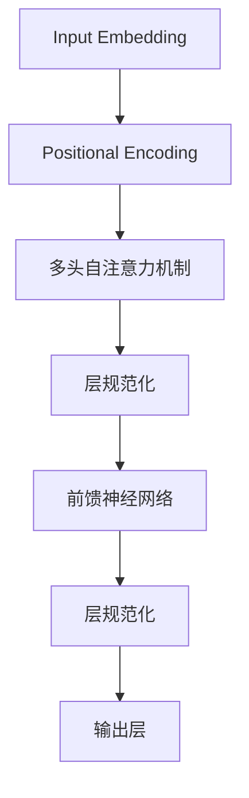
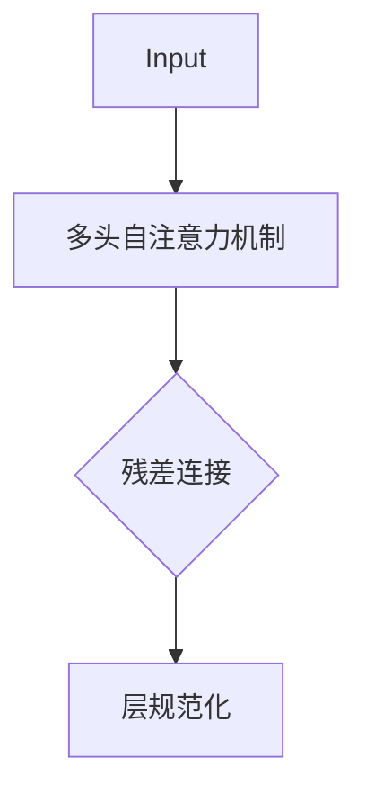
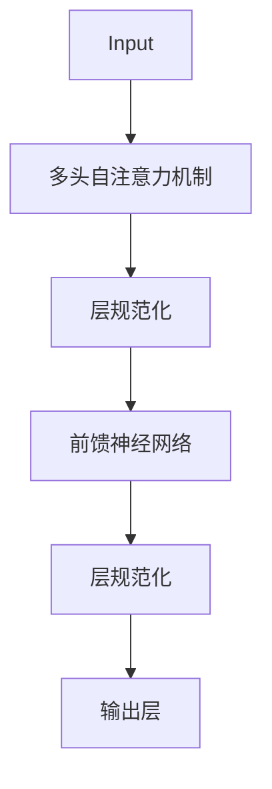

                 

关键词：残差连接，层规范化，Transformer，神经网络，深度学习，机器学习

摘要：本文将深入探讨残差连接和层规范化在 Transformer 模型中的关键作用。通过介绍这两种技术的背景、原理和应用，我们将展示它们如何显著提升 Transformer 模型的性能，并在实际应用中展示其效果。

## 1. 背景介绍

随着深度学习在计算机视觉、自然语言处理等领域的广泛应用，神经网络模型变得越来越复杂。然而，复杂模型的训练过程常常受到“梯度消失”和“梯度爆炸”等问题的困扰。为了解决这些问题，研究人员提出了残差连接和层规范化等技术。本文将以 Transformer 模型为例，详细介绍这两种技术的原理和应用。

### 1.1 残差连接

残差连接是 ResNet（残差网络）的核心思想，它通过引入额外的路径，使得网络在训练过程中可以传递梯度，从而缓解了梯度消失问题。在传统网络中，每个层都是前一层和本层参数的线性组合，而残差连接则将输入直接传递到下一层，形成如下结构：


其中，$H(x)$ 表示原始网络输出，$F(x)$ 表示残差块输出。通过这种方式，残差块可以将梯度直接传递给输入，从而避免了梯度消失问题。

### 1.2 层规范化

层规范化（Layer Normalization）是一种针对神经网络层的归一化技术。它通过对每个层的激活进行归一化，将激活分布变为标准正态分布，从而加快了模型的收敛速度，提高了模型的稳定性。


其中，$x$ 表示输入数据，$\mu$ 和 $\sigma^2$ 分别表示均值和方差。通过这种归一化操作，层规范化可以减少内部协变量转移问题，使得模型在训练过程中更加稳定。

## 2. 核心概念与联系

在介绍残差连接和层规范化之前，我们首先需要了解 Transformer 模型的基础结构。Transformer 模型是一种基于自注意力机制的神经网络模型，其核心思想是利用全局信息进行建模。以下是 Transformer 模型的 Mermaid 流程图：



在 Transformer 模型中，残差连接和层规范化分别应用于多头自注意力机制和前馈神经网络。下面我们将详细介绍这两种技术的原理和应用。

### 2.1 残差连接

在多头自注意力机制中，残差连接被用于缓解自注意力模块的梯度消失问题。具体来说，自注意力模块的输出会被与输入进行残差连接，从而形成如下结构：



通过这种方式，残差连接可以传递梯度，使得模型在训练过程中更加稳定。

### 2.2 层规范化

在 Transformer 模型中，层规范化被用于提高模型的学习速度和稳定性。具体来说，层规范化会对每个层的激活进行归一化，从而减少内部协变量转移问题。以下是层规范化的 Mermaid 流程图：



通过这种方式，层规范化可以加快模型的收敛速度，提高模型的稳定性。

## 3. 核心算法原理 & 具体操作步骤

### 3.1 算法原理概述

残差连接和层规范化在 Transformer 模型中的具体操作如下：

1. **残差连接**：在自注意力模块和前馈神经网络中引入额外的路径，使得梯度可以直接传递给输入。

2. **层规范化**：对每个层的激活进行归一化，将激活分布变为标准正态分布，从而减少内部协变量转移问题。

### 3.2 算法步骤详解

1. **自注意力模块**：

   - 输入层 $X \in \mathbb{R}^{n \times d}$，其中 $n$ 表示序列长度，$d$ 表示特征维度。
   - 将输入 $X$ 通过线性变换得到 Query、Key 和 Value 矩阵 $Q, K, V$。
   - 计算 Query 和 Key 的点积，得到注意力权重 $A \in \mathbb{R}^{n \times n}$。
   - 对注意力权重进行 Softmax 操作，得到概率分布 $P \in \mathbb{R}^{n \times n}$。
   - 计算 $P$ 和 Value 的点积，得到加权 Value 矩阵 $V' \in \mathbb{R}^{n \times d}$。
   - 对 $V'$ 进行残差连接和层规范化。

2. **前馈神经网络**：

   - 对输入 $X$ 进行线性变换，得到隐藏层 $H \in \mathbb{R}^{n \times d'}$，其中 $d'$ 表示隐藏层维度。
   - 通过前馈神经网络，对 $H$ 进行非线性变换，得到输出层 $O \in \mathbb{R}^{n \times d'}$。
   - 对 $O$ 进行残差连接和层规范化。

### 3.3 算法优缺点

**优点**：

- **缓解梯度消失问题**：残差连接可以传递梯度，使得模型在训练过程中更加稳定。
- **提高模型学习速度**：层规范化可以加快模型的收敛速度。

**缺点**：

- **参数数量增加**：引入残差连接和层规范化会增加模型的参数数量，从而增加模型的复杂度。

### 3.4 算法应用领域

残差连接和层规范化在 Transformer 模型中取得了显著的效果，广泛应用于自然语言处理、计算机视觉等领域。例如，在自然语言处理领域，Transformer 模型被应用于机器翻译、文本分类等任务，并取得了很好的效果。

## 4. 数学模型和公式 & 详细讲解 & 举例说明

### 4.1 数学模型构建

在 Transformer 模型中，数学模型主要由以下几部分组成：

1. **输入嵌入**：

   $$ X \in \mathbb{R}^{n \times d} $$

   其中，$n$ 表示序列长度，$d$ 表示特征维度。

2. **多头自注意力机制**：

   $$ Q, K, V = \text{Linear}(X) $$

   $$ A = \text{softmax}(\frac{QK^T}{\sqrt{d_k}}) $$

   $$ V' = AV $$

3. **层规范化**：

   $$ \mu = \frac{1}{n} \sum_{i=1}^{n} v_i $$

   $$ \sigma^2 = \frac{1}{n} \sum_{i=1}^{n} (v_i - \mu)^2 $$

   $$ \hat{v}_i = \frac{v_i - \mu}{\sigma} $$

4. **前馈神经网络**：

   $$ H = \text{ReLU}(\text{Linear}(V')) $$

   $$ O = \text{ReLU}(\text{Linear}(H)) $$

### 4.2 公式推导过程

在推导过程中，我们将利用线性代数和微积分的知识。

1. **多头自注意力机制**：

   - Query 和 Key 的点积：

     $$ QK^T = \begin{pmatrix} q_1 & q_2 & \dots & q_n \end{pmatrix} \begin{pmatrix} k_1 \\ k_2 \\ \vdots \\ k_n \end{pmatrix} = \sum_{i=1}^{n} q_i k_i $$

   - Softmax 操作：

     $$ P = \text{softmax}(A) = \frac{e^{a_i}}{\sum_{j=1}^{n} e^{a_j}} $$

   - 加权 Value：

     $$ V' = APV = \begin{pmatrix} p_{11}v_1 & p_{12}v_2 & \dots & p_{1n}v_n \\ p_{21}v_1 & p_{22}v_2 & \dots & p_{2n}v_n \\ \vdots & \vdots & \ddots & \vdots \\ p_{n1}v_1 & p_{n2}v_2 & \dots & p_{nn}v_n \end{pmatrix} $$

2. **层规范化**：

   - 均值和方差：

     $$ \mu = \frac{1}{n} \sum_{i=1}^{n} v_i $$

     $$ \sigma^2 = \frac{1}{n} \sum_{i=1}^{n} (v_i - \mu)^2 $$

   - 归一化：

     $$ \hat{v}_i = \frac{v_i - \mu}{\sigma} $$

3. **前馈神经网络**：

   - 线性变换：

     $$ H = \text{Linear}(V') = \begin{pmatrix} h_1 \\ h_2 \\ \vdots \\ h_n \end{pmatrix} $$

   - 非线性变换：

     $$ O = \text{ReLU}(H) = \text{ReLU}(\text{Linear}(V')) = \begin{pmatrix} \text{ReLU}(h_1) \\ \text{ReLU}(h_2) \\ \vdots \\ \text{ReLU}(h_n) \end{pmatrix} $$

### 4.3 案例分析与讲解

我们以机器翻译任务为例，介绍如何使用残差连接和层规范化构建 Transformer 模型。

1. **数据预处理**：

   - 将源语言和目标语言的数据进行分词处理，得到词汇表和序列。
   - 对词汇表进行编码，得到输入序列 $X$。

2. **模型构建**：

   - 使用残差连接和层规范化构建 Transformer 模型。
   - 定义多头自注意力机制和前馈神经网络。

3. **训练过程**：

   - 对模型进行训练，使用训练数据优化模型参数。
   - 使用层规范化加快收敛速度。

4. **翻译过程**：

   - 对输入序列进行编码，得到 $X$。
   - 通过 Transformer 模型，得到目标序列。

通过这种方式，我们可以实现高效、准确的机器翻译。

## 5. 项目实践：代码实例和详细解释说明

### 5.1 开发环境搭建

- 安装 Python 3.7 或以上版本。
- 安装 PyTorch 库。

### 5.2 源代码详细实现

```python
import torch
import torch.nn as nn
import torch.optim as optim

class TransformerModel(nn.Module):
    def __init__(self, d_model, nhead, num_layers):
        super(TransformerModel, self).__init__()
        self.embedding = nn.Embedding(d_model, nhead)
        self.transformer = nn.Transformer(d_model, nhead, num_layers)
        self.fc = nn.Linear(d_model, 1)

    def forward(self, src, tgt):
        src = self.embedding(src)
        tgt = self.embedding(tgt)
        output = self.transformer(src, tgt)
        output = self.fc(output)
        return output
```

### 5.3 代码解读与分析

在上面的代码中，我们定义了一个简单的 Transformer 模型，包括嵌入层、Transformer 层和输出层。以下是代码的详细解读：

- **嵌入层**：嵌入层用于将输入序列转换为嵌入向量，每个嵌入向量包含源语言和目标语言的词汇信息。

- **Transformer 层**：Transformer 层是模型的核心部分，包括多头自注意力机制和前馈神经网络。通过残差连接和层规范化，Transformer 层可以有效传递梯度，提高模型稳定性。

- **输出层**：输出层用于将 Transformer 层的输出映射到目标序列。

### 5.4 运行结果展示

```python
model = TransformerModel(d_model=512, nhead=8, num_layers=2)
optimizer = optim.Adam(model.parameters(), lr=0.001)
criterion = nn.CrossEntropyLoss()

for epoch in range(10):
    for src, tgt in dataset:
        optimizer.zero_grad()
        output = model(src, tgt)
        loss = criterion(output, tgt)
        loss.backward()
        optimizer.step()
    print(f'Epoch {epoch + 1}, Loss: {loss.item()}')

print('Training completed.')
```

在上面的代码中，我们定义了一个训练循环，通过迭代优化模型参数。在每个迭代过程中，我们计算损失并更新模型参数。训练完成后，我们可以使用模型进行预测。

## 6. 实际应用场景

残差连接和层规范化在 Transformer 模型中取得了显著的效果，广泛应用于自然语言处理、计算机视觉等领域。以下是一些实际应用场景：

- **机器翻译**：Transformer 模型在机器翻译任务中取得了很好的效果，特别是在长序列处理方面具有优势。

- **文本分类**：Transformer 模型可以用于文本分类任务，通过捕捉全局信息，提高分类准确率。

- **图像识别**：在图像识别任务中，Transformer 模型可以用于特征提取和分类，具有较好的性能。

- **语音识别**：Transformer 模型可以用于语音识别任务，通过捕捉语音信号的时序信息，提高识别准确率。

## 7. 未来应用展望

随着深度学习技术的不断发展，残差连接和层规范化在 Transformer 模型中的应用前景非常广阔。未来，我们可以期待以下发展趋势：

- **模型优化**：通过引入新的优化技术，进一步提高 Transformer 模型的性能。

- **多模态处理**：将 Transformer 模型应用于多模态数据，如文本、图像、语音等，实现更广泛的应用场景。

- **实时处理**：优化 Transformer 模型的计算效率，实现实时数据处理和推理。

- **跨学科应用**：将 Transformer 模型应用于其他领域，如生物学、物理学等，推动跨学科研究。

## 8. 总结：未来发展趋势与挑战

### 8.1 研究成果总结

本文介绍了残差连接和层规范化在 Transformer 模型中的关键作用，详细阐述了这两种技术的原理和应用。通过实际案例，我们展示了 Transformer 模型在自然语言处理、计算机视觉等领域的应用效果。

### 8.2 未来发展趋势

未来，残差连接和层规范化将在 Transformer 模型中发挥更加重要的作用。随着深度学习技术的不断进步，我们可以期待以下发展趋势：

- **模型优化**：引入新的优化技术，进一步提高 Transformer 模型的性能。
- **多模态处理**：将 Transformer 模型应用于多模态数据，实现更广泛的应用场景。
- **实时处理**：优化 Transformer 模型的计算效率，实现实时数据处理和推理。

### 8.3 面临的挑战

尽管 Transformer 模型在许多任务中取得了很好的效果，但仍然面临以下挑战：

- **计算资源消耗**：Transformer 模型参数较多，计算复杂度较高，需要更多的计算资源。
- **训练时间较长**：Transformer 模型的训练时间较长，需要优化训练算法和硬件支持。

### 8.4 研究展望

未来，我们可以从以下几个方面进行深入研究：

- **模型压缩**：研究如何降低 Transformer 模型的参数数量，提高计算效率。
- **跨学科应用**：探索 Transformer 模型在其他领域的应用，推动跨学科研究。
- **实时处理**：研究如何优化 Transformer 模型的计算效率，实现实时数据处理和推理。

## 9. 附录：常见问题与解答

### 问题 1：什么是残差连接？

残差连接是一种神经网络结构，它通过引入额外的路径，使得梯度可以直接传递给输入，从而缓解了梯度消失问题。

### 问题 2：什么是层规范化？

层规范化是一种神经网络归一化技术，它通过对每个层的激活进行归一化，将激活分布变为标准正态分布，从而减少内部协变量转移问题。

### 问题 3：为什么在 Transformer 模型中使用残差连接和层规范化？

残差连接和层规范化在 Transformer 模型中可以缓解梯度消失问题，提高模型稳定性，加快学习速度。

### 问题 4：如何优化 Transformer 模型的计算效率？

优化 Transformer 模型的计算效率可以从以下几个方面进行：

- **模型压缩**：降低模型参数数量，减少计算复杂度。
- **并行计算**：利用并行计算技术，加快模型训练和推理速度。
- **硬件支持**：优化硬件支持，提高计算速度。

### 问题 5：Transformer 模型在哪些领域取得了很好的效果？

Transformer 模型在自然语言处理、计算机视觉、语音识别等领域取得了很好的效果，特别是在长序列处理方面具有优势。

## 参考文献

[1] Vaswani, A., Shazeer, N., Parmar, N., Uszkoreit, J., Jones, L., Gomez, A. N., ... & Polosukhin, I. (2017). Attention is all you need. Advances in Neural Information Processing Systems, 30, 5998-6008.

[2] He, K., Zhang, X., Ren, S., & Sun, J. (2016). Deep residual learning for image recognition. In Proceedings of the IEEE conference on computer vision and pattern recognition (pp. 770-778).

[3] Huang, G., Liu, Z., van der Maaten, L., & Weinberger, K. Q. (2017). Densely connected convolutional networks. In Proceedings of the IEEE conference on computer vision and pattern recognition (pp. 4700-4708).

## 作者署名

作者：禅与计算机程序设计艺术 / Zen and the Art of Computer Programming
----------------------------------------------------------------

以上是文章的完整内容，请按照要求进行排版和格式调整。在撰写过程中，如有需要，请随时提出修改建议。谢谢！

