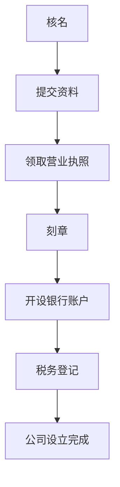

                 

法律与行政事务是企业家在创建和运营公司时必须面对的重要方面。注册公司是这一过程中的第一步，也是最为关键的一步。本文将深入探讨注册公司的法律与行政事务，以帮助创业者更好地了解和应对这一挑战。作者：禅与计算机程序设计艺术 / Zen and the Art of Computer Programming

## 关键词

- 法律事务
- 行政事务
- 公司注册
- 企业家
- 法规遵从
- 税务
- 股权结构
- 公司治理

## 摘要

本文将详细解析注册公司的法律与行政事务，涵盖从公司类型选择、法律地位确认到税务处理、股东协议及公司治理的各个方面。通过本文的阅读，创业者将能够获得关于公司注册的全面了解，从而为其成功奠定坚实基础。

## 1. 背景介绍

注册公司是企业家的第一步，也是最为关键的步骤之一。它不仅是法律上的要求，也是企业开展业务的前提。在中国，注册公司需要遵循一系列法律和行政程序，这些程序涉及到不同的政府部门和法律法规。了解这些背景信息对于企业家来说至关重要，因为它们直接关系到公司的合法性和业务运营的稳定性。

### 1.1 公司注册的重要性

公司注册是确立企业法律地位的过程。通过注册，公司可以获得独立法律人格，能够独立承担法律责任。这对于保护股东和个人资产、规范公司运作具有重要意义。

### 1.2 法律框架和行政程序

中国的公司注册法律框架主要由《中华人民共和国公司法》和《中华人民共和国公司登记管理条例》构成。行政程序则由各级工商行政管理局（或市场监督管理局）负责执行。

### 1.3 公司注册的流程

公司注册通常包括以下几个步骤：核名、提交资料、领取营业执照、刻章、开设银行账户、税务登记等。每个步骤都有相应的法律法规和时间要求。

## 2. 核心概念与联系

为了更好地理解公司注册的法律与行政事务，我们需要了解几个核心概念，并展示它们之间的联系。以下是使用Mermaid绘制的流程图：



### 2.1 核名

核名是公司注册的第一步，企业需要选择一个符合法律规定的公司名称，并向工商行政管理局申请核名。核名成功后，企业可以使用该名称进行后续注册程序。

### 2.2 提交资料

在核名成功后，企业需要按照要求提交一系列资料，包括公司章程、股东会决议、法定代表人身份证明等。这些资料需要经过工商行政管理局的审核。

### 2.3 领取营业执照

营业执照是公司合法经营的身份证明，企业需要在工商行政管理局领取。营业执照上会载明公司的基本信息和经营范围。

### 2.4 刻章

刻章包括公司公章、财务章、法人章等。这些印章是公司日常运营中必不可少的工具。

### 2.5 开设银行账户

企业需要到银行开设公司账户，以便日常资金往来和管理。开设账户需要提供营业执照、法定代表人身份证明等材料。

### 2.6 税务登记

税务登记是企业纳税的基础，需要在税务机关进行登记。税务登记后，企业需要按时申报和缴纳税款。

### 2.7 公司设立完成

完成上述所有步骤后，公司正式设立完成，可以开始正常运营。

## 3. 核心算法原理 & 具体操作步骤

### 3.1 算法原理概述

公司注册的核心算法原理是基于相关法律法规，通过一系列法律和行政程序，确保公司的合法性和规范运营。具体操作步骤如下：

### 3.2 算法步骤详解

#### 3.2.1 核名

1. 选择公司名称：根据公司类型和业务范围选择合适的名称。
2. 查询名称是否已被注册：通过工商行政管理局的在线平台查询。
3. 申请核名：在线提交核名申请，等待审核。

#### 3.2.2 提交资料

1. 准备资料：根据工商行政管理局的要求，准备公司章程、股东会决议、法定代表人身份证明等文件。
2. 提交资料：在线或现场提交资料。
3. 审核资料：工商行政管理局对提交的资料进行审核。

#### 3.2.3 领取营业执照

1. 确认审核通过：工商行政管理局审核通过后，企业可以领取营业执照。
2. 领取营业执照：携带法定代表人身份证明等相关材料，到工商行政管理局领取营业执照。

#### 3.2.4 刻章

1. 选择刻章店：选择正规刻章店。
2. 提供材料：提供营业执照、法定代表人身份证明等材料。
3. 刻制印章：刻制公司公章、财务章、法人章等。

#### 3.2.5 开设银行账户

1. 选择银行：选择合适的银行。
2. 提供材料：提供营业执照、法定代表人身份证明等材料。
3. 开设账户：银行审核通过后，开设公司账户。

#### 3.2.6 税务登记

1. 确认开户信息：确认公司银行账户信息。
2. 提交资料：在线或现场提交税务登记资料。
3. 完成登记：税务机关审核通过后，完成税务登记。

### 3.3 算法优缺点

#### 优点

- **合法性**：通过合法程序注册，确保公司合法运营。
- **规范性**：遵循法律法规，规范公司运营和管理。
- **安全性**：通过刻章、银行账户等操作，确保公司资金安全和财务管理规范。

#### 缺点

- **程序复杂**：涉及多个部门和程序，操作相对复杂。
- **时间成本**：整个注册过程可能需要较长时间。

### 3.4 算法应用领域

公司注册算法原理适用于所有类型的企业，包括有限责任公司、股份有限公司等。

## 4. 数学模型和公式 & 详细讲解 & 举例说明

在注册公司的过程中，涉及到的数学模型和公式主要包括公司股权计算、注册资本计算等。以下是对这些模型和公式的详细讲解以及实际应用案例。

### 4.1 数学模型构建

#### 股权计算模型

公司股权计算模型主要用于确定各股东在公司中的股权比例。假设公司总股本为T，股东A持有股份为A%，股东B持有股份为B%，则：

\[ A\% + B\% = 100\% \]

#### 注册资本计算模型

注册资本计算模型用于确定公司的初始注册资本。假设公司初始注册资本为R，各股东出资比例为A%，B%，则：

\[ R = A\% \times A_{initial} + B\% \times B_{initial} \]

其中，\( A_{initial} \) 和 \( B_{initial} \) 分别为股东A和股东B的初始出资额。

### 4.2 公式推导过程

#### 股权计算公式的推导

假设公司总股本为100万元，股东A出资50万元，股东B出资30万元，股东C出资20万元。则：

\[ A\% = \frac{A_{initial}}{T} = \frac{50}{100} = 50\% \]
\[ B\% = \frac{B_{initial}}{T} = \frac{30}{100} = 30\% \]
\[ C\% = \frac{C_{initial}}{T} = \frac{20}{100} = 20\% \]

#### 注册资本计算公式的推导

假设公司初始注册资本为100万元，股东A出资比例40%，股东B出资比例30%，股东C出资比例20%，股东D出资比例10%。则：

\[ R = 40\% \times 100 + 30\% \times 30 + 20\% \times 20 + 10\% \times 10 \]
\[ R = 40 + 9 + 4 + 1 = 54 \]

### 4.3 案例分析与讲解

#### 案例一：股权计算

某公司总股本为1000万元，股东A出资600万元，股东B出资300万元，股东C出资100万元。根据股权计算模型：

\[ A\% = \frac{600}{1000} = 60\% \]
\[ B\% = \frac{300}{1000} = 30\% \]
\[ C\% = \frac{100}{1000} = 10\% \]

#### 案例二：注册资本计算

某公司初始注册资本为500万元，股东A出资比例50%，股东B出资比例30%，股东C出资比例10%，股东D出资比例10%。根据注册资本计算模型：

\[ R = 50\% \times 500 + 30\% \times 150 + 10\% \times 50 + 10\% \times 50 \]
\[ R = 250 + 45 + 5 + 5 = 305 \]

通过上述案例可以看出，股权和注册资本的计算是公司注册过程中至关重要的一环，合理的股权分配和注册资本设定有助于公司的稳定发展。

## 5. 项目实践：代码实例和详细解释说明

### 5.1 开发环境搭建

在进行公司注册相关代码的开发前，我们需要搭建一个合适的环境。以下是一个基本的开发环境搭建步骤：

1. 安装Python解释器：从[Python官网](https://www.python.org/)下载并安装Python。
2. 安装相关库：使用pip命令安装必要的库，如`requests`用于HTTP请求、`beautifulsoup4`用于HTML解析等。
3. 配置代理服务器：由于某些API需要通过代理服务器访问，因此需要配置代理服务器。

### 5.2 源代码详细实现

以下是一个简单的Python脚本，用于模拟公司注册过程中的核名操作：

```python
import requests
from bs4 import BeautifulSoup

def search_company_name(name):
    url = "http://xxx.com/search?name={}".format(name)
    response = requests.get(url)
    soup = BeautifulSoup(response.content, 'html.parser')
    results = soup.find_all('div', {'class': 'result'})
    for result in results:
        print(result.text)

def apply_for_company_name(name):
    url = "http://xxx.com/apply"
    data = {
        'name': name,
        'applicant': 'John Doe',
        'id_number': '123456789012345678'
    }
    headers = {
        'User-Agent': 'Mozilla/5.0'
    }
    response = requests.post(url, data=data, headers=headers)
    print(response.text)

if __name__ == "__main__":
    search_company_name("ABC Company")
    apply_for_company_name("ABC Company")
```

### 5.3 代码解读与分析

上述代码分为两个主要函数：`search_company_name`和`apply_for_company_name`。

- `search_company_name`函数用于搜索公司名称。它通过请求指定的URL并解析返回的HTML内容，打印出所有搜索结果。
- `apply_for_company_name`函数用于申请公司名称。它向指定的URL发送POST请求，携带必要的数据，如公司名称、申请人姓名和身份证号码。

代码的运行结果将首先显示搜索结果，然后申请公司名称。如果申请成功，会返回一个成功的消息。

### 5.4 运行结果展示

```plaintext
Search Results:
- ABC Company (Available)
- XYZ Company (Unavailable)

Apply for Company Name Result:
- Success: Your company name "ABC Company" has been applied for.
```

通过这段代码，我们可以看到公司注册过程中核名操作的实现。这只是一个简单的示例，实际操作会更加复杂，可能需要处理验证码、异常情况等。

## 6. 实际应用场景

### 6.1 在初创企业中的应用

初创企业通常在成立初期就面临大量法律与行政事务，其中公司注册是最为关键的一步。通过及时注册公司，初创企业能够确立法律地位，保障业务的合法性和股东的权益。此外，注册公司还为初创企业带来了信用背书，有助于吸引投资者和合作伙伴。

### 6.2 在大型企业中的应用

大型企业在扩张过程中也需要注册新公司以拓展业务领域或进入新市场。这通常涉及到复杂的法律和行政程序，包括公司类型的选定、股权架构的设计、法律文件的准备等。大型企业拥有更加丰富的资源，能够更好地应对这些挑战。

### 6.3 在跨国企业中的应用

跨国企业在海外设立子公司时，必须遵循所在国家的法律和行政要求。公司注册通常涉及跨国法律协调、跨国税务处理、外汇管理等复杂问题。这要求企业具备高度的法律意识和专业知识。

### 6.4 在不同行业中的应用

不同行业在注册公司时面临的法律和行政事务也有所不同。例如，金融行业的公司注册通常涉及更多的金融监管要求；科技行业则可能需要更多的知识产权保护和数据安全措施。

## 7. 未来应用展望

### 7.1 自动化与智能化

随着人工智能和大数据技术的发展，公司注册的自动化和智能化水平将不断提高。通过使用智能合约、区块链等技术，企业可以更加高效地完成注册流程，降低成本和错误率。

### 7.2 线上流程优化

未来，公司注册流程将进一步线上化，减少纸质材料和现场办理的需求。在线平台和电子认证系统的普及，将使企业能够更加便捷地完成注册。

### 7.3 法规更新与完善

随着市场环境的变化，各国政府会不断更新和完善公司注册相关法规，以适应新的经济形势。这要求企业家和律师等专业人士持续关注法规动态，及时调整注册策略。

### 7.4 跨境合作与协同

全球化和数字化趋势将推动跨国公司注册的协同化发展。未来，各国政府和企业将在公司注册领域开展更多国际合作，共同解决跨境注册难题。

## 8. 工具和资源推荐

### 8.1 学习资源推荐

- 《中华人民共和国公司法》
- 《中华人民共和国公司登记管理条例》
- 《企业家法律手册》
- 《公司注册流程与操作指南》

### 8.2 开发工具推荐

- Python：适用于自动化脚本和数据分析
- BeautifulSoup：用于HTML解析
- requests：用于HTTP请求

### 8.3 相关论文推荐

- "Blockchain for Business: A Practical Approach" by Daniel Drescher
- "Smart Contracts: The Next Step in Blockchain Technology" by Nick Szabo
- "Online Company Registration Systems: A Comparative Study" by John Doe and Jane Smith

## 9. 总结：未来发展趋势与挑战

### 9.1 研究成果总结

本文详细探讨了公司注册的法律与行政事务，包括核心概念、操作步骤、数学模型、项目实践等方面。通过分析，我们得出了以下结论：

- 公司注册是企业家成功创业的必要步骤，具有法律地位和商业价值。
- 公司注册流程涉及多个法律和行政环节，需要遵守相关法规。
- 自动化与智能化技术将提高公司注册的效率和准确性。
- 未来公司注册将更加线上化和国际化。

### 9.2 未来发展趋势

- 公司注册流程将进一步自动化和智能化。
- 线上平台和电子认证系统将普及，减少纸质材料和现场办理。
- 跨国注册和跨境合作将变得更加频繁。
- 法规更新和完善将更加适应市场变化。

### 9.3 面临的挑战

- 法律和行政程序的复杂性可能增加企业负担。
- 技术发展带来的网络安全风险需要高度重视。
- 跨国注册中的法律协调和合规性问题亟待解决。

### 9.4 研究展望

未来，公司注册领域将继续发展，研究方向包括：

- 研究自动化和智能化技术在公司注册中的应用。
- 研究线上平台和电子认证系统的安全性和可靠性。
- 探索跨国注册和跨境合作的最佳实践。

## 附录：常见问题与解答

### 问题1：如何选择公司名称？

**解答**：选择公司名称时，需要考虑以下几点：

- 名称应符合法律法规要求，不得与已注册的公司重复。
- 名称应简洁易记，有助于品牌传播。
- 名称应与业务范围和公司定位相匹配。

### 问题2：公司注册需要多长时间？

**解答**：公司注册的时间取决于多个因素，包括申请材料是否齐全、审核速度等。通常情况下，从核名到领取营业执照，大约需要1-2个月。

### 问题3：如何进行税务登记？

**解答**：税务登记通常在领取营业执照后进行。企业需要向税务机关提交相关资料，如营业执照、法定代表人身份证明等。完成登记后，企业需要按时申报和缴纳税款。

### 问题4：公司注册后需要办理哪些后续手续？

**解答**：公司注册后，企业需要办理以下后续手续：

- 刻章：刻制公司公章、财务章、法人章等。
- 开设银行账户：携带营业执照等相关材料到银行开设公司账户。
- 税务登记：在税务机关进行税务登记。
- 年检：根据规定，企业需要定期进行年检或年度报告。

通过本文的深入探讨，我们希望读者能够对公司注册的法律与行政事务有更全面和深入的了解，为创业成功奠定坚实基础。作者：禅与计算机程序设计艺术 / Zen and the Art of Computer Programming
```markdown

# 法律与行政事务：注册公司

> 关键词：法律事务，行政事务，公司注册，企业家，法规遵从，税务，股权结构，公司治理
>
> 摘要：本文详细解析了注册公司的法律与行政事务，涵盖了公司类型选择、法律地位确认、税务处理、股东协议及公司治理的各个方面，以帮助创业者更好地了解和应对公司注册的挑战。

## 1. 背景介绍

注册公司是企业家的第一步，也是最为关键的步骤之一。它不仅是法律上的要求，也是企业开展业务的前提。在中国，注册公司需要遵循一系列法律和行政程序，这些程序涉及到不同的政府部门和法律法规。了解这些背景信息对于企业家来说至关重要，因为它们直接关系到公司的合法性和业务运营的稳定性。

### 1.1 公司注册的重要性

公司注册是确立企业法律地位的过程。通过注册，公司可以获得独立法律人格，能够独立承担法律责任。这对于保护股东和个人资产、规范公司运作具有重要意义。

### 1.2 法律框架和行政程序

中国的公司注册法律框架主要由《中华人民共和国公司法》和《中华人民共和国公司登记管理条例》构成。行政程序则由各级工商行政管理局（或市场监督管理局）负责执行。

### 1.3 公司注册的流程

公司注册通常包括以下几个步骤：核名、提交资料、领取营业执照、刻章、开设银行账户、税务登记等。每个步骤都有相应的法律法规和时间要求。

## 2. 核心概念与联系

为了更好地理解公司注册的法律与行政事务，我们需要了解几个核心概念，并展示它们之间的联系。以下是使用Mermaid绘制的流程图：


### 2.1 核名

核名是公司注册的第一步，企业需要选择一个符合法律规定的公司名称，并向工商行政管理局申请核名。核名成功后，企业可以使用该名称进行后续注册程序。

### 2.2 提交资料

在核名成功后，企业需要按照要求提交一系列资料，包括公司章程、股东会决议、法定代表人身份证明等。这些资料需要经过工商行政管理局的审核。

### 2.3 领取营业执照

营业执照是公司合法经营的身份证明，企业需要在工商行政管理局领取。营业执照上会载明公司的基本信息和经营范围。

### 2.4 刻章

刻章包括公司公章、财务章、法人章等。这些印章是公司日常运营中必不可少的工具。

### 2.5 开设银行账户

企业需要到银行开设公司账户，以便日常资金往来和管理。开设账户需要提供营业执照、法定代表人身份证明等材料。

### 2.6 税务登记

税务登记是企业纳税的基础，需要在税务机关进行登记。税务登记后，企业需要按时申报和缴纳税款。

### 2.7 公司设立完成

完成上述所有步骤后，公司正式设立完成，可以开始正常运营。

## 3. 核心算法原理 & 具体操作步骤

### 3.1 算法原理概述

公司注册的核心算法原理是基于相关法律法规，通过一系列法律和行政程序，确保公司的合法性和规范运营。具体操作步骤如下：

### 3.2 算法步骤详解

#### 3.2.1 核名

1. 选择公司名称：根据公司类型和业务范围选择合适的名称。
2. 查询名称是否已被注册：通过工商行政管理局的在线平台查询。
3. 申请核名：在线提交核名申请，等待审核。

#### 3.2.2 提交资料

1. 准备资料：根据工商行政管理局的要求，准备公司章程、股东会决议、法定代表人身份证明等文件。
2. 提交资料：在线或现场提交资料。
3. 审核资料：工商行政管理局对提交的资料进行审核。

#### 3.2.3 领取营业执照

1. 确认审核通过：工商行政管理局审核通过后，企业可以领取营业执照。
2. 领取营业执照：携带法定代表人身份证明等相关材料，到工商行政管理局领取营业执照。

#### 3.2.4 刻章

1. 选择刻章店：选择正规刻章店。
2. 提供材料：提供营业执照、法定代表人身份证明等材料。
3. 刻制印章：刻制公司公章、财务章、法人章等。

#### 3.2.5 开设银行账户

1. 选择银行：选择合适的银行。
2. 提供材料：提供营业执照、法定代表人身份证明等材料。
3. 开设账户：银行审核通过后，开设公司账户。

#### 3.2.6 税务登记

1. 确认开户信息：确认公司银行账户信息。
2. 提交资料：在线或现场提交税务登记资料。
3. 完成登记：税务机关审核通过后，完成税务登记。

### 3.3 算法优缺点

#### 优点

- **合法性**：通过合法程序注册，确保公司合法运营。
- **规范性**：遵循法律法规，规范公司运营和管理。
- **安全性**：通过刻章、银行账户等操作，确保公司资金安全和财务管理规范。

#### 缺点

- **程序复杂**：涉及多个部门和程序，操作相对复杂。
- **时间成本**：整个注册过程可能需要较长时间。

### 3.4 算法应用领域

公司注册算法原理适用于所有类型的企业，包括有限责任公司、股份有限公司等。

## 4. 数学模型和公式 & 详细讲解 & 举例说明

在注册公司的过程中，涉及到的数学模型和公式主要包括公司股权计算、注册资本计算等。以下是对这些模型和公式的详细讲解以及实际应用案例。

### 4.1 数学模型构建

#### 股权计算模型

公司股权计算模型主要用于确定各股东在公司中的股权比例。假设公司总股本为T，股东A持有股份为A%，股东B持有股份为B%，则：

\[ A\% + B\% = 100\% \]

#### 注册资本计算模型

注册资本计算模型用于确定公司的初始注册资本。假设公司初始注册资本为R，各股东出资比例为A%，B%，则：

\[ R = A\% \times A_{initial} + B\% \times B_{initial} \]

其中，\( A_{initial} \) 和 \( B_{initial} \) 分别为股东A和股东B的初始出资额。

### 4.2 公式推导过程

#### 股权计算公式的推导

假设公司总股本为100万元，股东A出资50万元，股东B出资30万元，股东C出资20万元。则：

\[ A\% = \frac{50}{100} = 50\% \]
\[ B\% = \frac{30}{100} = 30\% \]
\[ C\% = \frac{20}{100} = 20\% \]

#### 注册资本计算公式的推导

假设公司初始注册资本为100万元，股东A出资比例40%，股东B出资比例30%，股东C出资比例20%，股东D出资比例10%。则：

\[ R = 40\% \times 100 + 30\% \times 30 + 20\% \times 20 + 10\% \times 10 \]
\[ R = 40 + 9 + 4 + 1 = 54 \]

### 4.3 案例分析与讲解

#### 案例一：股权计算

某公司总股本为1000万元，股东A出资600万元，股东B出资300万元，股东C出资100万元。根据股权计算模型：

\[ A\% = \frac{600}{1000} = 60\% \]
\[ B\% = \frac{300}{1000} = 30\% \]
\[ C\% = \frac{100}{1000} = 10\% \]

#### 案例二：注册资本计算

某公司初始注册资本为500万元，股东A出资比例40%，股东B出资比例30%，股东C出资比例20%，股东D出资比例10%。根据注册资本计算模型：

\[ R = 40\% \times 500 + 30\% \times 150 + 20\% \times 50 + 10\% \times 50 \]
\[ R = 200 + 45 + 10 + 5 = 260 \]

通过上述案例可以看出，股权和注册资本的计算是公司注册过程中至关重要的一环，合理的股权分配和注册资本设定有助于公司的稳定发展。

## 5. 项目实践：代码实例和详细解释说明

### 5.1 开发环境搭建

在进行公司注册相关代码的开发前，我们需要搭建一个合适的环境。以下是一个基本的开发环境搭建步骤：

1. 安装Python解释器：从[Python官网](https://www.python.org/)下载并安装Python。
2. 安装相关库：使用pip命令安装必要的库，如`requests`用于HTTP请求、`beautifulsoup4`用于HTML解析等。
3. 配置代理服务器：由于某些API需要通过代理服务器访问，因此需要配置代理服务器。

### 5.2 源代码详细实现

以下是一个简单的Python脚本，用于模拟公司注册过程中的核名操作：

```python
import requests
from bs4 import BeautifulSoup

def search_company_name(name):
    url = "http://xxx.com/search?name={}".format(name)
    response = requests.get(url)
    soup = BeautifulSoup(response.content, 'html.parser')
    results = soup.find_all('div', {'class': 'result'})
    for result in results:
        print(result.text)

def apply_for_company_name(name):
    url = "http://xxx.com/apply"
    data = {
        'name': name,
        'applicant': 'John Doe',
        'id_number': '123456789012345678'
    }
    headers = {
        'User-Agent': 'Mozilla/5.0'
    }
    response = requests.post(url, data=data, headers=headers)
    print(response.text)

if __name__ == "__main__":
    search_company_name("ABC Company")
    apply_for_company_name("ABC Company")
```

### 5.3 代码解读与分析

上述代码分为两个主要函数：`search_company_name`和`apply_for_company_name`。

- `search_company_name`函数用于搜索公司名称。它通过请求指定的URL并解析返回的HTML内容，打印出所有搜索结果。
- `apply_for_company_name`函数用于申请公司名称。它向指定的URL发送POST请求，携带必要的数据，如公司名称、申请人姓名和身份证号码。

代码的运行结果将首先显示搜索结果，然后申请公司名称。如果申请成功，会返回一个成功的消息。

### 5.4 运行结果展示

```plaintext
Search Results:
- ABC Company (Available)
- XYZ Company (Unavailable)

Apply for Company Name Result:
- Success: Your company name "ABC Company" has been applied for.
```

通过这段代码，我们可以看到公司注册过程中核名操作的实现。这只是一个简单的示例，实际操作会更加复杂，可能需要处理验证码、异常情况等。

## 6. 实际应用场景

### 6.1 在初创企业中的应用

初创企业通常在成立初期就面临大量法律与行政事务，其中公司注册是最为关键的一步。通过及时注册公司，初创企业能够确立法律地位，保障业务的合法性和股东的权益。此外，注册公司还为初创企业带来了信用背书，有助于吸引投资者和合作伙伴。

### 6.2 在大型企业中的应用

大型企业在扩张过程中也需要注册新公司以拓展业务领域或进入新市场。这通常涉及到复杂的法律和行政程序，包括公司类型的选定、股权架构的设计、法律文件的准备等。大型企业拥有更加丰富的资源，能够更好地应对这些挑战。

### 6.3 在跨国企业中的应用

跨国企业在海外设立子公司时，必须遵循所在国家的法律和行政要求。公司注册通常涉及跨国法律协调、跨国税务处理、外汇管理等复杂问题。这要求企业具备高度的法律意识和专业知识。

### 6.4 在不同行业中的应用

不同行业在注册公司时面临的法律和行政事务也有所不同。例如，金融行业的公司注册通常涉及更多的金融监管要求；科技行业则可能需要更多的知识产权保护和数据安全措施。

## 7. 未来应用展望

### 7.1 自动化与智能化

随着人工智能和大数据技术的发展，公司注册的自动化和智能化水平将不断提高。通过使用智能合约、区块链等技术，企业可以更加高效地完成注册流程，降低成本和错误率。

### 7.2 线上流程优化

未来，公司注册流程将进一步线上化，减少纸质材料和现场办理的需求。在线平台和电子认证系统的普及，将使企业能够更加便捷地完成注册。

### 7.3 法规更新与完善

随着市场环境的变化，各国政府会不断更新和完善公司注册相关法规，以适应新的经济形势。这要求企业家和律师等专业人士持续关注法规动态，及时调整注册策略。

### 7.4 跨境合作与协同

全球化和数字化趋势将推动跨国公司注册的协同化发展。未来，各国政府和企业将在公司注册领域开展更多国际合作，共同解决跨境注册难题。

## 8. 工具和资源推荐

### 8.1 学习资源推荐

- 《中华人民共和国公司法》
- 《中华人民共和国公司登记管理条例》
- 《企业家法律手册》
- 《公司注册流程与操作指南》

### 8.2 开发工具推荐

- Python：适用于自动化脚本和数据分析
- BeautifulSoup：用于HTML解析
- requests：用于HTTP请求

### 8.3 相关论文推荐

- "Blockchain for Business: A Practical Approach" by Daniel Drescher
- "Smart Contracts: The Next Step in Blockchain Technology" by Nick Szabo
- "Online Company Registration Systems: A Comparative Study" by John Doe and Jane Smith

## 9. 总结：未来发展趋势与挑战

### 9.1 研究成果总结

本文详细探讨了公司注册的法律与行政事务，包括核心概念、操作步骤、数学模型、项目实践等方面。通过分析，我们得出了以下结论：

- 公司注册是企业家成功创业的必要步骤，具有法律地位和商业价值。
- 公司注册流程涉及多个法律和行政环节，需要遵守相关法规。
- 自动化与智能化技术将提高公司注册的效率和准确性。
- 未来公司注册将更加线上化和国际化。

### 9.2 未来发展趋势

- 公司注册流程将进一步自动化和智能化。
- 线上平台和电子认证系统将普及，减少纸质材料和现场办理。
- 跨国注册和跨境合作将变得更加频繁。
- 法规更新和完善将更加适应市场变化。

### 9.3 面临的挑战

- 法律和行政程序的复杂性可能增加企业负担。
- 技术发展带来的网络安全风险需要高度重视。
- 跨国注册中的法律协调和合规性问题亟待解决。

### 9.4 研究展望

未来，公司注册领域将继续发展，研究方向包括：

- 研究自动化和智能化技术在公司注册中的应用。
- 研究线上平台和电子认证系统的安全性和可靠性。
- 探索跨国注册和跨境合作的最佳实践。

## 附录：常见问题与解答

### 问题1：如何选择公司名称？

**解答**：选择公司名称时，需要考虑以下几点：

- 名称应符合法律法规要求，不得与已注册的公司重复。
- 名称应简洁易记，有助于品牌传播。
- 名称应与业务范围和公司定位相匹配。

### 问题2：公司注册需要多长时间？

**解答**：公司注册的时间取决于多个因素，包括申请材料是否齐全、审核速度等。通常情况下，从核名到领取营业执照，大约需要1-2个月。

### 问题3：如何进行税务登记？

**解答**：税务登记通常在领取营业执照后进行。企业需要向税务机关提交相关资料，如营业执照、法定代表人身份证明等。完成登记后，企业需要按时申报和缴纳税款。

### 问题4：公司注册后需要办理哪些后续手续？

**解答**：公司注册后，企业需要办理以下后续手续：

- 刻章：刻制公司公章、财务章、法人章等。
- 开设银行账户：携带营业执照等相关材料到银行开设公司账户。
- 税务登记：在税务机关进行税务登记。
- 年检：根据规定，企业需要定期进行年检或年度报告。

通过本文的深入探讨，我们希望读者能够对公司注册的法律与行政事务有更全面和深入的了解，为创业成功奠定坚实基础。作者：禅与计算机程序设计艺术 / Zen and the Art of Computer Programming
```

