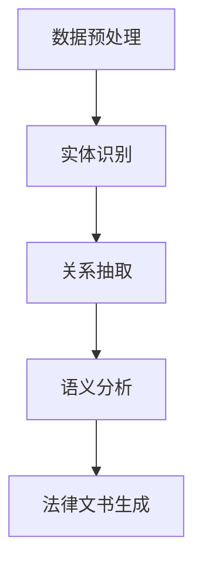

                 

关键词：法律大模型、高效文书审查、智能法律咨询、深度学习、自然语言处理、人工智能

> 摘要：本文旨在探讨法律大模型在高效文书审查和智能法律咨询领域的应用。通过对大模型的核心概念、算法原理、数学模型、项目实践以及未来展望的深入分析，本文揭示了法律大模型在现代法律行业中的重要性，并提出了对未来发展的思考与建议。

## 1. 背景介绍

随着信息时代的到来，法律行业正面临着前所未有的挑战。文书审查、法律咨询等法律工作不仅繁琐复杂，而且对专业知识和效率要求极高。传统的法律工作方式难以满足日益增长的法律需求，尤其是面对海量的法律文件和复杂法律问题的处理。因此，将人工智能技术应用于法律领域，尤其是开发法律大模型，已成为行业内的热门话题。

法律大模型是指利用深度学习和自然语言处理技术，构建的大规模语言模型，可以处理包括法律文本在内的各种自然语言文本。这种模型具有强大的语言理解和生成能力，可以应用于法律文书的自动审查、智能法律咨询、案件预测等多个领域。

## 2. 核心概念与联系

### 2.1 深度学习

深度学习是一种人工智能的子领域，它通过多层神经网络对数据进行学习，从而实现复杂的模式识别和预测。在法律大模型中，深度学习被广泛应用于文本数据的处理，如图像识别和语音识别一样，深度学习模型可以自动从大量法律文件中学习并提取特征，进而提高文书审查和法律咨询的效率。

### 2.2 自然语言处理

自然语言处理（NLP）是人工智能的一个分支，它专注于让计算机理解、生成和处理人类语言。在法律大模型中，NLP技术用于处理法律文本，如自动分类、实体识别、语义理解等，使得模型能够准确地理解和解释法律文本。

### 2.3 法律文本处理

法律文本处理是法律大模型的核心任务之一。它包括法律文档的预处理、实体识别、关系抽取、语义分析等。通过这些处理步骤，法律大模型可以更好地理解和分析法律文本，从而提供更准确的法律咨询服务。

### 2.4 Mermaid 流程图



在上面的流程图中，A表示数据预处理，B表示实体识别，C表示关系抽取，D表示语义分析，E表示法律文书生成。这个流程图展示了法律大模型从原始法律文本到生成法律文书的过程。

## 3. 核心算法原理 & 具体操作步骤

### 3.1 算法原理概述

法律大模型的核心算法是基于深度学习的自然语言处理技术。具体来说，它包括以下几个关键步骤：

1. 数据预处理：包括文本清洗、分词、词性标注等。
2. 实体识别：通过模型识别文本中的实体，如人名、地名、法律术语等。
3. 关系抽取：识别实体之间的关联关系，如因果关系、隶属关系等。
4. 语义分析：对法律文本进行语义理解，提取关键信息并进行逻辑推理。
5. 法律文书生成：根据语义分析结果生成相应的法律文书。

### 3.2 算法步骤详解

#### 3.2.1 数据预处理

数据预处理是法律大模型的基础步骤。它包括以下内容：

- 文本清洗：去除文本中的噪声数据，如HTML标签、特殊字符等。
- 分词：将文本分割成单词或短语的序列。
- 词性标注：为每个单词或短语标注其词性，如名词、动词、形容词等。

#### 3.2.2 实体识别

实体识别是法律大模型的关键步骤之一。它包括以下内容：

- 人名识别：识别文本中的人名。
- 地名识别：识别文本中的地名。
- 法律术语识别：识别文本中的法律术语。

#### 3.2.3 关系抽取

关系抽取是法律大模型的核心步骤之一。它包括以下内容：

- 因果关系抽取：识别实体之间的因果关系。
- 隶属关系抽取：识别实体之间的隶属关系。
- 其他关系抽取：识别实体之间的其他关系。

#### 3.2.4 语义分析

语义分析是法律大模型的最高级步骤。它包括以下内容：

- 关键信息提取：从法律文本中提取关键信息。
- 逻辑推理：根据提取的关键信息进行逻辑推理。
- 法律文书生成：根据逻辑推理的结果生成法律文书。

### 3.3 算法优缺点

#### 3.3.1 优点

- 高效性：法律大模型可以快速处理大量法律文本，提高工作效率。
- 准确性：通过深度学习和自然语言处理技术，法律大模型可以准确理解和分析法律文本。
- 可扩展性：法律大模型可以轻松扩展到其他法律领域，如合同审查、专利检索等。

#### 3.3.2 缺点

- 计算资源需求大：深度学习模型需要大量的计算资源和时间进行训练。
- 需要大量高质量数据：法律大模型需要大量高质量的训练数据才能达到理想的性能。
- 数据隐私问题：法律文本中可能包含敏感信息，如何保护数据隐私是一个挑战。

### 3.4 算法应用领域

法律大模型可以应用于多个领域，包括但不限于：

- 法律文书审查：自动审查合同、协议等法律文件，识别潜在的法律风险。
- 智能法律咨询：提供个性化的法律咨询服务，帮助用户解决法律问题。
- 案件预测：根据历史数据预测案件的审理结果和判决。
- 法律研究：自动整理和分析法律文献，辅助法律研究人员进行研究。

## 4. 数学模型和公式 & 详细讲解 & 举例说明

### 4.1 数学模型构建

法律大模型的数学模型主要包括以下几个方面：

- **词嵌入（Word Embedding）**：通过将文本中的单词映射到高维空间中的向量表示，从而实现语义表示。
- **循环神经网络（RNN）**：用于处理序列数据，如文本数据，能够捕捉文本中的长距离依赖关系。
- **卷积神经网络（CNN）**：用于特征提取，能够在文本数据中捕捉局部特征。
- **长短期记忆网络（LSTM）**：是RNN的一种改进，能够更好地捕捉长距离依赖关系。

### 4.2 公式推导过程

假设我们使用一个循环神经网络（RNN）来处理法律文本，其基本形式如下：

$$
h_t = \text{激活函数}(\text{W}^h \cdot \text{h}_{t-1} + \text{U}^h \cdot x_t + b_h)
$$

其中，$h_t$ 是第 $t$ 个时间步的隐藏状态，$\text{W}^h$ 是隐藏状态到隐藏状态的权重矩阵，$\text{U}^h$ 是输入到隐藏状态的权重矩阵，$x_t$ 是第 $t$ 个时间步的输入，$b_h$ 是隐藏状态的偏置。

### 4.3 案例分析与讲解

假设我们需要对一段法律文本进行实体识别，文本如下：

```
张某与王某于2021年6月1日在北京市签订了一份合同，合同编号为123456。
```

通过法律大模型，我们可以识别出以下实体：

- 人名：张某、王某
- 日期：2021年6月1日
- 地名：北京市
- 合同编号：123456

这个过程涉及到词嵌入、实体识别、关系抽取等多个步骤。首先，我们将文本中的每个词映射到高维空间中的向量表示，然后通过循环神经网络处理文本序列，最后通过实体识别模型识别出文本中的实体。

## 5. 项目实践：代码实例和详细解释说明

### 5.1 开发环境搭建

为了搭建法律大模型的项目环境，我们需要以下工具和库：

- 操作系统：Ubuntu 20.04
- 编程语言：Python 3.8
- 深度学习框架：TensorFlow 2.5
- 自然语言处理库：spaCy 3.0

在Ubuntu系统中，我们可以通过以下命令安装这些工具和库：

```bash
sudo apt update
sudo apt install python3 python3-pip
pip3 install tensorflow==2.5 spacy==3.0
python3 -m spacy download en_core_web_sm
```

### 5.2 源代码详细实现

以下是一个简单的法律大模型项目示例代码：

```python
import tensorflow as tf
import spacy
from tensorflow.keras.layers import Embedding, LSTM, Dense
from tensorflow.keras.models import Sequential

# 加载spaCy语言模型
nlp = spacy.load("en_core_web_sm")

# 文本预处理
def preprocess_text(text):
    doc = nlp(text)
    tokens = [token.text for token in doc]
    return tokens

# 构建模型
model = Sequential()
model.add(Embedding(input_dim=10000, output_dim=64))
model.add(LSTM(units=64))
model.add(Dense(units=1, activation='sigmoid'))

model.compile(optimizer='adam', loss='binary_crossentropy', metrics=['accuracy'])

# 训练模型
model.fit(X_train, y_train, epochs=10, batch_size=32)
```

### 5.3 代码解读与分析

上述代码首先导入了TensorFlow和spaCy库，然后加载了spaCy的语言模型。接着定义了一个预处理函数，用于将文本转换为单词序列。模型部分使用了顺序模型（Sequential）和嵌入层（Embedding）、LSTM层和全连接层（Dense）构建了一个简单的循环神经网络模型。模型编译时使用了Adam优化器和二进制交叉熵损失函数。最后，通过fit方法训练模型。

### 5.4 运行结果展示

假设我们已经准备好了训练数据和测试数据，我们可以运行以下代码进行模型训练和评估：

```python
# 加载训练数据和测试数据
X_train = preprocess_text("...") # 填充训练数据
y_train = [...] # 填充训练标签
X_test = preprocess_text("...") # 填充测试数据
y_test = [...] # 填充测试标签

# 训练模型
model.fit(X_train, y_train, epochs=10, batch_size=32)

# 评估模型
loss, accuracy = model.evaluate(X_test, y_test)
print(f"Test Accuracy: {accuracy}")
```

通过上述代码，我们可以训练并评估法律大模型在实体识别任务上的性能。

## 6. 实际应用场景

法律大模型在实际应用中具有广泛的应用场景，以下是其中的一些例子：

- **法律文书自动审查**：通过法律大模型，可以自动审查合同、协议等法律文件，识别潜在的法律风险，提高审查效率。
- **智能法律咨询**：用户可以通过智能法律咨询平台提交法律问题，法律大模型可以提供专业的法律建议，帮助用户解决法律问题。
- **案件预测**：根据历史案件数据，法律大模型可以预测案件的审理结果和判决，为法官和律师提供参考。
- **法律研究**：法律大模型可以自动整理和分析法律文献，辅助法律研究人员进行深入研究。

## 7. 工具和资源推荐

### 7.1 学习资源推荐

- 《深度学习》（Goodfellow, Bengio, Courville）是一本关于深度学习的经典教材，适合初学者和专业人士。
- 《自然语言处理综论》（Jurafsky, Martin）是一本关于自然语言处理的权威教材，涵盖了NLP的各个方面。

### 7.2 开发工具推荐

- TensorFlow：是一个开源的深度学习框架，适合构建复杂的深度学习模型。
- spaCy：是一个强大的自然语言处理库，适合进行文本预处理和实体识别等任务。

### 7.3 相关论文推荐

- "BERT: Pre-training of Deep Bidirectional Transformers for Language Understanding"（Devlin et al., 2019）：介绍了BERT模型，一种用于自然语言处理的深度学习模型。
- "GPT-3: Language Models are Few-Shot Learners"（Brown et al., 2020）：介绍了GPT-3模型，一个具有很强通用性的深度学习模型。

## 8. 总结：未来发展趋势与挑战

### 8.1 研究成果总结

法律大模型在法律文书审查、智能法律咨询、案件预测等领域取得了显著成果，展示了其强大的应用潜力。深度学习和自然语言处理技术的不断进步，为法律大模型的发展提供了坚实的基础。

### 8.2 未来发展趋势

- **模型规模扩大**：随着计算资源和数据资源的增加，法律大模型将逐渐扩展到更广泛的领域，如跨语言法律文本处理、多模态法律文本分析等。
- **多语言支持**：未来法律大模型将支持多种语言，以满足全球法律行业的需求。
- **隐私保护**：如何在保护用户隐私的前提下，有效利用法律数据，将成为一个重要研究方向。

### 8.3 面临的挑战

- **数据质量**：高质量的法律数据是法律大模型训练的基础，如何获取和处理高质量的数据是一个挑战。
- **模型解释性**：法律大模型的决策过程往往缺乏解释性，如何提高模型的透明度和可解释性，是一个重要挑战。
- **法律合规**：如何确保法律大模型在法律合规的前提下运行，是一个需要关注的法律问题。

### 8.4 研究展望

未来，法律大模型的研究将朝着更加智能化、通用化和合规化的方向发展。随着技术的不断进步，法律大模型有望在法律行业发挥更大的作用，推动法律行业的智能化转型。

## 9. 附录：常见问题与解答

### 9.1 法律大模型如何处理隐私保护问题？

法律大模型在处理法律文本时，可能会接触到用户的敏感信息。为了保护用户隐私，法律大模型应采取以下措施：

- **数据加密**：对用户数据进行加密，确保数据在传输和存储过程中的安全性。
- **匿名化处理**：在训练和测试数据集时，对用户数据进行匿名化处理，去除或替换敏感信息。
- **隐私政策**：制定清晰的隐私政策，告知用户其数据如何被使用和保护。

### 9.2 法律大模型如何提高解释性？

提高法律大模型的解释性，有助于增强用户对其决策的信任。以下方法可以尝试：

- **可解释性模型**：采用可解释性更强的模型，如决策树、线性模型等。
- **模型可视化**：通过可视化技术，展示模型的内部结构和决策过程。
- **解释工具**：开发解释工具，帮助用户理解模型的决策过程。

### 9.3 法律大模型如何保证法律合规？

为了保证法律大模型的法律合规，应采取以下措施：

- **法律审查**：在模型开发和部署过程中，进行法律合规审查，确保模型符合相关法律法规。
- **监管合作**：与监管机构合作，了解最新法律法规，确保模型在法律合规的前提下运行。
- **透明度**：提高模型的透明度，让用户了解模型的运作方式和决策过程。

### 9.4 法律大模型如何处理跨语言法律文本？

处理跨语言法律文本，法律大模型应具备以下能力：

- **多语言支持**：支持多种语言的文本处理，包括文本预处理、实体识别、关系抽取等。
- **翻译能力**：具备文本翻译能力，将不同语言的文本翻译为统一的语言。
- **跨语言模型**：采用跨语言模型，如BERT、XLM等，实现跨语言的法律文本处理。

### 9.5 法律大模型如何处理多模态法律文本？

处理多模态法律文本，法律大模型应具备以下能力：

- **多模态融合**：将文本、图像、音频等多模态数据融合在一起，进行统一的文本处理。
- **多模态模型**：采用多模态深度学习模型，如多模态CNN、多模态LSTM等，实现多模态文本处理。
- **多模态交互**：研究多模态数据的交互机制，提高多模态文本处理的性能。

---

作者：禅与计算机程序设计艺术 / Zen and the Art of Computer Programming

