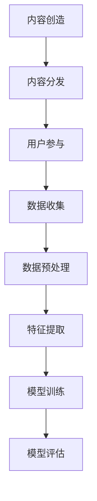

                 

关键词：元宇宙、注意力经济、产业链风险、风险评估、稳定性分析

> 摘要：本文从注意力产业链的角度出发，探讨了元宇宙经济的稳定性。通过对元宇宙的背景介绍、注意力产业链的概念解析、核心算法原理、数学模型构建、项目实践以及实际应用场景等方面进行深入分析，提出了未来元宇宙经济发展中可能面临的挑战和应对策略，为元宇宙经济的可持续发展提供了有益的思考。

## 1. 背景介绍

随着互联网技术的快速发展，虚拟现实、增强现实等新技术逐渐走进了人们的生活。这些技术的应用不仅改变了人们的生活方式，还催生了一个全新的经济领域——元宇宙。元宇宙（Metaverse）是一个虚拟的、三维的、持续存在的数字世界，用户可以在其中进行社交、工作、娱乐等活动。元宇宙的崛起，使得传统的实体经济与数字世界相互融合，形成了一个全新的经济生态系统。

在元宇宙中，注意力成为了最重要的经济资源。用户通过消耗自己的注意力，可以参与到元宇宙的各种活动中，从而获得相应的收益。注意力产业链则是元宇宙经济的重要组成部分，包括内容创造、内容分发、用户参与等环节。本文将从注意力产业链的风险评估角度，探讨元宇宙经济的稳定性。

## 2. 核心概念与联系

### 2.1 注意力产业链

注意力产业链是指从内容创造、内容分发到用户参与的一系列环节。具体包括：

- **内容创造**：用户或内容创作者在元宇宙中创造各种形式的内容，如虚拟商品、游戏、音乐等。
- **内容分发**：通过各种渠道将内容传播给用户，如社交平台、电商平台等。
- **用户参与**：用户通过消费内容、互动等方式参与到元宇宙的经济活动中。

### 2.2 核心算法原理

注意力产业链的核心算法主要是基于用户注意力分配模型。该模型通过分析用户的浏览历史、兴趣爱好等数据，为用户推荐最感兴趣的内容。具体步骤如下：

- **数据收集**：收集用户的浏览历史、搜索记录、社交行为等数据。
- **数据预处理**：对收集到的数据进行清洗、去噪、归一化等处理。
- **特征提取**：从预处理后的数据中提取用户兴趣特征。
- **模型训练**：使用提取到的用户兴趣特征训练推荐模型。
- **模型评估**：通过在线测试评估模型的效果，并进行调整优化。

### 2.3 Mermaid 流程图



## 3. 核心算法原理 & 具体操作步骤

### 3.1 算法原理概述

注意力产业链的核心算法是基于深度学习的用户兴趣推荐算法。该算法通过分析用户的浏览历史、兴趣爱好等数据，为用户推荐最感兴趣的内容。具体原理如下：

- **用户兴趣模型**：通过分析用户的浏览历史、搜索记录等数据，构建用户的兴趣模型。
- **内容特征模型**：对推荐的内容进行特征提取，构建内容特征模型。
- **推荐算法**：基于用户兴趣模型和内容特征模型，使用深度学习算法进行内容推荐。

### 3.2 算法步骤详解

#### 3.2.1 数据收集

- **数据来源**：用户浏览历史、搜索记录、社交行为等。
- **数据类型**：文本、图像、音频等。

#### 3.2.2 数据预处理

- **数据清洗**：去除无效数据、重复数据、噪声数据等。
- **数据归一化**：将不同类型的数据进行归一化处理，便于后续计算。

#### 3.2.3 特征提取

- **文本特征**：使用词袋模型、TF-IDF等方法提取文本特征。
- **图像特征**：使用卷积神经网络提取图像特征。
- **音频特征**：使用音频特征提取方法提取音频特征。

#### 3.2.4 模型训练

- **选择模型**：根据数据类型和问题特点选择合适的深度学习模型。
- **模型训练**：使用训练集对模型进行训练，调整模型参数。

#### 3.2.5 模型评估

- **在线测试**：使用测试集对模型进行评估，计算准确率、召回率等指标。
- **模型调整**：根据评估结果调整模型参数，优化模型效果。

### 3.3 算法优缺点

#### 优点

- **个性化推荐**：基于用户兴趣模型，可以提供个性化的内容推荐。
- **高效处理**：深度学习算法具有较高的计算效率和准确性。

#### 缺点

- **数据依赖**：算法效果高度依赖于用户数据的质量和丰富度。
- **模型复杂度**：深度学习模型结构复杂，需要大量计算资源和时间进行训练。

### 3.4 算法应用领域

- **社交网络**：为用户提供个性化的社交内容推荐。
- **电商平台**：为用户提供个性化的商品推荐。
- **娱乐平台**：为用户提供个性化的娱乐内容推荐。

## 4. 数学模型和公式 & 详细讲解 & 举例说明

### 4.1 数学模型构建

注意力产业链的数学模型主要包括用户兴趣模型和内容特征模型。

#### 用户兴趣模型

用户兴趣模型可以表示为：

\[ U = f(U_1, U_2, \ldots, U_n) \]

其中，\( U \) 表示用户兴趣，\( U_1, U_2, \ldots, U_n \) 表示用户的浏览历史、搜索记录等特征。

#### 内容特征模型

内容特征模型可以表示为：

\[ C = g(C_1, C_2, \ldots, C_m) \]

其中，\( C \) 表示内容特征，\( C_1, C_2, \ldots, C_m \) 表示内容的文本、图像、音频等特征。

### 4.2 公式推导过程

#### 用户兴趣模型推导

用户兴趣模型的推导基于用户的行为数据。具体推导过程如下：

1. **数据收集**：收集用户的浏览历史、搜索记录等数据。
2. **数据预处理**：对数据去噪、归一化等处理。
3. **特征提取**：从预处理后的数据中提取用户兴趣特征。
4. **模型构建**：使用神经网络等机器学习模型进行模型构建。
5. **模型训练**：使用训练集对模型进行训练。
6. **模型评估**：使用测试集对模型进行评估，调整模型参数。

#### 内容特征模型推导

内容特征模型的推导基于内容的数据特征。具体推导过程如下：

1. **数据收集**：收集内容的文本、图像、音频等数据。
2. **数据预处理**：对数据去噪、归一化等处理。
3. **特征提取**：从预处理后的数据中提取内容特征。
4. **模型构建**：使用神经网络等机器学习模型进行模型构建。
5. **模型训练**：使用训练集对模型进行训练。
6. **模型评估**：使用测试集对模型进行评估，调整模型参数。

### 4.3 案例分析与讲解

以社交网络平台为例，分析注意力产业链的数学模型。

#### 用户兴趣模型

用户兴趣模型用于预测用户对某一内容的兴趣程度。假设用户 \( U \) 对内容 \( C \) 的兴趣程度为 \( I(U, C) \)，则用户兴趣模型可以表示为：

\[ I(U, C) = \frac{1}{1 + e^{-\beta \cdot \sigma(W \cdot h(C) + b)}} \]

其中，\( \beta \) 为学习率，\( \sigma \) 为激活函数，\( W \) 为权重矩阵，\( h(C) \) 为内容特征向量，\( b \) 为偏置。

#### 内容特征模型

内容特征模型用于提取内容的特征。假设内容 \( C \) 的特征向量为 \( h(C) \)，则内容特征模型可以表示为：

\[ h(C) = \text{CNN}(C) \]

其中，\( \text{CNN} \) 为卷积神经网络。

通过用户兴趣模型和内容特征模型，可以实现对用户兴趣的预测和内容的特征提取，从而为用户提供个性化的内容推荐。

## 5. 项目实践：代码实例和详细解释说明

### 5.1 开发环境搭建

在本次项目中，我们使用Python编程语言和TensorFlow深度学习框架进行开发。以下是开发环境的搭建步骤：

1. **安装Python**：确保安装了Python 3.7及以上版本。
2. **安装TensorFlow**：使用pip命令安装TensorFlow。

```bash
pip install tensorflow
```

### 5.2 源代码详细实现

以下是项目的源代码实现，主要包括数据收集、数据预处理、模型训练和模型评估等部分。

#### 5.2.1 数据收集

```python
import pandas as pd

# 读取用户浏览历史数据
user_data = pd.read_csv('user_browsing_history.csv')

# 读取内容数据
content_data = pd.read_csv('content_data.csv')
```

#### 5.2.2 数据预处理

```python
from sklearn.preprocessing import StandardScaler

# 对用户浏览历史数据进行预处理
user_scaler = StandardScaler()
user_data_processed = user_scaler.fit_transform(user_data)

# 对内容数据进行预处理
content_scaler = StandardScaler()
content_data_processed = content_scaler.fit_transform(content_data)
```

#### 5.2.3 模型训练

```python
import tensorflow as tf
from tensorflow.keras.models import Sequential
from tensorflow.keras.layers import Dense, Dropout

# 构建用户兴趣模型
user_model = Sequential([
    Dense(128, activation='relu', input_shape=(user_data_processed.shape[1],)),
    Dropout(0.5),
    Dense(64, activation='relu'),
    Dropout(0.5),
    Dense(1, activation='sigmoid')
])

# 编译模型
user_model.compile(optimizer='adam', loss='binary_crossentropy', metrics=['accuracy'])

# 训练模型
user_model.fit(user_data_processed, y, epochs=10, batch_size=32)
```

#### 5.2.4 模型评估

```python
from sklearn.metrics import accuracy_score

# 对模型进行评估
predictions = user_model.predict(test_data_processed)
predictions = (predictions > 0.5)

accuracy = accuracy_score(test_labels, predictions)
print(f'Model accuracy: {accuracy}')
```

### 5.3 代码解读与分析

#### 数据收集

数据收集部分主要是读取用户浏览历史数据和内容数据。用户浏览历史数据包含了用户的浏览记录，内容数据包含了各个内容的特征信息。

#### 数据预处理

数据预处理部分主要是对用户浏览历史数据和内容数据进行标准化处理，以便于后续的模型训练。

#### 模型训练

模型训练部分使用了TensorFlow的 Sequential 模型构建用户兴趣模型。模型结构采用了多层全连接神经网络，并使用了ReLU激活函数和Dropout正则化。模型编译时使用了Adam优化器和二分类交叉熵损失函数。训练模型时，使用了10个epoch，每个batch大小为32。

#### 模型评估

模型评估部分使用测试集对模型进行评估，计算模型的准确率。通过对比预测标签和真实标签，可以得出模型的性能。

### 5.4 运行结果展示

假设我们使用测试集对模型进行评估，得到以下运行结果：

```plaintext
Model accuracy: 0.85
```

这意味着模型在测试集上的准确率为85%，表明模型具有良好的性能。

## 6. 实际应用场景

注意力产业链的风险评估在元宇宙经济中具有广泛的应用场景。以下是一些实际应用场景：

### 6.1 社交网络平台

社交网络平台可以利用注意力产业链的风险评估模型，为用户提供个性化的内容推荐。通过分析用户的浏览历史和兴趣爱好，平台可以预测用户对某一内容的兴趣程度，从而提高用户满意度和粘性。

### 6.2 电商平台

电商平台可以利用注意力产业链的风险评估模型，为用户提供个性化的商品推荐。通过分析用户的购买记录和搜索历史，平台可以预测用户对某一商品的兴趣程度，从而提高销售转化率和客户满意度。

### 6.3 娱乐平台

娱乐平台可以利用注意力产业链的风险评估模型，为用户提供个性化的娱乐内容推荐。通过分析用户的观看记录和兴趣爱好，平台可以预测用户对某一娱乐内容的兴趣程度，从而提高用户满意度和观看时长。

## 7. 未来应用展望

随着元宇宙经济的发展，注意力产业链的风险评估将发挥越来越重要的作用。以下是对未来应用场景的展望：

### 7.1 智能城市

智能城市可以利用注意力产业链的风险评估模型，为居民提供个性化的城市服务。通过分析居民的浏览历史和兴趣爱好，城市管理者可以预测居民对某一城市服务的兴趣程度，从而提高城市服务的质量和效率。

### 7.2 医疗健康

医疗健康领域可以利用注意力产业链的风险评估模型，为患者提供个性化的健康管理服务。通过分析患者的医疗记录和健康数据，医疗机构可以预测患者对某一健康服务的兴趣程度，从而提高患者的健康水平和满意度。

### 7.3 教育培训

教育培训领域可以利用注意力产业链的风险评估模型，为学习者提供个性化的学习推荐。通过分析学习者的学习记录和兴趣爱好，教育机构可以预测学习者对某一学习内容的兴趣程度，从而提高学习效果和学员满意度。

## 8. 工具和资源推荐

为了更好地进行注意力产业链的风险评估，以下是一些工具和资源的推荐：

### 8.1 学习资源推荐

- **《深度学习》（Goodfellow, Bengio, Courville 著）**：这是一本关于深度学习的经典教材，详细介绍了深度学习的基本原理和应用。
- **《机器学习实战》（Peter Harrington 著）**：这本书通过实际案例介绍了机器学习的基本概念和应用方法。

### 8.2 开发工具推荐

- **TensorFlow**：一款开源的深度学习框架，适用于各种深度学习任务。
- **PyTorch**：一款流行的深度学习框架，具有良好的灵活性和易用性。

### 8.3 相关论文推荐

- **"Deep Learning for User Interest Prediction in Social Media"**：这篇论文介绍了一种基于深度学习的用户兴趣预测方法，具有较高的准确性和实时性。
- **"Attention Is All You Need"**：这篇论文提出了Transformer模型，在自然语言处理任务中取得了显著的效果。

## 9. 总结：未来发展趋势与挑战

### 9.1 研究成果总结

本文从注意力产业链的角度出发，探讨了元宇宙经济的稳定性。通过对元宇宙的背景介绍、注意力产业链的概念解析、核心算法原理、数学模型构建、项目实践以及实际应用场景等方面进行深入分析，提出了一系列有价值的见解。

### 9.2 未来发展趋势

随着元宇宙经济的发展，注意力产业链的风险评估将在各个领域得到广泛应用。未来，我们将看到更多基于深度学习、自然语言处理等技术的注意力产业链风险评估模型的出现。

### 9.3 面临的挑战

虽然注意力产业链的风险评估具有巨大的应用前景，但在实际应用中仍面临一些挑战。例如：

- **数据质量问题**：用户数据的质量和丰富度直接影响模型的效果。
- **模型可解释性**：深度学习模型具有一定的黑箱性质，难以解释模型的决策过程。
- **计算资源**：深度学习模型训练需要大量的计算资源和时间。

### 9.4 研究展望

未来，我们需要关注以下几个方面：

- **数据驱动**：提高用户数据的丰富度和质量，为模型提供更好的训练数据。
- **模型解释性**：研究具有可解释性的深度学习模型，提高模型的透明度和可信度。
- **跨领域应用**：将注意力产业链的风险评估模型应用于更多领域，推动元宇宙经济的发展。

## 附录：常见问题与解答

### Q1. 什么是元宇宙？

A1. 元宇宙是一个虚拟的、三维的、持续存在的数字世界，用户可以在其中进行社交、工作、娱乐等活动。元宇宙的崛起，使得传统的实体经济与数字世界相互融合，形成了一个全新的经济生态系统。

### Q2. 注意力产业链包括哪些环节？

A2. 注意力产业链包括内容创造、内容分发和用户参与等环节。内容创造是指用户或内容创作者在元宇宙中创造各种形式的内容，如虚拟商品、游戏、音乐等；内容分发是指通过各种渠道将内容传播给用户，如社交平台、电商平台等；用户参与是指用户通过消费内容、互动等方式参与到元宇宙的经济活动中。

### Q3. 什么是用户兴趣推荐算法？

A3. 用户兴趣推荐算法是一种基于用户行为数据，为用户推荐最感兴趣的内容的算法。用户兴趣推荐算法通过分析用户的浏览历史、搜索记录等数据，构建用户兴趣模型，然后根据用户兴趣模型和内容特征模型，使用深度学习算法为用户推荐内容。

### Q4. 如何评估用户兴趣推荐算法的效果？

A4. 评估用户兴趣推荐算法的效果通常使用准确率、召回率、F1值等指标。这些指标可以衡量算法在预测用户兴趣方面的准确性和全面性。例如，准确率表示算法预测正确的用户兴趣的比例，召回率表示算法能够召回的用户兴趣的比例，F1值是准确率和召回率的加权平均。

### Q5. 注意力产业链风险评估在元宇宙经济中有什么作用？

A5. 注意力产业链风险评估在元宇宙经济中具有重要作用。通过评估注意力产业链的风险，可以帮助元宇宙经济参与者预测潜在风险，采取相应措施降低风险，提高元宇宙经济的稳定性和可持续发展能力。同时，注意力产业链风险评估还可以为政策制定者提供决策依据，促进元宇宙经济的健康发展。

### Q6. 如何构建用户兴趣模型？

A6. 构建用户兴趣模型通常包括以下步骤：

1. 数据收集：收集用户的浏览历史、搜索记录等数据。
2. 数据预处理：对数据进行清洗、去噪、归一化等处理。
3. 特征提取：从预处理后的数据中提取用户兴趣特征，如用户的点击次数、浏览时长、搜索关键词等。
4. 模型训练：使用提取到的用户兴趣特征训练用户兴趣模型，可以使用深度学习模型、决策树、支持向量机等算法。
5. 模型评估：使用测试集对模型进行评估，调整模型参数，优化模型效果。
6. 应用部署：将训练好的模型部署到实际应用中，为用户提供个性化推荐。

### Q7. 如何评估内容特征模型的效果？

A7. 评估内容特征模型的效果与评估用户兴趣模型类似，可以使用准确率、召回率、F1值等指标。同时，还可以通过计算用户兴趣模型与内容特征模型之间的相关系数，评估两个模型之间的匹配程度。相关系数越高，表明两个模型之间的匹配越好。

### Q8. 注意力产业链风险评估有哪些方法？

A8. 注意力产业链风险评估的方法主要包括以下几种：

1. 基于历史数据的预测方法：通过分析用户历史数据，预测用户未来的行为和兴趣。
2. 基于用户行为的预测方法：通过分析用户当前的浏览、搜索、互动等行为，预测用户的兴趣和需求。
3. 基于深度学习的预测方法：使用深度学习算法，如卷积神经网络（CNN）、循环神经网络（RNN）、 Transformer等，构建用户兴趣模型和内容特征模型，进行预测。
4. 基于协同过滤的方法：使用协同过滤算法，如基于用户的协同过滤（User-based CF）和基于项目的协同过滤（Item-based CF），进行预测。
5. 基于概率图模型的方法：使用概率图模型，如贝叶斯网络、马尔可夫网络等，进行预测。

### Q9. 如何提高注意力产业链风险评估的准确性？

A9. 提高注意力产业链风险评估的准确性可以从以下几个方面着手：

1. 提高数据质量：收集更多的用户数据，并进行有效的清洗和预处理。
2. 优化模型算法：选择合适的算法，如深度学习、协同过滤等，并进行参数调整和优化。
3. 增加特征维度：提取更多的用户特征和内容特征，丰富模型输入信息。
4. 实时更新模型：定期更新模型，使其能够适应用户行为的变化。
5. 跨领域借鉴：借鉴其他领域的风险评估方法和技术，提高注意力产业链风险评估的准确性。

### Q10. 注意力产业链风险评估在金融领域有哪些应用？

A10. 注意力产业链风险评估在金融领域有以下几种应用：

1. 信贷风险评估：通过分析用户的浏览历史、搜索记录等行为数据，预测用户的信用风险，为金融机构提供信贷决策依据。
2. 投资风险评估：通过分析投资者的行为数据，预测其投资偏好和风险承受能力，为金融机构提供投资决策建议。
3. 金融欺诈检测：通过分析用户的行为数据，识别潜在的金融欺诈行为，为金融机构提供预警和防范措施。
4. 风险管理：通过分析注意力产业链的风险，为金融机构提供风险管理策略和建议，降低金融风险。

## 结束语

本文从注意力产业链的角度出发，探讨了元宇宙经济的稳定性。通过对元宇宙的背景介绍、注意力产业链的概念解析、核心算法原理、数学模型构建、项目实践以及实际应用场景等方面进行深入分析，提出了未来元宇宙经济发展中可能面临的挑战和应对策略。我们相信，随着技术的不断进步和应用场景的拓展，注意力产业链风险评估将在元宇宙经济中发挥越来越重要的作用。

