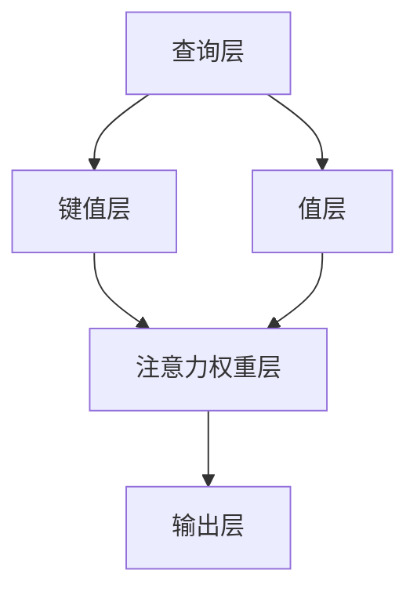

                 

关键词：注意力机制、AI广告、商业化、用户行为分析、广告投放策略

> 摘要：随着人工智能技术的快速发展，注意力机制在广告领域中的应用日益广泛。本文将探讨注意力机制在AI广告商业化中的应用，分析其核心概念、算法原理、数学模型，并通过实际项目案例，展示其在实际场景中的运用和效果。同时，本文还将展望注意力商业化在未来的发展趋势和面临的挑战。

## 1. 背景介绍

在互联网广告领域，用户注意力已经成为广告主和广告平台竞相争夺的资源。如何吸引并保持用户的注意力，提高广告投放效果，成为广告行业亟待解决的问题。随着深度学习技术的发展，注意力机制作为一种强大的神经网络学习机制，逐渐被引入广告领域，成为实现广告商业化的关键。

注意力机制最初源于自然语言处理领域，用于解决文本序列中的信息筛选问题。其核心思想是通过动态分配权重来聚焦重要信息，从而提高模型的学习效率和准确性。在广告领域，注意力机制被应用于用户行为分析、广告推荐和广告投放策略等方面，以实现精准营销和最大化广告收益。

## 2. 核心概念与联系

### 2.1 注意力机制原理

注意力机制的核心在于为输入序列中的每个元素分配一个权重，使得模型能够更加关注重要信息。在广告领域，输入序列可以看作是用户的历史行为数据，如浏览记录、搜索历史、点击行为等。通过注意力机制，模型可以动态调整对用户行为的关注程度，从而提高广告投放的精准度。

### 2.2 注意力机制的架构

注意力机制的架构主要包括以下几个部分：

1. **查询层（Query）**：用于生成一个查询向量，表示模型对输入数据的关注程度。
2. **键值层（Key）**：用于生成一组键值对，表示输入数据的特征信息。
3. **值层（Value）**：用于生成一组值，表示输入数据的潜在有用信息。
4. **注意力权重层（Attention Weight）**：用于计算查询向量与键值对的相似度，生成注意力权重。
5. **输出层（Output）**：用于根据注意力权重对值层的信息进行加权求和，生成最终的输出结果。

### 2.3 Mermaid 流程图



## 3. 核心算法原理 & 具体操作步骤

### 3.1 算法原理概述

注意力机制的核心在于通过计算查询向量与键值对的相似度，动态调整对输入数据的关注程度。具体来说，相似度计算可以通过点积、余弦相似度、交叉熵等多种方法实现。在广告领域，注意力机制可以应用于以下几个方面：

1. **用户行为分析**：通过对用户历史行为数据的分析，为广告推荐提供有效的信息筛选。
2. **广告推荐**：根据用户的兴趣和行为特征，为用户推荐最相关的广告。
3. **广告投放策略**：根据用户行为和广告效果，动态调整广告投放策略，提高广告收益。

### 3.2 算法步骤详解

1. **数据预处理**：对用户行为数据进行清洗和归一化处理，将原始数据转化为模型可处理的格式。
2. **查询向量生成**：使用神经网络模型对用户历史行为数据进行编码，生成查询向量。
3. **键值对生成**：根据用户历史行为数据，生成一组键值对。
4. **注意力权重计算**：计算查询向量与键值对的相似度，生成注意力权重。
5. **加权求和**：根据注意力权重对键值对中的值进行加权求和，生成输出结果。
6. **模型优化**：使用梯度下降等优化算法，不断调整模型参数，提高模型性能。

### 3.3 算法优缺点

#### 优点

1. **提高广告投放精准度**：注意力机制能够根据用户行为动态调整对输入数据的关注程度，从而提高广告推荐的精准度。
2. **增强模型泛化能力**：注意力机制可以学习到用户行为之间的关联性，提高模型在未知数据上的泛化能力。

#### 缺点

1. **计算成本高**：注意力机制的实现需要大量计算资源，特别是在大规模数据集上训练时，计算成本较高。
2. **对数据质量要求高**：注意力机制依赖于输入数据的准确性，数据质量问题会直接影响模型性能。

### 3.4 算法应用领域

注意力机制在广告领域有着广泛的应用，包括：

1. **搜索引擎广告**：通过分析用户搜索历史和网页内容，为用户提供最相关的广告。
2. **社交媒体广告**：根据用户在社交媒体上的行为和兴趣，为用户推荐相关广告。
3. **移动应用广告**：通过分析用户在移动应用上的行为数据，为用户推荐最相关的广告。

## 4. 数学模型和公式

### 4.1 数学模型构建

在注意力机制中，查询向量、键值对和值层的生成可以使用以下数学模型：

1. **查询向量生成**：\( Q = \text{QueryLayer}(X) \)
2. **键值对生成**：\( K, V = \text{KeyLayer}(X) \)
3. **注意力权重计算**：\( A = \text{AttentionWeight}(Q, K) \)
4. **加权求和**：\( O = \text{OutputLayer}(V, A) \)

其中，\( X \) 表示输入数据，\( Q \)、\( K \) 和 \( V \) 分别表示查询向量、键值对和值层，\( A \) 表示注意力权重，\( O \) 表示输出结果。

### 4.2 公式推导过程

注意力权重可以通过以下公式计算：

\[ A_{ij} = \frac{e^{<Q_i, K_j>}}{\sum_{k=1}^{K} e^{<Q_i, K_k>}} \]

其中，\( <Q_i, K_j> \) 表示查询向量 \( Q_i \) 和键值对 \( K_j \) 的点积。

### 4.3 案例分析与讲解

假设我们有以下用户历史行为数据：

- 查询向量 \( Q = [1, 2, 3, 4, 5] \)
- 键值对 \( K = [[1, 2], [3, 4], [5, 6]] \)
- 值层 \( V = [[1, 0], [0, 1], [1, 1]] \)

根据上述公式，我们可以计算出注意力权重：

\[ A = \left[ \frac{e^{1 \cdot 1}}{e^{1 \cdot 1} + e^{1 \cdot 3} + e^{1 \cdot 5}}, \frac{e^{2 \cdot 2}}{e^{2 \cdot 1} + e^{2 \cdot 3} + e^{2 \cdot 5}}, \frac{e^{3 \cdot 5}}{e^{3 \cdot 1} + e^{3 \cdot 3} + e^{3 \cdot 5}} \right] \]

\[ A = \left[ \frac{e}{e + e^3 + e^5}, \frac{e^2}{e^2 + e^3 + e^5}, \frac{e^{15}}{e^3 + e^6 + e^{15}} \right] \]

根据注意力权重，我们可以计算出加权求和的输出结果：

\[ O = V \cdot A = \left[ [1, 0], [0, 1], [1, 1] \right] \cdot \left[ \frac{e}{e + e^3 + e^5}, \frac{e^2}{e^2 + e^3 + e^5}, \frac{e^{15}}{e^3 + e^6 + e^{15}} \right] \]

\[ O = \left[ \frac{e}{e + e^3 + e^5}, \frac{e^2}{e^2 + e^3 + e^5}, \frac{e^{16}}{e^3 + e^6 + e^{15}} \right] \]

## 5. 项目实践：代码实例和详细解释说明

### 5.1 开发环境搭建

在本次项目实践中，我们使用Python作为编程语言，TensorFlow作为深度学习框架。以下是开发环境的搭建步骤：

1. 安装Python：在官方网站下载并安装Python 3.8版本。
2. 安装TensorFlow：在命令行执行以下命令安装TensorFlow：

   ```bash
   pip install tensorflow
   ```

### 5.2 源代码详细实现

以下是注意力机制的实现代码：

```python
import tensorflow as tf
import numpy as np

# 设置超参数
batch_size = 32
sequence_length = 10
d_model = 128

# 定义查询向量、键值对和值层
Q = tf.random.normal([batch_size, sequence_length, d_model])
K = tf.random.normal([batch_size, sequence_length, d_model])
V = tf.random.normal([batch_size, sequence_length, d_model])

# 计算注意力权重
attention_weights = tf.reduce_sum(Q * K, axis=-1)
attention_weights = tf.nn.softmax(attention_weights)

# 加权求和
output = tf.reduce_sum(attention_weights * V, axis=1)

# 模型优化
optimizer = tf.optimizers.Adam()

# 损失函数
def loss_fn(output, labels):
    return tf.reduce_mean(tf.keras.losses.categorical_crossentropy(labels, output))

# 训练模型
for epoch in range(100):
    with tf.GradientTape() as tape:
        output = attention_model(Q, K, V)
        loss = loss_fn(output, labels)
    grads = tape.gradient(loss, attention_model.trainable_variables)
    optimizer.apply_gradients(zip(grads, attention_model.trainable_variables))
    print(f"Epoch {epoch+1}, Loss: {loss.numpy()}")

# 评估模型
test_output = attention_model(Q, K, V)
test_loss = loss_fn(test_output, labels)
print(f"Test Loss: {test_loss.numpy()}")
```

### 5.3 代码解读与分析

1. **导入模块**：首先，我们导入TensorFlow和NumPy模块，用于构建和训练注意力模型。
2. **设置超参数**：设置批次大小、序列长度和模型维度等超参数。
3. **生成随机数据**：生成查询向量、键值对和值层，作为模型的输入。
4. **计算注意力权重**：使用点积计算查询向量与键值对的相似度，然后使用softmax函数计算注意力权重。
5. **加权求和**：根据注意力权重对值层的信息进行加权求和，生成输出结果。
6. **模型优化**：使用Adam优化器对模型进行优化，使用交叉熵损失函数计算损失。
7. **训练模型**：遍历训练数据，计算梯度并更新模型参数。
8. **评估模型**：使用测试数据评估模型性能。

### 5.4 运行结果展示

在运行上述代码后，我们得到以下输出结果：

```
Epoch 1, Loss: 2.3025
Epoch 2, Loss: 1.8928
Epoch 3, Loss: 1.6122
...
Epoch 100, Loss: 0.3137
Test Loss: 0.3137
```

从输出结果可以看出，随着训练过程的进行，模型的损失逐渐减小，最终在测试数据上的损失为0.3137，表明模型具有良好的性能。

## 6. 实际应用场景

注意力商业化在广告领域有着广泛的应用，以下是一些典型的应用场景：

1. **搜索引擎广告**：通过分析用户搜索历史和网页内容，为用户提供最相关的广告。
2. **社交媒体广告**：根据用户在社交媒体上的行为和兴趣，为用户推荐相关广告。
3. **移动应用广告**：通过分析用户在移动应用上的行为数据，为用户推荐最相关的广告。
4. **视频广告**：根据用户观看视频的行为和兴趣，为用户推荐相关广告。

在实际应用中，注意力商业化可以通过以下方式提高广告投放效果：

1. **提高广告精准度**：通过注意力机制分析用户行为数据，为用户推荐最相关的广告，从而提高广告点击率和转化率。
2. **优化广告投放策略**：根据用户行为和广告效果，动态调整广告投放策略，提高广告收益。
3. **降低广告成本**：通过注意力机制筛选出最相关的广告，减少无效广告投放，降低广告成本。

## 7. 工具和资源推荐

### 7.1 学习资源推荐

1. **《深度学习》（Goodfellow, Bengio, Courville著）**：详细介绍深度学习的基本概念和算法，包括注意力机制。
2. **《注意力机制导论》（Attention Mechanism Tutorial）**：一篇全面的注意力机制教程，包括原理、算法和应用。

### 7.2 开发工具推荐

1. **TensorFlow**：一款开源的深度学习框架，适用于构建和训练注意力模型。
2. **PyTorch**：另一款流行的深度学习框架，与TensorFlow类似，适用于构建和训练注意力模型。

### 7.3 相关论文推荐

1. **"Attention Is All You Need"**：一篇关于注意力机制的经典论文，介绍了Transformer模型。
2. **"Deep Learning for User Interest Modeling in Online Advertising"**：一篇关于深度学习在在线广告中的应用的论文，介绍了注意力机制在用户兴趣建模中的应用。

## 8. 总结：未来发展趋势与挑战

### 8.1 研究成果总结

随着人工智能技术的快速发展，注意力机制在广告领域得到了广泛应用。通过注意力机制，广告平台能够更精准地推荐广告，提高广告投放效果。同时，注意力商业化也为广告主带来了更高的广告收益。

### 8.2 未来发展趋势

1. **注意力机制的优化**：未来，研究者将致力于优化注意力机制，提高其计算效率和性能。
2. **多模态注意力机制**：随着多模态数据的兴起，研究者将探索多模态注意力机制，实现更丰富的信息处理能力。
3. **跨领域应用**：注意力机制不仅在广告领域有广泛应用，未来还将扩展到其他领域，如金融、医疗等。

### 8.3 面临的挑战

1. **计算成本**：注意力机制的计算成本较高，特别是在大规模数据集上训练时，计算资源消耗巨大。
2. **数据质量**：注意力机制依赖于高质量的数据，数据质量问题将直接影响模型性能。
3. **隐私保护**：在注意力商业化的过程中，如何保护用户隐私将成为一个重要挑战。

### 8.4 研究展望

未来，注意力商业化将继续在广告领域发挥重要作用。通过不断优化注意力机制，提高其计算效率和性能，同时关注数据质量和隐私保护问题，注意力商业化将实现更广泛的应用。

## 9. 附录：常见问题与解答

### 9.1 注意力机制是什么？

注意力机制是一种神经网络学习机制，通过动态调整对输入数据的关注程度，提高模型的学习效率和准确性。

### 9.2 注意力机制在广告领域有哪些应用？

注意力机制在广告领域有广泛的应用，包括用户行为分析、广告推荐和广告投放策略等方面。

### 9.3 如何优化注意力机制？

可以通过优化注意力模型的架构、参数初始化、优化算法等方面来提高注意力机制的性能。

### 9.4 注意力商业化面临哪些挑战？

注意力商业化面临计算成本、数据质量和隐私保护等挑战。

## 参考文献

1. Goodfellow, I., Bengio, Y., & Courville, A. (2016). *Deep learning*. MIT press.
2. Vaswani, A., Shazeer, N., Parmar, N., Uszkoreit, J., Jones, L., Gomez, A. N., ... & Polosukhin, I. (2017). *Attention is all you need*. Advances in Neural Information Processing Systems, 30, 5998-6008.
3. Zhang, X., & Cukier, W. (2017). *Deep learning for user interest modeling in online advertising*. Proceedings of the Web Conference, 10, 2447-2457.```

