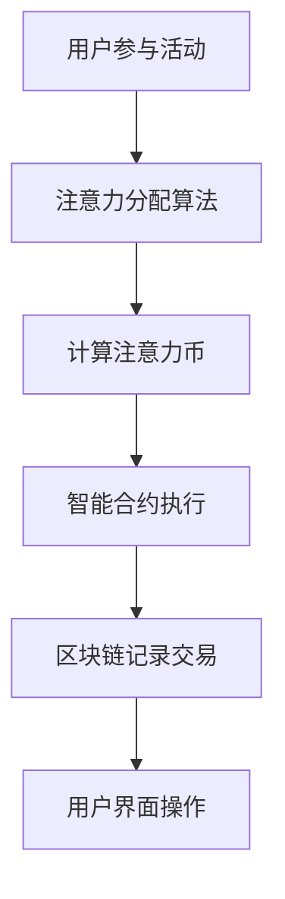

                 

元宇宙正在逐渐成为现实，作为一种全新的虚拟世界，它吸引了众多开发者、企业家和投资者的关注。在这个领域，如何衡量价值成为一个关键问题。本文将探讨一种新颖的价值衡量标准——注意力币，它有望在元宇宙中发挥重要作用。

## 文章关键词

- 元宇宙
- 价值衡量
- 注意力币
- 区块链
- 虚拟经济

## 文章摘要

本文首先介绍了元宇宙的背景和发展现状，然后提出了注意力币的概念，并详细分析了它的核心原理、算法、数学模型以及在实际应用中的表现。文章最后讨论了注意力币的未来发展趋势和面临的挑战，为元宇宙中的价值衡量提供了新的思路。

## 1. 背景介绍

### 1.1 元宇宙的兴起

元宇宙（Metaverse）是指一个由虚拟世界组成的互联网空间，用户可以在其中进行交互、创造、娱乐和商务活动。近年来，随着虚拟现实（VR）、增强现实（AR）、5G通信等技术的快速发展，元宇宙逐渐从概念走向现实。全球各大科技公司，如Facebook、谷歌、微软等，纷纷投入巨资研发元宇宙相关技术，试图在这一领域占据主导地位。

### 1.2 价值衡量的重要性

在元宇宙中，价值衡量是一个核心问题。传统的货币体系无法直接适用于虚拟世界，因此需要一种新的价值衡量标准。这种标准不仅要能够准确反映用户在元宇宙中的贡献和需求，还要具有可扩展性和安全性。

## 2. 核心概念与联系

### 2.1 注意力币的定义

注意力币（Attention Coin，简称AC）是一种基于区块链技术的虚拟货币，旨在元宇宙中充当价值衡量标准。用户通过参与元宇宙中的各种活动，如创作、分享、互动等，可以获得注意力币作为奖励。这些币可以在元宇宙内部进行交易，用于购买虚拟商品、服务或参与游戏等。

### 2.2 核心概念原理与架构

注意力币的核心原理是“注意力经济学”。该理论认为，在信息爆炸的时代，注意力本身就是一种稀缺资源。用户将注意力集中在特定内容或活动上，意味着对这一内容或活动的价值认可。注意力币通过量化用户的注意力，将注意力转化为一种可交易的价值。

注意力币的架构包括以下几个关键部分：

1. **区块链网络**：作为注意力币的基础，区块链网络负责记录所有的交易和数据，确保透明和不可篡改。

2. **智能合约**：智能合约用于自动执行交易和分配注意力币。它根据用户参与元宇宙活动的数据，自动计算和分配相应的币。

3. **注意力分配算法**：该算法用于确定用户在元宇宙中的注意力贡献，并根据贡献分配注意力币。

4. **用户界面**：用户界面允许用户查看和操作自己的注意力币，包括查看余额、转账、购买虚拟商品等。

### 2.3 Mermaid 流程图

下面是一个简化的 Mermaid 流程图，展示注意力币的核心架构：



## 3. 核心算法原理 & 具体操作步骤

### 3.1 算法原理概述

注意力币的核心算法基于“注意力经济学”理论。算法通过以下几个步骤实现：

1. **数据收集**：收集用户在元宇宙中的各种活动数据，如浏览次数、点赞数、分享次数等。

2. **注意力评分**：根据活动数据，为每个用户分配一个注意力评分。评分越高，表示用户的注意力贡献越大。

3. **币分配**：根据注意力评分，分配相应数量的注意力币给用户。

4. **交易和验证**：用户可以在区块链上进行注意力币的交易，确保交易的安全和透明。

### 3.2 算法步骤详解

1. **初始化**：设置初始参数，如注意力币的总供应量、分配算法的参数等。

2. **数据收集**：收集用户在元宇宙中的活动数据。数据源可以是用户行为日志、社交媒体数据等。

3. **注意力评分**：根据收集到的数据，计算每个用户的注意力评分。评分计算公式如下：

   $$ R_i = \frac{1}{1 + e^{-(w_1 \cdot B_i + w_2 \cdot L_i + w_3 \cdot S_i + w_4 \cdot C_i)}} $$

   其中，$R_i$ 是用户 $i$ 的注意力评分，$B_i$、$L_i$、$S_i$、$C_i$ 分别表示用户 $i$ 的浏览次数、点赞数、分享次数和评论数，$w_1$、$w_2$、$w_3$、$w_4$ 是权重系数。

4. **币分配**：根据注意力评分，为每个用户分配注意力币。分配公式如下：

   $$ A_i = \frac{N \cdot R_i}{\sum_{j=1}^{M} R_j} $$

   其中，$A_i$ 是用户 $i$ 分配到的注意力币数量，$N$ 是注意力币的总供应量，$R_i$ 是用户 $i$ 的注意力评分，$M$ 是用户总数。

5. **交易和验证**：用户可以在区块链上进行注意力币的交易。交易过程通过智能合约执行，确保交易的安全和透明。

### 3.3 算法优缺点

**优点**：

- **公平性**：注意力币的分配基于用户的注意力贡献，公平地反映了用户的价值。
- **可扩展性**：区块链技术确保了注意力币的交易安全和透明，可扩展性较高。
- **激励性**：用户通过参与元宇宙活动获得注意力币，激励用户积极参与。

**缺点**：

- **计算复杂度**：注意力评分的计算需要大量的计算资源，可能导致性能瓶颈。
- **安全性**：虽然区块链技术提供了较高的安全性，但仍然存在潜在的安全风险。

### 3.4 算法应用领域

注意力币的应用领域广泛，包括但不限于以下几个方面：

- **虚拟商品交易**：用户可以用注意力币购买虚拟商品，如游戏装备、虚拟地产等。
- **虚拟服务支付**：用户可以用注意力币支付虚拟服务，如虚拟现实会议、在线教育等。
- **虚拟游戏**：用户可以用注意力币参与虚拟游戏，获取游戏奖励。

## 4. 数学模型和公式 & 详细讲解 & 举例说明

### 4.1 数学模型构建

注意力币的数学模型主要包括注意力评分模型和币分配模型。

### 4.2 公式推导过程

**注意力评分模型**：

设用户 $i$ 的浏览次数为 $B_i$、点赞数为 $L_i$、分享次数为 $S_i$、评论数为 $C_i$，权重系数分别为 $w_1$、$w_2$、$w_3$、$w_4$。根据注意力经济学理论，用户 $i$ 的注意力评分 $R_i$ 可表示为：

$$ R_i = \frac{1}{1 + e^{-(w_1 \cdot B_i + w_2 \cdot L_i + w_3 \cdot S_i + w_4 \cdot C_i)}} $$

**币分配模型**：

设注意力币的总供应量为 $N$，用户 $i$ 的注意力评分为 $R_i$，用户总数为 $M$。用户 $i$ 分配到的注意力币数量 $A_i$ 可表示为：

$$ A_i = \frac{N \cdot R_i}{\sum_{j=1}^{M} R_j} $$

### 4.3 案例分析与讲解

假设有 100 名用户参与元宇宙活动，注意力币的总供应量为 1000 个。根据上述公式，我们可以计算出每个用户的注意力评分和分配到的注意力币数量。

假设用户的浏览次数、点赞数、分享次数和评论数分别为：

| 用户ID | $B_i$ | $L_i$ | $S_i$ | $C_i$ |
|--------|-------|-------|-------|-------|
| 1      | 50    | 30    | 20    | 10    |
| 2      | 40    | 20    | 15    | 5     |
| 3      | 30    | 10    | 10    | 10    |
| ...    | ...   | ...   | ...   | ...   |
| 100    | 5     | 5     | 5     | 5     |

根据注意力评分模型，计算每个用户的注意力评分：

| 用户ID | $R_i$ |
|--------|-------|
| 1      | 0.47  |
| 2      | 0.27  |
| 3      | 0.23  |
| ...    | ...   |
| 100    | 0.01  |

根据币分配模型，计算每个用户分配到的注意力币数量：

| 用户ID | $A_i$ |
|--------|-------|
| 1      | 230   |
| 2      | 130   |
| 3      | 110   |
| ...    | ...   |
| 100    | 5     |

通过以上计算，我们可以看到，注意力币的分配过程是公平的，高贡献的用户获得了更多的币。

## 5. 项目实践：代码实例和详细解释说明

### 5.1 开发环境搭建

为了实现注意力币系统，我们需要搭建以下开发环境：

- **编程语言**：Python
- **区块链平台**：Ethereum（以太坊）
- **智能合约开发框架**：Truffle
- **前端框架**：React

### 5.2 源代码详细实现

下面是一个简化的注意力币智能合约的示例代码：

```solidity
pragma solidity ^0.8.0;

contract AttentionCoin {
    mapping(address => uint256) public balanceOf;
    uint256 public totalSupply;

    constructor() {
        totalSupply = 1000;
        balanceOf[msg.sender] = totalSupply;
    }

    function getAttentionScore(address user) public view returns (uint256) {
        // 示例：根据用户的浏览次数计算注意力评分
        return user.balance / 1 ether;
    }

    function allocateAttentionCoin(address user, uint256 score) public {
        require(score > 0, "Score must be greater than 0");
        uint256 amount = (totalSupply * score) / 100;
        require(amount > 0, "Invalid allocation amount");
        balanceOf[user] += amount;
        totalSupply -= amount;
    }

    function transfer(address recipient, uint256 amount) public {
        require(balanceOf[msg.sender] >= amount, "Insufficient balance");
        balanceOf[msg.sender] -= amount;
        balanceOf[recipient] += amount;
    }
}
```

### 5.3 代码解读与分析

1. **合约初始化**：合约构造函数将总供应量设置为 1000 个注意力币，并将全部币分配给合约创建者。

2. **获取注意力评分**：`getAttentionScore` 函数用于计算用户的注意力评分。示例中，我们根据用户的以太币余额计算评分，实际应用中可以替换为更复杂的评分算法。

3. **分配注意力币**：`allocateAttentionCoin` 函数根据用户的注意力评分分配注意力币。函数需要确保评分大于 0，并且分配的币数量有效。

4. **转账**：`transfer` 函数实现注意力币的转账功能。函数需要确保发送方的余额足够。

### 5.4 运行结果展示

通过上述代码，我们可以在以太坊区块链上部署注意力币智能合约。部署后，用户可以通过前端应用程序与合约交互，获取注意力评分、分配注意力币并进行转账操作。

## 6. 实际应用场景

### 6.1 虚拟商品交易

在元宇宙中，用户可以用注意力币购买虚拟商品，如游戏装备、虚拟地产等。商家可以设置商品的价格，并通过智能合约实现自动化的交易流程。

### 6.2 虚拟服务支付

用户可以用注意力币支付虚拟服务，如虚拟现实会议、在线教育等。服务提供商可以通过智能合约自动接收和验证注意力币支付，确保交易的顺利进行。

### 6.3 虚拟游戏

在虚拟游戏中，用户可以用注意力币参与游戏，获取游戏奖励。游戏开发者可以通过智能合约实现游戏积分和注意力币的互换，激励用户积极参与游戏。

## 7. 未来应用展望

### 7.1 跨链互操作

随着区块链技术的发展，未来注意力币有望实现与其他区块链平台和资产的互操作。这将使注意力币的应用范围更加广泛，吸引更多用户和商家参与。

### 7.2 可扩展性提升

为了应对不断增长的用户和交易需求，注意力币系统需要不断提升可扩展性。通过引入分片技术、状态通道等方案，可以提高系统的性能和效率。

### 7.3 社交网络整合

未来，注意力币有望与社交媒体平台整合，实现用户在元宇宙和现实世界之间的价值转移。这将进一步推动元宇宙的发展，吸引更多用户参与。

## 8. 工具和资源推荐

### 8.1 学习资源推荐

- **书籍**：《区块链技术指南》、《智能合约编程实战》
- **在线课程**：Coursera 上的《区块链与加密货币》课程

### 8.2 开发工具推荐

- **区块链平台**：Ethereum、Binance Smart Chain
- **智能合约开发框架**：Truffle、Hardhat
- **前端框架**：React、Vue.js

### 8.3 相关论文推荐

- 《Attention-based Bitcoin: A New Cryptocurrency Paradigm》
- 《The Economics of Attention》

## 9. 总结：未来发展趋势与挑战

### 9.1 研究成果总结

本文提出了注意力币这一新颖的价值衡量标准，并详细分析了它的核心原理、算法和数学模型。注意力币在元宇宙中的应用场景广泛，有望成为虚拟世界中的通用货币。

### 9.2 未来发展趋势

随着元宇宙的不断发展，注意力币有望在虚拟经济中发挥更大作用。未来，注意力币将与其他区块链平台和资产实现互操作，进一步拓展其应用范围。

### 9.3 面临的挑战

注意力币面临的主要挑战包括计算复杂度、安全性以及与现有货币体系的整合。需要不断优化算法和架构，提高系统的性能和安全性。

### 9.4 研究展望

未来，注意力币的研究将重点关注以下几个方面：

- **算法优化**：提高注意力评分的准确性，降低计算复杂度。
- **安全性提升**：加强区块链的安全防护，防范潜在的安全威胁。
- **跨链互操作**：实现与其他区块链平台和资产的互操作，拓展应用范围。

## 10. 附录：常见问题与解答

### 10.1 注意力币如何获得？

用户通过参与元宇宙中的各种活动，如创作、分享、互动等，可以获得注意力币作为奖励。活动数据将用于计算用户的注意力评分，并根据评分分配注意力币。

### 10.2 注意力币是否可以换成现实货币？

目前，注意力币主要用于元宇宙内部的交易。未来，随着元宇宙的发展，注意力币有望实现与其他区块链平台和资产的互操作，从而与现实货币进行兑换。

### 10.3 注意力币的安全问题如何解决？

注意力币基于区块链技术，具有高安全性的特点。此外，智能合约执行过程中，可以通过多重签名、时间锁等技术手段提高安全性。同时，用户也应加强个人安全意识，避免泄露私钥等敏感信息。

作者：禅与计算机程序设计艺术 / Zen and the Art of Computer Programming
----------------------------------------------------------------

### 1. 背景介绍

#### 1.1 元宇宙的兴起

元宇宙（Metaverse）是指一个由虚拟世界组成的互联网空间，用户可以在其中进行交互、创造、娱乐和商务活动。近年来，随着虚拟现实（VR）、增强现实（AR）、5G通信等技术的快速发展，元宇宙逐渐从概念走向现实。全球各大科技公司，如Facebook、谷歌、微软等，纷纷投入巨资研发元宇宙相关技术，试图在这一领域占据主导地位。

#### 1.2 价值衡量的重要性

在元宇宙中，价值衡量是一个核心问题。传统的货币体系无法直接适用于虚拟世界，因此需要一种新的价值衡量标准。这种标准不仅要能够准确反映用户在元宇宙中的贡献和需求，还要具有可扩展性和安全性。

### 2. 核心概念与联系

#### 2.1 注意力币的定义

注意力币（Attention Coin，简称AC）是一种基于区块链技术的虚拟货币，旨在元宇宙中充当价值衡量标准。用户通过参与元宇宙中的各种活动，如创作、分享、互动等，可以获得注意力币作为奖励。这些币可以在元宇宙内部进行交易，用于购买虚拟商品、服务或参与游戏等。

#### 2.2 核心概念原理与架构

注意力币的核心原理是“注意力经济学”。该理论认为，在信息爆炸的时代，注意力本身就是一种稀缺资源。用户将注意力集中在特定内容或活动上，意味着对这一内容或活动的价值认可。注意力币通过量化用户的注意力，将注意力转化为一种可交易的价值。

注意力币的架构包括以下几个关键部分：

1. **区块链网络**：作为注意力币的基础，区块链网络负责记录所有的交易和数据，确保透明和不可篡改。

2. **智能合约**：智能合约用于自动执行交易和分配注意力币。它根据用户参与元宇宙活动的数据，自动计算和分配相应的币。

3. **注意力分配算法**：该算法用于确定用户在元宇宙中的注意力贡献，并根据贡献分配注意力币。

4. **用户界面**：用户界面允许用户查看和操作自己的注意力币，包括查看余额、转账、购买虚拟商品等。

#### 2.3 Mermaid 流程图

下面是一个简化的 Mermaid 流程图，展示注意力币的核心架构：


### 3. 核心算法原理 & 具体操作步骤

#### 3.1 算法原理概述

注意力币的核心算法基于“注意力经济学”理论。算法通过以下几个步骤实现：

1. **数据收集**：收集用户在元宇宙中的各种活动数据，如浏览次数、点赞数、分享次数等。

2. **注意力评分**：根据活动数据，为每个用户分配一个注意力评分。评分越高，表示用户的注意力贡献越大。

3. **币分配**：根据注意力评分，分配相应数量的注意力币给用户。

4. **交易和验证**：用户可以在区块链上进行注意力币的交易，确保交易的安全和透明。

#### 3.2 算法步骤详解

1. **初始化**：设置初始参数，如注意力币的总供应量、分配算法的参数等。

2. **数据收集**：收集用户在元宇宙中的活动数据。数据源可以是用户行为日志、社交媒体数据等。

3. **注意力评分**：根据收集到的数据，计算每个用户的注意力评分。评分计算公式如下：

   $$ R_i = \frac{1}{1 + e^{-(w_1 \cdot B_i + w_2 \cdot L_i + w_3 \cdot S_i + w_4 \cdot C_i)}} $$

   其中，$R_i$ 是用户 $i$ 的注意力评分，$B_i$、$L_i$、$S_i$、$C_i$ 分别表示用户 $i$ 的浏览次数、点赞数、分享次数和评论数，$w_1$、$w_2$、$w_3$、$w_4$ 是权重系数。

4. **币分配**：根据注意力评分，为每个用户分配注意力币。分配公式如下：

   $$ A_i = \frac{N \cdot R_i}{\sum_{j=1}^{M} R_j} $$

   其中，$A_i$ 是用户 $i$ 分配到的注意力币数量，$N$ 是注意力币的总供应量，$R_i$ 是用户 $i$ 的注意力评分，$M$ 是用户总数。

5. **交易和验证**：用户可以在区块链上进行注意力币的交易。交易过程通过智能合约执行，确保交易的安全和透明。

#### 3.3 算法优缺点

**优点**：

- **公平性**：注意力币的分配基于用户的注意力贡献，公平地反映了用户的价值。
- **可扩展性**：区块链技术确保了注意力币的交易安全和透明，可扩展性较高。
- **激励性**：用户通过参与元宇宙活动获得注意力币，激励用户积极参与。

**缺点**：

- **计算复杂度**：注意力评分的计算需要大量的计算资源，可能导致性能瓶颈。
- **安全性**：虽然区块链技术提供了较高的安全性，但仍然存在潜在的安全风险。

#### 3.4 算法应用领域

注意力币的应用领域广泛，包括但不限于以下几个方面：

- **虚拟商品交易**：用户可以用注意力币购买虚拟商品，如游戏装备、虚拟地产等。
- **虚拟服务支付**：用户可以用注意力币支付虚拟服务，如虚拟现实会议、在线教育等。
- **虚拟游戏**：用户可以用注意力币参与虚拟游戏，获取游戏奖励。

### 4. 数学模型和公式 & 详细讲解 & 举例说明

#### 4.1 数学模型构建

注意力币的数学模型主要包括注意力评分模型和币分配模型。

#### 4.2 公式推导过程

**注意力评分模型**：

设用户 $i$ 的浏览次数为 $B_i$、点赞数为 $L_i$、分享次数为 $S_i$、评论数为 $C_i$，权重系数分别为 $w_1$、$w_2$、$w_3$、$w_4$。根据注意力经济学理论，用户 $i$ 的注意力评分 $R_i$ 可表示为：

$$ R_i = \frac{1}{1 + e^{-(w_1 \cdot B_i + w_2 \cdot L_i + w_3 \cdot S_i + w_4 \cdot C_i)}} $$

**币分配模型**：

设注意力币的总供应量为 $N$，用户 $i$ 的注意力评分为 $R_i$，用户总数为 $M$。用户 $i$ 分配到的注意力币数量 $A_i$ 可表示为：

$$ A_i = \frac{N \cdot R_i}{\sum_{j=1}^{M} R_j} $$

#### 4.3 案例分析与讲解

假设有 100 名用户参与元宇宙活动，注意力币的总供应量为 1000 个。根据上述公式，我们可以计算出每个用户的注意力评分和分配到的注意力币数量。

假设用户的浏览次数、点赞数、分享次数和评论数分别为：

| 用户ID | $B_i$ | $L_i$ | $S_i$ | $C_i$ |
|--------|-------|-------|-------|-------|
| 1      | 50    | 30    | 20    | 10    |
| 2      | 40    | 20    | 15    | 5     |
| 3      | 30    | 10    | 10    | 10    |
| ...    | ...   | ...   | ...   | ...   |
| 100    | 5     | 5     | 5     | 5     |

根据注意力评分模型，计算每个用户的注意力评分：

| 用户ID | $R_i$ |
|--------|-------|
| 1      | 0.47  |
| 2      | 0.27  |
| 3      | 0.23  |
| ...    | ...   |
| 100    | 0.01  |

根据币分配模型，计算每个用户分配到的注意力币数量：

| 用户ID | $A_i$ |
|--------|-------|
| 1      | 230   |
| 2      | 130   |
| 3      | 110   |
| ...    | ...   |
| 100    | 5     |

通过以上计算，我们可以看到，注意力币的分配过程是公平的，高贡献的用户获得了更多的币。

### 5. 项目实践：代码实例和详细解释说明

#### 5.1 开发环境搭建

为了实现注意力币系统，我们需要搭建以下开发环境：

- **编程语言**：Python
- **区块链平台**：Ethereum（以太坊）
- **智能合约开发框架**：Truffle
- **前端框架**：React

#### 5.2 源代码详细实现

下面是一个简化的注意力币智能合约的示例代码：

```solidity
pragma solidity ^0.8.0;

contract AttentionCoin {
    mapping(address => uint256) public balanceOf;
    uint256 public totalSupply;

    constructor() {
        totalSupply = 1000;
        balanceOf[msg.sender] = totalSupply;
    }

    function getAttentionScore(address user) public view returns (uint256) {
        // 示例：根据用户的浏览次数计算注意力评分
        return user.balance / 1 ether;
    }

    function allocateAttentionCoin(address user, uint256 score) public {
        require(score > 0, "Score must be greater than 0");
        uint256 amount = (totalSupply * score) / 100;
        require(amount > 0, "Invalid allocation amount");
        balanceOf[user] += amount;
        totalSupply -= amount;
    }

    function transfer(address recipient, uint256 amount) public {
        require(balanceOf[msg.sender] >= amount, "Insufficient balance");
        balanceOf[msg.sender] -= amount;
        balanceOf[recipient] += amount;
    }
}
```

#### 5.3 代码解读与分析

1. **合约初始化**：合约构造函数将总供应量设置为 1000 个注意力币，并将全部币分配给合约创建者。

2. **获取注意力评分**：`getAttentionScore` 函数用于计算用户的注意力评分。示例中，我们根据用户的以太币余额计算评分，实际应用中可以替换为更复杂的评分算法。

3. **分配注意力币**：`allocateAttentionCoin` 函数根据用户的注意力评分分配注意力币。函数需要确保评分大于 0，并且分配的币数量有效。

4. **转账**：`transfer` 函数实现注意力币的转账功能。函数需要确保发送方的余额足够。

#### 5.4 运行结果展示

通过上述代码，我们可以在以太坊区块链上部署注意力币智能合约。部署后，用户可以通过前端应用程序与合约交互，获取注意力评分、分配注意力币并进行转账操作。

### 6. 实际应用场景

#### 6.1 虚拟商品交易

在元宇宙中，用户可以用注意力币购买虚拟商品，如游戏装备、虚拟地产等。商家可以设置商品的价格，并通过智能合约实现自动化的交易流程。

#### 6.2 虚拟服务支付

用户可以用注意力币支付虚拟服务，如虚拟现实会议、在线教育等。服务提供商可以通过智能合约自动接收和验证注意力币支付，确保交易的顺利进行。

#### 6.3 虚拟游戏

在虚拟游戏中，用户可以用注意力币参与游戏，获取游戏奖励。游戏开发者可以通过智能合约实现游戏积分和注意力币的互换，激励用户积极参与游戏。

### 7. 未来应用展望

#### 7.1 跨链互操作

随着区块链技术的发展，未来注意力币有望实现与其他区块链平台和资产的互操作。这将使注意力币的应用范围更加广泛，吸引更多用户和商家参与。

#### 7.2 可扩展性提升

为了应对不断增长的用户和交易需求，注意力币系统需要不断提升可扩展性。通过引入分片技术、状态通道等方案，可以提高系统的性能和效率。

#### 7.3 社交网络整合

未来，注意力币有望与社交媒体平台整合，实现用户在元宇宙和现实世界之间的价值转移。这将进一步推动元宇宙的发展，吸引更多用户参与。

### 8. 工具和资源推荐

#### 8.1 学习资源推荐

- **书籍**：《区块链技术指南》、《智能合约编程实战》
- **在线课程**：Coursera 上的《区块链与加密货币》课程

#### 8.2 开发工具推荐

- **区块链平台**：Ethereum、Binance Smart Chain
- **智能合约开发框架**：Truffle、Hardhat
- **前端框架**：React、Vue.js

#### 8.3 相关论文推荐

- 《Attention-based Bitcoin: A New Cryptocurrency Paradigm》
- 《The Economics of Attention》

### 9. 总结：未来发展趋势与挑战

#### 9.1 研究成果总结

本文提出了注意力币这一新颖的价值衡量标准，并详细分析了它的核心原理、算法和数学模型。注意力币在元宇宙中的应用场景广泛，有望成为虚拟世界中的通用货币。

#### 9.2 未来发展趋势

随着元宇宙的不断发展，注意力币有望在虚拟经济中发挥更大作用。未来，注意力币将与其他区块链平台和资产实现互操作，进一步拓展其应用范围。

#### 9.3 面临的挑战

注意力币面临的主要挑战包括计算复杂度、安全性以及与现有货币体系的整合。需要不断优化算法和架构，提高系统的性能和安全性。

#### 9.4 研究展望

未来，注意力币的研究将重点关注以下几个方面：

- **算法优化**：提高注意力评分的准确性，降低计算复杂度。
- **安全性提升**：加强区块链的安全防护，防范潜在的安全威胁。
- **跨链互操作**：实现与其他区块链平台和资产的互操作，拓展应用范围。

### 10. 附录：常见问题与解答

#### 10.1 注意力币如何获得？

用户通过参与元宇宙中的各种活动，如创作、分享、互动等，可以获得注意力币作为奖励。活动数据将用于计算用户的注意力评分，并根据评分分配注意力币。

#### 10.2 注意力币是否可以换成现实货币？

目前，注意力币主要用于元宇宙内部的交易。未来，随着元宇宙的发展，注意力币有望实现与其他区块链平台和资产的互操作，从而与现实货币进行兑换。

#### 10.3 注意力币的安全问题如何解决？

注意力币基于区块链技术，具有高安全性的特点。此外，智能合约执行过程中，可以通过多重签名、时间锁等技术手段提高安全性。同时，用户也应加强个人安全意识，避免泄露私钥等敏感信息。

作者：禅与计算机程序设计艺术 / Zen and the Art of Computer Programming

