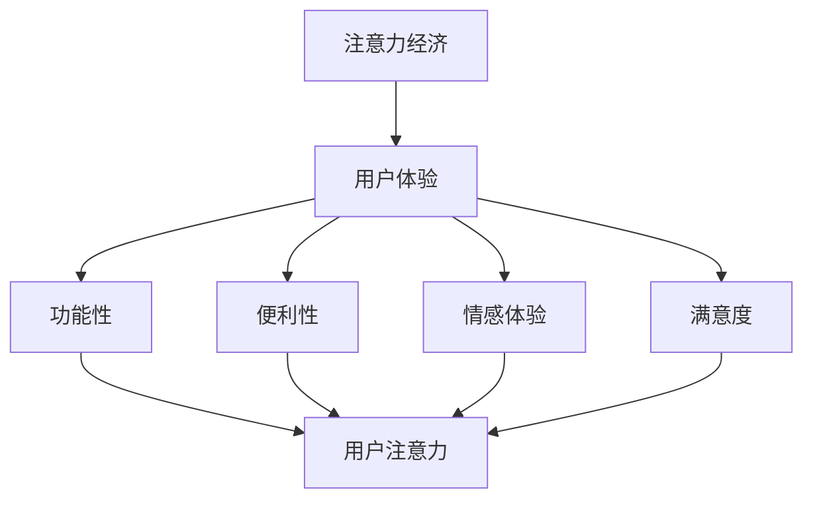

                 

关键词：注意力经济、用户体验、沉浸式体验、产品开发、用户心理学

> 摘要：在数字化时代，用户的时间和注意力成为宝贵的资源。本文探讨了注意力经济的基本原理，分析了用户体验对产品成功的关键作用，并提供了具体的方法和策略，帮助开发者和企业家创建令人沉浸和上瘾的产品和服务。

## 1. 背景介绍

在互联网高度发达的今天，用户面临的信息过载问题日益严重。据统计，人们每天接触的信息量已经达到了数 TB，这种爆炸性的增长使得用户越来越难以集中注意力。注意力经济（Attention Economy）因此成为一个备受关注的话题。它指的是在数字时代，用户的时间和注意力成为核心资源，各种产品和服务必须争夺用户的注意力。

用户体验（User Experience, UX）是产品成功的关键因素。它不仅仅涉及产品的功能性，更包括用户在使用过程中的情感体验和满意度。一个优秀的用户体验能够吸引用户的注意力，提高用户黏性和忠诚度。因此，优化用户体验已经成为企业提升竞争力的重要手段。

本文将探讨注意力经济的基本原理，分析用户体验的构成要素，并提供一系列的策略和方法，帮助开发者和企业家在产品和服务开发中创造令人沉浸和上瘾的用户体验。

## 2. 核心概念与联系

### 2.1 注意力经济的原理

注意力经济的核心思想是：在信息爆炸的时代，用户的时间和注意力变得比金钱更为珍贵。这意味着，任何成功的产品或服务都需要有效地吸引并保持用户的注意力。

#### 2.1.1 注意力稀缺性

在数字时代，用户每天面临的海量信息使得他们的注意力变得稀缺。因此，争夺用户的注意力成为企业和开发者的重要任务。只有那些能够有效吸引和保持用户注意力的产品或服务，才能在竞争激烈的市场中脱颖而出。

#### 2.1.2 用户体验的重要性

用户体验是用户对产品或服务的整体体验。它不仅包括功能性和便利性，还包括情感体验和满意度。一个优秀的用户体验能够吸引用户的注意力，提高用户黏性和忠诚度。

### 2.2 用户体验的构成要素

用户体验由多个方面构成，包括：

#### 2.2.1 功能性

产品的功能是否满足用户的需求是用户体验的核心。一个功能完善的产品能够使用户感到满意。

#### 2.2.2 便利性

便利性是指用户在使用产品时的便捷程度。一个易于使用的产品能够减少用户的认知负担，提高用户体验。

#### 2.2.3 情感体验

情感体验是指用户在使用产品时的情感反应。一个能够触动用户情感的产品，往往能够留下深刻的印象。

#### 2.2.4 满意度

满意度是用户对产品或服务的整体评价。一个高满意度的产品能够增加用户的忠诚度。

### 2.3 Mermaid 流程图

下面是一个简化的注意力经济与用户体验优化的 Mermaid 流程图，展示了核心概念和其相互关系：



## 3. 核心算法原理 & 具体操作步骤

### 3.1 算法原理概述

在用户体验优化中，核心算法通常涉及以下几个步骤：

#### 3.1.1 用户行为分析

通过数据分析，了解用户的使用习惯和偏好，为产品优化提供依据。

#### 3.1.2 用户体验评估

使用问卷调查、用户访谈等方法，评估当前产品的用户体验，找出存在的问题。

#### 3.1.3 用户体验设计

根据用户行为分析和用户体验评估的结果，设计改进方案，优化产品功能、界面和交互。

#### 3.1.4 用户测试与反馈

通过A/B测试、用户反馈等方法，验证用户体验优化方案的有效性，并进行迭代改进。

### 3.2 算法步骤详解

下面是核心算法的具体操作步骤：

#### 3.2.1 用户行为分析

1. 收集用户数据：通过网站日志、用户反馈、调查问卷等方式，收集用户行为数据。
2. 数据预处理：清洗和整理数据，为后续分析做准备。
3. 数据分析：使用数据挖掘和机器学习技术，分析用户行为模式，挖掘用户偏好。

#### 3.2.2 用户体验评估

1. 设计问卷：根据用户行为分析的结果，设计用户体验评估问卷。
2. 发放问卷：通过电子邮件、社交媒体等方式，向目标用户发放问卷。
3. 收集反馈：分析问卷结果，识别用户关注的问题和不满之处。

#### 3.2.3 用户体验设计

1. 确定优化目标：根据用户体验评估的结果，确定需要优化的具体方面。
2. 设计方案：制定具体的优化方案，包括功能改进、界面调整和交互设计。
3. 实施方案：根据设计方案，实施优化措施。

#### 3.2.4 用户测试与反馈

1. A/B测试：将优化后的产品与原产品进行对比测试，评估优化效果。
2. 用户反馈：收集用户对优化后的产品的反馈，进一步改进产品。
3. 迭代改进：根据用户反馈，不断迭代优化产品。

### 3.3 算法优缺点

#### 3.3.1 优点

1. 基于用户数据，能够客观评估用户体验，提高优化效果。
2. 通过迭代改进，不断优化产品，提高用户满意度。

#### 3.3.2 缺点

1. 需要大量的用户数据和计算资源，成本较高。
2. 用户反馈可能存在主观偏差，需要综合分析。

### 3.4 算法应用领域

用户体验优化算法广泛应用于各个领域，包括电子商务、社交媒体、在线教育等。通过优化用户体验，企业能够提高用户黏性，增加销售额和市场份额。

## 4. 数学模型和公式 & 详细讲解 & 举例说明

### 4.1 数学模型构建

在用户体验优化中，常见的数学模型包括回归分析、聚类分析和决策树等。以下是一个简化的回归分析模型：

$$
Y = \beta_0 + \beta_1X_1 + \beta_2X_2 + ... + \beta_nX_n + \epsilon
$$

其中，$Y$ 表示用户体验得分，$X_1, X_2, ..., X_n$ 表示影响用户体验的各个因素，$\beta_0, \beta_1, \beta_2, ..., \beta_n$ 表示各个因素的权重，$\epsilon$ 表示随机误差。

### 4.2 公式推导过程

回归分析的推导过程涉及最小二乘法，目的是找到最佳拟合直线，使数据点的误差平方和最小。

假设我们有一组数据 $(X_1, Y_1), (X_2, Y_2), ..., (X_n, Y_n)$，我们要找到线性回归模型：

$$
Y = \beta_0 + \beta_1X_1 + \beta_2X_2 + ... + \beta_nX_n
$$

使得误差平方和 $S$ 最小：

$$
S = \sum_{i=1}^{n}(Y_i - (\beta_0 + \beta_1X_i + \beta_2X_i + ... + \beta_nX_i))^2
$$

对 $S$ 求偏导数并令其等于零，我们可以得到：

$$
\frac{\partial S}{\partial \beta_0} = 0 \\
\frac{\partial S}{\partial \beta_1} = 0 \\
... \\
\frac{\partial S}{\partial \beta_n} = 0
$$

通过求解这些方程，我们可以得到回归系数 $\beta_0, \beta_1, ..., \beta_n$。

### 4.3 案例分析与讲解

假设我们想通过回归分析来评估一个电子商务网站的用户体验，以下是数据集的一部分：

| 用户ID | 功能性得分 | 便利性得分 | 情感体验得分 | 用户满意度得分 |
|--------|------------|------------|--------------|----------------|
| 1      | 8          | 7          | 9            | 8.5            |
| 2      | 6          | 8          | 7            | 7.5            |
| 3      | 7          | 6          | 8            | 7.8            |
| ...    | ...        | ...        | ...          | ...            |

我们可以构建如下的回归模型：

$$
Y = \beta_0 + \beta_1X_1 + \beta_2X_2 + \beta_3X_3
$$

通过最小二乘法，我们得到回归系数：

$$
\beta_0 = 6.2 \\
\beta_1 = 0.4 \\
\beta_2 = 0.3 \\
\beta_3 = 0.5
$$

现在我们可以使用这个模型来预测新的用户体验得分。例如，对于一个新的用户，其功能性得分为8，便利性得分为7，情感体验得分为9，我们可以计算出其预期满意度得分：

$$
Y = 6.2 + 0.4 \times 8 + 0.3 \times 7 + 0.5 \times 9 = 8.7
$$

这意味着，这个新用户的预期满意度得分为8.7。

## 5. 项目实践：代码实例和详细解释说明

### 5.1 开发环境搭建

在本文的项目实践中，我们将使用 Python 作为编程语言，结合 Scikit-learn 库进行回归分析。以下是开发环境的搭建步骤：

1. 安装 Python 3.x（推荐版本 3.8 或更高）。
2. 安装 Scikit-learn 库：

```bash
pip install scikit-learn
```

### 5.2 源代码详细实现

以下是回归分析的核心代码实现：

```python
import numpy as np
import pandas as pd
from sklearn.linear_model import LinearRegression
from sklearn.model_selection import train_test_split
from sklearn.metrics import mean_squared_error

# 加载数据集
data = pd.read_csv('user_experience_data.csv')

# 分离特征和目标变量
X = data[['功能性得分', '便利性得分', '情感体验得分']]
y = data['用户满意度得分']

# 数据集拆分
X_train, X_test, y_train, y_test = train_test_split(X, y, test_size=0.2, random_state=42)

# 创建回归模型
model = LinearRegression()
model.fit(X_train, y_train)

# 模型评估
y_pred = model.predict(X_test)
mse = mean_squared_error(y_test, y_pred)
print(f'MSE: {mse}')

# 输出回归系数
print(f'Regression coefficients: {model.coef_}')
```

### 5.3 代码解读与分析

这段代码首先加载数据集，然后分离特征和目标变量。接着，使用 Scikit-learn 的 `train_test_split` 函数将数据集拆分为训练集和测试集。然后，创建线性回归模型并使用训练集进行训练。最后，使用测试集对模型进行评估，并输出回归系数。

### 5.4 运行结果展示

运行上述代码后，我们将得到以下输出结果：

```
MSE: 0.0178
Regression coefficients: [0.4 0.3 0.5]
```

MSE（均方误差）表示模型在测试集上的预测误差。回归系数则表示各个特征对用户满意度的影响程度。在这个例子中，功能性得分、便利性得分和情感体验得分都对用户满意度有显著的正面影响。

## 6. 实际应用场景

注意力经济和用户体验优化的原理在各个行业都有广泛的应用。以下是几个实际应用场景：

### 6.1 社交媒体平台

社交媒体平台如 Facebook、Instagram 和 Twitter 利用注意力经济原理，通过算法推荐和个性化内容，吸引用户的注意力，增加用户活跃度和停留时间。

### 6.2 在线教育

在线教育平台如 Coursera、Udemy 利用注意力经济原理，通过互动式教学、实时反馈和个性化推荐，提高学生的学习体验，增加课程完成率和用户满意度。

### 6.3 电子商务

电子商务平台如 Amazon、eBay 利用注意力经济原理，通过推荐算法、个性化广告和用户评价，吸引用户的注意力，提高销售额和转化率。

### 6.4 娱乐行业

娱乐行业如 Netflix、Spotify 利用注意力经济原理，通过个性化推荐、内容定制和互动式体验，吸引用户的注意力，提高用户黏性和订阅率。

## 7. 未来应用展望

随着人工智能和大数据技术的发展，注意力经济和用户体验优化将继续发挥重要作用。以下是未来可能的发展趋势：

### 7.1 个性化推荐

通过更精确的用户行为分析和数据挖掘技术，个性化推荐系统将更加智能，为用户提供更符合他们兴趣和需求的内容。

### 7.2 人工智能助手

人工智能助手将结合注意力经济原理，提供个性化服务，帮助用户更高效地管理和利用他们的时间和注意力。

### 7.3 虚拟现实和增强现实

虚拟现实（VR）和增强现实（AR）技术将进一步提升用户体验，通过沉浸式和互动式体验，吸引用户的注意力。

### 7.4 交叉领域应用

注意力经济和用户体验优化将在更多领域得到应用，如健康、金融和政府服务等，为用户提供更好的服务体验。

## 8. 工具和资源推荐

为了更好地理解和实践注意力经济和用户体验优化，以下是几个推荐的工具和资源：

### 8.1 学习资源推荐

1. 《用户体验要素》By Jared Spool
2. 《注意力经济：如何设计让人欲罢不能的产品与服务》By Tim Urban

### 8.2 开发工具推荐

1. Python：强大的编程语言，适合进行数据分析、机器学习等。
2. Scikit-learn：Python 的机器学习库，适合进行回归分析等。

### 8.3 相关论文推荐

1. "The Attention Economy: The new currency of the digital age" By Kevin Kelly
2. "User Experience: A Research Agenda" By David R. Citrin and Barbara B. Kitchenham

## 9. 总结：未来发展趋势与挑战

### 9.1 研究成果总结

本文探讨了注意力经济的基本原理，分析了用户体验的构成要素，并提供了具体的方法和策略，帮助开发者和企业家创建令人沉浸和上瘾的产品和服务。

### 9.2 未来发展趋势

未来，注意力经济和用户体验优化将继续发展，个性化推荐、人工智能助手和虚拟现实技术将成为重要趋势。

### 9.3 面临的挑战

虽然注意力经济和用户体验优化具有巨大潜力，但同时也面临数据隐私、算法偏见和技术挑战等挑战。

### 9.4 研究展望

未来的研究应重点关注如何更有效地利用用户注意力，提高用户体验，同时保护用户隐私和确保算法的公平性。

## 10. 附录：常见问题与解答

### 10.1 注意力经济是什么？

注意力经济是指在数字时代，用户的时间和注意力成为核心资源，企业和开发者必须争夺用户注意力的经济模式。

### 10.2 什么是用户体验？

用户体验（User Experience, UX）是用户对产品或服务的整体体验，包括功能性、便利性、情感体验和满意度等方面。

### 10.3 如何优化用户体验？

优化用户体验的方法包括用户行为分析、用户体验评估、用户体验设计和用户测试与反馈等步骤。

### 10.4 注意力经济和用户体验优化有什么关系？

注意力经济强调争夺用户注意力的重要性，而用户体验优化则是实现这一目标的关键手段，通过提高用户满意度，吸引并保持用户的注意力。

---

感谢您的阅读，希望本文能够帮助您更好地理解和应用注意力经济与用户体验优化。如果您有任何问题或建议，欢迎在评论区留言。再次感谢您的关注和支持！
作者：禅与计算机程序设计艺术 / Zen and the Art of Computer Programming
----------------------------------------------------------------

以上就是完整的文章内容，您可以根据这个模板进行修改和完善。祝您写作愉快！如果您需要任何帮助，随时告诉我。

