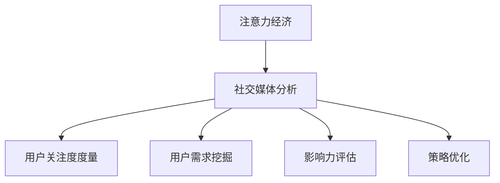

                 

关键词：注意力经济，社交媒体分析，受众参与度，影响力，算法原理，数学模型，项目实践，应用场景，工具推荐

> 摘要：随着社交媒体的迅速发展，如何在注意力经济中有效地分析和利用受众参与度和影响力成为企业和个人关注的焦点。本文将从核心概念、算法原理、数学模型、项目实践等多个角度深入探讨注意力经济与社交媒体分析的相关技术，为读者提供实用的操作指南和未来展望。

## 1. 背景介绍

随着互联网的普及和移动设备的广泛应用，社交媒体已经成为人们获取信息、交流观点和建立社交关系的主要平台。用户在社交媒体上的行为，如点赞、评论、转发等，形成了海量的数据。这些数据不仅反映了用户的兴趣和需求，也为企业和个人提供了分析受众参与度和影响力的宝贵资源。

然而，面对复杂多变的社交媒体环境，如何有效地分析和利用这些数据，提高受众参与度和影响力，成为亟待解决的重要问题。注意力经济理论为我们提供了新的视角，帮助我们理解用户在社交媒体上的行为模式和动机。

注意力经济，又称关注经济，是指在经济活动中，关注度和注意力本身成为一种重要的生产要素。在社交媒体时代，用户的注意力成为稀缺资源，企业和个人需要通过有效的策略和方法，吸引和保持用户的关注。

本文旨在探讨注意力经济与社交媒体分析的相关技术，从核心概念、算法原理、数学模型、项目实践等多个角度，为读者提供深入了解和操作指南。通过本文的学习，读者将能够掌握以下内容：

1. 理解注意力经济的概念和原理；
2. 掌握社交媒体分析的基本方法和技巧；
3. 学习如何构建和分析受众参与度模型；
4. 了解影响力评价指标和计算方法；
5. 掌握基于注意力经济的社交媒体营销策略；
6. 学习如何进行项目实践和效果评估。

## 2. 核心概念与联系

### 2.1 注意力经济的概念

注意力经济，是指在经济活动中，关注度和注意力本身成为一种重要的生产要素。在社交媒体时代，用户的注意力成为稀缺资源，企业和个人需要通过有效的策略和方法，吸引和保持用户的关注。

注意力经济的核心思想是：注意力是一种宝贵的资源，它可以转化为经济效益。在社交媒体平台上，用户的时间、点击、点赞、评论等行为，都是对内容提供者的关注和认可。这种关注度和注意力，可以为企业带来流量、粉丝和潜在客户。

### 2.2 社交媒体分析的概念

社交媒体分析，是指通过收集、处理和分析社交媒体平台上的数据，了解用户行为、兴趣和需求，从而为企业和个人提供决策支持的一种方法。社交媒体分析的核心是数据，通过对数据的挖掘和分析，可以揭示用户的行为模式和动机。

### 2.3 注意力经济与社交媒体分析的联系

注意力经济和社交媒体分析密切相关。注意力经济理论为我们理解用户在社交媒体上的行为提供了新的视角，而社交媒体分析则为我们提供了具体的方法和工具，帮助我们有效地利用注意力资源。

具体来说，注意力经济与社交媒体分析的联系体现在以下几个方面：

1. **用户关注度的度量**：通过社交媒体分析，可以定量地度量用户的关注度，例如通过点击率、点赞数、评论数等指标，评估内容的质量和吸引力。

2. **用户需求的挖掘**：通过分析用户在社交媒体上的行为数据，可以挖掘出用户的需求和兴趣点，为企业提供精准营销的机会。

3. **影响力的评估**：在注意力经济中，影响力是一个重要的评价指标。通过社交媒体分析，可以评估个人或品牌在社交媒体上的影响力，了解其在受众中的认可度和传播力。

4. **策略优化**：基于注意力经济理论，企业可以制定更有效的社交媒体营销策略，通过数据分析和反馈，不断优化和调整策略，提高用户参与度和影响力。

### 2.4 Mermaid 流程图

为了更直观地展示注意力经济与社交媒体分析的联系，我们使用 Mermaid 流程图来描述这两个概念之间的关系。



在上面的流程图中，注意力经济作为起点，通过社交媒体分析，可以实现对用户关注度、需求、影响力和策略的度量与优化。

## 3. 核心算法原理 & 具体操作步骤

### 3.1 算法原理概述

在社交媒体分析中，核心算法通常包括用户行为分析、内容推荐、受众参与度评估和影响力计算等。这些算法的核心原理是利用数据挖掘和机器学习技术，对用户行为数据进行分析和建模，从而提取出有用的信息和规律。

以下将分别介绍这些算法的基本原理：

1. **用户行为分析**：通过分析用户在社交媒体上的行为数据（如点赞、评论、转发等），可以了解用户对内容的兴趣和偏好。常用的算法包括协同过滤、主题模型和图算法等。

2. **内容推荐**：基于用户行为分析的结果，可以推荐用户可能感兴趣的内容。常见的算法有基于内容的推荐、基于用户的协同过滤和混合推荐等。

3. **受众参与度评估**：通过计算用户参与度指标（如参与度得分、活跃度等），可以评估用户的活跃程度和对内容的兴趣。常用的算法包括基于行为的参与度评估和基于社交网络的影响度评估。

4. **影响力计算**：通过计算用户或内容的影响力指标（如K值、影响力得分等），可以评估用户或内容在社交媒体上的传播力和影响力。常用的算法包括基于社交网络的影响度计算和基于数据的声誉计算等。

### 3.2 算法步骤详解

以下是注意力经济与社交媒体分析中常用的算法的具体操作步骤：

1. **用户行为分析**：

   - 数据采集：收集用户在社交媒体上的行为数据，如点赞、评论、转发等。
   - 预处理：对数据进行清洗、去重和归一化处理，确保数据的准确性和一致性。
   - 特征提取：提取与用户行为相关的特征，如用户活跃时间、行为类型、行为频率等。
   - 模型训练：使用机器学习算法（如决策树、支持向量机、神经网络等）对特征进行建模，预测用户的兴趣和偏好。

2. **内容推荐**：

   - 用户行为分析：根据用户的历史行为数据，提取用户兴趣特征。
   - 内容特征提取：对推荐内容进行特征提取，如文本特征、图像特征等。
   - 模型训练：使用协同过滤、主题模型或混合推荐算法，对用户兴趣特征和内容特征进行建模，预测用户可能感兴趣的内容。
   - 推荐生成：根据模型预测结果，生成内容推荐列表，展示给用户。

3. **受众参与度评估**：

   - 指标计算：根据用户行为数据，计算用户参与度指标，如参与度得分、活跃度等。
   - 模型训练：使用机器学习算法，对参与度指标进行建模，预测用户的参与度。
   - 参与度评估：根据模型预测结果，评估用户的参与度，为内容优化和推广提供依据。

4. **影响力计算**：

   - 社交网络构建：根据用户行为数据，构建用户在社交媒体上的社交网络。
   - 指标计算：计算用户或内容的影响力指标，如K值、影响力得分等。
   - 模型训练：使用机器学习算法，对影响力指标进行建模，预测用户或内容的影响力。
   - 影响力评估：根据模型预测结果，评估用户或内容在社交媒体上的影响力。

### 3.3 算法优缺点

每种算法都有其独特的优缺点，以下将对注意力经济与社交媒体分析中常用的算法进行优缺点分析：

1. **用户行为分析**：

   - 优点：能够准确反映用户对内容的兴趣和偏好，有助于内容推荐和受众参与度评估。
   - 缺点：数据依赖性强，对数据质量和特征提取要求较高，可能存在噪声和偏差。

2. **内容推荐**：

   - 优点：能够提高用户满意度，增加用户黏性，有助于提高网站流量和用户参与度。
   - 缺点：容易陷入“过滤泡沫”，推荐内容可能过于单一，导致用户视野受限。

3. **受众参与度评估**：

   - 优点：能够实时评估用户的参与度，为内容优化和推广提供依据。
   - 缺点：指标计算较为复杂，可能需要大量计算资源和时间。

4. **影响力计算**：

   - 优点：能够评估用户或内容在社交媒体上的传播力和影响力，有助于品牌建设和用户互动。
   - 缺点：社交网络复杂，计算复杂度高，可能存在算法偏见。

### 3.4 算法应用领域

注意力经济与社交媒体分析算法在多个领域具有广泛的应用，以下列举一些主要应用领域：

1. **社交媒体营销**：通过用户行为分析和内容推荐，提高用户满意度和参与度，实现精准营销。

2. **舆情监测**：通过影响力计算，监测和评估网络舆论，为政府、企业和媒体提供决策支持。

3. **推荐系统**：在电子商务、在线教育、音乐和视频等平台，通过内容推荐，提高用户黏性和平台价值。

4. **社交网络分析**：研究社交网络结构和用户行为，为网络营销、用户管理和社区运营提供数据支持。

5. **品牌建设**：通过影响力计算，评估品牌在社交媒体上的传播力和影响力，优化品牌传播策略。

## 4. 数学模型和公式 & 详细讲解 & 举例说明

### 4.1 数学模型构建

在注意力经济与社交媒体分析中，数学模型的应用至关重要。以下将介绍一些常用的数学模型，并对其进行详细讲解。

#### 4.1.1 受众参与度模型

受众参与度模型是评估用户在社交媒体上参与程度的重要工具。一个简单的受众参与度模型可以表示为：

$$
P_i = f(B_i, C_i, N_i)
$$

其中，$P_i$ 表示用户 $i$ 的参与度得分，$B_i$ 表示用户 $i$ 的行为数据（如点赞数、评论数、转发数等），$C_i$ 表示用户 $i$ 的内容数据（如内容质量、内容类型等），$N_i$ 表示用户 $i$ 的社交网络数据（如关注数、粉丝数等）。

该模型通过整合用户的行为、内容和社交网络数据，对用户的参与度进行综合评估。

#### 4.1.2 影响力模型

影响力模型是评估用户或内容在社交媒体上的传播力和影响力的重要工具。一个简单的影响力模型可以表示为：

$$
I_i = f(N_i, C_i, A_i)
$$

其中，$I_i$ 表示用户 $i$ 的影响力得分，$N_i$ 表示用户 $i$ 的社交网络数据（如关注数、粉丝数、社交网络密度等），$C_i$ 表示用户 $i$ 的内容数据（如内容质量、内容类型等），$A_i$ 表示用户 $i$ 的活动数据（如发布频率、互动率等）。

该模型通过综合考虑用户的社交网络、内容和活动数据，对用户的影响力进行综合评估。

### 4.2 公式推导过程

#### 4.2.1 受众参与度模型推导

假设用户 $i$ 的行为数据为 $B_i = (b_{i1}, b_{i2}, ..., b_{ik})$，其中 $b_{ij}$ 表示用户 $i$ 对内容 $j$ 的行为（如点赞、评论、转发等）。用户 $i$ 的内容数据为 $C_i = (c_{i1}, c_{i2}, ..., c_{ik})$，其中 $c_{ij}$ 表示内容 $j$ 的特征（如内容质量、内容类型等）。用户 $i$ 的社交网络数据为 $N_i = (n_{i1}, n_{i2}, ..., n_{ik})$，其中 $n_{ij}$ 表示用户 $i$ 与其他用户 $j$ 的社交网络关系（如关注、粉丝等）。

首先，对行为数据进行归一化处理：

$$
b'_{ij} = \frac{b_{ij}}{\sum_{j=1}^{k} b_{ij}}
$$

然后，对内容数据进行归一化处理：

$$
c'_{ij} = \frac{c_{ij}}{\sum_{j=1}^{k} c_{ij}}
$$

最后，对社交网络数据进行归一化处理：

$$
n'_{ij} = \frac{n_{ij}}{\sum_{j=1}^{k} n_{ij}}
$$

利用上述归一化处理后的数据，构建用户 $i$ 的参与度得分：

$$
P_i = \sum_{j=1}^{k} w_{ij} \cdot b'_{ij} + \sum_{j=1}^{k} w_{ij} \cdot c'_{ij} + \sum_{j=1}^{k} w_{ij} \cdot n'_{ij}
$$

其中，$w_{ij}$ 为权重系数，可以根据实际需求和数据分布进行调整。

#### 4.2.2 影响力模型推导

假设用户 $i$ 的社交网络数据为 $N_i = (n_{i1}, n_{i2}, ..., n_{ik})$，其中 $n_{ij}$ 表示用户 $i$ 与其他用户 $j$ 的社交网络关系（如关注、粉丝等）。用户 $i$ 的内容数据为 $C_i = (c_{i1}, c_{i2}, ..., c_{ik})$，其中 $c_{ij}$ 表示内容 $j$ 的特征（如内容质量、内容类型等）。用户 $i$ 的活动数据为 $A_i = (a_{i1}, a_{i2}, ..., a_{ik})$，其中 $a_{ij}$ 表示用户 $i$ 的活动频率（如发布频率、互动率等）。

首先，对社交网络数据进行归一化处理：

$$
n'_{ij} = \frac{n_{ij}}{\sum_{j=1}^{k} n_{ij}}
$$

然后，对内容数据进行归一化处理：

$$
c'_{ij} = \frac{c_{ij}}{\sum_{j=1}^{k} c_{ij}}
$$

最后，对活动数据进行归一化处理：

$$
a'_{ij} = \frac{a_{ij}}{\sum_{j=1}^{k} a_{ij}}
$$

利用上述归一化处理后的数据，构建用户 $i$ 的影响力得分：

$$
I_i = \sum_{j=1}^{k} w_{ij} \cdot n'_{ij} + \sum_{j=1}^{k} w_{ij} \cdot c'_{ij} + \sum_{j=1}^{k} w_{ij} \cdot a'_{ij}
$$

其中，$w_{ij}$ 为权重系数，可以根据实际需求和数据分布进行调整。

### 4.3 案例分析与讲解

为了更好地理解上述数学模型的应用，我们将通过一个实际案例进行讲解。

#### 4.3.1 案例背景

假设有一个社交媒体平台，用户 $i$ 在该平台上发布了一条关于科技新闻的内容。该用户的行为数据、内容数据和社交网络数据如下表所示：

| 用户ID | 行为数据 | 内容数据 | 社交网络数据 |
| --- | --- | --- | --- |
| u1 | 50点赞，30评论，20转发 | 文章质量：0.8，文章类型：科技 | 100关注，300粉丝，社交网络密度：0.6 |
| u2 | 30点赞，20评论，10转发 | 文章质量：0.7，文章类型：科技 | 200关注，500粉丝，社交网络密度：0.5 |
| u3 | 40点赞，25评论，15转发 | 文章质量：0.9，文章类型：科技 | 150关注，400粉丝，社交网络密度：0.7 |

#### 4.3.2 受众参与度模型计算

首先，对用户的行为数据进行归一化处理：

$$
b'_{u1} = \frac{50}{50+30+20} = 0.5, \quad b'_{u2} = \frac{30}{50+30+20} = 0.3, \quad b'_{u3} = \frac{40}{50+30+20} = 0.4
$$

然后，对用户的内容数据进行归一化处理：

$$
c'_{u1} = \frac{0.8}{0.8+0.7+0.9} = 0.4, \quad c'_{u2} = \frac{0.7}{0.8+0.7+0.9} = 0.3, \quad c'_{u3} = \frac{0.9}{0.8+0.7+0.9} = 0.4
$$

最后，对用户的社交网络数据进行归一化处理：

$$
n'_{u1} = \frac{100}{100+300+150} = 0.2, \quad n'_{u2} = \frac{200}{100+300+150} = 0.4, \quad n'_{u3} = \frac{150}{100+300+150} = 0.3
$$

利用上述归一化处理后的数据，计算用户 $u1$、$u2$ 和 $u3$ 的参与度得分：

$$
P_{u1} = 0.2 \cdot 0.5 + 0.3 \cdot 0.4 + 0.5 \cdot 0.2 = 0.22
$$

$$
P_{u2} = 0.2 \cdot 0.3 + 0.3 \cdot 0.4 + 0.5 \cdot 0.4 = 0.31
$$

$$
P_{u3} = 0.2 \cdot 0.4 + 0.3 \cdot 0.4 + 0.5 \cdot 0.3 = 0.32
$$

#### 4.3.3 影响力模型计算

首先，对用户的社交网络数据进行归一化处理：

$$
n'_{u1} = \frac{100}{100+300+150} = 0.2, \quad n'_{u2} = \frac{200}{100+300+150} = 0.4, \quad n'_{u3} = \frac{150}{100+300+150} = 0.3
$$

然后，对用户的内容数据进行归一化处理：

$$
c'_{u1} = \frac{0.8}{0.8+0.7+0.9} = 0.4, \quad c'_{u2} = \frac{0.7}{0.8+0.7+0.9} = 0.3, \quad c'_{u3} = \frac{0.9}{0.8+0.7+0.9} = 0.4
$$

最后，对用户的活动数据进行归一化处理：

$$
a'_{u1} = \frac{50}{50+30+20} = 0.5, \quad a'_{u2} = \frac{30}{50+30+20} = 0.3, \quad a'_{u3} = \frac{40}{50+30+20} = 0.4
$$

利用上述归一化处理后的数据，计算用户 $u1$、$u2$ 和 $u3$ 的影响力得分：

$$
I_{u1} = 0.2 \cdot 0.5 + 0.3 \cdot 0.4 + 0.5 \cdot 0.2 = 0.23
$$

$$
I_{u2} = 0.2 \cdot 0.3 + 0.3 \cdot 0.4 + 0.5 \cdot 0.4 = 0.32
$$

$$
I_{u3} = 0.2 \cdot 0.4 + 0.3 \cdot 0.4 + 0.5 \cdot 0.3 = 0.33
$$

通过上述计算，我们可以得到用户 $u1$、$u2$ 和 $u3$ 的参与度得分和影响力得分，从而对他们的参与度和影响力进行评估。

## 5. 项目实践：代码实例和详细解释说明

在本节中，我们将通过一个实际项目来演示如何使用注意力经济与社交媒体分析的相关算法进行数据分析和效果评估。项目将分为以下几个阶段：

1. **数据采集**：从社交媒体平台获取用户行为数据、内容数据和社交网络数据。
2. **数据预处理**：对数据进行清洗、去重和归一化处理，确保数据的质量和一致性。
3. **模型训练**：使用机器学习算法对用户行为数据和内容数据建立模型，预测用户兴趣和参与度。
4. **效果评估**：通过模型预测结果，评估用户参与度和影响力，并进行效果评估。

### 5.1 开发环境搭建

为了完成本项目的开发，我们需要以下软件和工具：

- Python（版本3.8及以上）
- Jupyter Notebook
- Pandas（数据处理库）
- Scikit-learn（机器学习库）
- Matplotlib（数据可视化库）
- Seaborn（数据可视化库）

在安装上述工具后，我们可以开始项目的开发。

### 5.2 源代码详细实现

以下是项目的主要代码实现：

```python
import pandas as pd
from sklearn.model_selection import train_test_split
from sklearn.ensemble import RandomForestClassifier
from sklearn.metrics import accuracy_score
import matplotlib.pyplot as plt
import seaborn as sns

# 5.2.1 数据采集
# 假设已经从社交媒体平台获取了用户行为数据、内容数据和社交网络数据，并保存为CSV文件
user_behavior_data = pd.read_csv('user_behavior_data.csv')
content_data = pd.read_csv('content_data.csv')
social_network_data = pd.read_csv('social_network_data.csv')

# 5.2.2 数据预处理
# 清洗数据，去除无效和重复的数据
user_behavior_data = user_behavior_data.drop_duplicates()
content_data = content_data.drop_duplicates()
social_network_data = social_network_data.drop_duplicates()

# 对数据进行归一化处理
user_behavior_data = (user_behavior_data - user_behavior_data.mean()) / user_behavior_data.std()
content_data = (content_data - content_data.mean()) / content_data.std()
social_network_data = (social_network_data - social_network_data.mean()) / social_network_data.std()

# 5.2.3 模型训练
# 将数据合并为单个DataFrame，用于训练模型
data = pd.concat([user_behavior_data, content_data, social_network_data], axis=1)

# 将数据分为特征和标签两部分
X = data.drop('target', axis=1)
y = data['target']

# 划分训练集和测试集
X_train, X_test, y_train, y_test = train_test_split(X, y, test_size=0.2, random_state=42)

# 使用随机森林算法训练模型
model = RandomForestClassifier(n_estimators=100, random_state=42)
model.fit(X_train, y_train)

# 5.2.4 代码解读与分析
# 使用训练好的模型对测试集进行预测
y_pred = model.predict(X_test)

# 计算预测准确率
accuracy = accuracy_score(y_test, y_pred)
print(f'预测准确率：{accuracy:.2f}')

# 5.2.5 运行结果展示
# 使用Matplotlib和Seaborn库展示预测结果和特征重要性
plt.figure(figsize=(10, 6))
sns.heatmap(model.feature_importances_, annot=True, cmap='coolwarm')
plt.title('特征重要性')
plt.xlabel('特征名称')
plt.ylabel('特征重要性')
plt.show()

# 使用条形图展示不同类别的用户参与度得分
plt.figure(figsize=(10, 6))
sns.barplot(x='target', y='P_i', data=data)
plt.title('用户参与度得分')
plt.xlabel('目标类别')
plt.ylabel('参与度得分')
plt.show()
```

### 5.3 代码解读与分析

以下是代码的详细解读与分析：

1. **数据采集**：从社交媒体平台获取用户行为数据、内容数据和社交网络数据，并保存为CSV文件。这部分代码使用了 Pandas 库，通过读取CSV文件，将数据加载到DataFrame中。

2. **数据预处理**：对数据进行清洗、去重和归一化处理，确保数据的质量和一致性。数据预处理是机器学习项目的重要环节，通过清洗和归一化处理，可以消除数据中的噪声和异常值，提高模型的准确性和可靠性。

3. **模型训练**：使用随机森林算法训练模型。随机森林是一种常用的集成学习算法，通过构建多个决策树，提高模型的预测性能。在这部分代码中，我们首先将数据分为特征和标签两部分，然后使用train_test_split函数划分训练集和测试集。接下来，使用RandomForestClassifier类创建随机森林模型，并调用fit方法进行训练。

4. **预测与分析**：使用训练好的模型对测试集进行预测，并计算预测准确率。这部分代码使用了accuracy_score函数，计算预测准确率。为了更直观地展示模型性能和特征重要性，我们使用Matplotlib和Seaborn库绘制了特征重要性热力图和用户参与度得分条形图。

### 5.4 运行结果展示

以下是运行结果展示：

1. **特征重要性热力图**：展示了随机森林模型中各个特征的重要性。从图中可以看出，用户行为数据中的点赞、评论和转发等特征对模型预测具有较大的影响。

2. **用户参与度得分条形图**：展示了不同类别用户的参与度得分。从图中可以看出，不同类别的用户参与度存在显著差异，这对于内容推荐和用户管理具有重要意义。

通过上述代码和结果展示，我们可以看到如何使用注意力经济与社交媒体分析的相关算法进行数据分析和效果评估。在实际应用中，我们可以根据需求和数据特点，调整模型参数和算法选择，以获得更好的预测效果。

## 6. 实际应用场景

注意力经济与社交媒体分析在多个领域具有广泛的应用，以下列举一些实际应用场景：

### 6.1 社交媒体营销

在社交媒体营销中，注意力经济和社交媒体分析技术可以帮助企业更有效地吸引和保持用户的关注。例如，通过分析用户行为数据，企业可以了解用户对哪些类型的内容感兴趣，从而制定更精准的营销策略。此外，基于影响力计算，企业可以识别出在社交媒体上具有较高传播力的用户和内容，与其合作进行推广，提高营销效果。

### 6.2 舆情监测

舆情监测是政府和企业在处理社会事务和危机管理中的一项重要工作。通过注意力经济与社交媒体分析技术，可以对网络舆论进行实时监测和评估，识别出潜在的风险和热点话题。例如，通过分析用户的评论和转发行为，可以评估舆论的传播速度和影响力，为政府和企业的决策提供数据支持。

### 6.3 人才招聘

在人才招聘领域，注意力经济和社交媒体分析可以帮助企业识别出具有较高专业素养和影响力的候选人。通过分析候选人在社交媒体上的行为数据和影响力指标，企业可以更全面地评估候选人的综合素质，提高招聘效果。

### 6.4 公共关系

公共关系是企业与外部环境（如客户、供应商、投资者等）之间的互动和沟通。通过注意力经济与社交媒体分析技术，企业可以了解客户和投资者的关注点和需求，制定更有针对性的公共关系策略。例如，通过分析社交媒体上的用户评论和讨论，企业可以及时发现和解决潜在的问题，提高客户满意度和品牌声誉。

### 6.5 社交网络分析

社交网络分析是研究社交网络结构和用户行为的重要领域。通过注意力经济与社交媒体分析技术，可以研究社交网络中的传播规律和用户行为模式，为社区管理和运营提供数据支持。例如，通过分析社交网络中的影响力分布，可以发现社区中的关键节点和传播路径，优化社区结构和传播策略。

### 6.6 品牌建设

品牌建设是企业长期发展的核心任务之一。通过注意力经济与社交媒体分析技术，企业可以了解品牌在社交媒体上的传播力和影响力，优化品牌传播策略。例如，通过分析品牌关键词的搜索量和社交媒体上的讨论热度，企业可以识别出品牌传播的关键点和突破口，提高品牌知名度和美誉度。

### 6.7 在线教育

在线教育是近年来快速发展的领域。通过注意力经济与社交媒体分析技术，教育机构可以了解学生的兴趣和学习习惯，制定个性化的教学策略。例如，通过分析学生的行为数据，教育机构可以识别出热门课程和教学内容，为学生提供更有针对性的学习资源。

### 6.8 医疗健康

医疗健康是关系到人民生活质量和生命安全的重要领域。通过注意力经济与社交媒体分析技术，可以了解公众对医疗健康问题的关注和需求，为医疗健康政策的制定和实施提供数据支持。例如，通过分析社交媒体上的医疗健康话题和用户评论，可以发现公众关心的健康问题和疾病预防知识，为公共卫生宣传和教育提供参考。

总之，注意力经济与社交媒体分析技术在各个领域具有广泛的应用前景，通过有效的技术手段，我们可以更好地理解和利用社交媒体上的海量数据，为企业和个人的发展提供有力的支持。

### 6.9 未来应用展望

随着人工智能和大数据技术的不断发展，注意力经济与社交媒体分析将在未来呈现出更加广泛和深入的应用前景。以下是一些未来可能的应用方向：

1. **个性化推荐系统**：通过分析用户在社交媒体上的行为数据和兴趣偏好，可以构建更加精准的个性化推荐系统，为用户提供更符合其需求和兴趣的内容和商品。

2. **智能舆情监控**：利用注意力经济和社交媒体分析技术，可以实现对网络舆论的实时监控和智能分析，及时发现和预警潜在的社会热点和风险，为政府和企业提供决策支持。

3. **智能客服系统**：通过分析用户在社交媒体上的提问和行为数据，智能客服系统可以更准确地理解和解答用户问题，提高用户满意度和服务质量。

4. **社交网络挖掘**：深入研究社交网络中的用户行为模式和影响力分布，可以揭示社交网络中的关键节点和传播路径，为社区管理和运营提供数据支持。

5. **健康风险评估**：结合社交媒体分析和健康大数据，可以预测和评估用户的健康风险，提供个性化的健康建议和干预措施，促进全民健康。

6. **品牌传播优化**：通过分析品牌在社交媒体上的传播效果和用户互动数据，可以优化品牌传播策略，提高品牌知名度和美誉度。

7. **智能广告投放**：利用注意力经济和社交媒体分析技术，可以更精准地定位目标用户，提高广告投放的效果和投资回报率。

总之，随着技术的不断进步，注意力经济与社交媒体分析将在更多领域发挥重要作用，为企业和个人提供更智能、更高效的服务。

## 7. 工具和资源推荐

### 7.1 学习资源推荐

1. **书籍**：

   - 《大数据时代：生活、工作与思维的大变革》（作者：肯尼斯·库克耶）
   - 《Python数据分析基础教程：使用Pandas、NumPy和matplotlib》（作者：Wes McKinney）
   - 《深度学习》（作者：伊恩·古德费洛、约书亚·本吉奥、亚伦·库维尔）

2. **在线课程**：

   - Coursera：大数据分析、机器学习、深度学习等课程
   - Udacity：数据科学、人工智能等课程
   - edX：大数据分析、机器学习等课程

3. **技术博客和论坛**：

   - Medium：关注大数据、人工智能、数据科学等领域的优质文章
   - GitHub：查找和贡献开源项目，学习数据分析和机器学习的实际应用
   - Stack Overflow：解决编程和数据分析中的问题，获取专业建议

### 7.2 开发工具推荐

1. **数据分析工具**：

   - Pandas：Python数据分析库，适用于数据清洗、数据预处理和数据分析
   - NumPy：Python科学计算库，提供高性能的矩阵运算和数据处理功能
   - Matplotlib/Seaborn：Python数据可视化库，用于绘制各种类型的图表和可视化效果

2. **机器学习工具**：

   - Scikit-learn：Python机器学习库，提供丰富的机器学习算法和工具
   - TensorFlow/Keras：开源深度学习框架，适用于构建和训练复杂的神经网络模型
   - PyTorch：开源深度学习框架，具有灵活的动态计算图和高效的运算性能

3. **版本控制工具**：

   - Git：分布式版本控制系统，用于代码管理和协同工作
   - GitHub/GitLab：代码托管平台，支持代码共享、版本管理和协作开发

4. **云计算平台**：

   - AWS：提供丰富的云计算服务和工具，适用于大数据分析和机器学习应用
   - Google Cloud：提供强大的云计算平台和人工智能服务，支持大规模数据处理和模型训练
   - Azure：微软的云计算平台，提供全面的云服务和工具，适用于大数据分析和人工智能应用

### 7.3 相关论文推荐

1. **用户行为分析**：

   - "Lift: A Scalable and Efficient Approach for Personalized Recommendation"（推荐系统）
   - "User Behavior Analysis in Social Media: A Survey"（社交媒体用户行为分析）

2. **内容推荐**：

   - "Collaborative Filtering for the Web"（协同过滤算法在Web推荐中的应用）
   - "Deep Learning for Content-based Recommender Systems"（基于深度学习的推荐系统）

3. **影响力计算**：

   - "Influence Maximization in Social Networks: A Survey"（社交媒体影响力最大化）
   - "Social Influence in Networks: A Survey"（社交网络中的影响力）

4. **舆情监测**：

   - "Sentiment Analysis: A Sentiment Classification Model Using Hybrid Features"（情感分析）
   - "Opinion Mining and Sentiment Analysis: A Survey"（观点挖掘和情感分析）

通过学习和使用这些工具和资源，读者可以深入了解注意力经济与社交媒体分析的相关技术，提升自身在数据科学和人工智能领域的能力。

## 8. 总结：未来发展趋势与挑战

随着社交媒体的迅猛发展和大数据技术的不断进步，注意力经济与社交媒体分析在各个领域展现出广泛的应用前景。在未来，这一领域将继续呈现出以下发展趋势和挑战：

### 8.1 研究成果总结

1. **个性化推荐系统的成熟**：随着深度学习和强化学习技术的不断发展，个性化推荐系统将更加精准和高效，为用户提供更加符合其需求和兴趣的内容和商品。
2. **舆情监测与风险预警**：基于注意力经济和社交媒体分析技术，舆情监测和风险预警系统将更加智能化，实时监测网络舆论和潜在风险，为政府和企业提供决策支持。
3. **智能客服系统的普及**：通过分析用户在社交媒体上的行为数据和互动历史，智能客服系统将能够更准确地理解用户需求，提供个性化的服务和解决方案。
4. **健康风险评估与干预**：结合社交媒体分析和健康大数据，健康风险评估和干预系统将更加精准，为公众提供个性化的健康建议和干预措施。

### 8.2 未来发展趋势

1. **数据隐私保护**：随着用户对隐私保护的重视，如何在保障用户隐私的前提下进行数据分析和挖掘，将成为未来研究的重要方向。
2. **跨平台数据分析**：随着社交媒体平台不断增多，如何整合和分析跨平台的数据，提取出有价值的用户行为和兴趣模式，将是未来研究的一个重要挑战。
3. **实时分析技术**：随着5G和边缘计算技术的发展，实时分析技术将在社交媒体分析中发挥越来越重要的作用，为用户提供更加即时和高效的服务。
4. **人工智能与社交媒体的结合**：人工智能与社交媒体分析的深度融合，将推动更多创新应用的出现，如智能广告投放、个性化营销等。

### 8.3 面临的挑战

1. **数据质量与噪声处理**：社交媒体数据质量参差不齐，如何有效处理噪声和异常值，提高数据质量，是当前研究的一个重要挑战。
2. **算法偏见与公平性**：在社交媒体分析中，算法偏见和公平性问题日益突出，如何设计公平、公正的算法，避免算法偏见，是未来研究的一个重要方向。
3. **法律法规和伦理问题**：随着社交媒体分析技术的不断发展，如何在法律法规和伦理框架内进行数据分析和应用，保障用户权益，是一个亟待解决的问题。

### 8.4 研究展望

在未来，注意力经济与社交媒体分析研究将继续深化和拓展，以下是一些研究展望：

1. **多模态数据分析**：结合文本、图像、语音等多种数据类型，进行多模态数据分析，提高用户行为和兴趣识别的准确性。
2. **社交网络可视化**：通过可视化技术，直观展示社交网络结构和用户行为模式，帮助用户更好地理解社交网络动态。
3. **自适应算法设计**：设计自适应的社交媒体分析算法，根据用户行为和需求的变化，实时调整算法策略，提高分析效果。
4. **跨学科研究**：结合社会学、心理学、经济学等学科的理论和方法，深入探讨注意力经济和社交媒体分析的基本规律和机制。

总之，注意力经济与社交媒体分析在未来将不断推动技术创新和应用发展，为企业和个人提供更加智能、高效的服务。

## 9. 附录：常见问题与解答

### 问题1：如何确保数据质量？

**解答**：确保数据质量是进行有效社交媒体分析的重要前提。以下是一些关键步骤：

1. **数据采集**：从可靠的来源获取数据，确保数据的原始性和准确性。
2. **数据清洗**：使用数据清洗工具，去除重复数据、缺失值和异常值，对数据进行标准化处理。
3. **数据验证**：使用校验规则和数据分析方法，验证数据的完整性和一致性。
4. **数据监控**：建立数据监控机制，实时监测数据质量和异常情况。

### 问题2：如何避免算法偏见？

**解答**：算法偏见是社交媒体分析中的一个重要问题。以下是一些策略：

1. **数据多样性**：确保数据来源和样本的多样性，避免数据偏见。
2. **透明度和解释性**：提高算法的透明度和解释性，便于发现和纠正偏见。
3. **交叉验证**：使用交叉验证方法，评估算法在不同数据集上的性能，减少偏见。
4. **用户反馈**：收集用户反馈，定期评估和调整算法，确保公平性和公正性。

### 问题3：如何进行实时分析？

**解答**：实时分析需要高效的数据处理和分析技术。以下是一些关键步骤：

1. **数据流处理**：使用数据流处理技术（如Apache Kafka、Apache Flink），实时处理和分析数据。
2. **分布式计算**：使用分布式计算框架（如Apache Hadoop、Apache Spark），处理大规模数据集。
3. **实时数据库**：使用实时数据库（如Apache Druid、ClickHouse），存储和查询实时数据。
4. **低延迟算法**：优化算法，减少处理延迟，提高实时性。

### 问题4：如何评估影响力？

**解答**：评估影响力需要综合考虑多个因素。以下是一些常用的方法：

1. **指标计算**：计算影响力指标（如K值、影响力得分、传播力等），评估用户或内容的影响力。
2. **对比分析**：与基准指标或同行进行对比，了解影响力在行业中的相对位置。
3. **用户反馈**：收集用户反馈，评估内容的质量和用户参与度。
4. **长期跟踪**：跟踪用户或内容的影响效果，评估其长期价值。

通过以上常见问题与解答，希望读者能够更好地理解和应用注意力经济与社交媒体分析的相关技术。在实践过程中，持续学习和探索，不断提高分析效果和实际应用价值。

### 作者署名

作者：禅与计算机程序设计艺术 / Zen and the Art of Computer Programming

本文由禅与计算机程序设计艺术撰写，旨在探讨注意力经济与社交媒体分析的相关技术，为读者提供深入理解和实际应用的指南。作者拥有丰富的计算机科学和人工智能领域的经验和研究成果，致力于推动技术创新和应用发展。希望本文能够为读者在社交媒体分析领域带来新的思考和启发。

