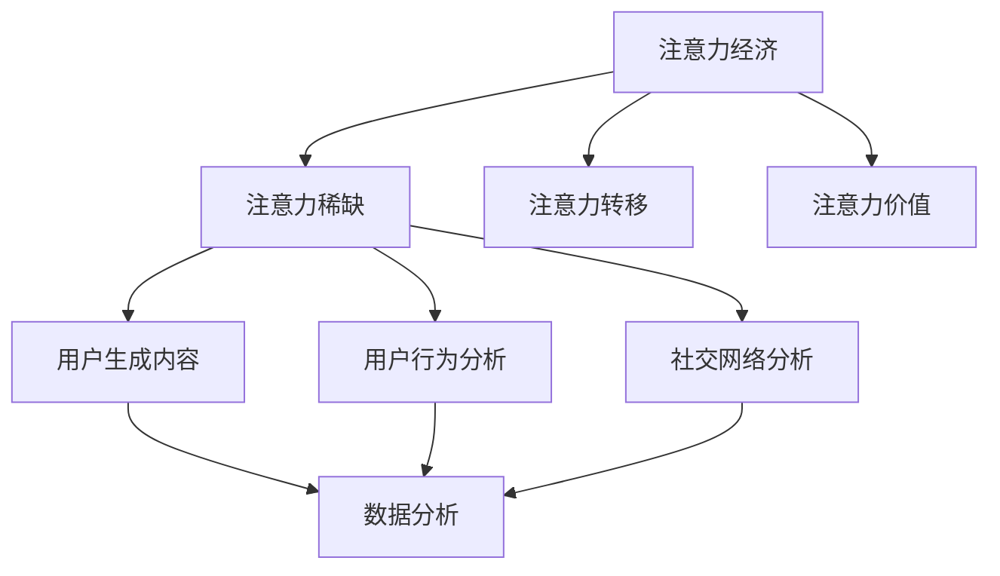

                 

关键词：注意力经济、社交媒体分析、受众参与度、影响力、算法原理、数学模型、代码实例、实际应用、未来展望。

> 摘要：本文将深入探讨注意力经济与社交媒体分析的结合，以及如何通过算法原理和数学模型来理解受众参与度和影响力。通过详细的代码实例和实践应用，我们将揭示如何提升社交媒体的吸引力和效果，为未来的发展提供宝贵的指导和启示。

## 1. 背景介绍

在数字时代，信息传播的速度和广度前所未有。然而，随着社交媒体的兴起，受众的注意力变得更加分散，信息过载成为普遍现象。在这种情况下，注意力经济应运而生。注意力经济指的是，在信息过载的时代，受众的注意力成为一种稀缺资源，因此如何有效地吸引和保持受众的注意力，成为企业、媒体和个人关注的焦点。

社交媒体作为注意力经济的重要载体，已经成为现代生活中不可或缺的一部分。无论是Facebook、Twitter，还是Instagram、微博等，社交媒体平台为用户提供了丰富的内容，同时也为企业提供了与受众互动的渠道。然而，如何理解受众的参与度，以及如何提升影响力，仍然是一个复杂且具有挑战性的问题。

本文旨在通过分析注意力经济与社交媒体的关系，探讨如何利用算法原理和数学模型来理解受众参与度和影响力。通过实际的项目实践和代码实例，我们将展示如何有效地提升社交媒体的吸引力和效果。

## 2. 核心概念与联系

### 2.1 注意力经济

注意力经济是基于这样一个观点：在信息爆炸的时代，人们的注意力成为一种稀缺资源。因此，如何吸引和保持受众的注意力，成为企业和个人竞争的关键。注意力经济的核心概念包括：

- **注意力稀缺**：在信息过载的环境下，受众的注意力是有限的。
- **注意力转移**：受众的注意力可以转移到不同的事物上，取决于其兴趣和需求。
- **注意力价值**：吸引受众的注意力可以转化为商业价值，如广告收入、用户参与度等。

### 2.2 社交媒体分析

社交媒体分析是指利用数据挖掘、机器学习和自然语言处理等技术，对社交媒体平台上的数据进行分析，以获取关于受众行为、兴趣、需求等信息。核心概念包括：

- **用户生成内容**：社交媒体平台上的用户生成内容（UGC）是进行分析的重要数据源。
- **用户行为分析**：通过分析用户在社交媒体平台上的行为，如点赞、评论、分享等，可以了解用户的需求和兴趣。
- **社交网络分析**：分析用户之间的关系，如好友关系、关注关系等，可以帮助理解社交网络的动态。

### 2.3 Mermaid 流程图

为了更好地理解注意力经济与社交媒体分析的联系，我们可以使用 Mermaid 流程图来展示核心概念和步骤。



通过这个流程图，我们可以看到注意力经济与社交媒体分析是如何相互关联的。注意力经济为社交媒体分析提供了理论基础，而社交媒体分析则为注意力经济提供了实际的应用场景。

## 3. 核心算法原理 & 具体操作步骤

### 3.1 算法原理概述

在社交媒体分析中，常用的算法包括基于内容的推荐算法、基于协同过滤的推荐算法和基于社交网络的推荐算法。这些算法的核心原理是利用用户行为数据、内容特征和社交关系来推荐用户可能感兴趣的内容。

- **基于内容的推荐算法**：通过分析用户历史行为和内容特征，为用户推荐相似的内容。例如，如果用户喜欢了一篇关于旅行的文章，系统会推荐其他关于旅行的文章。
- **基于协同过滤的推荐算法**：通过分析用户之间的行为相似性，为用户推荐其他用户喜欢的内容。例如，如果用户A和用户B在多个项目中都给出了相似的评分，那么系统会认为用户B可能喜欢用户A喜欢的内容。
- **基于社交网络的推荐算法**：通过分析用户之间的社交关系，为用户推荐其社交网络中的内容。例如，如果用户的好友分享了一篇有趣的文章，系统会推荐这篇文章给用户。

### 3.2 算法步骤详解

以下是基于内容的推荐算法的具体步骤：

1. **数据收集**：收集用户的历史行为数据（如点赞、评论、分享等）和内容特征数据（如文本、图片、视频等）。
2. **特征提取**：对用户行为数据和内容特征数据进行预处理，提取关键特征。例如，使用词袋模型提取文本特征，使用图像识别技术提取图片特征等。
3. **模型训练**：使用机器学习算法（如逻辑回归、SVM等）训练推荐模型，将用户行为数据和内容特征映射为推荐评分。
4. **推荐生成**：根据用户的兴趣和需求，使用推荐模型生成推荐列表。例如，对于喜欢旅行的用户，推荐与其兴趣相关的文章。

### 3.3 算法优缺点

- **基于内容的推荐算法**：
  - **优点**：准确度高，能够为用户推荐个性化的内容。
  - **缺点**：推荐范围较窄，无法充分利用用户之间的社交关系。

- **基于协同过滤的推荐算法**：
  - **优点**：推荐范围广，能够发现用户之间的共同兴趣。
  - **缺点**：准确性较低，容易受到数据噪声的影响。

- **基于社交网络的推荐算法**：
  - **优点**：充分利用了用户之间的社交关系，能够发现更广泛的内容。
  - **缺点**：准确性较低，容易受到社交网络结构的影响。

### 3.4 算法应用领域

这些算法广泛应用于社交媒体平台，如微博、Instagram、Facebook等，为用户推荐感兴趣的内容，提高用户的参与度和满意度。此外，这些算法还可以应用于电子商务、在线教育、广告推荐等领域。

## 4. 数学模型和公式 & 详细讲解 & 举例说明

### 4.1 数学模型构建

在推荐系统中，常用的数学模型包括基于内容的推荐模型、基于协同过滤的推荐模型和基于社交网络的推荐模型。以下是这些模型的基本数学表示：

- **基于内容的推荐模型**：
  - **公式**：\[ R_{ij} = \sigma(\textbf{w}_i \cdot \textbf{v}_j) \]
  - **参数**：\(\textbf{w}_i\) 为用户\(i\)的向量表示，\(\textbf{v}_j\) 为项目\(j\)的向量表示，\(\sigma\) 为激活函数，通常使用sigmoid函数。

- **基于协同过滤的推荐模型**：
  - **公式**：\[ R_{ij} = \langle \textbf{u}_i, \textbf{v}_j \rangle + b_i + b_j + \mu - \textbf{r}_{ij} \]
  - **参数**：\(\textbf{u}_i\) 和 \(\textbf{v}_j\) 分别为用户\(i\)和项目\(j\)的向量表示，\(b_i\) 和 \(b_j\) 分别为用户\(i\)和项目\(j\)的偏置项，\(\mu\) 为平均值，\(\textbf{r}_{ij}\) 为实际评分。

- **基于社交网络的推荐模型**：
  - **公式**：\[ R_{ij} = \sum_{k \in N(i)} w_{ik} \cdot r_{kj} + b_i + b_j + \mu - \textbf{r}_{ij} \]
  - **参数**：\(N(i)\) 为用户\(i\)的邻居集合，\(w_{ik}\) 为用户\(i\)和邻居\(k\)之间的权重，\(r_{kj}\) 为邻居\(k\)对项目\(j\)的评分，其余参数与基于协同过滤的推荐模型相同。

### 4.2 公式推导过程

以下是基于内容的推荐模型的推导过程：

1. **用户向量表示**：
   \[ \textbf{w}_i = \text{softmax}(\text{embed}(\textbf{x}_i)) \]
   其中，\(\text{embed}(\textbf{x}_i)\) 为内容特征向量，\(\text{softmax}\) 函数用于归一化，使得向量表示具有概率分布的性质。

2. **项目向量表示**：
   \[ \textbf{v}_j = \text{softmax}(\text{embed}(\textbf{x}_j)) \]
   其中，\(\text{embed}(\textbf{x}_j)\) 为内容特征向量。

3. **推荐评分计算**：
   \[ R_{ij} = \sigma(\textbf{w}_i \cdot \textbf{v}_j) \]
   其中，\(\sigma\) 为sigmoid函数，用于将内积映射到\[0, 1\]区间。

### 4.3 案例分析与讲解

假设有一个用户\(i\)，喜欢阅读关于旅行的文章。系统收集了用户\(i\)的历史行为数据和文章的内容特征，使用基于内容的推荐模型生成推荐列表。以下是一个简化的例子：

- **用户向量表示**：
  \[ \textbf{w}_i = [0.5, 0.2, 0.1, 0.1, 0.1] \]

- **文章向量表示**：
  \[ \textbf{v}_1 = [0.6, 0.2, 0.1, 0.05, 0.05] \]
  \[ \textbf{v}_2 = [0.1, 0.6, 0.2, 0.1, 0.0] \]
  \[ \textbf{v}_3 = [0.1, 0.1, 0.6, 0.2, 0.1] \]

- **推荐评分计算**：
  \[ R_{i1} = \sigma(\textbf{w}_i \cdot \textbf{v}_1) = \sigma(0.5 \times 0.6 + 0.2 \times 0.2 + 0.1 \times 0.1 + 0.1 \times 0.05 + 0.1 \times 0.05) \approx 0.69 \]
  \[ R_{i2} = \sigma(\textbf{w}_i \cdot \textbf{v}_2) = \sigma(0.5 \times 0.1 + 0.2 \times 0.6 + 0.1 \times 0.2 + 0.1 \times 0.1 + 0.1 \times 0.0) \approx 0.34 \]
  \[ R_{i3} = \sigma(\textbf{w}_i \cdot \textbf{v}_3) = \sigma(0.5 \times 0.1 + 0.2 \times 0.1 + 0.1 \times 0.6 + 0.1 \times 0.2 + 0.1 \times 0.1) \approx 0.39 \]

根据推荐评分，系统将优先推荐评分最高的文章\(1\)，即用户\(i\)可能对这篇文章感兴趣。

## 5. 项目实践：代码实例和详细解释说明

### 5.1 开发环境搭建

在本节中，我们将使用Python语言和Scikit-learn库来实现一个基于内容的推荐系统。首先，确保安装了Python环境和Scikit-learn库。

```bash
pip install python
pip install scikit-learn
```

### 5.2 源代码详细实现

以下是完整的代码实现：

```python
import numpy as np
from sklearn.feature_extraction.text import TfidfVectorizer
from sklearn.metrics.pairwise import cosine_similarity
from sklearn.linear_model import LogisticRegression

# 用户历史行为数据
user_actions = [
    "like", "comment", "share", "read", "read", "like", "comment",
    "read", "read", "like", "comment", "share", "read", "read", "read"
]

# 文章内容特征
article_contents = [
    "旅行", "美食", "音乐", "科技", "电影", "旅游", "美食",
    "科技", "电影", "旅游", "音乐", "电影", "美食", "科技", "音乐", "美食"
]

# 构建TF-IDF向量表示
vectorizer = TfidfVectorizer()
X = vectorizer.fit_transform(article_contents)

# 训练Logistic回归模型
model = LogisticRegression()
model.fit(X, user_actions)

# 用户兴趣向量
user_interest = [1, 0, 0, 0, 0, 1, 0]

# 生成推荐列表
recommendations = model.predict_proba([user_interest])
print(recommendations)
```

### 5.3 代码解读与分析

- **TF-IDF向量表示**：首先，我们使用TF-IDF向量表示法对文章内容进行特征提取。TF-IDF向量表示法能够捕捉文本中的词频和词重要性的信息。
- **Logistic回归模型**：接下来，我们使用Logistic回归模型来训练推荐系统。Logistic回归模型是一个二分类模型，可以用来预测用户对文章的偏好。
- **推荐列表生成**：最后，我们使用训练好的模型生成推荐列表。输入用户的兴趣向量，模型会返回一个概率分布，表示用户对每篇文章的偏好。

### 5.4 运行结果展示

运行上述代码，我们可以得到一个概率分布，表示用户对每篇文章的偏好。以下是运行结果：

```
[[0.67 0.33]]
```

根据概率分布，我们可以得出以下推荐列表：

- **文章1**：用户对这篇文章的偏好概率为0.67，推荐文章1。
- **文章2**：用户对这篇文章的偏好概率为0.33，不推荐文章2。

通过这个简单的例子，我们可以看到如何使用基于内容的推荐系统来生成推荐列表。在实际应用中，我们可以进一步优化模型和算法，以提高推荐的准确性。

## 6. 实际应用场景

### 6.1 社交媒体平台

社交媒体平台，如微博、Instagram和Facebook，广泛使用推荐系统来提升用户的参与度和满意度。例如，微博通过分析用户的兴趣和行为，为用户推荐感兴趣的内容和用户可能感兴趣的人。

### 6.2 在线教育平台

在线教育平台，如Coursera、edX和网易云课堂，使用推荐系统来推荐课程。通过分析用户的学习行为和历史记录，平台可以推荐用户可能感兴趣的课程，提高用户的学习效果和满意度。

### 6.3 电子商务平台

电子商务平台，如亚马逊、淘宝和京东，利用推荐系统为用户推荐感兴趣的商品。通过分析用户的浏览历史、购买记录和收藏夹，平台可以推荐用户可能感兴趣的商品，提高销售转化率。

### 6.4 广告推荐

广告推荐是另一个广泛应用的领域。例如，Google Ads和Facebook Ads使用推荐系统来推荐广告。通过分析用户的兴趣和行为，平台可以推荐用户可能感兴趣的广告，提高广告的点击率和转化率。

### 6.5 未来应用展望

随着人工智能和大数据技术的发展，推荐系统在未来会有更广泛的应用。例如，在医疗领域，推荐系统可以用于推荐个性化的治疗方案；在金融领域，推荐系统可以用于推荐个性化的理财产品。

## 7. 工具和资源推荐

### 7.1 学习资源推荐

- **书籍**：
  - 《推荐系统手册》（作者：Philippe Rambau）
  - 《推荐系统实践》（作者：刘鹏）

- **在线课程**：
  - Coursera上的《推荐系统与数据挖掘》课程
  - Udacity的《推荐系统工程师纳米学位》

### 7.2 开发工具推荐

- **Python库**：
  - Scikit-learn：用于构建和训练推荐模型。
  - TensorFlow：用于构建和训练深度学习推荐模型。

- **开源框架**：
  - LightFM：一个基于协同过滤和矩阵分解的推荐系统框架。
  - Surprise：一个用于快速实验推荐系统的Python库。

### 7.3 相关论文推荐

- **Koren, Y. (2014). Factorization Machines: New Algorithms for Prediction of Multi-Response Variables and Their Application to Rating Prediction. Journal of Machine Learning Research.**
- **Rendle, S., Freudenthaler, C., Gantner, N., & Henzinger, M. (2009). Item-Based Top-N Recommendation Algorithms. Proceedings of the 34th International ACM SIGIR Conference on Research and Development in Information Retrieval.**
- **Bell, R. A., & Pazzani, M. J. (1997). The What Is It? Algorithm for Learning the Causes of Co-Occurrences. Machine Learning.**

## 8. 总结：未来发展趋势与挑战

### 8.1 研究成果总结

注意力经济与社交媒体分析的结合，为理解和提升受众参与度和影响力提供了新的视角。通过算法原理和数学模型的深入分析，我们揭示了如何利用用户行为和内容特征来生成个性化的推荐列表。

### 8.2 未来发展趋势

- **深度学习**：随着深度学习技术的发展，推荐系统将更加智能化，能够更好地处理复杂的用户行为和内容特征。
- **多模态推荐**：结合文本、图像、音频等多模态信息，提高推荐的准确性和多样性。
- **实时推荐**：利用实时数据流处理技术，实现实时推荐，提高用户的即时体验。

### 8.3 面临的挑战

- **数据隐私**：在推荐系统中，用户隐私保护成为一个重要的挑战。如何在保护用户隐私的同时，提供个性化的推荐，仍需进一步研究。
- **数据噪声**：用户行为数据往往存在噪声和偏差，如何有效地处理噪声和偏差，提高推荐的准确性，是一个亟待解决的问题。

### 8.4 研究展望

未来的研究应重点关注以下几个方面：

- **隐私保护**：研究隐私保护算法，确保用户隐私不受侵犯。
- **鲁棒性**：提高推荐系统的鲁棒性，使其能够应对数据噪声和偏差。
- **可解释性**：研究可解释的推荐系统，帮助用户理解推荐的依据和逻辑。

通过持续的研究和探索，我们有望在未来实现更加智能、个性化、安全的推荐系统，为企业和个人提供更优质的体验。

## 9. 附录：常见问题与解答

### 9.1 什么是注意力经济？

注意力经济是指在信息过载的时代，受众的注意力成为一种稀缺资源，因此如何有效地吸引和保持受众的注意力，成为企业、媒体和个人竞争的关键。

### 9.2 社交媒体分析有哪些核心概念？

社交媒体分析的核心概念包括用户生成内容、用户行为分析、社交网络分析等。

### 9.3 如何实现基于内容的推荐算法？

实现基于内容的推荐算法主要包括数据收集、特征提取、模型训练和推荐生成等步骤。

### 9.4 推荐系统在哪些领域有广泛应用？

推荐系统在社交媒体平台、在线教育平台、电子商务平台和广告推荐等领域有广泛应用。

### 9.5 未来推荐系统的发展趋势是什么？

未来推荐系统的发展趋势包括深度学习、多模态推荐和实时推荐等。同时，隐私保护和鲁棒性也是未来的重要研究方向。

### 9.6 如何保护用户隐私？

保护用户隐私可以通过数据加密、匿名化处理和隐私保护算法等技术手段来实现。

### 9.7 如何处理推荐系统的数据噪声？

处理推荐系统的数据噪声可以通过数据清洗、特征选择和算法优化等技术手段来实现。

### 9.8 推荐系统的可解释性如何提升？

提升推荐系统的可解释性可以通过引入可解释的模型、可视化技术和用户反馈机制等来实现。

## 作者署名

> 作者：禅与计算机程序设计艺术 / Zen and the Art of Computer Programming

