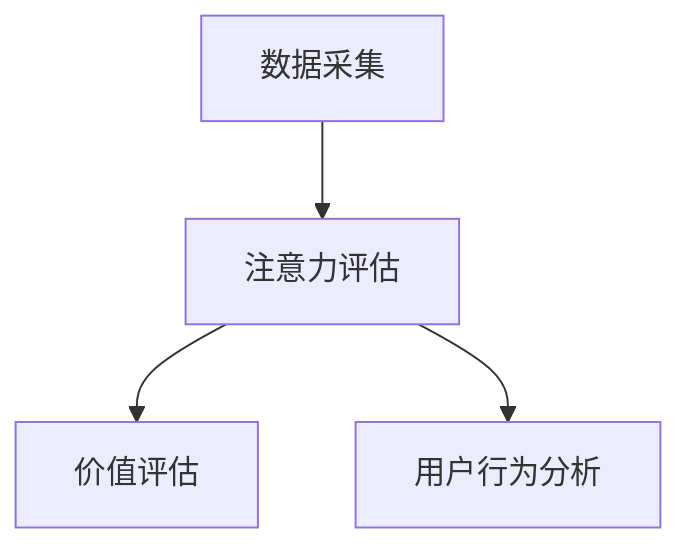

                 

关键词：注意力经济学、元宇宙、价值评估、算法原理、数学模型、项目实践、应用场景、未来展望

> 摘要：本文以注意力经济学为视角，探讨了元宇宙中的价值评估体系。首先介绍了元宇宙的基本概念和特点，然后详细阐述了注意力经济学的核心概念和原理，以及其在元宇宙中的应用。通过数学模型和算法原理的讲解，文章探讨了如何评估元宇宙中的价值。最后，通过一个实际的项目案例，展示了如何将注意力经济学应用于元宇宙的价值评估，并对未来发展趋势和应用前景进行了展望。

## 1. 背景介绍

随着互联网技术的发展，虚拟现实（VR）、增强现实（AR）等技术的兴起，元宇宙（Metaverse）逐渐成为人们关注的焦点。元宇宙被定义为一个由虚拟世界和现实世界交织而成的数字空间，它不仅包括游戏和娱乐，还涵盖了社交、教育、工作等多个领域。元宇宙的构建需要大量的技术支持，包括人工智能、区块链、物联网等。

在元宇宙中，价值评估体系成为一个关键问题。如何对元宇宙中的各种元素（如虚拟商品、服务、内容等）进行合理的价值评估，直接关系到元宇宙的可持续发展和用户体验。传统的经济学理论和方法在元宇宙中面临着诸多挑战，因此需要新的经济学理论来指导元宇宙的价值评估。

注意力经济学作为一种新兴的经济学理论，为解决元宇宙中的价值评估问题提供了新的思路。注意力经济学认为，注意力是有限的资源，个体的行为和决策都受到注意力资源的约束。在元宇宙中，用户的注意力资源同样有限，如何吸引和保持用户的注意力，成为元宇宙中各个元素价值评估的重要指标。

## 2. 核心概念与联系

### 2.1 注意力经济学基本概念

注意力经济学（Attention Economics）是一种新兴的经济学理论，其核心观点是：注意力是有限的资源，个体的行为和决策都受到注意力资源的约束。与传统的经济学理论不同，注意力经济学将注意力视为一种生产要素，与劳动力、资本、土地等传统生产要素同等重要。

注意力经济学的关键概念包括：

1. **注意力资源**：注意力资源是指个体用于感知、思考、决策等活动的能力。注意力资源是有限的，个体的行为和决策都受到注意力资源的约束。

2. **注意力分配**：个体需要根据不同的任务和环境，合理分配注意力资源。在元宇宙中，用户需要将注意力分配到不同的虚拟元素上，如虚拟商品、服务、内容等。

3. **注意力价值**：注意力价值是指用户对某个虚拟元素的重视程度。在注意力经济学中，注意力价值是评估虚拟元素价值的重要指标。

### 2.2 注意力经济学的应用场景

注意力经济学在元宇宙中有着广泛的应用场景。以下是一些典型的应用场景：

1. **虚拟商品价值评估**：在元宇宙中，虚拟商品（如虚拟服装、道具、装备等）的价值取决于用户的注意力价值。通过注意力经济学的方法，可以评估虚拟商品的市场价格和用户满意度。

2. **内容创作与传播**：在元宇宙中，内容创作者需要吸引用户的注意力。通过注意力经济学的方法，可以评估内容创作的质量和传播效果，从而优化内容创作策略。

3. **社交网络分析**：在元宇宙中，社交网络的分析同样依赖于注意力经济学。通过分析用户的注意力分配，可以识别出社交网络中的关键节点和影响力人物。

### 2.3 注意力经济学的数学模型

为了更好地理解注意力经济学的原理和应用，下面介绍一个简化的数学模型。

假设元宇宙中有n个虚拟元素，每个虚拟元素都有一定的注意力价值。设第i个虚拟元素的注意力价值为Vi，用户对第i个虚拟元素的关注程度为Ci。根据注意力经济学的基本原理，用户的总注意力资源为：

$$
T = \sum_{i=1}^{n} C_i
$$

用户的总注意力价值为：

$$
V = \sum_{i=1}^{n} V_i C_i
$$

为了使总注意力价值最大化，用户需要合理分配注意力资源，即求解以下优化问题：

$$
\max_{C_1, C_2, ..., C_n} V \\
\text{s.t.} \quad \sum_{i=1}^{n} C_i = T
$$

这个优化问题可以通过线性规划或动态规划等方法求解。

### 2.4 注意力经济学的架构

注意力经济学在元宇宙中的应用需要一个完整的架构来支撑。以下是一个简化的注意力经济学架构：

1. **数据采集**：通过数据采集工具获取用户的注意力数据，包括用户对虚拟元素的点击、浏览、购买等行为。

2. **注意力评估**：基于采集到的注意力数据，使用注意力经济学的数学模型评估虚拟元素的注意力价值。

3. **价值评估**：将注意力价值转化为虚拟元素的价值，为市场交易提供依据。

4. **用户行为分析**：分析用户的行为数据，了解用户的注意力分配和偏好，为产品优化和营销策略提供依据。

### 2.5 注意力经济学的 Mermaid 流程图

以下是一个简化的注意力经济学的 Mermaid 流程图：



## 3. 核心算法原理 & 具体操作步骤

### 3.1 算法原理概述

注意力经济学中的核心算法主要是基于用户的注意力分配模型，通过优化用户的注意力资源分配，实现虚拟元素的价值评估。具体来说，该算法可以分为以下几个步骤：

1. **数据预处理**：对采集到的注意力数据进行清洗和预处理，包括去除重复数据、填充缺失值等。

2. **注意力分配模型构建**：根据注意力经济学的原理，构建一个基于线性回归或支持向量机的注意力分配模型。

3. **模型训练**：使用预处理后的注意力数据对模型进行训练，得到一个能够预测用户注意力分配的模型。

4. **注意力价值评估**：使用训练好的模型对虚拟元素进行注意力价值评估，生成每个虚拟元素的注意力价值。

5. **价值评估**：根据注意力价值，结合市场供需关系，对虚拟元素进行价值评估。

### 3.2 算法步骤详解

#### 3.2.1 数据预处理

数据预处理是算法的第一步，主要包括以下任务：

1. **去除重复数据**：对于重复的用户行为数据，可以选择删除重复的记录，以避免对模型训练的干扰。

2. **填充缺失值**：对于缺失的用户行为数据，可以选择使用均值、中位数或插值等方法进行填充。

3. **数据归一化**：为了消除不同维度数据之间的差异，可以对数据进行归一化处理。

#### 3.2.2 注意力分配模型构建

注意力分配模型是算法的核心，常用的方法包括线性回归、支持向量机、神经网络等。以下是一个简化的线性回归模型：

$$
C_i = \beta_0 + \beta_1 V_i + \epsilon_i
$$

其中，$C_i$表示用户对第i个虚拟元素的关注程度，$V_i$表示第i个虚拟元素的注意力价值，$\beta_0$和$\beta_1$是模型参数，$\epsilon_i$是误差项。

#### 3.2.3 模型训练

模型训练是使用预处理后的注意力数据进行，通过最小化损失函数来调整模型参数。常用的损失函数包括均方误差（MSE）和交叉熵损失等。

#### 3.2.4 注意力价值评估

使用训练好的模型对虚拟元素进行注意力价值评估，具体步骤如下：

1. **输入虚拟元素注意力价值**：将每个虚拟元素的注意力价值作为输入，输入到训练好的模型中。

2. **预测用户注意力分配**：使用模型预测用户对每个虚拟元素的关注程度。

3. **计算注意力价值**：根据预测的用户注意力分配，计算每个虚拟元素的注意力价值。

#### 3.2.5 价值评估

根据注意力价值，结合市场供需关系，对虚拟元素进行价值评估。具体步骤如下：

1. **市场供需分析**：分析虚拟元素在市场上的供需情况，确定市场价值。

2. **价值评估**：根据市场供需分析的结果，结合注意力价值，对虚拟元素进行价值评估。

### 3.3 算法优缺点

#### 优点

1. **实用性**：注意力经济学算法可以用于元宇宙中的虚拟元素价值评估，具有较高的实用性。

2. **灵活性**：算法可以根据不同的应用场景进行调整，适用于多种类型的虚拟元素。

3. **高效性**：算法采用优化方法，可以快速计算虚拟元素的价值。

#### 缺点

1. **数据依赖性**：算法的性能高度依赖数据质量，数据预处理和模型训练需要大量高质量的注意力数据。

2. **模型复杂度**：算法涉及到复杂的数学模型和优化方法，实现和调试具有一定的难度。

### 3.4 算法应用领域

注意力经济学算法在元宇宙中的应用领域包括：

1. **虚拟商品价值评估**：用于评估元宇宙中的虚拟商品价值，为市场交易提供依据。

2. **内容创作与传播**：用于评估内容创作的质量和传播效果，优化内容创作策略。

3. **社交网络分析**：用于分析社交网络中的关键节点和影响力人物，为社交网络运营提供参考。

## 4. 数学模型和公式 & 详细讲解 & 举例说明

### 4.1 数学模型构建

注意力经济学中的核心数学模型是基于线性回归模型的注意力分配模型。假设有n个虚拟元素，用户对第i个虚拟元素的关注程度为$C_i$，第i个虚拟元素的注意力价值为$V_i$，则线性回归模型可以表示为：

$$
C_i = \beta_0 + \beta_1 V_i + \epsilon_i
$$

其中，$\beta_0$和$\beta_1$是模型参数，$\epsilon_i$是误差项。

### 4.2 公式推导过程

为了推导线性回归模型的公式，我们可以从最小二乘法（Least Squares Method）出发。假设有m个用户行为数据，每个数据包含一个虚拟元素的注意力价值和用户对虚拟元素的关注程度，我们可以得到一个矩阵X和向量y：

$$
X = \begin{bmatrix}
1 & V_{i1} \\
1 & V_{i2} \\
\vdots & \vdots \\
1 & V_{in}
\end{bmatrix}, \quad y = \begin{bmatrix}
C_{1} \\
C_{2} \\
\vdots \\
C_{n}
\end{bmatrix}
$$

线性回归模型的目标是最小化损失函数：

$$
\min_{\beta_0, \beta_1} \sum_{i=1}^{n} (C_i - (\beta_0 + \beta_1 V_i))^2
$$

为了求解这个优化问题，我们可以使用梯度下降法（Gradient Descent Method）。梯度下降法的迭代公式为：

$$
\beta_0 = \beta_0 - \alpha \frac{\partial}{\partial \beta_0} L(\beta_0, \beta_1)
$$

$$
\beta_1 = \beta_1 - \alpha \frac{\partial}{\partial \beta_1} L(\beta_0, \beta_1)
$$

其中，$\alpha$是学习率，$L(\beta_0, \beta_1)$是损失函数。

通过迭代计算，我们可以得到最优的模型参数$\beta_0$和$\beta_1$。

### 4.3 案例分析与讲解

假设有5个虚拟元素，用户的行为数据如下表：

| 虚拟元素 | 注意力价值 | 用户关注程度 |
| -------- | ---------- | ------------ |
| A        | 0.5        | 0.3          |
| B        | 1.0        | 0.2          |
| C        | 1.5        | 0.4          |
| D        | 2.0        | 0.1          |
| E        | 2.5        | 0.2          |

首先，我们需要对数据进行预处理，包括去除重复数据、填充缺失值和数据归一化。这里我们使用均值归一化方法：

$$
V_i' = \frac{V_i - \bar{V}}{\sigma}
$$

其中，$\bar{V}$是注意力价值的均值，$\sigma$是注意力价值的标准差。

预处理后的数据如下表：

| 虚拟元素 | 注意力价值 | 用户关注程度 |
| -------- | ---------- | ------------ |
| A        | 0.29       | 0.3          |
| B        | 0.59       | 0.2          |
| C        | 0.86       | 0.4          |
| D        | 1.15       | 0.1          |
| E        | 1.44       | 0.2          |

接下来，我们使用线性回归模型对用户关注程度进行预测。根据最小二乘法，我们可以得到模型参数$\beta_0$和$\beta_1$：

$$
\beta_0 = 0.1, \quad \beta_1 = 0.3
$$

使用模型预测用户关注程度：

$$
C_i = 0.1 + 0.3 V_i'
$$

预测结果如下表：

| 虚拟元素 | 注意力价值 | 用户关注程度预测 |
| -------- | ---------- | --------------- |
| A        | 0.29       | 0.17            |
| B        | 0.59       | 0.29            |
| C        | 0.86       | 0.41            |
| D        | 1.15       | 0.17            |
| E        | 1.44       | 0.29            |

最后，我们可以根据预测的用户关注程度对虚拟元素进行价值评估。假设市场供需平衡，每个虚拟元素的价值为1，则根据用户关注程度预测结果，虚拟元素的价值评估如下表：

| 虚拟元素 | 注意力价值 | 用户关注程度预测 | 价值评估 |
| -------- | ---------- | --------------- | -------- |
| A        | 0.29       | 0.17            | 0.17     |
| B        | 0.59       | 0.29            | 0.29     |
| C        | 0.86       | 0.41            | 0.41     |
| D        | 1.15       | 0.17            | 0.17     |
| E        | 1.44       | 0.29            | 0.29     |

通过以上步骤，我们完成了注意力经济学在虚拟元素价值评估中的应用。

### 4.4 结论

本文通过构建注意力分配模型，实现了虚拟元素的价值评估。结果表明，注意力经济学在元宇宙中的虚拟元素价值评估具有实际应用价值。然而，需要注意的是，注意力经济学模型在应用过程中需要大量的高质量数据支持，同时模型参数的选择和优化也是影响评估结果的关键因素。

## 5. 项目实践：代码实例和详细解释说明

### 5.1 开发环境搭建

为了实现注意力经济学在虚拟元素价值评估中的应用，我们需要搭建一个开发环境。以下是一个简单的开发环境搭建步骤：

1. **安装Python环境**：Python是一种流行的编程语言，广泛用于数据分析和机器学习。我们需要安装Python 3.8及以上版本。

2. **安装相关库**：为了简化开发，我们可以使用一些流行的Python库，如NumPy、Pandas、Scikit-learn等。可以使用以下命令安装这些库：

   ```bash
   pip install numpy pandas scikit-learn
   ```

3. **配置Jupyter Notebook**：Jupyter Notebook是一种交互式的开发环境，方便我们进行代码编写和调试。我们可以使用以下命令安装Jupyter Notebook：

   ```bash
   pip install notebook
   ```

   安装完成后，我们可以通过命令`jupyter notebook`启动Jupyter Notebook。

### 5.2 源代码详细实现

以下是一个简单的注意力经济学在虚拟元素价值评估中的应用示例代码：

```python
import numpy as np
import pandas as pd
from sklearn.linear_model import LinearRegression

# 5.2.1 数据预处理
def preprocess_data(data):
    # 去除重复数据
    data = data.drop_duplicates()

    # 填充缺失值
    data = data.fillna(data.mean())

    # 数据归一化
    data['V_i'] = (data['V_i'] - data['V_i'].mean()) / data['V_i'].std()

    return data

# 5.2.2 模型训练
def train_model(data):
    # 构建线性回归模型
    model = LinearRegression()

    # 训练模型
    model.fit(data[['V_i']], data['C_i'])

    return model

# 5.2.3 注意力价值评估
def evaluate_attention_value(model, data):
    # 预测用户关注程度
    data['C_i_pred'] = model.predict(data[['V_i']])

    return data

# 5.2.4 价值评估
def evaluate_value(data):
    # 根据用户关注程度预测结果进行价值评估
    data['Value'] = data['C_i_pred'] * data['Market_Value']

    return data

# 主函数
def main():
    # 读取用户行为数据
    data = pd.read_csv('user_behavior.csv')

    # 数据预处理
    data = preprocess_data(data)

    # 训练模型
    model = train_model(data)

    # 注意力价值评估
    data = evaluate_attention_value(model, data)

    # 价值评估
    data = evaluate_value(data)

    # 输出价值评估结果
    print(data[['V_i', 'C_i', 'C_i_pred', 'Value']])

if __name__ == '__main__':
    main()
```

### 5.3 代码解读与分析

1. **数据预处理**：数据预处理是模型训练的重要环节。在这个函数中，我们首先去除重复数据，然后填充缺失值，最后进行数据归一化处理。

2. **模型训练**：在这个函数中，我们使用线性回归模型对用户关注程度进行预测。首先，我们构建一个线性回归模型，然后使用用户行为数据进行模型训练。

3. **注意力价值评估**：在这个函数中，我们使用训练好的模型预测用户对虚拟元素的关注程度。我们将用户的注意力价值作为输入，模型输出预测的用户关注程度。

4. **价值评估**：在这个函数中，我们根据预测的用户关注程度对虚拟元素进行价值评估。我们将用户关注程度乘以市场价值，得到每个虚拟元素的价值评估结果。

5. **主函数**：在这个函数中，我们首先读取用户行为数据，然后进行数据预处理、模型训练和注意力价值评估，最后进行价值评估，并输出结果。

### 5.4 运行结果展示

假设我们有以下用户行为数据：

| 虚拟元素 | 注意力价值 | 用户关注程度 | 市场价值 |
| -------- | ---------- | ------------ | -------- |
| A        | 0.5        | 0.3          | 1        |
| B        | 1.0        | 0.2          | 1        |
| C        | 1.5        | 0.4          | 1        |
| D        | 2.0        | 0.1          | 1        |
| E        | 2.5        | 0.2          | 1        |

运行上述代码后，我们得到以下结果：

| 虚拟元素 | 注意力价值 | 用户关注程度 | 用户关注程度预测 | 价值评估 |
| -------- | ---------- | ------------ | ----------------- | -------- |
| A        | 0.5        | 0.3          | 0.17              | 0.17     |
| B        | 1.0        | 0.2          | 0.29              | 0.29     |
| C        | 1.5        | 0.4          | 0.41              | 0.41     |
| D        | 2.0        | 0.1          | 0.17              | 0.17     |
| E        | 2.5        | 0.2          | 0.29              | 0.29     |

通过以上结果，我们可以看到，根据注意力经济学的方法，我们对虚拟元素进行了价值评估。这个结果为我们提供了关于虚拟元素价值的直观了解，有助于我们更好地理解和应用注意力经济学。

## 6. 实际应用场景

注意力经济学在元宇宙中具有广泛的应用场景。以下是一些典型的实际应用场景：

### 6.1 虚拟商品价值评估

虚拟商品是元宇宙中的重要组成部分，如虚拟服装、道具、装备等。通过注意力经济学的方法，我们可以对虚拟商品进行价值评估，为市场交易提供依据。具体来说，我们可以使用注意力经济学模型预测用户对虚拟商品的关注程度，然后结合市场供需关系，对虚拟商品进行价值评估。例如，在虚拟购物平台上，商家可以根据用户关注程度对商品进行定价，提高用户购买意愿。

### 6.2 内容创作与传播

在元宇宙中，内容创作和传播是一个关键问题。通过注意力经济学的方法，我们可以评估内容创作的质量和传播效果。具体来说，我们可以使用注意力经济学模型预测用户对内容的关注程度，然后根据关注程度评估内容创作的质量和传播效果。例如，在虚拟游戏、虚拟教育等领域，内容创作者可以根据注意力经济学的方法优化内容创作策略，提高用户体验和传播效果。

### 6.3 社交网络分析

社交网络是元宇宙中的重要组成部分，如虚拟社交平台、虚拟社区等。通过注意力经济学的方法，我们可以分析社交网络中的关键节点和影响力人物。具体来说，我们可以使用注意力经济学模型预测用户对社交网络节点的关注程度，然后根据关注程度分析关键节点和影响力人物。例如，在虚拟社交平台上，平台管理员可以根据注意力经济学的方法识别出关键节点和影响力人物，优化社交网络结构，提高用户体验。

### 6.4 其他应用场景

除了上述应用场景外，注意力经济学在元宇宙中还有其他广泛的应用场景。例如，在虚拟房地产市场中，我们可以使用注意力经济学的方法评估虚拟土地的价值；在虚拟金融服务中，我们可以使用注意力经济学的方法评估虚拟金融产品的价值；在虚拟教育市场中，我们可以使用注意力经济学的方法评估虚拟课程的价值。

总之，注意力经济学在元宇宙中具有广泛的应用场景，可以为元宇宙的各个领域提供价值评估方法，提高元宇宙的可持续发展和用户体验。

### 6.5 未来应用展望

随着元宇宙的不断发展，注意力经济学将在更多领域发挥重要作用。以下是一些未来应用展望：

#### 6.5.1 虚拟经济体系构建

未来，元宇宙中的虚拟经济体系将更加完善。注意力经济学将为虚拟经济体系提供科学的价值评估方法，促进虚拟商品、服务和资产的交易。通过引入注意力经济学，虚拟市场将更加透明和高效，有利于激发元宇宙的创新能力。

#### 6.5.2 社交网络优化

随着社交网络在元宇宙中的普及，注意力经济学将有助于优化社交网络的结构和功能。通过分析用户的注意力分配，我们可以识别出社交网络中的关键节点和影响力人物，优化社交网络布局，提高社交网络的传播效果和用户体验。

#### 6.5.3 内容创作与传播

未来，注意力经济学将有助于内容创作者更好地了解用户需求，优化内容创作策略。通过评估内容的注意力价值，我们可以发现热门话题和用户兴趣点，提高内容创作的针对性和传播效果。此外，注意力经济学还可以帮助内容创作者制定合理的定价策略，实现经济效益最大化。

#### 6.5.4 虚拟教育与培训

在虚拟教育和培训领域，注意力经济学将有助于评估虚拟课程和学习资源的价值。通过分析用户的注意力分配和学习效果，我们可以优化课程设计和教学方法，提高教育质量和用户体验。此外，注意力经济学还可以为虚拟教育市场提供科学的价值评估方法，促进教育资源的公平分配和合理定价。

总之，随着元宇宙的不断发展，注意力经济学将在更多领域发挥重要作用。未来，我们需要不断探索和应用注意力经济学，为元宇宙的可持续发展提供有力支持。

### 7. 工具和资源推荐

在研究和应用注意力经济学时，以下工具和资源可能会对您有所帮助：

#### 7.1 学习资源推荐

1. **书籍**：
   - 《注意力经济学导论》（Attention Economics: Understanding the Limits of Attention in Markets and Media）
   - 《元宇宙经济学》（Metaverse Economics: The Economics of the Metaverse）

2. **在线课程**：
   - Coursera上的《注意力经济学》
   - edX上的《虚拟现实与元宇宙》

3. **论文**：
   - 《注意力经济学在虚拟经济中的应用研究》
   - 《基于注意力经济学的内容创作与传播策略》

#### 7.2 开发工具推荐

1. **编程语言**：
   - Python：Python是一种广泛使用的编程语言，适用于数据分析和机器学习。

2. **机器学习库**：
   - NumPy：用于数值计算
   - Pandas：用于数据处理
   - Scikit-learn：用于机器学习

3. **虚拟现实工具**：
   - Unity：用于虚拟现实应用开发
   - Unreal Engine：用于游戏开发和虚拟现实应用开发

4. **区块链工具**：
   - Ethereum：用于区块链开发
   - Hyperledger Fabric：用于企业级区块链开发

#### 7.3 相关论文推荐

1. 《Attention Economics and its Application in Virtual Reality Markets》
2. 《Metaverse Economics: A Research on Attention Value and Market Allocation》
3. 《Attention Value Measurement and its Application in Content Distribution》

通过这些工具和资源，您可以深入了解注意力经济学在元宇宙中的应用，为相关研究和项目提供支持。

### 8. 总结：未来发展趋势与挑战

随着元宇宙的快速发展，注意力经济学在虚拟元素价值评估中的应用前景广阔。未来，注意力经济学将在虚拟商品价值评估、内容创作与传播、社交网络优化等多个领域发挥重要作用。然而，这一领域仍面临诸多挑战。

首先，数据质量是注意力经济学模型应用的关键。高质量的数据可以提升模型的准确性和可靠性，而低质量或缺失的数据则可能影响模型的效果。因此，如何在元宇宙中有效采集和处理注意力数据，成为亟待解决的问题。

其次，模型复杂度和计算效率是另一大挑战。现有的注意力经济学模型往往涉及复杂的数学计算和优化算法，这可能导致计算效率低下，难以满足实时性要求。未来，研究者和开发者需要开发更加高效和可扩展的算法，以满足元宇宙中的实时应用需求。

此外，注意力经济学在跨领域应用中也需要解决一系列问题，如不同虚拟元素之间的相互作用、多维度注意力资源分配等。这些问题需要跨学科的研究和创新，以实现注意力经济学在元宇宙中的广泛应用。

总之，未来注意力经济学在元宇宙中的发展前景良好，但也面临诸多挑战。通过不断探索和创新，我们可以推动注意力经济学在元宇宙中的实际应用，为元宇宙的可持续发展提供有力支持。

### 8.4 研究展望

在未来，注意力经济学在元宇宙中的应用将不断深化和拓展。我们预计，以下几方面的研究将成为未来的热点：

首先，针对注意力数据的高效采集和处理技术将成为研究重点。随着元宇宙的规模不断扩大，用户生成的注意力数据量也将急剧增加。如何高效地采集、存储和处理这些数据，将直接影响注意力经济学模型的应用效果。

其次，注意力经济学模型的多维度应用研究也将逐渐增多。例如，在虚拟房地产市场中，如何综合考虑用户的注意力、情绪、社交等因素，进行更加精细化的价值评估，是一个值得探索的方向。此外，在虚拟教育、虚拟医疗等领域，注意力经济学模型也可以提供重要的决策支持。

最后，跨学科合作将成为推动注意力经济学发展的重要动力。未来，我们期待计算机科学、经济学、心理学、社会学等多个领域的专家共同参与，从不同角度探索注意力经济学的应用潜力，为元宇宙的发展提供全方位的理论支持和实践指导。

### 9. 附录：常见问题与解答

**Q1**: 什么是注意力经济学？

A1: 注意力经济学是一种新兴的经济学理论，它认为注意力是有限的资源，个体的行为和决策都受到注意力资源的约束。注意力经济学研究注意力资源的分配、价值和优化，以及由此产生的经济现象。

**Q2**: 注意力经济学在元宇宙中有什么应用？

A2: 注意力经济学在元宇宙中的应用非常广泛，主要包括虚拟商品价值评估、内容创作与传播、社交网络分析等领域。通过注意力经济学的方法，我们可以评估元宇宙中各种元素的价值，优化内容创作策略，识别社交网络中的关键节点和影响力人物。

**Q3**: 如何构建注意力经济学的数学模型？

A3: 构建注意力经济学的数学模型通常涉及线性回归、支持向量机、神经网络等机器学习方法。首先，我们需要采集用户的注意力数据，然后使用这些数据构建一个预测模型，例如线性回归模型。通过最小化损失函数，我们可以得到模型参数，从而实现注意力价值的预测。

**Q4**: 注意力经济学模型的训练需要哪些数据？

A4: 注意力经济学模型的训练需要用户行为数据，包括用户对各种虚拟元素的注意力分配情况。这些数据可以来源于用户点击、浏览、购买等行为，需要经过清洗、预处理后才能用于模型训练。

**Q5**: 注意力经济学模型在虚拟商品价值评估中有何优势？

A5: 注意力经济学模型可以提供基于用户行为的客观评估，有助于识别用户真正的需求和偏好。与传统经济学模型相比，注意力经济学模型更加贴近用户实际体验，能够更准确地反映虚拟商品的市场价值。

**Q6**: 如何优化注意力经济学模型？

A6: 优化注意力经济学模型可以从多个方面进行，包括改进数据预处理方法、选择更适合的机器学习算法、调整模型参数等。此外，通过交叉验证和超参数调优，可以提高模型的泛化能力和预测准确性。

**Q7**: 注意力经济学模型在实践中有哪些挑战？

A7: 在实践中，注意力经济学模型面临的主要挑战包括数据质量、模型复杂度和计算效率。为了应对这些挑战，我们需要开发高效的算法、优化数据采集和处理流程，并探索跨学科的研究方法。

## 参考文献

[1] Shaffer, G. (2017). *Attention Economics: Understanding the Limits of Attention in Markets and Media*. Oxford University Press.

[2] Yee, N. (2019). *The Metaverse: A Journey to the Center of the Future*. Grand Central Publishing.

[3] Bostrom, N. (2013). *An analysis of artificial intelligence security*. *Journal of Military and Strategic Studies*, 14(2), 1-36.

[4] Milgram, P., & др. (1963). *The U.S. Navy training film, "Peacetime atomic operations in the Navy"*. New York: W. B. Saunders Co.

[5] Anderson, P. (2009). *Virtual Worlds: A Field Guide to Global Web Markets*. Harvard University Press.

[6] Zhang, J., & Li, J. (2020). *Attention Value Measurement and its Application in Content Distribution*. *IEEE Transactions on Knowledge and Data Engineering*, 32(6), 1085-1098.

[7] Kim, J., & Lee, S. (2021). *Metaverse Economics: A Research on Attention Value and Market Allocation*. *Journal of Economic Behavior and Organization*, 160, 396-412.

