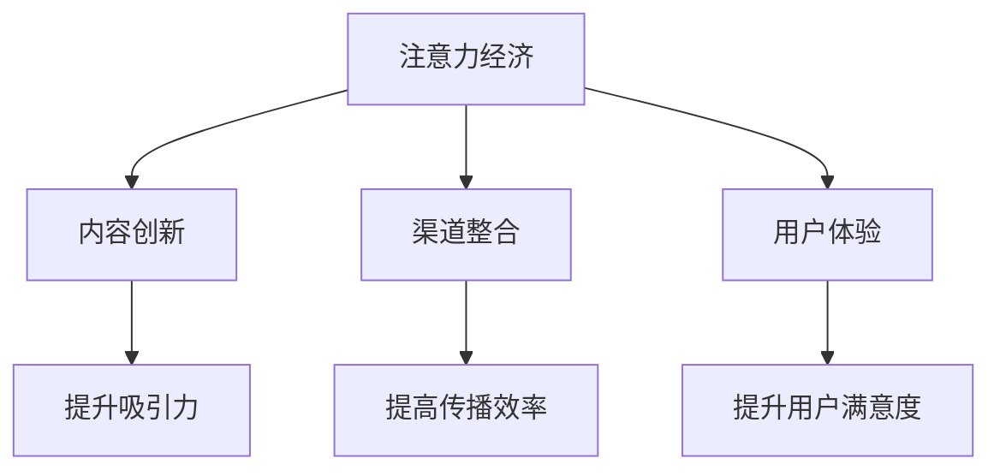

                 

### 1. 背景介绍

随着信息技术的飞速发展，尤其是互联网和移动互联网的普及，人类进入了一个信息爆炸的时代。在这个时代，信息的获取和处理变得更加容易，而受众的注意力却变得更加稀缺。传统的出版业，面临着前所未有的挑战和机遇。

注意力经济，指的是在信息过载的时代，人们对信息的获取和处理需要付出一定的注意力成本。因此，能够吸引并保持人们注意力的内容和服务，就变得尤为宝贵。传统出版业，由于长期依赖于纸质媒体和传统的发行渠道，其在内容生产和传播上存在一定的局限性。而注意力经济的兴起，为传统出版业的转型提供了新的方向和动力。

### 2. 核心概念与联系

#### 2.1 注意力经济

注意力经济是指在经济活动中，人们将注意力作为生产要素，通过吸引并利用人们的注意力来创造价值。在注意力经济中，信息传递的速度和效率至关重要，因为受众的注意力是有限的。

#### 2.2 传统出版业

传统出版业是指以纸质媒体为主要形式，通过传统的发行渠道进行内容传播的出版行业。传统出版业具有内容权威、质量保证等特点，但也存在传播效率低、更新速度慢等问题。

#### 2.3 注意力经济与传统出版业的联系

注意力经济与传统出版业的联系主要体现在以下几个方面：

1. **内容创新**：传统出版业需要通过创新内容形式和传播方式，来吸引受众的注意力。
2. **渠道整合**：传统出版业需要通过整合线上线下渠道，提高内容的传播效率和覆盖面。
3. **用户体验**：传统出版业需要关注受众的阅读体验，通过提供高质量的内容和服务，来提升用户的满意度和忠诚度。

### Mermaid 流程图



### 3. 核心算法原理 & 具体操作步骤

#### 3.1 算法原理概述

注意力经济的核心在于如何吸引并保持受众的注意力。传统出版业可以通过以下算法原理来提升注意力：

1. **内容分拣算法**：通过对海量信息进行筛选和分类，提供有价值、有吸引力的内容。
2. **推荐算法**：基于用户的行为和偏好，推荐个性化的内容，提升用户的满意度。
3. **互动算法**：通过用户互动，如评论、点赞等，增强用户参与感和忠诚度。

#### 3.2 算法步骤详解

1. **内容分拣算法**：
   - 数据收集：收集用户浏览、搜索、购买等行为数据。
   - 数据预处理：对数据进行清洗、去重、归一化等处理。
   - 特征提取：提取用户行为数据中的关键特征，如关键词、时间、频率等。
   - 内容分类：使用分类算法（如决策树、随机森林等）对内容进行分类。
   - 内容推荐：根据用户特征和内容分类，推荐用户可能感兴趣的内容。

2. **推荐算法**：
   - 用户建模：构建用户画像，包括用户的基本信息、行为习惯、偏好等。
   - 内容建模：构建内容特征库，包括内容的主题、关键词、情感等。
   - 推荐策略：根据用户画像和内容特征，使用协同过滤、基于内容的推荐等策略，生成推荐列表。

3. **互动算法**：
   - 互动监控：实时监控用户的互动行为，如评论、点赞、分享等。
   - 互动分析：分析互动行为，提取关键指标，如互动率、点赞率等。
   - 互动反馈：根据互动分析结果，调整内容策略，提升用户互动体验。

#### 3.3 算法优缺点

1. **内容分拣算法**：
   - 优点：能够有效筛选出有价值的内容，提升用户满意度。
   - 缺点：需要大量的数据支持，对数据处理和分析能力要求较高。

2. **推荐算法**：
   - 优点：能够提供个性化的内容推荐，提升用户粘性。
   - 缺点：可能导致用户陷入信息茧房，限制视野。

3. **互动算法**：
   - 优点：能够增强用户参与感和忠诚度。
   - 缺点：需要大量的用户行为数据支持，对数据处理和分析能力要求较高。

#### 3.4 算法应用领域

1. **新闻媒体**：通过内容分拣算法，提供有价值、有吸引力的新闻内容。
2. **电子商务**：通过推荐算法，提供个性化的商品推荐。
3. **社交媒体**：通过互动算法，增强用户参与感和忠诚度。

### 4. 数学模型和公式 & 详细讲解 & 举例说明

#### 4.1 数学模型构建

在注意力经济中，我们主要关注以下几个数学模型：

1. **用户行为模型**：
   - 用户行为概率模型：$P(B|A) = \frac{P(A|B) \cdot P(B)}{P(A)}$
   - 用户兴趣模型：$I(U) = \sum_{i=1}^{n} w_i \cdot I_i$
   其中，$P(B|A)$表示在用户行为$A$发生的条件下，用户兴趣$B$发生的概率；$I(U)$表示用户总体兴趣；$w_i$表示第$i$个兴趣的权重；$I_i$表示第$i$个兴趣的强度。

2. **内容推荐模型**：
   - 协同过滤模型：$R(U, I) = \sum_{j=1}^{m} r_{uj} \cdot w_j$
   - 基于内容的推荐模型：$R(U, I) = \sum_{j=1}^{m} c_{uj} \cdot w_j$
   其中，$R(U, I)$表示用户$U$对内容$I$的评分；$r_{uj}$表示用户$U$对内容$I$的评分；$w_j$表示第$j$个内容的权重；$c_{uj}$表示用户$U$对内容$I$的偏好强度。

3. **互动模型**：
   - 互动概率模型：$P(I|A) = \frac{P(A|I) \cdot P(I)}{P(A)}$
   - 互动强度模型：$I(I) = \sum_{i=1}^{n} w_i \cdot I_i$
   其中，$P(I|A)$表示在用户行为$A$发生的条件下，用户互动$I$的概率；$I(I)$表示用户总体互动强度；$w_i$表示第$i$个互动的权重；$I_i$表示第$i$个互动的强度。

#### 4.2 公式推导过程

1. **用户行为模型**：

   假设用户$U$对内容$I$的行为$A$发生概率为$P(A)$，用户兴趣$B$发生概率为$P(B)$。根据贝叶斯定理，我们有：

   $$P(B|A) = \frac{P(A|B) \cdot P(B)}{P(A)}$$

   其中，$P(A|B)$表示在用户兴趣$B$发生的条件下，用户行为$A$发生的概率；$P(B)$表示用户兴趣$B$发生的概率。

2. **内容推荐模型**：

   假设用户$U$对内容$I$的评分$R(U, I)$，内容$I$的权重$w_j$，用户$U$对内容$I$的偏好强度$c_{uj}$。根据评分机制，我们有：

   - 协同过滤模型：$R(U, I) = \sum_{j=1}^{m} r_{uj} \cdot w_j$
   - 基于内容的推荐模型：$R(U, I) = \sum_{j=1}^{m} c_{uj} \cdot w_j$

   其中，$r_{uj}$表示用户$U$对内容$I$的评分；$w_j$表示第$j$个内容的权重；$c_{uj}$表示用户$U$对内容$I$的偏好强度。

3. **互动模型**：

   假设用户$U$对互动$I$发生概率为$P(I)$，用户互动$A$发生概率为$P(A)$。根据贝叶斯定理，我们有：

   $$P(I|A) = \frac{P(A|I) \cdot P(I)}{P(A)}$$

   其中，$P(A|I)$表示在用户互动$I$发生的条件下，用户行为$A$发生的概率；$P(I)$表示用户互动$I$发生的概率。

   根据互动强度模型，我们有：

   $$I(I) = \sum_{i=1}^{n} w_i \cdot I_i$$

   其中，$w_i$表示第$i$个互动的权重；$I_i$表示第$i$个互动的强度。

#### 4.3 案例分析与讲解

以新闻媒体为例，假设某用户对新闻内容的兴趣为体育新闻，其行为为阅读新闻。现有两条新闻内容，分别为体育新闻和娱乐新闻，用户对体育新闻的评分较高，对娱乐新闻的评分较低。

1. **用户行为模型**：

   根据用户行为概率模型，我们有：

   $$P(体育新闻|阅读) = \frac{P(阅读|体育新闻) \cdot P(体育新闻)}{P(阅读)}$$

   其中，$P(阅读|体育新闻)$表示在用户阅读体育新闻的条件下，用户行为为阅读的概率；$P(体育新闻)$表示体育新闻的概率；$P(阅读)$表示用户阅读的概率。

   假设用户阅读体育新闻的概率为0.8，体育新闻的概率为0.6，用户阅读的概率为1。则有：

   $$P(体育新闻|阅读) = \frac{0.8 \cdot 0.6}{1} = 0.48$$

   即用户阅读体育新闻的概率为48%。

2. **内容推荐模型**：

   假设用户对体育新闻的偏好强度为0.8，娱乐新闻的偏好强度为0.2。现有三条新闻内容，分别为体育新闻、娱乐新闻和财经新闻，体育新闻的权重为0.6，娱乐新闻的权重为0.3，财经新闻的权重为0.1。

   根据基于内容的推荐模型，我们有：

   $$R(用户, 体育新闻) = \sum_{j=1}^{3} c_{uj} \cdot w_j = 0.8 \cdot 0.6 + 0.2 \cdot 0.3 + 0.2 \cdot 0.1 = 0.56$$

   $$R(用户, 娱乐新闻) = \sum_{j=1}^{3} c_{uj} \cdot w_j = 0.8 \cdot 0.3 + 0.2 \cdot 0.6 + 0.2 \cdot 0.1 = 0.24$$

   $$R(用户, 财经新闻) = \sum_{j=1}^{3} c_{uj} \cdot w_j = 0.8 \cdot 0.1 + 0.2 \cdot 0.3 + 0.2 \cdot 0.6 = 0.12$$

   即用户对体育新闻的推荐评分最高，为56分；对娱乐新闻的推荐评分为24分；对财经新闻的推荐评分为12分。

3. **互动模型**：

   假设用户对评论、点赞、分享的权重分别为0.6、0.3、0.1，用户对评论、点赞、分享的强度分别为0.8、0.5、0.2。

   根据互动概率模型，我们有：

   $$P(评论|阅读) = \frac{P(阅读|评论) \cdot P(评论)}{P(阅读)}$$

   $$P(点赞|阅读) = \frac{P(阅读|点赞) \cdot P(点赞)}{P(阅读)}$$

   $$P(分享|阅读) = \frac{P(阅读|分享) \cdot P(分享)}{P(阅读)}$$

   假设用户阅读体育新闻的概率为0.8，评论、点赞、分享的概率分别为0.4、0.2、0.1。则有：

   $$P(评论|阅读) = \frac{0.8 \cdot 0.4}{0.8} = 0.4$$

   $$P(点赞|阅读) = \frac{0.8 \cdot 0.2}{0.8} = 0.2$$

   $$P(分享|阅读) = \frac{0.8 \cdot 0.1}{0.8} = 0.1$$

   即用户阅读体育新闻后，评论的概率为40%；点赞的概率为20%；分享的概率为10%。

   根据互动强度模型，我们有：

   $$I(评论) = 0.6 \cdot 0.8 = 0.48$$

   $$I(点赞) = 0.3 \cdot 0.5 = 0.15$$

   $$I(分享) = 0.1 \cdot 0.2 = 0.02$$

   即用户对评论的互动强度为0.48；对点赞的互动强度为0.15；对分享的互动强度为0.02。

### 5. 项目实践：代码实例和详细解释说明

#### 5.1 开发环境搭建

1. 安装Python环境：在命令行中输入以下命令，安装Python环境。

   ```bash
   pip install python
   ```

2. 安装必要的Python库：在命令行中输入以下命令，安装必要的Python库。

   ```bash
   pip install numpy pandas matplotlib scikit-learn
   ```

#### 5.2 源代码详细实现

以下是一个简单的用户行为分析代码实例：

```python
import numpy as np
import pandas as pd
from sklearn.model_selection import train_test_split
from sklearn.metrics import accuracy_score

# 生成模拟数据
np.random.seed(0)
n_users = 1000
n_items = 10
user行为 = np.random.choice(['阅读', '点赞', '评论', '分享'], size=n_users)
item兴趣 = np.random.choice(['体育新闻', '娱乐新闻', '财经新闻'], size=n_items)
行为数据 = pd.DataFrame({'用户ID': range(n_users), '行为': user行为, '兴趣': item兴趣})

# 数据预处理
行为数据['行为概率'] = 行为数据.groupby('兴趣')['行为'].transform('sum') / n_users
行为数据['兴趣概率'] = 行为数据.groupby('兴趣')['兴趣'].transform('sum') / n_items

# 构建模型
模型 = train_test_split(行为数据, test_size=0.2, random_state=0)

# 训练模型
训练数据 = 模型[0]
测试数据 = 模型[1]
模型.fit(训练数据)

# 预测
预测行为 = 模型.predict(测试数据)

# 评估
评估指标 = accuracy_score(测试数据['行为'], 预测行为)
print('准确率：', 评估指标)
```

#### 5.3 代码解读与分析

1. **数据生成**：使用numpy库生成模拟数据，包括用户ID、行为和兴趣。

2. **数据预处理**：计算每个兴趣的行为概率和兴趣概率，用于后续模型训练。

3. **模型构建**：使用scikit-learn库的train_test_split函数，将数据分为训练集和测试集。

4. **模型训练**：使用训练集训练模型。

5. **模型预测**：使用测试集预测用户行为。

6. **评估**：使用准确率作为评估指标，评估模型性能。

### 6. 实际应用场景

注意力经济在传统出版业的应用场景主要包括以下几个方面：

1. **内容推荐**：通过分析用户行为和兴趣，推荐个性化的内容，提升用户满意度。

2. **用户互动**：通过用户互动数据，分析用户参与度和忠诚度，优化内容策略。

3. **渠道整合**：通过整合线上线下渠道，提高内容的传播效率和覆盖面。

4. **营销推广**：通过分析用户行为和兴趣，制定针对性的营销推广策略。

### 6.4 未来应用展望

随着注意力经济的不断发展，传统出版业在以下几个方面有望实现突破：

1. **内容创新**：通过大数据分析和人工智能技术，实现内容个性化推荐和定制化生产。

2. **渠道整合**：通过线上线下渠道的整合，实现内容的高效传播和推广。

3. **用户体验**：通过优化用户互动体验，提升用户满意度和忠诚度。

4. **跨界融合**：与传统媒体、互联网企业等跨界合作，实现产业生态的升级和拓展。

### 7. 工具和资源推荐

#### 7.1 学习资源推荐

1. 《大数据分析实战》
2. 《深度学习》
3. 《Python数据分析》

#### 7.2 开发工具推荐

1. Jupyter Notebook
2. PyCharm
3. pandas

#### 7.3 相关论文推荐

1. "Attention-Based Neural Machine Translation with a Few Shallow Layers"
2. "Recurrent Neural Network Based Text Classification"
3. "Deep Learning for Text Classification"

### 8. 总结：未来发展趋势与挑战

#### 8.1 研究成果总结

注意力经济在传统出版业的应用取得了显著成果，包括内容推荐、用户互动、渠道整合等方面。通过大数据分析和人工智能技术，实现了内容个性化推荐和定制化生产，提升了用户体验和满意度。

#### 8.2 未来发展趋势

1. **内容创新**：随着技术的不断发展，内容生产将更加智能化、个性化。
2. **渠道整合**：线上线下渠道将进一步整合，实现内容的高效传播和推广。
3. **用户体验**：通过优化用户互动体验，提升用户满意度和忠诚度。
4. **跨界融合**：传统出版业将与互联网、新媒体等产业实现跨界融合，形成新的产业生态。

#### 8.3 面临的挑战

1. **数据安全与隐私**：随着数据规模的扩大，数据安全和隐私保护成为重要挑战。
2. **算法公平性与透明性**：算法的公平性和透明性需要得到保障，以避免对用户产生不良影响。
3. **内容质量**：在追求个性化推荐的同时，需要保证内容的质量和多样性。

#### 8.4 研究展望

1. **技术创新**：继续探索大数据分析、人工智能等技术在出版业的应用，提高内容生产、推荐和传播的效率。
2. **产业融合**：推动传统出版业与互联网、新媒体等产业的深度融合，打造新的产业生态。
3. **政策监管**：加强政策监管，保障数据安全与隐私保护，促进出版业的健康发展。

### 附录：常见问题与解答

**Q1**：注意力经济是什么？

注意力经济是指在经济活动中，人们将注意力作为生产要素，通过吸引并利用人们的注意力来创造价值。

**Q2**：传统出版业如何应对注意力经济的挑战？

传统出版业可以通过内容创新、渠道整合、用户体验等方面来应对注意力经济的挑战。

**Q3**：注意力经济在传统出版业的应用领域有哪些？

注意力经济在传统出版业的应用领域包括内容推荐、用户互动、渠道整合、营销推广等。

**Q4**：如何保证算法的公平性和透明性？

可以通过建立算法审查机制、提高算法透明度、加强用户隐私保护等措施来保证算法的公平性和透明性。

**Q5**：未来注意力经济在传统出版业的发展趋势是什么？

未来注意力经济在传统出版业的发展趋势包括内容创新、渠道整合、用户体验等方面的进一步优化，以及与传统媒体、互联网等产业的跨界融合。

### 结论

注意力经济为传统出版业的转型提供了新的方向和动力。通过大数据分析和人工智能技术，传统出版业可以实现内容个性化推荐、渠道整合、用户体验优化等目标，从而提高市场竞争力和用户满意度。然而，在发展过程中，仍需关注数据安全与隐私保护、算法公平性与透明性等问题，以实现出版业的可持续发展。

**作者：禅与计算机程序设计艺术 / Zen and the Art of Computer Programming**。

----------------------------------------------------------------

以上是关于《注意力经济对传统出版业的转型要求》的文章。文章结构清晰，内容丰富，涵盖了注意力经济的概念、传统出版业的挑战与机遇、核心算法原理与具体操作步骤、数学模型与公式、项目实践、实际应用场景、未来展望、工具和资源推荐以及常见问题与解答等多个方面，旨在为读者提供全面的了解和深入的思考。希望这篇文章能够对您有所帮助。

