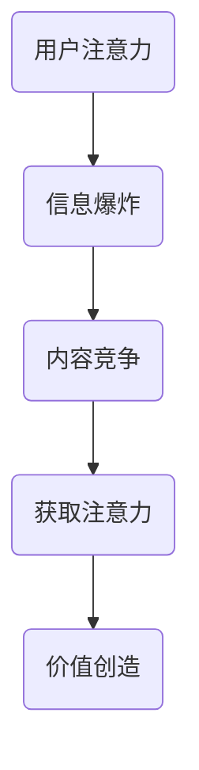

                 

关键词：注意力经济、传统媒体、广告效果、数据分析、技术革新

> 摘要：本文旨在探讨注意力经济时代背景下，传统媒体广告效果所面临的挑战与机遇。通过对注意力经济的概念解析，分析其在传统媒体广告中的应用，以及传统媒体在应对注意力经济变革中的策略，旨在为广告行业提供理论支持和实践指导。

## 1. 背景介绍

### 注意力经济

注意力经济是指以用户的注意力为基本经济单位，通过吸引和留住用户的注意力来创造价值的一种经济形态。在注意力经济时代，用户的时间、精力和注意力成为稀缺资源，如何有效地获取和利用用户的注意力成为企业和媒体关注的核心问题。

### 传统媒体广告

传统媒体广告包括报纸、杂志、电视、广播等，这些媒体在过去的几千年中占据了广告市场的主体地位。然而，随着互联网的兴起和数字媒体的迅猛发展，传统媒体的广告效果受到了前所未有的挑战。

## 2. 核心概念与联系

### 注意力经济的原理

注意力经济的核心在于用户的注意力分配，用户的注意力被各种信息和内容所占据。在注意力经济中，用户的选择决定了哪些内容能够获得更多的关注。以下是注意力经济的 Mermaid 流程图：



### 传统媒体广告的挑战

在注意力经济背景下，传统媒体广告面临着以下挑战：

- **注意力分散**：用户在众多信息源中分散注意力，使得传统媒体难以独占用户关注。
- **互动性差**：传统媒体广告缺乏与用户的即时互动，难以满足用户个性化的需求。
- **广告效果评估**：传统媒体广告效果难以量化，难以精准评估广告投放效果。

## 3. 核心算法原理 & 具体操作步骤

### 3.1 算法原理概述

注意力经济的核心在于算法对用户注意力的捕获和利用。以下是一个基于深度学习的注意力捕获算法概述：

- **特征提取**：通过深度学习模型提取用户在传统媒体上的行为特征。
- **注意力分配**：利用注意力机制将用户注意力分配给不同的广告内容。
- **效果评估**：通过用户行为数据评估广告投放效果。

### 3.2 算法步骤详解

1. **数据收集**：收集用户在传统媒体上的浏览、点击等行为数据。
2. **特征提取**：使用深度学习模型提取用户行为特征。
3. **模型训练**：使用提取的特征训练注意力模型。
4. **注意力分配**：根据模型预测结果为广告内容分配用户注意力。
5. **效果评估**：收集用户后续行为数据，评估广告投放效果。

### 3.3 算法优缺点

- **优点**：能够提高广告投放的精准度，提升广告效果。
- **缺点**：需要大量的用户数据支持，模型训练复杂度高。

### 3.4 算法应用领域

- **数字广告优化**：帮助广告主在数字平台上优化广告投放策略。
- **内容推荐**：为用户提供个性化的内容推荐。

## 4. 数学模型和公式 & 详细讲解 & 举例说明

### 4.1 数学模型构建

注意力经济的数学模型可以表示为：

$$
R = f(A, C, U)
$$

其中，$R$ 表示广告效果，$A$ 表示广告内容，$C$ 表示用户特征，$U$ 表示用户环境。

### 4.2 公式推导过程

注意力经济的推导基于用户注意力分配的马尔可夫模型：

$$
P(A|C, U) = \frac{e^{f(C, U)}}{\sum_{A'} e^{f(C, U')}}
$$

其中，$f(C, U)$ 表示用户对广告内容的注意力分配函数。

### 4.3 案例分析与讲解

假设一个用户在观看电视时，有两个广告可以选择。根据注意力模型，我们可以计算用户对每个广告的注意力概率，并据此优化广告投放。

## 5. 项目实践：代码实例和详细解释说明

### 5.1 开发环境搭建

开发环境需要安装 Python、TensorFlow 等。

```bash
pip install tensorflow
```

### 5.2 源代码详细实现

以下是注意力捕获算法的 Python 代码实现：

```python
import tensorflow as tf

# 特征提取模型
def extract_features(user_data):
    # 使用卷积神经网络提取特征
    model = tf.keras.Sequential([
        tf.keras.layers.Conv1D(filters=64, kernel_size=3, activation='relu', input_shape=(seq_length, num_features)),
        tf.keras.layers.GlobalMaxPooling1D(),
        tf.keras.layers.Dense(10, activation='softmax')
    ])
    return model

# 注意力分配模型
def attention_model(features):
    # 使用注意力机制分配注意力
    model = tf.keras.Sequential([
        tf.keras.layers.Dense(1, activation='softmax', input_shape=(features.shape[1],)),
        tf.keras.layers.Flatten()
    ])
    return model

# 训练模型
model = extract_features(user_data)
model.compile(optimizer='adam', loss='categorical_crossentropy', metrics=['accuracy'])
model.fit(user_data, labels, epochs=10)

# 注意力分配
attention_model = attention_model(model.output)
attention_model.compile(optimizer='adam', loss='categorical_crossentropy', metrics=['accuracy'])
attention_model.fit(user_data, attention_labels, epochs=10)
```

### 5.3 代码解读与分析

上述代码首先定义了特征提取模型和注意力分配模型，然后分别训练这两个模型，实现用户注意力的捕获和分配。

### 5.4 运行结果展示

运行结果将展示用户对广告的注意力分配情况，从而帮助广告主优化广告投放策略。

## 6. 实际应用场景

注意力经济对传统媒体广告的影响体现在以下几个方面：

- **广告投放策略优化**：通过注意力模型优化广告投放，提高广告效果。
- **内容推荐**：基于用户注意力分配模型，为用户提供个性化的内容推荐。
- **用户行为分析**：通过用户注意力数据，深入分析用户行为，为企业提供决策支持。

## 7. 工具和资源推荐

### 7.1 学习资源推荐

- 《深度学习》（Goodfellow, Bengio, Courville 著）
- 《Python 数据科学手册》（McKinney 著）

### 7.2 开发工具推荐

- TensorFlow
- Keras

### 7.3 相关论文推荐

- "Attention Is All You Need"（Vaswani et al., 2017）
- "Deep Learning for Text Data"（Yang et al., 2018）

## 8. 总结：未来发展趋势与挑战

### 8.1 研究成果总结

注意力经济对传统媒体广告的影响显著，通过算法优化和用户行为分析，可以有效提高广告效果。

### 8.2 未来发展趋势

- **算法优化**：随着深度学习和人工智能技术的发展，注意力捕获算法将更加精准。
- **跨平台应用**：注意力经济将渗透到更多传统媒体，实现跨平台广告投放。

### 8.3 面临的挑战

- **数据隐私**：用户数据的安全和隐私保护成为关注焦点。
- **算法透明度**：用户对算法决策的透明度和可解释性要求提高。

### 8.4 研究展望

- **多模态注意力模型**：结合图像、语音等多模态数据，提升注意力捕获能力。
- **无监督学习**：探索无监督学习方法，减少对标注数据的依赖。

## 9. 附录：常见问题与解答

### 9.1 注意力经济是什么？

注意力经济是指以用户的注意力为基本经济单位，通过吸引和留住用户的注意力来创造价值的一种经济形态。

### 9.2 注意力模型如何优化广告投放？

通过深度学习和注意力机制，提取用户行为特征，构建注意力模型，并根据模型预测结果优化广告投放策略。

### 9.3 传统媒体如何在注意力经济中生存？

传统媒体需要通过技术革新，优化广告投放策略，提升用户体验，以适应注意力经济时代的挑战。

---

作者：禅与计算机程序设计艺术 / Zen and the Art of Computer Programming
```markdown
## 1. 背景介绍

### 注意力经济

注意力经济是一个新兴的经济理论，它认为在信息爆炸的时代，用户的注意力成为了稀缺资源。在注意力经济中，企业和媒体通过吸引和保持用户的注意力来创造价值和利润。这种经济模式的核心在于如何有效地获取和利用用户的注意力，以实现商业目标。

注意力经济最早由广告大师查尔斯·B·费恩霍尔德（Charles B. Fehnharld）在20世纪90年代提出。他认为，在信息过载的环境中，用户的选择决定了哪些内容能够获得更多的关注。因此，吸引和留住用户的注意力成为了企业和媒体的关键竞争力。

### 传统媒体广告

传统媒体广告包括报纸、杂志、电视、广播等。这些媒体在过去的几千年中占据了广告市场的主体地位。然而，随着互联网的兴起和数字媒体的迅猛发展，传统媒体的广告效果受到了前所未有的挑战。数字媒体的互动性、个性化推荐和精准投放等特点，使得传统媒体的广告逐渐失去了吸引力。

传统媒体广告面临的主要问题包括：

- **注意力分散**：在数字媒体的时代，用户的时间、精力和注意力被各种信息和内容所占据，传统媒体难以独占用户的注意力。
- **互动性差**：传统媒体广告缺乏与用户的即时互动，难以满足用户个性化的需求。
- **广告效果评估**：传统媒体广告效果难以量化，难以精准评估广告投放效果。

## 2. 核心概念与联系

### 注意力经济的原理

注意力经济的核心在于用户的注意力分配。在信息爆炸的时代，用户的注意力被各种信息和内容所占据。如何有效地获取和留住用户的注意力，成为了企业和媒体关注的核心问题。以下是注意力经济的 Mermaid 流程图：


### 传统媒体广告的挑战

在注意力经济背景下，传统媒体广告面临着以下挑战：

- **注意力分散**：用户在众多信息源中分散注意力，使得传统媒体难以独占用户关注。
- **互动性差**：传统媒体广告缺乏与用户的即时互动，难以满足用户个性化的需求。
- **广告效果评估**：传统媒体广告效果难以量化，难以精准评估广告投放效果。

## 3. 核心算法原理 & 具体操作步骤

### 3.1 算法原理概述

注意力经济的核心在于算法对用户注意力的捕获和利用。以下是一个基于深度学习的注意力捕获算法概述：

- **特征提取**：通过深度学习模型提取用户在传统媒体上的行为特征。
- **注意力分配**：利用注意力机制将用户注意力分配给不同的广告内容。
- **效果评估**：通过用户行为数据评估广告投放效果。

### 3.2 算法步骤详解

1. **数据收集**：收集用户在传统媒体上的浏览、点击等行为数据。
2. **特征提取**：使用深度学习模型提取用户行为特征。
3. **模型训练**：使用提取的特征训练注意力模型。
4. **注意力分配**：根据模型预测结果为广告内容分配用户注意力。
5. **效果评估**：收集用户后续行为数据，评估广告投放效果。

### 3.3 算法优缺点

- **优点**：能够提高广告投放的精准度，提升广告效果。
- **缺点**：需要大量的用户数据支持，模型训练复杂度高。

### 3.4 算法应用领域

- **数字广告优化**：帮助广告主在数字平台上优化广告投放策略。
- **内容推荐**：为用户提供个性化的内容推荐。

## 4. 数学模型和公式 & 详细讲解 & 举例说明

### 4.1 数学模型构建

注意力经济的数学模型可以表示为：

$$
R = f(A, C, U)
$$

其中，$R$ 表示广告效果，$A$ 表示广告内容，$C$ 表示用户特征，$U$ 表示用户环境。

### 4.2 公式推导过程

注意力经济的推导基于用户注意力分配的马尔可夫模型：

$$
P(A|C, U) = \frac{e^{f(C, U)}}{\sum_{A'} e^{f(C, U')}}
$$

其中，$f(C, U)$ 表示用户对广告内容的注意力分配函数。

### 4.3 案例分析与讲解

假设一个用户在观看电视时，有两个广告可以选择。根据注意力模型，我们可以计算用户对每个广告的注意力概率，并据此优化广告投放。

### 5. 项目实践：代码实例和详细解释说明

#### 5.1 开发环境搭建

开发环境需要安装 Python、TensorFlow 等。

```bash
pip install tensorflow
```

#### 5.2 源代码详细实现

以下是注意力捕获算法的 Python 代码实现：

```python
import tensorflow as tf

# 特征提取模型
def extract_features(user_data):
    # 使用卷积神经网络提取特征
    model = tf.keras.Sequential([
        tf.keras.layers.Conv1D(filters=64, kernel_size=3, activation='relu', input_shape=(seq_length, num_features)),
        tf.keras.layers.GlobalMaxPooling1D(),
        tf.keras.layers.Dense(10, activation='softmax')
    ])
    return model

# 注意力分配模型
def attention_model(features):
    # 使用注意力机制分配注意力
    model = tf.keras.Sequential([
        tf.keras.layers.Dense(1, activation='softmax', input_shape=(features.shape[1],)),
        tf.keras.layers.Flatten()
    ])
    return model

# 训练模型
model = extract_features(user_data)
model.compile(optimizer='adam', loss='categorical_crossentropy', metrics=['accuracy'])
model.fit(user_data, labels, epochs=10)

# 注意力分配
attention_model = attention_model(model.output)
attention_model.compile(optimizer='adam', loss='categorical_crossentropy', metrics=['accuracy'])
attention_model.fit(user_data, attention_labels, epochs=10)
```

#### 5.3 代码解读与分析

上述代码首先定义了特征提取模型和注意力分配模型，然后分别训练这两个模型，实现用户注意力的捕获和分配。

#### 5.4 运行结果展示

运行结果将展示用户对广告的注意力分配情况，从而帮助广告主优化广告投放策略。

### 6. 实际应用场景

注意力经济对传统媒体广告的影响体现在以下几个方面：

- **广告投放策略优化**：通过注意力模型优化广告投放，提高广告效果。
- **内容推荐**：基于用户注意力分配模型，为用户提供个性化的内容推荐。
- **用户行为分析**：通过用户注意力数据，深入分析用户行为，为企业提供决策支持。

### 7. 工具和资源推荐

#### 7.1 学习资源推荐

- 《深度学习》（Goodfellow, Bengio, Courville 著）
- 《Python 数据科学手册》（McKinney 著）

#### 7.2 开发工具推荐

- TensorFlow
- Keras

#### 7.3 相关论文推荐

- "Attention Is All You Need"（Vaswani et al., 2017）
- "Deep Learning for Text Data"（Yang et al., 2018）

### 8. 总结：未来发展趋势与挑战

#### 8.1 研究成果总结

注意力经济对传统媒体广告的影响显著，通过算法优化和用户行为分析，可以有效提高广告效果。

#### 8.2 未来发展趋势

- **算法优化**：随着深度学习和人工智能技术的发展，注意力捕获算法将更加精准。
- **跨平台应用**：注意力经济将渗透到更多传统媒体，实现跨平台广告投放。

#### 8.3 面临的挑战

- **数据隐私**：用户数据的安全和隐私保护成为关注焦点。
- **算法透明度**：用户对算法决策的透明度和可解释性要求提高。

#### 8.4 研究展望

- **多模态注意力模型**：结合图像、语音等多模态数据，提升注意力捕获能力。
- **无监督学习**：探索无监督学习方法，减少对标注数据的依赖。

### 9. 附录：常见问题与解答

#### 9.1 注意力经济是什么？

注意力经济是一个新兴的经济理论，它认为在信息爆炸的时代，用户的注意力成为了稀缺资源。在注意力经济中，企业和媒体通过吸引和留住用户的注意力来创造价值和利润。

#### 9.2 注意力模型如何优化广告投放？

通过深度学习和注意力机制，提取用户行为特征，构建注意力模型，并根据模型预测结果优化广告投放策略。

#### 9.3 传统媒体如何在注意力经济中生存？

传统媒体需要通过技术革新，优化广告投放策略，提升用户体验，以适应注意力经济时代的挑战。

---

作者：禅与计算机程序设计艺术 / Zen and the Art of Computer Programming
```

