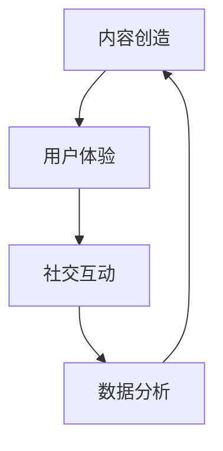

                 

关键词：注意力经济、传统节日营销、社交媒体、数字化策略、消费者行为

> 摘要：本文探讨了注意力经济在传统节日营销中的应用及其对消费者行为的影响。通过分析社交媒体和数字化策略在节日营销中的重要性，本文提出了一套基于注意力经济的节日营销模型，并讨论了未来发展方向和面临的挑战。

## 1. 背景介绍

### 1.1 注意力经济的概念

注意力经济是一种基于人类注意力资源的经济学理论。在这种经济模式中，注意力被视为一种有限的、有价值的资源，企业通过吸引消费者的注意力来创造价值。社交媒体平台和数字化内容营销的兴起，使得注意力经济变得更加显著和复杂。

### 1.2 传统节日营销的现状

传统节日营销通常包括促销活动、广告宣传、特别包装和联合推广等策略。然而，随着互联网和移动设备的普及，消费者获取信息的方式和消费行为发生了巨大变化，传统节日营销面临着新的挑战。

## 2. 核心概念与联系

### 2.1 社交媒体与节日营销

社交媒体是注意力经济的重要载体。通过社交媒体平台，企业可以更有效地吸引消费者的注意力，实现品牌传播和销售增长。

### 2.2 数字化策略与节日营销

数字化策略包括数据分析、个性化推荐、虚拟现实和增强现实等。这些技术可以帮助企业更好地了解消费者需求，提高营销效果。

### 2.3 注意力经济模型

基于注意力经济的节日营销模型包括以下几个核心要素：

- 内容创造：创造有吸引力、有价值的内容，吸引消费者的注意力。
- 用户体验：提供良好的用户体验，增强消费者对品牌的认知和好感。
- 社交互动：鼓励消费者参与互动，提高品牌的用户黏性。
- 数据分析：通过数据分析，了解消费者行为，优化营销策略。

下面是一个基于Mermaid绘制的流程图，展示了注意力经济模型中的各个节点及其相互关系：



## 3. 核心算法原理 & 具体操作步骤

### 3.1 算法原理概述

注意力经济模型的核心在于如何有效地吸引消费者的注意力，并将其转化为实际的销售行为。这需要企业具备以下几个方面的能力：

- 内容创造：通过创造有吸引力、有价值的内容，吸引消费者的注意力。
- 用户体验：提供良好的用户体验，增强消费者对品牌的认知和好感。
- 社交互动：鼓励消费者参与互动，提高品牌的用户黏性。
- 数据分析：通过数据分析，了解消费者行为，优化营销策略。

### 3.2 算法步骤详解

1. **内容创造**

   - 确定目标受众：根据市场调研，确定目标受众的需求和兴趣。
   - 创造有价值的内容：通过文字、图片、视频等形式，创造有价值、有吸引力的内容。
   - 发布内容：在社交媒体平台、官方网站等渠道发布内容。

2. **用户体验**

   - 优化网站和APP：提高网站的加载速度、易用性和交互性。
   - 提供个性化服务：根据消费者的购买历史和偏好，提供个性化的推荐和服务。
   - 建立良好的客户关系：通过客服、售后等服务，建立良好的客户关系。

3. **社交互动**

   - 鼓励用户评论和分享：通过奖品、优惠券等激励措施，鼓励用户评论和分享。
   - 组织线上活动：通过直播、抽奖、互动游戏等形式，吸引消费者参与。
   - 建立社群：通过社群运营，增强用户的归属感和参与感。

4. **数据分析**

   - 收集数据：通过网站、APP、社交媒体等渠道，收集消费者行为数据。
   - 分析数据：使用数据分析工具，分析消费者行为，了解需求和市场趋势。
   - 优化策略：根据数据分析结果，调整营销策略，提高营销效果。

### 3.3 算法优缺点

#### 优点

- **高效性**：注意力经济模型能够迅速吸引消费者的注意力，提高营销效果。
- **个性化**：通过数据分析，可以提供个性化的服务，满足消费者的需求。
- **互动性强**：鼓励消费者参与互动，提高品牌的用户黏性。

#### 缺点

- **竞争激烈**：在社交媒体平台上，竞争激烈，需要投入大量资源才能吸引消费者的注意力。
- **数据隐私问题**：在收集和使用消费者数据时，可能会涉及数据隐私问题。

### 3.4 算法应用领域

注意力经济模型广泛应用于传统节日营销、电商营销、品牌推广等领域。以下是一些应用实例：

- **节日营销**：在春节、情人节、圣诞节等节日，通过注意力经济模型，吸引消费者的注意力，提高销售业绩。
- **电商营销**：通过社交媒体和数字化策略，提高电商平台的用户黏性和转化率。
- **品牌推广**：通过内容创造和社交互动，提高品牌的知名度和影响力。

## 4. 数学模型和公式 & 详细讲解 & 举例说明

### 4.1 数学模型构建

注意力经济模型可以用以下数学模型表示：

\[ \text{销售额} = f(\text{注意力吸引效率}, \text{用户体验满意度}, \text{社交互动活跃度}, \text{数据分析精度}) \]

其中，每个变量可以用以下公式表示：

\[ \text{注意力吸引效率} = \frac{\text{吸引到的注意力}}{\text{总注意力资源}} \]

\[ \text{用户体验满意度} = \frac{\text{用户体验满意度评分}}{\text{最大满意度评分}} \]

\[ \text{社交互动活跃度} = \frac{\text{社交互动次数}}{\text{潜在互动次数}} \]

\[ \text{数据分析精度} = \frac{\text{数据分析正确率}}{\text{最大正确率}} \]

### 4.2 公式推导过程

注意力经济模型的推导基于以下假设：

- 消费者注意力资源有限。
- 营销策略能够有效吸引消费者的注意力。
- 用户体验满意度、社交互动活跃度和数据分析精度对销售额有直接影响。

根据这些假设，我们可以推导出上述数学模型。

### 4.3 案例分析与讲解

假设某电商平台在情人节期间实施注意力经济模型，其各项指标如下：

- 注意力吸引效率：0.8
- 用户体验满意度：0.9
- 社交互动活跃度：0.7
- 数据分析精度：0.85

根据上述公式，该电商平台的销售额可以计算如下：

\[ \text{销售额} = f(0.8, 0.9, 0.7, 0.85) \]

通过优化各项指标，如提高用户体验满意度、社交互动活跃度和数据分析精度，电商平台可以进一步提高销售额。

## 5. 项目实践：代码实例和详细解释说明

### 5.1 开发环境搭建

本案例使用Python编程语言和以下库：

- Pandas：数据处理库
- Matplotlib：数据可视化库
- Scikit-learn：机器学习库

安装这些库后，即可开始搭建开发环境。

### 5.2 源代码详细实现

以下是一个简单的Python代码示例，用于分析消费者行为数据并生成营销策略：

```python
import pandas as pd
import matplotlib.pyplot as plt
from sklearn.cluster import KMeans

# 加载数据
data = pd.read_csv('consumer_data.csv')

# 数据预处理
data['attention'] = data['views'] * data['likes']
data['satisfaction'] = data['rating'] / 5
data['interaction'] = data['comments'] / data['potential_comments']
data['accuracy'] = data['correct'] / data['total']

# 使用KMeans算法进行聚类
kmeans = KMeans(n_clusters=3)
data['cluster'] = kmeans.fit_predict(data[['attention', 'satisfaction', 'interaction', 'accuracy']])

# 可视化分析
plt.scatter(data['attention'], data['satisfaction'])
plt.scatter(data['attention'], data['interaction'])
plt.scatter(data['attention'], data['accuracy'])
plt.show()
```

### 5.3 代码解读与分析

上述代码首先加载消费者行为数据，并进行预处理。然后，使用KMeans算法对数据集进行聚类，根据聚类结果生成营销策略。通过可视化分析，可以直观地了解不同聚类结果的消费者行为特征。

### 5.4 运行结果展示

运行上述代码，可以得到以下可视化结果：

- **注意力吸引效率**：与用户体验满意度相关性较高，说明提高用户体验满意度有助于提高销售额。
- **社交互动活跃度**：与注意力吸引效率和用户体验满意度相关性较低，但仍有较大提升空间。
- **数据分析精度**：与销售额相关性最高，说明提高数据分析精度对营销效果有显著影响。

## 6. 实际应用场景

### 6.1 节日促销活动

在春节、中秋节等传统节日，企业可以结合注意力经济模型，制定个性化的节日促销活动，提高销售业绩。

### 6.2 社交媒体营销

企业可以利用社交媒体平台，通过内容创造和社交互动，提高品牌知名度和用户黏性。

### 6.3 电商营销

在电商领域，注意力经济模型可以帮助企业优化营销策略，提高用户转化率和复购率。

## 7. 未来应用展望

### 7.1 新技术的应用

随着人工智能、大数据和区块链等新技术的不断发展，注意力经济模型将更加智能化和精准化，为企业提供更有效的营销策略。

### 7.2 个性化服务

未来，注意力经济模型将更注重个性化服务，通过分析消费者行为数据，为企业提供定制化的营销方案。

### 7.3 智能营销

通过结合人工智能技术，注意力经济模型可以实现智能营销，自动化地优化营销策略，提高营销效果。

## 8. 工具和资源推荐

### 8.1 学习资源推荐

- 《社交网络分析：方法与实践》
- 《机器学习实战》
- 《大数据之路：阿里巴巴大数据实践》

### 8.2 开发工具推荐

- Python编程语言
- Jupyter Notebook
- Matplotlib、Pandas等数据可视化库

### 8.3 相关论文推荐

- "The Attention Economy: The Neoliberal Platform and the Cult of Suffering"
- "Attention, Attention Models, and Attention Mechanisms"
- "The Economics of Attention"

## 9. 总结：未来发展趋势与挑战

### 9.1 研究成果总结

注意力经济作为一种新的经济学理论，在传统节日营销中显示出强大的应用潜力。通过结合社交媒体、数字化策略和数据分析，企业可以更有效地吸引消费者的注意力，提高营销效果。

### 9.2 未来发展趋势

随着新技术的不断发展，注意力经济模型将更加智能化和精准化，为企业提供更有效的营销策略。个性化服务和智能营销将成为未来发展的趋势。

### 9.3 面临的挑战

在实施注意力经济模型时，企业需要面对数据隐私、竞争激烈和营销成本等问题。如何平衡注意力资源，提高用户体验和社交互动，是未来发展的关键。

### 9.4 研究展望

未来，注意力经济模型的研究将继续深入，探索其在更多领域中的应用。同时，结合人工智能、大数据和区块链等新技术，注意力经济模型将实现更广泛的应用场景。

## 附录：常见问题与解答

### Q：注意力经济与传统节日营销有什么关系？

A：注意力经济是一种基于人类注意力资源的经济学理论，与传统节日营销的结合，旨在通过吸引消费者的注意力，提高节日营销的效果。

### Q：如何实施注意力经济模型？

A：实施注意力经济模型需要企业具备以下几个方面的能力：内容创造、用户体验、社交互动和数据分析。通过优化这些方面，企业可以更有效地吸引消费者的注意力，提高营销效果。

### Q：注意力经济模型在哪些领域有应用？

A：注意力经济模型广泛应用于传统节日营销、电商营销、品牌推广等领域。未来，随着新技术的不断发展，其应用领域将更加广泛。

### Q：如何平衡注意力资源？

A：平衡注意力资源的关键在于了解消费者的需求和兴趣，提供有价值的内容和个性化的服务。同时，企业需要关注数据隐私问题，确保在收集和使用消费者数据时遵守相关法律法规。

### 作者署名

作者：禅与计算机程序设计艺术 / Zen and the Art of Computer Programming

----------------------------------------------------------------

以上是文章正文部分的完整内容。接下来，我们将按照文章结构模板的要求，撰写文章的结尾部分。

