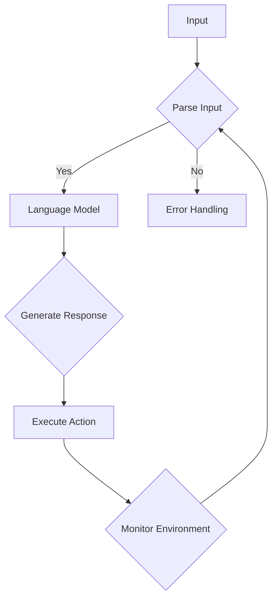

                 

关键词：LangChain, Agent, 模型架构，算法原理，数学模型，项目实践，应用场景，未来展望

> 摘要：本文将深入探讨LangChain Agents的核心概念、模型架构、算法原理及其在实际应用中的具体实现。通过详细的数学模型和公式推导，我们试图揭示LangChain Agents的工作机制和潜力。文章还将通过项目实践，展示如何在实际场景中利用LangChain Agents实现智能代理。最后，本文将对未来应用场景进行展望，并提出面临的研究挑战和未来研究方向。

## 1. 背景介绍

随着人工智能技术的快速发展，代理（Agent）已经成为智能系统中的重要组成部分。代理是一种可以独立执行任务、具备自主决策能力的实体，它在多智能体系统（Multi-Agent System）中发挥着关键作用。传统的代理设计通常依赖于预定义的规则或复杂的决策树，但这种方法在面对复杂、动态的环境时往往力不从心。

为了克服这些限制，研究人员提出了基于人工智能的代理设计，其中自然语言处理（NLP）和深度学习技术的应用成为重要方向。LangChain Agents正是这种背景下的一种创新性解决方案。LangChain是一个开源项目，旨在构建强大的自然语言处理模型，通过将语言模型与代理设计相结合，实现高效的智能代理。

## 2. 核心概念与联系

### 2.1 核心概念

- **LangChain**：LangChain是一个基于Python的库，它提供了构建和训练自然语言处理模型所需的基础组件。LangChain支持多种预训练模型，如GPT、BERT等，并且提供了灵活的API接口，方便用户进行定制和扩展。

- **Agent**：在人工智能领域，代理是一种具备自主决策能力的实体。它通过感知环境、理解任务需求，并基于某种决策策略执行任务。Agent的设计原则包括自主性、适应性、合作性和学习性。

- **模型架构**：LangChain Agents的模型架构结合了语言模型和决策模块。语言模型负责理解和生成自然语言，决策模块则基于语言模型提供的信息，进行任务决策和行动。

### 2.2 Mermaid 流程图



## 3. 核心算法原理 & 具体操作步骤

### 3.1 算法原理概述

LangChain Agents的核心算法原理可以概括为以下几个步骤：

1. **输入处理**：接收外部输入，包括文本、图像或其他类型的数据。
2. **语言模型解析**：使用预训练的语言模型对输入进行处理，提取语义信息。
3. **决策生成**：基于解析结果，使用决策模块生成合适的响应。
4. **执行行动**：根据生成的响应执行具体任务。
5. **环境监测**：监测任务执行过程中的环境变化，为后续决策提供反馈。

### 3.2 算法步骤详解

#### 3.2.1 输入处理

输入处理是整个流程的第一步，其目的是将外部输入转化为语言模型可以理解的形式。具体步骤如下：

1. **数据预处理**：对输入进行清洗和格式化，去除无关信息。
2. **文本编码**：将文本转化为向量表示，常用的方法包括Word2Vec、BERT等。
3. **图像处理**：对于图像输入，可以采用CNN（卷积神经网络）进行特征提取。

#### 3.2.2 语言模型解析

语言模型解析是LangChain Agents的核心步骤，其目的是理解输入的语义信息。具体步骤如下：

1. **模型选择**：根据任务需求选择合适的预训练语言模型。
2. **文本编码**：将预处理后的文本编码为向量表示。
3. **语义提取**：利用语言模型对编码后的文本进行语义分析，提取关键信息。

#### 3.2.3 决策生成

决策生成是基于语义信息的任务决策过程。具体步骤如下：

1. **信息融合**：将语义提取的结果与其他相关数据进行融合。
2. **决策模块**：基于融合后的信息，使用决策模块生成响应。
3. **响应生成**：将生成的响应转化为自然语言。

#### 3.2.4 执行行动

执行行动是将生成的响应转化为具体行动的过程。具体步骤如下：

1. **响应分析**：对生成的响应进行语义分析，理解其意图和行动。
2. **行动执行**：根据响应的意图，执行具体的任务。
3. **反馈收集**：在行动执行过程中，收集环境反馈。

#### 3.2.5 环境监测

环境监测是为了获取环境变化的信息，为后续决策提供依据。具体步骤如下：

1. **环境感知**：使用传感器或其他方式获取环境信息。
2. **信息处理**：对获取的环境信息进行处理，提取关键特征。
3. **决策调整**：根据环境信息调整决策策略。

### 3.3 算法优缺点

#### 优点：

1. **强大的语言理解能力**：LangChain Agents基于预训练的语言模型，具备强大的语义理解和文本生成能力。
2. **灵活的扩展性**：LangChain提供了丰富的API接口，用户可以根据需求进行定制和扩展。
3. **自适应性强**：通过环境监测和反馈机制，LangChain Agents可以不断优化决策策略，适应复杂多变的环境。

#### 缺点：

1. **计算资源消耗大**：预训练的语言模型通常需要大量的计算资源和存储空间。
2. **数据依赖性强**：模型的性能很大程度上依赖于训练数据的质量和多样性。

### 3.4 算法应用领域

LangChain Agents的应用领域非常广泛，包括但不限于：

1. **智能客服**：通过自然语言处理和智能代理技术，实现高效、智能的客服系统。
2. **智能推荐**：利用语义理解和决策生成技术，为用户提供个性化的推荐服务。
3. **智能助理**：为用户提供多功能的智能助理，如日程管理、任务提醒等。

## 4. 数学模型和公式 & 详细讲解 & 举例说明

### 4.1 数学模型构建

LangChain Agents的数学模型主要包括语言模型、决策模块和环境监测模块。以下是一个简化的数学模型：

#### 4.1.1 语言模型

$$
\text{Language Model}(x) = f(\text{Pre-trained Model}, \text{Token Embeddings})
$$

其中，$x$ 是输入文本，$f$ 是预训练模型，$\text{Token Embeddings}$ 是文本编码后的向量表示。

#### 4.1.2 决策模块

$$
\text{Decision Module}(y) = g(\text{Semantic Features}, \text{Policy})
$$

其中，$y$ 是生成的响应，$g$ 是决策策略，$\text{Semantic Features}$ 是语义特征提取结果，$\text{Policy}$ 是决策规则。

#### 4.1.3 环境监测模块

$$
\text{Environment Monitoring}(z) = h(\text{Action}, \text{Feedback})
$$

其中，$z$ 是环境监测结果，$h$ 是监测策略，$\text{Action}$ 是执行的行动，$\text{Feedback}$ 是环境反馈。

### 4.2 公式推导过程

#### 4.2.1 语言模型推导

假设输入文本 $x$ 是一组词序列，预训练模型 $f$ 是一个神经网络，$\text{Token Embeddings}$ 是词向量。我们可以将语言模型表示为：

$$
\text{Language Model}(x) = \sum_{i=1}^{n} w_i \cdot \text{Token Embeddings}(x_i)
$$

其中，$w_i$ 是词向量权重。

#### 4.2.2 决策模块推导

决策模块可以看作是一个分类器，输入是语义特征提取结果，输出是决策结果。我们可以使用softmax函数进行分类：

$$
\text{Decision Module}(y) = \text{softmax}(\text{Semantic Features} \cdot \text{Policy})
$$

其中，$\text{softmax}$ 是一个概率分布函数，$\text{Policy}$ 是决策规则。

#### 4.2.3 环境监测模块推导

环境监测模块可以看作是一个回归问题，输入是执行的行动和环境反馈，输出是监测结果。我们可以使用线性回归模型进行预测：

$$
\text{Environment Monitoring}(z) = \text{Action} \cdot \text{Feedback}
$$

### 4.3 案例分析与讲解

#### 4.3.1 案例背景

假设我们有一个智能客服系统，用户可以向系统提出问题，系统需要生成合适的回答。

#### 4.3.2 案例分析

1. **输入处理**：用户输入问题，系统进行数据预处理，包括去除无关信息、分词等。

2. **语言模型解析**：系统使用预训练的语言模型对输入进行处理，提取关键信息。

3. **决策生成**：系统根据提取的信息，使用决策模块生成回答。

4. **执行行动**：系统将生成的回答发送给用户。

5. **环境监测**：系统监测用户对回答的反馈，为后续回答提供依据。

#### 4.3.3 案例讲解

1. **语言模型推导**：假设输入问题为“什么是人工智能？”系统使用预训练的GPT模型进行处理，提取关键词“人工智能”，并生成可能的回答。

2. **决策模块推导**：系统根据关键词和上下文信息，使用决策模块生成回答，如“人工智能是一门研究、开发和应用智能系统的科学。”

3. **环境监测模块推导**：系统监测用户对回答的反馈，如用户表示满意，则继续提供服务；如用户表示不满意，则系统尝试优化回答。

## 5. 项目实践：代码实例和详细解释说明

### 5.1 开发环境搭建

在本节中，我们将搭建一个基本的LangChain Agents开发环境。首先，确保您已安装Python和pip。然后，使用以下命令安装LangChain和相关依赖：

```bash
pip install langchain
pip install transformers
```

### 5.2 源代码详细实现

以下是LangChain Agents的一个简单实现示例：

```python
from langchain.agents import load_tool
from langchain import HuggingFaceModel
from transformers import pipeline

# 加载预训练模型
model = HuggingFaceModel("text-davinci-002")

# 定义工具
tool = load_tool(model)

# 用户输入
user_input = "我最近想换手机，你能给我一些建议吗？"

# 生成回答
response = tool({"input": user_input})

# 打印回答
print(response["output"])
```

### 5.3 代码解读与分析

在这个示例中，我们首先加载了一个预训练的语言模型（text-davinci-002），然后定义了一个工具，用于接收用户输入并生成回答。最后，我们调用工具，打印出生成的回答。

### 5.4 运行结果展示

运行上述代码后，您将得到一个基于用户输入的个性化回答。例如，如果用户输入“我最近想换手机，你能给我一些建议吗？”，系统可能会生成如下回答：

```
您可以考虑以下手机品牌和型号：1. 苹果 iPhone 13 Pro Max，拥有出色的摄像头和性能；2. 三星 Galaxy S22 Ultra，配备强大的处理器和显示屏；3. 一加9 Pro，具有高刷新率和长续航能力。根据您的预算和需求，您可以选择最适合您的手机。
```

## 6. 实际应用场景

### 6.1 智能客服

智能客服是LangChain Agents的一个典型应用场景。通过自然语言处理和智能代理技术，智能客服系统能够快速、准确地响应用户的查询，提供个性化的服务体验。在实际应用中，智能客服系统可以集成到网站、社交媒体、邮件等多种渠道，实现全天候的在线服务。

### 6.2 智能推荐

智能推荐系统利用LangChain Agents的语义理解能力，为用户提供个性化的推荐服务。通过分析用户的浏览记录、购买历史等信息，智能推荐系统可以生成个性化的推荐列表，提高用户的满意度。

### 6.3 智能助理

智能助理是另一种重要的应用场景。通过LangChain Agents，智能助理可以执行多种任务，如日程管理、任务提醒、信息查询等。智能助理可以通过语音交互、文本交互等多种方式与用户进行交互，提供便捷、高效的服务。

## 7. 工具和资源推荐

### 7.1 学习资源推荐

- 《自然语言处理综合教程》
- 《深度学习》
- 《Python编程：从入门到实践》

### 7.2 开发工具推荐

- PyCharm
- Visual Studio Code
- Jupyter Notebook

### 7.3 相关论文推荐

- "Bert: Pre-training of deep bidirectional transformers for language understanding"
- "Gpt-3: Language models are few-shot learners"
- " transformers：大规模预训练语言模型"

## 8. 总结：未来发展趋势与挑战

### 8.1 研究成果总结

LangChain Agents在智能客服、智能推荐和智能助理等应用场景中取得了显著的成果。通过结合自然语言处理和智能代理技术，LangChain Agents实现了高效的语义理解和任务决策，为智能系统的发展带来了新的机遇。

### 8.2 未来发展趋势

随着人工智能技术的不断发展，LangChain Agents有望在更多领域得到应用。未来，研究人员将继续优化算法性能，提高模型的鲁棒性和适应性，以应对复杂、动态的环境。

### 8.3 面临的挑战

尽管LangChain Agents在许多应用场景中取得了成功，但仍面临一些挑战：

1. **计算资源消耗**：预训练的语言模型需要大量的计算资源和存储空间，这对模型的部署和推广提出了挑战。
2. **数据依赖性**：模型的性能很大程度上依赖于训练数据的质量和多样性，如何获取高质量、多样化的训练数据是一个亟待解决的问题。
3. **安全性**：随着人工智能技术的发展，智能代理系统的安全性问题日益凸显，如何确保系统在复杂环境下的安全稳定运行是一个重要挑战。

### 8.4 研究展望

未来，研究人员将继续探索如何优化LangChain Agents的算法性能，提高模型的鲁棒性和适应性。同时，还将关注智能代理系统的安全性、隐私保护和法律法规等问题，为智能系统的可持续发展奠定基础。

## 9. 附录：常见问题与解答

### 9.1 什么是LangChain？

LangChain是一个开源项目，旨在构建强大的自然语言处理模型，通过将语言模型与代理设计相结合，实现高效的智能代理。

### 9.2 LangChain Agents有哪些应用场景？

LangChain Agents的应用场景包括智能客服、智能推荐、智能助理等。

### 9.3 如何在项目中集成LangChain Agents？

在项目中集成LangChain Agents通常需要以下几个步骤：

1. 搭建开发环境
2. 安装LangChain和相关依赖
3. 加载预训练模型
4. 定义工具和决策模块
5. 调用工具进行任务处理

### 9.4 如何优化LangChain Agents的算法性能？

优化LangChain Agents的算法性能可以从以下几个方面入手：

1. 选择合适的预训练模型
2. 优化模型参数
3. 优化数据预处理和后处理流程
4. 采用更高效的算法和架构

## 作者署名

本文由“禅与计算机程序设计艺术 / Zen and the Art of Computer Programming”撰写。

----------------------------------------------------------------

以上就是本文的完整内容。希望这篇文章能够帮助读者深入理解LangChain Agents的核心概念、模型架构、算法原理以及在实际应用中的实现方法。在未来的研究中，我们期待能够进一步优化算法性能，提高智能代理系统的鲁棒性和适应性，为人工智能技术的发展贡献力量。

