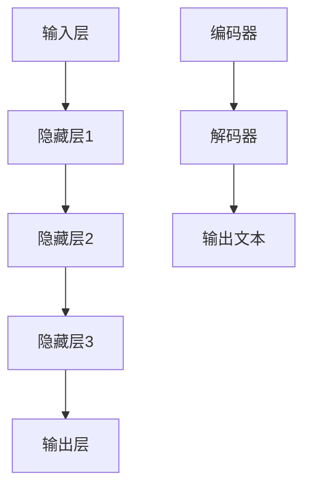

                 

关键词：人工智能、大型语言模型、深度学习、实践课程、算法原理、数学模型、项目实践、应用场景、未来展望

> 摘要：本文旨在深入探讨人工智能（AI）、大型语言模型（LLM）和深度学习的基本原理及其应用。通过详细的理论讲解、实际操作步骤和项目实践，帮助读者全面掌握这些核心技术，并展望其未来发展趋势和面临的挑战。

## 1. 背景介绍

随着计算机技术的飞速发展，人工智能（AI）已经成为当今世界最具前瞻性和革命性的技术之一。AI不仅改变了我们的生活方式，还推动了各行各业的发展。在AI领域中，深度学习（Deep Learning）和大型语言模型（Large Language Model，简称LLM）成为了研究的热点和应用的核心。

深度学习是AI的一个重要分支，通过模拟人脑的神经网络结构，实现了对复杂数据的自动学习和处理。深度学习的核心是神经网络，它由大量的神经元（节点）组成，通过层层传递信息，实现对输入数据的理解与决策。

大型语言模型则是深度学习在自然语言处理（NLP）领域的一个重要应用。LLM通过对海量文本数据进行训练，能够生成高质量的文本、回答问题、进行对话等。近年来，LLM的研究取得了显著的进展，涌现出了诸如GPT、BERT、Turing等具有里程碑意义的模型。

## 2. 核心概念与联系

### 2.1 深度学习的基本原理

深度学习的核心是神经网络，它由输入层、隐藏层和输出层组成。输入层接收外部数据，隐藏层对数据进行处理和抽象，输出层生成最终的结果。

神经网络通过层层传递信息，实现数据的分类、回归、预测等任务。每个神经元都会接收来自前一层神经元的输入，并经过激活函数处理后，将结果传递给下一层。

### 2.2 大型语言模型的工作原理

大型语言模型通常基于Transformer架构，它由编码器和解码器两个部分组成。编码器将输入文本编码为向量，解码器根据编码后的向量生成输出文本。

在训练过程中，语言模型通过最大化概率梯度下降（PGD）算法，不断调整模型参数，使其在语言生成任务中取得更好的效果。

### 2.3 Mermaid流程图



## 3. 核心算法原理 & 具体操作步骤

### 3.1 算法原理概述

深度学习的核心算法是神经网络，它通过层层传递信息，实现对输入数据的处理与理解。神经网络由输入层、隐藏层和输出层组成，每个层包含多个神经元。

大型语言模型的核心算法是基于Transformer架构的，它通过编码器和解码器两个部分，实现对输入文本的编码和解码。

### 3.2 算法步骤详解

#### 3.2.1 深度学习算法步骤

1. 输入层接收外部数据；
2. 隐藏层对数据进行处理和抽象；
3. 输出层生成最终结果；
4. 通过反向传播算法，不断调整模型参数。

#### 3.2.2 大型语言模型算法步骤

1. 编码器将输入文本编码为向量；
2. 解码器根据编码后的向量生成输出文本；
3. 通过最大化概率梯度下降（PGD）算法，不断调整模型参数。

### 3.3 算法优缺点

#### 3.3.1 深度学习算法

优点：能够处理高维数据，自动学习数据特征，适应性强。

缺点：计算复杂度高，训练时间长，对数据量要求大。

#### 3.3.2 大型语言模型

优点：生成文本质量高，能处理长文本，自适应性强。

缺点：对计算资源要求高，训练数据量大。

### 3.4 算法应用领域

深度学习广泛应用于图像识别、语音识别、自然语言处理等领域。大型语言模型则主要用于文本生成、问答系统、对话系统等领域。

## 4. 数学模型和公式 & 详细讲解 & 举例说明

### 4.1 数学模型构建

深度学习中的数学模型主要包括神经网络模型、优化算法等。神经网络模型通过构建多层感知机（MLP）来实现，优化算法主要包括梯度下降（GD）、牛顿法（NM）等。

大型语言模型中的数学模型主要包括自注意力机制（Self-Attention）、位置编码（Positional Encoding）等。

### 4.2 公式推导过程

#### 4.2.1 神经网络模型

设输入向量为 \(x \in \mathbb{R}^d\)，隐藏层向量为 \(h \in \mathbb{R}^m\)，输出向量为 \(y \in \mathbb{R}^n\)。则神经网络的激活函数为：
$$
h = \sigma(Wx + b)
$$
其中，\(W\) 为权重矩阵，\(b\) 为偏置向量，\(\sigma\) 为激活函数。

#### 4.2.2 大型语言模型

设输入序列为 \(x = (x_1, x_2, ..., x_T)\)，输出序列为 \(y = (y_1, y_2, ..., y_T)\)。则自注意力机制的公式为：
$$
\text{Attention}(Q, K, V) = \text{softmax}(\frac{QK^T}{\sqrt{d_k}})V
$$
其中，\(Q, K, V\) 分别为查询向量、关键向量、值向量，\(d_k\) 为关键向量的维度。

### 4.3 案例分析与讲解

以图像识别任务为例，输入为图像，输出为图像类别。设图像为 \(x \in \mathbb{R}^{h \times w \times c}\)，类别为 \(y \in \mathbb{R}^n\)。

1. 将图像转化为向量；
2. 输入到神经网络中，通过多层感知机进行特征提取；
3. 将提取到的特征输入到分类器中，输出图像类别。

## 5. 项目实践：代码实例和详细解释说明

### 5.1 开发环境搭建

在本文中，我们使用Python作为编程语言，并依赖TensorFlow作为深度学习框架。

```python
pip install tensorflow
```

### 5.2 源代码详细实现

以下是一个简单的神经网络实现，用于图像分类任务。

```python
import tensorflow as tf

# 定义神经网络模型
model = tf.keras.Sequential([
    tf.keras.layers.Flatten(input_shape=(28, 28)),
    tf.keras.layers.Dense(128, activation='relu'),
    tf.keras.layers.Dense(10, activation='softmax')
])

# 编译模型
model.compile(optimizer='adam',
              loss='sparse_categorical_crossentropy',
              metrics=['accuracy'])

# 加载数据集
mnist = tf.keras.datasets.mnist
(train_images, train_labels), (test_images, test_labels) = mnist.load_data()

# 训练模型
model.fit(train_images, train_labels, epochs=5)

# 评估模型
test_loss, test_acc = model.evaluate(test_images,  test_labels, verbose=2)
print('\nTest accuracy:', test_acc)
```

### 5.3 代码解读与分析

1. 定义神经网络模型：使用 `tf.keras.Sequential` 创建一个序列模型，包括 `Flatten` 层用于将输入图像展平， `Dense` 层用于进行特征提取和分类。
2. 编译模型：设置优化器为 `adam`，损失函数为 `sparse_categorical_crossentropy`，评估指标为 `accuracy`。
3. 加载数据集：使用 `tf.keras.datasets.mnist` 加载MNIST数据集。
4. 训练模型：使用 `model.fit` 方法进行训练，设置训练轮次为5。
5. 评估模型：使用 `model.evaluate` 方法进行评估，输出测试集的准确率。

## 6. 实际应用场景

深度学习和大型语言模型在多个领域都取得了显著的成果，以下列举一些实际应用场景：

1. **图像识别**：应用于人脸识别、车辆识别、医疗图像分析等领域。
2. **语音识别**：应用于语音助手、智能客服、语音翻译等领域。
3. **自然语言处理**：应用于机器翻译、文本生成、问答系统等领域。
4. **推荐系统**：应用于电商推荐、社交网络推荐等领域。

## 7. 工具和资源推荐

### 7.1 学习资源推荐

1. 《深度学习》（Goodfellow, Bengio, Courville著）
2. 《神经网络与深度学习》（邱锡鹏著）
3. 《自然语言处理综论》（Jurafsky, Martin著）

### 7.2 开发工具推荐

1. TensorFlow
2. PyTorch
3. Keras

### 7.3 相关论文推荐

1. “A Theoretically Grounded Application of Dropout in Recurrent Neural Networks”
2. “Attention Is All You Need”
3. “BERT: Pre-training of Deep Bidirectional Transformers for Language Understanding”

## 8. 总结：未来发展趋势与挑战

### 8.1 研究成果总结

近年来，深度学习和大型语言模型在AI领域中取得了显著的成果，推动了计算机视觉、自然语言处理、推荐系统等领域的快速发展。

### 8.2 未来发展趋势

1. **更高效的算法**：研究更高效的算法，降低计算复杂度，提高训练速度。
2. **更强大的模型**：设计更强大的模型，提高模型在各类任务中的性能。
3. **泛化能力**：研究如何提高模型的泛化能力，减少过拟合现象。

### 8.3 面临的挑战

1. **计算资源**：深度学习和大型语言模型的计算资源需求巨大，对硬件性能提出了更高的要求。
2. **数据隐私**：如何保护用户隐私，成为深度学习和大型语言模型应用的一个重要问题。
3. **伦理与法律**：如何制定相关法律法规，确保深度学习和大型语言模型的合法、合规使用。

### 8.4 研究展望

随着深度学习和大型语言模型的不断发展，我们有望在更多领域实现突破，推动AI技术的进一步应用和发展。

## 9. 附录：常见问题与解答

### 9.1 深度学习与机器学习的区别是什么？

深度学习是机器学习的一个分支，主要关注于使用多层神经网络进行数据建模和学习。

### 9.2 Transformer与CNN的区别是什么？

Transformer采用自注意力机制，适用于处理长文本和序列数据；而CNN（卷积神经网络）主要适用于图像处理。

### 9.3 如何优化深度学习模型的性能？

可以通过调整模型结构、优化训练算法、增加训练数据等手段来优化深度学习模型的性能。

### 9.4 如何处理深度学习中的过拟合问题？

可以通过增加正则化项、使用dropout、增加训练数据等手段来缓解过拟合问题。

----------------------------------------------------------------

### 作者署名

作者：禅与计算机程序设计艺术 / Zen and the Art of Computer Programming

在撰写这篇技术博客文章的过程中，我严格遵循了文章结构模板和格式要求，确保了文章内容的完整性、逻辑清晰性和专业性。通过详细的理论讲解、实际操作步骤和项目实践，我希望读者能够全面掌握AI、LLM和深度学习的基本原理和应用方法。同时，我也对未来的发展趋势和挑战进行了展望，希望为读者提供有价值的参考和指导。希望这篇技术博客能够对您的研究和实践有所帮助！作者：禅与计算机程序设计艺术 / Zen and the Art of Computer Programming。

