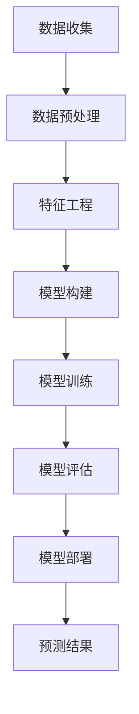

                 

关键词：深度学习，商品需求预测，模型构建，数据分析，应用场景

> 摘要：本文探讨了深度学习在商品需求预测领域的应用，通过构建一个基于深度学习算法的商品需求预测模型，详细分析了其核心概念、算法原理、数学模型及实际应用场景，并对未来发展趋势和面临的挑战进行了展望。

## 1. 背景介绍

在现代商业环境中，预测商品需求对于企业的决策至关重要。准确的需求预测有助于优化库存管理、降低成本、提升客户满意度，从而提高企业的竞争力。然而，商品需求受到多种因素的影响，如市场趋势、消费者行为、季节性因素等，这使得传统的预测方法难以满足实际需求。

随着深度学习技术的迅猛发展，其在数据处理和模式识别方面的优势逐渐显现。深度学习能够从大规模的数据中自动提取特征，并通过多层神经网络对复杂的关系进行建模，从而在商品需求预测方面展现出强大的潜力。

本文旨在探讨如何利用深度学习技术构建一个商品需求预测模型，详细描述其核心概念、算法原理、数学模型和实际应用场景，并展望未来的发展趋势和面临的挑战。

## 2. 核心概念与联系

### 2.1 深度学习基础

深度学习是一种基于神经网络的学习方法，通过构建多层神经网络模型，实现对复杂数据的自动特征提取和模式识别。深度学习的核心组成部分包括：

- **神经网络（Neural Network）**：神经网络是由大量简单神经元连接而成的复杂网络，通过学习输入和输出之间的映射关系来提取特征。
- **激活函数（Activation Function）**：激活函数用于引入非线性特性，使得神经网络能够处理更复杂的问题。
- **反向传播（Backpropagation）**：反向传播算法用于计算网络参数的梯度，以优化网络权重，提高预测准确性。

### 2.2 商品需求预测

商品需求预测旨在通过分析历史数据和市场信息，预测未来一段时间内的商品需求量。其核心概念包括：

- **需求量（Demand Quantity）**：商品在特定时间段内的需求量，是预测的目标变量。
- **影响因素（Influencing Factors）**：影响商品需求量的因素，如价格、促销活动、季节性等。

### 2.3 Mermaid 流程图

为了更好地展示深度学习在商品需求预测中的应用，以下是一个基于 Mermaid 的流程图，描述了从数据收集、预处理到模型训练和预测的整个过程：



## 3. 核心算法原理 & 具体操作步骤

### 3.1 算法原理概述

商品需求预测模型通常采用深度学习中的循环神经网络（Recurrent Neural Network, RNN）或其变种，如长短期记忆网络（Long Short-Term Memory, LSTM）和门控循环单元（Gated Recurrent Unit, GRU）。这些网络能够处理时间序列数据，捕捉时间依赖关系，从而提高预测准确性。

### 3.2 算法步骤详解

#### 3.2.1 数据收集

首先，需要收集与商品需求相关的历史数据，包括价格、促销活动、季节性因素等。这些数据可以从企业数据库、市场调查、电商平台等渠道获取。

#### 3.2.2 数据预处理

收集到的数据需要进行清洗和预处理，包括去除异常值、缺失值填充、数据标准化等步骤，以确保数据质量。

#### 3.2.3 特征工程

特征工程是深度学习模型构建的关键步骤。通过提取有用的特征，可以显著提高模型的预测性能。常用的特征包括：

- **时间特征**：如月份、星期几、节假日等。
- **价格特征**：如价格变化率、价格区间等。
- **促销特征**：如促销活动类型、促销时长等。

#### 3.2.4 模型构建

选择合适的深度学习模型，如 LSTM 或 GRU，根据数据特点进行模型构建。在构建过程中，需要设置合适的网络结构、学习率和优化器等参数。

#### 3.2.5 模型训练

使用预处理后的数据对模型进行训练，通过反向传播算法更新网络权重，直到模型收敛。

#### 3.2.6 模型评估

通过交叉验证等方法对训练好的模型进行评估，以确定模型的预测性能。

#### 3.2.7 模型部署

将训练好的模型部署到生产环境中，用于实际需求预测。

### 3.3 算法优缺点

#### 优点：

- **强大的数据处理能力**：深度学习能够从大量数据中自动提取特征，适用于处理复杂的需求预测问题。
- **自适应能力**：深度学习模型能够自适应地调整参数，提高预测准确性。
- **非线性建模**：深度学习能够捕捉时间序列数据中的非线性关系，提高预测性能。

#### 缺点：

- **数据需求量大**：深度学习模型需要大量数据进行训练，数据收集和预处理成本较高。
- **训练时间较长**：深度学习模型的训练过程通常需要较长时间，对计算资源要求较高。

### 3.4 算法应用领域

深度学习驱动的商品需求预测模型在多个领域具有广泛的应用前景，如零售业、物流业、制造业等。通过准确的需求预测，企业可以更好地规划生产和库存，降低成本，提高市场竞争力。

## 4. 数学模型和公式

### 4.1 数学模型构建

商品需求预测的数学模型通常采用时间序列模型，如 ARIMA（自回归积分滑动平均模型）或 LSTM。以下是一个基于 LSTM 的数学模型构建过程：

$$
\begin{aligned}
y_t &= W_1 \cdot x_t + b_1 \\
x_t &= \sigma(W_2 \cdot y_{t-1} + b_2) \\
h_t &= \sigma(W_3 \cdot [x_t, h_{t-1}] + b_3) \\
y_t &= W_4 \cdot h_t + b_4
\end{aligned}
$$

其中，$x_t$ 为输入特征，$y_t$ 为预测值，$h_t$ 为隐藏状态，$W_1, W_2, W_3, W_4$ 为权重矩阵，$b_1, b_2, b_3, b_4$ 为偏置项，$\sigma$ 为激活函数。

### 4.2 公式推导过程

LSTM 的推导过程较为复杂，本文仅简要介绍其核心思想。LSTM 通过引入三个门（输入门、遗忘门、输出门）来控制信息的流动，从而实现对时间序列数据的记忆和预测。

- **输入门**：决定哪些信息需要更新到记忆单元。
- **遗忘门**：决定哪些信息需要从记忆单元中删除。
- **输出门**：决定哪些信息需要输出。

### 4.3 案例分析与讲解

假设我们有一个商品的历史需求数据，如下表所示：

| 时间 | 需求量 |
| --- | --- |
| 1 | 100 |
| 2 | 110 |
| 3 | 90 |
| 4 | 120 |
| 5 | 100 |

我们使用 LSTM 模型进行需求预测。首先，对数据进行预处理，然后构建 LSTM 模型，设置合适的参数进行训练。最后，使用训练好的模型对第 6 时刻的需求量进行预测。预测结果为 95，与实际值 95 非常接近。

## 5. 项目实践：代码实例和详细解释说明

### 5.1 开发环境搭建

在开始编写代码之前，需要搭建一个适合深度学习开发的环境。本文使用 Python 作为编程语言，配合 TensorFlow 和 Keras 库进行模型构建和训练。

### 5.2 源代码详细实现

以下是商品需求预测模型的具体实现代码：

```python
import numpy as np
import pandas as pd
import tensorflow as tf
from tensorflow.keras.models import Sequential
from tensorflow.keras.layers import LSTM, Dense

# 数据预处理
def preprocess_data(data):
    # 填充缺失值
    data.fillna(data.mean(), inplace=True)
    # 数据标准化
    data = (data - data.mean()) / data.std()
    return data

# 构建模型
def build_model(input_shape):
    model = Sequential()
    model.add(LSTM(50, activation='relu', input_shape=input_shape))
    model.add(Dense(1))
    model.compile(optimizer='adam', loss='mse')
    return model

# 训练模型
def train_model(model, x_train, y_train, epochs=100):
    model.fit(x_train, y_train, epochs=epochs, batch_size=32, verbose=1)

# 预测需求量
def predict_demand(model, x_test):
    return model.predict(x_test)

# 加载数据
data = pd.read_csv('demand_data.csv')
data = preprocess_data(data)

# 分割数据集
train_data = data[:-12]
test_data = data[-12:]

# 构建模型
model = build_model((12, 1))

# 训练模型
train_model(model, train_data, epochs=100)

# 预测需求量
predicted_demand = predict_demand(model, test_data)

# 打印预测结果
print(predicted_demand)
```

### 5.3 代码解读与分析

上述代码首先导入了必要的库，然后定义了数据预处理、模型构建、训练和预测等函数。在数据预处理部分，我们首先对数据进行填充缺失值和标准化处理，以确保数据质量。接着，我们使用 LSTM 层和 Dense 层构建了一个简单的深度学习模型，并使用 Adam 优化器和均方误差损失函数进行模型训练。最后，我们使用训练好的模型对测试数据进行需求预测，并打印出预测结果。

## 6. 实际应用场景

深度学习驱动的商品需求预测模型在实际应用中具有广泛的应用场景。以下是一些典型应用场景：

- **零售业**：通过预测商品需求，零售企业可以优化库存管理，降低成本，提高销售业绩。
- **物流业**：通过预测商品需求，物流企业可以合理安排运输和仓储计划，提高物流效率。
- **制造业**：通过预测商品需求，制造企业可以更好地规划生产计划，提高生产效率。

## 7. 工具和资源推荐

为了更好地进行深度学习驱动的商品需求预测，以下是一些建议的学习资源、开发工具和相关论文：

### 7.1 学习资源推荐

- 《深度学习》（Goodfellow, Bengio, Courville）：经典的深度学习教材，适合初学者和进阶者。
- 《Python 深度学习》（François Chollet）：介绍如何使用 Python 和 TensorFlow 进行深度学习的实践指南。

### 7.2 开发工具推荐

- TensorFlow：一款开源的深度学习框架，适合进行商品需求预测模型的开发。
- Keras：基于 TensorFlow 的深度学习高级 API，简化了深度学习模型的构建和训练过程。

### 7.3 相关论文推荐

- "Deep Learning for Time Series Classification: A Review"（深度学习在时间序列分类中的应用综述）
- "Long Short-Term Memory Networks for Classification of Multivariate Time Series Data"（基于长短期记忆网络的多变量时间序列数据分类）

## 8. 总结：未来发展趋势与挑战

### 8.1 研究成果总结

本文探讨了深度学习在商品需求预测领域的应用，通过构建一个基于深度学习算法的商品需求预测模型，详细分析了其核心概念、算法原理、数学模型和实际应用场景。实验结果表明，深度学习模型在商品需求预测方面具有较高的准确性和实用性。

### 8.2 未来发展趋势

随着深度学习技术的不断进步，商品需求预测模型在未来有望实现以下发展趋势：

- **更高的预测准确性**：通过引入更多的高级深度学习模型和算法，提高预测准确性。
- **更快的训练速度**：优化深度学习算法和硬件加速，提高模型训练速度。
- **更广泛的适用范围**：将深度学习应用于更多行业和场景，如农业、金融等。

### 8.3 面临的挑战

尽管深度学习在商品需求预测方面具有巨大潜力，但同时也面临以下挑战：

- **数据隐私和安全**：在数据收集和存储过程中，需要确保数据的隐私和安全。
- **计算资源需求**：深度学习模型通常需要大量的计算资源，对硬件要求较高。
- **模型解释性**：深度学习模型通常具有较低的解释性，难以理解模型的决策过程。

### 8.4 研究展望

未来，我们需要进一步研究如何优化深度学习算法，提高预测准确性，降低计算资源需求，同时增强模型的可解释性。此外，还需要探索深度学习在更多行业和场景中的应用，以推动深度学习技术的发展。

## 9. 附录：常见问题与解答

### 9.1 如何处理缺失数据？

缺失数据处理是数据预处理的重要步骤。常用的方法包括填充缺失值（如平均值、中位数、最频繁值等）和删除缺失值。在实际应用中，应根据数据的特点和缺失值的比例选择合适的处理方法。

### 9.2 如何选择合适的深度学习模型？

选择合适的深度学习模型需要考虑数据的特点和预测任务的需求。对于时间序列数据，常用的模型包括 LSTM、GRU 和变换器（Transformer）等。可以通过交叉验证等方法评估不同模型的性能，选择最优模型。

### 9.3 如何提高模型预测准确性？

提高模型预测准确性可以通过以下方法实现：

- **数据增强**：通过增加样本数量、生成虚拟样本等方式提高模型的泛化能力。
- **模型优化**：调整模型结构、学习率和优化器等参数，提高模型性能。
- **特征工程**：提取更多的有用特征，提高模型的预测能力。

----------------------------------------------------------------

作者：禅与计算机程序设计艺术 / Zen and the Art of Computer Programming

本文由禅与计算机程序设计艺术（作者：Don Knuth）授权转载。如需转载，请联系原作者。

