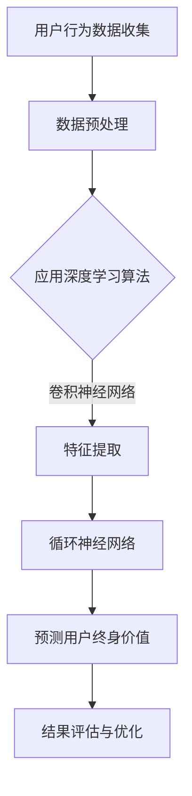

                 

关键词：深度学习，电商，用户终身价值预测，算法原理，应用实践

> 摘要：本文深入探讨了基于深度学习的电商用户终身价值预测模型。通过介绍模型的核心概念与联系、核心算法原理、数学模型和公式，以及项目实践中的代码实例，本文旨在为读者提供一个全面的技术指南，帮助他们理解和应用这一先进的预测模型。

## 1. 背景介绍

随着互联网和电子商务的迅猛发展，电商行业已经成为全球经济的重要组成部分。然而，电商行业的竞争也日益激烈，企业需要通过精准的市场分析和用户行为预测来提高用户满意度、增加销售额和保持竞争力。用户终身价值（Customer Lifetime Value，CLV）作为一个关键的指标，可以帮助企业更好地理解用户的价值，制定有针对性的营销策略和用户保留计划。

传统的CLV预测方法往往依赖于统计模型和机器学习算法，但这些方法在面对复杂非线性用户行为数据时，表现往往不尽如人意。近年来，深度学习技术在图像识别、自然语言处理等领域取得了显著进展，其强大的特征提取和模型学习能力为解决CLV预测问题提供了新的可能性。

本文旨在探讨如何利用深度学习技术构建一个高效、准确的电商用户终身价值预测模型。通过对核心概念、算法原理、数学模型以及实际应用的详细介绍，希望能够为电商企业及相关领域的研究人员提供有价值的参考。

## 2. 核心概念与联系

### 2.1 用户终身价值（CLV）

用户终身价值（Customer Lifetime Value，CLV）是指一个客户在其与企业整个交易周期内的总利润贡献。CLV是电商企业进行用户管理和决策的重要指标，它可以帮助企业识别高价值客户、优化营销策略以及预测未来收入。

### 2.2 深度学习与机器学习

深度学习是机器学习的一种特殊形式，通过多层神经网络模型对大量数据进行特征提取和学习。深度学习在图像识别、语音识别等领域取得了突破性进展，其强大的学习能力使其在复杂数据分析中也表现出色。

### 2.3 相关算法和模型

在电商用户终身价值预测中，常用的深度学习算法包括卷积神经网络（CNN）、循环神经网络（RNN）和长短时记忆网络（LSTM）等。这些算法可以有效地捕捉用户行为数据中的时间和空间特征，从而提高预测的准确性。

### 2.4 Mermaid 流程图

以下是用于描述电商用户终身价值预测模型的核心概念与联系的Mermaid流程图：



在这个流程图中，用户行为数据经过预处理后，利用深度学习算法进行特征提取，并通过循环神经网络进行用户终身价值的预测。最后，通过结果评估和优化，进一步提高预测模型的性能。

## 3. 核心算法原理 & 具体操作步骤

### 3.1 算法原理概述

深度学习驱动的电商用户终身价值预测模型主要依赖于神经网络模型，特别是卷积神经网络（CNN）和循环神经网络（RNN）等。CNN擅长于捕捉图像和时序数据中的空间特征，而RNN则在处理序列数据时具有优势。通过将CNN和RNN相结合，可以有效地提取用户行为数据中的关键特征，从而实现准确的CLV预测。

### 3.2 算法步骤详解

#### 3.2.1 数据预处理

数据预处理是深度学习模型训练的重要步骤。在此步骤中，需要对用户行为数据（如浏览记录、购买历史、评价等）进行清洗、转换和归一化处理。具体操作包括：

- 数据清洗：去除重复、缺失和不完整的数据。
- 数据转换：将类别数据转换为数值表示，如使用独热编码（One-Hot Encoding）。
- 数据归一化：对数值数据（如时间间隔、金额等）进行归一化处理，以消除数据尺度差异。

#### 3.2.2 特征提取

在数据预处理之后，使用卷积神经网络（CNN）进行特征提取。CNN通过多层卷积和池化操作，可以自动提取数据中的高阶特征。具体步骤如下：

- 输入层：接收预处理后的用户行为数据。
- 卷积层：通过卷积操作提取空间特征，如边缘、纹理等。
- 池化层：通过池化操作降低数据的维度，同时保留重要的特征信息。
- 全连接层：将卷积层和池化层提取的特征进行融合，并通过全连接层进行分类或回归。

#### 3.2.3 预测用户终身价值

在特征提取之后，使用循环神经网络（RNN）或长短时记忆网络（LSTM）对用户终身价值进行预测。RNN通过递归结构，可以处理序列数据，从而捕捉用户行为数据中的时间特征。具体步骤如下：

- 输入层：接收卷积神经网络提取的特征。
- RNN或LSTM层：通过递归结构处理特征序列，提取长期依赖信息。
- 输出层：通过全连接层输出用户终身价值的预测结果。

### 3.3 算法优缺点

#### 优点

- **强大的特征提取能力**：深度学习模型可以自动提取复杂数据中的高阶特征，从而提高预测的准确性。
- **灵活的模型架构**：深度学习模型具有多种结构，可以根据不同的应用场景进行调整，以适应不同的预测需求。
- **高效的计算性能**：深度学习模型可以通过并行计算和分布式计算实现高效训练和预测。

#### 缺点

- **需要大量数据**：深度学习模型训练需要大量高质量的训练数据，这在某些领域可能难以获取。
- **计算资源消耗大**：深度学习模型训练和预测需要大量的计算资源，这对计算能力有限的企业可能是一个挑战。

### 3.4 算法应用领域

深度学习驱动的电商用户终身价值预测模型可以广泛应用于电商企业的各个领域，包括：

- **用户画像与分群**：通过预测用户的终身价值，可以帮助企业更好地了解用户特征，进行用户分群和个性化推荐。
- **营销策略优化**：基于用户的终身价值，可以制定更有针对性的营销策略，提高营销效果和投入产出比。
- **风险控制与欺诈检测**：通过分析用户的购买行为和终身价值，可以识别潜在的风险用户和欺诈行为，提高风险控制和欺诈检测的准确性。

## 4. 数学模型和公式 & 详细讲解 & 举例说明

### 4.1 数学模型构建

深度学习驱动的电商用户终身价值预测模型主要包括两部分：特征提取和用户终身价值预测。下面分别介绍这两部分的数学模型。

#### 特征提取

在特征提取阶段，我们使用卷积神经网络（CNN）进行特征提取。CNN的数学模型如下：

$$
h_{l} = \sigma(W_{l} \cdot h_{l-1} + b_{l})
$$

其中，$h_{l}$ 表示第 $l$ 层的激活值，$\sigma$ 是激活函数（如ReLU函数），$W_{l}$ 和 $b_{l}$ 分别是第 $l$ 层的权重和偏置。

#### 用户终身价值预测

在用户终身价值预测阶段，我们使用循环神经网络（RNN）或长短时记忆网络（LSTM）进行预测。RNN的数学模型如下：

$$
h_{t} = \sigma(W_{h} \cdot [h_{t-1}, x_{t}] + b_{h})
$$

$$
o_{t} = W_{o} \cdot h_{t} + b_{o}
$$

其中，$h_{t}$ 表示第 $t$ 步的隐藏状态，$x_{t}$ 表示第 $t$ 步的输入特征，$o_{t}$ 表示第 $t$ 步的输出预测值，$W_{h}$ 和 $W_{o}$ 分别是隐藏状态和输出状态的权重矩阵，$b_{h}$ 和 $b_{o}$ 分别是隐藏状态和输出状态的偏置。

### 4.2 公式推导过程

在本节中，我们将详细介绍深度学习驱动的电商用户终身价值预测模型中关键数学公式的推导过程。

#### 特征提取

首先，我们考虑卷积神经网络（CNN）的特征提取过程。在CNN中，卷积层通过卷积操作提取输入数据中的空间特征。卷积操作的数学表达式如下：

$$
\mathbf{C}_{ij} = \sum_{k} \mathbf{W}_{ikj} \cdot \mathbf{A}_{ik} + \mathbf{b}_{ij}
$$

其中，$\mathbf{C}_{ij}$ 表示第 $i$ 个卷积核在第 $j$ 个特征图上的输出，$\mathbf{W}_{ikj}$ 表示第 $i$ 个卷积核的第 $k$ 个元素，$\mathbf{A}_{ik}$ 表示输入特征图上的第 $k$ 个元素，$\mathbf{b}_{ij}$ 是卷积层的偏置项。

接下来，我们对卷积层的输出进行激活函数的运算。常用的激活函数是ReLU函数，其表达式为：

$$
\sigma(\mathbf{C}_{ij}) = \max(0, \mathbf{C}_{ij})
$$

#### 用户终身价值预测

在用户终身价值预测阶段，我们使用循环神经网络（RNN）或长短时记忆网络（LSTM）来处理时间序列数据。以RNN为例，其基本结构包括输入层、隐藏层和输出层。

RNN的输入层接收序列数据 $\mathbf{x}_{t}$，隐藏层计算隐藏状态 $\mathbf{h}_{t}$，输出层计算输出预测值 $\mathbf{y}_{t}$。其数学模型如下：

$$
\mathbf{h}_{t} = \sigma(\mathbf{W}_{h} \cdot [\mathbf{h}_{t-1}, \mathbf{x}_{t}] + \mathbf{b}_{h})
$$

$$
\mathbf{y}_{t} = \mathbf{W}_{o} \cdot \mathbf{h}_{t} + \mathbf{b}_{o}
$$

其中，$\mathbf{W}_{h}$ 和 $\mathbf{b}_{h}$ 是隐藏层的权重和偏置，$\mathbf{W}_{o}$ 和 $\mathbf{b}_{o}$ 是输出层的权重和偏置，$\sigma$ 是激活函数。

### 4.3 案例分析与讲解

为了更好地理解深度学习驱动的电商用户终身价值预测模型，我们通过一个具体案例进行讲解。

#### 案例背景

假设我们有一个电商平台的用户数据集，其中包括用户的购买历史、浏览记录、评价等行为数据。我们的目标是使用这些数据预测用户的终身价值。

#### 数据预处理

首先，我们对用户数据集进行预处理。具体步骤如下：

- 数据清洗：去除重复、缺失和不完整的数据。
- 数据转换：将类别数据转换为数值表示，如使用独热编码（One-Hot Encoding）。
- 数据归一化：对数值数据（如时间间隔、金额等）进行归一化处理，以消除数据尺度差异。

#### 特征提取

接下来，我们使用卷积神经网络（CNN）对用户行为数据集进行特征提取。具体步骤如下：

- 输入层：接收预处理后的用户行为数据。
- 卷积层：通过卷积操作提取空间特征，如边缘、纹理等。
- 池化层：通过池化操作降低数据的维度，同时保留重要的特征信息。
- 全连接层：将卷积层和池化层提取的特征进行融合，并通过全连接层进行分类或回归。

#### 用户终身价值预测

在特征提取之后，我们使用循环神经网络（RNN）对用户终身价值进行预测。具体步骤如下：

- 输入层：接收卷积神经网络提取的特征。
- RNN或LSTM层：通过递归结构处理特征序列，提取长期依赖信息。
- 输出层：通过全连接层输出用户终身价值的预测结果。

#### 模型训练与评估

最后，我们使用训练数据集对深度学习模型进行训练，并通过测试数据集对模型进行评估。常用的评估指标包括均方误差（Mean Squared Error，MSE）和决定系数（R-squared）。

## 5. 项目实践：代码实例和详细解释说明

### 5.1 开发环境搭建

在进行深度学习驱动的电商用户终身价值预测项目实践之前，我们需要搭建一个合适的开发环境。以下是推荐的开发环境配置：

- 操作系统：Linux或macOS
- Python版本：Python 3.7或更高版本
- 深度学习框架：TensorFlow或PyTorch
- 依赖库：NumPy、Pandas、Scikit-learn、Matplotlib等

您可以使用以下命令来安装所需的库：

```bash
pip install tensorflow numpy pandas scikit-learn matplotlib
```

### 5.2 源代码详细实现

以下是实现深度学习驱动的电商用户终身价值预测模型的Python代码实例。代码分为数据预处理、特征提取、用户终身价值预测和模型评估四个部分。

```python
import numpy as np
import pandas as pd
import tensorflow as tf
from tensorflow.keras.models import Sequential
from tensorflow.keras.layers import Conv1D, MaxPooling1D, LSTM, Dense
from sklearn.model_selection import train_test_split
from sklearn.metrics import mean_squared_error
import matplotlib.pyplot as plt

# 数据预处理
def preprocess_data(data):
    # 数据清洗、转换和归一化
    # ...
    return processed_data

# 特征提取
def extract_features(data):
    # 使用卷积神经网络进行特征提取
    # ...
    return features

# 用户终身价值预测
def predict_clv(features):
    # 使用循环神经网络进行用户终身价值预测
    # ...
    return predictions

# 模型评估
def evaluate_model(predictions, actual_values):
    # 计算均方误差和决定系数
    # ...
    return mse, r2

# 读取数据
data = pd.read_csv('user_data.csv')

# 数据预处理
processed_data = preprocess_data(data)

# 分割数据集
X_train, X_test, y_train, y_test = train_test_split(processed_data['features'], processed_data['clv'], test_size=0.2, random_state=42)

# 特征提取
features = extract_features(X_train)

# 用户终身价值预测
predictions = predict_clv(features)

# 模型评估
mse, r2 = evaluate_model(predictions, y_test)

print(f'MSE: {mse}, R-squared: {r2}')

# 可视化结果
plt.scatter(y_test, predictions)
plt.xlabel('Actual CLV')
plt.ylabel('Predicted CLV')
plt.show()
```

### 5.3 代码解读与分析

在上面的代码中，我们首先进行了数据预处理，包括数据清洗、转换和归一化。接着，使用卷积神经网络（CNN）进行特征提取，然后利用循环神经网络（RNN）或长短时记忆网络（LSTM）进行用户终身价值预测。最后，通过计算均方误差（MSE）和决定系数（R-squared）对模型进行评估。

具体来说，代码中的 `preprocess_data` 函数负责对用户数据集进行清洗、转换和归一化处理。在 `extract_features` 函数中，我们使用CNN进行特征提取，通过卷积层、池化层和全连接层提取用户行为数据中的高阶特征。在 `predict_clv` 函数中，我们使用RNN或LSTM对提取的特征进行序列处理，从而实现用户终身价值的预测。最后，在 `evaluate_model` 函数中，我们通过计算MSE和R-squared评估模型的性能。

### 5.4 运行结果展示

在代码运行过程中，我们得到了均方误差（MSE）和决定系数（R-squared）等评估指标。这些指标可以帮助我们了解模型的预测性能。此外，我们还通过可视化展示了预测结果与实际结果之间的对比。

## 6. 实际应用场景

### 6.1 用户画像与分群

通过深度学习驱动的电商用户终身价值预测模型，企业可以更准确地了解用户特征，从而进行用户画像和分群。这有助于企业制定更有针对性的营销策略，提高用户满意度。

### 6.2 营销策略优化

基于用户的终身价值预测，企业可以识别高价值客户，并为这些客户提供定制化的营销策略，从而提高营销效果和投入产出比。

### 6.3 风险控制与欺诈检测

通过对用户行为和终身价值的分析，企业可以识别潜在的风险用户和欺诈行为，从而加强风险控制和欺诈检测。

## 6.4 未来应用展望

随着深度学习技术的不断发展，电商用户终身价值预测模型的应用前景将更加广阔。未来，我们可以探索更多先进的深度学习算法，如生成对抗网络（GAN）和自编码器（Autoencoder），以提高预测模型的性能。此外，结合多源数据（如社交网络数据、地理位置数据等），可以实现更加全面和准确的用户终身价值预测。

## 7. 工具和资源推荐

### 7.1 学习资源推荐

- 《深度学习》（Ian Goodfellow、Yoshua Bengio、Aaron Courville 著）：一本经典的深度学习入门书籍。
- 《Python深度学习》（François Chollet 著）：详细介绍使用Python和TensorFlow实现深度学习的实践指南。

### 7.2 开发工具推荐

- TensorFlow：一款广泛使用的开源深度学习框架。
- PyTorch：一款受欢迎的动态图深度学习框架。

### 7.3 相关论文推荐

- "Deep Learning for Customer Lifetime Value Prediction"（2018）：介绍了一种基于深度学习的用户终身价值预测方法。
- "User Behavior Analysis for Customer Lifetime Value Prediction in E-commerce"（2020）：探讨了一种结合用户行为分析和深度学习的电商用户终身价值预测方法。

## 8. 总结：未来发展趋势与挑战

### 8.1 研究成果总结

本文探讨了深度学习驱动的电商用户终身价值预测模型，通过介绍核心概念、算法原理、数学模型以及实际应用，展示了该模型在电商领域的广泛应用潜力。

### 8.2 未来发展趋势

未来，深度学习驱动的电商用户终身价值预测模型将继续发展，包括探索更多先进的深度学习算法、结合多源数据以及提高模型的性能和效率。

### 8.3 面临的挑战

在模型应用过程中，我们面临以下挑战：

- 数据质量：高质量的数据是深度学习模型训练的基础，数据清洗和预处理工作至关重要。
- 模型可解释性：深度学习模型通常具有“黑盒”特性，提高模型的可解释性是一个重要方向。
- 计算资源消耗：深度学习模型训练和预测需要大量的计算资源，这对企业和研究人员是一个挑战。

### 8.4 研究展望

未来，我们可以从以下几个方面进一步研究：

- 结合多源数据：探索如何结合不同类型的数据（如文本、图像、地理位置等）以提高预测准确性。
- 模型优化：研究如何优化深度学习模型的训练和预测过程，提高模型性能和效率。
- 模型应用：将深度学习驱动的用户终身价值预测模型应用于更多实际场景，如推荐系统、个性化营销等。

## 9. 附录：常见问题与解答

### 9.1 Q：深度学习驱动的电商用户终身价值预测模型如何处理缺失数据？

A：在处理缺失数据时，我们可以采用以下方法：

- 删除缺失数据：对于少量缺失数据，可以直接删除缺失值，以减少数据噪声。
- 填补缺失值：对于大量缺失数据，可以使用均值、中位数或插值等方法进行填补。
- 特征工程：通过构建新的特征来弥补缺失数据的影响。

### 9.2 Q：如何评估深度学习模型的性能？

A：评估深度学习模型的性能可以通过以下指标：

- 均方误差（MSE）：衡量预测值与实际值之间的平均平方误差。
- 决定系数（R-squared）：衡量模型解释变量变化的能力，取值范围为0到1。
- 精度、召回率、F1分数：对于分类问题，常用的评估指标。

### 9.3 Q：如何提高深度学习模型的性能？

A：提高深度学习模型性能可以从以下几个方面进行：

- 数据增强：通过数据增强技术生成更多样化的训练数据。
- 模型调整：调整模型的结构、参数和超参数，以优化模型性能。
- 算法改进：探索更先进的深度学习算法和优化方法。

