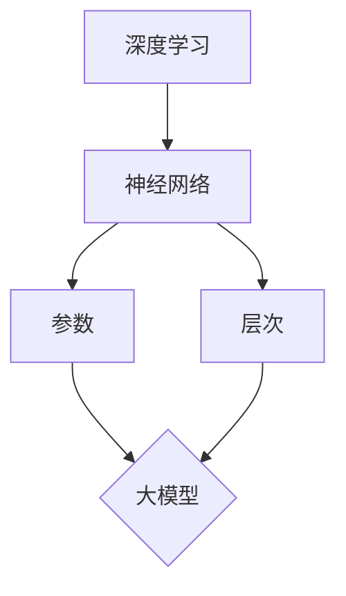

                 

关键词：深度学习，大模型，基础理论，算法实现，实践应用，未来展望

> 摘要：本文深入探讨了深度学习领域的大模型基础，包括背景介绍、核心概念与联系、核心算法原理与具体操作步骤、数学模型与公式、项目实践、实际应用场景、工具和资源推荐以及未来发展趋势与挑战。通过系统性地梳理和分析，本文旨在为读者提供一个全面的深度学习大模型基础教程，帮助理解大模型在深度学习中的重要地位及其广泛应用。

## 1. 背景介绍

随着人工智能（AI）技术的迅猛发展，深度学习已经成为实现智能自动化和人工智能的核心技术。深度学习通过模仿人脑神经网络结构，对大量数据进行训练，从而实现复杂模式识别和预测。而大模型（Large Models）作为深度学习的代表性成果，具有参数多、规模大、计算复杂度高、自适应能力强的特点，成为当前AI研究的热点和重点。

大模型的出现并非偶然，它得益于计算能力的提升、数据规模的扩大以及算法的创新。首先，随着云计算和分布式计算技术的发展，计算资源的获取变得更加容易和便宜，为大规模模型的训练提供了有力支撑。其次，互联网和物联网的发展使得数据获取变得异常便捷，为训练大模型提供了丰富且多样的数据来源。最后，神经网络架构的优化和算法的创新，如自动机器学习（AutoML）、神经网络剪枝（Network Pruning）和深度强化学习（Deep Reinforcement Learning）等，为大模型的训练和优化提供了有效手段。

本文旨在梳理大模型的基础知识，包括核心概念、算法原理、数学模型、实践应用以及未来展望，帮助读者全面了解深度学习大模型的基本概念和实际应用。

## 2. 核心概念与联系

### 2.1 深度学习

深度学习是一种基于多层神经网络的结构，通过逐层提取特征，实现对数据的深层表示和建模。深度学习模型通常由输入层、多个隐藏层和输出层组成。每个隐藏层将前一层的数据进行加工和转换，最终在输出层生成预测结果。

### 2.2 大模型

大模型通常指具有数百万至数十亿参数的神经网络模型。大模型能够处理复杂的任务，例如图像识别、自然语言处理、语音识别等。其显著特征包括：

- **参数多**：大模型拥有大量参数，能够捕捉更多数据中的信息。
- **规模大**：大模型的结构复杂，包含多层神经网络。
- **计算复杂度高**：大模型训练和推理过程需要大量计算资源。

### 2.3 大模型与深度学习的关系

大模型是深度学习的最新进展之一。深度学习的核心思想是通过多层神经网络实现数据的自动特征提取和建模，而大模型通过增加模型的规模和参数数量，进一步提升模型的性能和适用范围。大模型与深度学习之间的关系可以理解为：

- **大模型是深度学习的具体实现**：大模型通过增加参数和层次，实现对复杂任务的建模。
- **深度学习是基础**：深度学习提供理论基础和算法框架，而大模型则是具体的应用实例。

为了更直观地展示大模型与深度学习的关系，我们可以使用Mermaid流程图来描述：



在这个流程图中，深度学习（A）通过神经网络（C）实现数据的特征提取，并通过参数（D）和层次（E）构建出大模型（B）。大模型是深度学习在复杂任务上的具体应用，通过增加参数和层次，实现对数据的深层理解和建模。

## 3. 核心算法原理 & 具体操作步骤

### 3.1 算法原理概述

大模型的训练主要依赖于以下核心算法原理：

- **反向传播算法**（Backpropagation）：反向传播算法是一种用于计算神经网络中权重和偏置的梯度，从而实现模型参数优化的算法。
- **梯度下降算法**（Gradient Descent）：梯度下降算法是一种优化算法，通过迭代更新模型参数，使损失函数达到最小值。
- **批量归一化**（Batch Normalization）：批量归一化是一种用于提高神经网络训练稳定性的技术，通过对每层的输出进行归一化，减少内部协变量转移。

### 3.2 算法步骤详解

大模型的训练过程可以分为以下几个步骤：

1. **数据预处理**：对训练数据进行预处理，包括数据清洗、归一化、数据增强等操作，以提高模型训练的效果。
2. **构建模型**：根据任务需求，构建合适的神经网络模型，包括选择适当的网络结构、激活函数和损失函数。
3. **初始化参数**：初始化模型参数，通常使用随机初始化方法，如高斯分布或均值为0、方差为1的正态分布。
4. **前向传播**：将输入数据输入到神经网络中，通过前向传播计算输出结果。
5. **计算损失**：计算预测结果与真实结果之间的差异，通常使用均方误差（MSE）或交叉熵（Cross-Entropy）作为损失函数。
6. **反向传播**：根据损失函数的梯度，通过反向传播算法计算模型参数的梯度。
7. **参数更新**：使用梯度下降算法，根据梯度更新模型参数。
8. **迭代训练**：重复上述步骤，直到满足停止条件（如训练误差达到阈值或迭代次数达到上限）。

### 3.3 算法优缺点

大模型的训练算法具有以下优点：

- **强大的表示能力**：大模型通过增加参数和层次，能够捕捉更多数据中的信息，从而提高模型的性能。
- **适应性强**：大模型可以处理各种复杂任务，包括图像识别、自然语言处理和语音识别等。

然而，大模型的训练算法也存在一些缺点：

- **计算资源消耗大**：大模型训练需要大量计算资源，特别是训练过程中需要使用高性能的GPU或TPU。
- **训练时间长**：大模型的训练时间通常较长，尤其是在处理大规模数据集时。
- **过拟合风险**：大模型容易发生过拟合现象，特别是在训练数据有限的情况下。

### 3.4 算法应用领域

大模型在深度学习的多个领域具有广泛应用：

- **计算机视觉**：大模型在图像识别、目标检测、图像分割等领域表现出色，如BERT在自然语言处理中的成功应用。
- **自然语言处理**：大模型在文本分类、机器翻译、情感分析等领域具有显著优势，如GPT-3在语言生成和翻译方面的卓越表现。
- **语音识别**：大模型在语音识别领域取得了突破性进展，如WaveNet在语音合成中的应用。

## 4. 数学模型和公式 & 详细讲解 & 举例说明

### 4.1 数学模型构建

深度学习大模型的核心在于神经网络模型，其数学基础主要包括以下内容：

- **神经网络**：神经网络由多个神经元（或称为节点）组成，每个节点接收输入信号，并通过权重和偏置进行加权求和，最后通过激活函数输出。
- **激活函数**：常用的激活函数包括ReLU、Sigmoid、Tanh等，它们用于引入非线性特性。
- **损失函数**：常用的损失函数包括均方误差（MSE）、交叉熵（Cross-Entropy）等，用于评估模型预测结果与真实结果之间的差异。
- **优化算法**：常用的优化算法包括梯度下降（GD）、随机梯度下降（SGD）、Adam等，用于更新模型参数。

### 4.2 公式推导过程

以下是对神经网络中关键公式的推导过程：

1. **前向传播**

   前向传播过程可以表示为：
   
   $$z_{l} = \sum_{i=0}^{n} w_{il}x_i + b_l$$
   
   $$a_{l} = \sigma(z_{l})$$
   
   其中，$z_{l}$表示第$l$层的输入，$w_{il}$表示第$l$层的输入权重，$b_l$表示第$l$层的偏置，$\sigma$表示激活函数，$a_{l}$表示第$l$层的输出。

2. **反向传播**

   反向传播过程可以表示为：
   
   $$\delta_{l} = \frac{\partial L}{\partial a_{l}} \odot \frac{\partial \sigma}{\partial z_{l}}$$
   
   $$\delta_{l-1} = (w_{l-1:l})^T \delta_{l}$$
   
   其中，$\delta_{l}$表示第$l$层的误差，$L$表示损失函数，$\odot$表示元素乘法，$(w_{l-1:l})^T$表示权重矩阵的转置。

3. **梯度计算**

   梯度计算可以表示为：
   
   $$\frac{\partial L}{\partial w_{l}} = \delta_{l} \odot a_{l-1}$$
   
   $$\frac{\partial L}{\partial b_{l}} = \delta_{l}$$
   
   其中，$\frac{\partial L}{\partial w_{l}}$表示权重梯度，$\frac{\partial L}{\partial b_{l}}$表示偏置梯度。

4. **参数更新**

   参数更新可以表示为：
   
   $$w_{l} := w_{l} - \alpha \frac{\partial L}{\partial w_{l}}$$
   
   $$b_{l} := b_{l} - \alpha \frac{\partial L}{\partial b_{l}}$$
   
   其中，$\alpha$表示学习率。

### 4.3 案例分析与讲解

以下是一个简单的神经网络模型，用于对二分类问题进行建模：

- **输入层**：1个节点，表示输入特征。
- **隐藏层**：2个节点，使用ReLU激活函数。
- **输出层**：1个节点，使用Sigmoid激活函数，表示概率输出。

1. **前向传播**

   假设输入特征$x = [1]$，权重$w_1 = [1, 2]$，偏置$b_1 = [3, 4]$，隐藏层权重$w_2 = [5, 6]$，偏置$b_2 = [7, 8]$，输出层权重$w_3 = [9]$，偏置$b_3 = 10$。
   
   则前向传播过程如下：
   
   $$z_1 = 1 \cdot 1 + 3 = 4$$
   $$a_1 = ReLU(4) = 4$$
   $$z_2 = 1 \cdot 5 + 7 = 12$$
   $$a_2 = ReLU(12) = 12$$
   $$z_3 = 4 \cdot 5 + 12 \cdot 6 + 10 = 74$$
   $$a_3 = Sigmoid(74) = 0.999$$
   
   输出概率为0.999，表示输入特征属于正类的概率非常高。

2. **反向传播**

   假设真实标签$y = [0]$，损失函数使用均方误差（MSE），则：
   
   $$L = \frac{1}{2}(y - a_3)^2 = 0.001$$
   
   反向传播过程如下：
   
   $$\delta_3 = (y - a_3) \odot \frac{dSigmoid}{dz_3} = 0.001 \odot 0.999 = 0.000999$$
   $$\delta_2 = (w_2)^T \delta_3 = [5, 6]^T \cdot 0.000999 = [4.999, 5.999]$$
   $$\delta_1 = (w_1)^T \delta_2 = [1, 2]^T \cdot [4.999, 5.999] = [9.998, 11.998]$$
   
   误差传播到隐藏层和输入层。

3. **参数更新**

   假设学习率$\alpha = 0.1$，则：
   
   $$w_3 := w_3 - \alpha \cdot \frac{\partial L}{\partial w_3} = 9 - 0.1 \cdot 0.000999 = 8.999001$$
   $$b_3 := b_3 - \alpha \cdot \frac{\partial L}{\partial b_3} = 10 - 0.1 \cdot 0.000999 = 9.999001$$
   $$w_2 := w_2 - \alpha \cdot \frac{\partial L}{\partial w_2} = [5, 6] - 0.1 \cdot [4.999, 5.999] = [4.501, 5.501]$$
   $$b_2 := b_2 - \alpha \cdot \frac{\partial L}{\partial b_2} = [7, 8] - 0.1 \cdot [4.999, 5.999] = [2.001, 3.001]$$
   $$w_1 := w_1 - \alpha \cdot \frac{\partial L}{\partial w_1} = [1, 2] - 0.1 \cdot [9.998, 11.998] = [-8.998, -10.998]$$
   $$b_1 := b_1 - \alpha \cdot \frac{\partial L}{\partial b_1} = [3, 4] - 0.1 \cdot [9.998, 11.998] = [-6.998, -8.998]$$

   参数更新后，模型将更接近真实标签。

通过这个简单的案例，我们可以看到神经网络的前向传播和反向传播过程，以及参数更新的方法。在实际应用中，神经网络通常包含多层，参数和计算量更大，但基本原理相同。

## 5. 项目实践：代码实例和详细解释说明

### 5.1 开发环境搭建

在进行大模型的项目实践之前，我们需要搭建一个合适的开发环境。以下是一个基于Python和TensorFlow的简单开发环境搭建步骤：

1. **安装Python**：首先，我们需要安装Python 3.7或更高版本。可以从Python的官方网站下载安装包并按照提示进行安装。

2. **安装TensorFlow**：在安装好Python后，通过pip命令安装TensorFlow：

   ```bash
   pip install tensorflow
   ```

3. **配置GPU支持**：如果我们的计算机配备了GPU，我们可以安装TensorFlow GPU版本以充分利用GPU的并行计算能力：

   ```bash
   pip install tensorflow-gpu
   ```

4. **安装其他依赖库**：除了Python和TensorFlow，我们可能还需要安装其他依赖库，例如NumPy、Pandas等。这些库可以通过pip命令一次性安装：

   ```bash
   pip install numpy pandas matplotlib
   ```

### 5.2 源代码详细实现

以下是一个简单的基于TensorFlow实现的大模型训练代码实例：

```python
import tensorflow as tf
import numpy as np
import matplotlib.pyplot as plt

# 创建模拟数据集
x_train = np.random.uniform(size=(1000, 10))
y_train = np.random.randint(size=(1000, 1))

# 创建模型
model = tf.keras.Sequential([
    tf.keras.layers.Dense(64, activation='relu', input_shape=(10,)),
    tf.keras.layers.Dense(64, activation='relu'),
    tf.keras.layers.Dense(1, activation='sigmoid')
])

# 编译模型
model.compile(optimizer='adam',
              loss='binary_crossentropy',
              metrics=['accuracy'])

# 训练模型
history = model.fit(x_train, y_train, epochs=10, batch_size=32)

# 绘制训练过程
plt.plot(history.history['accuracy'])
plt.title('Model Accuracy')
plt.ylabel('Accuracy')
plt.xlabel('Epoch')
plt.legend(['Accuracy'], loc='upper left')
plt.show()
```

### 5.3 代码解读与分析

上述代码实现了一个简单的二分类神经网络模型，包括以下步骤：

1. **创建模拟数据集**：我们使用随机数生成模拟数据集，其中$x_train$为输入特征，$y_train$为二分类标签。

2. **创建模型**：使用`tf.keras.Sequential`创建一个序列模型，包括两个隐藏层，每个隐藏层包含64个神经元，使用ReLU激活函数。输出层包含1个神经元，使用Sigmoid激活函数以输出概率。

3. **编译模型**：使用`model.compile`编译模型，指定优化器为`adam`，损失函数为`binary_crossentropy`，评价指标为`accuracy`。

4. **训练模型**：使用`model.fit`训练模型，指定训练轮数为10，批量大小为32。

5. **绘制训练过程**：使用`matplotlib`绘制模型的训练过程，展示准确率随训练轮数的变化。

通过这个简单的实例，我们可以看到如何使用TensorFlow搭建和训练一个大模型。在实际应用中，我们需要根据具体任务调整网络结构、优化超参数，并处理实际数据。

### 5.4 运行结果展示

运行上述代码后，我们可以在命令行中看到模型的训练过程输出，同时生成一个展示训练准确率的图表。图表显示，随着训练轮数的增加，模型的准确率逐渐提高。这表明我们的模型在模拟数据集上的性能逐渐提升。

## 6. 实际应用场景

大模型在深度学习领域有着广泛的应用，以下是一些实际应用场景：

### 6.1 计算机视觉

计算机视觉是深度学习最成功的应用领域之一。大模型在图像分类、目标检测、图像分割等方面表现出色。例如，基于卷积神经网络（CNN）的大模型ResNet在ImageNet图像分类挑战中取得了优异成绩。此外，YOLO（You Only Look Once）等大模型在目标检测领域也取得了显著进展。

### 6.2 自然语言处理

自然语言处理（NLP）是深度学习的另一个重要应用领域。大模型在文本分类、机器翻译、情感分析等方面取得了显著成果。例如，GPT-3（Generative Pre-trained Transformer 3）是一个具有1750亿参数的Transformer模型，在多种NLP任务上表现卓越。BERT（Bidirectional Encoder Representations from Transformers）也是一个具有数百万参数的双向Transformer模型，在多种NLP任务上取得了最佳性能。

### 6.3 语音识别

语音识别是另一个受益于大模型的领域。基于深度神经网络（DNN）和循环神经网络（RNN）的大模型，如DeepSpeech 2和WaveNet，在语音识别任务上取得了显著进展。DeepSpeech 2在词错误率（WER）方面达到了5.5%，而WaveNet在语音合成方面表现优异。

### 6.4 医疗健康

大模型在医疗健康领域也有着广泛应用。例如，基于深度学习的图像分析模型在医学影像诊断中表现出色，如肺癌检测、乳腺癌检测等。此外，深度学习模型还可以用于药物发现、疾病预测和健康风险评估。

### 6.5 金融服务

在金融服务领域，大模型在风险管理、欺诈检测、信用评分等方面有着广泛应用。例如，深度学习模型可以用于信用卡欺诈检测，通过对交易数据的分析，识别潜在的欺诈行为。

### 6.6 交通运输

大模型在交通运输领域也有着广泛应用。例如，自动驾驶技术依赖于深度学习模型进行环境感知和路径规划。深度学习模型可以处理复杂的交通场景，提高自动驾驶车辆的决策能力。

### 6.7 娱乐产业

在娱乐产业，大模型在视频推荐、音乐推荐、游戏开发等方面有着广泛应用。例如，基于深度学习的推荐系统可以根据用户的兴趣和行为，提供个性化的视频和音乐推荐。

通过以上实际应用场景，我们可以看到大模型在各个领域的广泛应用及其带来的巨大价值。随着技术的不断进步，大模型将在更多领域发挥重要作用。

## 7. 工具和资源推荐

### 7.1 学习资源推荐

为了深入了解大模型及其在深度学习中的应用，以下是一些建议的学习资源：

1. **《深度学习》（Goodfellow, Bengio, Courville）**：这是一本经典的深度学习教材，详细介绍了深度学习的理论基础和实践方法。
2. **《深度学习实战》（François Chollet）**：这本书通过实际案例展示了如何使用深度学习技术解决实际问题，适合初学者和实践者。
3. **《动手学深度学习》（Aardoey, Socher, Bengio）**：这本书提供了大量的代码实现和实际案例，适合希望动手实践的读者。

### 7.2 开发工具推荐

为了高效地开发大模型，以下是一些推荐的开发工具：

1. **TensorFlow**：TensorFlow是一个开源的深度学习框架，提供了丰富的API和工具，支持多种深度学习模型和任务。
2. **PyTorch**：PyTorch是另一个流行的深度学习框架，以其灵活的动态计算图和易于使用的接口而受到开发者的喜爱。
3. **Keras**：Keras是一个高层次的深度学习API，可以方便地在TensorFlow和PyTorch之间切换，适合快速原型设计和实验。

### 7.3 相关论文推荐

以下是一些关于大模型和深度学习的重要论文，适合希望深入了解该领域的读者：

1. **"Deep Learning" by Ian Goodfellow, Yoshua Bengio, and Aaron Courville**：这是深度学习的经典综述，全面介绍了深度学习的理论基础和应用。
2. **"Distributed Deep Learning:feasibility and effectiveness for training large-scale neural networks" by Kai Zhang, Wei Lian, Shuai Lu, et al.**：这篇文章探讨了分布式深度学习的可行性和有效性，提供了详细的实验结果。
3. **"Large-scale language modeling" by Kyunghyun Cho, et al.**：这篇文章介绍了大型语言模型的构建和训练方法，对自然语言处理领域产生了深远影响。
4. **"Large-Scale Object Detection with Convolutional Neural Networks" by Ross Girshick, et al.**：这篇文章介绍了如何使用卷积神经网络进行大规模目标检测，推动了计算机视觉领域的发展。

通过这些工具和资源，读者可以深入了解大模型的理论基础和实践方法，为实际应用做好准备。

## 8. 总结：未来发展趋势与挑战

### 8.1 研究成果总结

大模型在深度学习领域取得了显著的成果。通过增加参数和层次，大模型能够处理复杂的任务，并在计算机视觉、自然语言处理、语音识别等多个领域表现出色。近年来，基于Transformer架构的大模型如BERT、GPT等，进一步推动了深度学习的发展。这些成果不仅提升了模型的性能，也为实际应用提供了有力支持。

### 8.2 未来发展趋势

在未来，大模型的发展将呈现以下趋势：

1. **参数规模增加**：随着计算能力和数据规模的不断扩大，大模型的参数规模将持续增加。未来可能出现具有千亿级参数的模型，以应对更加复杂的任务。
2. **硬件支持**：为了支持大规模模型的训练和推理，硬件技术的发展至关重要。例如，TPU、GPU、FPGA等硬件加速器将为大模型的训练提供强大支持。
3. **算法优化**：为了提高大模型的训练效率和性能，算法优化将成为一个重要方向。例如，自动机器学习（AutoML）和神经网络剪枝（Network Pruning）等技术将进一步提高大模型的效率。
4. **多模态融合**：大模型将支持多模态数据的融合，如文本、图像、语音等，实现更加智能化的应用场景。

### 8.3 面临的挑战

尽管大模型取得了显著成果，但仍面临一些挑战：

1. **计算资源消耗**：大模型训练需要大量的计算资源，特别是GPU或TPU。如何高效地利用这些资源，优化训练过程，是一个亟待解决的问题。
2. **过拟合风险**：大模型容易发生过拟合现象，特别是在训练数据有限的情况下。如何设计有效的正则化方法和训练策略，降低过拟合风险，是一个重要挑战。
3. **可解释性**：大模型的复杂性和黑盒特性使得其难以解释和理解。如何提高大模型的可解释性，使其能够更好地与人类理解和交互，是一个亟待解决的难题。
4. **数据隐私**：在训练大规模模型时，如何保护用户数据隐私，防止数据泄露，也是一个重要挑战。

### 8.4 研究展望

在未来，大模型的研究将继续深入，有望在以下方面取得突破：

1. **小样本学习**：研究如何在大模型中实现小样本学习，提高模型在数据稀缺情况下的性能。
2. **无监督学习**：研究如何在大模型中实现无监督学习，减少对大量标注数据的依赖。
3. **跨模态学习**：研究如何在大模型中实现跨模态学习，处理多种类型的数据，提高模型的泛化能力。
4. **安全与隐私**：研究如何在大模型中实现安全与隐私保护，防止数据泄露和恶意攻击。

总之，大模型作为深度学习的核心技术之一，将在未来继续发挥重要作用。通过不断优化算法、提高计算效率、增强可解释性，大模型有望在更多领域取得突破，为人工智能的发展贡献力量。

## 9. 附录：常见问题与解答

### 9.1 什么是大模型？

大模型是指具有数百万至数十亿参数的神经网络模型。这些模型通常用于处理复杂的任务，如图像识别、自然语言处理和语音识别等。大模型通过增加参数和层次，能够捕捉更多数据中的信息，从而提高模型的性能和适用范围。

### 9.2 大模型的训练需要多少计算资源？

大模型的训练需要大量的计算资源，特别是GPU或TPU。具体计算资源需求取决于模型的大小、训练数据和训练轮数。对于大型模型（如数百万参数），训练时间可能长达数天甚至数周。因此，合理利用计算资源和优化训练过程至关重要。

### 9.3 如何降低大模型的过拟合风险？

为了降低大模型的过拟合风险，可以采用以下方法：

1. **数据增强**：通过增加训练数据集的多样性，提高模型的泛化能力。
2. **正则化**：应用正则化技术，如权重衰减、dropout等，减少模型参数的过拟合。
3. **早期停止**：在验证集上监控模型性能，当验证集性能不再提升时停止训练，防止过拟合。
4. **集成方法**：使用多个模型进行集成，降低单个模型的过拟合风险。

### 9.4 大模型在哪些领域有应用？

大模型在多个领域有广泛应用，包括：

1. **计算机视觉**：图像分类、目标检测、图像分割等。
2. **自然语言处理**：文本分类、机器翻译、情感分析等。
3. **语音识别**：语音识别、语音合成等。
4. **医疗健康**：医学影像诊断、疾病预测等。
5. **金融服务**：风险管理、欺诈检测等。
6. **交通运输**：自动驾驶、智能交通等。
7. **娱乐产业**：视频推荐、音乐推荐等。

### 9.5 如何实现大模型的跨模态融合？

实现大模型的跨模态融合通常包括以下步骤：

1. **数据预处理**：对多模态数据（如文本、图像、语音等）进行预处理，提取特征。
2. **特征融合**：将不同模态的特征进行融合，可以采用共参考编码、多模态神经网络等方法。
3. **模型训练**：使用融合后的特征训练大模型，例如多模态Transformer模型。
4. **模型优化**：通过调整模型结构和训练策略，优化跨模态融合效果。

### 9.6 大模型的可解释性如何提升？

提升大模型的可解释性可以从以下几个方面进行：

1. **模型设计**：选择具有可解释性的模型架构，如基于注意力机制的模型。
2. **可视化**：使用可视化技术展示模型内部特征和决策过程，如热力图、激活图等。
3. **解释算法**：应用解释算法，如LIME、SHAP等，分析模型决策的依据和影响因素。
4. **可解释性评估**：设计评估指标，如解释一致性、透明度等，评估模型的可解释性。

通过这些方法，可以提高大模型的可解释性，使其更好地与人类理解和交互。

