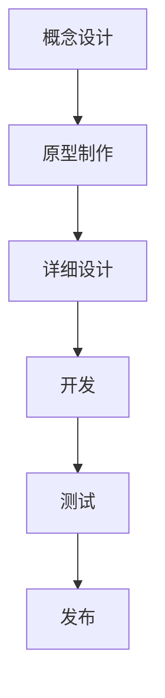

                 

关键词：游戏开发，Unity，Unreal Engine，框架对比，性能优化，开发效率，功能特性，跨平台支持

> 摘要：本文将深入对比Unity和Unreal Engine这两个最流行的游戏开发框架，从性能、开发效率、功能特性、跨平台支持等多个维度进行全面分析，帮助开发者做出明智的选择。

## 1. 背景介绍

在当今的游戏开发领域，Unity和Unreal Engine无疑是最受关注的两个游戏开发框架。Unity由Unity Technologies开发，自2005年首次发布以来，凭借其易用性和强大的功能，迅速成为游戏开发者的首选工具。Unreal Engine则由Epic Games打造，以其出色的图形渲染能力和高扩展性著称，广泛应用于大型游戏开发以及电影和动画制作。

### Unity

Unity是一个跨平台的游戏开发引擎，支持多种操作系统和平台，包括Windows、macOS、Linux、iOS、Android、WebGL等。它以其简单易用的编辑器、丰富的插件市场和开源特性著称。Unity广泛应用于教育、企业应用、虚拟现实（VR）、增强现实（AR）等领域。

### Unreal Engine

Unreal Engine以其卓越的图形渲染能力而闻名，支持实时渲染、高动态范围（HDR）、全局光照等高级特性。它广泛应用于大型游戏、影视特效、建筑可视化等领域。Unreal Engine的编辑器也具有很强的扩展性和定制性，通过蓝图系统可以实现无需编写代码的编程。

## 2. 核心概念与联系

在深入探讨Unity和Unreal Engine之前，我们需要了解一些核心概念和它们之间的联系。

### 游戏引擎

游戏引擎是一种为游戏开发提供核心功能的软件框架。它包括渲染、物理模拟、音频处理、输入管理等多个子系统，使得开发者可以专注于游戏的内容而非底层的实现细节。

### 游戏开发框架

游戏开发框架是游戏引擎的一个子集，专注于提供特定的功能。例如，Unity和Unreal Engine都是游戏开发框架，但它们各自都有独特的优势和特点。

### 游戏开发流程

游戏开发流程包括概念设计、原型制作、详细设计、开发、测试和发布等多个阶段。Unity和Unreal Engine都在这些阶段提供相应的工具和功能支持。

### Mermaid 流程图



## 3. 核心算法原理 & 具体操作步骤

### 3.1 算法原理概述

Unity和Unreal Engine在算法原理上有所不同，但都提供了高效的游戏开发解决方案。

### Unity

Unity使用一种基于组件的系统，将游戏对象拆分为多个组件，每个组件负责不同的功能。这种设计使得游戏对象的管理和修改更加灵活。

### Unreal Engine

Unreal Engine则使用蓝图系统，通过可视化的方式实现编程。开发者可以在编辑器中拖拽和连接不同的节点，实现复杂的逻辑和行为。

### 3.2 算法步骤详解

#### Unity

1. 创建游戏对象
2. 添加组件
3. 配置组件属性
4. 编写脚本
5. 运行和调试

#### Unreal Engine

1. 创建场景
2. 添加对象
3. 配置对象属性
4. 拖拽蓝图节点
5. 连接节点
6. 运行和调试

### 3.3 算法优缺点

#### Unity

**优点：**

- 易于上手
- 强大的插件市场
- 跨平台支持

**缺点：**

- 图形渲染能力相对较弱
- 蓝图系统的性能不如C#

#### Unreal Engine

**优点：**

- 卓越的图形渲染能力
- 高效的蓝图系统
- 强大的插件市场

**缺点：**

- 学习曲线较陡峭
- 跨平台支持不如Unity

### 3.4 算法应用领域

#### Unity

Unity广泛应用于教育、企业应用、VR、AR等领域。

#### Unreal Engine

Unreal Engine主要用于大型游戏、影视特效、建筑可视化等领域。

## 4. 数学模型和公式 & 详细讲解 & 举例说明

### 4.1 数学模型构建

在游戏开发中，数学模型是至关重要的一环。Unity和Unreal Engine都提供了丰富的数学函数和工具，支持开发者构建复杂的数学模型。

### 4.2 公式推导过程

以下是一个简单的线性插值的数学模型：

$$
y = mx + b
$$

其中，$m$ 是斜率，$b$ 是截距。

### 4.3 案例分析与讲解

假设我们想要实现一个简单的物理模拟，让一个物体沿着斜面向下滑动。我们可以使用线性插值来计算物体在每个时间步的位移。

$$
\text{位移} = m \times \text{时间步} + b
$$

通过这个公式，我们可以计算出物体在每个时间步的位移，从而实现物理模拟。

## 5. 项目实践：代码实例和详细解释说明

### 5.1 开发环境搭建

在开始项目实践之前，我们需要搭建好开发环境。

#### Unity

1. 下载并安装Unity Hub。
2. 创建一个新的Unity项目。
3. 配置开发环境（例如，安装Visual Studio Code和Unity插件）。

#### Unreal Engine

1. 下载并安装Unreal Engine。
2. 创建一个新的Unreal Engine项目。
3. 配置开发环境（例如，安装Visual Studio Code和UE4插件）。

### 5.2 源代码详细实现

以下是一个简单的Unity项目，实现一个简单的物理模拟。

```csharp
using UnityEngine;

public class PhysicsSimulator : MonoBehaviour
{
    public float slopeAngle = 30.0f;
    public float timeStep = 0.01f;

    private Vector3 initialPosition;
    private Vector3 velocity;

    void Start()
    {
        initialPosition = transform.position;
        velocity = new Vector3(0, -Mathf.Sin(slopeAngle * Mathf.Deg2Rad), 0);
    }

    void Update()
    {
        float displacement = velocity.z * timeStep;
        transform.position = initialPosition + new Vector3(0, 0, displacement);
    }
}
```

### 5.3 代码解读与分析

这段代码实现了一个简单的物理模拟，让一个物体沿着斜面向下滑动。它通过计算物体的初始位置和速度，在每个时间步更新物体的位置。

### 5.4 运行结果展示

运行这段代码，我们可以看到一个物体沿着斜面向下滑动的效果。

## 6. 实际应用场景

Unity和Unreal Engine在不同的应用场景中都有其独特的优势。

### Unity

- **教育领域**：Unity广泛应用于教育领域，为教师和学生提供了一种直观、易用的游戏开发工具。
- **企业应用**：Unity可以用于开发各种企业应用，如虚拟现实培训、交互式演示等。
- **VR/AR**：Unity在虚拟现实和增强现实领域有着广泛的应用。

### Unreal Engine

- **大型游戏开发**：Unreal Engine以其卓越的图形渲染能力，成为大型游戏开发的首选工具。
- **影视特效**：Unreal Engine常用于影视特效制作，如电影《银翼杀手2049》和《阿凡达》。
- **建筑可视化**：Unreal Engine可以用于建筑可视化，提供逼真的三维场景展示。

## 7. 工具和资源推荐

### 7.1 学习资源推荐

- **Unity官方文档**：https://docs.unity3d.com/
- **Unreal Engine官方文档**：https://docs.unrealengine.com/
- **Unity教程**：https://www.unitycolleges.com/
- **Unreal Engine教程**：https://www.unrealengine.com/tutorials

### 7.2 开发工具推荐

- **Visual Studio Code**：适用于Unity和Unreal Engine的开发，支持多种编程语言。
- **Unity Hub**：Unity的开发管理工具，方便创建和管理项目。
- **Unreal Engine Marketplace**：提供丰富的插件和资源，助力游戏开发。

### 7.3 相关论文推荐

- **Unity: A Technical Introduction**：介绍Unity的技术架构和实现细节。
- **Unreal Engine 4 Architecture**：探讨Unreal Engine 4的架构和设计原则。

## 8. 总结：未来发展趋势与挑战

### 8.1 研究成果总结

Unity和Unreal Engine在游戏开发领域取得了显著的成果。Unity以其易用性和强大的功能，成为游戏开发者的首选工具。Unreal Engine则以其卓越的图形渲染能力和高扩展性，广泛应用于大型游戏开发和影视特效制作。

### 8.2 未来发展趋势

- **跨平台支持**：随着移动设备和云计算的普及，游戏开发将越来越依赖于跨平台支持。
- **AI集成**：人工智能将成为游戏开发的重要工具，用于游戏玩法设计、NPC行为模拟等。
- **云游戏**：云游戏将成为游戏开发的新趋势，为玩家提供更高质量的体验。

### 8.3 面临的挑战

- **性能优化**：随着游戏场景的复杂度增加，性能优化将成为游戏开发的重要挑战。
- **开发者培训**：随着新技术的不断涌现，开发者需要不断学习新的知识和技能。
- **市场饱和**：游戏市场日趋饱和，开发者需要不断创新，以吸引玩家的注意力。

### 8.4 研究展望

Unity和Unreal Engine将继续在游戏开发领域发挥重要作用。随着新技术的不断涌现，它们将不断演进，为开发者提供更强大的功能和支持。

## 9. 附录：常见问题与解答

### Q：Unity和Unreal Engine哪个更好？

A：这取决于开发需求和应用场景。Unity更适合初学者和中小型项目，而Unreal Engine更适合大型项目和需要高性能图形渲染的项目。

### Q：Unity和Unreal Engine哪个更易用？

A：Unity的编辑器更直观，易于上手，适合初学者。Unreal Engine的编辑器功能更强大，但学习曲线较陡峭。

### Q：Unity和Unreal Engine哪个性能更好？

A：Unreal Engine在图形渲染方面性能更好，但Unity在整体性能上表现也不错。

### Q：Unity和Unreal Engine哪个更适合VR/AR开发？

A：Unity和Unreal Engine都支持VR/AR开发，但Unity在VR/AR应用方面有更多的资源和插件。

### Q：Unity和Unreal Engine哪个成本更低？

A：Unity的基本版本是免费的，而Unreal Engine的免费版本也有一定的限制，但两者在商业使用上都需要付费。

---

作者：禅与计算机程序设计艺术 / Zen and the Art of Computer Programming
----------------------------------------------------------------
本文详细探讨了Unity和Unreal Engine这两个游戏开发框架，从性能、开发效率、功能特性、跨平台支持等多个维度进行了全面分析。希望这篇文章能够帮助您在游戏开发中选择最适合的框架，实现您的创意和目标。在未来的游戏开发领域，随着技术的不断进步，Unity和Unreal Engine将继续发挥重要作用，为开发者提供强大的支持。让我们期待这两个框架在未来的发展吧！

