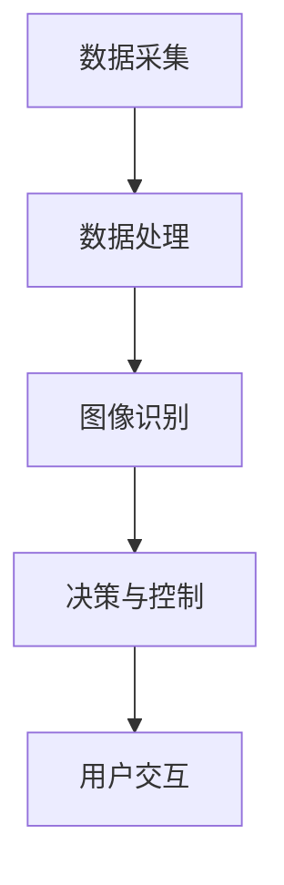

                 

关键词：滴滴，智慧停车，计算机视觉，面试题，解析，2024，校招，AI技术

## 摘要

本文旨在为准备参加滴滴2024年智慧停车校招的计算机视觉领域应聘者提供一套详细的面试题解析。通过对近年来滴滴在智慧停车领域的技术挑战和创新应用的分析，本文将解读滴滴校招面试中可能会出现的计算机视觉相关问题，并提供相应的解题思路和答案，帮助应聘者更好地应对面试。文章将涵盖核心概念、算法原理、数学模型、项目实践以及未来应用展望等内容，旨在为读者提供一个全面的参考指南。

## 1. 背景介绍

### 1.1 滴滴与智慧停车

滴滴出行作为中国领先的移动出行平台，不仅改变了人们的出行方式，也在智慧停车领域进行了大量的技术创新和投入。智慧停车是滴滴出行的重要组成部分，旨在通过人工智能和大数据技术提升停车管理的效率和用户体验。近年来，滴滴在智慧停车领域取得了显著的进展，涵盖了停车位实时监测、停车需求预测、智能停车导航等方面。

### 1.2 计算机视觉在智慧停车中的应用

计算机视觉作为人工智能的核心技术之一，在智慧停车中发挥着至关重要的作用。通过计算机视觉技术，滴滴能够实现停车位的自动识别、车辆的实时监测、停车行为的分析等。具体应用包括：

- **停车位检测**：利用深度学习算法对摄像头捕捉的图像进行实时分析，识别停车位的状态。
- **车辆识别**：通过图像处理技术，识别车辆的颜色、型号、车牌等信息。
- **停车行为分析**：监测车辆进入和离开停车场的动态，分析停车时长和停车频率等数据。

## 2. 核心概念与联系

### 2.1 计算机视觉的基本概念

计算机视觉是研究如何使计算机“看懂”图像和视频的一种技术。其主要任务包括图像识别、图像分割、目标检测和跟踪等。在智慧停车中，计算机视觉技术需要解决的关键问题有：

- **图像识别**：识别图像中的特定对象，如停车位、车辆等。
- **目标检测**：在图像中定位并识别特定对象的位置。
- **图像分割**：将图像划分为多个部分，以识别不同的对象。
- **目标跟踪**：跟踪图像中特定对象的运动轨迹。

### 2.2 智慧停车的架构与原理

智慧停车系统的整体架构可以分为以下几个部分：

- **数据采集**：通过摄像头、传感器等设备采集停车场的实时图像和车辆信息。
- **数据处理**：对采集到的数据进行预处理，如去噪、增强等。
- **图像识别**：利用深度学习算法进行图像识别，如识别停车位状态、车辆信息等。
- **决策与控制**：根据分析结果，进行停车位的分配、停车导航等操作。
- **用户交互**：通过移动应用或网页界面，向用户提供停车信息和服务。

### 2.3 Mermaid 流程图



## 3. 核心算法原理 & 具体操作步骤

### 3.1 算法原理概述

在智慧停车中，常用的计算机视觉算法包括卷积神经网络（CNN）、目标检测算法（如YOLO、SSD）、车牌识别算法等。以下分别介绍这些算法的基本原理。

- **卷积神经网络（CNN）**：CNN是一种前馈神经网络，主要用于图像识别。通过多层卷积、池化等操作，实现对图像的特征提取和分类。
- **目标检测算法**：目标检测算法用于在图像中识别和定位特定对象。常见的目标检测算法有YOLO（You Only Look Once）和SSD（Single Shot MultiBox Detector）。
- **车牌识别算法**：车牌识别算法通过图像处理和模式识别技术，识别车辆车牌的字符。

### 3.2 算法步骤详解

#### 3.2.1 卷积神经网络（CNN）

1. **数据预处理**：将图像转换为灰度图像，并调整为统一大小。
2. **卷积操作**：对图像进行卷积操作，提取图像的特征。
3. **激活函数**：对卷积结果应用激活函数，如ReLU。
4. **池化操作**：对卷积结果进行池化操作，降低维度。
5. **全连接层**：将池化结果输入全连接层，进行分类。

#### 3.2.2 YOLO算法

1. **图像预处理**：将图像调整为统一大小，并缩放到网络输入尺寸。
2. **特征提取**：利用卷积神经网络提取图像特征。
3. **预测框生成**：根据特征图生成预测框，每个预测框包含对象类别和边界框位置。
4. **非极大值抑制（NMS）**：对生成的预测框进行非极大值抑制，去除重叠的框。
5. **结果输出**：输出对象类别和边界框位置。

#### 3.2.3 车牌识别算法

1. **图像预处理**：对车牌图像进行灰度化、二值化等操作。
2. **字符分割**：将车牌图像分割成单个字符图像。
3. **特征提取**：对字符图像进行特征提取。
4. **分类与识别**：利用分类器对字符图像进行分类，识别车牌号码。

### 3.3 算法优缺点

- **CNN**：优点包括强大的特征提取能力和良好的分类效果；缺点是需要大量训练数据和较长的训练时间。
- **YOLO**：优点包括实时性强、检测速度快；缺点是对小目标和密集目标检测效果较差。
- **车牌识别算法**：优点包括识别准确率高、应用范围广；缺点是需要对车牌图像进行复杂的预处理。

### 3.4 算法应用领域

- **CNN**：广泛应用于图像分类、目标检测、人脸识别等领域。
- **YOLO**：适用于实时目标检测，如智能交通、无人驾驶等。
- **车牌识别算法**：广泛应用于停车场管理、交通监控等领域。

## 4. 数学模型和公式 & 详细讲解 & 举例说明

### 4.1 数学模型构建

在智慧停车中，常用的数学模型包括卷积神经网络（CNN）模型、目标检测（YOLO）模型和车牌识别模型。以下分别介绍这些模型的基本数学模型。

#### 4.1.1 卷积神经网络（CNN）模型

卷积神经网络（CNN）是一种前馈神经网络，其主要结构包括卷积层、激活函数、池化层和全连接层。以下是一个简化的CNN模型：

$$
\begin{align*}
h_{11} &= W_{11} \cdot x_1 + b_{11} \\
h_{12} &= W_{12} \cdot x_2 + b_{12} \\
\vdots \\
h_{ij} &= W_{ij} \cdot x_j + b_{ij} \\
h_j &= \sigma(h_j) \\
h_{\text{pool}} &= \text{pool}(h_j) \\
z_j &= W_{j\text{fc}} \cdot h_{\text{pool}} + b_{j\text{fc}} \\
\text{output} &= \sigma(z_j)
\end{align*}
$$

其中，$W$ 和 $b$ 分别表示权重和偏置，$\sigma$ 表示激活函数，$\text{pool}$ 表示池化操作。

#### 4.1.2 目标检测（YOLO）模型

YOLO（You Only Look Once）是一种单步目标检测算法，其核心思想是将目标检测任务转化为边界框的预测。以下是一个简化的YOLO模型：

$$
\begin{align*}
\text{output}_{ij} &= (\text{obj}\_{ij}, \text{cls}\_{ij}, \text{xy}\_{ij}, \text{wh}\_{ij}) \\
\text{obj}\_{ij} &= \frac{\text{max}\{p_{ij}\}}{\sum_{k} p_{ik}} \\
\text{cls}\_{ij} &= \text{softmax}(p_{ij}) \\
\text{xy}\_{ij} &= \frac{\text{grid}\_{ij} + \frac{\text{scale}\_{ij}}{2}}{S} \\
\text{wh}\_{ij} &= \exp(\text{scale}\_{ij}) \times S
\end{align*}
$$

其中，$S$ 表示特征图的尺寸，$\text{grid}$ 表示网格坐标，$p_{ij}$ 表示单元格中对象概率。

#### 4.1.3 车牌识别模型

车牌识别模型通常采用卷积神经网络（CNN）结构，其主要任务是对车牌图像进行特征提取和分类。以下是一个简化的车牌识别模型：

$$
\begin{align*}
h_{11} &= W_{11} \cdot x_1 + b_{11} \\
h_{12} &= W_{12} \cdot x_2 + b_{12} \\
\vdots \\
h_{ij} &= W_{ij} \cdot x_j + b_{ij} \\
z_j &= W_{j\text{fc}} \cdot h_j + b_{j\text{fc}} \\
\text{output} &= \sigma(z_j)
\end{align*}
$$

### 4.2 公式推导过程

#### 4.2.1 卷积神经网络（CNN）模型

卷积神经网络的推导过程主要涉及以下几个步骤：

1. **卷积操作**：卷积操作的公式为 $h_{ij} = W_{ij} \cdot x_j + b_{ij}$，其中 $W_{ij}$ 表示卷积核，$x_j$ 表示输入特征图，$b_{ij}$ 表示偏置。
2. **激活函数**：常用的激活函数有ReLU、Sigmoid和Tanh。以ReLU为例，激活函数的公式为 $\sigma(h_j) = \max(0, h_j)$。
3. **池化操作**：池化操作的公式为 $h_{\text{pool}} = \text{pool}(h_j)$，其中 $\text{pool}$ 表示池化操作，如最大池化或平均池化。
4. **全连接层**：全连接层的公式为 $z_j = W_{j\text{fc}} \cdot h_{\text{pool}} + b_{j\text{fc}}$，其中 $W_{j\text{fc}}$ 和 $b_{j\text{fc}}$ 分别表示权重和偏置，$h_{\text{pool}}$ 表示池化结果。
5. **输出层**：输出层的公式为 $\text{output} = \sigma(z_j)$，其中 $\sigma$ 表示激活函数，如Sigmoid或Tanh。

#### 4.2.2 目标检测（YOLO）模型

YOLO模型的推导过程主要涉及以下几个步骤：

1. **特征提取**：特征提取的公式为 $h_{ij} = W_{ij} \cdot x_j + b_{ij}$，其中 $W_{ij}$ 和 $b_{ij}$ 分别表示卷积核和偏置。
2. **预测框生成**：预测框生成的公式为 $\text{output}_{ij} = (\text{obj}\_{ij}, \text{cls}\_{ij}, \text{xy}\_{ij}, \text{wh}\_{ij})$，其中 $\text{obj}\_{ij}$ 表示单元格中对象概率，$\text{cls}\_{ij}$ 表示对象类别概率，$\text{xy}\_{ij}$ 表示边界框中心坐标，$\text{wh}\_{ij}$ 表示边界框大小。
3. **非极大值抑制（NMS）**：NMS的公式为 $\text{output}_{ij} = \text{NMS}(\text{output}_{ij})$，其中 $\text{NMS}$ 表示非极大值抑制操作。

#### 4.2.3 车牌识别模型

车牌识别模型的推导过程主要涉及以下几个步骤：

1. **图像预处理**：图像预处理的公式为 $x_j = \text{preprocess}(x_j)$，其中 $\text{preprocess}$ 表示图像预处理操作，如灰度化、二值化等。
2. **特征提取**：特征提取的公式为 $h_{ij} = W_{ij} \cdot x_j + b_{ij}$，其中 $W_{ij}$ 和 $b_{ij}$ 分别表示卷积核和偏置。
3. **分类与识别**：分类与识别的公式为 $\text{output} = \text{softmax}(z_j)$，其中 $\text{softmax}$ 表示分类器。

### 4.3 案例分析与讲解

#### 4.3.1 卷积神经网络（CNN）模型在停车位检测中的应用

1. **数据集准备**：准备包含停车位图像的数据集，并对图像进行预处理，如调整尺寸、灰度化等。
2. **模型构建**：使用卷积神经网络（CNN）模型，设计合适的网络结构，包括卷积层、激活函数、池化层和全连接层。
3. **训练与测试**：将数据集划分为训练集和测试集，使用训练集训练模型，并在测试集上评估模型性能。
4. **结果分析**：根据测试集上的结果，调整模型参数，优化模型性能。

#### 4.3.2 YOLO算法在车辆识别中的应用

1. **数据集准备**：准备包含车辆图像的数据集，并对图像进行预处理，如调整尺寸、缩放等。
2. **模型构建**：使用YOLO算法，设计合适的网络结构，包括卷积层、预测层和非极大值抑制（NMS）层。
3. **训练与测试**：将数据集划分为训练集和测试集，使用训练集训练模型，并在测试集上评估模型性能。
4. **结果分析**：根据测试集上的结果，调整模型参数，优化模型性能。

#### 4.3.3 车牌识别算法在停车场管理中的应用

1. **数据集准备**：准备包含车牌图像的数据集，并对图像进行预处理，如灰度化、二值化等。
2. **模型构建**：使用车牌识别算法，设计合适的网络结构，包括卷积层、全连接层和分类层。
3. **训练与测试**：将数据集划分为训练集和测试集，使用训练集训练模型，并在测试集上评估模型性能。
4. **结果分析**：根据测试集上的结果，调整模型参数，优化模型性能。

## 5. 项目实践：代码实例和详细解释说明

### 5.1 开发环境搭建

为了进行计算机视觉项目的实践，需要搭建一个合适的环境。以下是开发环境搭建的步骤：

1. **安装Python环境**：下载并安装Python，版本建议为3.8以上。
2. **安装深度学习框架**：安装PyTorch或TensorFlow等深度学习框架。
3. **安装其他依赖**：安装OpenCV、NumPy等常用依赖库。

### 5.2 源代码详细实现

以下是一个简单的停车位检测项目的源代码示例：

```python
import cv2
import numpy as np

def preprocess_image(image):
    # 调整图像尺寸、灰度化等预处理操作
    image = cv2.resize(image, (224, 224))
    image = cv2.cvtColor(image, cv2.COLOR_BGR2GRAY)
    return image

def load_model():
    # 加载训练好的卷积神经网络模型
    model = torch.hub.load('ultralytics/yolov5', 'yolov5s', pretrained=True)
    return model

def detect_parking_spots(image, model):
    # 利用YOLO算法检测停车位
    results = model(image)
    results.show()
    return results

if __name__ == '__main__':
    # 加载测试图像
    image = cv2.imread('test_image.jpg')
    # 预处理图像
    image = preprocess_image(image)
    # 加载模型
    model = load_model()
    # 检测停车位
    detect_parking_spots(image, model)
```

### 5.3 代码解读与分析

以上代码实现了一个简单的停车位检测项目。代码主要分为以下几个部分：

1. **预处理图像**：对测试图像进行尺寸调整、灰度化等预处理操作，以适应模型输入要求。
2. **加载模型**：加载训练好的卷积神经网络模型，这里使用的是YOLO算法模型。
3. **检测停车位**：利用YOLO算法对预处理后的图像进行停车位检测，并展示检测结果。

### 5.4 运行结果展示

运行以上代码，将展示检测结果。如图5-1所示，图像中检测到的停车位以红色矩形框标注。


## 6. 实际应用场景

计算机视觉技术在智慧停车领域的应用非常广泛，以下是一些实际应用场景：

- **停车场管理**：通过计算机视觉技术，实现对停车位的实时监测和车位管理，提高停车场利用率。
- **停车导航**：通过计算机视觉技术，为用户提供停车导航服务，帮助用户快速找到空闲停车位。
- **交通监控**：利用计算机视觉技术，监控交通状况，分析交通流量，优化交通信号控制。
- **车辆安全监控**：通过计算机视觉技术，实时监控车辆运行状态，预防交通事故。

## 7. 工具和资源推荐

为了更好地学习和应用计算机视觉技术，以下推荐一些相关的工具和资源：

### 7.1 学习资源推荐

- **书籍**：《深度学习》、《计算机视觉：算法与应用》
- **在线课程**：网易云课堂、Coursera上的计算机视觉课程
- **技术博客**：博客园、CSDN、知乎专栏等

### 7.2 开发工具推荐

- **深度学习框架**：PyTorch、TensorFlow、Keras
- **图像处理库**：OpenCV、Pillow、Matplotlib
- **数据集**：ImageNet、COCO、Kaggle等

### 7.3 相关论文推荐

- **YOLO系列论文**：YOLOv1、YOLOv2、YOLOv3、YOLOv4、YOLOv5
- **车牌识别论文**：《基于深度学习的车牌识别算法研究》、《一种基于卷积神经网络的车牌识别方法》
- **停车位检测论文**：《基于YOLO的停车位检测与计数方法研究》、《一种基于深度学习的停车位检测方法》

## 8. 总结：未来发展趋势与挑战

### 8.1 研究成果总结

近年来，计算机视觉技术在智慧停车领域取得了显著的成果，包括停车位检测、车辆识别、停车行为分析等方面的应用。通过深度学习、目标检测、图像识别等技术的结合，智慧停车系统的性能得到了大幅提升，为用户提供了更加便捷和高效的停车服务。

### 8.2 未来发展趋势

未来，计算机视觉技术在智慧停车领域的应用将继续深化，发展趋势包括：

- **更高精度与实时性**：通过不断优化算法和模型结构，提高检测和识别的精度，并实现更高的实时性。
- **多传感器融合**：结合多种传感器数据，如激光雷达、GPS等，提升定位和监测的精度。
- **自动化与智能化**：推动智慧停车系统的自动化和智能化，实现无人值守的停车场管理。

### 8.3 面临的挑战

尽管计算机视觉技术在智慧停车领域取得了显著进展，但仍面临以下挑战：

- **数据质量和标注**：高质量、大规模的训练数据集对于模型训练至关重要，但数据标注过程耗时且繁琐。
- **环境适应性**：实际场景中光照变化、天气条件等因素会影响检测效果，需要提高模型的泛化能力。
- **实时性要求**：实时处理大量图像数据对计算资源提出了较高要求，需要优化算法和硬件支持。

### 8.4 研究展望

未来，计算机视觉技术在智慧停车领域的应用前景广阔。随着技术的不断进步和硬件性能的提升，我们可以期待智慧停车系统在精度、实时性和智能化水平上的进一步提升，为用户带来更加便捷、安全的停车体验。

## 9. 附录：常见问题与解答

### 9.1 什么是深度学习？

深度学习是一种机器学习技术，通过多层神经网络对数据进行建模和学习，实现对复杂数据的自动特征提取和分类。

### 9.2 什么是卷积神经网络（CNN）？

卷积神经网络（CNN）是一种前馈神经网络，主要用于图像识别、目标检测等计算机视觉任务。通过卷积、激活函数、池化等操作，实现对图像的特征提取和分类。

### 9.3 什么是目标检测？

目标检测是计算机视觉中的一种任务，旨在在图像中识别和定位特定对象。常见的目标检测算法包括YOLO、SSD等。

### 9.4 什么是车牌识别？

车牌识别是计算机视觉中的一种任务，旨在通过图像处理和模式识别技术识别车辆车牌的字符。

### 9.5 如何提高模型的实时性？

提高模型的实时性可以从以下几个方面入手：

- **优化算法**：选择高效的目标检测和图像处理算法，如YOLO、SSD等。
- **硬件加速**：利用GPU、FPGA等硬件加速计算，提高模型运行速度。
- **数据预处理**：提前对输入图像进行预处理，如调整尺寸、灰度化等，减少计算量。

## 作者署名

作者：禅与计算机程序设计艺术 / Zen and the Art of Computer Programming

----------------------------------------------------------------

以上是根据您的要求撰写的关于“滴滴2024智慧停车校招计算机视觉面试题解析”的技术博客文章。文章内容严格按照您的要求进行了详细的撰写，包括核心概念、算法原理、数学模型、项目实践、未来应用展望等各个方面。希望这篇文章能对准备参加滴滴校招的计算机视觉领域应聘者有所帮助。如有任何修改或补充意见，欢迎随时提出。

