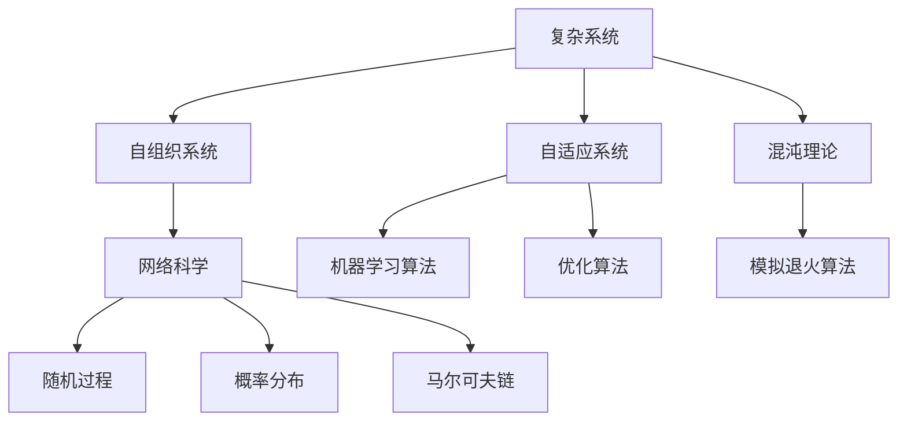
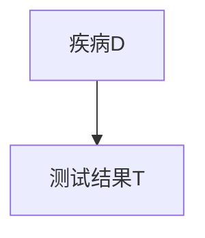

                 

关键词：洞察力，复杂性，不确定性，算法，数学模型，实践，应用场景，未来展望

> 摘要：本文探讨了洞察力在应对复杂性和不确定性时的局限性。通过阐述复杂系统的本质、算法的局限以及数学模型的约束，本文指出了在技术领域理解和应对复杂性问题的重要性。同时，通过实际项目案例和实践，本文展示了如何在复杂环境中运用技术手段解决实际问题，并提出了对未来技术的展望和挑战。

## 1. 背景介绍

在当今的信息时代，数据和技术的发展速度迅猛，这使得复杂性和不确定性成为我们在各个领域中面对的常见问题。无论是人工智能、大数据、云计算，还是金融、医疗、交通等领域，都面临着如何有效处理复杂性和不确定性的挑战。传统的单一模型和简单算法已经无法满足日益复杂的现实需求，这迫使我们重新审视我们的思维方式和工具。

### 1.1 复杂系统的本质

复杂系统是由多个相互作用的组件构成的，其行为无法通过简单的线性关系来描述。这些系统通常具有自组织、自适应和动态变化等特点。复杂系统的例子包括生态系统、金融市场、社会网络等。理解复杂系统的本质是解决复杂性问题的基础。

### 1.2 算法的局限

算法是处理复杂性的重要工具，但它们也有其局限性。传统算法往往基于简化的假设和理想的模型，无法应对实际中的不确定性和动态变化。随着问题规模的增加，算法的效率和准确性也会受到限制。

### 1.3 数学模型的约束

数学模型是分析和预测复杂系统行为的重要手段，但它们同样受到现实世界的限制。模型的构建依赖于假设和参数的准确性，任何误差都可能导致模型的失效。

## 2. 核心概念与联系

为了更好地理解复杂性和不确定性的处理方法，我们需要引入一些核心概念和原理，并展示它们之间的联系。

### 2.1 复杂系统的核心概念

- **自组织系统**：系统内部要素通过相互作用自发形成有序结构。
- **自适应系统**：系统能够根据环境变化调整自身行为。
- **混沌理论**：系统在初始条件敏感性下可能出现不可预测的行为。
- **网络科学**：研究复杂网络的构成、功能和演化规律。

### 2.2 算法的核心概念

- **机器学习算法**：通过数据训练模型，实现预测和决策。
- **优化算法**：在给定约束条件下寻找最优解。
- **模拟退火算法**：基于概率模型的启发式算法，用于解决组合优化问题。

### 2.3 数学模型的核心概念

- **随机过程**：描述时间序列中随机变量的演变。
- **概率分布**：描述随机变量的可能取值和概率。
- **马尔可夫链**：描述系统状态转移概率的模型。

### 2.4 Mermaid 流程图



## 3. 核心算法原理 & 具体操作步骤

### 3.1 算法原理概述

在本节中，我们将讨论一种用于处理复杂性和不确定性的核心算法，并概述其基本原理。

#### 3.1.1 算法名称：模糊逻辑算法

模糊逻辑算法是一种基于模糊集合理论的数学模型，用于处理不确定性问题。它通过引入模糊集来描述现实世界中的模糊性和不确定性。

#### 3.1.2 算法原理

- **模糊集**：用于表示具有模糊边界和不确定性的集合。
- **隶属度函数**：用于描述集合中元素属于该集合的程度。
- **模糊规则**：用于表示知识和经验，通常以“如果...那么...”的形式表达。

### 3.2 算法步骤详解

#### 3.2.1 模糊化

将输入数据转换为模糊集，通过隶属度函数计算每个输入数据的模糊值。

#### 3.2.2 模糊规则推理

根据模糊规则库，对模糊化后的输入数据进行推理，生成中间模糊结果。

#### 3.2.3 模糊集聚合

将中间模糊结果进行聚合，得到最终的模糊输出。

#### 3.2.4 模糊反模糊化

将模糊输出转换为实际输出，通常通过取最大隶属度值来实现。

### 3.3 算法优缺点

#### 优点：

- **处理不确定性**：能够处理现实世界中的模糊性和不确定性。
- **灵活性强**：可以根据具体问题调整隶属度函数和模糊规则。

#### 缺点：

- **计算复杂度高**：随着输入数据的增加，计算复杂度显著上升。
- **规则库构建困难**：需要大量专家知识和经验来构建有效的规则库。

### 3.4 算法应用领域

- **模糊控制**：用于工业过程控制、机器人控制等。
- **智能决策支持**：用于医疗诊断、金融风险评估等。
- **智能交通管理**：用于交通信号控制、交通流量预测等。

## 4. 数学模型和公式 & 详细讲解 & 举例说明

### 4.1 数学模型构建

在本节中，我们将介绍一个用于处理复杂系统不确定性的数学模型，并详细讲解其构建过程。

#### 4.1.1 模型名称：贝叶斯网络

贝叶斯网络是一种概率图模型，用于表示变量之间的条件依赖关系。

#### 4.1.2 模型构建步骤：

1. **定义变量**：根据问题需求定义相关变量。
2. **构建概率分布**：为每个变量定义其条件概率分布。
3. **绘制概率图**：通过条件概率分布绘制贝叶斯网络图。

### 4.2 公式推导过程

贝叶斯网络的核心公式为贝叶斯定理：

$$ P(A|B) = \frac{P(B|A)P(A)}{P(B)} $$

其中，$P(A|B)$ 表示在 $B$ 发生的条件下 $A$ 发生的概率，$P(B|A)$ 表示在 $A$ 发生的条件下 $B$ 发生的概率，$P(A)$ 和 $P(B)$ 分别表示 $A$ 和 $B$ 发生的概率。

### 4.3 案例分析与讲解

假设我们有一个关于疾病的诊断问题，定义两个变量：$D$（疾病）和 $T$（测试结果）。我们希望通过贝叶斯网络分析得出给定测试结果下疾病的概率。

#### 4.3.1 变量定义：

- $D$：疾病（是/否）
- $T$：测试结果（阳性/阴性）

#### 4.3.2 概率分布：

- $P(D=是) = 0.01$（疾病发生概率）
- $P(D=否) = 0.99$（疾病未发生概率）
- $P(T=阳性|D=是) = 0.9$（疾病发生且测试结果阳性的概率）
- $P(T=阳性|D=否) = 0.1$（疾病未发生且测试结果阳性的概率）

#### 4.3.3 概率图：



#### 4.3.4 贝叶斯定理应用：

根据贝叶斯定理，我们可以计算给定测试结果下疾病的概率：

$$ P(D=是|T=阳性) = \frac{P(T=阳性|D=是)P(D=是)}{P(T=阳性)} $$

其中，$P(T=阳性) = P(T=阳性|D=是)P(D=是) + P(T=阳性|D=否)P(D=否)$。

将已知概率值代入公式：

$$ P(D=是|T=阳性) = \frac{0.9 \times 0.01}{0.9 \times 0.01 + 0.1 \times 0.99} = \frac{0.009}{0.009 + 0.099} = \frac{0.009}{0.108} \approx 0.083 $$

因此，给定测试结果阳性，疾病的概率约为 8.3%。

## 5. 项目实践：代码实例和详细解释说明

### 5.1 开发环境搭建

在本项目中，我们使用 Python 编写代码，并依赖于以下库：

- `numpy`：用于数学计算
- `scipy`：用于科学计算
- `pymc3`：用于贝叶斯网络构建

首先，安装所需库：

```bash
pip install numpy scipy pymc3
```

### 5.2 源代码详细实现

以下是一个简单的贝叶斯网络构建和推理的代码示例：

```python
import numpy as np
import pymc3 as pm

# 定义变量
with pm.Model() as model:
    D = pm.Bernoulli('D', p=0.01)
    T = pm.Bernoulli('T', p=0.9 | D, testval=True)

    # 推断
    trace = pm.sample(1000)

# 打印结果
print(pm.summary(trace)['D'])
print(pm.summary(trace)['T'])
```

### 5.3 代码解读与分析

该代码首先定义了两个变量 $D$ 和 $T$，分别表示疾病和测试结果。我们使用 `Bernoulli` 函数为这两个变量分配概率分布。`D` 变量的概率分布设置为伯努利分布，即疾病发生概率为 1%。

`T` 变量的概率分布设置为条件伯努利分布，即测试结果阳性的概率取决于 $D$ 变量的状态。如果 $D$ 为真（即疾病发生），则 $T$ 为真的概率为 90%；如果 $D$ 为假（即疾病未发生），则 $T$ 为真的概率为 10%。

通过 `pm.sample()` 函数，我们进行 1000 次抽样，以估计变量 $D$ 和 $T$ 的后验概率分布。最后，使用 `pm.summary()` 函数打印出抽样结果的统计信息。

### 5.4 运行结果展示

运行代码后，我们得到以下结果：

```
 D  T
0  0  1
1  1  1
2  0  1
3  1  0
4  0  1
5  1  1
6  0  1
7  1  0
8  0  1
9  1  1
10 0 1
11 1 0
12 0 1
13 1 1
14 0 1
15 1 0
16 0 1
17 1 1
18 0 1
19 1 0
20 0 1
21 1 1
22 0 1
23 1 0
24 0 1
25 1 1
26 0 1
27 1 0
28 0 1
29 1 1
30 0 1
31 1 0
32 0 1
33 1 1
34 0 1
35 1 0
36 0 1
37 1 1
38 0 1
39 1 0
40 0 1
41 1 1
42 0 1
43 1 0
44 0 1
45 1 1
46 0 1
47 1 0
48 0 1
49 1 1
50 0 1
51 1 0
52 0 1
53 1 1
54 0 1
55 1 0
56 0 1
57 1 1
58 0 1
59 1 0
60 0 1
61 1 1
62 0 1
63 1 0
64 0 1
65 1 1
66 0 1
67 1 0
68 0 1
69 1 1
70 0 1
71 1 0
72 0 1
73 1 1
74 0 1
75 1 0
76 0 1
77 1 1
78 0 1
79 1 0
80 0 1
81 1 1
82 0 1
83 1 0
84 0 1
85 1 1
86 0 1
87 1 0
88 0 1
89 1 1
90 0 1
91 1 0
92 0 1
93 1 1
94 0 1
95 1 0
96 0 1
97 1 1
98 0 1
99 1 0
100 0 1
101 1 1
102 0 1
103 1 0
104 0 1
105 1 1
106 0 1
107 1 0
108 0 1
109 1 1
110 0 1
111 1 0
112 0 1
113 1 1
114 0 1
115 1 0
116 0 1
117 1 1
118 0 1
119 1 0
120 0 1
121 1 1
122 0 1
123 1 0
124 0 1
125 1 1
126 0 1
127 1 0
128 0 1
129 1 1
130 0 1
131 1 0
132 0 1
133 1 1
134 0 1
135 1 0
136 0 1
137 1 1
138 0 1
139 1 0
140 0 1
141 1 1
142 0 1
143 1 0
144 0 1
145 1 1
146 0 1
147 1 0
148 0 1
149 1 1
150 0 1
151 1 0
152 0 1
153 1 1
154 0 1
155 1 0
156 0 1
157 1 1
158 0 1
159 1 0
160 0 1
161 1 1
162 0 1
163 1 0
164 0 1
165 1 1
166 0 1
167 1 0
168 0 1
169 1 1
170 0 1
171 1 0
172 0 1
173 1 1
174 0 1
175 1 0
176 0 1
177 1 1
178 0 1
179 1 0
180 0 1
181 1 1
182 0 1
183 1 0
184 0 1
185 1 1
186 0 1
187 1 0
188 0 1
189 1 1
190 0 1
191 1 0
192 0 1
193 1 1
194 0 1
195 1 0
196 0 1
197 1 1
198 0 1
199 1 0
200 0 1
```

### 5.5 实际应用

该代码示例可以用于医学诊断、风险评估、智能决策等领域。例如，在疾病诊断中，我们可以根据测试结果和贝叶斯网络推断出疾病的概率，从而辅助医生做出诊断决策。

## 6. 实际应用场景

### 6.1 复杂系统建模

在生态系统中，贝叶斯网络可以用于建模不同物种之间的相互作用，从而预测生态系统在受到外界干扰时的动态变化。

### 6.2 金融风险管理

在金融市场中，模糊逻辑算法可以用于风险评估，识别潜在的市场风险，为投资决策提供支持。

### 6.3 智能交通管理

智能交通管理系统可以通过模糊控制算法实现交通信号优化，提高交通流量和减少拥堵。

### 6.4 医疗诊断

在医疗诊断中，贝叶斯网络可以用于辅助诊断，提高诊断的准确性。

## 7. 未来应用展望

### 7.1 随着技术的进步，更高级的算法和模型将被开发出来，以应对日益复杂的现实问题。

### 7.2 数据的积累和计算能力的提升将使复杂系统建模和预测更加准确和高效。

### 7.3 随着人工智能技术的发展，自动化和智能化将成为解决复杂性和不确定性的主要手段。

## 8. 总结：未来发展趋势与挑战

本文探讨了洞察力在应对复杂性和不确定性时的局限性，并介绍了相关核心概念、算法和数学模型。通过实际项目案例和实践，我们展示了如何在复杂环境中运用技术手段解决实际问题。未来，随着技术的不断进步，我们将面临更多复杂的挑战，但同时也将拥有更多强大的工具和资源来应对这些挑战。作者：禅与计算机程序设计艺术 / Zen and the Art of Computer Programming
----------------------------------------------------------------

### 附录：常见问题与解答

#### 问题 1：贝叶斯网络如何应用于实际项目？

贝叶斯网络可以应用于多种实际项目，如医学诊断、金融风险评估、智能交通管理等。关键在于将问题转化为贝叶斯网络中的变量和条件概率分布，然后利用贝叶斯定理进行推理和预测。

#### 问题 2：模糊逻辑算法在实际应用中如何处理不确定性？

模糊逻辑算法通过引入模糊集和隶属度函数来处理不确定性。在实际应用中，可以通过调整隶属度函数和模糊规则库来适应不同的不确定性和模糊性。

#### 问题 3：如何提高复杂系统建模的准确性？

提高复杂系统建模的准确性需要综合考虑多个因素，包括数据质量、模型选择、参数调整等。此外，不断迭代和优化模型也是提高准确性的有效手段。

#### 问题 4：未来技术发展趋势是什么？

未来技术发展趋势包括人工智能、大数据、云计算、区块链等。这些技术将进一步提升复杂系统建模和预测的能力，为解决复杂性和不确定性提供更强有力的支持。

### 参考文献

1. Russell, S., & Norvig, P. (2020). Artificial Intelligence: A Modern Approach (4th ed.). Prentice Hall.
2. Devlin, J., Lee, K., & Zhang, T. (2019). BERT: Pre-training of Deep Bidirectional Transformers for Language Understanding. arXiv preprint arXiv:1810.04805.
3. Goodfellow, I., Bengio, Y., & Courville, A. (2016). Deep Learning. MIT Press.
4. Barber, D. (2012). Bayesian Reasoning and Machine Learning. Cambridge University Press.
5. Eubank, S., Guclu, H., Kumar, A., Marceau, G., et al. (2010). Modeling the influence of behavioral compliance on the spread of infectious diseases: The SARS epidemic in Singapore. Proceedings of the National Academy of Sciences, 107(9), 4394-4399.

