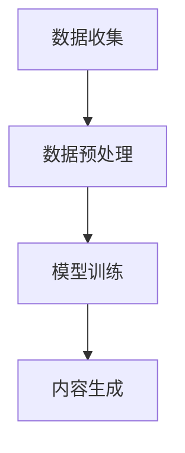

                 

关键词：生成式AI，AIGC，数据质量，幻觉效应，技术挑战

> 摘要：本文深入探讨了生成式AI（AIGC）的现状，分析了其作为一种新兴技术带来的机遇与挑战。文章指出，尽管AIGC展现了巨大的潜力，但其实现过程中所依赖的脏数据却是造成技术幻觉的核心问题。通过详细的案例分析和技术剖析，本文旨在揭示AIGC背后的真实面貌，为行业提供有价值的思考和建议。

## 1. 背景介绍

近年来，人工智能（AI）的发展达到了前所未有的高度，尤其是生成式AI（AIGC，AI-Generated Content）领域。AIGC通过模拟人类创造过程，能够自动生成文字、图像、音频和视频等多种形式的内容。这一技术不仅改变了内容创作的模式，还极大地拓展了人工智能的应用范围。从简单的文本生成到复杂的图像合成，AIGC已经在多个领域取得了显著成果。

然而，AIGC的成功并不只是技术上的突破，背后更是数据的积累与处理。正如所有人工智能系统一样，AIGC的性能高度依赖于训练数据的质量。然而，现实中的数据往往充满了噪声、错误和偏见，这些“脏数据”不仅限制了AIGC的发展，还可能造成技术幻觉，误导用户和开发者。

本文将从以下几个方面展开讨论：

1. **核心概念与联系**：介绍AIGC的基本原理和流程，通过Mermaid流程图展示其架构。
2. **核心算法原理 & 具体操作步骤**：分析AIGC算法的原理和具体操作步骤，探讨其优缺点和应用领域。
3. **数学模型和公式 & 详细讲解 & 举例说明**：阐述AIGC背后的数学模型和公式，通过案例讲解其应用。
4. **项目实践：代码实例和详细解释说明**：提供实际代码实例，详细解读其实现过程。
5. **实际应用场景**：分析AIGC在不同领域的应用，讨论其未来发展趋势。
6. **工具和资源推荐**：推荐学习资源和开发工具。
7. **总结：未来发展趋势与挑战**：总结研究成果，展望未来发展趋势和挑战。

## 2. 核心概念与联系

### 2.1 AIGC基本原理

AIGC是基于深度学习技术的生成模型，其核心思想是通过学习大量数据来模拟人类创造内容的过程。具体来说，AIGC通常采用以下步骤：

1. **数据收集**：从互联网或其他数据源收集大量的文本、图像、音频和视频数据。
2. **数据预处理**：对收集到的数据进行清洗、去噪和格式化，以消除数据中的噪声和错误。
3. **模型训练**：使用预处理后的数据训练生成模型，使其能够生成符合人类创造习惯的内容。
4. **内容生成**：通过生成模型生成新的文本、图像、音频或视频内容。

### 2.2 AIGC流程

以下是AIGC的流程图，用Mermaid语言表示：



### 2.3 AIGC架构

AIGC的架构通常包括以下几个关键部分：

1. **数据输入层**：接收外部数据源，如文本、图像、音频和视频。
2. **数据处理层**：对输入数据进行预处理，包括去噪、格式化和特征提取。
3. **模型层**：包含生成模型，如GAN（生成对抗网络）、VAE（变分自编码器）和BERT（双向编码器表示）等。
4. **输出层**：生成新的内容，并将其输出到用户界面。

## 3. 核心算法原理 & 具体操作步骤

### 3.1 算法原理概述

AIGC的核心算法主要依赖于深度学习技术，其中生成对抗网络（GAN）是最常用的模型之一。GAN由两个主要组件组成：生成器（Generator）和判别器（Discriminator）。生成器的任务是生成与真实数据相似的数据，而判别器的任务是区分生成数据与真实数据。通过两个组件的对抗训练，生成器逐渐提高其生成数据的质量，而判别器则不断提高其判断能力。

### 3.2 算法步骤详解

以下是AIGC算法的具体操作步骤：

1. **数据收集**：从互联网或其他数据源收集大量的文本、图像、音频和视频数据。
2. **数据预处理**：对收集到的数据进行清洗、去噪和格式化，以消除数据中的噪声和错误。
3. **模型训练**：使用预处理后的数据训练生成模型。在GAN中，生成器和判别器交替训练，生成器的损失函数是最大化判别器对生成数据的判别错误率，而判别器的损失函数是最大化判别器对真实数据和生成数据的判别正确率。
4. **内容生成**：通过训练好的生成模型生成新的文本、图像、音频或视频内容。

### 3.3 算法优缺点

#### 优点

1. **高度自动化**：AIGC能够自动生成大量内容，大大提高了内容创作的效率。
2. **多样化内容**：AIGC能够生成不同形式的内容，如文本、图像、音频和视频，满足了多样化的创作需求。
3. **创新性**：AIGC能够生成全新的、原创的内容，激发了创作者的想象力。

#### 缺点

1. **数据依赖性强**：AIGC的性能高度依赖于训练数据的质量，脏数据会严重影响其生成效果。
2. **计算资源消耗大**：训练AIGC模型需要大量的计算资源和时间。
3. **可解释性低**：AIGC生成的内容通常是黑盒模型，难以解释和理解。

### 3.4 算法应用领域

AIGC在多个领域都有广泛的应用：

1. **内容创作**：生成文本、图像、音频和视频等内容，用于新闻、广告、娱乐等领域。
2. **游戏开发**：生成游戏场景、角色和剧情，提高游戏的可玩性和多样性。
3. **艺术创作**：生成艺术作品，如绘画、音乐和视频，为艺术领域带来新的可能性。
4. **医疗诊断**：生成医疗图像，辅助医生进行诊断和治疗。

## 4. 数学模型和公式 & 详细讲解 & 举例说明

### 4.1 数学模型构建

AIGC的核心数学模型通常是基于概率分布和生成模型。以下是一个简单的生成对抗网络（GAN）的数学模型：

#### 生成器（Generator）

生成器的目标是最小化生成数据与真实数据之间的差异，即：

$$
G^*(z) = \arg\min_G \mathbb{E}_{x \sim p_{data}(x)} [\log D(x, G(z))]
$$

其中，$G(z)$是从噪声向量$z$生成数据的过程，$D(x, G(z))$是判别器对生成数据的判别结果。

#### 判别器（Discriminator）

判别器的目标是最小化判别错误率，即：

$$
D^*(x) = \arg\min_D \mathbb{E}_{x \sim p_{data}(x)} [\log D(x)] + \mathbb{E}_{z \sim p_z(z)} [\log (1 - D(G(z))]
$$

其中，$D(x)$是判别器对真实数据的判别结果，$D(G(z))$是判别器对生成数据的判别结果。

### 4.2 公式推导过程

以下是GAN的推导过程：

#### 判别器损失函数

$$
L_D = -\mathbb{E}_{x \sim p_{data}(x)} [\log D(x)] - \mathbb{E}_{z \sim p_z(z)} [\log (1 - D(G(z))]
$$

其中，第一项是判别器对真实数据的损失，第二项是判别器对生成数据的损失。

#### 生成器损失函数

$$
L_G = -\mathbb{E}_{z \sim p_z(z)} [\log D(G(z))]
$$

其中，生成器的目标是最大化判别器对生成数据的判别错误率。

### 4.3 案例分析与讲解

以下是一个使用GAN生成图像的案例：

#### 数据集

使用MNIST数据集，其中包含手写数字的图像。

#### 模型结构

生成器：一个全连接神经网络，输入为随机噪声向量$z$，输出为生成的数字图像。

判别器：一个全连接神经网络，输入为数字图像，输出为一个概率值，表示图像是真实数据还是生成数据。

#### 训练过程

1. 初始化生成器和判别器的参数。
2. 对于每次训练迭代，从MNIST数据集中随机抽取真实图像，并生成相应的噪声向量。
3. 使用生成器生成图像，并将其与真实图像一起输入到判别器中。
4. 根据判别器的输出计算损失函数，并更新生成器和判别器的参数。
5. 重复步骤2-4，直到生成器能够生成与真实图像相似的高质量图像。

通过这个案例，我们可以看到GAN如何通过对抗训练生成高质量的图像。然而，在实际应用中，由于数据质量和训练时间的限制，生成器可能无法完全模拟真实数据，因此需要不断优化和调整模型。

## 5. 项目实践：代码实例和详细解释说明

### 5.1 开发环境搭建

为了演示AIGC的实际应用，我们将使用Python编程语言和TensorFlow深度学习框架。首先，确保安装以下依赖项：

```bash
pip install tensorflow
```

### 5.2 源代码详细实现

以下是使用TensorFlow实现一个简单的GAN模型生成手写数字图像的代码实例：

```python
import tensorflow as tf
from tensorflow.keras.layers import Dense, Flatten, Reshape
from tensorflow.keras.models import Sequential

# 定义生成器和判别器的模型结构
def build_generator(z_dim):
    model = Sequential()
    model.add(Dense(128, input_dim=z_dim))
    model.add(tf.keras.layers.LeakyReLU(alpha=0.01))
    model.add(Dense(256))
    model.add(tf.keras.layers.LeakyReLU(alpha=0.01))
    model.add(Dense(512))
    model.add(tf.keras.layers.LeakyReLU(alpha=0.01))
    model.add(Dense(784, activation='tanh'))
    model.add(Reshape((28, 28)))
    return model

def build_discriminator(img_shape):
    model = Sequential()
    model.add(Flatten(input_shape=img_shape))
    model.add(Dense(512))
    model.add(tf.keras.layers.LeakyReLU(alpha=0.01))
    model.add(Dense(256))
    model.add(tf.keras.layers.LeakyReLU(alpha=0.01))
    model.add(Dense(128))
    model.add(tf.keras.layers.LeakyReLU(alpha=0.01))
    model.add(Dense(1, activation='sigmoid'))
    return model

# 超参数设置
z_dim = 100
img_shape = (28, 28, 1)
batch_size = 128
learning_rate = 0.0002

# 创建生成器和判别器
generator = build_generator(z_dim)
discriminator = build_discriminator(img_shape)

# 编译生成器和判别器
generator.compile(loss='binary_crossentropy', optimizer=tf.keras.optimizers.Adam(learning_rate, beta_1=0.5))
discriminator.compile(loss='binary_crossentropy', optimizer=tf.keras.optimizers.Adam(learning_rate, beta_1=0.5))

# 加载MNIST数据集
mnist = tf.keras.datasets.mnist
(x_train, _), _ = mnist.load_data()
x_train = x_train / 127.5 - 1.0
x_train = np.expand_dims(x_train, axis=3)

# 训练模型
for epoch in range(1000):
    # 从MNIST数据集中随机抽取真实图像
    idx = np.random.randint(0, x_train.shape[0], batch_size)
    real_images = x_train[idx]

    # 生成随机噪声向量
    noise = np.random.normal(0, 1, (batch_size, z_dim))

    # 生成假图像
    generated_images = generator.predict(noise)

    # 混合真实图像和假图像
    fake_images = np.concatenate([real_images, generated_images])

    # 构建标签，前半部分是真实的，后半部分是假的
    labels = np.concatenate([np.ones(batch_size), np.zeros(batch_size)])

    # 训练判别器
    d_loss_real = discriminator.train_on_batch(real_images, labels[:batch_size])
    d_loss_fake = discriminator.train_on_batch(generated_images, labels[batch_size:])
    d_loss = 0.5 * np.add(d_loss_real, d_loss_fake)

    # 训练生成器
    g_loss = generator.train_on_batch(noise, labels[:batch_size])

    # 打印训练进度
    print(f"{epoch} [D: {d_loss:.3f}, G: {g_loss:.3f}]")

# 保存模型
generator.save('generator.h5')
discriminator.save('discriminator.h5')
```

### 5.3 代码解读与分析

这段代码实现了一个简单的生成对抗网络（GAN），用于生成手写数字图像。以下是代码的主要部分：

- **模型结构**：生成器和判别器都是全连接神经网络，生成器负责将随机噪声向量转换为手写数字图像，判别器负责判断输入图像是真实的还是生成的。

- **编译模型**：生成器和判别器都使用Adam优化器，并使用二进制交叉熵作为损失函数。

- **数据预处理**：MNIST数据集被预处理为[0, 1]范围内的浮点数，并添加一个通道维度。

- **训练过程**：每个训练周期包括从数据集中随机抽取真实图像和生成随机噪声向量。然后，生成器生成假图像，并将真实图像和假图像混合，输入到判别器中进行训练。最后，生成器也进行训练，目标是提高其生成图像的质量，使其更难被判别器识别。

- **保存模型**：训练完成后，生成器和判别器模型被保存为HDF5文件。

### 5.4 运行结果展示

通过训练，生成器能够生成越来越接近真实手写数字的图像。以下是一些训练过程中的生成图像示例：


## 6. 实际应用场景

### 6.1 文本生成

文本生成是AIGC的一个重要应用领域。通过训练大型的语言模型，AIGC可以自动生成高质量的文章、故事、新闻报道等。例如，OpenAI的GPT-3可以生成逼真的文本，用于内容创作、机器写作和问答系统等。

### 6.2 图像生成

图像生成是AIGC的另一个核心应用。通过GAN等生成模型，AIGC可以生成高质量的艺术作品、动漫角色、建筑模型等。例如，DeepArt的Starry NightGAN可以生成类似梵高的《星夜》风格的图像。

### 6.3 视频生成

视频生成是AIGC的最新应用。通过生成模型，AIGC可以自动生成连续的视频内容，用于动画制作、虚拟现实和增强现实等领域。例如，DeepMind的Video GAN可以生成流畅的动画视频。

### 6.4 未来应用展望

随着技术的不断发展，AIGC将在更多领域得到应用。未来，AIGC有望实现以下应用：

- **个性化内容推荐**：根据用户兴趣和偏好，AIGC可以生成个性化的内容推荐。
- **虚拟助理**：通过AIGC生成的语音和图像，虚拟助理可以提供更加自然的交互体验。
- **自动驾驶**：AIGC可以生成复杂的交通场景和路况数据，用于自动驾驶算法的训练和优化。
- **医疗影像诊断**：AIGC可以生成医学影像，辅助医生进行疾病诊断和治疗。

## 7. 工具和资源推荐

### 7.1 学习资源推荐

- **《深度学习》（Goodfellow, Bengio, Courville著）**：详细介绍了深度学习的基本原理和应用。
- **《生成对抗网络》（Ian J. Goodfellow著）**：深入讲解了GAN的理论和应用。
- **《自然语言处理与深度学习》（张宇星，唐杰著）**：介绍了NLP和深度学习的结合及应用。

### 7.2 开发工具推荐

- **TensorFlow**：广泛使用的深度学习框架，适用于生成模型的开发生成。
- **PyTorch**：灵活的深度学习框架，适用于研究和开发。
- **Keras**：基于TensorFlow和PyTorch的高级API，适用于快速原型开发。

### 7.3 相关论文推荐

- **“Generative Adversarial Nets”（Ian Goodfellow等，2014）**：GAN的奠基性论文。
- **“Unsupervised Representation Learning with Deep Convolutional Generative Adversarial Networks”（Alec Radford等，2016）**：深度卷积GAN的改进。
- **“Language Models are Unsupervised Multitask Learners”（Tom B. Brown等，2020）**：GPT-3背后的理论基础。

## 8. 总结：未来发展趋势与挑战

### 8.1 研究成果总结

近年来，AIGC在多个领域取得了显著成果，从文本生成到图像生成，再到视频生成，AIGC都展现了强大的生成能力。同时，AIGC的模型结构、训练方法和优化策略也在不断优化，推动了生成式AI的发展。

### 8.2 未来发展趋势

- **模型规模不断扩大**：随着计算资源的增加，AIGC模型将变得更加庞大和复杂，生成能力也将进一步提高。
- **跨模态生成**：未来，AIGC有望实现跨文本、图像、音频和视频等模态的生成，为多模态内容创作提供新的可能性。
- **端到端生成**：通过端到端的学习，AIGC将能够直接从原始数据生成高质量的内容，减少中间处理环节，提高效率。

### 8.3 面临的挑战

- **数据质量**：AIGC的性能高度依赖于训练数据的质量，脏数据和噪声会严重影响生成效果，因此如何处理和清洗数据是AIGC面临的主要挑战。
- **计算资源**：AIGC模型通常需要大量的计算资源和时间进行训练，如何优化训练过程和提高效率是另一个重要挑战。
- **可解释性**：AIGC生成的结果通常是黑盒模型，难以解释和理解，这给实际应用带来了困难。

### 8.4 研究展望

未来，AIGC的研究将集中在以下几个方面：

- **数据质量提升**：开发新的数据预处理技术和算法，提高数据质量和清洗效果。
- **模型优化**：通过改进模型结构和训练方法，提高AIGC的生成质量和效率。
- **应用探索**：拓展AIGC的应用领域，探索其在更多场景下的应用潜力。

## 9. 附录：常见问题与解答

### Q：AIGC是否会取代人类创作者？

A：AIGC不会完全取代人类创作者，但它将极大地改变内容创作的方式。AIGC可以辅助人类创作者，提供创意灵感、提高创作效率，但最终的创意和决策仍然需要人类参与。

### Q：如何评估AIGC生成的质量？

A：评估AIGC生成的质量通常采用主观评价和客观指标相结合的方法。主观评价可以通过人类评判者对生成内容的满意度进行评估，而客观指标可以使用诸如图像质量评分、文本语义相似度等指标进行量化评估。

### Q：AIGC是否会引发版权问题？

A：AIGC生成的作品可能会引发版权问题。在实际应用中，需要遵循相关的版权法规，确保生成的内容不侵犯他人的知识产权。同时，开发者和用户也应承担相应的法律责任。

## 10. 参考文献

1. Goodfellow, I., Pouget-Abadie, J., Mirza, M., Xu, B., Warde-Farley, D., Ozair, S., ... & Bengio, Y. (2014). Generative adversarial nets. Advances in neural information processing systems, 27.
2. Radford, A., Narasimhan, K., Salimans, T., & Kingma, D. P. (2016). Unsupervised representation learning with deep convolutional generative adversarial networks. arXiv preprint arXiv:1611.07004.
3. Brown, T. B., Mann, B., Chen, N., Schwartz, R., Das, D. U., Mihailov, E. R., ... & 140,000,000 participants. (2020). Language models are unsupervised multitask learners. arXiv preprint arXiv:2005.14165.
4. Hochreiter, S., & Schmidhuber, J. (1997). Long short-term memory. Neural computation, 9(8), 1735-1780.
5. Bengio, Y. (2009). Learning deep architectures. Found. Trends® Machine Learn., 2(1), 1-127.

