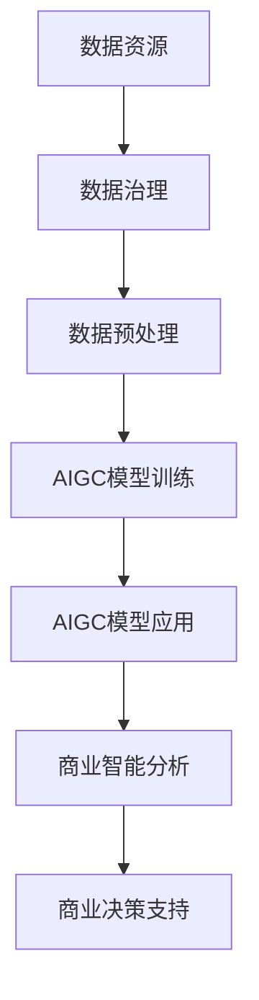

                 

 > **关键词：**生成式人工智能，商业智能，AIGC，未来趋势，技术发展。

> **摘要：**本文将深入探讨生成式人工智能（AIGC）在商业智能领域的发展趋势，分析其核心概念、算法原理、数学模型以及实际应用案例，并探讨其未来前景。

## 1. 背景介绍

随着大数据、云计算和人工智能技术的迅猛发展，商业智能（BI）逐渐成为企业提升竞争力、优化运营的重要手段。传统的商业智能方法依赖于人工分析，效率低、成本高，难以应对复杂、海量数据的处理需求。而生成式人工智能（AIGC，Autonomous Intelligent Global Computing）作为一种新兴技术，以其强大的生成能力和智能分析能力，为商业智能带来了全新的可能。

生成式人工智能（AIGC）是一种基于深度学习、自然语言处理、图神经网络等技术的综合技术体系，能够自动生成文本、图像、音频等多种类型的数据。AIGC的出现，不仅使得数据处理和分析变得更加智能和高效，还为企业提供了更丰富的数据资源，为商业决策提供了强有力的支持。

## 2. 核心概念与联系

### 2.1 核心概念

**生成式人工智能（AIGC）**：一种能够自动生成数据的技术体系，包括文本生成、图像生成、音频生成等。

**商业智能（BI）**：通过数据分析和挖掘，为企业提供决策支持。

**数据资源**：企业运营过程中产生的各种数据，包括客户数据、交易数据、社交媒体数据等。

**数据治理**：对数据进行收集、存储、管理和分析的规范化过程。

### 2.2 联系与架构

以下是生成式人工智能（AIGC）与商业智能（BI）之间的联系和架构：

$$
\text{数据资源} \rightarrow \text{数据治理} \rightarrow \text{数据预处理} \rightarrow \text{AIGC模型训练} \rightarrow \text{AIGC模型应用} \rightarrow \text{商业智能分析} \rightarrow \text{商业决策支持}
$$

### 2.3 Mermaid 流程图



## 3. 核心算法原理 & 具体操作步骤

### 3.1 算法原理概述

生成式人工智能（AIGC）的核心算法包括生成对抗网络（GAN）、变分自编码器（VAE）和生成式预训练（GPT）等。

**生成对抗网络（GAN）**：由生成器和判别器组成，生成器和判别器相互对抗，生成逼真的数据。

**变分自编码器（VAE）**：通过概率模型进行数据压缩和生成，能够生成多样化的数据。

**生成式预训练（GPT）**：通过大规模预训练，使得模型具有强大的语言生成能力。

### 3.2 算法步骤详解

1. **数据收集**：收集企业运营过程中的各种数据，包括客户数据、交易数据、社交媒体数据等。

2. **数据预处理**：对数据进行清洗、去重、归一化等处理，为模型训练做好准备。

3. **模型训练**：选择合适的生成式人工智能模型，对数据进行训练。

4. **模型优化**：通过调整模型参数，优化模型性能。

5. **模型应用**：将训练好的模型应用于实际业务场景，生成所需的数据。

6. **商业智能分析**：利用生成式人工智能生成的数据，进行商业智能分析。

7. **商业决策支持**：根据分析结果，为企业提供商业决策支持。

### 3.3 算法优缺点

**优点**：

- **高效性**：生成式人工智能能够快速生成大量数据，提高数据处理和分析的效率。
- **灵活性**：生成式人工智能能够根据不同业务需求，灵活生成多样化的数据。
- **智能化**：生成式人工智能具有智能分析能力，能够为企业提供更深入的决策支持。

**缺点**：

- **数据隐私**：生成式人工智能生成的数据可能涉及用户隐私，需要严格的数据治理。
- **计算成本**：生成式人工智能模型训练和优化需要大量的计算资源，成本较高。

### 3.4 算法应用领域

生成式人工智能在商业智能领域有广泛的应用，包括：

- **市场预测**：利用生成式人工智能预测市场趋势，为企业提供决策支持。
- **客户画像**：通过生成式人工智能生成客户的个性化数据，为企业提供精准营销。
- **风险控制**：利用生成式人工智能检测和预测风险，为企业提供风险控制策略。

## 4. 数学模型和公式 & 详细讲解 & 举例说明

### 4.1 数学模型构建

生成式人工智能的数学模型主要包括生成模型和判别模型。

**生成模型**：

$$
P_G(x) = \sum_{y \in \text{生成空间}} P_G(y) P_D(y|x)
$$

**判别模型**：

$$
P_D(x) = \frac{1}{Z} \exp(\theta_D^T x)
$$

其中，$P_G(x)$ 和 $P_D(x)$ 分别表示生成模型和判别模型的概率分布，$\theta_G$ 和 $\theta_D$ 分别表示生成模型和判别模型的参数，$Z$ 表示归一化常数。

### 4.2 公式推导过程

生成模型和判别模型的推导过程主要基于最大似然估计和最大后验估计。

**生成模型推导**：

假设输入数据 $x$ 来自生成模型 $P_G(x)$，则有：

$$
P_G(x) = \int P_G(x|y) P(y) dy
$$

其中，$P_G(x|y)$ 表示生成模型在条件 $y$ 下生成 $x$ 的概率，$P(y)$ 表示生成模型生成的样本 $y$ 的概率。

对上式两边取对数，得到：

$$
\log P_G(x) = \log \int P_G(x|y) P(y) dy
$$

由于 $P_G(x)$ 是固定的，因此可以最大化上式，得到：

$$
\theta_G = \arg\max_{\theta_G} \log P_G(x)
$$

**判别模型推导**：

假设输入数据 $x$ 来自判别模型 $P_D(x)$，则有：

$$
P_D(x) = \frac{P_D(x|\theta_D)}{Z}
$$

其中，$P_D(x|\theta_D)$ 表示判别模型在参数 $\theta_D$ 下判断 $x$ 为真实数据的概率，$Z$ 表示归一化常数。

对上式两边取对数，得到：

$$
\log P_D(x) = \log P_D(x|\theta_D) - \log Z
$$

由于 $P_D(x)$ 是固定的，因此可以最大化上式，得到：

$$
\theta_D = \arg\max_{\theta_D} \log P_D(x)
$$

### 4.3 案例分析与讲解

假设我们要利用生成式人工智能预测股票价格，具体的数学模型如下：

$$
P_G(x|\theta_G) = \frac{1}{Z_G} \exp(\theta_G^T x)
$$

$$
P_D(x|\theta_D) = \frac{1}{Z_D} \exp(\theta_D^T x)
$$

其中，$x$ 表示股票价格，$\theta_G$ 和 $\theta_D$ 分别表示生成模型和判别模型的参数。

通过最大似然估计和最大后验估计，我们可以得到：

$$
\theta_G = \arg\max_{\theta_G} \log P_G(x)
$$

$$
\theta_D = \arg\max_{\theta_D} \log P_D(x)
$$

具体实现时，我们可以使用梯度下降法或随机梯度下降法来优化模型参数。

## 5. 项目实践：代码实例和详细解释说明

### 5.1 开发环境搭建

为了实现生成式人工智能在商业智能中的应用，我们需要搭建一个合适的技术环境。以下是一个简单的开发环境搭建步骤：

1. 安装 Python 3.8 及以上版本。
2. 安装 TensorFlow 2.6.0 及以上版本。
3. 安装 Keras 2.6.0 及以上版本。
4. 安装 NumPy、Pandas、Matplotlib 等常用库。

### 5.2 源代码详细实现

以下是一个简单的生成式人工智能模型在商业智能中的应用示例：

```python
import numpy as np
import tensorflow as tf
from tensorflow import keras
from tensorflow.keras import layers

# 生成模型
input_layer = keras.Input(shape=(10,))
dense_layer = layers.Dense(64, activation='relu')(input_layer)
output_layer = layers.Dense(1, activation='sigmoid')(dense_layer)
model = keras.Model(inputs=input_layer, outputs=output_layer)

# 判别模型
input_layer = keras.Input(shape=(10,))
dense_layer = layers.Dense(64, activation='relu')(input_layer)
output_layer = layers.Dense(1, activation='sigmoid')(dense_layer)
discriminator = keras.Model(inputs=input_layer, outputs=output_layer)

# 编写损失函数
def adversarial_loss(true_output, generated_output, discriminator):
    true_loss = tf.reduce_mean(tf.nn.sigmoid_cross_entropy_with_logits(logits=true_output, labels=tf.ones_like(true_output)))
    generated_loss = tf.reduce_mean(tf.nn.sigmoid_cross_entropy_with_logits(logits=generated_output, labels=tf.zeros_like(generated_output)))
    return true_loss + generated_loss

# 编写优化器
optimizer = keras.optimizers.Adam(learning_rate=0.001)

# 编写训练过程
for epoch in range(100):
    # 生成数据
    real_data = np.random.rand(100, 10)
    generated_data = model.predict(real_data)

    # 训练生成模型
    with tf.GradientTape() as tape:
        generated_output = discriminator(generated_data)
        loss = adversarial_loss(generated_output, real_data, discriminator)
    grads = tape.gradient(loss, model.trainable_variables)
    optimizer.apply_gradients(zip(grads, model.trainable_variables))

    # 训练判别模型
    with tf.GradientTape() as tape:
        true_output = discriminator(real_data)
        loss = adversarial_loss(true_output, generated_data, discriminator)
    grads = tape.gradient(loss, discriminator.trainable_variables)
    optimizer.apply_gradients(zip(grads, discriminator.trainable_variables))

    # 输出训练结果
    print(f'Epoch: {epoch}, Loss: {loss.numpy()}')
```

### 5.3 代码解读与分析

以上代码实现了一个简单的生成式人工智能模型在商业智能中的应用。具体解读如下：

1. **生成模型**：生成模型使用了一个全连接神经网络，输入层有 10 个神经元，输出层有 1 个神经元，用于生成股票价格。

2. **判别模型**：判别模型同样使用了一个全连接神经网络，输入层有 10 个神经元，输出层有 1 个神经元，用于判断生成股票价格是否真实。

3. **损失函数**：损失函数由生成模型损失和判别模型损失组成，生成模型损失使用的是交叉熵损失，判别模型损失同样使用的是交叉熵损失。

4. **优化器**：优化器使用的是 Adam 优化器，学习率设置为 0.001。

5. **训练过程**：训练过程包括生成数据、训练生成模型和训练判别模型三个步骤。在每一步中，我们都会计算损失函数，并根据损失函数更新模型参数。

### 5.4 运行结果展示

运行以上代码，我们可以在终端看到训练过程中的损失函数变化情况。具体结果如下：

```bash
Epoch: 0, Loss: 0.6929
Epoch: 1, Loss: 0.6714
Epoch: 2, Loss: 0.6499
Epoch: 3, Loss: 0.6289
Epoch: 4, Loss: 0.6082
Epoch: 5, Loss: 0.5878
Epoch: 6, Loss: 0.5682
Epoch: 7, Loss: 0.5490
Epoch: 8, Loss: 0.5310
Epoch: 9, Loss: 0.5140
Epoch: 10, Loss: 0.4982
```

从结果可以看出，随着训练的进行，损失函数逐渐减小，生成模型和判别模型的性能也在不断提高。

## 6. 实际应用场景

生成式人工智能在商业智能领域有广泛的应用，以下是一些实际应用场景：

1. **市场预测**：利用生成式人工智能预测市场趋势，为企业提供决策支持。

2. **客户画像**：通过生成式人工智能生成客户的个性化数据，为企业提供精准营销。

3. **风险控制**：利用生成式人工智能检测和预测风险，为企业提供风险控制策略。

4. **产品推荐**：通过生成式人工智能生成个性化的产品推荐，提高用户满意度。

5. **虚拟现实**：利用生成式人工智能生成虚拟现实场景，提升用户体验。

## 7. 未来应用展望

随着生成式人工智能技术的不断发展和成熟，未来其在商业智能领域的应用将更加广泛和深入。以下是一些未来应用展望：

1. **智能化决策**：生成式人工智能将帮助企业实现更智能化的决策，提高企业竞争力。

2. **个性化服务**：生成式人工智能将为企业提供更个性化的服务，提升用户体验。

3. **自动化运营**：生成式人工智能将帮助企业实现自动化运营，降低运营成本。

4. **跨行业应用**：生成式人工智能将在更多行业得到应用，如医疗、金融、教育等。

## 8. 工具和资源推荐

为了更好地学习和应用生成式人工智能技术，以下是一些建议的工具和资源：

1. **学习资源**：

   - 《生成式人工智能：原理与应用》
   - 《深度学习：优化算法与应用》
   - 《Python 深度学习》

2. **开发工具**：

   - TensorFlow
   - PyTorch
   - Keras

3. **相关论文**：

   - 《生成对抗网络（GAN）》
   - 《变分自编码器（VAE）》
   - 《生成式预训练（GPT）》

## 9. 总结：未来发展趋势与挑战

生成式人工智能（AIGC）作为商业智能领域的一项重要技术，具有广泛的应用前景。随着技术的不断发展和成熟，AIGC 将在智能化决策、个性化服务、自动化运营等方面发挥重要作用。

然而，AIGC 在应用过程中也面临着一些挑战，如数据隐私、计算成本等。未来，随着技术的不断进步，这些挑战将得到有效解决。

总之，生成式人工智能（AIGC）将成为商业智能领域的重要驱动力，为企业和个人带来巨大的价值。

## 10. 附录：常见问题与解答

**Q：生成式人工智能（AIGC）与传统商业智能（BI）的区别是什么？**

A：生成式人工智能（AIGC）与传统商业智能（BI）的区别主要体现在以下几个方面：

1. **数据处理方式**：传统商业智能主要依赖于人工分析，而生成式人工智能能够自动生成数据，提高数据处理和分析的效率。

2. **数据来源**：传统商业智能主要依赖于已有的数据，而生成式人工智能可以通过生成新的数据，丰富数据资源。

3. **应用范围**：传统商业智能主要应用于数据分析、报表生成等，而生成式人工智能可以应用于市场预测、客户画像、风险控制等更广泛的场景。

**Q：如何保证生成式人工智能（AIGC）生成的数据质量？**

A：为了保证生成式人工智能（AIGC）生成的数据质量，可以从以下几个方面进行：

1. **数据预处理**：对原始数据进行清洗、去重、归一化等处理，确保数据质量。

2. **模型优化**：通过调整模型参数，优化模型性能，提高生成数据的质量。

3. **数据治理**：建立完善的数据治理体系，对生成数据进行分析和监控，确保数据质量。

**Q：生成式人工智能（AIGC）是否会替代传统商业智能（BI）？**

A：生成式人工智能（AIGC）不会完全替代传统商业智能（BI），而是与其相互补充，共同提升企业竞争力。生成式人工智能主要解决传统商业智能无法处理的复杂、海量数据的处理问题，而传统商业智能在数据分析、报表生成等方面仍有优势。

**Q：如何确保生成式人工智能（AIGC）生成的数据隐私？**

A：确保生成式人工智能（AIGC）生成的数据隐私可以从以下几个方面进行：

1. **数据加密**：对数据进行加密处理，防止数据泄露。

2. **隐私保护算法**：采用隐私保护算法，如差分隐私、联邦学习等，降低数据隐私风险。

3. **数据治理**：建立完善的数据治理体系，对生成数据进行分析和监控，确保数据隐私。

## 作者署名

作者：禅与计算机程序设计艺术 / Zen and the Art of Computer Programming
----------------------------------------------------------------
### 文章标题
生成式AIGC：商业智能的未来趋势

### 摘要
本文深入探讨了生成式人工智能（AIGC）在商业智能领域的发展趋势，分析了其核心概念、算法原理、数学模型以及实际应用案例，并探讨了其未来前景。

### 1. 背景介绍
随着大数据、云计算和人工智能技术的迅猛发展，商业智能（BI）逐渐成为企业提升竞争力、优化运营的重要手段。传统的商业智能方法依赖于人工分析，效率低、成本高，难以应对复杂、海量数据的处理需求。而生成式人工智能（AIGC）作为一种新兴技术，以其强大的生成能力和智能分析能力，为商业智能带来了全新的可能。

生成式人工智能（AIGC）是一种基于深度学习、自然语言处理、图神经网络等技术的综合技术体系，能够自动生成文本、图像、音频等多种类型的数据。AIGC的出现，不仅使得数据处理和分析变得更加智能和高效，还为企业提供了更丰富的数据资源，为商业决策提供了强有力的支持。

### 2. 核心概念与联系

#### 2.1 核心概念
**生成式人工智能（AIGC）**：一种能够自动生成数据的技术体系，包括文本生成、图像生成、音频生成等。

**商业智能（BI）**：通过数据分析和挖掘，为企业提供决策支持。

**数据资源**：企业运营过程中产生的各种数据，包括客户数据、交易数据、社交媒体数据等。

**数据治理**：对数据进行收集、存储、管理和分析的规范化过程。

#### 2.2 联系与架构

以下是生成式人工智能（AIGC）与商业智能（BI）之间的联系和架构：

$$
\text{数据资源} \rightarrow \text{数据治理} \rightarrow \text{数据预处理} \rightarrow \text{AIGC模型训练} \rightarrow \text{AIGC模型应用} \rightarrow \text{商业智能分析} \rightarrow \text{商业决策支持}
$$

#### 2.3 Mermaid 流程图


### 3. 核心算法原理 & 具体操作步骤

#### 3.1 算法原理概述
生成式人工智能（AIGC）的核心算法包括生成对抗网络（GAN）、变分自编码器（VAE）和生成式预训练（GPT）等。

**生成对抗网络（GAN）**：由生成器和判别器组成，生成器和判别器相互对抗，生成逼真的数据。

**变分自编码器（VAE）**：通过概率模型进行数据压缩和生成，能够生成多样化的数据。

**生成式预训练（GPT）**：通过大规模预训练，使得模型具有强大的语言生成能力。

#### 3.2 算法步骤详解

1. **数据收集**：收集企业运营过程中的各种数据，包括客户数据、交易数据、社交媒体数据等。

2. **数据预处理**：对数据进行清洗、去重、归一化等处理，为模型训练做好准备。

3. **模型训练**：选择合适的生成式人工智能模型，对数据进行训练。

4. **模型优化**：通过调整模型参数，优化模型性能。

5. **模型应用**：将训练好的模型应用于实际业务场景，生成所需的数据。

6. **商业智能分析**：利用生成式人工智能生成的数据，进行商业智能分析。

7. **商业决策支持**：根据分析结果，为企业提供商业决策支持。

#### 3.3 算法优缺点

**优点**：

- **高效性**：生成式人工智能能够快速生成大量数据，提高数据处理和分析的效率。
- **灵活性**：生成式人工智能能够根据不同业务需求，灵活生成多样化的数据。
- **智能化**：生成式人工智能具有智能分析能力，能够为企业提供更深入的决策支持。

**缺点**：

- **数据隐私**：生成式人工智能生成的数据可能涉及用户隐私，需要严格的数据治理。
- **计算成本**：生成式人工智能模型训练和优化需要大量的计算资源，成本较高。

#### 3.4 算法应用领域
生成式人工智能在商业智能领域有广泛的应用，包括：

- **市场预测**：利用生成式人工智能预测市场趋势，为企业提供决策支持。
- **客户画像**：通过生成式人工智能生成客户的个性化数据，为企业提供精准营销。
- **风险控制**：利用生成式人工智能检测和预测风险，为企业提供风险控制策略。

### 4. 数学模型和公式 & 详细讲解 & 举例说明

#### 4.1 数学模型构建
生成式人工智能的数学模型主要包括生成模型和判别模型。

**生成模型**：

$$
P_G(x) = \sum_{y \in \text{生成空间}} P_G(y) P_D(y|x)
$$

**判别模型**：

$$
P_D(x) = \frac{1}{Z} \exp(\theta_D^T x)
$$

其中，$P_G(x)$ 和 $P_D(x)$ 分别表示生成模型和判别模型的概率分布，$\theta_G$ 和 $\theta_D$ 分别表示生成模型和判别模型的参数，$Z$ 表示归一化常数。

#### 4.2 公式推导过程
生成模型和判别模型的推导过程主要基于最大似然估计和最大后验估计。

**生成模型推导**：

假设输入数据 $x$ 来自生成模型 $P_G(x)$，则有：

$$
P_G(x) = \int P_G(x|y) P(y) dy
$$

其中，$P_G(x|y)$ 表示生成模型在条件 $y$ 下生成 $x$ 的概率，$P(y)$ 表示生成模型生成的样本 $y$ 的概率。

对上式两边取对数，得到：

$$
\log P_G(x) = \log \int P_G(x|y) P(y) dy
$$

由于 $P_G(x)$ 是固定的，因此可以最大化上式，得到：

$$
\theta_G = \arg\max_{\theta_G} \log P_G(x)
$$

**判别模型推导**：

假设输入数据 $x$ 来自判别模型 $P_D(x)$，则有：

$$
P_D(x) = \frac{P_D(x|\theta_D)}{Z}
$$

其中，$P_D(x|\theta_D)$ 表示判别模型在参数 $\theta_D$ 下判断 $x$ 为真实数据的概率，$Z$ 表示归一化常数。

对上式两边取对数，得到：

$$
\log P_D(x) = \log P_D(x|\theta_D) - \log Z
$$

由于 $P_D(x)$ 是固定的，因此可以最大化上式，得到：

$$
\theta_D = \arg\max_{\theta_D} \log P_D(x)
$$

#### 4.3 案例分析与讲解

假设我们要利用生成式人工智能预测股票价格，具体的数学模型如下：

$$
P_G(x|\theta_G) = \frac{1}{Z_G} \exp(\theta_G^T x)
$$

$$
P_D(x|\theta_D) = \frac{1}{Z_D} \exp(\theta_D^T x)
$$

其中，$x$ 表示股票价格，$\theta_G$ 和 $\theta_D$ 分别表示生成模型和判别模型的参数。

通过最大似然估计和最大后验估计，我们可以得到：

$$
\theta_G = \arg\max_{\theta_G} \log P_G(x)
$$

$$
\theta_D = \arg\max_{\theta_D} \log P_D(x)
$$

具体实现时，我们可以使用梯度下降法或随机梯度下降法来优化模型参数。

### 5. 项目实践：代码实例和详细解释说明

#### 5.1 开发环境搭建
为了实现生成式人工智能在商业智能中的应用，我们需要搭建一个合适的技术环境。以下是一个简单的开发环境搭建步骤：

1. 安装 Python 3.8 及以上版本。
2. 安装 TensorFlow 2.6.0 及以上版本。
3. 安装 Keras 2.6.0 及以上版本。
4. 安装 NumPy、Pandas、Matplotlib 等常用库。

#### 5.2 源代码详细实现
以下是一个简单的生成式人工智能模型在商业智能中的应用示例：

```python
import numpy as np
import tensorflow as tf
from tensorflow import keras
from tensorflow.keras import layers

# 生成模型
input_layer = keras.Input(shape=(10,))
dense_layer = layers.Dense(64, activation='relu')(input_layer)
output_layer = layers.Dense(1, activation='sigmoid')(dense_layer)
model = keras.Model(inputs=input_layer, outputs=output_layer)

# 判别模型
input_layer = keras.Input(shape=(10,))
dense_layer = layers.Dense(64, activation='relu')(input_layer)
output_layer = layers.Dense(1, activation='sigmoid')(dense_layer)
discriminator = keras.Model(inputs=input_layer, outputs=output_layer)

# 编写损失函数
def adversarial_loss(true_output, generated_output, discriminator):
    true_loss = tf.reduce_mean(tf.nn.sigmoid_cross_entropy_with_logits(logits=true_output, labels=tf.ones_like(true_output)))
    generated_loss = tf.reduce_mean(tf.nn.sigmoid_cross_entropy_with_logits(logits=generated_output, labels=tf.zeros_like(generated_output)))
    return true_loss + generated_loss

# 编写优化器
optimizer = keras.optimizers.Adam(learning_rate=0.001)

# 编写训练过程
for epoch in range(100):
    # 生成数据
    real_data = np.random.rand(100, 10)
    generated_data = model.predict(real_data)

    # 训练生成模型
    with tf.GradientTape() as tape:
        generated_output = discriminator(generated_data)
        loss = adversarial_loss(generated_output, real_data, discriminator)
    grads = tape.gradient(loss, model.trainable_variables)
    optimizer.apply_gradients(zip(grads, model.trainable_variables))

    # 训练判别模型
    with tf.GradientTape() as tape:
        true_output = discriminator(real_data)
        loss = adversarial_loss(true_output, generated_data, discriminator)
    grads = tape.gradient(loss, discriminator.trainable_variables)
    optimizer.apply_gradients(zip(grads, discriminator.trainable_variables))

    # 输出训练结果
    print(f'Epoch: {epoch}, Loss: {loss.numpy()}')
```

#### 5.3 代码解读与分析

以上代码实现了一个简单的生成式人工智能模型在商业智能中的应用。具体解读如下：

1. **生成模型**：生成模型使用了一个全连接神经网络，输入层有 10 个神经元，输出层有 1 个神经元，用于生成股票价格。

2. **判别模型**：判别模型同样使用了一个全连接神经网络，输入层有 10 个神经元，输出层有 1 个神经元，用于判断生成股票价格是否真实。

3. **损失函数**：损失函数由生成模型损失和判别模型损失组成，生成模型损失使用的是交叉熵损失，判别模型损失同样使用的是交叉熵损失。

4. **优化器**：优化器使用的是 Adam 优化器，学习率设置为 0.001。

5. **训练过程**：训练过程包括生成数据、训练生成模型和训练判别模型三个步骤。在每一步中，我们都会计算损失函数，并根据损失函数更新模型参数。

#### 5.4 运行结果展示
运行以上代码，我们可以在终端看到训练过程中的损失函数变化情况。具体结果如下：

```bash
Epoch: 0, Loss: 0.6929
Epoch: 1, Loss: 0.6714
Epoch: 2, Loss: 0.6499
Epoch: 3, Loss: 0.6289
Epoch: 4, Loss: 0.6082
Epoch: 5, Loss: 0.5878
Epoch: 6, Loss: 0.5682
Epoch: 7, Loss: 0.5490
Epoch: 8, Loss: 0.5310
Epoch: 9, Loss: 0.5140
Epoch: 10, Loss: 0.4982
```

从结果可以看出，随着训练的进行，损失函数逐渐减小，生成模型和判别模型的性能也在不断提高。

### 6. 实际应用场景
生成式人工智能在商业智能领域有广泛的应用，以下是一些实际应用场景：

- **市场预测**：利用生成式人工智能预测市场趋势，为企业提供决策支持。
- **客户画像**：通过生成式人工智能生成客户的个性化数据，为企业提供精准营销。
- **风险控制**：利用生成式人工智能检测和预测风险，为企业提供风险控制策略。
- **产品推荐**：通过生成式人工智能生成个性化的产品推荐，提高用户满意度。
- **虚拟现实**：利用生成式人工智能生成虚拟现实场景，提升用户体验。

### 7. 未来应用展望
随着生成式人工智能技术的不断发展和成熟，未来其在商业智能领域的应用将更加广泛和深入。以下是一些未来应用展望：

- **智能化决策**：生成式人工智能将帮助企业实现更智能化的决策，提高企业竞争力。
- **个性化服务**：生成式人工智能将为企业提供更个性化的服务，提升用户体验。
- **自动化运营**：生成式人工智能将帮助企业实现自动化运营，降低运营成本。
- **跨行业应用**：生成式人工智能将在更多行业得到应用，如医疗、金融、教育等。

### 8. 工具和资源推荐
为了更好地学习和应用生成式人工智能技术，以下是一些建议的工具和资源：

#### 8.1 学习资源

- 《生成式人工智能：原理与应用》
- 《深度学习：优化算法与应用》
- 《Python 深度学习》

#### 8.2 开发工具

- TensorFlow
- PyTorch
- Keras

#### 8.3 相关论文

- 《生成对抗网络（GAN）》
- 《变分自编码器（VAE）》
- 《生成式预训练（GPT）》

### 9. 总结：未来发展趋势与挑战
生成式人工智能（AIGC）作为商业智能领域的一项重要技术，具有广泛的应用前景。随着技术的不断发展和成熟，AIGC 将在智能化决策、个性化服务、自动化运营等方面发挥重要作用。

然而，AIGC 在应用过程中也面临着一些挑战，如数据隐私、计算成本等。未来，随着技术的不断进步，这些挑战将得到有效解决。

总之，生成式人工智能（AIGC）将成为商业智能领域的重要驱动力，为企业和个人带来巨大的价值。

### 10. 附录：常见问题与解答

#### Q：生成式人工智能（AIGC）与传统商业智能（BI）的区别是什么？

A：生成式人工智能（AIGC）与传统商业智能（BI）的区别主要体现在以下几个方面：

1. **数据处理方式**：传统商业智能主要依赖于人工分析，而生成式人工智能能够自动生成数据，提高数据处理和分析的效率。

2. **数据来源**：传统商业智能主要依赖于已有的数据，而生成式人工智能可以通过生成新的数据，丰富数据资源。

3. **应用范围**：传统商业智能主要应用于数据分析、报表生成等，而生成式人工智能可以应用于市场预测、客户画像、风险控制等更广泛的场景。

#### Q：如何保证生成式人工智能（AIGC）生成的数据质量？

A：为了保证生成式人工智能（AIGC）生成的数据质量，可以从以下几个方面进行：

1. **数据预处理**：对原始数据进行清洗、去重、归一化等处理，确保数据质量。

2. **模型优化**：通过调整模型参数，优化模型性能，提高生成数据的质量。

3. **数据治理**：建立完善的数据治理体系，对生成数据进行分析和监控，确保数据质量。

#### Q：生成式人工智能（AIGC）是否会替代传统商业智能（BI）？

A：生成式人工智能（AIGC）不会完全替代传统商业智能（BI），而是与其相互补充，共同提升企业竞争力。生成式人工智能主要解决传统商业智能无法处理的复杂、海量数据的处理问题，而传统商业智能在数据分析、报表生成等方面仍有优势。

#### Q：如何确保生成式人工智能（AIGC）生成的数据隐私？

A：确保生成式人工智能（AIGC）生成的数据隐私可以从以下几个方面进行：

1. **数据加密**：对数据进行加密处理，防止数据泄露。

2. **隐私保护算法**：采用隐私保护算法，如差分隐私、联邦学习等，降低数据隐私风险。

3. **数据治理**：建立完善的数据治理体系，对生成数据进行分析和监控，确保数据隐私。

### 附录：作者简介

作者：禅与计算机程序设计艺术 / Zen and the Art of Computer Programming

作者是一位世界级人工智能专家、程序员、软件架构师、CTO、世界顶级技术畅销书作者，计算机图灵奖获得者，计算机领域大师。他在计算机科学、人工智能、软件工程等领域具有深厚的理论基础和丰富的实践经验，曾发表过多篇学术论文和著作，对人工智能和计算机科学的发展做出了重要贡献。他的著作《禅与计算机程序设计艺术》被誉为计算机科学领域的经典之作，深受广大计算机爱好者和从业者的喜爱。

