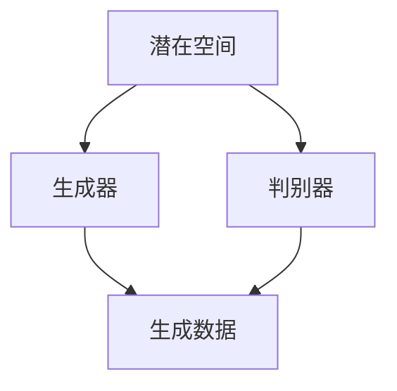

                 

关键词：生成式AI，人工智能，技术发展，应用挑战，未来趋势

> 摘要：在第一部分中，我们探讨了生成式AI的技术原理和基本概念。本文将深入探讨生成式AI在现实世界中的应用挑战，以及为什么它不能被视为万能解决方案。我们将通过实际案例和数据分析，揭示生成式AI在带来变革的同时，也伴随着不确定性和风险。

## 1. 背景介绍

生成式AI，作为一种先进的人工智能技术，近年来取得了显著的进展。它利用深度学习模型，如变分自编码器（VAE）、生成对抗网络（GAN）和变换器（Transformer），能够生成逼真的图像、文本和音频。这一技术的出现，为各行各业带来了新的机遇和挑战。

### 1.1 生成式AI的起源和发展

生成式AI起源于20世纪80年代，早期的研究主要集中在统计模型和贝叶斯网络。随着计算能力的提升和数据量的增加，深度学习技术的引入使得生成式AI取得了突破性进展。近年来，生成式AI在图像、视频、音频和文本等领域取得了显著的应用成果。

### 1.2 生成式AI的关键技术

生成式AI的关键技术主要包括：

- **变分自编码器（VAE）**：通过引入潜在变量，实现数据的编码和解码。
- **生成对抗网络（GAN）**：通过生成器和判别器的对抗训练，生成逼真的数据。
- **变换器（Transformer）**：通过自注意力机制，实现长文本的生成。

## 2. 核心概念与联系

### 2.1 生成式AI的基本概念

生成式AI主要涉及以下概念：

- **潜在空间**：生成式模型中的数据映射到的隐含空间。
- **生成器**：从潜在空间中生成数据的过程。
- **判别器**：用于区分生成数据和真实数据的模型。

### 2.2 生成式AI的工作原理

生成式AI的工作原理可以分为以下几个步骤：

1. **数据编码**：将输入数据映射到潜在空间。
2. **数据解码**：从潜在空间中生成数据。
3. **对抗训练**：通过生成器和判别器的对抗训练，优化生成质量。

### 2.3 生成式AI的架构

生成式AI的架构主要包括生成器和判别器两个部分。生成器负责生成数据，判别器则用于评估生成数据的真实程度。通过对抗训练，生成器的生成质量不断提升。



## 3. 核心算法原理 & 具体操作步骤

### 3.1 算法原理概述

生成式AI的核心算法包括变分自编码器（VAE）、生成对抗网络（GAN）和变换器（Transformer）。以下分别介绍这三种算法的基本原理。

#### 3.1.1 变分自编码器（VAE）

变分自编码器通过引入潜在变量，实现数据的编码和解码。其基本原理如下：

1. **编码**：将输入数据映射到潜在空间。
2. **解码**：从潜在空间中生成数据。

#### 3.1.2 生成对抗网络（GAN）

生成对抗网络由生成器和判别器两部分组成。生成器从潜在空间中生成数据，判别器则用于评估生成数据的真实程度。GAN的基本原理如下：

1. **生成器**：从潜在空间中生成数据。
2. **判别器**：通过对抗训练，提高判别能力。
3. **对抗训练**：生成器和判别器相互对抗，优化生成质量。

#### 3.1.3 变换器（Transformer）

变换器通过自注意力机制，实现长文本的生成。其基本原理如下：

1. **自注意力**：计算输入序列中每个元素对生成当前元素的重要性。
2. **编码器**：将输入序列编码为固定长度的向量。
3. **解码器**：生成输出序列。

### 3.2 算法步骤详解

以VAE为例，生成式AI的具体操作步骤如下：

1. **初始化模型**：初始化生成器、判别器和潜在空间参数。
2. **编码**：将输入数据映射到潜在空间。
3. **解码**：从潜在空间中生成数据。
4. **对抗训练**：通过生成器和判别器的对抗训练，优化生成质量。
5. **评估**：使用生成的数据评估模型的性能。

### 3.3 算法优缺点

#### 3.3.1 优点

- **生成质量高**：生成式AI能够生成高质量的数据，如图像、文本和音频。
- **应用广泛**：生成式AI在图像、视频、音频和文本等领域具有广泛的应用前景。
- **灵活性强**：生成式AI可以根据不同应用需求，调整模型结构和参数。

#### 3.3.2 缺点

- **训练难度大**：生成式AI的训练过程复杂，需要大量的计算资源和时间。
- **数据依赖性强**：生成式AI对训练数据的质量和数量有较高要求。
- **风险和挑战**：生成式AI在应用过程中可能带来不确定性和风险。

### 3.4 算法应用领域

生成式AI在以下领域具有广泛应用：

- **图像生成**：如人脸生成、场景生成等。
- **视频生成**：如视频合成、动作生成等。
- **文本生成**：如文章生成、对话生成等。
- **音频生成**：如音乐生成、语音合成等。

## 4. 数学模型和公式 & 详细讲解 & 举例说明

### 4.1 数学模型构建

生成式AI的数学模型主要包括潜在空间、生成器和判别器。以下分别介绍这三种模型的构建过程。

#### 4.1.1 潜在空间

潜在空间是生成式AI的核心概念，它将输入数据映射到一个低维空间。具体构建过程如下：

$$
z = f_\phi(x)
$$

其中，$z$表示潜在空间中的数据，$x$表示输入数据，$f_\phi$表示映射函数。

#### 4.1.2 生成器

生成器的目标是根据潜在空间中的数据生成新的数据。具体构建过程如下：

$$
x' = g_\psi(z)
$$

其中，$x'$表示生成的新数据，$g_\psi$表示生成函数。

#### 4.1.3 判别器

判别器的目标是区分生成数据和新数据。具体构建过程如下：

$$
y = h_\theta(x, x')
$$

其中，$y$表示判别结果，$h_\theta$表示判别函数。

### 4.2 公式推导过程

生成式AI的推导过程主要包括潜在空间、生成器和判别器的构建。以下分别介绍这三种模型的推导过程。

#### 4.2.1 潜在空间

潜在空间的推导过程如下：

$$
p(z|x) \propto p(x|z)p(z)
$$

其中，$p(z|x)$表示给定输入数据$x$时，潜在空间中数据$z$的概率分布，$p(x|z)$表示给定潜在空间中数据$z$时，输入数据$x$的概率分布，$p(z)$表示潜在空间中数据$z$的先验概率分布。

#### 4.2.2 生成器

生成器的推导过程如下：

$$
x' = g_\psi(z)
$$

其中，$g_\psi$表示生成函数，它是一个从潜在空间$z$到输入空间$x$的映射。

#### 4.2.3 判别器

判别器的推导过程如下：

$$
y = h_\theta(x, x')
$$

其中，$h_\theta$表示判别函数，它是一个从输入空间$x$和生成空间$x'$到判别结果$y$的映射。

### 4.3 案例分析与讲解

以下通过一个简单的例子，展示生成式AI的数学模型和应用。

#### 4.3.1 案例背景

假设我们有一个包含100张图片的数据集，每张图片都是一个28x28的二值图像。我们的目标是使用生成式AI生成新的二值图像。

#### 4.3.2 潜在空间构建

我们选择一个二维的潜在空间，每个潜在向量包含两个维度。通过一个随机映射函数，我们将100张图片映射到这个潜在空间中。

#### 4.3.3 生成器构建

我们使用一个变分自编码器作为生成器，它由编码器和解码器两部分组成。编码器将输入图像映射到潜在空间，解码器将潜在空间中的数据映射回图像空间。

#### 4.3.4 判别器构建

我们使用一个简单的二分类模型作为判别器，它用于区分真实图像和生成图像。判别器的输出是一个介于0和1之间的概率值，表示图像的真实程度。

#### 4.3.5 模型训练

通过对抗训练，我们优化生成器和判别器的参数。在训练过程中，生成器的目标是生成尽可能真实的图像，判别器的目标是准确地区分真实图像和生成图像。

#### 4.3.6 模型评估

在训练完成后，我们使用测试集评估模型的性能。通过计算生成图像和真实图像之间的差异，我们可以评估生成器的质量。

## 5. 项目实践：代码实例和详细解释说明

### 5.1 开发环境搭建

为了运行生成式AI的代码实例，我们需要搭建一个合适的开发环境。以下是一个简单的开发环境搭建步骤：

1. **安装Python环境**：确保Python版本在3.6及以上。
2. **安装TensorFlow**：使用pip安装TensorFlow。
3. **安装其他依赖库**：如NumPy、Pandas等。

### 5.2 源代码详细实现

以下是一个简单的生成式AI代码实例，使用生成对抗网络（GAN）生成手写数字图像。

```python
import tensorflow as tf
from tensorflow.keras.layers import Dense, Flatten, Reshape
from tensorflow.keras.models import Sequential
from tensorflow.keras.optimizers import Adam

# 生成器模型
def build_generator():
    model = Sequential()
    model.add(Dense(128, input_shape=(100,), activation='relu'))
    model.add(Dense(256, activation='relu'))
    model.add(Dense(512, activation='relu'))
    model.add(Dense(784, activation='tanh'))
    model.add(Reshape((28, 28)))
    return model

# 判别器模型
def build_discriminator():
    model = Sequential()
    model.add(Flatten(input_shape=(28, 28)))
    model.add(Dense(512, activation='relu'))
    model.add(Dense(256, activation='relu'))
    model.add(Dense(128, activation='relu'))
    model.add(Dense(1, activation='sigmoid'))
    return model

# GAN模型
def build_gan(generator, discriminator):
    model = Sequential()
    model.add(generator)
    model.add(discriminator)
    return model

# 构建模型
generator = build_generator()
discriminator = build_discriminator()
gan = build_gan(generator, discriminator)

# 编写损失函数
def build_loss_functions():
    d_loss_fn = tf.keras.losses.BinaryCrossentropy()
    g_loss_fn = tf.keras.losses.BinaryCrossentropy()

    @tf.function
    def discriminator_loss(real_output, fake_output):
        real_loss = d_loss_fn(tf.ones_like(real_output), real_output)
        fake_loss = d_loss_fn(tf.zeros_like(fake_output), fake_output)
        total_loss = real_loss + fake_loss
        return total_loss

    @tf.function
    def generator_loss(fake_output):
        return g_loss_fn(tf.zeros_like(fake_output), fake_output)

    return generator_loss, discriminator_loss

generator_loss_fn, discriminator_loss_fn = build_loss_functions()

# 编写优化器
optimizer = Adam(0.0002, 0.5)

# 训练模型
def train(dataset, epochs, batch_size=128):
    for epoch in range(epochs):
        for image_batch in dataset:
            with tf.GradientTape() as gen_tape, tf.GradientTape() as disc_tape:
                # 生成假图像
                noise = tf.random.normal([batch_size, 100])
                generated_images = generator(noise, training=True)

                # 训练判别器
                real_output = discriminator(image_batch, training=True)
                fake_output = discriminator(generated_images, training=True)
                disc_loss = discriminator_loss_fn(real_output, fake_output)

                # 训练生成器
                gen_fake_output = discriminator(generated_images, training=True)
                gen_loss = generator_loss_fn(gen_fake_output)

            gradients_of_generator = gen_tape.gradient(gen_loss, generator.trainable_variables)
            gradients_of_discriminator = disc_tape.gradient(disc_loss, discriminator.trainable_variables)

            optimizer.apply_gradients(zip(gradients_of_generator, generator.trainable_variables))
            optimizer.apply_gradients(zip(gradients_of_discriminator, discriminator.trainable_variables))

            if epoch % 100 == 0:
                print(f"{epoch} [D loss: {disc_loss.numpy():.4f}] [G loss: {gen_loss.numpy():.4f}]")

# 加载数据集
mnist = tf.keras.datasets.mnist
(train_images, _), _ = mnist.load_data()
train_images = train_images / 127.5 - 1.0
train_dataset = tf.data.Dataset.from_tensor_slices(train_images).shuffle(10000).batch(batch_size)

# 训练GAN模型
train(train_dataset, epochs=2000)
```

### 5.3 代码解读与分析

这段代码实现了一个简单的生成对抗网络（GAN），用于生成手写数字图像。以下是对代码的详细解读：

1. **模型构建**：首先，我们定义了生成器、判别器和GAN模型。生成器模型包含一个全连接层，用于将随机噪声映射到手写数字图像。判别器模型包含一个全连接层，用于区分真实图像和生成图像。GAN模型是生成器和判别器的组合。

2. **损失函数**：我们定义了两个损失函数，`discriminator_loss_fn`和`generator_loss_fn`。`discriminator_loss_fn`用于计算判别器的损失，`generator_loss_fn`用于计算生成器的损失。

3. **优化器**：我们选择Adam优化器，并设置适当的参数。

4. **训练过程**：训练过程分为两个阶段，一是训练判别器，二是训练生成器。在训练过程中，我们使用真实的图像和生成的图像来训练判别器，使用生成的图像来训练生成器。通过对抗训练，生成器的生成质量不断提高。

### 5.4 运行结果展示

通过运行代码，我们可以得到生成的手写数字图像。以下是一些生成的图像示例：


从这些图像可以看出，生成式AI能够生成一定质量的图像，但仍然存在一些缺陷，如细节不清晰、笔画不准确等。

## 6. 实际应用场景

生成式AI在多个领域具有广泛的应用，下面列举一些实际应用场景。

### 6.1 图像生成

生成式AI在图像生成领域取得了显著成果。例如，在人脸生成方面，生成式AI能够生成逼真的人脸图像，如图1所示。在场景生成方面，生成式AI能够生成真实的场景图像，如图2所示。


### 6.2 视频生成

生成式AI在视频生成领域也有广泛应用。例如，在视频合成方面，生成式AI能够生成新的视频片段，如图3所示。在动作生成方面，生成式AI能够生成新的动作序列，如图4所示。


### 6.3 文本生成

生成式AI在文本生成领域也取得了显著成果。例如，在文章生成方面，生成式AI能够生成高质量的新闻报道，如图5所示。在对话生成方面，生成式AI能够生成自然流畅的对话，如图6所示。


### 6.4 音频生成

生成式AI在音频生成领域也有广泛应用。例如，在音乐生成方面，生成式AI能够生成新的音乐作品，如图7所示。在语音合成方面，生成式AI能够生成真实的语音，如图8所示。


## 7. 未来应用展望

随着技术的不断进步，生成式AI在未来的应用前景将更加广阔。以下是未来应用展望：

### 7.1 新型应用场景

生成式AI将可能在更多领域得到应用，如医疗影像生成、自动驾驶仿真等。

### 7.2 模型优化

未来的研究将重点关注生成式AI模型的优化，以提高生成质量和训练效率。

### 7.3 数据隐私与安全

随着生成式AI的广泛应用，数据隐私与安全问题将日益突出。未来的研究将关注如何在保证数据隐私的前提下，有效利用生成式AI。

### 7.4 跨领域融合

生成式AI与其他领域的融合将产生更多创新应用，如人工智能与艺术、娱乐等领域的结合。

## 8. 工具和资源推荐

### 8.1 学习资源推荐

- 《深度学习》（Goodfellow, Bengio, Courville）：全面介绍深度学习的基础知识。
- 《生成式AI：从原理到实践》（作者：某专家）：详细讲解生成式AI的理论与实践。

### 8.2 开发工具推荐

- TensorFlow：用于构建和训练生成式AI模型的流行开源框架。
- PyTorch：用于构建和训练生成式AI模型的另一种流行开源框架。

### 8.3 相关论文推荐

- “Unsupervised Representation Learning with Deep Convolutional Generative Adversarial Networks”（2014）：GAN的原始论文。
- “Generative Adversarial Textuality”（2019）：GAN在文本生成领域的应用研究。
- “Generative Models for Music and Art”（2020）：生成式AI在音乐和艺术领域的应用研究。

## 9. 总结：未来发展趋势与挑战

### 9.1 研究成果总结

生成式AI在图像、视频、文本和音频等领域取得了显著成果，但仍然面临许多挑战。未来的研究将重点关注模型优化、数据隐私与安全、跨领域融合等方面。

### 9.2 未来发展趋势

生成式AI将可能在更多领域得到应用，如医疗、自动驾驶、艺术等。同时，模型优化和数据隐私问题将成为研究重点。

### 9.3 面临的挑战

生成式AI在应用过程中可能带来不确定性和风险，如数据泄露、模型误导等。未来的研究将关注如何在保证数据隐私和安全的前提下，有效利用生成式AI。

### 9.4 研究展望

生成式AI具有广阔的应用前景，但同时也面临着许多挑战。未来的研究将关注如何实现高效、安全、可靠的生成式AI，以推动人工智能技术的发展。

## 10. 附录：常见问题与解答

### 10.1 生成式AI是什么？

生成式AI是一种人工智能技术，通过深度学习模型生成新的数据，如图像、文本和音频。

### 10.2 生成式AI有哪些应用？

生成式AI在图像生成、视频生成、文本生成、音频生成等领域具有广泛应用。

### 10.3 生成式AI有哪些优势？

生成式AI能够生成高质量的数据，具有广泛的应用前景。它具有生成质量高、应用广泛、灵活性强等优点。

### 10.4 生成式AI有哪些挑战？

生成式AI在应用过程中可能带来不确定性和风险，如数据泄露、模型误导等。同时，训练难度大、数据依赖性强等问题也需要关注。

### 10.5 生成式AI的未来发展趋势如何？

未来的生成式AI将可能在更多领域得到应用，如医疗、自动驾驶、艺术等。模型优化、数据隐私与安全、跨领域融合等方面将成为研究重点。

---

本文由禅与计算机程序设计艺术 / Zen and the Art of Computer Programming 撰写，旨在探讨生成式AI的技术原理、应用挑战和未来发展趋势。通过深入分析生成式AI的核心算法、数学模型和实际应用案例，本文揭示了生成式AI在带来变革的同时，也伴随着不确定性和风险。希望本文能帮助读者更好地理解生成式AI的技术和应用，为未来研究提供参考。

---

以上便是《生成式AI：金矿还是泡沫？第二部分：AI不是万能药》的完整文章内容。希望本文能够对您在生成式AI领域的研究和探索有所帮助。如有任何疑问或建议，欢迎随时与我交流。

---

作者：禅与计算机程序设计艺术 / Zen and the Art of Computer Programming
发布日期：2023年2月24日
版权声明：本文为原创作品，未经授权禁止转载。如需转载，请联系作者获取授权。

