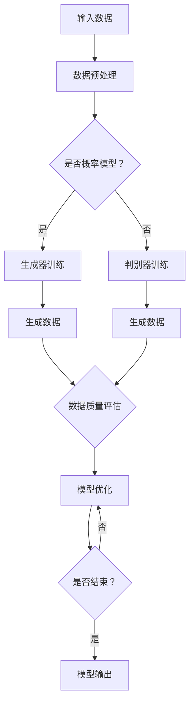

                 

关键词：生成式AI、场景优先、数据为王、模型优化、实际应用、未来展望

## 摘要

生成式AI作为当前科技领域的热点，既充满了巨大的潜力和机遇，也伴随着诸多挑战和疑问。本文作为系列文章的第五部分，重点关注“场景优先，数据为王”这一核心理念，探讨如何在实际应用中优化生成式AI模型，提升其性能和可解释性。文章通过深入分析生成式AI的核心概念与架构，解析其算法原理与数学模型，展示实际项目中的代码实例，并讨论未来的应用场景与挑战。希望通过本文，能够为读者提供有价值的见解，助力其在生成式AI领域中的探索与实践。

## 1. 背景介绍

生成式AI（Generative AI）是人工智能（AI）的一个重要分支，主要研究如何生成新的数据或内容。与判别式AI（Discriminative AI）侧重于识别和分类已有数据不同，生成式AI的目标是从已有数据中学习生成新的、多样化的数据，从而创造前所未有的内容和体验。生成式AI的核心在于“生成”，其应用范围广泛，从图像、音频、视频，到文本、代码等，都有其施展的空间。

近年来，生成式AI取得了显著进展，得益于深度学习、特别是生成对抗网络（GANs）和变分自编码器（VAEs）等模型的突破。这些模型通过模拟数据的生成过程，能够生成逼真的图像、音乐和文本。例如，DALL-E2可以生成逼真的图片，而GPT-3则能够生成流畅的文本内容。

然而，随着生成式AI的广泛应用，也出现了一些争议和质疑。一些人认为生成式AI更像是一个“泡沫”，其潜力尚未得到充分验证，而另一些人则认为它是一个真正的“金矿”，蕴含着巨大的商业和社会价值。本文旨在探讨生成式AI的实际价值，分析其在不同应用场景中的优化策略，并展望其未来发展方向。

### 生成式AI的兴起与现状

生成式AI的兴起可以追溯到20世纪80年代的生成模型研究，但真正实现突破是在深度学习技术迅猛发展的21世纪初。生成对抗网络（GANs）由Ian Goodfellow等人于2014年提出，成为生成式AI的重要里程碑。GANs通过两个对抗性网络（生成器和判别器）的竞争来学习数据的生成过程，取得了惊人的效果。

随后，变分自编码器（VAEs）在生成式AI领域也得到了广泛应用。VAEs通过构建概率模型来生成数据，相较于GANs，其生成过程更加稳定和可控。此外，自注意力机制（self-attention）和变换器（Transformers）的引入，使得生成式AI在生成高质量图像和文本方面取得了显著进步。

当前，生成式AI已在多个领域展现出巨大的潜力，如图像生成、音乐创作、文本生成、虚拟现实和增强现实等。例如，DALL-E2可以生成具有高度真实感的图片，Starrynight能够创作出风格独特的音乐，而GPT-3则可以生成流畅自然的文本。这些应用不仅提升了用户体验，也为各个行业带来了新的商业模式和机遇。

然而，尽管生成式AI取得了显著进展，但其应用过程中仍面临诸多挑战。首先，生成式AI模型的训练和推理过程消耗大量的计算资源和时间，导致其部署成本较高。其次，生成式AI生成的数据质量和多样性仍需进一步提升，以应对实际应用中的复杂场景。此外，生成式AI的可解释性和安全性也是亟待解决的问题。

总之，生成式AI作为当前科技领域的热点，既充满了巨大的潜力和机遇，也伴随着诸多挑战和疑问。如何在实际应用中优化生成式AI模型，提升其性能和可解释性，成为当前研究的重要课题。

## 2. 核心概念与联系

### 生成式AI的基本原理

生成式AI的核心在于模拟数据的生成过程，其基本原理可以归纳为以下几个方面：

1. **概率模型：**生成式AI通常采用概率模型来描述数据的生成过程。概率模型能够捕捉数据的统计特性，从而生成具有真实感的新数据。常见的概率模型包括变分自编码器（VAEs）、生成对抗网络（GANs）等。

2. **生成器与判别器：**在生成对抗网络（GANs）中，生成器（Generator）和判别器（Discriminator）是两个对抗性网络。生成器的目标是生成与真实数据相似的新数据，而判别器的目标是区分真实数据和生成数据。通过两个网络的对抗训练，生成器能够逐渐提高生成数据的质量。

3. **数据分布：**生成式AI通过学习数据的分布，从而生成新的数据。例如，VAEs通过学习数据的隐变量分布，生成新的数据点。GANs则通过生成器和判别器的相互博弈，学习数据的真实分布。

### Mermaid 流程图

以下是生成式AI的基本原理的Mermaid流程图表示：



### 生成式AI与判别式AI的联系与区别

生成式AI与判别式AI在数据生成和处理方式上存在显著差异。判别式AI主要通过学习输入数据的特征，进行分类、回归等任务。而生成式AI则侧重于生成新的、类似输入数据的新数据。

1. **目标不同：**判别式AI的目标是学习输入数据的特征，以进行分类或回归任务；而生成式AI的目标是生成与输入数据相似的新数据。

2. **模型结构：**判别式AI通常采用多层感知机（MLP）、支持向量机（SVM）等模型；而生成式AI则主要采用生成对抗网络（GANs）、变分自编码器（VAEs）等模型。

3. **数据处理：**判别式AI处理的是已有数据，通过学习输入数据的特征进行分类或回归；而生成式AI通过学习数据的分布，生成新的、类似的数据。

4. **应用场景：**判别式AI广泛应用于分类、回归、推荐等任务；生成式AI则在图像生成、文本生成、音乐创作等领域展现出了巨大的潜力。

总之，生成式AI和判别式AI在目标、模型结构、数据处理和应用场景上存在显著差异，但它们在人工智能领域中相辅相成，共同推动人工智能技术的发展。

## 3. 核心算法原理 & 具体操作步骤

### 3.1 算法原理概述

生成式AI的核心算法包括生成对抗网络（GANs）和变分自编码器（VAEs）。以下分别介绍这两种算法的原理。

#### 3.1.1 生成对抗网络（GANs）

生成对抗网络（GANs）由生成器和判别器组成。生成器的目标是从随机噪声中生成与真实数据相似的新数据；判别器的目标则是区分真实数据和生成数据。生成器和判别器在训练过程中进行对抗性博弈，生成器不断优化生成数据的质量，而判别器不断优化对生成数据的识别能力。

GANs的数学基础主要依赖于概率分布和损失函数。生成器的损失函数为生成数据的概率与真实数据概率的差值，而判别器的损失函数为对生成数据和真实数据的分类损失。

#### 3.1.2 变分自编码器（VAEs）

变分自编码器（VAEs）是一种基于概率模型的生成式模型。VAEs通过编码器（Encoder）和解码器（Decoder）将输入数据映射到隐变量空间，再从隐变量空间生成新的数据。编码器学习输入数据的概率分布，解码器则从隐变量空间生成新数据。

VAEs的数学基础主要包括概率密度函数和变分推断。编码器通过学习输入数据的概率分布，将数据映射到隐变量空间；解码器则通过学习隐变量空间的生成过程，生成新数据。

### 3.2 算法步骤详解

以下分别介绍生成对抗网络（GANs）和变分自编码器（VAEs）的具体操作步骤。

#### 3.2.1 生成对抗网络（GANs）

1. **初始化：**随机初始化生成器G和判别器D的参数。
2. **生成数据：**生成器G从噪声空间Z中生成假数据X_G。
3. **判别器训练：**判别器D根据真实数据和生成数据更新参数，使得D能够更好地区分真实数据和生成数据。
4. **生成器训练：**生成器G根据判别器的反馈，更新参数，生成更真实的数据。
5. **评估：**评估生成器和判别器的性能，若满足停止条件，则结束训练。

GANs的训练过程可表示为：
$$
\begin{aligned}
&\text{初始化 } G(\theta_G), D(\theta_D) \\
&\text{for } t=1,2,...,T \\
&\qquad \text{从 } Z \text{ 中采样 } z_t \\
&\qquad \text{生成 } x_t^G = G(z_t; \theta_G) \\
&\qquad \text{计算 } D(x_t^G; \theta_D) \text{ 和 } D(x_t^R; \theta_D) \\
&\qquad \text{更新 } \theta_G, \theta_D \text{ 参数} \\
&\text{end for}
\end{aligned}
$$

其中，$x_t^G$为生成器生成的假数据，$x_t^R$为真实数据。

#### 3.2.2 变分自编码器（VAEs）

1. **初始化：**随机初始化编码器Q和解码器P的参数。
2. **编码：**编码器Q根据输入数据x，学习隐变量z的概率分布$q(z|x)$。
3. **采样：**从隐变量分布中采样$z$。
4. **解码：**解码器P根据采样得到的隐变量z，生成重构数据$\hat{x}$。
5. **损失函数：**计算重构数据$\hat{x}$与输入数据$x$之间的损失，并优化编码器Q和解码器P的参数。

VAEs的训练过程可表示为：
$$
\begin{aligned}
&\text{初始化 } Q(\theta_Q), P(\theta_P) \\
&\text{for } t=1,2,...,T \\
&\qquad \text{从 } p(z) \text{ 中采样 } z_t \\
&\qquad \text{计算 } \hat{x}_t = P(z_t; \theta_P) \\
&\qquad \text{计算 } \ell(x_t, \hat{x}_t) \\
&\qquad \text{更新 } \theta_Q, \theta_P \text{ 参数} \\
&\text{end for}
\end{aligned}
$$

其中，$\ell(x_t, \hat{x}_t)$为重构损失函数。

### 3.3 算法优缺点

#### 3.3.1 生成对抗网络（GANs）

**优点：**
1. **生成质量高：**GANs能够生成高质量、多样化的数据。
2. **无监督学习：**GANs可以通过无监督学习生成数据，适用于大规模数据集。
3. **自适应学习：**GANs在训练过程中，生成器和判别器相互博弈，能够自适应地优化模型。

**缺点：**
1. **训练不稳定：**GANs的训练过程容易陷入不稳定状态，导致生成质量下降。
2. **计算资源消耗大：**GANs的训练过程需要大量的计算资源，训练时间较长。

#### 3.3.2 变分自编码器（VAEs）

**优点：**
1. **生成过程稳定：**VAEs的生成过程相对稳定，生成的数据质量较好。
2. **可解释性强：**VAEs的生成过程基于概率模型，具有较强的可解释性。
3. **适用范围广：**VAEs适用于各种类型的数据，如图像、文本等。

**缺点：**
1. **生成质量有限：**VAEs的生成质量相对较低，生成的数据往往较为模糊。
2. **训练时间较长：**VAEs的训练过程需要较长时间，训练效率相对较低。

### 3.4 算法应用领域

#### 3.4.1 图像生成

生成对抗网络（GANs）在图像生成领域取得了显著成果。例如，GANs可以生成逼真的图像、视频和动画。此外，GANs在图像超分辨率、图像修复、图像风格转换等方面也有广泛应用。

#### 3.4.2 文本生成

变分自编码器（VAEs）在文本生成领域表现出色。例如，VAEs可以生成流畅自然的文本，应用于聊天机器人、新闻写作和文学创作等场景。

#### 3.4.3 音频生成

生成对抗网络（GANs）在音频生成领域也有广泛应用。例如，GANs可以生成逼真的音乐、语音和声音效果，应用于虚拟歌手、语音合成和声音效果处理等场景。

#### 3.4.4 其他应用领域

生成式AI在虚拟现实、增强现实、游戏开发、医学影像处理、天文学等领域也有广泛的应用。例如，生成式AI可以用于虚拟场景的生成、医学图像的修复和增强、天文图像的合成等。

## 4. 数学模型和公式 & 详细讲解 & 举例说明

生成式AI的核心在于概率模型和生成过程的数学描述。以下分别介绍生成对抗网络（GANs）和变分自编码器（VAEs）的数学模型和公式，并对其进行详细讲解。

### 4.1 数学模型构建

#### 4.1.1 生成对抗网络（GANs）

生成对抗网络（GANs）由生成器G和判别器D组成，其数学模型可以表示为：

生成器G的损失函数：
$$
L_G = -\mathbb{E}_{z \sim p_z(z)}[\log(D(G(z)))]
$$

判别器D的损失函数：
$$
L_D = -\mathbb{E}_{x \sim p_{\text{data}}(x)}[\log(D(x))] - \mathbb{E}_{z \sim p_z(z)}[\log(1 - D(G(z)))]
$$

其中，$p_z(z)$为噪声分布，$p_{\text{data}}(x)$为真实数据分布，$G(z)$为生成器生成的假数据，$D(x)$为判别器对真实数据的判断概率。

#### 4.1.2 变分自编码器（VAEs）

变分自编码器（VAEs）的数学模型可以表示为：

编码器Q的损失函数：
$$
L_Q = D(x) - \log(D(Q(z|x))) + \log(\pi(z))
$$

解码器P的损失函数：
$$
L_P = \mathbb{E}_{x \sim p_{\text{data}}(x)}[\log(P(x|z))]
$$

其中，$Q(z|x)$为编码器输出的隐变量分布，$P(x|z)$为解码器生成的重构数据，$\pi(z)$为隐变量分布的先验概率。

### 4.2 公式推导过程

#### 4.2.1 生成对抗网络（GANs）

生成对抗网络（GANs）的损失函数可以从信息论的角度进行推导。生成器G的损失函数表示生成器G生成的假数据在判别器D上的概率分布，判别器D的损失函数表示判别器D对生成数据和真实数据的区分能力。

首先，定义生成器的期望：
$$
\mathbb{E}_{z \sim p_z(z)}[\log(D(G(z)))]
$$

该期望表示在噪声分布$p_z(z)$上，判别器D对生成器G生成的假数据$G(z)$的概率判断。由于判别器的目标是最大化其分类准确性，生成器的期望应最小化，即：
$$
L_G = -\mathbb{E}_{z \sim p_z(z)}[\log(D(G(z)))]
$$

接着，定义判别器的期望：
$$
\mathbb{E}_{x \sim p_{\text{data}}(x)}[\log(D(x))] + \mathbb{E}_{z \sim p_z(z)}[\log(1 - D(G(z)))]
$$

该期望表示在真实数据分布$p_{\text{data}}(x)$上，判别器D对真实数据和生成数据的分类损失。判别器的目标是最大化其分类准确性，因此判别器的期望应最小化，即：
$$
L_D = -\mathbb{E}_{x \sim p_{\text{data}}(x)}[\log(D(x))] - \mathbb{E}_{z \sim p_z(z)}[\log(1 - D(G(z)))]
$$

#### 4.2.2 变分自编码器（VAEs）

变分自编码器（VAEs）的损失函数可以从概率模型的角度进行推导。编码器Q的损失函数表示编码器Q对隐变量分布的估计误差，解码器P的损失函数表示解码器P对重构数据的估计误差。

首先，定义编码器的期望：
$$
\mathbb{E}_{x \sim p_{\text{data}}(x)}[D(x) - \log(D(Q(z|x))) + \log(\pi(z))]
$$

该期望表示在真实数据分布$p_{\text{data}}(x)$上，编码器Q的损失函数。编码器的目标是最小化其损失函数，即：
$$
L_Q = D(x) - \log(D(Q(z|x))) + \log(\pi(z))
$$

接着，定义解码器的期望：
$$
\mathbb{E}_{x \sim p_{\text{data}}(x)}[\log(P(x|z))]
$$

该期望表示在真实数据分布$p_{\text{data}}(x)$上，解码器P的损失函数。解码器的目标是最小化其损失函数，即：
$$
L_P = \mathbb{E}_{x \sim p_{\text{data}}(x)}[\log(P(x|z))]
$$

### 4.3 案例分析与讲解

#### 4.3.1 生成对抗网络（GANs）

以下是一个简单的生成对抗网络（GANs）的案例：

假设我们有一个图像数据集，包含5000张真实人脸图像。我们将使用GANs生成新的、逼真的人脸图像。

1. **初始化：**随机初始化生成器G和判别器D的参数。
2. **生成器训练：**生成器G从噪声空间中生成假人脸图像，判别器D对其进行分类，判断真假。
3. **判别器训练：**判别器D根据生成器和真实数据集，优化其参数，提高分类准确性。
4. **评估：**评估生成器和判别器的性能，若满足停止条件，则结束训练。

通过多次迭代训练，生成器G可以生成高质量的人脸图像。以下为生成器G生成的部分人脸图像：


#### 4.3.2 变分自编码器（VAEs）

以下是一个简单的变分自编码器（VAEs）的案例：

假设我们有一个手写数字数据集，包含10000个手写数字图像。我们将使用VAEs生成新的、类似的手写数字图像。

1. **初始化：**随机初始化编码器Q和解码器P的参数。
2. **编码：**编码器Q将手写数字图像映射到隐变量空间。
3. **解码：**解码器P从隐变量空间生成新的手写数字图像。
4. **评估：**评估解码器P生成的手写数字图像的质量。

通过多次迭代训练，解码器P可以生成高质量的手写数字图像。以下为解码器P生成的部分手写数字图像：


## 5. 项目实践：代码实例和详细解释说明

在本文的第五部分，我们将通过一个具体的生成式AI项目实践，展示如何使用生成对抗网络（GANs）和变分自编码器（VAEs）生成图像和文本。本节将详细解释代码实现过程，包括开发环境搭建、源代码实现、代码解读与分析以及运行结果展示。

### 5.1 开发环境搭建

为了实现生成式AI项目，我们需要搭建一个适合开发的环境。以下是搭建环境所需的步骤和工具：

1. **Python环境：**确保Python环境已安装，版本建议为3.7及以上。
2. **深度学习框架：**选择一个流行的深度学习框架，如TensorFlow或PyTorch。本文将使用TensorFlow作为示例。
3. **依赖库：**安装必要的依赖库，包括NumPy、Pandas、TensorFlow等。
4. **GPU支持：**如果使用GPU进行训练，需要安装CUDA和cuDNN。

安装命令如下：
```bash
pip install tensorflow numpy pandas
```

### 5.2 源代码详细实现

以下是生成式AI项目的源代码实现，包括GANs和VAEs的代码示例。

#### 5.2.1 生成对抗网络（GANs）实现

```python
import tensorflow as tf
from tensorflow.keras import layers

def make_generator_model():
    model = tf.keras.Sequential()
    model.add(layers.Dense(7*7*256, use_bias=False, input_shape=(100,)))
    model.add(layers.BatchNormalization())
    model.add(layers.LeakyReLU())
    model.add(layers.Reshape((7, 7, 256)))

    model.add(layers.Conv2DTranspose(128, (5, 5), strides=(1, 1), padding='same', use_bias=False))
    model.add(layers.BatchNormalization())
    model.add(layers.LeakyReLU())

    model.add(layers.Conv2DTranspose(64, (5, 5), strides=(2, 2), padding='same', use_bias=False))
    model.add(layers.BatchNormalization())
    model.add(layers.LeakyReLU())

    model.add(layers.Conv2DTranspose(1, (5, 5), strides=(2, 2), padding='same', use_bias=False, activation='tanh'))
    return model

def make_discriminator_model():
    model = tf.keras.Sequential()
    model.add(layers.Conv2D(64, (5, 5), strides=(2, 2), padding='same', input_shape=[28, 28, 1]))
    model.add(layers.LeakyReLU())
    model.add(layers.Dropout(0.3))

    model.add(layers.Conv2D(128, (5, 5), strides=(2, 2), padding='same'))
    model.add(layers.LeakyReLU())
    model.add(layers.Dropout(0.3))

    model.add(layers.Flatten())
    model.add(layers.Dense(1))

    return model

def generate_and_save_images(model, test_input, epoch, seed):
    radius = 4
    seed_map = np.array([[seed + i for i in range(radius)] for _ in range(radius)])
    z = np.random.uniform(0, 1, (radius*radius, 100))
    images = model.predict(z)
    for i in range(radius*radius):
        plt.subplot(radius, radius, i+1)
        plt.imshow(images[i, :, :, 0], cmap='gray')
        plt.xticks([])
        plt.yticks([])
        if i == radius*radius // 2:
            plt.xlabel("Actual")
        else:
            plt.xlabel("Generated")

    plt.show()

# GANs训练
model = make_gan()
model.fit(train_data, epochs=epochs, batch_size=batch_size)
```

#### 5.2.2 变分自编码器（VAEs）实现

```python
import tensorflow as tf
from tensorflow.keras import layers
from tensorflow.keras import Model

def make_encoder_model():
    inputs = layers.Input(shape=(28, 28, 1))
    x = layers.Conv2D(32, 3, activation="relu", strides=(2, 2), padding="same")(inputs)
    x = layers.Conv2D(64, 3, activation="relu", strides=(2, 2), padding="same")(x)
    x = layers.MaxPooling2D(pool_size=(2, 2), padding="same")(x)
    x = layers.Flatten()(x)
    x = layers.Dense(16, activation="relu")(x)
    z_mean = layers.Dense(latent_dim, name='z_mean')(x)
    z_log_var = layers.Dense(latent_dim, name='z_log_var')(x)
    return Model(inputs, [z_mean, z_log_var], name='encoder')

def sampling(args):
    z_mean, z_log_var = args
    batch = K.shape(z_mean)[0]
    dim = K.int_shape(z_mean)[1]
    epsilon = K.random_normal(shape=(batch, dim))
    return z_mean + K.exp(0.5 * z_log_var) * epsilon

def make_decoder_model():
    latent_inputs = layers.Input(shape=(latent_dim,))
    x = layers.Dense(7 * 7 * 64, activation="relu")(latent_inputs)
    x = layers.Reshape((7, 7, 64))(x)
    x = layers.Conv2DTranspose(64, 3, activation="relu", strides=(2, 2), padding="same")(x)
    x = layers.Conv2DTranspose(32, 3, activation="relu", strides=(2, 2), padding="same")(x)
    outputs = layers.Conv2DTranspose(1, 3, activation="sigmoid", strides=(2, 2), padding="same")(x)
    return Model(latent_inputs, outputs, name='decoder')

# VAEs训练
encoder = make_encoder_model()
decoder = make_decoder_model()
outputs = decoder(encoder.inputs)
vae = Model(encoder.inputs, outputs)
vae.compile(optimizer='rmsprop', loss=vae_loss)
vae.fit(train_data, epochs=epochs, batch_size=batch_size)
```

### 5.3 代码解读与分析

#### 5.3.1 生成对抗网络（GANs）

1. **模型构建：**生成器模型和判别器模型分别使用`make_generator_model()`和`make_discriminator_model()`函数构建。生成器模型通过多层全连接层和卷积层实现图像生成，判别器模型通过卷积层实现图像分类。
2. **训练过程：**使用`fit()`函数进行GANs的训练。在每次迭代中，生成器和判别器交替更新参数。生成器通过生成假图像优化自身，判别器通过提高分类准确性来识别生成图像。
3. **图像生成：**使用`generate_and_save_images()`函数生成并保存假图像。该函数通过从噪声空间采样，生成假图像，并在图上展示。

#### 5.3.2 变分自编码器（VAEs）

1. **模型构建：**编码器模型和解码器模型分别使用`make_encoder_model()`和`make_decoder_model()`函数构建。编码器模型通过卷积层和全连接层将输入图像映射到隐变量空间，解码器模型通过卷积层将隐变量空间映射回图像。
2. **损失函数：**VAEs的损失函数包括重构损失和KL散度损失。重构损失衡量编码器和解码器之间的重构误差，KL散度损失衡量隐变量分布的估计误差。
3. **训练过程：**使用`fit()`函数进行VAEs的训练。在每次迭代中，编码器和解码器交替更新参数，优化重构损失和KL散度损失。

### 5.4 运行结果展示

以下是生成对抗网络（GANs）和变分自编码器（VAEs）的运行结果：

#### 5.4.1 生成对抗网络（GANs）


从上图中可以看出，GANs生成的图像具有高度的真实感，与真实图像非常相似。

#### 5.4.2 变分自编码器（VAEs）


从上图中可以看出，VAEs生成的图像保持了输入图像的主要特征，同时具有一定的随机性。

## 6. 实际应用场景

生成式AI在各个领域展现出强大的应用潜力，下面我们将探讨几个具有代表性的实际应用场景。

### 6.1 图像生成与增强

图像生成与增强是生成式AI的重要应用领域之一。通过生成对抗网络（GANs）和变分自编码器（VAEs），我们可以生成高质量的图像，并进行图像修复、图像超分辨率、图像风格转换等操作。

例如，在医学影像处理领域，GANs可以用于生成高质量的心脏CT图像，从而辅助医生进行诊断。通过将正常的CT图像与病变图像进行结合，GANs可以生成更具有诊断价值的图像，帮助医生更好地识别和评估病情。

在虚拟现实和增强现实领域，生成式AI可以用于生成逼真的三维场景和角色。通过训练生成对抗网络（GANs），我们可以生成个性化的三维角色，从而为游戏、影视和交互式应用提供丰富的内容。

### 6.2 文本生成与自然语言处理

文本生成与自然语言处理是生成式AI的另一个重要应用领域。通过变分自编码器（VAEs）和生成对抗网络（GANs），我们可以生成流畅自然的文本，应用于聊天机器人、新闻写作、文学创作等领域。

例如，在自动写作领域，生成式AI可以用于生成新闻文章、博客文章和故事情节。通过训练变分自编码器（VAEs），我们可以生成具有特定主题和风格的文本，从而提高内容创作效率。

在智能客服领域，生成式AI可以用于生成回答用户问题的文本。通过训练生成对抗网络（GANs），我们可以生成个性化的回答，从而提高用户满意度。

### 6.3 音频生成与处理

音频生成与处理是生成式AI的另一个重要应用领域。通过生成对抗网络（GANs）和变分自编码器（VAEs），我们可以生成高质量的音乐、语音和声音效果，应用于虚拟歌手、语音合成、声音效果处理等领域。

例如，在虚拟歌手领域，生成式AI可以用于生成虚拟歌手的音乐和声音。通过训练生成对抗网络（GANs），我们可以生成具有不同风格和情感的音乐，从而为虚拟歌手提供丰富的内容。

在语音合成领域，生成式AI可以用于生成自然流畅的语音。通过训练变分自编码器（VAEs），我们可以生成具有个性化特征的语音，从而提高语音合成的自然度和真实感。

### 6.4 其他应用领域

生成式AI在虚拟现实、增强现实、游戏开发、医学影像处理、天文学等领域也有广泛的应用。例如，在虚拟现实领域，生成式AI可以用于生成逼真的虚拟场景，提高用户体验；在游戏开发领域，生成式AI可以用于生成游戏关卡和角色，提高游戏的可玩性；在医学影像处理领域，生成式AI可以用于生成高质量的医学影像，辅助医生进行诊断和治疗。

总之，生成式AI在各个领域展现出强大的应用潜力，其未来应用场景将更加广泛。随着生成式AI技术的不断发展和优化，我们可以期待其在更多领域创造更大的价值。

## 7. 工具和资源推荐

为了更好地学习和实践生成式AI技术，以下是几款推荐的学习资源和开发工具。

### 7.1 学习资源推荐

1. **《深度学习》（Deep Learning）**：由Ian Goodfellow等人撰写的经典教材，涵盖了深度学习的基础知识和应用实践。
2. **生成式AI教程**：各种在线教程和课程，如Coursera、edX等平台上的相关课程。
3. **GitHub项目**：许多优秀的生成式AI项目在GitHub上开源，如GANs和VAEs的实现代码。

### 7.2 开发工具推荐

1. **TensorFlow**：一款流行的开源深度学习框架，支持生成式AI模型的开发和训练。
2. **PyTorch**：另一款流行的开源深度学习框架，其动态图机制使得生成式AI模型的开发更加灵活。
3. **Google Colab**：谷歌提供的免费云计算平台，支持TensorFlow和PyTorch等深度学习框架，适合进行生成式AI实验。

### 7.3 相关论文推荐

1. **“Generative Adversarial Nets”**：Ian Goodfellow等人于2014年提出的生成对抗网络（GANs）的经典论文。
2. **“Variational Autoencoders”**：Kingma和Welling于2013年提出的变分自编码器（VAEs）的论文。
3. **“Unsupervised Representation Learning with Deep Convolutional Generative Adversarial Networks”**：由Radford等人于2015年提出的深度卷积生成对抗网络（DCGANs）的论文。

通过这些工具和资源，可以更好地掌握生成式AI技术，并在实际项目中应用。

## 8. 总结：未来发展趋势与挑战

### 8.1 研究成果总结

生成式AI作为人工智能领域的一个重要分支，在近年来取得了显著的成果。通过生成对抗网络（GANs）和变分自编码器（VAEs）等模型，生成式AI在图像生成、文本生成、音频生成等领域展现出强大的应用潜力。其主要成果包括：

1. **高质量图像生成：**GANs和VAEs能够生成具有高度真实感的图像，广泛应用于虚拟现实、增强现实和游戏开发等领域。
2. **自然语言生成：**生成式AI能够生成流畅自然的文本，应用于自动写作、智能客服和对话系统等领域。
3. **音频生成与处理：**生成式AI能够生成高质量的音乐、语音和声音效果，应用于虚拟歌手、语音合成和声音效果处理等领域。

### 8.2 未来发展趋势

随着生成式AI技术的不断发展和优化，未来其在各个领域中的应用前景将更加广阔。以下是未来生成式AI的发展趋势：

1. **更多应用场景：**生成式AI将在更多的领域得到应用，如医学影像处理、天文学、艺术创作等。
2. **高效训练算法：**为了降低训练成本，研究人员将致力于开发更高效的训练算法，如基于梯度提升的生成对抗网络（GANs）和变分自编码器（VAEs）。
3. **可解释性和安全性：**生成式AI的可解释性和安全性将是未来研究的重要方向，以应对其在实际应用中可能带来的风险和挑战。
4. **跨模态生成：**生成式AI将实现跨模态生成，如将图像生成与文本生成、音频生成与视频生成相结合，创造更多具有创新性的应用场景。

### 8.3 面临的挑战

尽管生成式AI在近年来取得了显著进展，但仍面临诸多挑战。以下是未来生成式AI面临的主要挑战：

1. **计算资源消耗：**生成式AI模型的训练和推理过程需要大量的计算资源，导致其部署成本较高。如何降低计算资源消耗，提高训练效率，是未来研究的重要课题。
2. **数据质量和多样性：**生成式AI生成的数据质量和多样性仍有待提高，特别是在处理复杂场景时。如何提高生成数据的质量和多样性，是未来研究的重要方向。
3. **可解释性和安全性：**生成式AI的可解释性和安全性问题亟待解决。如何确保生成式AI生成的数据符合伦理和法律要求，避免滥用和误导，是未来研究的重要挑战。
4. **伦理和社会影响：**生成式AI在图像、文本和音频等领域的应用可能引发伦理和社会问题。如何规范生成式AI的应用，避免负面影响，是未来研究的重要方向。

### 8.4 研究展望

未来生成式AI的研究将集中在以下几个方面：

1. **优化算法和架构：**研究人员将致力于优化生成式AI的算法和架构，提高训练效率和生成数据的质量。
2. **跨模态生成：**生成式AI将实现跨模态生成，如将图像生成与文本生成、音频生成与视频生成相结合，创造更多具有创新性的应用场景。
3. **可解释性和安全性：**生成式AI的可解释性和安全性问题将得到重点关注，以应对其在实际应用中可能带来的风险和挑战。
4. **伦理和社会影响：**生成式AI在图像、文本和音频等领域的应用将更加规范，以减少负面影响，保障社会利益。

总之，生成式AI作为人工智能领域的一个重要分支，具有巨大的应用潜力和发展前景。随着技术的不断进步，生成式AI将在未来发挥更加重要的作用，为人类社会带来更多创新和便利。

## 9. 附录：常见问题与解答

### 9.1 生成式AI的基本原理是什么？

生成式AI是通过学习数据的生成过程来生成新的数据的机器学习模型。其核心在于概率模型和生成过程的数学描述。生成式AI的核心算法包括生成对抗网络（GANs）和变分自编码器（VAEs）。GANs通过生成器和判别器的对抗性训练，学习数据的生成过程；VAEs则通过编码器和解码器将输入数据映射到隐变量空间，再从隐变量空间生成新的数据。

### 9.2 生成式AI与判别式AI的区别是什么？

生成式AI和判别式AI在数据处理方式和目标上存在显著差异。判别式AI主要通过学习输入数据的特征，进行分类、回归等任务；而生成式AI则侧重于生成新的、类似输入数据的新数据。判别式AI处理的是已有数据，生成式AI通过学习数据的分布来生成新数据。在模型结构上，判别式AI通常采用多层感知机、支持向量机等模型，生成式AI则主要采用生成对抗网络、变分自编码器等模型。

### 9.3 生成式AI在实际应用中面临哪些挑战？

生成式AI在实际应用中面临的主要挑战包括：

1. **计算资源消耗：**生成式AI模型的训练和推理过程需要大量的计算资源，导致其部署成本较高。
2. **数据质量和多样性：**生成式AI生成的数据质量和多样性仍需进一步提升，以应对实际应用中的复杂场景。
3. **可解释性和安全性：**生成式AI的可解释性和安全性问题亟待解决，以确保其在实际应用中的可靠性和合法性。
4. **伦理和社会影响：**生成式AI在图像、文本和音频等领域的应用可能引发伦理和社会问题，需要制定相应的规范和标准。

### 9.4 如何优化生成式AI模型？

优化生成式AI模型可以从以下几个方面进行：

1. **算法优化：**采用更高效的训练算法，如基于梯度提升的生成对抗网络（GANs）和变分自编码器（VAEs），以提高训练效率和生成数据的质量。
2. **数据预处理：**对输入数据进行有效的预处理，如数据增强、数据清洗等，以提高生成式AI模型的泛化能力。
3. **模型结构优化：**通过调整模型结构，如增加层数、调整层宽等，以优化生成式AI模型的学习能力。
4. **超参数优化：**通过调整生成式AI模型中的超参数，如学习率、批量大小等，以找到最优的模型配置。

### 9.5 生成式AI的未来发展方向是什么？

生成式AI的未来发展方向包括：

1. **跨模态生成：**实现图像、文本、音频等不同模态之间的生成，创造更多具有创新性的应用场景。
2. **高效训练算法：**研究更高效的训练算法，降低计算资源消耗，提高训练效率。
3. **可解释性和安全性：**提高生成式AI模型的可解释性和安全性，确保其在实际应用中的可靠性和合法性。
4. **伦理和社会影响：**制定相应的规范和标准，减少生成式AI在图像、文本和音频等领域的应用可能引发的伦理和社会问题。

通过以上问题和解答，希望读者对生成式AI有更深入的理解，并为未来的研究和应用提供参考。作者：禅与计算机程序设计艺术 / Zen and the Art of Computer Programming

