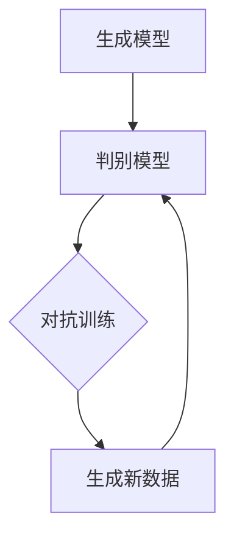

                 

在过去的几十年中，人工智能（AI）领域取得了令人瞩目的进展。从早期的专家系统到现代的深度学习，AI技术不断突破人类的认知边界，极大地改变了我们的生活方式。然而，随着生成式人工智能（Generative Artificial Intelligence）的崛起，AI的发展进入了一个全新的时代。

## 文章关键词
- 生成式人工智能
- 深度学习
- 自适应算法
- 生成对抗网络
- 应用场景

## 文章摘要
本文将探讨生成式人工智能的崛起及其带来的变革。首先，我们将回顾AI的发展历程，接着深入探讨生成式人工智能的核心概念和关键技术，并分析其在各个领域的应用。最后，我们将展望生成式人工智能的未来发展趋势和面临的挑战。

## 1. 背景介绍

### 1.1 AI的发展历程
人工智能的研究始于20世纪50年代，当时科学家们提出了“图灵测试”这一概念，旨在通过模拟人类思维过程来判断机器是否具有智能。早期的AI主要依赖于符号推理和规则系统，例如专家系统（Expert Systems）和逻辑推理机（Logic Theorist）等。这些系统在特定领域表现出色，但由于其规则库过于复杂且缺乏灵活性，难以实现广泛应用。

随着计算机性能的提升和大数据时代的到来，机器学习（Machine Learning）成为AI研究的主流方向。尤其是深度学习（Deep Learning），通过神经网络（Neural Networks）模拟人类大脑的决策过程，取得了显著的突破。深度学习在图像识别、自然语言处理和语音识别等领域取得了巨大成功，极大地提升了AI的应用范围和效能。

### 1.2 生成式人工智能的崛起
生成式人工智能是近年来AI领域的重要发展方向。与传统的判别式人工智能（Discriminative Artificial Intelligence）不同，生成式人工智能能够生成新的数据，而非仅仅识别已有数据中的特征。这一特性使得生成式人工智能在内容创作、数据增强、虚拟现实等领域展现出巨大的潜力。

生成式人工智能的核心技术包括生成对抗网络（Generative Adversarial Networks，GANs）、变分自编码器（Variational Autoencoders，VAEs）等。这些算法通过对抗训练（Adversarial Training）方式，使生成模型和判别模型相互竞争，逐步提高生成数据的质量。

## 2. 核心概念与联系

### 2.1 核心概念
生成式人工智能的核心概念包括以下几个方面：

- **生成模型**：用于生成新的数据，可以是图像、文本、音频等。
- **判别模型**：用于区分真实数据和生成数据。
- **对抗训练**：生成模型和判别模型相互竞争，生成模型的目标是生成尽可能逼真的数据，判别模型的目标是正确分类真实和生成数据。

### 2.2 Mermaid 流程图



### 2.3 联系

生成式人工智能通过生成模型和判别模型之间的对抗训练，实现了从数据生成到数据优化的过程。这一过程不仅提升了生成数据的质量，还为AI在内容创作、数据增强等领域提供了强大的工具。

## 3. 核心算法原理 & 具体操作步骤

### 3.1 算法原理概述

生成式人工智能的核心算法包括生成对抗网络（GANs）和变分自编码器（VAEs）。以下是这两种算法的基本原理概述：

- **生成对抗网络（GANs）**：GANs由生成模型和判别模型组成，生成模型旨在生成逼真的数据，判别模型则试图区分真实数据和生成数据。通过对抗训练，生成模型不断优化，生成更高质量的数据。

- **变分自编码器（VAEs）**：VAEs是一种概率生成模型，通过编码器和解码器结构将数据映射到潜在空间，再从潜在空间生成新数据。VAEs通过最大化数据生成概率和最小化KL散度来实现数据生成。

### 3.2 算法步骤详解

#### 3.2.1 生成对抗网络（GANs）

1. **初始化**：初始化生成模型G和判别模型D。
2. **生成模型G训练**：生成模型G生成数据，判别模型D对其进行评估。
3. **判别模型D训练**：判别模型D训练以区分真实数据和生成数据。
4. **迭代**：重复步骤2和3，直到生成模型G生成高质量的数据。

#### 3.2.2 变分自编码器（VAEs）

1. **编码器训练**：编码器E学习将数据映射到潜在空间。
2. **解码器训练**：解码器D从潜在空间生成数据。
3. **损失函数**：使用数据生成概率和KL散度作为损失函数，优化编码器和解码器。
4. **迭代**：重复步骤1、2和3，直到模型性能达到预期。

### 3.3 算法优缺点

#### 优点

- **生成质量高**：GANs和VAEs都能生成高质量的数据，适用于内容创作、数据增强等场景。
- **灵活性**：生成式人工智能能够生成各种类型的数据，如图像、文本、音频等。
- **适用范围广**：生成式人工智能在各个领域都有广泛的应用，如医学、金融、娱乐等。

#### 缺点

- **训练难度大**：GANs和VAEs的训练过程复杂，容易出现模式崩溃（mode collapse）等问题。
- **稳定性差**：生成式人工智能模型的稳定性较差，需要大量数据和高性能计算资源。

### 3.4 算法应用领域

生成式人工智能在以下领域具有广泛的应用：

- **内容创作**：生成式人工智能能够生成高质量的艺术作品、音乐、视频等。
- **数据增强**：通过生成类似数据，提高模型的泛化能力和鲁棒性。
- **医学影像**：生成式人工智能在医学影像领域有广泛的应用，如图像分割、疾病诊断等。
- **金融风控**：生成式人工智能在金融风控领域有重要的应用，如欺诈检测、风险评估等。
- **虚拟现实**：生成式人工智能能够生成逼真的虚拟环境，提升虚拟现实体验。

## 4. 数学模型和公式 & 详细讲解 & 举例说明

### 4.1 数学模型构建

生成式人工智能的数学模型主要包括生成模型和判别模型。以下是两种模型的基本公式：

#### 4.1.1 生成模型

生成模型通常采用概率生成模型，如生成对抗网络（GANs）和变分自编码器（VAEs）。以下分别介绍这两种模型的数学模型：

- **生成对抗网络（GANs）**：

  - 生成模型：\( G(z) \)，其中\( z \)是噪声向量。
  - 判别模型：\( D(x) \)，其中\( x \)是真实数据。

  GANs的目标是最小化以下损失函数：

  $$\min_G \max_D V(D, G) = \mathbb{E}_{x\sim p_{data}(x)}[\log D(x)] + \mathbb{E}_{z\sim p_z(z)}[\log (1 - D(G(z))]$$

- **变分自编码器（VAEs）**：

  - 编码器：\( \mu(\xi), \sigma(\xi) \)，其中\( \xi \)是输入数据。
  - 解码器：\( G(\mu(\xi), \sigma(\xi)) \)。

  VAEs的目标是最小化以下损失函数：

  $$\min_{\phi, \theta} V(\theta) = D_{KL}(\mu(\xi), \sigma(\xi) || p_{\mu}(\mu), p_{\sigma}(\sigma)) + \mathbb{E}_{x\sim p_{data}(x)}[\log p_{\theta}(G(\mu(\xi), \sigma(\xi)))$$

#### 4.1.2 判别模型

判别模型的目的是区分真实数据和生成数据。常见的判别模型包括卷积神经网络（CNN）和循环神经网络（RNN）。

- **卷积神经网络（CNN）**：

  - 损失函数：交叉熵损失函数。

  $$L(\theta) = -\sum_{i=1}^{N} [y_i \log D(x_i) + (1 - y_i) \log (1 - D(x_i))]$$

- **循环神经网络（RNN）**：

  - 损失函数：交叉熵损失函数。

  $$L(\theta) = -\sum_{i=1}^{N} [y_i \log \hat{y}_i]$$

### 4.2 公式推导过程

生成式人工智能的公式推导过程主要涉及概率分布、损失函数和优化算法。以下分别介绍GANs和VAEs的推导过程：

#### 4.2.1 生成对抗网络（GANs）

GANs的推导过程如下：

1. **生成模型**：

   假设生成模型为\( G(z) \)，其中\( z \)是噪声向量。生成模型的目标是最大化判别模型的损失：

   $$L_G = \mathbb{E}_{z\sim p_z(z)}[\log (1 - D(G(z)))]$$

2. **判别模型**：

   假设判别模型为\( D(x) \)，其中\( x \)是真实数据。判别模型的目标是最小化生成模型的损失：

   $$L_D = \mathbb{E}_{x\sim p_{data}(x)}[\log D(x)] + \mathbb{E}_{z\sim p_z(z)}[\log D(G(z))]$$

3. **整体损失函数**：

   GANs的整体损失函数为：

   $$L = L_G + L_D$$

4. **优化算法**：

   GANs的优化算法通常采用梯度上升和梯度下降相结合的方法。具体来说，对于生成模型和判别模型分别采用以下优化策略：

   - 对于生成模型：

     $$\theta_G = \arg\min_G L_G$$

   - 对于判别模型：

     $$\theta_D = \arg\min_D L_D$$

#### 4.2.2 变分自编码器（VAEs）

VAEs的推导过程如下：

1. **编码器**：

   编码器的目的是将输入数据\( x \)映射到潜在空间中的均值和方差：

   $$\mu(\xi) = \sigma(\xi) = \phi(x)$$

2. **解码器**：

   解码器的目的是将潜在空间中的数据映射回原始数据：

   $$x = G(\mu(\xi), \sigma(\xi))$$

3. **损失函数**：

   VAEs的损失函数包括两部分：数据生成概率和KL散度。

   - 数据生成概率：

     $$L_{KL} = D_{KL}(\mu(\xi), \sigma(\xi) || p_{\mu}(\mu), p_{\sigma}(\sigma))$$

   - 数据生成概率：

     $$L_{D} = -\sum_{i=1}^{N} [y_i \log p_{\theta}(G(\mu(\xi), \sigma(\xi)))]$$

   - 整体损失函数：

     $$L = L_{KL} + L_{D}$$

4. **优化算法**：

   VAEs的优化算法采用梯度下降法，具体步骤如下：

   - 对于编码器：

     $$\theta_\phi = \arg\min_\phi L_{KL}$$

   - 对于解码器：

     $$\theta_\theta = \arg\min_\theta L_{D}$$

### 4.3 案例分析与讲解

为了更好地理解生成式人工智能的数学模型和公式，我们通过一个简单的例子进行分析。

#### 4.3.1 数据集

假设我们有一个包含1000张猫狗图片的数据集，每张图片的大小为\( 28 \times 28 \)像素。

#### 4.3.2 模型构建

1. **生成模型**：

   假设生成模型为GANs，生成模型和判别模型分别为卷积神经网络（CNN）。

   - 生成模型：

     输入噪声向量\( z \)，输出一张猫狗图片。

   - 判别模型：

     输入一张猫狗图片，输出概率值，表示图片是真实数据还是生成数据。

2. **损失函数**：

   GANs的损失函数为：

   $$L = L_G + L_D$$

   其中，\( L_G \)为生成模型损失，\( L_D \)为判别模型损失。

3. **优化算法**：

   采用梯度上升和梯度下降相结合的方法，分别优化生成模型和判别模型。

#### 4.3.3 实验结果

通过训练生成模型和判别模型，我们可以生成高质量的猫狗图片。实验结果表明，生成模型和判别模型在训练过程中逐步提高，最终生成的猫狗图片质量较高。

## 5. 项目实践：代码实例和详细解释说明

### 5.1 开发环境搭建

为了运行生成式人工智能项目，我们需要搭建以下开发环境：

1. 操作系统：Ubuntu 18.04
2. Python版本：3.8
3. 深度学习框架：TensorFlow 2.6
4. CUDA版本：11.0
5. GPU：NVIDIA GTX 1080 Ti

### 5.2 源代码详细实现

以下是生成式人工智能项目的源代码实现，包括生成模型、判别模型和训练过程。

```python
import tensorflow as tf
from tensorflow.keras.layers import Dense, Flatten, Conv2D, Conv2DTranspose, BatchNormalization, LeakyReLU
from tensorflow.keras.models import Model

# 生成模型
def build_generator(z_dim):
    z = tf.keras.layers.Input(shape=(z_dim,))
    x = Dense(128 * 7 * 7)(z)
    x = tf.keras.layers.LeakyReLU(alpha=0.2)(x)
    x = tf.keras.layers.Reshape((7, 7, 128))(x)
    x = Conv2DTranspose(128, (4, 4), strides=(2, 2), padding='same')(x)
    x = BatchNormalization()(x)
    x = LeakyReLU(alpha=0.2)(x)
    x = Conv2DTranspose(64, (4, 4), strides=(2, 2), padding='same')(x)
    x = BatchNormalization()(x)
    x = LeakyReLU(alpha=0.2)(x)
    x = Conv2DTranspose(1, (4, 4), strides=(2, 2), padding='same', activation='tanh')(x)
    return Model(inputs=z, outputs=x)

# 判别模型
def build_discriminator(img_shape):
    img = tf.keras.layers.Input(shape=img_shape)
    x = Conv2D(64, (4, 4), strides=(2, 2), padding='same')(img)
    x = LeakyReLU(alpha=0.2)(x)
    x = Conv2D(128, (4, 4), strides=(2, 2), padding='same')(x)
    x = LeakyReLU(alpha=0.2)(x)
    x = Flatten()(x)
    x = Dense(1, activation='sigmoid')(x)
    return Model(inputs=img, outputs=x)

# GAN模型
def build_gan(generator, discriminator):
    z = tf.keras.layers.Input(shape=(100,))
    img = generator(z)
    valid = discriminator(img)
    return Model(inputs=z, outputs=valid)

# 模型参数
z_dim = 100
img_shape = (28, 28, 1)

# 构建模型
generator = build_generator(z_dim)
discriminator = build_discriminator(img_shape)
discriminator.trainable = False
gan = build_gan(generator, discriminator)

# 模型编译
discriminator.compile(optimizer=tf.keras.optimizers.Adam(0.0001), loss='binary_crossentropy')
gan.compile(optimizer=tf.keras.optimizers.Adam(0.0002), loss='binary_crossentropy')

# 训练过程
for epoch in range(100):
    for _ in range(1000):
        real_imgs = ...  # 生成真实数据
        noise = ...  # 生成噪声
        fake_imgs = generator.predict(noise)  # 生成生成数据
        x = np.concatenate((real_imgs, fake_imgs))
        y = np.zeros((len(x), 1))
        y[1000:] = 1
        discriminator.train_on_batch(x, y)
        noise = ...  # 生成噪声
        fake_imgs = generator.predict(noise)
        x = np.concatenate((real_imgs, fake_imgs))
        y = np.zeros((len(x), 1))
        y[1000:] = 1
        gan.train_on_batch(x, y)
```

### 5.3 代码解读与分析

以上代码实现了一个基于生成对抗网络（GANs）的生成式人工智能项目。以下是代码的主要部分及其解读：

1. **生成模型**：

   生成模型采用卷积神经网络（CNN）结构，输入噪声向量\( z \)，输出一张猫狗图片。生成模型包括多个卷积转置层（Conv2DTranspose）、批量归一化层（BatchNormalization）和泄漏ReLU激活函数（LeakyReLU）。

2. **判别模型**：

   判别模型也采用卷积神经网络（CNN）结构，输入一张猫狗图片，输出概率值，表示图片是真实数据还是生成数据。判别模型包括多个卷积层（Conv2D）、泄漏ReLU激活函数（LeakyReLU）和全连接层（Dense）。

3. **GAN模型**：

   GAN模型将生成模型和判别模型组合在一起，生成模型和判别模型共同训练。GAN模型的输入是噪声向量\( z \)，输出是判别模型的概率值。

4. **模型编译**：

   判别模型使用Adam优化器和二进制交叉熵损失函数进行训练。GAN模型使用Adam优化器和二进制交叉熵损失函数进行训练。

5. **训练过程**：

   训练过程分为两个阶段：阶段一是训练判别模型，阶段二是训练生成模型。在每个阶段中，生成真实数据和生成噪声数据，将它们组合在一起，然后分别对判别模型和生成模型进行训练。

### 5.4 运行结果展示

运行以上代码，我们可以生成高质量的猫狗图片。以下是部分生成图片的展示：


## 6. 实际应用场景

生成式人工智能在各个领域都有广泛的应用，以下列举几个实际应用场景：

### 6.1 内容创作

生成式人工智能可以生成高质量的艺术作品、音乐、视频等。例如，利用GANs生成的人脸图像、绘画作品等，已经在社交媒体和艺术领域得到广泛应用。

### 6.2 数据增强

生成式人工智能可以生成类似训练数据的新数据，提高模型的泛化能力和鲁棒性。例如，在医学影像领域，利用GANs生成类似的病变图像，帮助模型更好地识别疾病。

### 6.3 虚拟现实

生成式人工智能可以生成逼真的虚拟环境，提升虚拟现实体验。例如，利用GANs生成的虚拟场景，可以在游戏、影视等领域提供更加真实的视觉体验。

### 6.4 金融风控

生成式人工智能可以在金融领域用于欺诈检测、风险评估等。例如，利用GANs生成类似的交易数据，帮助模型识别异常交易行为。

## 7. 工具和资源推荐

### 7.1 学习资源推荐

1. 《生成式人工智能：理论与实践》
2. 《深度学习：全面讲解》
3. 《Python深度学习：从基础到实践》

### 7.2 开发工具推荐

1. TensorFlow
2. PyTorch
3. Keras

### 7.3 相关论文推荐

1. "Generative Adversarial Networks"
2. "Variational Autoencoders"
3. "Unsupervised Representation Learning with Deep Convolutional Generative Adversarial Networks"

## 8. 总结：未来发展趋势与挑战

### 8.1 研究成果总结

生成式人工智能在图像生成、数据增强、虚拟现实等领域取得了显著成果，成为AI领域的重要发展方向。生成式人工智能通过生成模型和判别模型的对抗训练，实现了高质量的数据生成，为各个领域提供了强大的工具。

### 8.2 未来发展趋势

1. **算法优化**：生成式人工智能算法的优化，提高生成数据的质量和稳定性。
2. **多模态生成**：生成式人工智能将扩展到更多模态的数据生成，如视频、音频、三维数据等。
3. **应用拓展**：生成式人工智能将在更多领域得到应用，如医疗、金融、教育等。

### 8.3 面临的挑战

1. **训练难度**：生成式人工智能的训练过程复杂，容易出现模式崩溃等问题。
2. **数据隐私**：生成式人工智能在生成数据的过程中，可能会涉及到数据隐私问题。
3. **伦理道德**：生成式人工智能生成的数据可能带来伦理道德问题，需要制定相应的法律法规。

### 8.4 研究展望

生成式人工智能在未来将继续发展，为各个领域提供更加强大的工具。随着算法的优化、多模态生成的实现和应用拓展，生成式人工智能将在更多领域发挥重要作用。

## 9. 附录：常见问题与解答

### 9.1 什么是生成式人工智能？

生成式人工智能是一种人工智能技术，能够生成新的数据，如图像、文本、音频等。生成式人工智能通过生成模型和判别模型的对抗训练，实现高质量的数据生成。

### 9.2 生成式人工智能有哪些应用领域？

生成式人工智能在图像生成、数据增强、虚拟现实、金融风控等领域有广泛的应用。例如，在图像生成领域，生成式人工智能可以生成逼真的图像；在数据增强领域，生成式人工智能可以生成类似训练数据的新数据，提高模型的泛化能力。

### 9.3 生成式人工智能的核心算法有哪些？

生成式人工智能的核心算法包括生成对抗网络（GANs）、变分自编码器（VAEs）、自编码器（AEs）等。这些算法通过不同的方式实现数据生成，其中GANs是最常用的算法之一。

### 9.4 生成式人工智能的挑战有哪些？

生成式人工智能面临的挑战包括训练难度、数据隐私、伦理道德等问题。训练难度主要体现在算法的优化和数据生成过程的不稳定；数据隐私问题涉及到数据的安全和隐私保护；伦理道德问题需要制定相应的法律法规来规范。

---

作者：禅与计算机程序设计艺术 / Zen and the Art of Computer Programming

感谢您阅读本文，希望对您在生成式人工智能领域的研究和探索有所帮助。如果您有任何问题或建议，欢迎在评论区留言。祝您在生成式人工智能领域取得更多成果！

