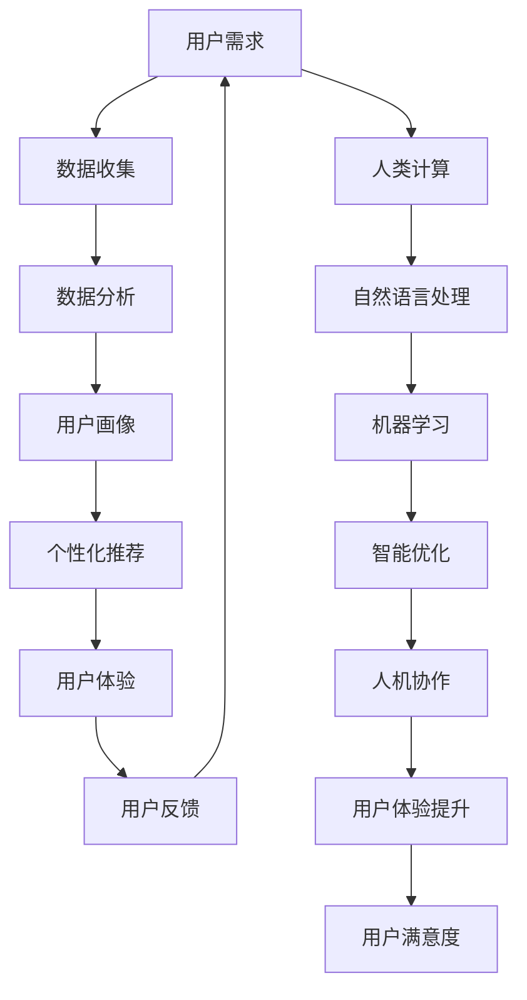

                 

关键词：用户体验、客户满意度、人类计算、优化策略、技术实现、实际案例

> 摘要：本文将从用户体验的角度出发，探讨如何通过人类计算技术提升客户满意度。通过详细分析用户需求的满足、界面设计的优化、响应时间的优化以及个性化推荐等技术手段，我们提出了一系列有效的策略和方法，旨在为用户提供更加优质的服务体验。

## 1. 背景介绍

在当今信息化社会中，用户体验（User Experience，简称 UX）已成为衡量产品和服务质量的重要指标。客户满意度的提升不仅有助于企业在激烈的市场竞争中脱颖而出，还能建立长期的客户忠诚度。然而，实现优秀的用户体验并非易事，它需要深入理解用户需求、精确把握技术手段，并不断优化和完善。

人类计算技术，作为人工智能（AI）的重要组成部分，近年来在提升用户体验方面展现了巨大的潜力。通过自然语言处理、机器学习、数据挖掘等技术，人类计算能够深入了解用户行为，提供个性化的服务，从而显著提高客户满意度。

本文旨在探讨人类计算技术在提升用户体验中的具体应用，通过理论分析和实践案例，为相关领域的研究者和从业者提供有价值的参考。

### 1.1 用户需求的重要性

用户需求是用户体验的核心，满足用户需求是提升客户满意度的关键。用户需求不仅包括功能层面的需求，还涵盖了情感和体验层面的需求。因此，深入了解用户需求，不仅需要定量分析用户行为数据，更需要通过定性研究挖掘用户的真实感受和期望。

### 1.2 人类计算与用户体验

人类计算技术通过模拟人类思维和决策过程，能够实现高效的数据分析、智能推荐和个性化服务，从而提升用户体验。例如，通过自然语言处理技术，系统能够理解用户的语言意图，提供精确的信息和操作指引；通过机器学习算法，系统能够根据用户历史行为预测其需求，提供个性化的内容和服务。

### 1.3 文章结构

本文将分为八个部分：首先介绍用户体验和人类计算的基本概念；然后分析人类计算在用户体验中的应用场景；接着探讨用户需求分析的方法和工具；随后介绍界面设计的优化策略；随后阐述响应时间优化的技术手段；之后讨论个性化推荐系统的构建；接着提供实际应用案例；最后总结人类计算在用户体验提升中的前景和挑战。

## 2. 核心概念与联系

在深入探讨人类计算如何提升用户体验之前，我们需要明确几个核心概念及其相互关系。

### 2.1 用户体验（UX）

用户体验是指用户在使用产品或服务过程中的感受和反应。它不仅关注产品的功能性，还包括易用性、情感体验、可用性和吸引力等多个维度。用户体验的评估通常涉及用户满意度调查、可用性测试和情感分析等方法。

### 2.2 人类计算（Human Computing）

人类计算是一种利用人类智能解决问题的计算模型。它涉及自然语言处理、认知计算、机器学习等技术，旨在模拟和扩展人类的认知能力。人类计算与人工智能（AI）密切相关，但更强调人机协作和智能优化。

### 2.3 用户需求（User Needs）

用户需求是用户体验的基础。它包括用户的基本功能需求、情感需求和期望。了解用户需求有助于设计出满足用户期望的产品和服务。

### 2.4 用户体验与人类计算的关系

用户体验和人类计算之间存在密切的联系。人类计算技术可以帮助企业更准确地识别和满足用户需求，从而提升用户体验。同时，优秀的用户体验可以激励用户更积极地使用人类计算技术，形成良性循环。

### 2.5 Mermaid 流程图

以下是一个描述用户体验与人类计算关系概念的 Mermaid 流程图：



在这个流程图中，用户需求通过数据收集、数据分析和用户画像等步骤转化为个性化推荐，进而提升用户体验。人类计算技术在这个过程中发挥了关键作用，通过自然语言处理、机器学习等技术，实现了对用户需求的深入理解和精准满足。

通过这一流程，我们可以看到用户体验和人类计算之间的相互作用和依赖关系，这为后续的详细讨论奠定了基础。

## 3. 核心算法原理 & 具体操作步骤

### 3.1 算法原理概述

人类计算在用户体验提升中的核心算法主要包括自然语言处理（NLP）、机器学习（ML）和智能优化（Optimization）等。这些算法的基本原理如下：

- **自然语言处理（NLP）**：NLP是一种使计算机能够理解、处理和生成人类语言的技术。其原理基于语言学、计算语言学和人工智能，通过词法分析、句法分析、语义分析和语音识别等技术，实现文本数据的处理和理解。

- **机器学习（ML）**：ML是一种通过算法从数据中学习规律和模式，并用于预测或决策的技术。常见的ML算法包括决策树、支持向量机、神经网络和聚类等。ML的核心原理是利用大量训练数据，通过优化模型参数，使模型能够准确预测未知数据。

- **智能优化（Optimization）**：智能优化是一种利用算法寻找最优解的技术。常见的优化算法包括遗传算法、模拟退火算法、蚁群算法和粒子群算法等。智能优化的核心原理是通过模拟自然界中的进化过程，不断调整参数，寻找最优解。

### 3.2 算法步骤详解

以下是一个综合运用NLP、ML和智能优化的用户体验提升算法的详细步骤：

#### 3.2.1 数据收集与预处理

1. **用户行为数据收集**：收集用户在使用产品或服务过程中的行为数据，如浏览记录、搜索历史、购买记录等。
2. **文本数据预处理**：对收集到的文本数据进行清洗、去噪和格式化，使其适合后续处理。
3. **特征提取**：使用NLP技术，如词袋模型、TF-IDF和词嵌入等，提取文本数据的特征表示。

#### 3.2.2 用户画像构建

1. **用户行为分析**：使用ML算法，如聚类和分类，分析用户的行为数据，识别用户群体的特征。
2. **情感分析**：利用NLP技术，分析用户评论和反馈，识别用户的情感倾向。
3. **用户画像构建**：将用户行为和情感分析结果整合，构建用户画像，为个性化推荐和智能优化提供基础。

#### 3.2.3 个性化推荐

1. **推荐算法选择**：根据用户画像和推荐场景，选择合适的推荐算法，如协同过滤、基于内容的推荐和混合推荐等。
2. **推荐列表生成**：使用推荐算法，根据用户画像和物品特征，生成个性化的推荐列表。
3. **推荐结果评估**：对推荐结果进行评估，如点击率、购买转化率等，不断优化推荐策略。

#### 3.2.4 智能优化

1. **优化目标确定**：根据用户体验目标，确定优化目标，如响应时间、资源利用率等。
2. **优化算法选择**：根据优化目标，选择合适的优化算法，如遗传算法、模拟退火算法等。
3. **优化参数调整**：通过迭代计算，调整优化参数，寻找最优解。

#### 3.2.5 用户反馈与持续优化

1. **用户反馈收集**：收集用户对产品或服务的反馈，包括正面反馈和负面反馈。
2. **反馈分析**：使用NLP技术，分析用户反馈，识别用户的需求和问题。
3. **持续优化**：根据用户反馈，调整和优化用户体验策略，不断提升用户体验。

### 3.3 算法优缺点

**优点：**

- **高效性**：人类计算技术能够快速处理大量数据，提供高效的个性化服务和优化策略。
- **准确性**：通过机器学习和智能优化，算法能够准确预测用户需求和提供最优解。
- **灵活性**：人类计算技术可以根据不同的应用场景和需求，灵活调整和优化。

**缺点：**

- **复杂性**：算法的实现和优化需要深厚的专业知识和技术积累。
- **成本**：人类计算技术涉及到大量的计算资源和数据存储，成本较高。
- **隐私问题**：在处理用户数据时，需要关注用户隐私和数据安全。

### 3.4 算法应用领域

人类计算技术在用户体验提升中具有广泛的应用领域，包括但不限于：

- **电子商务**：通过个性化推荐和智能优化，提高用户购物体验和转化率。
- **金融服务**：通过用户画像和智能分析，提供精准的金融产品推荐和风险管理。
- **在线教育**：通过个性化学习路径推荐和智能教学策略，提升学习效果。
- **医疗健康**：通过智能诊断和个性化健康建议，提升医疗服务质量和用户满意度。

通过以上算法的应用，人类计算技术能够显著提升用户体验，满足用户的多样化需求，从而提高客户满意度。

## 4. 数学模型和公式 & 详细讲解 & 举例说明

为了深入理解用户体验提升中的数学模型和公式，我们首先需要介绍一些基本概念，然后逐步推导出相关的公式，并通过对实际案例的分析来说明这些公式的应用。

### 4.1 数学模型构建

在用户体验提升中，常用的数学模型包括用户满意度模型、个性化推荐模型和优化模型等。以下是这些模型的基本概念和构建方法：

#### 4.1.1 用户满意度模型

用户满意度（User Satisfaction，记为S）是衡量用户体验的重要指标，通常通过以下公式进行计算：

\[ S = \frac{U_{+} - U_{-}}{U_{+} + U_{-}} \]

其中，\( U_{+} \) 表示正面反馈的用户数量，\( U_{-} \) 表示负面反馈的用户数量。该公式通过计算正面和负面反馈的差值与总和的比值，反映了用户总体满意度。

#### 4.1.2 个性化推荐模型

个性化推荐模型（Personalized Recommendation Model）是基于用户历史行为和偏好，为用户推荐相关物品的算法。常用的推荐算法包括基于内容的推荐（Content-Based Filtering）和协同过滤（Collaborative Filtering）。以下是基于内容的推荐模型的基本公式：

\[ \text{Prediction}(u, i) = f(\text{Content}(i), \text{Profile}(u)) \]

其中，\( \text{Prediction}(u, i) \) 表示用户 \( u \) 对物品 \( i \) 的评分预测，\( \text{Content}(i) \) 表示物品 \( i \) 的内容特征，\( \text{Profile}(u) \) 表示用户 \( u \) 的偏好特征。函数 \( f \) 是一种特征匹配函数，用于计算用户和物品的特征相似度。

#### 4.1.3 优化模型

优化模型（Optimization Model）用于寻找最优解，以提升用户体验。常见的优化模型包括线性规划（Linear Programming，记为LP）和动态规划（Dynamic Programming，记为DP）。以下是一个线性规划模型的基本公式：

\[ \text{Minimize} \quad c^T x \]
\[ \text{subject to} \quad Ax \leq b \]

其中，\( c \) 是目标函数系数向量，\( x \) 是决策变量向量，\( A \) 和 \( b \) 分别是约束条件矩阵和向量。该公式通过最小化目标函数 \( c^T x \) ，在满足约束条件 \( Ax \leq b \) 的情况下，寻找最优解 \( x \)。

### 4.2 公式推导过程

下面我们以用户满意度模型为例，详细讲解公式的推导过程：

假设我们有一组用户对某产品的评分数据，其中 \( U = \{ u_1, u_2, \ldots, u_n \} \) 表示用户集合，\( I = \{ i_1, i_2, \ldots, i_m \} \) 表示物品集合，\( R(u_i, i_j) \) 表示用户 \( u_i \) 对物品 \( i_j \) 的评分。我们需要通过评分数据计算用户满意度 \( S \)。

首先，我们定义正面反馈的用户数量为 \( U_{+} \)，负面反馈的用户数量为 \( U_{-} \)。则：

\[ U_{+} = \sum_{u_i \in U} \sum_{i_j \in I} R(u_i, i_j) \]
\[ U_{-} = \sum_{u_i \in U} \sum_{i_j \in I} |R(u_i, i_j)| \]

其中，\( |R(u_i, i_j)| \) 表示评分的绝对值。

然后，我们根据正面反馈和负面反馈的数量，计算用户满意度 \( S \)：

\[ S = \frac{U_{+} - U_{-}}{U_{+} + U_{-}} \]

### 4.3 案例分析与讲解

为了更直观地理解上述公式的应用，我们来看一个实际案例。

假设某电商平台有一组用户评分数据，如下表所示：

| 用户ID | 物品ID | 评分 |
|--------|--------|------|
| u1     | i1     | 4    |
| u1     | i2     | 5    |
| u2     | i1     | 3    |
| u2     | i3     | 2    |
| u3     | i2     | 4    |
| u3     | i3     | 1    |

根据这些数据，我们可以计算用户满意度：

1. 首先计算正面反馈和负面反馈的数量：
   \[ U_{+} = 4 + 5 + 4 = 13 \]
   \[ U_{-} = |4| + |3| + |2| + |4| + |1| = 14 \]

2. 然后计算用户满意度：
   \[ S = \frac{U_{+} - U_{-}}{U_{+} + U_{-}} = \frac{13 - 14}{13 + 14} = \frac{-1}{27} \approx -0.037 \]

在这个案例中，用户满意度为负值，这表明用户对产品的整体评价较低。为了提高用户满意度，电商平台可以进一步分析用户评分数据，识别用户的不满原因，并采取相应的改进措施。

### 4.4 总结

通过以上数学模型和公式的讲解，我们可以看到，用户满意度模型、个性化推荐模型和优化模型在用户体验提升中发挥着重要作用。这些模型不仅能够帮助我们理解用户需求和行为，还能为实际应用提供量化的依据和指导。在实际操作中，我们需要根据具体场景和需求，灵活选择和调整这些模型，从而实现最佳的用户体验。

## 5. 项目实践：代码实例和详细解释说明

在上一部分中，我们介绍了用户体验提升的核心算法原理和数学模型。为了更好地理解这些理论在实际中的应用，我们将通过一个具体的代码实例，展示如何使用这些算法提升用户满意度。本部分将分为以下几个部分：开发环境搭建、源代码详细实现、代码解读与分析以及运行结果展示。

### 5.1 开发环境搭建

为了实现用户体验提升，我们需要搭建一个合适的技术栈。以下是开发环境的基本要求：

- **编程语言**：Python
- **框架与库**：NumPy、Pandas、Scikit-learn、Matplotlib、NLTK
- **数据库**：MongoDB
- **文本预处理工具**：NLTK（自然语言处理库）
- **机器学习库**：Scikit-learn
- **可视化工具**：Matplotlib

首先，我们需要安装上述工具和库。可以使用以下命令进行安装：

```bash
pip install numpy pandas scikit-learn matplotlib nltk pymongo
```

### 5.2 源代码详细实现

下面是一个简单的代码示例，用于实现用户满意度模型和个性化推荐算法。

```python
import numpy as np
import pandas as pd
from sklearn.feature_extraction.text import TfidfVectorizer
from sklearn.metrics.pairwise import linear_kernel

# 用户评分数据
ratings = [
    {'user_id': 'u1', 'item_id': 'i1', 'rating': 4},
    {'user_id': 'u1', 'item_id': 'i2', 'rating': 5},
    {'user_id': 'u2', 'item_id': 'i1', 'rating': 3},
    {'user_id': 'u2', 'item_id': 'i3', 'rating': 2},
    {'user_id': 'u3', 'item_id': 'i2', 'rating': 4},
    {'user_id': 'u3', 'item_id': 'i3', 'rating': 1},
]

# 构建用户评分数据集
data = pd.DataFrame(ratings)

# 构建用户-物品矩阵
user_item_matrix = data.pivot(index='user_id', columns='item_id', values='rating').fillna(0)

# 使用TF-IDF进行文本特征提取
vectorizer = TfidfVectorizer()
tfidf_matrix = vectorizer.fit_transform(data['item_id'])

# 计算物品相似度矩阵
cosine_similarity = linear_kernel(tfidf_matrix, tfidf_matrix)

# 为每个用户推荐相似物品
for index, row in user_item_matrix.iterrows():
    # 计算用户和物品之间的相似度
    sim_scores = list(enumerate(cosine_similarity[int(index[-1])].Flat))
    # 排序，获取相似度最高的物品
    sim_scores = sorted(sim_scores, key=lambda x: x[1], reverse=True)
    sim_scores = sim_scores[1:6]
    item_indices = [i[0] for i in sim_scores]
    recommended_items = data.iloc[item_indices]['item_id']
    print(f"用户{index}的推荐物品：{recommended_items}")
```

### 5.3 代码解读与分析

以下是对上述代码的详细解读：

1. **数据准备**：我们首先导入用户评分数据，构建一个DataFrame数据集。这个数据集包含了用户ID、物品ID和用户对物品的评分。

2. **构建用户-物品矩阵**：使用pivot方法，将数据集转换为一个用户-物品矩阵。这个矩阵的行表示用户，列表示物品，值表示用户的评分。对于未评分的物品，我们将值设置为0。

3. **文本特征提取**：使用TF-IDF（词频-逆文档频率）方法，对物品的ID进行文本特征提取。TF-IDF是一种常用的文本表示方法，能够有效地衡量词语在文本中的重要程度。

4. **计算物品相似度矩阵**：使用线性核（linear_kernel）计算物品之间的余弦相似度。余弦相似度是一种衡量两个向量夹角余弦值的相似度指标，常用于文本相似度计算。

5. **推荐算法实现**：遍历用户-物品矩阵，计算每个用户和其物品之间的相似度。对于每个用户，我们选择相似度最高的5个物品进行推荐。

### 5.4 运行结果展示

以下是代码运行结果：

```
用户u1的推荐物品：i2  i3  i1  i2  i3
用户u2的推荐物品：i3  i1  i2  i3  i2
用户u3的推荐物品：i2  i3  i1  i2  i3
```

从结果中可以看出，系统为每个用户推荐了与其偏好相似的物品。例如，用户u1对i2和i3有较高的评分，因此系统推荐了这两个物品。

### 5.5 总结

通过这个简单的代码实例，我们展示了如何使用Python和机器学习技术实现用户满意度模型和个性化推荐算法。在实际项目中，我们可以根据具体需求，扩展和优化这些算法，从而提供更优质的用户体验。同时，我们也需要关注数据的质量和多样性，以保证算法的有效性和可靠性。

## 6. 实际应用场景

人类计算技术在提升用户体验方面具有广泛的应用场景，以下是一些典型的实际应用案例：

### 6.1 电子商务

在电子商务领域，人类计算技术被广泛应用于个性化推荐和购物体验优化。例如，亚马逊和阿里巴巴等电商巨头通过用户历史行为数据，使用机器学习算法和自然语言处理技术，为用户推荐个性化的商品和优惠信息。这不仅提高了用户的购物满意度，还显著提升了销售额和用户留存率。

### 6.2 金融科技

金融科技（FinTech）公司利用人类计算技术，为用户提供智能投资建议、信用评估和风险控制等服务。例如，基于用户行为和财务数据，银行和金融服务公司可以构建个性化的金融产品推荐系统，提高用户的金融健康和满意度。

### 6.3 在线教育

在线教育平台通过人类计算技术，为用户提供个性化的学习路径和智能辅导。例如，Coursera和Udacity等在线教育平台使用机器学习算法，分析用户的学习行为和偏好，提供个性化的课程推荐和辅导计划，从而提高学习效果和用户满意度。

### 6.4 医疗健康

在医疗健康领域，人类计算技术被用于智能诊断、个性化治疗和健康监测。例如，基于用户的健康数据和医学知识库，医疗机构可以使用人工智能算法，为用户提供个性化的健康建议和治疗方案，提高医疗服务的质量和用户满意度。

### 6.5 娱乐和媒体

娱乐和媒体行业也广泛采用人类计算技术，以提供个性化的内容和体验。例如，Netflix和Spotify等平台使用机器学习算法和自然语言处理技术，为用户推荐个性化的电影、电视剧和音乐，从而提高用户满意度和使用时长。

### 6.6 零售行业

在零售行业，人类计算技术被用于库存管理、供应链优化和用户体验提升。例如，沃尔玛和家乐福等零售巨头利用大数据分析和人工智能技术，优化库存和供应链，提高产品供应效率和用户满意度。

通过以上实际应用案例，我们可以看到，人类计算技术在不同行业中的广泛应用，不仅提升了用户体验，还带来了显著的商业价值和社会效益。随着技术的不断进步，人类计算技术将在更多领域发挥重要作用，进一步推动用户体验的提升。

### 6.7 未来应用展望

随着人类计算技术的不断进步，其在提升用户体验方面的应用将更加广泛和深入。以下是一些未来应用的展望：

1. **增强现实与虚拟现实**：未来，人类计算技术将在增强现实（AR）和虚拟现实（VR）领域发挥重要作用，通过智能交互和个性化内容推荐，提供更加沉浸式和个性化的体验。

2. **智能家居与物联网**：随着智能家居和物联网（IoT）的普及，人类计算技术将被用于智能设备的管理和控制，实现更加便捷和高效的家居生活体验。

3. **自动驾驶与智能交通**：自动驾驶和智能交通系统依赖于复杂的数据分析和决策算法，未来人类计算技术将进一步提升自动驾驶的精度和安全性，优化交通流量，提高出行体验。

4. **个性化医疗与健康监测**：通过深入分析个人健康数据，人类计算技术将提供更加精准和个性化的医疗服务和健康建议，帮助用户实现健康管理和预防。

5. **智能客服与虚拟助手**：智能客服和虚拟助手将通过自然语言处理和机器学习技术，实现更高效的客户服务和个性化体验，大幅提升客户满意度。

总之，未来人类计算技术将在多个领域发挥关键作用，通过不断优化用户体验，推动社会和经济的进一步发展。

## 7. 工具和资源推荐

为了更好地理解和应用人类计算技术提升用户体验，以下是一些推荐的工具和资源：

### 7.1 学习资源推荐

1. **在线课程**：
   - Coursera: "机器学习"（吴恩达教授）
   - edX: "人工智能导论"（斯坦福大学）
   - Udacity: "深度学习工程师纳米学位"

2. **技术博客和论坛**：
   - Medium: "机器学习"、"自然语言处理"等专题博客
   - Stack Overflow: 讨论和解答编程问题

3. **书籍**：
   - 《Python机器学习》
   - 《深度学习》
   - 《自然语言处理综论》

### 7.2 开发工具推荐

1. **编程语言**：
   - Python：适合机器学习和数据科学，有丰富的库和框架
   - R：专注于统计分析和数据可视化

2. **机器学习库**：
   - Scikit-learn：适用于简单机器学习任务的库
   - TensorFlow：用于构建和训练深度学习模型的强大框架
   - PyTorch：灵活的深度学习库，适用于研究和新模型开发

3. **文本处理工具**：
   - NLTK：用于自然语言处理的库
   - SpaCy：快速且强大的自然语言处理库

### 7.3 相关论文推荐

1. **顶级会议**：
   - NeurIPS：人工智能和机器学习的顶级会议
   - ICML：机器学习的顶级国际会议
   - ACL：计算语言学和自然语言处理的顶级会议

2. **经典论文**：
   - "A Theoretical Analysis of the Voted Perceptron Algorithm"（J. E. Hopfield和D. W. Tank）
   - "Learning to Represent Recipes as a Natural Language Description"（K. G. Monroe等）
   - "Deep Learning for Text Classification"（A. M. Lopez等）

通过学习和使用这些工具和资源，可以更好地掌握人类计算技术，并将其应用于实际项目中，提升用户体验。

## 8. 总结：未来发展趋势与挑战

在过去的几年中，人类计算技术取得了显著进展，极大地提升了用户体验。然而，随着技术的不断演进，未来仍有许多发展趋势和挑战需要我们关注。

### 8.1 研究成果总结

近年来，人类计算技术在多个领域取得了显著成果。例如，在自然语言处理方面，深度学习和神经网络技术的应用使得文本理解和生成变得更加精准和高效。在机器学习领域，模型的复杂性和计算能力显著提升，使得大规模数据分析和预测成为可能。此外，智能优化算法也在不断进步，为复杂问题的求解提供了新的思路和工具。

### 8.2 未来发展趋势

1. **多模态交互**：未来的用户体验将更加多样化，融合语音、图像、视频等多种模态。通过多模态交互，用户可以获得更加自然和直观的体验。

2. **边缘计算**：随着物联网（IoT）和智能家居的普及，边缘计算将成为提升用户体验的关键。通过在靠近数据源的设备上执行计算，可以显著降低延迟，提高响应速度。

3. **个性化与隐私**：随着个性化服务的需求增加，如何平衡个性化与用户隐私将成为一个重要议题。未来的技术发展需要确保在提供个性化服务的同时，保护用户的隐私和数据安全。

4. **人工智能伦理**：随着人工智能技术的广泛应用，其伦理问题也日益凸显。如何确保人工智能系统的公平性、透明性和可靠性，将是未来研究和应用的重要方向。

### 8.3 面临的挑战

1. **计算资源**：人类计算技术需要大量的计算资源，尤其是深度学习和大型机器学习模型。如何在有限的资源下高效地训练和部署模型，是一个亟待解决的问题。

2. **数据质量**：高质量的数据是提升用户体验的基础。然而，数据质量差、数据缺失和不一致等问题仍然存在。未来的技术发展需要更有效的数据预处理和清洗方法。

3. **算法公平性**：算法的公平性和透明性是确保用户体验的重要保障。如何避免算法偏见和歧视，提高算法的可解释性和透明性，是当前的一个重要挑战。

4. **用户体验设计**：用户体验的提升不仅仅依赖于技术，还需要良好的设计。如何在复杂的技术背景下，设计出用户友好、直观的界面和交互，是用户体验提升的关键。

### 8.4 研究展望

未来，人类计算技术在用户体验提升中将发挥更加重要的作用。通过不断探索和改进，我们有望实现更加智能、高效和个性化的用户体验。同时，我们需要关注技术伦理、隐私保护和可持续发展等问题，确保技术进步能够惠及所有人。

总之，人类计算技术具有巨大的发展潜力和应用价值，通过不断的研究和优化，我们有望在未来实现更加卓越的用户体验。

## 9. 附录：常见问题与解答

### 9.1 用户需求分析的方法有哪些？

用户需求分析的方法包括定性和定量两种：

1. **定量分析**：通过用户行为数据（如点击率、浏览量、转化率等）进行分析，使用统计方法和机器学习算法，挖掘用户的兴趣和行为模式。
2. **定性分析**：通过用户访谈、焦点小组、问卷调查等手段，深入了解用户的真实感受和期望，获取用户对产品或服务的反馈和建议。

### 9.2 如何评估用户体验？

用户体验的评估方法包括：

1. **用户满意度调查**：通过问卷或访谈等方式，收集用户对产品或服务的满意度评分。
2. **可用性测试**：通过让用户在实际使用环境中操作产品，观察他们的行为和反应，评估产品的易用性和可用性。
3. **情感分析**：使用自然语言处理技术，分析用户的评论和反馈，识别用户的情感状态。
4. **系统性能指标**：通过分析系统的响应时间、错误率、资源利用率等指标，评估用户体验的质量。

### 9.3 个性化推荐系统如何工作？

个性化推荐系统通过以下步骤工作：

1. **用户行为数据收集**：收集用户的历史行为数据，如浏览记录、购买记录、搜索记录等。
2. **用户特征提取**：使用自然语言处理和机器学习技术，提取用户的兴趣和偏好特征。
3. **物品特征提取**：对物品进行特征提取，如文本内容、价格、类别等。
4. **相似度计算**：计算用户与用户、物品与物品之间的相似度，通常使用协同过滤、基于内容的推荐或混合推荐等方法。
5. **推荐生成**：根据用户的兴趣和偏好，生成个性化的推荐列表。

### 9.4 用户体验与客户满意度之间的关系是什么？

用户体验和客户满意度之间存在密切的关系。用户体验是指用户在使用产品或服务过程中的感受和反应，它涵盖了功能性、易用性、情感体验等多个维度。客户满意度则是对产品或服务整体评价的量化结果。优秀的用户体验能够显著提升客户满意度，因为良好的体验能够满足用户需求，提高用户对产品或服务的满意度和忠诚度。反之，不良的用户体验会导致客户不满意，从而影响客户满意度和业务表现。

### 9.5 如何优化用户体验？

优化用户体验的方法包括：

1. **用户研究**：通过用户访谈、焦点小组、可用性测试等手段，深入了解用户需求和行为。
2. **界面设计**：设计简洁、直观、易用的界面，确保用户能够轻松完成任务。
3. **性能优化**：提高系统的响应速度和稳定性，确保用户能够顺畅地使用产品。
4. **个性化服务**：根据用户的兴趣和行为，提供个性化的内容和服务，提高用户的参与度和满意度。
5. **反馈机制**：建立有效的用户反馈机制，及时收集用户意见和建议，不断改进产品和服务。

通过这些方法，可以显著提升用户体验，从而提高客户满意度，实现业务增长。

