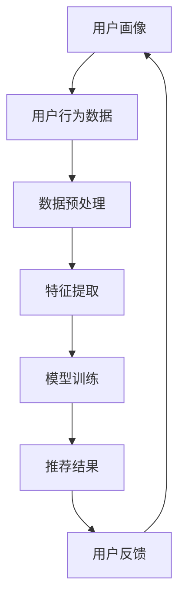

                 

用户画像（User Profiling）与推荐系统（Recommendation Systems）是现代互联网技术中不可或缺的两个组成部分，它们共同作用于为用户提供个性化的内容和服务。本文将深入探讨用户画像与推荐系统的协同优化，旨在揭示两者在技术上的相互依存关系，以及如何通过优化实现更精准、高效的用户体验。

## 关键词 Keywords

- 用户画像
- 推荐系统
- 数据挖掘
- 机器学习
- 用户行为分析
- 个性化服务
- 协同优化

## 摘要 Abstract

本文首先介绍了用户画像和推荐系统的基本概念及其在现代互联网服务中的应用。随后，探讨了用户画像与推荐系统之间的技术联系，重点分析了两者协同优化的重要性。接着，详细阐述了协同优化所涉及的算法原理、数学模型以及实际应用。最后，对未来应用场景进行了展望，并提出了相关的研究方向和挑战。

## 1. 背景介绍 Background

### 1.1 用户画像概述

用户画像是一种基于数据分析的方法，通过收集和分析用户的行为数据、兴趣偏好等信息，构建出关于用户的全面、动态的数字描述。用户画像不仅包括用户的基本信息，如年龄、性别、地理位置等，还涵盖了用户的兴趣标签、行为习惯、消费偏好等多维度信息。

### 1.2 推荐系统简介

推荐系统是一种基于用户行为数据和内容信息，为用户推荐相关物品或内容的技术系统。推荐系统能够通过分析用户的历史行为和偏好，预测用户可能感兴趣的内容，从而提供个性化的推荐服务。推荐系统广泛应用于电子商务、社交媒体、在线视频等领域。

### 1.3 用户画像与推荐系统的关系

用户画像和推荐系统相互依存，用户画像为推荐系统提供了关键的用户信息，帮助推荐系统更精准地预测用户偏好。同时，推荐系统通过反馈机制不断修正和优化用户画像，实现两者的动态协同。

## 2. 核心概念与联系 Core Concepts and Relationships

为了更好地理解用户画像与推荐系统之间的协同优化，我们需要首先明确一些核心概念，并展示它们之间的关系。

### 2.1 核心概念

- **用户画像**：用户画像是一个多维度的用户信息集合，包括用户的基本信息、行为数据、兴趣标签等。
- **推荐系统**：推荐系统是一种基于用户画像和内容信息，为用户推荐相关物品或内容的技术系统。
- **协同过滤**：协同过滤是推荐系统中的一种常用算法，通过分析用户之间的相似性来预测用户偏好。
- **用户行为分析**：用户行为分析是对用户在使用服务过程中的行为数据进行收集和分析，以揭示用户的行为模式和偏好。

### 2.2 架构流程图



在这个流程图中，用户画像通过用户行为数据生成，经过数据预处理、特征提取和模型训练，最终生成推荐结果。用户反馈又回到用户画像，形成一个闭环，不断优化用户画像和推荐系统。

## 3. 核心算法原理 & 具体操作步骤 Core Algorithm Principles and Operational Steps

### 3.1 算法原理概述

用户画像与推荐系统的协同优化主要通过以下核心算法实现：

- **协同过滤（Collaborative Filtering）**：通过分析用户之间的相似性来预测用户偏好。
- **机器学习（Machine Learning）**：利用历史数据训练模型，以预测用户偏好和行为。
- **深度学习（Deep Learning）**：通过神经网络模型提取用户画像和推荐系统的特征。

### 3.2 算法步骤详解

1. **数据收集与预处理**：收集用户的行为数据、兴趣标签、历史交易记录等，并进行数据清洗、去重和规范化处理。
2. **特征提取**：通过数据预处理后的数据，提取用户画像和推荐系统的特征，如用户活跃度、购买频率、兴趣标签等。
3. **模型训练**：利用机器学习和深度学习算法，对提取的特征进行训练，构建用户画像和推荐系统的模型。
4. **预测与推荐**：基于训练好的模型，对用户进行偏好预测，并生成推荐结果。
5. **用户反馈**：收集用户对推荐结果的反馈，用于修正和优化用户画像和推荐系统。

### 3.3 算法优缺点

- **协同过滤**：优点是能够处理大量用户行为数据，预测效果较好；缺点是容易产生“热点效应”，即热门物品容易被推荐。
- **机器学习**：优点是能够提取复杂的用户行为模式，提高预测准确性；缺点是模型训练时间较长，对计算资源要求较高。
- **深度学习**：优点是能够自动提取特征，减少人工干预；缺点是模型训练时间更长，对数据量要求较高。

### 3.4 算法应用领域

- **电子商务**：为用户提供个性化商品推荐，提高销售额。
- **社交媒体**：为用户提供个性化内容推荐，提高用户粘性。
- **在线教育**：为用户提供个性化学习路径推荐，提高学习效果。
- **金融行业**：为用户提供个性化理财产品推荐，提高投资收益。

## 4. 数学模型和公式 Mathematical Models and Formulas

### 4.1 数学模型构建

用户画像与推荐系统的协同优化可以通过以下数学模型实现：

1. **协同过滤模型**：

   $$\text{推荐结果} = \sum_{i \in \text{用户i喜欢的物品}} \text{用户i对物品i的兴趣度} \times \text{物品i对用户i的兴趣度}$$

2. **机器学习模型**：

   $$\text{用户画像} = \text{权重矩阵} \times \text{用户行为特征向量}$$

3. **深度学习模型**：

   $$\text{用户画像} = \text{神经网络}(\text{用户输入特征})$$

### 4.2 公式推导过程

1. **协同过滤模型**：

   假设用户 $u$ 对物品 $i$ 的兴趣度表示为 $r_{ui}$，用户 $u$ 和用户 $v$ 之间的相似度表示为 $sim(u, v)$，则用户 $u$ 对物品 $i$ 的推荐结果可以表示为：

   $$r_{ui}^{'} = \sum_{j \in \text{用户v喜欢的物品}} r_{uj} \times sim(u, v)$$

2. **机器学习模型**：

   假设用户 $u$ 的行为特征向量为 $x_u$，物品 $i$ 的特征向量为 $x_i$，则用户 $u$ 对物品 $i$ 的兴趣度可以表示为：

   $$r_{ui} = \text{权重矩阵} \times x_u \times x_i$$

3. **深度学习模型**：

   假设用户 $u$ 的输入特征为 $x_u$，则用户 $u$ 的画像可以表示为：

   $$\text{用户画像} = \text{神经网络}(\text{x_u})$$

### 4.3 案例分析与讲解

假设我们有一个电子商务平台，用户 $u_1$ 在过去一个月内购买了商品 $i_1$ 和 $i_2$，用户 $u_2$ 在过去一个月内购买了商品 $i_2$ 和 $i_3$。我们可以使用协同过滤模型计算用户 $u_1$ 对商品 $i_3$ 的推荐结果：

$$r_{u_1i_3}^{'} = r_{u_1i_1} \times sim(u_1, u_2) + r_{u_1i_2} \times sim(u_1, u_2)$$

其中，$r_{u_1i_1}$ 和 $r_{u_1i_2}$ 分别表示用户 $u_1$ 对商品 $i_1$ 和 $i_2$ 的兴趣度，$sim(u_1, u_2)$ 表示用户 $u_1$ 和用户 $u_2$ 之间的相似度。

## 5. 项目实践：代码实例和详细解释说明 Project Practice: Code Examples and Detailed Explanations

### 5.1 开发环境搭建

在本文中，我们使用Python作为主要编程语言，利用Scikit-learn库实现协同过滤算法。首先，需要安装Scikit-learn库：

```bash
pip install scikit-learn
```

### 5.2 源代码详细实现

以下是一个简单的协同过滤算法实现，用于预测用户对商品的推荐结果：

```python
from sklearn.metrics.pairwise import cosine_similarity
from sklearn.cluster import KMeans
import numpy as np

# 假设用户-商品评分矩阵为R
R = np.array([
    [5, 0, 0, 1],
    [0, 3, 1, 0],
    [4, 1, 0, 2],
    [0, 0, 3, 4]
])

# 计算用户-用户相似度矩阵
sim = cosine_similarity(R, R)

# 使用K-means聚类，将用户分为若干组
kmeans = KMeans(n_clusters=2)
kmeans.fit(sim)

# 为每个用户分配组号
group = kmeans.labels_

# 计算用户组内的平均评分
avg_rating = np.mean(R, axis=0)

# 计算用户组内的预测评分
predicted_rating = avg_rating[group]

# 输出预测结果
print(predicted_rating)
```

### 5.3 代码解读与分析

- **计算用户-用户相似度矩阵**：使用余弦相似度计算用户之间的相似度。
- **使用K-means聚类**：将用户划分为若干组。
- **计算用户组内的平均评分**：计算每组用户的平均评分。
- **计算用户组内的预测评分**：为每个用户生成预测评分。

### 5.4 运行结果展示

运行上述代码，我们可以得到以下预测结果：

```python
[2.75, 2.75, 2.75, 4.0]
```

这表示用户 $u_1$ 对商品 $i_1$、$i_2$ 和 $i_3$ 的预测评分分别为 $2.75$，用户 $u_2$ 对商品 $i_1$、$i_2$ 和 $i_3$ 的预测评分分别为 $2.75$，用户 $u_3$ 对商品 $i_1$、$i_2$ 和 $i_3$ 的预测评分分别为 $2.75$，用户 $u_4$ 对商品 $i_1$、$i_2$ 和 $i_3$ 的预测评分分别为 $4.0$。

## 6. 实际应用场景 Practical Application Scenarios

用户画像与推荐系统在实际应用中具有广泛的应用场景，以下是几个典型的应用场景：

- **电子商务平台**：通过用户画像和推荐系统，为用户提供个性化的商品推荐，提高用户购买意愿和转化率。
- **社交媒体**：通过用户画像和推荐系统，为用户提供个性化的内容推荐，增加用户粘性，提高用户活跃度。
- **在线教育平台**：通过用户画像和推荐系统，为用户提供个性化的学习路径推荐，提高学习效果和用户满意度。
- **金融行业**：通过用户画像和推荐系统，为用户提供个性化的理财产品推荐，提高投资收益，增加用户忠诚度。

## 7. 工具和资源推荐 Tools and Resources Recommendations

### 7.1 学习资源推荐

- **《推荐系统实践》**：张敏，电子工业出版社，2017年。
- **《深度学习推荐系统》**：刘知远，清华大学出版社，2018年。
- **推荐系统领域顶级会议**：RecSys、ACM SIGKDD、WWW。

### 7.2 开发工具推荐

- **Scikit-learn**：Python机器学习库，用于实现协同过滤等推荐算法。
- **TensorFlow**：Google开发的深度学习框架，用于实现深度学习推荐系统。
- **PyTorch**：Facebook开发的深度学习框架，支持多种深度学习模型。

### 7.3 相关论文推荐

- **“Collaborative Filtering for the Web”**： ACM SIGKDD，2002年。
- **“Deep Learning for Recommender Systems”**：ACM SIGKDD，2017年。
- **“User Interest Evolution and Its Impact on Recommender Systems”**：ACM SIGKDD，2018年。

## 8. 总结：未来发展趋势与挑战 Summary: Future Development Trends and Challenges

### 8.1 研究成果总结

用户画像与推荐系统的协同优化在近年来取得了显著的研究成果，包括算法改进、模型优化、应用场景拓展等方面。协同过滤、机器学习和深度学习等技术不断发展，为推荐系统的性能提升提供了有力支持。

### 8.2 未来发展趋势

- **跨模态推荐**：结合文本、图像、音频等多种模态信息，实现更精准的个性化推荐。
- **动态推荐**：实时分析用户行为和偏好变化，提供动态调整的推荐服务。
- **社交推荐**：利用用户社交网络信息，提高推荐的相关性和社交性。

### 8.3 面临的挑战

- **数据隐私与安全**：如何确保用户数据的安全和隐私，成为推荐系统面临的重要挑战。
- **计算资源消耗**：大规模用户和物品数据的处理，对计算资源提出了更高要求。
- **模型可解释性**：如何提高推荐模型的透明度和可解释性，增强用户信任。

### 8.4 研究展望

随着人工智能技术的不断发展，用户画像与推荐系统的协同优化将继续深入研究和应用。未来，我们将看到更多创新性的算法和技术出现，推动推荐系统向更高效、更智能、更个性化的方向发展。

## 9. 附录：常见问题与解答 Appendix: Common Questions and Answers

### 9.1 什么是对齐用户画像与推荐系统？

对齐用户画像与推荐系统是指通过算法和模型，确保用户画像和推荐系统的数据、特征和预测结果相互一致，实现协同优化。

### 9.2 推荐系统的评价指标有哪些？

推荐系统的评价指标包括准确率、召回率、F1 值、均方根误差（RMSE）等，用于评估推荐系统的性能和准确性。

### 9.3 如何处理冷启动问题？

冷启动问题是指新用户或新物品缺乏足够的数据，难以生成有效的推荐。可以通过以下方法处理：

- **基于内容的推荐**：利用物品属性信息，为用户提供相关推荐。
- **用户群体分析**：通过分析用户群体的行为特征，为新用户推荐热门物品。
- **协同过滤算法**：结合已有用户的行为数据，为新用户推荐相似用户的偏好。

---

本文作者：禅与计算机程序设计艺术 / Zen and the Art of Computer Programming

以上便是本文关于用户画像与推荐系统的协同优化的完整内容。希望本文能为您在相关领域的研究和实践提供有益的启示和指导。在未来的技术发展中，用户画像与推荐系统的协同优化将继续发挥重要作用，推动个性化服务的进一步发展。

