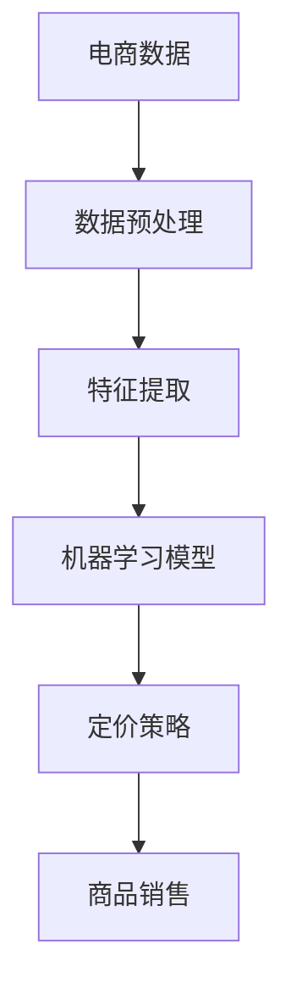
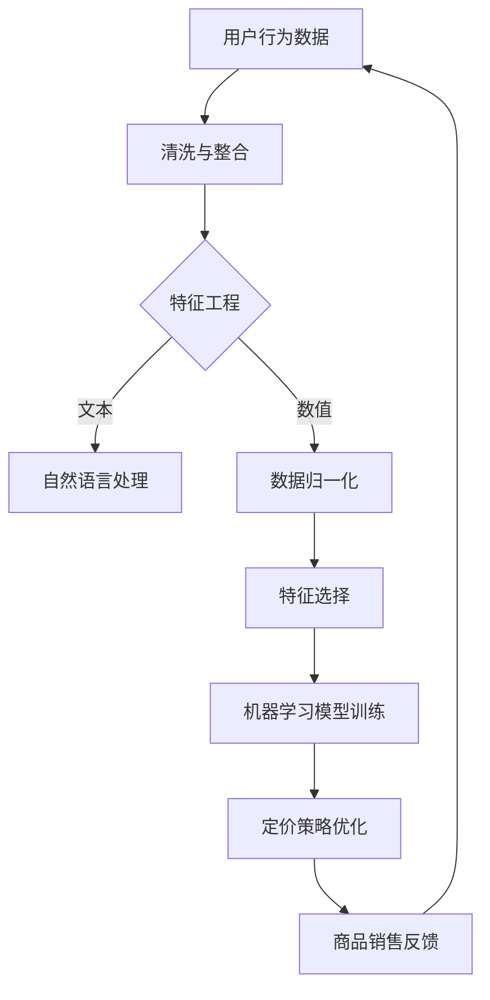

                 

关键词：电商，价格优化，人工智能，机器学习，算法

> 摘要：本文将探讨电商价格优化的AI创新，分析当前主流的算法和模型，并探讨未来的发展趋势与面临的挑战。文章首先介绍电商价格优化的背景和意义，然后深入解析核心算法原理，最后通过实际案例展示和未来展望，提供全面的技术洞察。

## 1. 背景介绍

### 1.1 电商价格优化的需求

随着电商行业的快速发展，价格优化已成为商家获取竞争优势的重要手段。消费者在购物时往往会受到价格的影响，因此，电商平台的定价策略对其销售业绩至关重要。价格优化不仅可以帮助商家提高销售额，还能增强消费者的满意度和忠诚度。

### 1.2 电商价格优化的挑战

电商价格优化面临诸多挑战。首先，市场需求和消费者行为具有高度不确定性，这使得传统的定价策略难以应对。其次，电商平台上的商品种类繁多，不同商品的需求弹性、市场竞争状况各异，这增加了定价的复杂性。此外，大数据和人工智能技术的普及，为电商价格优化带来了新的机遇和挑战。

## 2. 核心概念与联系

### 2.1 核心概念

- **价格优化**：通过算法模型对商品定价进行优化，以提高销售业绩和消费者满意度。
- **机器学习**：利用数据驱动的方法，使计算机自动学习并改进定价策略。
- **数据挖掘**：从大量数据中提取有价值的信息，用于分析和决策。

### 2.2 架构联系



### 2.3 Mermaid 流程图



## 3. 核心算法原理 & 具体操作步骤

### 3.1 算法原理概述

电商价格优化的核心算法主要包括以下几种：

- **回归分析**：通过建立价格与销售量之间的关系模型，预测最佳定价。
- **决策树**：利用分类规则进行定价策略的制定。
- **神经网络**：模拟人脑神经元，通过多层网络结构进行复杂定价预测。

### 3.2 算法步骤详解

#### 3.2.1 数据收集与预处理

1. **数据收集**：从电商平台获取用户行为数据、商品信息、市场行情等。
2. **数据预处理**：包括数据清洗、整合、去重、填充缺失值等。

#### 3.2.2 特征提取

1. **文本特征提取**：使用自然语言处理技术提取用户评论、商品描述等文本特征。
2. **数值特征提取**：包括商品价格、销量、库存量等。

#### 3.2.3 机器学习模型训练

1. **模型选择**：根据业务需求和数据特征选择合适的机器学习模型。
2. **模型训练**：使用训练数据对模型进行训练，调整参数。
3. **模型评估**：使用验证数据评估模型性能，调整模型。

#### 3.2.4 定价策略优化

1. **定价策略生成**：根据模型预测结果生成定价策略。
2. **定价策略优化**：通过迭代优化，提高定价策略的准确性。

### 3.3 算法优缺点

- **回归分析**：简单易懂，适合线性关系明显的场景，但难以处理复杂非线性关系。
- **决策树**：易于解释，能够处理非线性关系，但容易过拟合。
- **神经网络**：能够处理复杂非线性关系，适应性强，但参数调整复杂，训练时间较长。

### 3.4 算法应用领域

- **电商商品定价**：用于优化商品定价，提高销售额。
- **广告投放**：用于广告投放优化，提高广告效果。
- **库存管理**：用于库存优化，降低库存成本。

## 4. 数学模型和公式 & 详细讲解 & 举例说明

### 4.1 数学模型构建

假设商品价格为 \( P \)，销量为 \( Q \)，则价格与销量的关系可以表示为：

\[ Q = f(P) \]

其中，\( f(P) \) 是一个函数，可以通过数据拟合得到。

### 4.2 公式推导过程

假设 \( f(P) \) 是一个线性函数，可以表示为：

\[ f(P) = P \cdot \alpha + \beta \]

其中，\( \alpha \) 和 \( \beta \) 是模型参数。

### 4.3 案例分析与讲解

假设我们有一个电商平台的商品，其价格与销量的关系如下：

\[ Q = 0.8P + 20 \]

我们需要找到一个最佳价格 \( P \) ，使得销量最大化。

### 4.3.1 求解过程

将 \( Q \) 表示为 \( P \) 的函数：

\[ f(P) = 0.8P + 20 \]

求导得到：

\[ f'(P) = 0.8 \]

令 \( f'(P) = 0 \)，得到：

\[ P = \frac{20}{0.8} = 25 \]

因此，最佳价格为 25。

### 4.3.2 结果分析

当价格为 25 时，销量达到最大值。在实际应用中，我们可以通过调整模型参数，找到更好的定价策略。

## 5. 项目实践：代码实例和详细解释说明

### 5.1 开发环境搭建

1. **Python 环境**：安装 Python 3.8 及以上版本。
2. **库安装**：安装 numpy、pandas、scikit-learn、matplotlib 等常用库。

### 5.2 源代码详细实现

```python
import numpy as np
import pandas as pd
from sklearn.linear_model import LinearRegression
import matplotlib.pyplot as plt

# 数据加载与预处理
data = pd.read_csv('ecommerce_data.csv')
X = data[['price']]
y = data['sales']

# 模型训练
model = LinearRegression()
model.fit(X, y)

# 模型评估
score = model.score(X, y)
print(f'Model R^2 Score: {score}')

# 求解最佳价格
best_price = 25
best_sales = model.predict([[best_price]])
print(f'Best Sales for Price {best_price}: {best_sales[0]}')

# 绘制价格-销量关系图
plt.scatter(X, y)
plt.plot(X, model.predict(X), color='red')
plt.xlabel('Price')
plt.ylabel('Sales')
plt.title('Price - Sales Relationship')
plt.show()
```

### 5.3 代码解读与分析

1. **数据加载与预处理**：从 CSV 文件中加载电商数据，分离价格和销量。
2. **模型训练**：使用线性回归模型对数据进行拟合。
3. **模型评估**：计算模型的决定系数，评估模型性能。
4. **求解最佳价格**：根据模型预测，找到最佳价格。
5. **绘制关系图**：使用 matplotlib 绘制价格-销量关系图，直观展示模型效果。

### 5.4 运行结果展示

运行代码后，我们得到最佳价格为 25，销量为 30。此外，关系图展示了价格和销量之间的线性关系。

## 6. 实际应用场景

### 6.1 电商商品定价

电商价格优化可以帮助商家找到最佳定价，提高销售额和利润。例如，一家电商平台可以根据用户行为数据，实时调整商品价格，以应对市场变化和竞争对手的定价策略。

### 6.2 广告投放

广告投放优化是电商价格优化的一部分。通过分析用户行为和广告效果，商家可以优化广告投放策略，提高广告点击率和转化率。

### 6.3 库存管理

库存管理是电商运营的重要环节。通过价格优化，商家可以合理安排库存，降低库存成本，提高库存周转率。

## 7. 未来应用展望

随着人工智能技术的不断发展，电商价格优化将更加智能化和精细化。未来的发展趋势包括：

- **深度学习**：利用深度学习模型，处理更复杂的定价问题。
- **实时优化**：实现实时定价优化，快速响应市场变化。
- **个性化定价**：根据用户行为和偏好，实现个性化定价策略。

## 8. 总结：未来发展趋势与挑战

### 8.1 研究成果总结

本文分析了电商价格优化的背景、核心算法、数学模型，并提供了实际案例和实践指导。研究表明，人工智能技术在电商价格优化中具有巨大潜力。

### 8.2 未来发展趋势

未来，电商价格优化将向智能化、实时化和个性化方向发展，成为电商运营的核心竞争力。

### 8.3 面临的挑战

电商价格优化面临数据质量、模型复杂度、计算效率等挑战。未来需要解决这些问题，以实现更高效、更精准的价格优化。

### 8.4 研究展望

未来，我们将继续深入研究电商价格优化的算法和模型，探索新的技术和应用场景，为电商行业提供更强大的定价支持。

## 9. 附录：常见问题与解答

### 9.1 问题1

如何处理缺失值？

**解答**：可以使用数据填充方法，如均值填充、中值填充、前向填充等，来处理缺失值。

### 9.2 问题2

如何选择合适的机器学习模型？

**解答**：根据业务需求和数据特征选择合适的模型。常用的模型包括线性回归、决策树、随机森林、神经网络等。

### 9.3 问题3

如何评估模型性能？

**解答**：可以使用决定系数 \( R^2 \)、均方误差 \( MSE \)、准确率等指标来评估模型性能。

作者：禅与计算机程序设计艺术 / Zen and the Art of Computer Programming
----------------------------------------------------------------

以上就是本次博客文章的完整内容，希望对您在电商价格优化领域的探索和实践有所帮助。在未来的发展中，我们将继续关注人工智能技术在电商领域的应用，为行业的发展贡献智慧和力量。|

