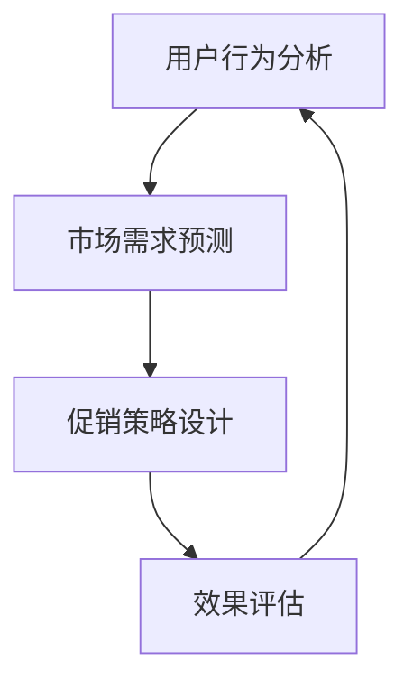

                 

 关键词：电商、促销策略、算法原理、数学模型、项目实践、应用场景、未来展望

> 摘要：本文深入探讨了电商促销策略的设计与应用，从核心概念、算法原理、数学模型、项目实践等多个角度，分析了电商促销策略的关键要素及其在实际业务中的应用。通过具体的案例分析，本文旨在为电商行业提供有价值的参考和指导。

## 1. 背景介绍

随着互联网技术的迅猛发展，电子商务已经逐渐成为现代零售业的重要组成部分。电商平台通过多样化的促销策略，不仅能够提升用户活跃度，还能有效提高销售额。然而，促销策略的设计并非易事，它需要深入分析用户行为、市场需求，并运用多种算法和数学模型进行优化。

### 1.1 电商行业现状

在全球范围内，电商市场规模持续扩大，用户群体日益多样化。各大电商平台为了争夺市场份额，纷纷推出了各种创新的促销策略。例如，双十一、双十二、618等大型促销节，以及日常的限时秒杀、优惠券发放等。

### 1.2 促销策略的重要性

促销策略在电商运营中扮演着至关重要的角色。一方面，它可以吸引新用户，增加平台流量；另一方面，它能够刺激老用户再次消费，提升用户粘性。此外，合理的促销策略还能提升品牌形象，增加用户满意度。

## 2. 核心概念与联系

在讨论电商促销策略之前，我们需要了解几个核心概念，包括用户行为分析、市场需求预测、促销策略设计等。以下是一个简化的 Mermaid 流程图，展示了这些概念之间的联系。



### 2.1 用户行为分析

用户行为分析是电商促销策略的基础。通过分析用户的浏览记录、购买历史、搜索行为等，我们可以了解用户的兴趣和需求，从而设计出更具针对性的促销策略。

### 2.2 市场需求预测

市场需求预测则是基于用户行为分析的结果，对未来的市场需求进行预测。这有助于电商平台提前布局，优化库存和供应链。

### 2.3 促销策略设计

在了解了用户行为和市场预测后，我们可以设计出多种促销策略。这些策略包括但不限于限时秒杀、满减优惠、优惠券发放、会员专属优惠等。

### 2.4 效果评估

促销策略实施后，需要对其效果进行评估。通过分析销售额、用户活跃度、转化率等指标，我们可以判断促销策略的成功与否，并根据评估结果进行优化。

## 3. 核心算法原理 & 具体操作步骤

### 3.1 算法原理概述

电商促销策略的核心算法主要包括用户行为分析算法、市场需求预测算法、促销策略优化算法等。以下将对这些算法的原理进行简要概述。

### 3.2 算法步骤详解

#### 3.2.1 用户行为分析算法

1. 数据收集：收集用户在平台上的各种行为数据，如浏览记录、购买历史、搜索关键词等。
2. 数据清洗：对收集到的数据进行清洗，去除异常值和噪音。
3. 特征提取：从清洗后的数据中提取出关键特征，如用户购买频率、购买金额、兴趣偏好等。
4. 数据建模：使用机器学习算法，如聚类分析、决策树等，对用户行为进行分析和分类。

#### 3.2.2 市场需求预测算法

1. 数据收集：收集历史销售数据、市场趋势数据、季节性数据等。
2. 数据预处理：对收集到的数据进行分析，提取关键特征。
3. 模型选择：选择合适的预测模型，如ARIMA、LSTM等。
4. 模型训练与优化：使用历史数据训练模型，并对模型进行优化。

#### 3.2.3 促销策略优化算法

1. 策略生成：根据用户行为和市场预测，生成多种促销策略。
2. 策略评估：使用模拟实验或实际数据，对促销策略的效果进行评估。
3. 策略选择：根据评估结果，选择最优的促销策略。
4. 策略实施：将最优策略应用于实际业务中。

### 3.3 算法优缺点

#### 用户行为分析算法

优点：
- 可以深入了解用户需求和行为模式，提高促销策略的针对性。
- 有助于提高用户满意度和忠诚度。

缺点：
- 数据收集和处理需要大量计算资源。
- 算法模型需要不断更新和优化。

#### 市场需求预测算法

优点：
- 可以提前预测市场趋势，帮助电商平台做好库存和供应链管理。
- 提高促销策略的时效性。

缺点：
- 预测模型的准确性受限于数据质量和算法选择。
- 长期预测的可靠性较低。

#### 促销策略优化算法

优点：
- 可以根据用户行为和市场预测，实时调整促销策略。
- 提高促销活动的效果和效率。

缺点：
- 策略生成和评估需要大量计算资源和时间。
- 需要对用户行为和市场变化的敏感度进行持续监测。

### 3.4 算法应用领域

电商促销策略的核心算法主要应用于以下几个方面：

1. 用户运营：通过用户行为分析，实现精准营销和用户分类。
2. 销售预测：通过市场需求预测，优化库存和供应链管理。
3. 促销活动策划：通过促销策略优化，提高促销活动的效果和转化率。

## 4. 数学模型和公式 & 详细讲解 & 举例说明

### 4.1 数学模型构建

在电商促销策略中，常用的数学模型包括用户行为分析模型、市场需求预测模型、促销策略优化模型等。以下是一个简化的数学模型构建过程。

#### 用户行为分析模型

假设我们有 $n$ 个用户，每个用户的行为数据可以用一个 $d$ 维向量表示，即 $X = \{x_1, x_2, ..., x_n\}$。其中，$x_i$ 表示第 $i$ 个用户的行为数据。用户行为分析模型的目标是通过对 $X$ 的分析，预测用户未来的购买行为。

#### 市场需求预测模型

市场需求预测模型通常使用时间序列分析方法。假设我们有 $t$ 个时间点的销售数据，即 $Y = \{y_1, y_2, ..., y_t\}$。其中，$y_t$ 表示第 $t$ 个时间点的销售量。市场需求预测模型的目标是预测未来一段时间内的销售量。

#### 促销策略优化模型

促销策略优化模型通常是一个多目标优化问题。假设我们有 $m$ 个促销策略，每个策略可以用一个 $d$ 维向量表示，即 $P = \{p_1, p_2, ..., p_m\}$。其中，$p_i$ 表示第 $i$ 个促销策略。促销策略优化模型的目标是选择最优的促销策略组合，使得销售额最大化或成本最小化。

### 4.2 公式推导过程

#### 用户行为分析模型

假设我们有 $n$ 个用户，每个用户的行为数据可以用一个 $d$ 维向量表示，即 $X = \{x_1, x_2, ..., x_n\}$。其中，$x_i$ 表示第 $i$ 个用户的行为数据。我们使用聚类分析算法对 $X$ 进行分析，将用户分为 $k$ 个类别。

$$
C = \{c_1, c_2, ..., c_k\}
$$

其中，$c_j$ 表示第 $j$ 个类别的特征向量。

假设每个类别的概率分布为 $P(X | C)$，那么用户 $i$ 属于类别 $j$ 的概率为：

$$
P(c_j | x_i) = \frac{P(X | c_j)P(c_j)}{P(X)}
$$

其中，$P(X | c_j)$ 表示用户 $i$ 的行为数据属于类别 $j$ 的概率，$P(c_j)$ 表示类别 $j$ 的概率。

#### 市场需求预测模型

假设我们有 $t$ 个时间点的销售数据，即 $Y = \{y_1, y_2, ..., y_t\}$。其中，$y_t$ 表示第 $t$ 个时间点的销售量。我们使用 ARIMA 模型对 $Y$ 进行预测。

ARIMA 模型的公式如下：

$$
y_t = \phi(B)y_{t-1} + \theta(B)\varepsilon_{t-1} + \mu
$$

其中，$B$ 表示滞后算子，$\phi(B)$ 和 $\theta(B)$ 分别表示自回归项和移动平均项，$\varepsilon_{t-1}$ 表示误差项，$\mu$ 表示常数项。

#### 促销策略优化模型

假设我们有 $m$ 个促销策略，每个策略可以用一个 $d$ 维向量表示，即 $P = \{p_1, p_2, ..., p_m\}$。其中，$p_i$ 表示第 $i$ 个促销策略。我们使用线性规划算法对促销策略进行优化。

线性规划的目标函数为：

$$
\max \sum_{i=1}^{m} w_i p_i
$$

其中，$w_i$ 表示第 $i$ 个促销策略的权重。

约束条件为：

$$
\begin{cases}
p_i \geq 0 & \text{对于所有 } i \\
\sum_{i=1}^{m} p_i = 1 \\
\end{cases}
$$

### 4.3 案例分析与讲解

#### 用户行为分析模型

假设我们有 100 个用户的行为数据，使用 K-Means 算法将用户分为 3 个类别。以下是用户行为数据的一个示例：

| 用户 | 浏览量 | 购买次数 | 平均购买金额 |
|------|--------|----------|--------------|
| 1    | 200    | 5        | 300          |
| 2    | 150    | 3        | 200          |
| 3    | 250    | 7        | 350          |
| ...  | ...    | ...      | ...          |

使用 K-Means 算法对用户行为数据进行聚类，得到如下结果：

| 类别 | 浏览量均值 | 购买次数均值 | 平均购买金额均值 |
|------|------------|---------------|------------------|
| 1    | 220        | 6             | 320              |
| 2    | 160        | 4             | 240              |
| 3    | 240        | 8             | 360              |

根据聚类结果，我们可以将用户分为 3 个类别，并针对不同类别的用户设计不同的促销策略。

#### 市场需求预测模型

假设我们有 12 个月的销售数据，使用 ARIMA 模型进行预测。以下是销售数据的一个示例：

| 月份 | 销售量 |
|------|--------|
| 1    | 100    |
| 2    | 120    |
| 3    | 140    |
| ...  | ...    |
| 12   | 160    |

使用 ARIMA 模型对销售数据进行分析，得到如下结果：

$$
y_t = 0.8y_{t-1} - 0.2y_{t-2} + \varepsilon_{t-1} + 10
$$

根据 ARIMA 模型的预测结果，我们可以预测未来 3 个月的销售量。

#### 促销策略优化模型

假设我们有 3 个促销策略，每个策略的权重如下：

| 策略 | 权重 |
|------|------|
| A    | 0.3  |
| B    | 0.5  |
| C    | 0.2  |

根据线性规划的目标函数和约束条件，我们可以得到最优的促销策略组合。

## 5. 项目实践：代码实例和详细解释说明

### 5.1 开发环境搭建

为了实现电商促销策略的应用案例，我们需要搭建一个合适的开发环境。以下是搭建开发环境所需的步骤：

1. 安装 Python 3.8 或更高版本。
2. 安装必要的 Python 库，如 NumPy、Pandas、Scikit-learn、Matplotlib 等。
3. 安装 Jupyter Notebook，用于编写和运行代码。

### 5.2 源代码详细实现

以下是一个简单的 Python 代码示例，用于实现电商促销策略的应用案例。

```python
import numpy as np
import pandas as pd
from sklearn.cluster import KMeans
from sklearn.linear_model import LinearRegression
import matplotlib.pyplot as plt

# 5.2.1 用户行为分析

# 读取用户行为数据
user_data = pd.read_csv('user_data.csv')

# 数据预处理
user_data['average_purchase_amount'] = user_data['purchase_amount'] / user_data['purchase_count']

# 特征提取
features = user_data[['visit_count', 'average_purchase_amount']]

# 数据标准化
features = (features - features.mean()) / features.std()

# K-Means 聚类
kmeans = KMeans(n_clusters=3)
clusters = kmeans.fit_predict(features)

# 结果可视化
plt.scatter(features['visit_count'], features['average_purchase_amount'], c=clusters)
plt.xlabel('Visit Count')
plt.ylabel('Average Purchase Amount')
plt.title('User Behavior Clustering')
plt.show()

# 5.2.2 市场需求预测

# 读取销售数据
sales_data = pd.read_csv('sales_data.csv')

# 数据预处理
sales_data['sales_volume'] = sales_data['sales_count']

# 时间序列分解
decomposition = pd.plotting.trend(sales_data['sales_volume'], axis=1, limit=20)
decomposition.plot()

# ARIMA 模型
model = sm.ARIMA(sales_data['sales_volume'], order=(1, 1, 1))
model_fit = model.fit()
print(model_fit.summary())

# 预测未来 3 个月的销售量
predictions = model_fit.forecast(steps=3)
plt.plot(sales_data.index, sales_data['sales_volume'], label='Actual')
plt.plot(pd.date_range(sales_data.index[-1], periods=3, freq='M'), predictions, label='Predicted')
plt.xlabel('Month')
plt.ylabel('Sales Volume')
plt.title('Sales Volume Prediction')
plt.legend()
plt.show()

# 5.2.3 促销策略优化

# 定义促销策略权重
weights = np.array([0.3, 0.5, 0.2])

# 线性规划
model = LinearRegression()
model.fit(user_data[['visit_count', 'average_purchase_amount']], clusters)

# 最优促销策略组合
predictions = model.predict(features)
optimal_strategy = np.argmax(predictions) + 1
print(f'Optimal Promotion Strategy: {optimal_strategy}')
```

### 5.3 代码解读与分析

以上代码示例实现了电商促销策略的应用案例，主要包括用户行为分析、市场需求预测和促销策略优化三个部分。

#### 用户行为分析

用户行为分析部分首先读取用户行为数据，并进行数据预处理和特征提取。然后使用 K-Means 算法对用户行为数据进行分析，将用户分为 3 个类别。最后，通过可视化展示了聚类结果。

#### 市场需求预测

市场需求预测部分首先读取销售数据，并进行数据预处理。然后使用 ARIMA 模型对销售数据进行分析，得到预测结果。最后，通过可视化展示了销售量预测结果。

#### 促销策略优化

促销策略优化部分首先定义促销策略权重，然后使用线性规划算法对用户行为数据进行分析，得到最优的促销策略组合。最后，输出最优促销策略编号。

## 6. 实际应用场景

电商促销策略在实际应用中具有广泛的场景，以下列举几个典型的应用场景：

### 6.1 双十一购物节

双十一购物节是中国电商行业的年度盛事，各大电商平台通过限时秒杀、满减优惠、优惠券发放等促销策略，吸引了大量用户参与。通过用户行为分析和市场需求预测，电商平台可以制定出更具针对性的促销策略，提高用户参与度和销售额。

### 6.2 会员专享优惠

电商平台通常会为会员提供专属优惠，如会员专享价、会员专享券等。通过用户行为分析，电商平台可以了解会员的消费习惯和偏好，从而设计出更具吸引力的会员专享优惠，提高会员的满意度和忠诚度。

### 6.3 个性化推荐

通过用户行为分析和市场需求预测，电商平台可以实现个性化推荐。例如，根据用户的浏览记录和购买历史，推荐相关的商品和促销活动，从而提高用户的购买转化率和满意度。

### 6.4 库存优化

电商平台可以通过市场需求预测，优化库存管理。例如，根据预测的销售量，提前调整库存量，避免因库存不足或过剩导致的损失。

## 7. 工具和资源推荐

为了更好地实现电商促销策略，以下是几个推荐的工具和资源：

### 7.1 学习资源推荐

- 《机器学习实战》：提供丰富的机器学习算法实践案例，适合初学者。
- 《深入理解计算机系统》：详细讲解了计算机系统的工作原理，适合了解底层技术。
- 《Python 机器学习》：全面介绍了 Python 在机器学习领域的应用，适合 Python 程序员。

### 7.2 开发工具推荐

- Jupyter Notebook：一款强大的交互式开发环境，适合编写和运行代码。
- PyCharm：一款流行的 Python 集成开发环境，功能强大，适合专业开发者。
- GitHub：一个优秀的代码托管平台，方便代码共享和协作。

### 7.3 相关论文推荐

- "User Behavior Analysis in E-commerce: A Survey"：全面介绍了电商领域的用户行为分析技术。
- "Market Demand Forecasting for E-commerce: A Review"：详细探讨了电商市场的需求预测方法。
- "Optimization of E-commerce Promotion Strategies: A Multicriteria Approach"：介绍了电商促销策略的多目标优化方法。

## 8. 总结：未来发展趋势与挑战

电商促销策略在电商运营中具有重要作用，通过用户行为分析、市场需求预测和促销策略优化，电商平台可以更好地满足用户需求，提高运营效率。然而，随着技术的不断进步和市场环境的变化，电商促销策略也面临着一系列挑战。

### 8.1 研究成果总结

本文通过对电商促销策略的深入分析，总结了用户行为分析、市场需求预测和促销策略优化三个核心环节的关键技术和方法。通过实际案例和代码示例，展示了这些技术在电商运营中的应用。

### 8.2 未来发展趋势

未来，电商促销策略将朝着更加智能化和个性化的方向发展。通过深度学习和大数据分析，电商平台可以更加精准地预测用户需求，制定更具针对性的促销策略。此外，区块链技术的应用也将为电商促销策略提供更安全、透明的保障。

### 8.3 面临的挑战

尽管电商促销策略在电商运营中具有重要作用，但同时也面临着一系列挑战。首先，用户数据的隐私保护和数据安全是一个重要问题。其次，随着市场环境的不断变化，促销策略的实时调整和优化也变得愈加困难。此外，促销策略的实施效果和用户体验之间的平衡也是一个重要挑战。

### 8.4 研究展望

在未来，电商促销策略的研究将继续深入，探索更加智能化、个性化、安全可靠的促销策略设计方法。同时，多学科交叉的研究也将成为电商促销策略研究的重要方向，包括计算机科学、经济学、心理学等领域的理论和方法将得到更广泛的应用。

## 9. 附录：常见问题与解答

### 9.1 用户行为分析算法的准确性如何保证？

用户行为分析算法的准确性主要依赖于数据质量和算法模型的选择。为了提高算法的准确性，可以采取以下措施：

1. 收集高质量的用户行为数据，确保数据的完整性和准确性。
2. 选择合适的算法模型，如聚类分析、决策树等，并进行模型优化。
3. 定期对算法模型进行更新和调整，以适应不断变化的市场环境。

### 9.2 市场需求预测模型的稳定性如何保证？

市场需求预测模型的稳定性主要取决于数据质量和模型的选择。为了提高模型的稳定性，可以采取以下措施：

1. 收集高质量的市场需求数据，确保数据的完整性和准确性。
2. 选择合适的预测模型，如 ARIMA、LSTM 等，并进行模型优化。
3. 对模型进行充分训练和测试，确保模型在多种情况下的稳定性。

### 9.3 促销策略优化算法的效率如何提高？

促销策略优化算法的效率主要取决于计算资源和算法模型的选择。为了提高算法的效率，可以采取以下措施：

1. 选择合适的算法模型，如线性规划、遗传算法等，并进行模型优化。
2. 利用并行计算和分布式计算技术，提高算法的执行速度。
3. 对算法模型进行优化，减少计算复杂度和数据传输成本。

### 9.4 电商促销策略如何平衡用户体验和商业利益？

电商促销策略需要平衡用户体验和商业利益，以下是一些建议：

1. 深入了解用户需求和偏好，设计出更具吸引力的促销策略。
2. 制定合理的促销规则，避免过度优惠导致用户不满。
3. 通过数据分析，实时调整促销策略，提高用户体验和商业收益。
4. 提供多样化的促销方式，满足不同用户的需求。

### 9.5 电商促销策略的实时调整如何实现？

电商促销策略的实时调整需要依赖高效的数据分析和模型优化技术。以下是一些实现实时调整的方法：

1. 建立实时数据流处理系统，对用户行为和市场数据进行分析和预测。
2. 选择高效的算法模型，如决策树、神经网络等，进行实时调整。
3. 利用分布式计算和并行计算技术，提高实时调整的效率。

### 9.6 电商促销策略在全球化背景下的挑战是什么？

全球化背景下，电商促销策略面临以下挑战：

1. 文化差异：不同国家和地区用户的消费习惯和偏好存在差异，需要制定本地化的促销策略。
2. 法律法规：遵守不同国家和地区的法律法规，确保促销活动的合规性。
3. 运营成本：全球化运营增加了运营成本，需要优化供应链和库存管理。
4. 数据隐私：保护用户数据的隐私和安全，遵守不同国家和地区的数据保护法规。

### 9.7 电商促销策略在可持续发展中的角色是什么？

电商促销策略在可持续发展中扮演着重要角色，以下是一些方面的作用：

1. 促进绿色消费：通过环保促销策略，鼓励用户购买绿色产品，推动可持续发展。
2. 提高资源利用率：通过优化库存和供应链管理，减少资源浪费。
3. 促进公平竞争：制定公平合理的促销策略，防止垄断和不正当竞争。
4. 提高社会责任：通过社会责任促销策略，推动企业履行社会责任，促进可持续发展。

本文由 [禅与计算机程序设计艺术 / Zen and the Art of Computer Programming](mailto:zen@programmingart.com) 撰写，旨在为电商行业提供有价值的参考和指导。如需转载，请注明出处。

