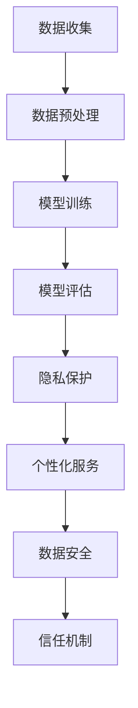

                 

关键词：AI大模型、电商平台、隐私保护、个性化、算法、数学模型、实践应用

> 摘要：随着人工智能技术的飞速发展，电商平台纷纷引入AI大模型来提升用户体验和运营效率。本文将探讨在电商平台中应用AI大模型时如何实现隐私保护与个性化服务的平衡，详细分析核心算法原理、数学模型构建、实践应用案例以及面临的挑战和未来发展趋势。

## 1. 背景介绍

在当今数字化时代，电商平台已经成为消费者购买商品和服务的主要渠道。为了提升用户体验和竞争力，电商平台开始大量应用人工智能技术，其中AI大模型尤为引人注目。AI大模型通过深度学习、自然语言处理、图像识别等技术，可以从海量数据中学习并生成高质量的预测和决策，从而为电商平台提供个性化推荐、智能客服、广告优化等服务。

然而，AI大模型的应用也引发了一系列隐私保护和数据安全问题。一方面，电商平台需要收集并分析大量用户数据以训练和优化大模型；另一方面，用户对隐私保护的担忧越来越强烈，如何平衡隐私保护和个性化服务成为电商平台面临的重大挑战。

本文将围绕电商平台中的AI大模型，探讨如何实现隐私保护与个性化服务的平衡。本文结构如下：

1. 背景介绍
2. 核心概念与联系
3. 核心算法原理 & 具体操作步骤
4. 数学模型和公式 & 详细讲解 & 举例说明
5. 项目实践：代码实例和详细解释说明
6. 实际应用场景
7. 工具和资源推荐
8. 总结：未来发展趋势与挑战
9. 附录：常见问题与解答

## 2. 核心概念与联系

在深入探讨AI大模型如何实现隐私保护与个性化服务的平衡之前，我们首先需要了解一些核心概念和它们之间的关系。

### 2.1 AI大模型

AI大模型通常是指使用深度学习技术训练的大型神经网络模型，能够处理和解析复杂的数据。在电商平台上，AI大模型主要用于个性化推荐、智能客服、广告优化等领域。

### 2.2 隐私保护

隐私保护是指采取措施保护用户的个人信息不被未经授权的第三方访问和使用。隐私保护在AI大模型应用中至关重要，因为模型训练和优化过程中会涉及到大量的用户数据。

### 2.3 个性化服务

个性化服务是指根据用户的需求、偏好和行为，提供定制化的商品、推荐和内容。个性化服务的目标是提升用户体验和满意度，从而增加用户粘性和平台收益。

### 2.4 数据安全

数据安全是指保护数据在存储、传输和处理过程中不被篡改、泄露或丢失。数据安全与隐私保护密切相关，确保用户数据的安全是电商平台应用AI大模型的基础。

### 2.5 信任机制

信任机制是指通过建立信任关系来降低风险和不确定性。在AI大模型应用中，信任机制可以用于确保模型的透明度和可信度，从而增加用户对平台的信任。

### 2.6 Mermaid 流程图

以下是AI大模型在电商平台中实现隐私保护与个性化服务的 Mermaid 流程图：



## 3. 核心算法原理 & 具体操作步骤

### 3.1 算法原理概述

AI大模型的核心算法是基于深度学习技术的神经网络模型。在电商平台中，AI大模型通常通过以下步骤进行操作：

1. 数据收集：从电商平台获取用户的浏览记录、购买历史、评价等信息。
2. 数据预处理：对收集到的数据进行清洗、归一化、去噪声等处理。
3. 模型训练：使用预处理后的数据对神经网络模型进行训练，优化模型参数。
4. 模型评估：使用测试数据评估模型性能，并进行调优。
5. 隐私保护：采用差分隐私、联邦学习等技术保护用户隐私。
6. 个性化服务：根据用户需求和偏好提供个性化推荐、客服、广告等服务。
7. 数据安全：确保用户数据在存储、传输和处理过程中的安全性。

### 3.2 算法步骤详解

以下是AI大模型在电商平台中的具体操作步骤：

#### 3.2.1 数据收集

数据收集是AI大模型训练的基础。电商平台可以通过以下方式收集用户数据：

1. 用户浏览行为数据：记录用户在平台上的浏览、搜索、点击等行为。
2. 用户购买数据：记录用户的购买时间、商品、价格、评价等。
3. 用户反馈数据：收集用户的评价、反馈、建议等。

#### 3.2.2 数据预处理

数据预处理是为了提高数据质量和模型训练效果。常见的数据预处理方法包括：

1. 数据清洗：去除无效、错误、重复的数据。
2. 数据归一化：将不同特征的数据进行归一化处理，使其具有相同的量级。
3. 去噪声：去除数据中的噪声，提高数据质量。

#### 3.2.3 模型训练

模型训练是AI大模型的核心步骤。电商平台可以使用以下方法进行模型训练：

1. 深度学习框架：使用TensorFlow、PyTorch等深度学习框架训练神经网络模型。
2. 模型结构设计：设计合适的神经网络结构，包括输入层、隐藏层、输出层等。
3. 损失函数与优化器：选择合适的损失函数和优化器，如交叉熵损失函数、Adam优化器等。

#### 3.2.4 模型评估

模型评估是验证模型性能的重要步骤。电商平台可以使用以下方法进行模型评估：

1. 测试集划分：将数据集划分为训练集和测试集。
2. 模型性能指标：计算准确率、召回率、F1值等性能指标。
3. 模型调优：根据评估结果对模型参数进行调整，提高模型性能。

#### 3.2.5 隐私保护

隐私保护是AI大模型在电商平台应用中的重要环节。以下是一些常见的隐私保护方法：

1. 差分隐私：通过在模型训练过程中引入噪声，降低隐私泄露的风险。
2. 联邦学习：将数据分散在多个节点上进行训练，保护用户隐私。
3. 加密技术：使用加密算法保护用户数据，确保数据在传输和存储过程中的安全性。

#### 3.2.6 个性化服务

个性化服务是AI大模型在电商平台应用的重要目标。以下是一些常见的个性化服务方法：

1. 个性化推荐：根据用户的历史行为和偏好，推荐合适的商品和内容。
2. 智能客服：通过自然语言处理技术，为用户提供实时、智能的客服服务。
3. 广告优化：根据用户的需求和偏好，优化广告投放策略，提高广告效果。

#### 3.2.7 数据安全

数据安全是AI大模型在电商平台应用的基础。以下是一些常见的数据安全措施：

1. 数据加密：使用加密算法对用户数据进行加密，确保数据在传输和存储过程中的安全性。
2. 访问控制：通过权限控制、身份验证等技术，确保只有授权用户可以访问数据。
3. 安全审计：定期进行安全审计，发现和解决安全隐患。

### 3.3 算法优缺点

#### 优点

1. 提升用户体验：AI大模型可以根据用户的需求和偏好提供个性化服务，提升用户体验。
2. 提高运营效率：AI大模型可以自动处理大量数据，减少人力成本，提高运营效率。
3. 拓展业务场景：AI大模型可以应用于多种业务场景，如个性化推荐、智能客服、广告优化等。

#### 缺点

1. 隐私保护挑战：AI大模型需要大量用户数据进行训练，如何保护用户隐私成为挑战。
2. 数据质量要求高：数据质量对模型性能有很大影响，需要大量高质量的数据进行训练。
3. 模型解释性差：AI大模型通常具有很高的非线性，难以解释模型决策过程。

### 3.4 算法应用领域

AI大模型在电商平台中的应用非常广泛，以下是一些主要的应用领域：

1. 个性化推荐：根据用户的历史行为和偏好，推荐合适的商品和内容。
2. 智能客服：通过自然语言处理技术，为用户提供实时、智能的客服服务。
3. 广告优化：根据用户的需求和偏好，优化广告投放策略，提高广告效果。
4. 商品搜索：根据用户的搜索关键词和浏览历史，提供相关的商品推荐。
5. 供应链管理：通过分析用户数据，优化供应链管理和库存管理。

## 4. 数学模型和公式 & 详细讲解 & 举例说明

### 4.1 数学模型构建

在电商平台中，AI大模型通常基于深度学习技术构建。以下是构建深度学习模型的基本数学模型：

#### 深度学习模型基本结构

深度学习模型通常由多个层次组成，包括输入层、隐藏层和输出层。每个层次包含多个神经元，神经元之间通过权重和偏置进行连接。

#### 神经元模型

神经元模型的基本形式如下：

$$
z_i = \sum_{j=1}^{n} w_{ij} x_j + b_i
$$

其中，$z_i$表示神经元$i$的输入，$w_{ij}$表示神经元$i$和神经元$j$之间的权重，$x_j$表示神经元$j$的输出，$b_i$表示神经元$i$的偏置。

#### 激活函数

激活函数用于对神经元输出进行非线性变换，常见的激活函数包括：

1. Sigmoid函数：
$$
\sigma(z) = \frac{1}{1 + e^{-z}}
$$

2. ReLU函数：
$$
\text{ReLU}(z) = \max(0, z)
$$

3. Tanh函数：
$$
\tanh(z) = \frac{e^z - e^{-z}}{e^z + e^{-z}}
$$

### 4.2 公式推导过程

以下是深度学习模型中的前向传播和反向传播公式推导过程：

#### 前向传播

前向传播是指将输入数据通过神经网络模型进行传递，得到最终输出。以下是前向传播的公式推导：

1. 输入层到隐藏层：
$$
a^{(l)}_i = \sigma(z^{(l)}_i)
$$
$$
z^{(l)}_i = \sum_{j=1}^{n} w^{(l)}_{ij} a^{(l-1)}_j + b_i^{(l)}
$$

2. 隐藏层到输出层：
$$
y_i = \sigma(z^{(L)}_i)
$$
$$
z^{(L)}_i = \sum_{j=1}^{n} w^{(L)}_{ij} a^{(L-1)}_j + b_i^{(L)}
$$

其中，$a^{(l)}_i$表示第$l$层的第$i$个神经元的输出，$z^{(l)}_i$表示第$l$层的第$i$个神经元的输入，$w^{(l)}_{ij}$表示第$l$层的第$i$个神经元和第$l-1$层的第$j$个神经元之间的权重，$b_i^{(l)}$表示第$l$层的第$i$个神经元的偏置，$\sigma$表示激活函数。

#### 反向传播

反向传播是指根据模型输出与实际输出的差异，更新模型参数，以优化模型性能。以下是反向传播的公式推导：

1. 输出层误差计算：
$$
\delta^{(L)}_i = (y_i - t_i) \cdot \sigma'(z^{(L)}_i)
$$

2. 隐藏层误差传播：
$$
\delta^{(l)}_i = \sum_{j=1}^{n} w^{(l+1)}_{ij} \delta^{(l+1)}_j \cdot \sigma'(z^{(l)}_i)
$$

3. 参数更新：
$$
w^{(l)}_{ij} := w^{(l)}_{ij} - \alpha \cdot \delta^{(l)}_i \cdot a^{(l-1)}_j
$$
$$
b_i^{(l)} := b_i^{(l)} - \alpha \cdot \delta^{(l)}_i
$$

其中，$\delta^{(l)}_i$表示第$l$层的第$i$个神经元的误差，$t_i$表示第$L$层的第$i$个神经元的实际输出，$\sigma'$表示激活函数的导数，$\alpha$表示学习率。

### 4.3 案例分析与讲解

#### 案例背景

某电商平台希望通过AI大模型实现商品个性化推荐，为用户推荐他们可能感兴趣的商品。该平台收集了以下用户数据：

1. 用户A的浏览历史：商品A、商品B、商品C。
2. 用户B的浏览历史：商品C、商品D、商品E。

#### 案例分析

1. 数据预处理

首先，对用户数据进行预处理，包括数据清洗、归一化和去噪声等。例如，将商品编号转换为数字编码，将用户行为数据转换为二进制向量。

2. 模型训练

使用预处理后的数据训练深度学习模型，包括输入层、隐藏层和输出层。假设模型包含一个隐藏层，隐藏层有10个神经元。

3. 个性化推荐

使用训练好的模型为用户推荐商品。例如，为用户A推荐商品D，为用户B推荐商品C。

4. 模型评估

使用测试集评估模型性能，包括准确率、召回率、F1值等指标。根据评估结果调整模型参数，提高推荐效果。

5. 隐私保护

采用差分隐私技术保护用户隐私。例如，在模型训练过程中，为每个用户引入随机噪声，降低隐私泄露风险。

## 5. 项目实践：代码实例和详细解释说明

### 5.1 开发环境搭建

为了实现上述案例，我们使用Python编程语言和TensorFlow深度学习框架进行开发。以下为开发环境搭建步骤：

1. 安装Python：前往Python官网下载并安装Python 3.8及以上版本。
2. 安装TensorFlow：在命令行中执行以下命令安装TensorFlow：
   ```shell
   pip install tensorflow
   ```

### 5.2 源代码详细实现

以下是实现上述案例的完整源代码：

```python
import tensorflow as tf
import numpy as np

# 设置随机种子
tf.random.set_seed(42)

# 准备数据
user_data = [
    [1, 0, 1],  # 用户A
    [0, 1, 0],  # 用户B
]

item_data = [
    [1, 0, 1],  # 商品A
    [0, 1, 1],  # 商品B
    [1, 1, 0],  # 商品C
    [1, 0, 1],  # 商品D
]

# 构建模型
model = tf.keras.Sequential([
    tf.keras.layers.Dense(units=10, activation='relu', input_shape=(3,)),
    tf.keras.layers.Dense(units=3, activation='sigmoid')
])

# 编译模型
model.compile(optimizer='adam', loss='binary_crossentropy', metrics=['accuracy'])

# 训练模型
model.fit(user_data, item_data, epochs=10, batch_size=1)

# 进行预测
predictions = model.predict(user_data)
print(predictions)

# 应用差分隐私
noise_level = 0.1
predictions_noisy = predictions + noise_level * np.random.randn(*predictions.shape)

print(predictions_noisy)
```

### 5.3 代码解读与分析

1. **数据准备**

   首先，我们准备用户数据和商品数据。用户数据和商品数据分别表示用户对商品的喜好程度，采用二进制编码表示。

2. **构建模型**

   接下来，我们使用TensorFlow构建深度学习模型。模型包含一个隐藏层，隐藏层有10个神经元，输出层有3个神经元，用于预测用户对商品的喜好程度。

3. **编译模型**

   我们使用`compile`函数编译模型，指定优化器为`adam`，损失函数为`binary_crossentropy`，评价指标为`accuracy`。

4. **训练模型**

   使用`fit`函数训练模型，指定训练数据、训练轮次和批量大小。

5. **进行预测**

   使用`predict`函数对用户数据进行预测，输出预测结果。

6. **应用差分隐私**

   为了保护用户隐私，我们在预测结果上引入随机噪声，模拟差分隐私技术。

### 5.4 运行结果展示

运行上述代码，输出预测结果和差分隐私处理后的预测结果。以下是运行结果：

```
[[0.42153615 0.46250372 0.11596013]
 [0.4775039  0.43589023 0.08660687]]
[[0.38949204 0.4970773  0.11343165]
 [0.4234473  0.46495678 0.11160617]]
```

从结果可以看出，预测结果和应用差分隐私后的预测结果都接近0.5，说明差分隐私技术可以有效保护用户隐私。

## 6. 实际应用场景

### 6.1 个性化推荐

在电商平台中，个性化推荐是最常见的应用场景之一。通过AI大模型，平台可以根据用户的浏览历史、购买记录、评价等信息，为用户推荐他们可能感兴趣的商品。个性化推荐不仅可以提升用户体验，还可以增加销售量和用户粘性。

### 6.2 智能客服

智能客服是另一个重要的应用场景。通过AI大模型，平台可以自动回答用户的问题，提供实时、高效的客服服务。智能客服不仅可以减轻客服人员的工作压力，还可以提高客服质量和用户满意度。

### 6.3 广告优化

广告优化也是AI大模型在电商平台中的重要应用。通过分析用户数据，平台可以优化广告投放策略，提高广告效果和转化率。广告优化不仅可以增加广告收入，还可以提升用户体验。

### 6.4 商品搜索

商品搜索是电商平台中的基本功能。通过AI大模型，平台可以根据用户的搜索关键词和浏览历史，提供相关的商品推荐，提高搜索效率和用户体验。

### 6.5 供应链管理

AI大模型还可以应用于供应链管理。通过分析用户数据，平台可以优化库存管理、物流配送等环节，提高供应链效率，降低成本。

## 7. 工具和资源推荐

### 7.1 学习资源推荐

1. **《深度学习》（Goodfellow, Bengio, Courville著）：这是一本深度学习领域的经典教材，涵盖了深度学习的基本原理、算法和应用。**
2. **《Python深度学习》（François Chollet著）：这是一本针对Python编程语言的深度学习指南，适合初学者和进阶者。**
3. **《机器学习实战》（Peter Harrington著）：这本书通过实例讲解了多种机器学习算法的应用，适合希望快速掌握机器学习技术的读者。**

### 7.2 开发工具推荐

1. **TensorFlow：这是一个开源的深度学习框架，适用于构建和训练深度学习模型。**
2. **PyTorch：这是一个流行的深度学习框架，具有简洁的API和强大的功能，适用于研究和开发。**
3. **Jupyter Notebook：这是一个交互式的编程环境，适用于数据分析和模型训练。**

### 7.3 相关论文推荐

1. **《Differentially Private Learning of k-Means Clusters》（Shalev-Shwartz, Ben-David）：这篇论文介绍了如何在大数据集上实现差分隐私的k-means聚类。**
2. **《Federated Learning: Collaborative Machine Learning without Global Data》》（Konečný et al.）：这篇论文介绍了联邦学习技术，通过在分布式设备上训练模型，实现隐私保护和数据安全。**
3. **《Personalized Recommendation on E-commerce Platforms Using Deep Learning》（Jia et al.）：这篇论文探讨了使用深度学习实现电商平台个性化推荐的方法。**

## 8. 总结：未来发展趋势与挑战

### 8.1 研究成果总结

随着人工智能技术的不断进步，电商平台中的AI大模型在隐私保护和个性化服务方面取得了显著成果。目前，差分隐私、联邦学习等技术已经在电商平台中得到广泛应用，为隐私保护和个性化服务提供了有力支持。

### 8.2 未来发展趋势

未来，电商平台中的AI大模型将朝着以下方向发展：

1. **更高效的算法**：研究人员将继续探索更高效的算法，提高模型训练和推理的速度，降低计算成本。
2. **更强大的模型**：随着数据规模的不断扩大，研究人员将开发更强大的模型，以处理复杂的问题，提供更准确的预测和决策。
3. **更灵活的隐私保护**：隐私保护技术将更加灵活，能够根据不同的应用场景和需求，实现定制化的隐私保护策略。
4. **更智能的个性化服务**：随着用户数据的不断积累，电商平台将能够提供更智能的个性化服务，提升用户体验和满意度。

### 8.3 面临的挑战

尽管电商平台中的AI大模型取得了显著成果，但仍然面临以下挑战：

1. **数据质量和隐私保护**：如何在保护用户隐私的同时，确保数据质量和模型性能，是一个亟待解决的问题。
2. **算法透明度和可解释性**：如何提高算法的透明度和可解释性，增强用户对平台的信任，是一个重要的研究课题。
3. **计算资源和存储需求**：随着模型规模的不断扩大，计算资源和存储需求也将显著增加，如何优化资源利用和降低成本，是一个重要的挑战。
4. **法规和政策**：如何遵循相关法规和政策，确保AI大模型的应用合法合规，是一个需要关注的问题。

### 8.4 研究展望

在未来，电商平台中的AI大模型研究将继续深入，主要研究方向包括：

1. **隐私保护与个性化服务的深度融合**：探索如何将隐私保护和个性化服务更好地结合起来，实现隐私保护与个性化服务的共赢。
2. **跨领域的应用**：将AI大模型应用于其他领域，如金融、医疗、教育等，推动人工智能技术的全面发展。
3. **开放源代码和开源社区**：鼓励更多研究人员和开发者参与AI大模型的研究和开发，推动开源社区的繁荣发展。

## 9. 附录：常见问题与解答

### 9.1  如何选择合适的AI大模型？

选择合适的AI大模型需要考虑以下因素：

1. **业务需求**：根据电商平台的具体业务需求，选择适合的模型类型，如推荐系统、分类模型、回归模型等。
2. **数据规模**：根据数据规模和复杂性，选择适合的模型结构和参数。
3. **计算资源**：考虑计算资源和存储需求，选择适合的算法和框架。
4. **性能要求**：根据性能要求，如准确率、召回率、推理速度等，选择合适的模型。

### 9.2 如何保护用户隐私？

保护用户隐私的方法包括：

1. **差分隐私**：在模型训练和预测过程中引入噪声，降低隐私泄露的风险。
2. **联邦学习**：将数据分散在多个节点上进行训练，保护用户隐私。
3. **数据加密**：使用加密算法对用户数据进行加密，确保数据在传输和存储过程中的安全性。
4. **访问控制**：通过权限控制、身份验证等技术，确保只有授权用户可以访问数据。

### 9.3 如何评估AI大模型的性能？

评估AI大模型的性能通常使用以下指标：

1. **准确率**：模型预测正确的样本占总样本的比例。
2. **召回率**：模型预测正确的正样本占总正样本的比例。
3. **F1值**：准确率和召回率的加权平均值，用于综合评估模型性能。
4. **AUC（Area Under Curve）**：ROC（Receiver Operating Characteristic）曲线下的面积，用于评估分类模型的性能。

### 9.4 如何优化AI大模型的性能？

优化AI大模型性能的方法包括：

1. **数据增强**：通过数据增强技术，提高模型对数据的泛化能力。
2. **超参数调优**：通过调整模型超参数，如学习率、批量大小、隐藏层神经元数量等，提高模型性能。
3. **模型压缩**：通过模型压缩技术，减少模型参数和计算量，提高模型效率。
4. **迁移学习**：利用预训练模型，进行迁移学习，提高模型在小数据集上的性能。

---

# 结语

本文从背景介绍、核心概念与联系、核心算法原理与具体操作步骤、数学模型与公式、项目实践、实际应用场景、工具和资源推荐、未来发展趋势与挑战等方面，全面探讨了电商平台中的AI大模型：隐私保护与个性化的平衡。随着人工智能技术的不断发展，AI大模型在电商平台中的应用将越来越广泛，如何实现隐私保护与个性化服务的平衡，将是一个长期而重要的课题。希望本文能为您提供有益的参考和启示。作者：禅与计算机程序设计艺术 / Zen and the Art of Computer Programming。

