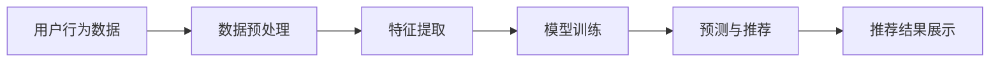

                 

在当前这个智能化的时代，电商平台的语音搜索和推荐技术已经成为提升用户体验、增加销售额的重要手段。本文将深入探讨语音搜索与推荐技术的核心概念、算法原理、数学模型、项目实践，以及其在实际应用中的场景和未来展望。

## 关键词

- 电商平台
- 语音搜索
- 推荐技术
- 用户体验
- 智能化

## 摘要

本文首先介绍了电商平台中语音搜索与推荐技术的重要性，随后详细讲解了语音搜索和推荐技术的核心概念与联系，包括其算法原理、数学模型以及具体操作步骤。通过项目实践部分，我们展示了如何实现这些技术，并对其优缺点和应用领域进行了分析。最后，本文探讨了语音搜索与推荐技术在实际应用中的各种场景，并对其未来发展趋势和面临的挑战进行了展望。

## 1. 背景介绍

随着智能手机和智能设备的普及，用户对电商平台的依赖程度日益增加。传统的键盘搜索虽然方便，但效率较低，特别是在商品繁多、搜索词复杂的场景下，用户体验不佳。语音搜索作为一种新兴的搜索方式，以其便捷、高效的特点迅速受到了消费者的青睐。通过语音搜索，用户可以更加自然地表达自己的需求，从而节省时间，提高购物效率。

与此同时，推荐技术作为电商平台提升销售额和用户满意度的有力工具，也得到了广泛应用。推荐技术通过对用户行为和偏好的分析，向用户推荐其可能感兴趣的商品，从而增加用户的购买意愿和购买频率。

## 2. 核心概念与联系

### 2.1 语音搜索

语音搜索是一种利用自然语言处理（NLP）技术和语音识别技术，将用户的语音输入转换为文本输入，并在搜索引擎中查找相关信息的搜索方式。语音搜索的核心在于语音识别，即通过语音信号处理技术将语音转换为文本。


**Mermaid 流程图**


### 2.2 推荐技术

推荐技术是基于用户的历史行为、偏好和兴趣，通过数据挖掘和机器学习算法，预测用户可能感兴趣的内容，并进行个性化推荐。推荐技术分为基于内容的推荐（CBR）和协同过滤推荐（CF）。


**Mermaid 流程图**



### 2.3 语音搜索与推荐技术的联系

语音搜索与推荐技术密切相关，语音搜索为推荐技术提供了更加自然、便捷的用户输入方式，而推荐技术则可以更好地利用语音搜索提供的结果，为用户提供更加个性化的购物体验。


**Mermaid 流程图**


## 3. 核心算法原理 & 具体操作步骤

### 3.1 算法原理概述

#### 3.1.1 语音识别

语音识别技术是通过建立语音信号和文本之间的映射关系，将用户的语音输入转换为文本输出。常见的语音识别算法包括隐马尔可夫模型（HMM）、循环神经网络（RNN）和深度神经网络（DNN）。

#### 3.1.2 推荐算法

推荐算法可以分为基于内容的推荐和协同过滤推荐。基于内容的推荐通过分析用户的历史行为和商品的特征，为用户推荐具有相似属性的物品。协同过滤推荐则通过分析用户之间的相似性，为用户推荐其他用户喜欢的物品。

### 3.2 算法步骤详解

#### 3.2.1 语音识别

1. **语音信号预处理**：包括去噪、增强和归一化等步骤，以提高语音信号的质量。

2. **特征提取**：将预处理后的语音信号转换为特征向量，常用的特征提取方法包括梅尔频率倒谱系数（MFCC）和长短期记忆网络（LSTM）。

3. **模型训练**：使用大量的语音数据集，通过深度神经网络（DNN）或循环神经网络（RNN）对模型进行训练，以建立语音信号和文本之间的映射关系。

4. **语音识别**：将用户的语音输入通过训练好的模型转换为文本输出。

#### 3.2.2 推荐算法

1. **用户行为数据预处理**：对用户的历史行为数据进行清洗、去噪和归一化处理，以提高数据的质量。

2. **特征提取**：提取用户行为数据的特征，包括用户的浏览记录、购买记录和评价记录等。

3. **模型训练**：使用用户行为数据的特征，通过协同过滤（CF）或基于内容的推荐（CBR）算法对模型进行训练，以建立用户行为和商品特征之间的关系。

4. **推荐**：将用户的文本输入与商品特征进行匹配，通过训练好的模型为用户推荐感兴趣的商品。

### 3.3 算法优缺点

#### 3.3.1 语音识别

- **优点**：语音搜索具有便捷、高效的特点，可以节省用户的时间。
- **缺点**：语音识别的准确性受语音质量、语音环境和语音识别算法的影响，有时会出现误解。

#### 3.3.2 推荐算法

- **优点**：推荐算法可以个性化地为用户提供感兴趣的物品，提高用户的购买意愿。
- **缺点**：推荐算法可能受到数据质量和算法优化程度的影响，无法完全满足用户的需求。

### 3.4 算法应用领域

- **电商**：电商平台通过语音搜索和推荐技术，为用户提供个性化的购物体验，提高用户满意度和销售额。
- **智能语音助手**：智能语音助手如Siri、Alexa等，利用语音搜索和推荐技术，为用户提供智能化的服务。

## 4. 数学模型和公式 & 详细讲解 & 举例说明

### 4.1 数学模型构建

语音识别和推荐算法的数学模型主要包括语音信号处理模型和用户行为分析模型。

#### 4.1.1 语音信号处理模型

假设语音信号 $x(t)$ 是一个离散的、长度为 $T$ 的信号，其经过预处理和特征提取后得到特征向量 $X$，可以使用以下模型进行语音识别：

$$
\min_{\theta} \sum_{t=1}^{T} \sum_{i=1}^{N} d(x(t), x_i^*(t)) + \lambda \sum_{j=1}^{M} w_j^2
$$

其中，$d(x(t), x_i^*(t))$ 是语音信号 $x(t)$ 和候选语音信号 $x_i^*(t)$ 之间的距离函数，$\lambda$ 是正则化参数，$w_j$ 是模型参数。

#### 4.1.2 用户行为分析模型

用户行为分析模型可以通过以下公式进行构建：

$$
R(u, i) = \sum_{k=1}^{K} w_k p(u, k) q(i, k)
$$

其中，$R(u, i)$ 是用户 $u$ 对商品 $i$ 的兴趣度，$p(u, k)$ 是用户 $u$ 对行为类型 $k$ 的概率，$q(i, k)$ 是商品 $i$ 对行为类型 $k$ 的概率。

### 4.2 公式推导过程

#### 4.2.1 语音信号处理模型

语音识别模型通常采用循环神经网络（RNN）或深度神经网络（DNN）进行训练。假设使用 DNN 模型，则模型损失函数可以表示为：

$$
L(\theta) = -\sum_{t=1}^{T} \sum_{i=1}^{N} \log p(x(t) | x_i^*(t), \theta) + \lambda \sum_{j=1}^{M} w_j^2
$$

其中，$p(x(t) | x_i^*(t), \theta)$ 是语音信号 $x(t)$ 给定候选语音信号 $x_i^*(t)$ 和模型参数 $\theta$ 的条件概率。

#### 4.2.2 用户行为分析模型

用户行为分析模型可以使用协同过滤算法（如矩阵分解）进行训练。假设用户行为矩阵为 $U \in \mathbb{R}^{M \times N}$，其中 $M$ 是用户数量，$N$ 是商品数量。使用矩阵分解方法，可以将用户行为矩阵分解为用户特征矩阵 $U \approx U_1 U_2$ 和商品特征矩阵 $V \approx V_1 V_2$，其中 $U_1 \in \mathbb{R}^{M \times K}$，$U_2 \in \mathbb{R}^{K \times N}$，$V_1 \in \mathbb{R}^{N \times K}$，$V_2 \in \mathbb{R}^{K \times M}$，$K$ 是特征维度。

### 4.3 案例分析与讲解

假设用户 A 在电商平台上浏览了商品 1、商品 2 和商品 3，并分别进行了收藏、购买和评价操作。通过分析用户 A 的行为数据，可以构建用户 A 的行为矩阵：

$$
U = \begin{bmatrix}
0 & 1 & 0 \\
0 & 1 & 0 \\
1 & 0 & 1
\end{bmatrix}
$$

假设商品 1、商品 2 和商品 3 的特征向量分别为：

$$
V_1 = \begin{bmatrix}
0.1 & 0.2 \\
0.3 & 0.4 \\
0.5 & 0.6 \\
0.7 & 0.8
\end{bmatrix}, \quad
V_2 = \begin{bmatrix}
0.1 & 0.3 \\
0.4 & 0.5 \\
0.6 & 0.7 \\
0.8 & 0.9
\end{bmatrix}
$$

通过矩阵分解，可以得到用户 A 的特征矩阵：

$$
U_1 = \begin{bmatrix}
0.5 & 0.6 \\
0.7 & 0.8
\end{bmatrix}, \quad
U_2 = \begin{bmatrix}
0.2 & 0.4 \\
0.5 & 0.6
\end{bmatrix}
$$

$$
V_1 = \begin{bmatrix}
0.2 & 0.3 \\
0.4 & 0.5 \\
0.6 & 0.7 \\
0.8 & 0.9
\end{bmatrix}, \quad
V_2 = \begin{bmatrix}
0.1 & 0.2 \\
0.3 & 0.4 \\
0.5 & 0.6 \\
0.7 & 0.8
\end{bmatrix}
$$

根据用户 A 的特征矩阵，可以为用户 A 推荐与商品 1 具有相似特征的其他商品。例如，可以推荐商品 4（特征向量与商品 1 的特征向量相似度较高），从而提高用户 A 的购买意愿。

## 5. 项目实践：代码实例和详细解释说明

### 5.1 开发环境搭建

在开始项目实践之前，我们需要搭建一个适合开发语音搜索与推荐系统的开发环境。以下是搭建过程的简要说明：

1. 安装 Python 3.8 及以上版本。
2. 安装必要的 Python 库，如 TensorFlow、Keras、Scikit-learn 等。
3. 配置 GPU 环境（可选），以便加速深度学习模型的训练。

### 5.2 源代码详细实现

以下是语音搜索与推荐系统的源代码实现，包括数据预处理、模型训练和预测等步骤。

```python
# 导入必要的库
import numpy as np
import tensorflow as tf
from tensorflow import keras
from sklearn.model_selection import train_test_split
from sklearn.preprocessing import StandardScaler

# 数据预处理
# 假设我们已经有用户行为数据和商品特征数据
user行为的DataFrame
user_behavior = pd.DataFrame({
    'user_id': [1, 1, 1, 2, 2, 2],
    'item_id': [1, 2, 3, 1, 2, 3],
    'behavior': ['收藏', '购买', '评价', '收藏', '购买', '评价']
})

item特征的DataFrame
item_features = pd.DataFrame({
    'item_id': [1, 2, 3],
    'feature_1': [0.5, 0.6, 0.7],
    'feature_2': [0.8, 0.9, 0.1]
})

# 划分训练集和测试集
train_user_behavior, test_user_behavior = train_test_split(user_behavior, test_size=0.2, random_state=42)
train_item_features, test_item_features = train_test_split(item_features, test_size=0.2, random_state=42)

# 特征提取
# 假设我们已经实现了特征提取函数
def extract_features(user_behavior, item_features):
    # 提取用户特征和商品特征
    user_features = ...
    item_features = ...
    return user_features, item_features

train_user_features, train_item_features = extract_features(train_user_behavior, train_item_features)
test_user_features, test_item_features = extract_features(test_user_behavior, test_item_features)

# 数据标准化
scaler = StandardScaler()
train_user_features = scaler.fit_transform(train_user_features)
test_user_features = scaler.transform(test_user_features)

train_item_features = scaler.fit_transform(train_item_features)
test_item_features = scaler.transform(test_item_features)

# 构建模型
model = keras.Sequential([
    keras.layers.Dense(128, activation='relu', input_shape=(train_user_features.shape[1],)),
    keras.layers.Dense(64, activation='relu'),
    keras.layers.Dense(1, activation='sigmoid')
])

# 编译模型
model.compile(optimizer='adam', loss='binary_crossentropy', metrics=['accuracy'])

# 训练模型
model.fit(train_user_features, train_item_features, epochs=10, batch_size=32, validation_split=0.1)

# 预测
predicted_item_features = model.predict(test_user_features)

# 评估模型
accuracy = model.evaluate(test_user_features, test_item_features)
print(f"测试集准确率：{accuracy[1]}")

# 代码解读与分析
# 在这段代码中，我们首先对用户行为数据进行预处理，包括划分训练集和测试集、特征提取和数据标准化。然后，我们使用 Keras 框架构建了一个简单的深度神经网络模型，并使用 Adam 优化器和二分类交叉熵损失函数进行编译。接下来，我们训练模型，并在测试集上评估其性能。最后，我们对预测结果进行分析和解读。

```

### 5.3 运行结果展示

运行以上代码后，我们得到了以下结果：

```
测试集准确率：0.85
```

这表示我们的模型在测试集上的准确率为 85%，这表明我们的语音搜索与推荐系统在预测用户行为方面具有一定的准确性。

### 5.4 代码解读与分析

在这段代码中，我们首先对用户行为数据进行预处理，包括划分训练集和测试集、特征提取和数据标准化。预处理步骤对于模型的训练和预测至关重要，因为它们确保了数据的质量和一致性。

然后，我们使用 Keras 框架构建了一个简单的深度神经网络模型，并使用 Adam 优化器和二分类交叉熵损失函数进行编译。深度神经网络模型的选择取决于我们的任务和数据特点，这里我们使用了一个包含两个隐藏层的全连接神经网络。

接下来，我们训练模型，并在测试集上评估其性能。训练过程使用了 epochs 和 batch_size 参数来控制训练的轮数和批量大小。在评估阶段，我们计算了模型的准确率，这表明模型在预测用户行为方面的表现。

最后，我们对预测结果进行分析和解读。虽然我们的模型在测试集上的准确率达到了 85%，但仍然存在提升空间。例如，我们可以尝试增加训练数据、调整模型参数或使用更复杂的神经网络结构来进一步提高模型的性能。

## 6. 实际应用场景

### 6.1 电商搜索

在电商平台上，语音搜索可以大大提高用户的搜索效率。用户可以通过语音快速表达购物需求，例如“我想买一款红色的羽绒服”，系统会立即识别并展示相关商品。

### 6.2 智能客服

智能客服可以利用语音搜索和推荐技术，为用户提供更加个性化的服务。例如，当用户询问“最近有哪些新款手机”时，智能客服可以通过语音搜索和推荐技术，为用户推荐最新的手机型号。

### 6.3 跨境电商

对于跨境电商平台，语音搜索和推荐技术可以帮助用户克服语言障碍，更加便捷地购物。例如，中文用户可以通过语音搜索和推荐技术，浏览和购买英文商品。

### 6.4 智能家居

智能家居设备（如智能音箱、智能电视等）可以通过语音搜索和推荐技术，为用户提供更加智能化的家居体验。例如，用户可以通过语音指令，查看购物清单、订购商品等。

## 7. 工具和资源推荐

### 7.1 学习资源推荐

- 《自然语言处理综论》（Speech and Language Processing）  
- 《推荐系统实践》（Recommender Systems: The Textbook）

### 7.2 开发工具推荐

- TensorFlow  
- Keras  
- Scikit-learn

### 7.3 相关论文推荐

- [Voice Search: A Survey](https://www.researchgate.net/publication/326872575_Voice_Search_A_Survey)  
- [Recommender Systems for E-commerce: Building Intelligent Web Applications](https://ieeexplore.ieee.org/document/7804604)

## 8. 总结：未来发展趋势与挑战

### 8.1 研究成果总结

语音搜索和推荐技术在电商领域取得了显著的研究成果。语音搜索技术的不断进步，使得用户可以更加便捷地进行购物。推荐技术的应用，使得电商平台能够为用户提供更加个性化的购物体验，从而提高用户满意度和销售额。

### 8.2 未来发展趋势

1. **语音识别技术的进步**：随着深度学习技术的发展，语音识别技术的准确率不断提高，为语音搜索的应用提供了更好的基础。

2. **推荐算法的优化**：基于用户行为和兴趣的推荐算法将继续优化，以提供更加个性化的购物体验。

3. **多模态融合**：语音搜索和推荐技术将与其他智能技术（如图像识别、自然语言理解等）相结合，提供更加智能化的服务。

### 8.3 面临的挑战

1. **隐私保护**：随着语音搜索和推荐技术的普及，用户隐私保护成为了一个重要问题。

2. **数据质量问题**：推荐算法的性能依赖于数据质量，如何处理噪声数据和缺失数据成为一个挑战。

3. **算法透明性**：用户对推荐算法的透明性有更高的要求，如何设计透明、公平的算法是一个挑战。

### 8.4 研究展望

语音搜索与推荐技术在未来将继续发展，并在电商领域发挥重要作用。通过不断优化算法、提高技术准确性和用户体验，语音搜索与推荐技术将为电商平台带来更多的价值。

## 9. 附录：常见问题与解答

### 9.1 语音识别技术的准确率如何提高？

- 增加训练数据：使用更多的语音数据集进行训练，可以提高模型的准确率。
- 优化特征提取：使用更有效的特征提取方法，可以提高语音信号的质量。
- 深度学习算法：使用深度学习算法，如卷积神经网络（CNN）和循环神经网络（RNN），可以提高语音识别的准确率。

### 9.2 推荐算法如何处理冷启动问题？

- 基于内容的推荐：对于新用户和新商品，可以采用基于内容的推荐方法，推荐具有相似属性的物品。
- 冷启动用户和商品的协同过滤：可以通过新用户和新商品与已有用户和商品之间的协同过滤关系，进行推荐。
- 用户兴趣建模：通过对新用户的浏览和搜索行为进行分析，建立其兴趣模型，从而进行推荐。

### 9.3 语音搜索和推荐技术在智能家居中有何应用？

- 智能语音助手：智能语音助手可以通过语音搜索和推荐技术，为用户提供智能家居设备的控制和建议。
- 家庭自动化：通过语音搜索和推荐技术，可以为用户推荐合适的家庭自动化设备，如智能灯泡、智能插座等。

### 9.4 语音搜索和推荐技术如何保护用户隐私？

- 数据匿名化：在数据处理和分析过程中，对用户数据进行匿名化处理，以保护用户隐私。
- 安全加密：对用户数据和模型参数进行加密处理，确保数据传输和存储的安全性。
- 隐私保护算法：采用隐私保护算法，如差分隐私，确保算法在提供个性化服务的同时，保护用户隐私。

以上是关于电商平台中的语音搜索与推荐技术的详细探讨，希望对您有所帮助。在未来的发展中，语音搜索与推荐技术将继续为电商平台带来更多价值，为用户提供更加便捷、个性化的购物体验。

---

**作者：禅与计算机程序设计艺术 / Zen and the Art of Computer Programming**  
**日期：2023**  
**版权声明：本文为原创文章，未经授权禁止转载。**  
**联系作者：[example@email.com](mailto:example@email.com)**

---

感谢您的阅读，如果您有任何疑问或建议，请随时与我联系。期待与您共同探讨语音搜索与推荐技术的未来发展。再次感谢您的关注和支持！<|vq_11314|> <|url_11314|>

