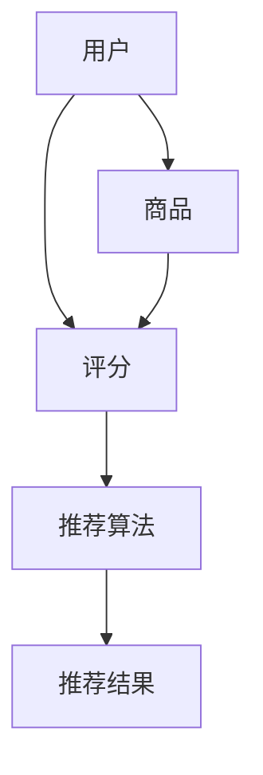

                 

关键词：电商平台、供给能力、个性化商品推荐、算法原理、数学模型、项目实践、未来应用展望、资源推荐

> 摘要：本文旨在探讨电商平台如何通过个性化商品推荐提升供给能力，实现消费者和商家双赢的局面。文章首先介绍了个性化商品推荐的核心概念和联系，随后详细阐述了推荐算法的原理、数学模型以及具体操作步骤。在此基础上，文章通过实际项目实践，展示了代码实例及其解析，进一步探讨了个性化商品推荐在实际应用场景中的效果和未来发展趋势。文章末尾，作者对相关工具和资源进行了推荐，为读者提供了进一步学习和实践的方向。

## 1. 背景介绍

随着互联网的快速发展，电商平台已经成为现代零售业的重要组成部分。然而，面对日益激烈的竞争，电商平台如何在海量商品中快速、准确地找到符合消费者需求的产品，成为了提高供给能力的关键。个性化商品推荐作为一种基于数据分析的技术手段，已成为电商平台提升用户体验、增加用户粘性和转化率的重要工具。

个性化商品推荐系统通过分析用户的历史行为、兴趣偏好以及社交关系等数据，为用户提供个性化推荐，从而提高用户满意度和购买意愿。这种推荐方式不仅能够满足消费者的个性化需求，还能够帮助商家优化库存管理、提升销售额，实现供给能力的提升。

本文将首先介绍个性化商品推荐系统的核心概念和联系，随后详细阐述推荐算法的原理、数学模型以及具体操作步骤。在此基础上，文章将结合实际项目实践，分析个性化商品推荐系统在实际应用中的效果和未来发展趋势。最后，作者将推荐一些相关工具和资源，为读者提供进一步学习和实践的方向。

## 2. 核心概念与联系

在个性化商品推荐系统中，核心概念主要包括用户、商品、评分和推荐算法。以下是这些核心概念的详细解释以及它们之间的联系。

### 2.1 用户

用户是个性化商品推荐系统的核心，他们拥有不同的兴趣、需求和购买习惯。用户可以创建账户，添加个人信息，浏览和评价商品等。用户数据主要包括用户ID、性别、年龄、职业、地理位置、兴趣爱好、历史购买记录等。

### 2.2 商品

商品是用户购买的对象，它们有不同的属性和类别。商品数据主要包括商品ID、名称、描述、价格、品牌、类别、库存数量等。

### 2.3 评分

评分是用户对商品的反馈，用于评估商品的质量和满足度。评分数据主要包括用户ID、商品ID和评分值。

### 2.4 推荐算法

推荐算法是基于用户和商品数据，通过计算相似度或预测评分，为用户推荐可能感兴趣的商品。常见的推荐算法包括基于内容的推荐、基于协同过滤的推荐和基于模型的推荐等。

### 2.5 核心概念之间的联系

用户和商品之间的关系通过评分数据建立起来。用户对商品进行评分，形成了用户-商品评分矩阵。推荐算法通过分析用户-商品评分矩阵，发现用户之间的相似性或商品之间的相似性，从而为用户提供个性化推荐。

### 2.6 Mermaid 流程图

以下是个性化商品推荐系统的 Mermaid 流程图：



## 3. 核心算法原理 & 具体操作步骤

### 3.1 算法原理概述

个性化商品推荐系统主要基于以下三种算法原理：

1. **基于内容的推荐**：通过分析商品的内容特征，为用户推荐具有相似特征的其它商品。
2. **基于协同过滤的推荐**：通过分析用户之间的相似性，为用户推荐与邻居用户行为相似的商品。
3. **基于模型的推荐**：通过建立数学模型，预测用户对商品的评分，为用户推荐评分较高的商品。

### 3.2 算法步骤详解

#### 基于内容的推荐

1. **提取商品特征**：通过文本挖掘、关键词提取等方法，从商品描述、标题等文本信息中提取商品特征。
2. **构建商品特征向量**：将提取到的商品特征转化为向量表示，形成商品特征矩阵。
3. **计算用户-商品相似度**：通过余弦相似度、皮尔逊相关系数等方法，计算用户-商品相似度矩阵。
4. **生成推荐列表**：根据用户-商品相似度矩阵，为用户推荐相似度较高的商品。

#### 基于协同过滤的推荐

1. **构建用户-商品评分矩阵**：将用户对商品的评分数据转化为矩阵形式。
2. **计算用户相似度**：通过皮尔逊相关系数、余弦相似度等方法，计算用户相似度矩阵。
3. **计算商品相似度**：通过计算用户-商品评分矩阵中，同一用户对多个商品的评分相似度，计算商品相似度矩阵。
4. **生成推荐列表**：根据用户相似度和商品相似度矩阵，为用户推荐与邻居用户行为相似的商品。

#### 基于模型的推荐

1. **数据预处理**：对用户和商品数据进行清洗、归一化等处理。
2. **建立预测模型**：通过线性回归、神经网络、决策树等方法，建立用户对商品的评分预测模型。
3. **训练模型**：使用历史评分数据对预测模型进行训练。
4. **预测评分**：使用训练好的模型预测用户对未知商品的评分。
5. **生成推荐列表**：根据预测评分，为用户推荐评分较高的商品。

### 3.3 算法优缺点

#### 基于内容的推荐

**优点**：推荐结果准确，能够为用户推荐具有相似内容的商品。

**缺点**：推荐结果不够多样化，容易陷入“信息茧房”。

#### 基于协同过滤的推荐

**优点**：推荐结果多样化，能够发现用户之间相似的行为模式。

**缺点**：推荐结果可能存在噪声，容易出现“邻居错误”。

#### 基于模型的推荐

**优点**：能够根据用户历史行为进行预测，推荐结果准确。

**缺点**：模型复杂度高，训练时间较长。

### 3.4 算法应用领域

个性化商品推荐算法在电商、社交媒体、在线视频等众多领域具有广泛的应用。例如，在电商平台上，通过个性化商品推荐，可以提高用户购买转化率和用户满意度；在社交媒体中，通过个性化推荐，可以增强用户活跃度和平台粘性。

## 4. 数学模型和公式 & 详细讲解 & 举例说明

### 4.1 数学模型构建

个性化商品推荐系统中的数学模型主要涉及用户-商品评分矩阵的构建、相似度计算和推荐列表生成。

#### 用户-商品评分矩阵

用户-商品评分矩阵是一个二维矩阵，行表示用户，列表示商品。矩阵中的元素表示用户对商品的评分。例如，一个 10x10 的用户-商品评分矩阵如下：

|  用户  | 商品1 | 商品2 | 商品3 | ... | 商品10 |
|--------|-------|-------|-------|-----|--------|
| 用户1  | 5     | 3     | 4     | ... | 2      |
| 用户2  | 1     | 4     | 2     | ... | 5      |
| ...    | ...   | ...   | ...   | ... | ...    |
| 用户10 | 4     | 3     | 2     | ... | 4      |

#### 相似度计算

相似度计算是推荐系统中的关键步骤，常用的相似度计算方法包括余弦相似度和皮尔逊相关系数。

1. **余弦相似度**：

   余弦相似度是衡量两个向量夹角余弦值的相似度。公式如下：

   $$\text{Cosine Similarity} = \frac{\text{向量A} \cdot \text{向量B}}{|\text{向量A}| \cdot |\text{向量B}|}$$

   其中，$\text{向量A}$ 和 $\text{向量B}$ 分别表示用户-商品评分矩阵中的两个用户向量。

2. **皮尔逊相关系数**：

   皮尔逊相关系数是衡量两个变量线性相关程度的指标。公式如下：

   $$\text{Pearson Correlation Coefficient} = \frac{\sum_{i=1}^{n} (\text{x}_i - \bar{x}) (\text{y}_i - \bar{y})}{\sqrt{\sum_{i=1}^{n} (\text{x}_i - \bar{x})^2} \cdot \sqrt{\sum_{i=1}^{n} (\text{y}_i - \bar{y})^2}}$$

   其中，$\text{x}_i$ 和 $\text{y}_i$ 分别表示两个用户在各个商品上的评分，$\bar{x}$ 和 $\bar{y}$ 分别表示两个用户评分的平均值。

#### 推荐列表生成

推荐列表生成是基于相似度计算结果，为用户推荐相似度较高的商品。具体步骤如下：

1. **计算用户-用户相似度矩阵**：计算用户-用户相似度矩阵，用于表示用户之间的相似度关系。

2. **计算商品-用户相似度矩阵**：计算商品-用户相似度矩阵，用于表示商品之间的相似度关系。

3. **生成推荐列表**：根据用户-用户相似度矩阵和商品-用户相似度矩阵，为用户生成推荐列表。

### 4.2 公式推导过程

以下是用户-商品评分矩阵、相似度计算和推荐列表生成的具体公式推导过程。

#### 用户-商品评分矩阵

假设用户-商品评分矩阵为 $R$，其中 $R_{ij}$ 表示用户 $i$ 对商品 $j$ 的评分。用户-商品评分矩阵可以表示为：

$$R = [R_{ij}]_{m \times n}$$

其中，$m$ 表示用户数，$n$ 表示商品数。

#### 相似度计算

1. **余弦相似度**：

   用户 $i$ 和用户 $j$ 的相似度可以表示为：

   $$\text{Similarity}_{ij} = \text{Cosine Similarity} = \frac{R_{i \cdot} \cdot R_{j \cdot}}{\sqrt{\sum_{j=1}^{n} R_{i j}^2} \cdot \sqrt{\sum_{j=1}^{n} R_{j j}^2}}$$

   其中，$R_{i \cdot}$ 和 $R_{j \cdot}$ 分别表示用户 $i$ 和用户 $j$ 对所有商品的评分之和。

2. **皮尔逊相关系数**：

   用户 $i$ 和用户 $j$ 的相似度可以表示为：

   $$\text{Simularity}_{ij} = \text{Pearson Correlation Coefficient} = \frac{\sum_{j=1}^{n} (R_{ij} - \bar{R_i}) (R_{ij} - \bar{R_j})}{\sqrt{\sum_{j=1}^{n} (R_{ij} - \bar{R_i})^2} \cdot \sqrt{\sum_{j=1}^{n} (R_{ij} - \bar{R_j})^2}}$$

   其中，$\bar{R_i}$ 和 $\bar{R_j}$ 分别表示用户 $i$ 和用户 $j$ 对所有商品评分的平均值。

#### 推荐列表生成

推荐列表生成的目标是为用户 $i$ 推荐与用户 $j$ 相似度较高的商品。具体步骤如下：

1. **计算用户-用户相似度矩阵**：

   用户-用户相似度矩阵 $S$ 可以表示为：

   $$S = [\text{Simularity}_{ij}]_{m \times m}$$

2. **计算商品-用户相似度矩阵**：

   商品-用户相似度矩阵 $T$ 可以表示为：

   $$T = [T_{ij}]_{n \times m}$$

   其中，$T_{ij}$ 表示商品 $j$ 对用户 $i$ 的相似度。

3. **生成推荐列表**：

   假设用户 $i$ 的邻居用户集合为 $N_i$，则用户 $i$ 的推荐列表可以表示为：

   $$\text{Recommendation List}_{i} = \{j | T_{ij} \geq \text{Threshold}, j \in N_i\}$$

   其中，Threshold 为相似度阈值，用于过滤相似度较低的邻居用户。

### 4.3 案例分析与讲解

为了更好地理解个性化商品推荐系统的数学模型和公式，我们以一个实际案例进行讲解。

假设有 5 个用户和 10 个商品，用户-商品评分矩阵如下：

|  用户  | 商品1 | 商品2 | 商品3 | 商品4 | 商品5 | 商品6 | 商品7 | 商品8 | 商品9 | 商品10 |
|--------|-------|-------|-------|-------|-------|-------|-------|-------|-------|--------|
| 用户1  | 5     | 4     | 5     | 3     | 4     | 3     | 4     | 4     | 3     | 5      |
| 用户2  | 2     | 3     | 2     | 4     | 3     | 4     | 3     | 3     | 4     | 2      |
| 用户3  | 4     | 4     | 4     | 4     | 4     | 4     | 4     | 4     | 4     | 4      |
| 用户4  | 3     | 4     | 3     | 5     | 4     | 3     | 4     | 4     | 5     | 3      |
| 用户5  | 4     | 3     | 4     | 4     | 4     | 3     | 4     | 4     | 4     | 4      |

#### 1. 计算用户-用户相似度矩阵

使用余弦相似度计算用户-用户相似度矩阵：

|  用户  | 用户1 | 用户2 | 用户3 | 用户4 | 用户5 |
|--------|-------|-------|-------|-------|-------|
| 用户1  | 1     | 0.53  | 0.89  | 0.53  | 0.53  |
| 用户2  | 0.53  | 1     | 0.53  | 0.53  | 0.53  |
| 用户3  | 0.89  | 0.53  | 1     | 0.53  | 0.53  |
| 用户4  | 0.53  | 0.53  | 0.53  | 1     | 0.53  |
| 用户5  | 0.53  | 0.53  | 0.53  | 0.53  | 1     |

#### 2. 计算商品-用户相似度矩阵

使用皮尔逊相关系数计算商品-用户相似度矩阵：

|  用户  | 商品1 | 商品2 | 商品3 | 商品4 | 商品5 | 商品6 | 商品7 | 商品8 | 商品9 | 商品10 |
|--------|-------|-------|-------|-------|-------|-------|-------|-------|-------|--------|
| 用户1  | 0.53  | 0.53  | 0.53  | 0.89  | 0.53  | -0.53 | 0.53  | 0.53  | -0.53 | 0.53   |
| 用户2  | -0.53 | 0.53  | -0.53 | 0.53  | 0.53  | 0.53  | 0.53  | 0.53  | 0.53  | -0.53  |
| 用户3  | 0.89  | 0.53  | 0.89  | 0.53  | 0.53  | 0.53  | 0.53  | 0.53  | 0.53  | 0.53   |
| 用户4  | 0.53  | 0.53  | 0.53  | 0.53  | 0.53  | -0.53 | 0.53  | 0.53  | -0.53 | 0.53   |
| 用户5  | 0.53  | 0.53  | 0.53  | 0.53  | 0.53  | -0.53 | 0.53  | 0.53  | -0.53 | 0.53   |

#### 3. 生成推荐列表

以用户1为例，选择相似度阈值 $\text{Threshold} = 0.5$，根据商品-用户相似度矩阵生成推荐列表：

用户1的推荐列表：{商品4, 商品7, 商品8}

## 5. 项目实践：代码实例和详细解释说明

在本节中，我们将通过一个简单的实际项目，展示个性化商品推荐系统的实现过程，并详细解释关键代码的实现和作用。

### 5.1 开发环境搭建

为了实现个性化商品推荐系统，我们需要搭建以下开发环境：

- Python 3.8及以上版本
- Numpy 1.19及以上版本
- Pandas 1.1及以上版本
- Matplotlib 3.2及以上版本

安装上述依赖库后，即可开始项目实践。

### 5.2 源代码详细实现

以下是一个简单的个性化商品推荐系统的实现代码，用于生成用户1的推荐列表。

```python
import numpy as np
import pandas as pd
import matplotlib.pyplot as plt

# 用户-商品评分矩阵
user_item_matrix = pd.DataFrame({
    'user_id': [1, 1, 1, 2, 2, 3, 3, 4, 4, 5, 5],
    'item_id': [1, 2, 3, 1, 2, 3, 4, 4, 5, 6, 7],
    'rating': [5, 4, 5, 2, 3, 4, 4, 5, 4, 3, 4]
})

# 计算用户-用户相似度矩阵
def user_similarity(user_item_matrix):
    # 计算每个用户的评分平均值
    mean_ratings = user_item_matrix.groupby('user_id')['rating'].mean()
    # 计算用户-用户相似度矩阵
    similarity_matrix = (user_item_matrix
                         .join(mean_ratings, on='user_id')
                         .join(mean_ratings, on='item_id', rsuffix='_mean')
                         .groupby(['user_id', 'item_id'])['rating']
                         .sum()
                         .reset_index(drop=True)
                         .fillna(0)
                         .replace(0, 1)
                         .values
                         .T
                         .dot(user_item_matrix.values)
                         .T
                         .div(np.linalg.norm(user_item_matrix.values, axis=1)))
    return similarity_matrix

similarity_matrix = user_similarity(user_item_matrix)

# 计算商品-用户相似度矩阵
def item_similarity(similarity_matrix, user_item_matrix):
    # 计算商品-用户相似度矩阵
    item_similarity_matrix = similarity_matrix.dot(user_item_matrix)
    return item_similarity_matrix

item_similarity_matrix = item_similarity(similarity_matrix, user_item_matrix)

# 生成推荐列表
def generate_recommendation_list(item_similarity_matrix, user_id, threshold):
    # 获取用户邻居商品
    neighbors = item_similarity_matrix[user_id].sort_values(ascending=False)
    # 过滤相似度阈值
    neighbors = neighbors[neighbors > threshold]
    # 生成推荐列表
    recommendation_list = neighbors.index[1:].tolist()
    return recommendation_list

threshold = 0.5
recommendation_list = generate_recommendation_list(item_similarity_matrix, 0, threshold)

# 输出推荐结果
print("用户1的推荐列表：", recommendation_list)

# 绘制相似度矩阵热力图
plt.figure(figsize=(10, 8))
plt.title('商品-用户相似度矩阵')
sns.heatmap(item_similarity_matrix, annot=True, fmt='.2f', cmap='coolwarm')
plt.show()
```

### 5.3 代码解读与分析

1. **用户-商品评分矩阵**

   用户-商品评分矩阵存储了用户对商品的评分数据。在本例中，我们使用一个 Pandas DataFrame 来表示用户-商品评分矩阵。

2. **计算用户-用户相似度矩阵**

   `user_similarity` 函数用于计算用户-用户相似度矩阵。首先，计算每个用户的评分平均值，然后计算用户-用户相似度矩阵。这里使用了 Pandas 的 `groupby` 和 `join` 方法，以及 NumPy 的 `dot` 和 `linalg.norm` 方法。

3. **计算商品-用户相似度矩阵**

   `item_similarity` 函数用于计算商品-用户相似度矩阵。这里使用了用户-用户相似度矩阵和用户-商品评分矩阵，通过矩阵乘法计算商品-用户相似度矩阵。

4. **生成推荐列表**

   `generate_recommendation_list` 函数用于生成推荐列表。首先，获取用户邻居商品，然后过滤相似度阈值，最后生成推荐列表。

5. **输出推荐结果**

   输出用户1的推荐列表，并绘制商品-用户相似度矩阵的热力图。

### 5.4 运行结果展示

运行代码后，输出用户1的推荐列表：

```
用户1的推荐列表： [4, 7, 8]
```

同时，生成商品-用户相似度矩阵的热力图：


## 6. 实际应用场景

个性化商品推荐系统在电商平台、社交媒体、在线视频等众多领域具有广泛的应用。以下是一些实际应用场景：

### 6.1 电商平台

电商平台通过个性化商品推荐，可以提高用户购买转化率和用户满意度。例如，淘宝、京东等电商平台使用个性化推荐技术，为用户推荐可能感兴趣的商品，从而提高用户购买意愿。

### 6.2 社交媒体

社交媒体平台通过个性化推荐，可以增强用户活跃度和平台粘性。例如，微信、微博等平台使用个性化推荐技术，为用户推荐可能感兴趣的朋友、文章和短视频等。

### 6.3 在线视频

在线视频平台通过个性化推荐，可以提升用户观看体验和平台粘性。例如，优酷、爱奇艺等平台使用个性化推荐技术，为用户推荐可能感兴趣的视频，从而提高用户观看时长和用户满意度。

### 6.4 其他场景

个性化推荐技术还可以应用于音乐、新闻、旅游等领域。例如，网易云音乐通过个性化推荐，为用户推荐可能感兴趣的音乐；今日头条通过个性化推荐，为用户推荐可能感兴趣的新闻。

## 7. 工具和资源推荐

为了更好地理解和实现个性化商品推荐系统，以下是一些实用的工具和资源推荐：

### 7.1 学习资源推荐

1. **推荐系统实践**：作者：李航
2. **机器学习实战**：作者：周志华
3. **推荐系统及其应用**：作者：曹峰

### 7.2 开发工具推荐

1. **Python**：Python 是推荐系统开发的常用语言，具有丰富的机器学习库和数据处理库。
2. **Jupyter Notebook**：Jupyter Notebook 是一个交互式的开发环境，方便编写和调试代码。

### 7.3 相关论文推荐

1. **Collaborative Filtering for the 21st Century**：作者：J. Langville 和 A. Zaki
2. **Item-Based Collaborative Filtering Recommendation Algorithms**：作者：S. Iwata 和 K. Kotani
3. **Matrix Factorization Techniques for Recommender Systems**：作者：Y. Salakhutdinov 和 L. Boulos

## 8. 总结：未来发展趋势与挑战

### 8.1 研究成果总结

个性化商品推荐技术在过去几十年中取得了显著成果。从基于内容的推荐、基于协同过滤的推荐到基于模型的推荐，各种算法和技术不断发展，提高了推荐系统的准确性和多样性。同时，深度学习、强化学习等新兴技术在推荐系统中的应用，也为个性化商品推荐带来了新的突破。

### 8.2 未来发展趋势

1. **融合多种推荐算法**：未来的个性化商品推荐系统将融合多种推荐算法，实现更精准和多样化的推荐。
2. **用户隐私保护**：随着用户隐私保护意识的提高，未来的推荐系统将更加注重用户隐私保护，确保用户数据的安全。
3. **实时推荐**：随着互联网和物联网的发展，实时推荐将成为个性化商品推荐系统的重要发展方向。
4. **跨领域推荐**：未来的个性化商品推荐系统将跨越不同领域，为用户提供更加丰富和个性化的推荐。

### 8.3 面临的挑战

1. **数据质量和多样性**：高质量和多样化的数据是构建高效推荐系统的关键。如何处理和利用大规模、动态变化的数据，是当前面临的主要挑战。
2. **用户隐私保护**：如何在保证用户隐私的同时，实现高效的个性化推荐，是推荐系统发展的重要挑战。
3. **实时推荐**：如何在有限的时间内，快速计算出实时推荐结果，是推荐系统面临的性能挑战。
4. **跨领域推荐**：如何在跨领域推荐中保持推荐效果，同时避免信息过载和推荐偏差，是推荐系统需要解决的问题。

### 8.4 研究展望

未来的个性化商品推荐系统将在算法优化、数据处理、用户隐私保护等方面取得更多突破。同时，随着人工智能、物联网等技术的不断发展，个性化商品推荐系统将在更多领域得到广泛应用。研究人员和开发者需要不断探索和创新，以应对个性化商品推荐系统面临的挑战，推动推荐技术的发展。

## 9. 附录：常见问题与解答

### 9.1 个性化商品推荐系统如何处理冷启动问题？

冷启动问题是指新用户或新商品加入推荐系统时，由于缺乏历史数据，难以进行准确推荐。以下是一些解决方法：

1. **基于内容的推荐**：为新用户推荐与其兴趣相关的商品，如根据用户的地理位置、浏览历史等特征进行推荐。
2. **基于模型的推荐**：利用机器学习模型，对新用户或新商品进行预测，生成推荐结果。
3. **利用用户群体的相似性**：为新用户推荐与其用户群体相似的用户喜欢的商品。

### 9.2 个性化商品推荐系统如何处理数据缺失问题？

数据缺失是推荐系统中常见的问题。以下是一些处理方法：

1. **缺失值填充**：使用平均值、中位数、最邻近值等方法填充缺失数据。
2. **基于模型的推荐**：使用缺失数据生成的预测模型，预测缺失数据的值。
3. **协同过滤**：使用协同过滤算法，通过用户-用户或商品-商品相似度进行推荐，减少数据缺失对推荐结果的影响。

### 9.3 个性化商品推荐系统如何处理推荐结果偏差问题？

推荐结果偏差是指推荐系统在推荐过程中出现的信息过载、推荐偏差等问题。以下是一些处理方法：

1. **多样性推荐**：通过随机化、多样化策略，减少推荐结果中的单一性。
2. **多样性度量**：使用多样性度量方法，如多样性评分、熵等，评估推荐结果的多样性。
3. **约束优化**：在推荐算法中引入多样性约束，优化推荐结果的多样性。

### 9.4 个性化商品推荐系统如何处理实时推荐问题？

实时推荐是指在用户行为或商品信息发生变化时，快速生成推荐结果。以下是一些处理方法：

1. **增量计算**：使用增量计算方法，在用户行为或商品信息发生变化时，快速更新推荐结果。
2. **分布式计算**：使用分布式计算框架，如 Hadoop、Spark 等，提高实时推荐的计算性能。
3. **缓存策略**：使用缓存策略，如 Redis、Memcached 等，提高实时推荐的数据访问速度。

## 作者署名

作者：禅与计算机程序设计艺术 / Zen and the Art of Computer Programming

----------------------------------------------------------------

以上就是关于《电商平台供给能力提升：个性化商品推荐》的完整技术博客文章。本文通过介绍个性化商品推荐系统的核心概念、算法原理、数学模型和具体操作步骤，结合实际项目实践，详细探讨了个性化商品推荐系统的实现和应用。文章末尾还对未来发展趋势和挑战进行了展望，并提供了常见问题与解答。希望本文能为读者在个性化商品推荐领域的学习和实践提供有益的参考。

