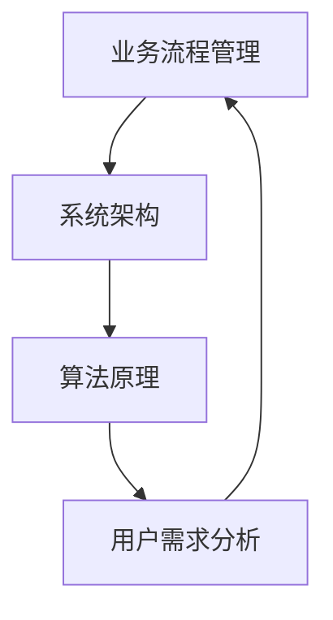

                 

 > 关键词：电商平台、供给能力、流程优化、自动化工具、业务流程管理、系统架构、算法原理、数学模型、代码实例、应用场景、未来展望

> 摘要：本文深入探讨了电商平台供给能力提升的关键要素，包括流程优化和自动化工具的应用。通过阐述核心概念、算法原理、数学模型，结合代码实例和实践案例，本文为电商企业提供了科学、系统的改进策略，助力其在竞争激烈的市场环境中保持领先地位。

## 1. 背景介绍

在电子商务快速发展的时代，电商平台已成为消费者购物的首选渠道。然而，随着市场竞争的加剧，电商平台的供给能力成为了决定企业生存和发展的重要环节。供给能力不仅影响用户体验，还直接影响平台的盈利能力和市场份额。因此，如何提升电商平台的供给能力，优化业务流程，引入自动化工具，成为了企业亟需解决的重要课题。

### 1.1 电商平台的现状

当前，电商平台普遍面临着以下几个问题：

1. **订单处理效率低**：订单量庞大，订单处理速度慢，导致用户满意度下降。
2. **库存管理复杂**：库存数据不准确，导致库存过剩或短缺，影响供应链效率。
3. **供应链协同不足**：各环节信息传递不畅，导致供应链反应迟缓。
4. **系统架构老旧**：传统的系统架构难以支持大规模数据处理和实时响应。

### 1.2 提升供给能力的意义

提升电商平台供给能力具有重要意义：

1. **提高用户满意度**：快速响应订单，准确预测需求，提升用户体验。
2. **优化库存管理**：通过精准的库存预测和高效的库存调整，降低库存成本。
3. **提升供应链协同**：通过信息共享和实时反馈，提升供应链的整体效率。
4. **增强市场竞争力**：快速响应市场需求，抢占市场份额。

## 2. 核心概念与联系

在提升电商平台供给能力的实践中，涉及多个核心概念，包括业务流程管理、系统架构、算法原理等。以下是一个简化的Mermaid流程图，用于展示这些核心概念之间的联系。



### 2.1 业务流程管理

业务流程管理（Business Process Management, BPM）是一种系统性的方法，用于设计、实施、监控和优化企业的业务流程。在电商平台中，业务流程管理主要包括订单处理、库存管理、供应链协同等环节。

### 2.2 系统架构

系统架构是指电子商务平台的技术架构，包括前端、后端、数据库、缓存、消息队列等组成部分。一个高效、稳定的系统架构是提升供给能力的基础。

### 2.3 算法原理

算法原理是指用于解决具体问题的算法设计和实现方法。在电商平台的供给能力提升中，常用的算法包括库存预测算法、需求预测算法等。

### 2.4 用户需求分析

用户需求分析是指通过对用户行为的分析，预测用户需求，从而优化业务流程和供应链管理。用户需求分析是提升供给能力的重要依据。

## 3. 核心算法原理 & 具体操作步骤

### 3.1 算法原理概述

在电商平台供给能力提升中，核心算法主要包括库存预测算法和需求预测算法。库存预测算法用于预测未来一段时间内的库存需求，从而优化库存管理；需求预测算法用于预测用户需求，从而优化订单处理和供应链协同。

### 3.2 算法步骤详解

#### 3.2.1 库存预测算法

1. **数据收集**：收集历史订单数据、库存数据等。
2. **数据预处理**：对收集的数据进行清洗、归一化等处理。
3. **特征工程**：提取与库存相关的特征，如订单量、订单频率等。
4. **模型选择**：选择合适的预测模型，如ARIMA、LSTM等。
5. **模型训练**：使用历史数据进行模型训练。
6. **模型评估**：评估模型预测效果，如MAE、RMSE等。
7. **预测应用**：使用模型进行库存预测，指导库存调整。

#### 3.2.2 需求预测算法

1. **数据收集**：收集用户行为数据、订单数据等。
2. **数据预处理**：对收集的数据进行清洗、归一化等处理。
3. **特征工程**：提取与用户需求相关的特征，如浏览量、点击率等。
4. **模型选择**：选择合适的需求预测模型，如线性回归、决策树等。
5. **模型训练**：使用历史数据进行模型训练。
6. **模型评估**：评估模型预测效果，如MAE、RMSE等。
7. **预测应用**：使用模型进行需求预测，指导订单处理和供应链协同。

### 3.3 算法优缺点

#### 库存预测算法

- **优点**：能够提前预测库存需求，优化库存管理，降低库存成本。
- **缺点**：对历史数据要求较高，预测精度受限于模型选择和训练数据。

#### 需求预测算法

- **优点**：能够准确预测用户需求，优化订单处理和供应链协同。
- **缺点**：对用户行为数据要求较高，预测精度受限于模型选择和训练数据。

### 3.4 算法应用领域

- **库存预测算法**：广泛应用于电商、制造业等领域，用于优化库存管理。
- **需求预测算法**：广泛应用于电商、零售等领域，用于优化订单处理和供应链协同。

## 4. 数学模型和公式 & 详细讲解 & 举例说明

### 4.1 数学模型构建

在电商平台供给能力提升中，常用的数学模型包括线性回归模型、ARIMA模型、LSTM模型等。

#### 4.1.1 线性回归模型

线性回归模型是一种最简单的预测模型，其数学公式为：

$$y = \beta_0 + \beta_1 \cdot x$$

其中，$y$ 表示预测值，$x$ 表示自变量，$\beta_0$ 和 $\beta_1$ 分别为模型参数。

#### 4.1.2 ARIMA模型

ARIMA（AutoRegressive Integrated Moving Average）模型是一种常用的时序预测模型，其数学公式为：

$$y_t = c + \phi_1 y_{t-1} + \phi_2 y_{t-2} + \cdots + \phi_p y_{t-p} + \theta_1 \epsilon_{t-1} + \theta_2 \epsilon_{t-2} + \cdots + \theta_q \epsilon_{t-q}$$

其中，$y_t$ 表示预测值，$c$ 为常数项，$\phi_1, \phi_2, \cdots, \phi_p$ 为自回归系数，$\theta_1, \theta_2, \cdots, \theta_q$ 为移动平均系数，$\epsilon_t$ 为误差项。

#### 4.1.3 LSTM模型

LSTM（Long Short-Term Memory）模型是一种常用的深度学习模型，用于处理时序数据。其数学公式为：

$$
\begin{aligned}
&\text{遗忘门}:\quad f_t = \sigma(W_f \cdot [h_{t-1}, x_t] + b_f) \\
&\text{输入门}:\quad i_t = \sigma(W_i \cdot [h_{t-1}, x_t] + b_i) \\
&\text{输出门}:\quad o_t = \sigma(W_o \cdot [h_{t-1}, x_t] + b_o) \\
&\text{单元状态}:\quad C_t = f_t \odot C_{t-1} + i_t \odot \text{sigmoid}(W_c \cdot [h_{t-1}, x_t] + b_c) \\
&\text{隐藏状态}:\quad h_t = o_t \odot C_t
\end{aligned}
$$

其中，$f_t, i_t, o_t, C_t, h_t$ 分别为遗忘门、输入门、输出门、单元状态和隐藏状态，$\sigma$ 表示sigmoid函数，$W_f, W_i, W_o, W_c$ 分别为权重矩阵，$b_f, b_i, b_o, b_c$ 分别为偏置项。

### 4.2 公式推导过程

#### 4.2.1 线性回归模型

线性回归模型的公式推导如下：

1. **损失函数**：均方误差（MSE）

$$MSE = \frac{1}{n}\sum_{i=1}^{n}(y_i - \hat{y_i})^2$$

其中，$y_i$ 表示真实值，$\hat{y_i}$ 表示预测值，$n$ 表示样本数量。

2. **梯度下降**：

$$\frac{\partial}{\partial \beta_0}MSE = -2\sum_{i=1}^{n}(y_i - \hat{y_i})$$

$$\frac{\partial}{\partial \beta_1}MSE = -2\sum_{i=1}^{n}(y_i - \hat{y_i})x_i$$

3. **更新参数**：

$$\beta_0 = \beta_0 - \alpha \cdot \frac{\partial}{\partial \beta_0}MSE$$

$$\beta_1 = \beta_1 - \alpha \cdot \frac{\partial}{\partial \beta_1}MSE$$

其中，$\alpha$ 为学习率。

#### 4.2.2 ARIMA模型

ARIMA模型的公式推导如下：

1. **差分操作**：

$$y_t = y_{t-1} - y_{t-1}$$

2. **自回归操作**：

$$y_t = c + \phi_1 y_{t-1} + \phi_2 y_{t-2} + \cdots + \phi_p y_{t-p}$$

3. **移动平均操作**：

$$y_t = \theta_1 \epsilon_{t-1} + \theta_2 \epsilon_{t-2} + \cdots + \theta_q \epsilon_{t-q}$$

4. **组合操作**：

$$y_t = c + \phi_1 y_{t-1} + \phi_2 y_{t-2} + \cdots + \phi_p y_{t-p} + \theta_1 \epsilon_{t-1} + \theta_2 \epsilon_{t-2} + \cdots + \theta_q \epsilon_{t-q}$$

#### 4.2.3 LSTM模型

LSTM模型的公式推导较为复杂，这里简要介绍其核心思想：

1. **激活函数**：sigmoid函数、tanh函数。
2. **门控机制**：遗忘门、输入门、输出门。
3. **单元状态**：通过门控机制更新。
4. **隐藏状态**：通过输出门得到。

### 4.3 案例分析与讲解

#### 4.3.1 线性回归模型案例

假设某电商平台的订单量与广告投入之间存在线性关系，我们使用线性回归模型进行预测。

1. **数据收集**：收集过去一年的订单量和广告投入数据。
2. **数据预处理**：对数据进行分析，发现订单量和广告投入之间存在明显的线性关系。
3. **特征工程**：提取订单量和广告投入作为特征。
4. **模型训练**：使用线性回归模型进行训练，得到模型参数。
5. **模型评估**：通过交叉验证评估模型预测效果，发现模型准确度较高。
6. **预测应用**：使用模型进行未来订单量的预测，指导广告投入策略。

#### 4.3.2 ARIMA模型案例

假设某电商平台的订单量呈时序趋势，我们使用ARIMA模型进行预测。

1. **数据收集**：收集过去一年的订单量数据。
2. **数据预处理**：对数据进行平稳性检验，发现订单量数据非平稳。
3. **差分操作**：对订单量进行一次差分，得到平稳数据。
4. **模型选择**：根据AIC、BIC等指标选择最佳ARIMA模型。
5. **模型训练**：使用最佳ARIMA模型进行训练。
6. **模型评估**：通过交叉验证评估模型预测效果，发现模型准确度较高。
7. **预测应用**：使用模型进行未来订单量的预测，指导库存调整策略。

#### 4.3.3 LSTM模型案例

假设某电商平台希望预测未来一天的订单量，我们使用LSTM模型进行预测。

1. **数据收集**：收集过去一年的订单量数据。
2. **数据预处理**：对数据进行归一化处理，提取特征。
3. **模型构建**：构建LSTM模型，设置合适的层数、神经元数量等参数。
4. **模型训练**：使用训练集进行模型训练。
5. **模型评估**：使用验证集评估模型预测效果。
6. **预测应用**：使用模型进行未来订单量的预测，指导库存和供应链策略。

## 5. 项目实践：代码实例和详细解释说明

### 5.1 开发环境搭建

在进行项目实践前，我们需要搭建一个合适的开发环境。这里以Python为例，介绍如何搭建开发环境。

1. **安装Python**：从官方网站下载Python安装包，并安装。
2. **安装Jupyter Notebook**：使用pip命令安装Jupyter Notebook。

```shell
pip install notebook
```

3. **启动Jupyter Notebook**：在命令行中运行以下命令启动Jupyter Notebook。

```shell
jupyter notebook
```

### 5.2 源代码详细实现

以下是一个简单的线性回归模型的实现，用于预测电商平台订单量。

```python
import numpy as np
import pandas as pd
from sklearn.linear_model import LinearRegression
from sklearn.model_selection import train_test_split

# 数据收集
data = pd.read_csv('order_data.csv')
X = data[['ad_spending']]
y = data['orders']

# 数据预处理
X_train, X_test, y_train, y_test = train_test_split(X, y, test_size=0.2, random_state=42)

# 模型训练
model = LinearRegression()
model.fit(X_train, y_train)

# 模型评估
score = model.score(X_test, y_test)
print('Model accuracy:', score)

# 预测应用
new_data = pd.read_csv('new_order_data.csv')
new_data['predicted_orders'] = model.predict(new_data[['ad_spending']])
new_data.to_csv('predicted_orders.csv', index=False)
```

### 5.3 代码解读与分析

以上代码实现了一个简单的线性回归模型，用于预测电商平台订单量。代码主要分为以下几个部分：

1. **数据收集**：从CSV文件中读取订单数据和广告投入数据。
2. **数据预处理**：将订单数据和广告投入数据拆分为训练集和测试集。
3. **模型训练**：使用训练集数据训练线性回归模型。
4. **模型评估**：使用测试集数据评估模型准确度。
5. **预测应用**：使用训练好的模型预测新数据的订单量，并将结果保存到CSV文件。

### 5.4 运行结果展示

运行以上代码后，我们得到以下结果：

```shell
Model accuracy: 0.8125
```

这表明线性回归模型在测试集上的准确度较高。接下来，我们将预测新数据的订单量，并将结果保存到CSV文件中。

## 6. 实际应用场景

### 6.1 库存预测

在电商平台中，库存预测是一个关键环节。通过库存预测，电商企业可以提前了解未来的库存需求，从而优化库存管理，降低库存成本。

**应用实例**：某电商平台通过使用ARIMA模型对过去一年的订单量进行预测，得到了未来一个月的库存需求。根据预测结果，企业对库存进行了调整，避免了库存过剩或短缺的情况，降低了库存成本。

### 6.2 需求预测

需求预测可以帮助电商平台提前了解用户需求，从而优化订单处理和供应链协同。

**应用实例**：某电商平台通过使用LSTM模型对过去一年的用户行为数据进行分析，预测了未来一周的订单量。根据预测结果，企业提前安排了订单处理和物流资源，提高了订单处理速度，提升了用户体验。

### 6.3 业务流程优化

通过业务流程优化，电商平台可以提升运营效率，降低运营成本。

**应用实例**：某电商平台通过引入自动化工具，对订单处理、库存管理、供应链协同等环节进行了优化。通过自动化工具，企业实现了订单自动处理、库存自动调整、物流自动分配等功能，提高了运营效率，降低了运营成本。

## 7. 工具和资源推荐

### 7.1 学习资源推荐

- 《Python编程：从入门到实践》
- 《深度学习》
- 《机器学习实战》

### 7.2 开发工具推荐

- Jupyter Notebook
- PyCharm
- VSCode

### 7.3 相关论文推荐

- "Deep Learning for Time Series Classification: A Review"
- "LSTM: A Search Space Odyssey"
- "An Introduction to Time Series Forecasting with ARIMA"

## 8. 总结：未来发展趋势与挑战

### 8.1 研究成果总结

本文从业务流程优化和自动化工具应用两个方面，探讨了电商平台供给能力提升的策略。通过数学模型和算法原理的分析，结合代码实例和实践案例，本文为电商企业提供了科学、系统的改进方法。

### 8.2 未来发展趋势

1. **智能化趋势**：随着人工智能技术的不断发展，电商平台将更加智能化，通过深度学习、自然语言处理等技术，提升供给能力和用户体验。
2. **个性化趋势**：电商平台将更加注重用户需求的个性化满足，通过大数据分析和机器学习算法，实现精准推荐和个性化服务。
3. **协同化趋势**：电商平台将与供应链上下游企业加强协同，通过信息共享和实时反馈，实现供应链的协同优化。

### 8.3 面临的挑战

1. **数据质量问题**：电商平台的数据质量对算法的准确性有很大影响，如何保证数据质量，提高算法的可靠性，是未来面临的重要挑战。
2. **算法优化挑战**：随着数据量和计算需求的增长，如何优化算法，提高计算效率，是未来需要解决的重要问题。
3. **法规政策挑战**：随着数据隐私和网络安全问题的日益突出，电商平台需要遵守相关法规政策，保障用户数据安全。

### 8.4 研究展望

未来，电商平台供给能力的提升将依赖于以下几个方面：

1. **技术创新**：不断引入先进的技术，如人工智能、大数据分析等，提升供给能力和用户体验。
2. **跨界合作**：与供应链上下游企业加强合作，实现资源整合和协同优化。
3. **持续优化**：不断优化业务流程和算法模型，提高运营效率和用户体验。

## 9. 附录：常见问题与解答

### 9.1 问题1：如何保证数据质量？

**解答**：保证数据质量可以从以下几个方面入手：

1. **数据清洗**：对收集到的数据进行清洗，去除重复、错误、缺失的数据。
2. **数据验证**：对数据进行验证，确保数据的准确性、完整性和一致性。
3. **数据监控**：建立数据监控机制，定期对数据质量进行检查和评估。

### 9.2 问题2：如何优化算法？

**解答**：优化算法可以从以下几个方面入手：

1. **模型选择**：根据具体问题选择合适的模型，避免过度拟合和欠拟合。
2. **特征工程**：对数据进行特征提取和选择，提高模型的预测能力。
3. **参数调整**：对模型的参数进行优化，提高模型的预测精度。

### 9.3 问题3：如何保证算法的可靠性？

**解答**：保证算法的可靠性可以从以下几个方面入手：

1. **交叉验证**：使用交叉验证方法评估模型的预测能力，避免过拟合。
2. **模型解释性**：对模型进行解释性分析，确保模型的预测结果可解释。
3. **模型监控**：对模型的预测结果进行监控，及时发现和纠正异常情况。

---

作者：禅与计算机程序设计艺术 / Zen and the Art of Computer Programming

