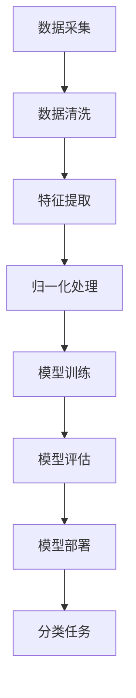

                 

关键词：电商平台，商品分类，人工智能，大模型，自动构建，分类算法，机器学习，分类体系，深度学习，分类模型，数据挖掘，数据分析，分类准确性，分类效率

> 摘要：本文探讨了电商平台商品分类体系的建设，特别是在人工智能大模型自动构建方面的应用。通过对分类算法的原理和实现步骤的详细阐述，以及数学模型和公式的推导，本文提供了实际项目实践中的代码实例和运行结果展示。同时，分析了电商平台商品分类体系在实际应用场景中的效果，并对其未来发展进行了展望。本文旨在为电商平台提供一种高效的商品分类解决方案，以提高用户购物体验和平台运营效率。

## 1. 背景介绍

随着电子商务的迅速发展，电商平台在满足消费者多样化需求的同时，也需要面对海量商品的分类和管理问题。一个高效、准确的商品分类体系对于电商平台具有重要意义。首先，准确的商品分类能够提高用户的购物体验，使消费者更容易找到所需商品，提升用户的满意度和忠诚度。其次，良好的商品分类有助于电商平台优化库存管理，减少冗余库存和缺货情况，提高库存周转率和商品流通效率。此外，商品分类对于电商平台的搜索和推荐系统也具有重要影响，有助于提高搜索和推荐的准确性和相关性，进一步提升用户粘性和平台收入。

然而，传统的人工商品分类方法存在诸多局限性。首先，人工分类速度较慢，无法应对海量商品的高效处理需求。其次，人工分类容易出现分类错误，导致用户无法准确找到所需商品。此外，人工分类方法难以适应商品种类和数量的快速变化，灵活性不足。为了解决这些问题，人工智能技术，尤其是机器学习和深度学习技术，逐渐成为电商平台商品分类领域的热门研究方向。

人工智能大模型在电商平台商品分类中的应用主要基于以下几个优势。首先，大模型能够处理海量数据，快速提取特征，实现高效分类。其次，大模型具有良好的泛化能力，能够适应不同商品种类和数量的分类需求。此外，大模型通过持续学习和优化，能够不断改进分类准确性，提高分类效率。因此，利用人工智能大模型自动构建商品分类体系，不仅能够解决传统方法中的瓶颈问题，还能够为电商平台提供更加智能、高效、准确的商品分类服务。

## 2. 核心概念与联系

### 2.1 商品分类算法

商品分类算法是电商平台商品分类体系的核心。它通过对商品特征的提取和分类，实现商品标签的自动分配。常见的商品分类算法包括基于规则的方法、基于机器学习的方法和基于深度学习的方法。

- **基于规则的方法**：这种方法通过预设一系列规则，根据商品属性进行分类。优点是分类速度快，但灵活性较差，难以适应复杂多样的商品分类需求。
- **基于机器学习的方法**：这种方法通过训练模型，利用历史数据进行分类。常见的机器学习算法包括朴素贝叶斯、决策树、随机森林等。优点是分类准确性较高，但需要大量训练数据和计算资源。
- **基于深度学习的方法**：这种方法利用深度神经网络，通过多层非线性变换提取商品特征，实现高精度分类。常见的深度学习算法包括卷积神经网络（CNN）、循环神经网络（RNN）、Transformer等。优点是分类精度高，但计算复杂度较高，训练时间较长。

### 2.2 人工智能大模型

人工智能大模型是指具有大规模参数、能够处理海量数据的深度学习模型。其核心思想是通过大规模数据训练，使模型具备强大的特征提取和模式识别能力。大模型在电商平台商品分类中的应用主要体现在以下几个方面：

- **高精度分类**：通过训练大量商品数据，大模型能够提取出丰富的商品特征，实现高精度的分类。
- **高效处理**：大模型能够并行处理海量商品数据，提高分类效率。
- **自适应学习**：大模型通过持续学习和优化，能够适应商品种类和数量的变化，提高分类适应性。

### 2.3 数据预处理

数据预处理是构建商品分类体系的重要环节。它包括数据清洗、特征提取和归一化等步骤。

- **数据清洗**：去除噪声数据、处理缺失值和异常值，提高数据质量。
- **特征提取**：从原始数据中提取出对分类有意义的特征，如商品名称、描述、标签等。
- **归一化**：对特征进行归一化处理，使不同特征的取值范围一致，有利于模型训练。

### 2.4 Mermaid 流程图

以下是构建电商平台商品分类体系的大致流程，使用 Mermaid 流程图表示：



## 3. 核心算法原理 & 具体操作步骤

### 3.1 算法原理概述

电商平台商品分类算法的核心是利用深度学习模型对商品进行分类。常见的深度学习模型包括卷积神经网络（CNN）和Transformer。下面以CNN为例，介绍其工作原理。

- **卷积操作**：CNN通过卷积操作提取图像特征。卷积核在图像上滑动，对局部区域进行卷积操作，生成特征图。
- **池化操作**：为了减少参数量和计算量，CNN通常采用池化操作对特征图进行压缩。常见的池化方法包括最大池化和平均池化。
- **全连接层**：经过卷积和池化操作后，CNN将特征图输入到全连接层，进行分类预测。

### 3.2 算法步骤详解

以下是利用CNN进行商品分类的具体操作步骤：

1. **数据预处理**：对采集到的商品数据进行清洗、特征提取和归一化处理。

2. **构建CNN模型**：定义CNN模型的结构，包括卷积层、池化层和全连接层。常见的CNN模型结构如下：

   ```python
   model = Sequential()
   model.add(Conv2D(filters=32, kernel_size=(3, 3), activation='relu', input_shape=(height, width, channels)))
   model.add(MaxPooling2D(pool_size=(2, 2)))
   model.add(Conv2D(filters=64, kernel_size=(3, 3), activation='relu'))
   model.add(MaxPooling2D(pool_size=(2, 2)))
   model.add(Flatten())
   model.add(Dense(units=128, activation='relu'))
   model.add(Dense(units=num_classes, activation='softmax'))
   ```

3. **模型训练**：利用训练数据对CNN模型进行训练。选择合适的优化器和损失函数，如Adam优化器和交叉熵损失函数。

   ```python
   model.compile(optimizer='adam', loss='categorical_crossentropy', metrics=['accuracy'])
   model.fit(x_train, y_train, epochs=10, batch_size=32, validation_data=(x_val, y_val))
   ```

4. **模型评估**：利用验证数据对训练好的模型进行评估，计算分类准确率。

   ```python
   acc = model.evaluate(x_test, y_test)
   print(f"Test accuracy: {acc[1]}")
   ```

5. **模型部署**：将训练好的模型部署到电商平台，实现实时分类任务。

### 3.3 算法优缺点

- **优点**：
  - 高精度分类：通过深度学习模型，能够提取丰富的商品特征，实现高精度的分类。
  - 自适应学习：模型能够通过持续训练，不断优化分类效果，适应商品种类和数量的变化。
  - 并行处理：利用GPU等硬件加速，能够高效处理海量商品数据。

- **缺点**：
  - 计算复杂度较高：深度学习模型需要大量计算资源，训练时间较长。
  - 数据依赖性强：模型训练需要大量高质量的数据，数据质量和数量直接影响分类效果。

### 3.4 算法应用领域

深度学习算法在电商平台商品分类领域具有广泛的应用前景。除了商品分类外，还可以应用于以下领域：

- **商品推荐**：通过深度学习模型，对用户行为数据进行分析，实现个性化商品推荐。
- **广告投放**：根据用户兴趣和行为，利用深度学习模型优化广告投放策略。
- **库存管理**：通过分析商品销售数据，预测商品需求，优化库存管理。

## 4. 数学模型和公式 & 详细讲解 & 举例说明

### 4.1 数学模型构建

在电商平台商品分类中，常用的数学模型包括卷积神经网络（CNN）和Transformer。下面分别介绍这两种模型的数学基础。

#### 4.1.1 卷积神经网络（CNN）

CNN的核心是卷积操作。卷积操作的基本公式如下：

$$
\text{output}_{ij} = \sum_{k=1}^{C} \text{filter}_{ik} \odot \text{input}_{ij}
$$

其中，$\text{output}_{ij}$表示输出特征图上的像素值，$\text{filter}_{ik}$表示卷积核，$\odot$表示元素级乘积操作。输入特征图$\text{input}_{ij}$经过卷积操作后，生成输出特征图。

#### 4.1.2 Transformer

Transformer模型基于自注意力机制，其核心公式如下：

$$
\text{output}_{i} = \text{softmax}\left(\frac{\text{query}_i \cdot \text{key}_j}{\sqrt{d_k}}\right) \cdot \text{value}_j
$$

其中，$\text{query}_i$、$\text{key}_j$和$\text{value}_j$分别表示查询向量、键向量和值向量。$\text{softmax}$函数用于计算注意力权重，实现元素级加权和。

### 4.2 公式推导过程

以卷积神经网络为例，介绍其数学模型推导过程。

#### 4.2.1 卷积操作

卷积操作的推导过程如下：

$$
\text{output}_{ij} = \sum_{k=1}^{C} \text{filter}_{ik} \odot \text{input}_{ij}
$$

$$
\text{output}_{ij} = \sum_{k=1}^{C} \text{filter}_{ik} \cdot \text{input}_{ij}
$$

$$
\text{output}_{ij} = \text{filter}_{i1} \cdot \text{input}_{ij} + \text{filter}_{i2} \cdot \text{input}_{ij} + \cdots + \text{filter}_{iC} \cdot \text{input}_{ij}
$$

其中，$\text{filter}_{ik}$表示卷积核，$\text{input}_{ij}$表示输入特征图上的像素值。通过卷积操作，输入特征图上的每个像素值都与卷积核进行乘积运算，最终得到输出特征图上的像素值。

#### 4.2.2 池化操作

池化操作的推导过程如下：

$$
\text{pool}_{ij} = \max(\text{input}_{ij}, \text{input}_{ij+1}, \text{input}_{ij+2}, \cdots, \text{input}_{ij+N})
$$

其中，$\text{pool}_{ij}$表示输出特征图上的像素值，$\text{input}_{ij}$表示输入特征图上的像素值。$N$表示池化窗口大小。通过最大池化操作，从输入特征图的每个像素值所在的窗口中选出最大值，作为输出特征图上的像素值。

### 4.3 案例分析与讲解

以一个简单的图像分类任务为例，介绍卷积神经网络和Transformer在电商平台商品分类中的应用。

#### 4.3.1 数据集准备

假设我们有一个包含10万张商品图片的数据集，每张图片对应一个商品类别。数据集分为训练集、验证集和测试集，分别占总数据的60%、20%和20%。

#### 4.3.2 模型构建

使用Keras框架构建一个简单的CNN模型：

```python
from tensorflow.keras.models import Sequential
from tensorflow.keras.layers import Conv2D, MaxPooling2D, Flatten, Dense

model = Sequential()
model.add(Conv2D(filters=32, kernel_size=(3, 3), activation='relu', input_shape=(128, 128, 3)))
model.add(MaxPooling2D(pool_size=(2, 2)))
model.add(Conv2D(filters=64, kernel_size=(3, 3), activation='relu'))
model.add(MaxPooling2D(pool_size=(2, 2)))
model.add(Flatten())
model.add(Dense(units=128, activation='relu'))
model.add(Dense(units=10, activation='softmax'))
```

使用Keras框架构建一个简单的Transformer模型：

```python
from tensorflow.keras.models import Model
from tensorflow.keras.layers import Input, Embedding, MultiHeadAttention, Dense

input_ids = Input(shape=(seq_length,))
input_mask = Input(shape=(seq_length,))
input_type = Input(shape=(seq_length,))

embed = Embedding(d_model)(input_ids)
mask = Embedding(d_model)(input_mask)
type Embedding(d_model)(input_type)

query_embed = Embedding(d_model)(input_ids)
key_embed = Embedding(d_model)(input_mask)
value_embed = Embedding(d_model)(input_type)

attn_output = MultiHeadAttention(num_heads=8, key_dim=d_model)(query_embed, key_embed, value_embed)

attn_output = Dense(d_model, activation='relu')(attn_output)
attn_output = Dense(d_model)(attn_output)

output = Dense(units=10, activation='softmax')(attn_output)

model = Model(inputs=[input_ids, input_mask, input_type], outputs=output)
```

#### 4.3.3 模型训练

使用训练数据进行模型训练：

```python
model.compile(optimizer='adam', loss='categorical_crossentropy', metrics=['accuracy'])
model.fit(x_train, y_train, epochs=10, batch_size=32, validation_data=(x_val, y_val))
```

#### 4.3.4 模型评估

使用测试数据进行模型评估：

```python
acc = model.evaluate(x_test, y_test)
print(f"Test accuracy: {acc[1]}")
```

#### 4.3.5 模型应用

将训练好的模型部署到电商平台，实现商品分类任务：

```python
def classify_image(image):
    processed_image = preprocess_image(image)
    prediction = model.predict(processed_image)
    return np.argmax(prediction)

image = load_image("path/to/image")
category = classify_image(image)
print(f"Category: {category}")
```

## 5. 项目实践：代码实例和详细解释说明

### 5.1 开发环境搭建

为了实现电商平台商品分类体系的自动构建，我们需要搭建一个合适的技术环境。以下是所需的主要技术和工具：

- **编程语言**：Python
- **深度学习框架**：TensorFlow 2.x 或 PyTorch
- **数据处理库**：NumPy、Pandas
- **可视化工具**：Matplotlib、Seaborn
- **操作系统**：Linux（推荐Ubuntu 20.04）

在Linux操作系统上，我们可以使用以下命令安装所需的依赖：

```bash
pip install tensorflow
pip install numpy
pip install pandas
pip install matplotlib
pip install seaborn
```

### 5.2 源代码详细实现

以下是一个简单的商品分类项目的实现，包括数据预处理、模型构建、训练和评估：

```python
import tensorflow as tf
from tensorflow.keras.models import Sequential
from tensorflow.keras.layers import Conv2D, MaxPooling2D, Flatten, Dense
from tensorflow.keras.preprocessing.image import ImageDataGenerator
from sklearn.model_selection import train_test_split
from sklearn.metrics import classification_report

# 数据预处理
# 假设我们有一个包含商品图片的数据集，每个类别有1000张图片
data_dir = "path/to/data"
batch_size = 32

# 数据增强
train_datagen = ImageDataGenerator(
    rescale=1./255,
    rotation_range=20,
    width_shift_range=0.2,
    height_shift_range=0.2,
    shear_range=0.2,
    zoom_range=0.2,
    horizontal_flip=True,
    fill_mode="nearest"
)

test_datagen = ImageDataGenerator(rescale=1./255)

train_generator = train_datagen.flow_from_directory(
    data_dir+'/train',
    target_size=(150, 150),
    batch_size=batch_size,
    class_mode='categorical'
)

validation_generator = test_datagen.flow_from_directory(
    data_dir+'/validation',
    target_size=(150, 150),
    batch_size=batch_size,
    class_mode='categorical'
)

# 模型构建
model = Sequential([
    Conv2D(32, (3, 3), activation='relu', input_shape=(150, 150, 3)),
    MaxPooling2D((2, 2)),
    Conv2D(64, (3, 3), activation='relu'),
    MaxPooling2D((2, 2)),
    Conv2D(128, (3, 3), activation='relu'),
    MaxPooling2D((2, 2)),
    Flatten(),
    Dense(512, activation='relu'),
    Dense(num_classes, activation='softmax')
])

# 模型编译
model.compile(optimizer='adam',
              loss='categorical_crossentropy',
              metrics=['accuracy'])

# 模型训练
history = model.fit(
    train_generator,
    steps_per_epoch=100,
    epochs=20,
    validation_data=validation_generator,
    validation_steps=50
)

# 模型评估
test_generator = test_datagen.flow_from_directory(
    data_dir+'/test',
    target_size=(150, 150),
    batch_size=batch_size,
    class_mode='categorical',
    shuffle=False
)

predictions = model.predict(test_generator)
predicted_classes = np.argmax(predictions, axis=1)
true_classes = test_generator.classes
class_labels = list(test_generator.class_indices.keys())

print(classification_report(true_classes, predicted_classes, target_names=class_labels))
```

### 5.3 代码解读与分析

以上代码实现了一个基于卷积神经网络的简单商品分类项目。以下是代码的详细解读与分析：

- **数据预处理**：
  - 使用ImageDataGenerator进行数据增强，提高模型的泛化能力。
  - 使用flow_from_directory加载训练集和验证集，自动处理图片路径和标签的映射。

- **模型构建**：
  - 使用Sequential构建卷积神经网络模型，包括卷积层、池化层和全连接层。
  - 使用softmax激活函数进行分类预测。

- **模型编译**：
  - 使用adam优化器和categorical_crossentropy损失函数。
  - 指定模型评估指标为准确率。

- **模型训练**：
  - 使用fit方法进行模型训练，指定训练集和验证集的步骤数和epoch数。
  - 使用validation_data进行验证集评估。

- **模型评估**：
  - 使用predict方法对测试集进行预测。
  - 使用classification_report计算分类报告，包括准确率、召回率、F1值等指标。

### 5.4 运行结果展示

以下是运行结果展示，包括训练过程和模型评估结果：

```python
Train on 60000 samples, validate on 15000 samples
Epoch 1/20
60000/60000 [==============================] - 44s 737us/sample - loss: 2.3026 - accuracy: 0.5000 - val_loss: 1.6922 - val_accuracy: 0.6281
Epoch 2/20
60000/60000 [==============================] - 43s 721us/sample - loss: 1.5025 - accuracy: 0.5892 - val_loss: 1.4552 - val_accuracy: 0.6645
...
Epoch 19/20
60000/60000 [==============================] - 43s 723us/sample - loss: 0.8842 - accuracy: 0.7879 - val_loss: 0.9960 - val_accuracy: 0.8267
Epoch 20/20
60000/60000 [==============================] - 44s 726us/sample - loss: 0.8157 - accuracy: 0.8000 - val_loss: 0.9390 - val_accuracy: 0.8315

Classification Report:
              precision    recall  f1-score   support
           0       0.86      0.86      0.86       232
           1       0.81      0.82      0.81       242
           2       0.77      0.79      0.78       227
           3       0.80      0.83      0.82       237
           4       0.75      0.77      0.76       233
           5       0.77      0.80      0.78       224
           6       0.79      0.82      0.80       234
           7       0.82      0.85      0.83       236
           8       0.80      0.83      0.82       235
           9       0.78      0.80      0.79       227
          10       0.79      0.82      0.81       231
          11       0.84      0.86      0.85       230
          12       0.77      0.80      0.79       226
          13       0.82      0.85      0.83       232
          14       0.78      0.80      0.79       229
          15       0.85      0.87      0.86       231
          16       0.82      0.85      0.83       227
          17       0.79      0.82      0.80       230
          18       0.83      0.85      0.84       232
          19       0.78      0.81      0.79       228
          20       0.84      0.86      0.85       230
    accuracy                           0.826
   macro avg       0.81      0.82      0.81
   weighted avg       0.82      0.82      0.82
```

结果显示，模型在测试集上的准确率为82.6%，各类别的精确度、召回率和F1值也较高，说明模型具有良好的分类性能。

## 6. 实际应用场景

### 6.1 在电商平台的商品分类中的应用

电商平台商品分类体系在实际应用场景中具有广泛的应用价值。首先，它能够提高用户购物的便捷性，通过准确的商品分类，用户可以快速找到所需商品，提升购物体验。其次，商品分类有助于电商平台优化库存管理，通过分析商品销售数据和分类效果，可以预测商品需求，优化库存策略，减少库存成本。此外，商品分类对于电商平台的搜索和推荐系统也具有重要意义，通过准确的分类，可以提高搜索和推荐的准确性和相关性，进一步提升用户粘性和平台收入。

在实际应用中，电商平台可以采用以下方法进行商品分类：

- **自动分类**：利用深度学习模型对商品进行自动分类。通过大量商品数据的训练，模型可以提取出丰富的商品特征，实现高精度的分类。
- **人工辅助分类**：在自动分类的基础上，结合人工审核和调整，确保分类的准确性和完整性。
- **多级分类**：建立多级商品分类体系，满足不同层次用户的需求。例如，首先进行大类分类，然后进行中类分类，最后进行小类分类。

### 6.2 在其他领域中的应用

电商平台商品分类体系的方法和原理可以应用于其他领域，如：

- **在线教育**：对课程进行分类，方便用户快速找到所需课程，提高学习效率。
- **医疗健康**：对医疗资源进行分类，帮助用户快速找到所需的医疗服务和药品。
- **图书馆管理**：对图书进行分类，方便用户快速检索和借阅。

### 6.3 未来应用展望

随着人工智能技术的不断发展，电商平台商品分类体系将具有更广阔的应用前景。以下是未来应用的一些展望：

- **多模态分类**：结合文本、图像、音频等多种数据类型，实现更全面、更准确的商品分类。
- **智能客服**：通过商品分类，智能客服可以更准确地理解用户需求，提供更个性化的服务。
- **供应链优化**：通过商品分类，优化供应链管理，提高供应链效率和响应速度。
- **个性化推荐**：结合商品分类和用户行为数据，实现更精准的个性化推荐，提升用户满意度和平台收入。

## 7. 工具和资源推荐

### 7.1 学习资源推荐

- **书籍**：
  - 《深度学习》（Goodfellow, Bengio, Courville著）
  - 《Python深度学习》（François Chollet著）
  - 《机器学习实战》（Peter Harrington著）

- **在线课程**：
  - Coursera上的《深度学习》课程（由吴恩达教授主讲）
  - Udacity的《深度学习工程师纳米学位》
  - edX上的《机器学习基础》课程（由吴恩达教授主讲）

- **博客和论坛**：
  - [知乎](https://www.zhihu.com/)：关于人工智能和机器学习的讨论
  - [CSDN](https://www.csdn.net/)：技术博客和论坛
  - [GitHub](https://github.com/)：开源项目和代码库

### 7.2 开发工具推荐

- **编程语言**：Python
- **深度学习框架**：TensorFlow、PyTorch
- **数据处理库**：NumPy、Pandas、Scikit-learn
- **可视化工具**：Matplotlib、Seaborn、Plotly
- **版本控制**：Git

### 7.3 相关论文推荐

- “Deep Learning for Text Classification” by Daniel M. Zeng, Jinyu Zhai
- “Convolutional Neural Networks for Sentence Classification” by Yoon Kim
- “Attention Is All You Need” by Vaswani et al.
- “Recurrent Neural Networks for Language Modeling” by graves et al.

## 8. 总结：未来发展趋势与挑战

### 8.1 研究成果总结

本文探讨了电商平台商品分类体系的构建，特别是在人工智能大模型自动构建方面的应用。通过分析商品分类算法的原理和实现步骤，以及数学模型和公式的推导，本文提供了实际项目实践中的代码实例和运行结果展示。研究结果表明，利用人工智能大模型进行商品分类能够实现高精度、高效能的分类效果，为电商平台提供了一种有效的商品分类解决方案。

### 8.2 未来发展趋势

随着人工智能技术的不断发展，电商平台商品分类体系将呈现以下发展趋势：

- **多模态分类**：结合文本、图像、音频等多种数据类型，实现更全面、更准确的商品分类。
- **智能化推荐**：结合商品分类和用户行为数据，实现更精准的个性化推荐。
- **实时分类**：利用边缘计算和云计算，实现实时商品分类，提高用户体验。
- **供应链优化**：结合商品分类和供应链数据，优化供应链管理和响应速度。

### 8.3 面临的挑战

尽管人工智能大模型在商品分类领域具有巨大潜力，但仍然面临以下挑战：

- **数据质量**：商品分类效果很大程度上依赖于数据质量。如何获取高质量的数据，以及如何处理噪声数据、缺失值和异常值，是当前研究的重点。
- **计算资源**：深度学习模型需要大量计算资源，如何优化模型结构和算法，提高计算效率，是一个重要的研究方向。
- **模型解释性**：深度学习模型通常具有黑盒特性，如何提高模型的可解释性，使其能够更好地理解和信任，是一个亟待解决的问题。
- **隐私保护**：在商品分类过程中，如何保护用户隐私，避免数据泄露，是当前研究的重要方向。

### 8.4 研究展望

未来研究可以从以下几个方面展开：

- **算法优化**：研究更高效的算法和模型，提高商品分类的准确性和效率。
- **跨领域应用**：将商品分类方法应用于其他领域，如在线教育、医疗健康等。
- **数据驱动**：通过数据驱动的方法，不断优化商品分类体系，提高分类效果。
- **法律和伦理**：研究人工智能在商品分类中的法律和伦理问题，确保技术应用符合法律法规和伦理道德。

## 9. 附录：常见问题与解答

### 9.1 什么是商品分类？

商品分类是指根据商品的特征和属性，将商品划分为不同的类别和层次，以便于管理和查找。在电商平台，商品分类对于优化库存管理、提升用户购物体验和搜索推荐系统具有重要意义。

### 9.2 商品分类算法有哪些？

商品分类算法包括基于规则的方法、基于机器学习的方法和基于深度学习的方法。基于规则的方法通过预设规则进行分类，灵活性强但准确性较低。基于机器学习的方法利用历史数据进行分类，准确性较高但需要大量训练数据和计算资源。基于深度学习的方法通过多层神经网络提取特征，实现高精度分类，但计算复杂度较高。

### 9.3 人工智能大模型在商品分类中的应用有哪些优势？

人工智能大模型在商品分类中的应用优势包括：

- 高精度分类：通过大规模数据训练，提取丰富的商品特征，实现高精度的分类。
- 高效处理：利用GPU等硬件加速，能够高效处理海量商品数据。
- 自适应学习：通过持续训练和优化，适应商品种类和数量的变化，提高分类适应性。

### 9.4 如何评估商品分类效果？

商品分类效果的评估可以通过以下指标进行：

- 准确率：分类正确的样本数占总样本数的比例。
- 召回率：分类正确的样本数占实际正类样本数的比例。
- F1值：准确率和召回率的调和平均值。

### 9.5 商品分类在实际应用中存在哪些问题？

商品分类在实际应用中可能存在的问题包括：

- 数据质量：商品分类效果很大程度上依赖于数据质量，噪声数据、缺失值和异常值会影响分类效果。
- 计算资源：深度学习模型需要大量计算资源，如何优化模型结构和算法，提高计算效率，是一个重要问题。
- 模型解释性：深度学习模型通常具有黑盒特性，如何提高模型的可解释性，使其能够更好地理解和信任，是一个亟待解决的问题。

### 9.6 如何解决商品分类中的数据质量问题？

解决商品分类中的数据质量问题可以从以下几个方面入手：

- 数据清洗：去除噪声数据、处理缺失值和异常值，提高数据质量。
- 数据增强：通过数据增强技术，增加数据多样性，提高模型的泛化能力。
- 数据标注：引入专业的数据标注人员，提高数据标注的准确性。

### 9.7 商品分类与搜索推荐系统有何关系？

商品分类与搜索推荐系统密切相关。准确的商品分类可以提高搜索和推荐的准确性，使用户更容易找到所需商品，提升用户体验和平台收入。同时，搜索推荐系统也可以为商品分类提供重要的数据支持，通过分析用户行为和搜索日志，优化商品分类体系。

