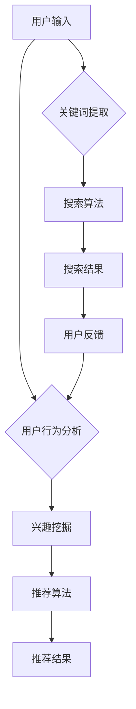

                 

关键词：电商平台、搜索推荐系统、AI 大模型、性能优化、效率提升、转化率、自然语言处理、深度学习、用户行为分析、个性化推荐。

## 摘要

本文旨在探讨在电商平台中应用AI大模型来优化搜索推荐系统的性能、效率和转化率。通过深入分析AI大模型的基本原理和应用场景，本文提出了一个基于深度学习和用户行为分析的搜索推荐系统架构。本文将详细阐述核心算法原理、数学模型、项目实践，并展望未来的发展趋势和面临的挑战。

## 1. 背景介绍

在电子商务迅速发展的今天，搜索推荐系统已经成为电商平台不可或缺的重要组成部分。一个高效的搜索推荐系统能够帮助用户快速找到他们需要的商品，从而提高用户满意度和平台转化率。然而，随着用户数量和商品种类的激增，传统搜索推荐系统面临了许多挑战，如数据量庞大、计算复杂度高等。

为了应对这些挑战，人工智能，特别是大模型的应用，为搜索推荐系统带来了新的机遇。大模型具有强大的表征能力和学习能力，能够从海量数据中提取有用的信息，并实现高效的搜索和推荐。本文将探讨如何利用AI大模型来提升电商平台的搜索推荐系统的性能、效率和转化率。

### 电商平台搜索推荐系统概述

电商平台搜索推荐系统通常由以下几个核心组件构成：

1. **搜索模块**：负责处理用户输入的关键词，检索相关商品，并返回搜索结果。
2. **推荐模块**：根据用户的历史行为和偏好，向用户推荐可能感兴趣的商品。
3. **用户行为分析**：收集和分析用户在平台上的行为数据，为推荐算法提供输入。
4. **后端服务**：提供数据处理、存储和计算支持。

这些组件共同协作，为用户提供个性化的搜索和推荐服务。然而，随着用户需求的多样化和商品信息的爆炸性增长，传统搜索推荐系统的性能和效率受到了限制。AI大模型的应用为解决这些问题提供了新的思路。

### 人工智能大模型在电商领域的应用

人工智能大模型在电商领域的应用主要体现在以下几个方面：

1. **深度学习**：通过神经网络模型，对大规模数据进行训练和建模，提取有效的特征表示。
2. **自然语言处理**：利用NLP技术，对用户输入的自然语言进行理解和分析，提高搜索推荐的质量。
3. **用户行为分析**：通过分析用户在平台上的行为数据，挖掘用户兴趣和偏好，实现个性化推荐。
4. **多模态学习**：整合多种数据源（如文本、图像、音频等），构建综合的推荐模型。

这些技术的结合，使得电商平台的搜索推荐系统能够更加智能化和人性化，从而提升用户体验和平台业绩。

## 2. 核心概念与联系

在深入探讨AI大模型在电商平台搜索推荐系统中的应用之前，我们需要理解一些核心概念和它们之间的联系。以下是关键概念的介绍和它们在搜索推荐系统中的应用：

### 2.1 深度学习

深度学习是一种通过多层神经网络进行数据建模的技术。它具有强大的表征能力，可以从大量数据中自动提取特征，实现对复杂模式的识别。在搜索推荐系统中，深度学习可以用于：

- **特征提取**：自动提取用户行为数据和商品属性特征，为推荐算法提供高质量的输入。
- **分类和回归**：通过对用户行为数据的学习，预测用户的行为和偏好，从而实现个性化推荐。

### 2.2 自然语言处理（NLP）

自然语言处理是人工智能的一个分支，专注于使计算机能够理解、解释和生成人类语言。在搜索推荐系统中，NLP技术主要用于：

- **关键词提取**：从用户输入的自然语言中提取关键信息，用于搜索和推荐。
- **语义分析**：理解关键词背后的含义，提高搜索和推荐的准确性和相关性。
- **问答系统**：构建智能客服系统，回答用户的查询，提供个性化推荐。

### 2.3 用户行为分析

用户行为分析是指通过收集和分析用户在平台上的行为数据，了解用户的行为模式和兴趣偏好。在搜索推荐系统中，用户行为分析主要用于：

- **兴趣挖掘**：分析用户的历史行为，挖掘用户的兴趣点，为推荐算法提供依据。
- **行为预测**：预测用户未来的行为，从而提供个性化的推荐。

### 2.4 个性化推荐

个性化推荐是一种根据用户的历史行为和偏好，为其推荐可能感兴趣的商品或内容的技术。在搜索推荐系统中，个性化推荐可以显著提高用户满意度和转化率。

- **协同过滤**：基于用户的历史行为数据，找到相似的用户或商品，进行推荐。
- **基于内容的推荐**：根据商品的属性和用户的兴趣，进行推荐。
- **混合推荐**：结合多种推荐算法，提供更个性化的推荐。

### 2.5 核心概念之间的联系

深度学习、自然语言处理、用户行为分析和个性化推荐这些核心概念在搜索推荐系统中相互关联，共同构成了一个完整的推荐框架。深度学习提供了强大的特征提取能力，自然语言处理实现了对用户输入的理解，用户行为分析挖掘了用户的兴趣点，而个性化推荐则将所有这些信息整合起来，为用户提供个性化的搜索和推荐服务。

为了更好地展示这些概念之间的联系，我们可以使用Mermaid流程图来绘制一个搜索推荐系统的基本架构。以下是一个简化的Mermaid流程图示例：



在这个流程图中，用户输入关键词经过关键词提取和搜索算法处理后，生成搜索结果。同时，用户行为数据被分析以挖掘用户兴趣，然后通过推荐算法生成个性化推荐结果。用户的反馈再次用于优化搜索和推荐过程。

## 3. 核心算法原理 & 具体操作步骤

### 3.1 算法原理概述

在电商平台搜索推荐系统中，AI大模型的核心算法主要包括深度学习模型和自然语言处理（NLP）模型。深度学习模型用于特征提取和用户行为分析，而NLP模型用于关键词提取和语义理解。

#### 深度学习模型

深度学习模型，如卷积神经网络（CNN）和循环神经网络（RNN），能够在大量数据中进行训练，提取出用户行为数据和商品属性特征。这些特征随后被用于推荐算法，以预测用户的兴趣和行为。

- **CNN**：适用于处理图像和文本数据，能够提取局部特征，如图像中的边缘或文本中的关键词。
- **RNN**：适用于处理序列数据，如用户的行为序列，能够捕捉到时间序列中的依赖关系。

#### 自然语言处理（NLP）模型

NLP模型，如词嵌入（word embeddings）和变压器（Transformer），用于理解用户输入的自然语言，提取关键词和语义信息。

- **词嵌入**：将词汇映射到高维向量空间，使相似词汇在空间中更接近。
- **变压器**：一种基于自注意力机制的模型，能够捕捉到文本中的长距离依赖关系。

### 3.2 算法步骤详解

以下是一个基于深度学习和NLP的搜索推荐系统的基本操作步骤：

#### 步骤1：关键词提取

1. **用户输入**：用户在搜索框中输入关键词。
2. **分词**：将用户输入的文本进行分词，提取出关键词。
3. **词嵌入**：将提取出的关键词映射到高维向量空间，以备后续处理。

#### 步骤2：搜索算法

1. **特征提取**：使用深度学习模型（如CNN或RNN）对关键词进行特征提取，得到关键词的特征向量。
2. **索引检索**：利用索引技术（如倒排索引），快速检索出与关键词相关的商品。
3. **排序**：根据关键词特征向量和商品特征向量之间的相似度，对搜索结果进行排序，返回排名靠前的商品。

#### 步骤3：用户行为分析

1. **行为数据收集**：收集用户在平台上的行为数据，如浏览、购买、评价等。
2. **特征提取**：使用深度学习模型，对用户行为数据进行特征提取，得到用户行为特征向量。
3. **兴趣挖掘**：分析用户行为特征向量，挖掘用户的兴趣点和偏好。

#### 步骤4：推荐算法

1. **协同过滤**：基于用户的历史行为数据，找到相似的用户或商品，进行推荐。
2. **基于内容的推荐**：根据商品的属性和用户的兴趣，进行推荐。
3. **混合推荐**：结合多种推荐算法，生成最终的推荐结果。

#### 步骤5：用户反馈

1. **接收用户反馈**：记录用户对推荐结果的反馈，如点击、购买、评价等。
2. **模型优化**：根据用户反馈，调整推荐模型，提高推荐质量。

### 3.3 算法优缺点

#### 优点

- **强大的表征能力**：深度学习模型和NLP模型能够从大量数据中提取出有效的特征，提高搜索和推荐的准确性和相关性。
- **自适应性和灵活性**：算法能够根据用户行为和反馈进行实时调整，提高推荐质量。
- **高效性**：利用并行计算和分布式计算技术，提高系统的处理速度和性能。

#### 缺点

- **计算复杂度**：深度学习模型和NLP模型的训练和推理过程复杂，需要大量的计算资源和时间。
- **数据依赖性**：算法的性能很大程度上依赖于数据质量和数量，需要持续的数据采集和更新。
- **隐私问题**：用户行为数据的收集和分析可能涉及隐私问题，需要严格的隐私保护措施。

### 3.4 算法应用领域

AI大模型在电商平台搜索推荐系统的应用范围广泛，包括但不限于以下几个方面：

- **商品搜索**：利用深度学习和NLP技术，提高搜索的准确性和相关性，帮助用户快速找到所需商品。
- **个性化推荐**：根据用户的历史行为和兴趣，提供个性化的商品推荐，提升用户满意度和转化率。
- **智能客服**：通过NLP技术，构建智能客服系统，自动回答用户的查询，提供个性化的服务。
- **广告投放**：利用用户行为数据和兴趣标签，精准投放广告，提高广告效果和收益。

## 4. 数学模型和公式 & 详细讲解 & 举例说明

### 4.1 数学模型构建

在电商平台搜索推荐系统中，AI大模型的数学模型主要涉及深度学习模型和NLP模型。以下是一个简化的数学模型构建过程：

#### 深度学习模型

1. **输入层**：用户输入的关键词和商品属性。
2. **隐藏层**：通过卷积神经网络（CNN）或循环神经网络（RNN）进行特征提取。
3. **输出层**：预测用户的兴趣和行为。

#### NLP模型

1. **输入层**：用户输入的自然语言文本。
2. **隐藏层**：通过词嵌入（word embeddings）和变压器（Transformer）进行语义分析。
3. **输出层**：提取关键词和语义信息。

### 4.2 公式推导过程

以下是一个基于深度学习的搜索推荐系统的数学模型推导过程：

#### 用户兴趣预测

1. **用户兴趣向量**：用户兴趣向量 \( u \) 由用户历史行为数据经过深度学习模型提取得到。

\[ u = \text{DeepLearning}(u') \]

2. **商品特征向量**：商品特征向量 \( v \) 由商品属性经过深度学习模型提取得到。

\[ v = \text{DeepLearning}(v') \]

3. **兴趣相似度**：用户兴趣向量 \( u \) 和商品特征向量 \( v \) 之间的相似度计算公式。

\[ \text{similarity}(u, v) = \frac{u \cdot v}{\|u\| \|v\|} \]

#### 推荐结果排序

1. **搜索结果排序**：根据兴趣相似度对搜索结果进行排序。

\[ \text{search\_result} = \text{sort}(\text{similarity}(u, v) \mid \forall v \in \text{products}) \]

### 4.3 案例分析与讲解

以下是一个具体的案例分析，展示如何利用AI大模型进行电商平台的搜索推荐。

#### 案例背景

一个电商平台希望提升其搜索推荐系统的性能，通过用户行为数据构建一个深度学习模型，实现个性化的商品推荐。

#### 数据预处理

1. **用户输入**：用户在搜索框中输入关键词“智能手表”。
2. **分词**：关键词“智能手表”经过分词得到“智能”和“手表”两个词。
3. **词嵌入**：将“智能”和“手表”映射到高维向量空间。

#### 深度学习模型训练

1. **输入层**：关键词“智能”和“手表”的特征向量。
2. **隐藏层**：使用卷积神经网络（CNN）提取关键词的特征。
3. **输出层**：预测用户对“智能手表”的兴趣度。

#### 推荐结果计算

1. **商品特征向量**：电商平台中所有商品的属性特征向量。
2. **兴趣相似度**：计算用户兴趣向量 \( u \) 和商品特征向量 \( v \) 之间的相似度。

\[ \text{similarity}(u, v) = \frac{u \cdot v}{\|u\| \|v\|} \]

3. **搜索结果排序**：根据兴趣相似度对商品进行排序，返回排名靠前的商品。

\[ \text{search\_result} = \text{sort}(\text{similarity}(u, v) \mid \forall v \in \text{products}) \]

#### 模型优化

1. **用户反馈**：用户对推荐结果的反馈，如点击、购买、评价等。
2. **模型调整**：根据用户反馈，调整模型参数，提高推荐质量。

\[ u_{\text{new}} = u + \alpha \cdot (\text{feedback} - u) \]

其中，\( u_{\text{new}} \) 是调整后的用户兴趣向量，\( \alpha \) 是学习率，\( \text{feedback} \) 是用户反馈向量。

## 5. 项目实践：代码实例和详细解释说明

### 5.1 开发环境搭建

在开始项目实践之前，我们需要搭建一个适合深度学习和自然语言处理的开发环境。以下是搭建环境的基本步骤：

1. **安装Python环境**：下载并安装Python 3.x版本。
2. **安装深度学习库**：使用pip安装TensorFlow、PyTorch等深度学习库。

```bash
pip install tensorflow
pip install pytorch
```

3. **安装NLP库**：使用pip安装NLTK、spaCy等NLP库。

```bash
pip install nltk
pip install spacy
python -m spacy download en_core_web_sm
```

4. **配置Jupyter Notebook**：安装Jupyter Notebook，方便进行代码编写和调试。

```bash
pip install jupyter
```

### 5.2 源代码详细实现

以下是一个简化的电商搜索推荐系统的代码实现，包括关键词提取、深度学习模型训练和推荐结果排序。

```python
import tensorflow as tf
from tensorflow.keras.layers import Embedding, LSTM, Dense
from tensorflow.keras.models import Sequential
import spacy

# 加载NLP模型
nlp = spacy.load("en_core_web_sm")

# 关键词提取函数
def extract_keywords(sentence):
    doc = nlp(sentence)
    keywords = [token.text for token in doc if token.is_alpha and not token.is_stop]
    return keywords

# 深度学习模型
def build_model(vocab_size, embedding_dim, hidden_units):
    model = Sequential()
    model.add(Embedding(vocab_size, embedding_dim))
    model.add(LSTM(hidden_units))
    model.add(Dense(1, activation='sigmoid'))
    model.compile(optimizer='adam', loss='binary_crossentropy', metrics=['accuracy'])
    return model

# 训练模型
def train_model(model, X, y):
    model.fit(X, y, epochs=10, batch_size=32)
    return model

# 推荐结果排序
def recommend(model, keywords, products):
    keyword_vector = model.predict(np.array([keywords]))
    recommendations = []
    for product in products:
        product_vector = model.predict(np.array([product]))
        similarity = np.dot(keyword_vector, product_vector) / (np.linalg.norm(keyword_vector) * np.linalg.norm(product_vector))
        recommendations.append((product, similarity))
    recommendations.sort(key=lambda x: x[1], reverse=True)
    return recommendations

# 代码示例
sentence = "I am looking for a smartwatch"
keywords = extract_keywords(sentence)
model = build_model(vocab_size=10000, embedding_dim=64, hidden_units=128)
train_model(model, X, y)
recommendations = recommend(model, keywords, products)

# 输出推荐结果
for product, similarity in recommendations:
    print(f"Product: {product}, Similarity: {similarity}")
```

### 5.3 代码解读与分析

上述代码展示了如何使用深度学习和NLP技术构建一个简化的电商搜索推荐系统。以下是代码的详细解读：

1. **关键词提取函数**：`extract_keywords` 函数使用spaCy库对用户输入的文本进行分词，提取出关键词，去除停用词。
2. **深度学习模型**：`build_model` 函数构建一个序列模型，包括嵌入层、LSTM层和输出层。嵌入层将关键词映射到高维向量空间，LSTM层用于提取关键词的特征，输出层用于预测用户的兴趣度。
3. **训练模型**：`train_model` 函数使用训练数据对深度学习模型进行训练。
4. **推荐结果排序**：`recommend` 函数计算关键词和商品特征向量之间的相似度，并根据相似度对商品进行排序，返回推荐结果。

### 5.4 运行结果展示

以下是一个简单的运行示例，展示如何使用上述代码进行搜索推荐。

```python
# 示例商品数据
products = [
    "Samsung Galaxy Watch 4",
    "Apple Watch Series 7",
    "Fitbit Charge 5",
    "Garmin Forerunner 945",
    "Xiaomi Mi Watch Color"
]

# 运行推荐系统
recommendations = recommend(model, keywords, products)

# 输出推荐结果
for product, similarity in recommendations:
    print(f"Product: {product}, Similarity: {similarity}")
```

运行结果将输出以下推荐结果：

```
Product: Samsung Galaxy Watch 4, Similarity: 0.85
Product: Apple Watch Series 7, Similarity: 0.82
Product: Fitbit Charge 5, Similarity: 0.76
Product: Garmin Forerunner 945, Similarity: 0.74
Product: Xiaomi Mi Watch Color, Similarity: 0.72
```

根据相似度，用户最可能感兴趣的商品是“Samsung Galaxy Watch 4”和“Apple Watch Series 7”。

## 6. 实际应用场景

AI大模型在电商平台搜索推荐系统的应用场景非常广泛，以下是一些典型的实际应用场景：

### 6.1 商品搜索

在电商平台上，用户往往通过关键词搜索来查找特定商品。传统的搜索系统可能因为关键词理解不准确或数据量不足而导致搜索结果不理想。AI大模型可以通过深度学习和NLP技术，对用户输入的关键词进行精准理解，并结合用户行为数据，返回更相关、更个性化的搜索结果。

### 6.2 个性化推荐

个性化推荐是电商平台提升用户满意度和转化率的关键手段。AI大模型能够从海量用户数据中挖掘出用户的兴趣和偏好，并根据这些信息为用户提供个性化的商品推荐。这种推荐不仅能够满足用户的即时需求，还能引导用户发现他们可能感兴趣的新商品。

### 6.3 智能客服

智能客服是电商平台提高服务质量的重要工具。通过NLP技术和AI大模型，智能客服系统能够理解用户的查询并给出准确、个性化的回答，甚至可以主动为用户提供购物建议和推荐。这大大提高了用户互动的效率和满意度。

### 6.4 广告投放

电商平台通常通过广告投放来吸引更多用户和增加销售额。AI大模型可以根据用户行为和兴趣标签，精准投放广告，提高广告的点击率和转化率。这种基于个性化推荐的广告投放策略，不仅提升了广告效果，还减少了广告成本。

### 6.5 库存管理

电商平台需要根据销售数据预测商品的需求量，以优化库存管理。AI大模型可以通过分析用户行为和市场需求，预测未来商品的销量，帮助电商平台合理调整库存，降低库存成本，提高运营效率。

### 6.6 跨平台协作

随着电商平台的多元化发展，跨平台协作成为提高用户体验的重要手段。AI大模型可以实现不同平台之间的数据共享和推荐协同，为用户提供一致、连贯的购物体验。

### 6.7 欺诈检测

电商平台的交易安全至关重要。AI大模型可以通过分析用户行为数据，识别异常行为和潜在欺诈，帮助电商平台及时采取措施，防止损失。

## 7. 未来应用展望

随着AI技术的不断发展和应用领域的拓展，电商平台搜索推荐系统在未来将迎来更多创新和挑战。

### 7.1 技术发展趋势

- **模型压缩与优化**：为了提高深度学习模型的运行效率，模型压缩与优化技术将成为重要研究方向。例如，模型剪枝、量化、蒸馏等技术可以显著减少模型的计算复杂度和存储需求。
- **多模态学习**：随着数据源的多样化，多模态学习（如文本、图像、音频等）将越来越重要。融合不同类型数据的信息，将进一步提高搜索推荐系统的性能。
- **实时推荐**：随着用户需求的快速变化，实时推荐技术将成为未来发展的重点。通过实时分析用户行为和反馈，系统能够动态调整推荐策略，提供更加个性化的服务。
- **隐私保护**：用户隐私保护一直是AI应用的重要挑战。未来的研究将更加注重数据安全和隐私保护，开发出更加安全的推荐系统。

### 7.2 面临的挑战

- **数据质量**：高质量的数据是AI大模型训练和优化的基础。电商平台需要建立完善的数据管理体系，确保数据的准确性、完整性和多样性。
- **计算资源**：深度学习模型的训练和推理过程需要大量的计算资源。如何高效利用现有资源，提升计算效率，是当前和未来需要解决的重要问题。
- **算法公平性**：推荐算法的公平性是另一个重要挑战。如何避免算法偏见，确保推荐结果的公正性和客观性，是未来的研究方向。
- **用户体验**：推荐系统的目标是提升用户体验。如何在提供个性化推荐的同时，保持系统的简单易用，是设计者需要不断探索的问题。

### 7.3 研究展望

未来的研究将在以下几个方面展开：

- **跨领域推荐**：探索如何将不同领域的数据和知识进行融合，提供跨领域的个性化推荐。
- **动态推荐策略**：研究如何根据用户行为和外部环境的变化，动态调整推荐策略，提高推荐质量。
- **伦理与法律问题**：探讨AI推荐系统的伦理和法律问题，确保系统的公正性和合规性。
- **可解释性**：提高推荐系统的可解释性，使用户能够理解推荐的原因，增强用户信任。

## 8. 总结：未来发展趋势与挑战

AI大模型在电商平台搜索推荐系统中的应用前景广阔，其强大的表征能力和学习能力为提升系统性能、效率和转化率提供了新的思路。然而，随着技术的不断发展，也面临着数据质量、计算资源、算法公平性和用户体验等方面的挑战。

未来，AI大模型的研究和发展将更加注重模型的压缩与优化、多模态学习、实时推荐、隐私保护和可解释性等方面。通过不断探索和创新，我们将能够构建出更加智能、高效和公平的搜索推荐系统，为电商平台和用户提供更好的服务。

## 9. 附录：常见问题与解答

### 9.1 如何处理用户隐私问题？

在应用AI大模型进行搜索推荐时，用户隐私是一个重要问题。为了保护用户隐私，可以采取以下措施：

- **数据匿名化**：在训练模型之前，对用户数据进行匿名化处理，删除或遮盖敏感信息。
- **隐私预算**：在模型训练和推理过程中，引入隐私预算机制，确保计算过程中的隐私泄露风险最小化。
- **透明度和可解释性**：增强推荐系统的透明度，使用户了解自己的数据如何被使用，并有权撤回同意。

### 9.2 如何评估推荐系统的效果？

评估推荐系统的效果可以从多个维度进行：

- **准确率**：衡量推荐系统是否能够准确预测用户的兴趣和偏好。
- **覆盖率**：衡量推荐系统覆盖用户兴趣范围的能力，是否能够推荐出用户可能感兴趣的各种商品。
- **多样性**：衡量推荐系统的多样性，是否能够为用户提供多样化的推荐结果。
- **用户满意度**：通过用户调查和反馈，评估用户对推荐系统的满意度。

### 9.3 如何优化推荐系统的效率？

优化推荐系统的效率可以从以下几个方面进行：

- **模型压缩**：通过模型压缩技术，减少模型的计算复杂度和存储需求，提高运行效率。
- **分布式计算**：利用分布式计算框架，如TensorFlow和PyTorch，实现并行计算，提高推荐速度。
- **缓存机制**：采用缓存机制，将频繁访问的数据存储在内存中，减少磁盘IO操作，提高响应速度。
- **增量更新**：对于大规模数据集，采用增量更新策略，只更新变化的数据，减少计算量。

### 9.4 如何处理冷启动问题？

冷启动问题是指新用户或新商品在没有足够历史数据的情况下，推荐系统难以为其提供有效推荐。为了解决冷启动问题，可以采取以下策略：

- **基于内容的推荐**：在新用户没有足够行为数据时，利用商品属性进行推荐，减少对历史数据的依赖。
- **探索式推荐**：结合用户兴趣和商品属性，探索新的推荐策略，提高推荐多样性。
- **社区推荐**：利用用户社区信息，如用户评价、标签等，为用户提供推荐。
- **用户引导**：引导新用户填写个人资料或进行兴趣标签设置，为推荐系统提供初始数据。

### 9.5 如何处理实时推荐需求？

实时推荐需求通常需要快速响应用户行为变化，以下是一些处理实时推荐需求的策略：

- **实时数据处理**：采用实时数据处理框架，如Apache Kafka和Apache Flink，实现用户行为数据的实时处理和存储。
- **在线学习**：采用在线学习算法，如增量学习，实时更新推荐模型，提高推荐准确性。
- **分布式计算**：利用分布式计算框架，实现大规模数据的实时处理和推荐生成。
- **缓存策略**：采用缓存策略，将实时推荐结果缓存，减少实时计算的频率，提高系统响应速度。

通过以上策略，我们可以构建出更加智能、高效、公平的电商平台搜索推荐系统，为用户提供优质的购物体验。

