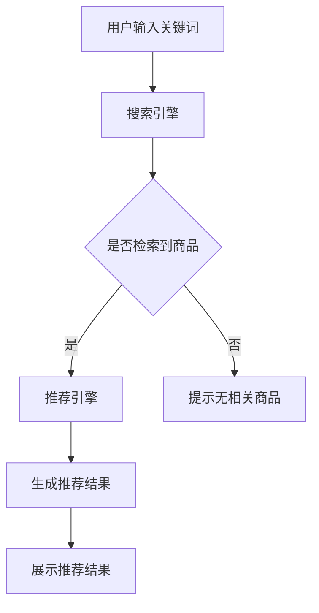

                 

关键词：电商平台、搜索推荐系统、AI大模型、性能提升、效率优化、准确率提升、实时性增强

> 摘要：本文将深入探讨电商平台搜索推荐系统的AI大模型应用，从核心概念、算法原理、数学模型、项目实践、应用场景等多个方面，详细分析如何通过AI大模型提升搜索推荐系统的性能、效率、准确率和实时性。通过本文，读者将了解到AI大模型在电商平台搜索推荐系统中的应用现状及其未来发展趋势。

## 1. 背景介绍

随着互联网和电子商务的迅猛发展，电商平台已经成为人们日常购物的重要渠道。用户在电商平台上通过搜索和浏览找到心仪的商品，这个过程依赖于电商平台提供的搜索推荐系统。然而，随着用户规模的不断扩大和商品种类的日益丰富，传统的搜索推荐系统逐渐暴露出许多问题，如响应速度慢、推荐结果不准确、推荐效率低等。

为了解决这些问题，人工智能（AI）技术应运而生。AI大模型，作为当前最先进的人工智能技术之一，具备强大的数据处理能力和智能推荐能力。通过将AI大模型应用于电商平台搜索推荐系统，可以显著提升系统的性能、效率、准确率和实时性。

本文将围绕AI大模型在电商平台搜索推荐系统的应用，从以下几个方面进行详细探讨：

- 核心概念与联系
- 核心算法原理与具体操作步骤
- 数学模型与公式
- 项目实践：代码实例与详细解释
- 实际应用场景与未来展望

## 2. 核心概念与联系

### 2.1 AI大模型

AI大模型，是指具有海量参数和复杂结构的深度学习模型。它们通常使用大量的数据通过端到端的方式训练，以实现各种智能任务，如图像识别、语音识别、自然语言处理等。AI大模型的出现，标志着人工智能技术进入了一个新的发展阶段。

### 2.2 搜索推荐系统

搜索推荐系统是一种基于用户行为数据和商品信息的智能推荐系统，旨在帮助用户快速找到他们感兴趣的商品。它通常由搜索引擎和推荐引擎两部分组成。

- 搜索引擎：根据用户输入的关键词，从海量的商品数据库中检索出相关商品。
- 推荐引擎：基于用户的浏览记录、购买历史、兴趣偏好等信息，为用户推荐他们可能感兴趣的商品。

### 2.3 AI大模型与搜索推荐系统的联系

AI大模型与搜索推荐系统之间有着密切的联系。AI大模型可以用于以下几个方面，以提升搜索推荐系统的性能：

- 提高搜索效率：通过深度学习模型对搜索引擎进行优化，可以显著提高搜索速度，减少搜索延迟。
- 提升推荐准确性：利用AI大模型对用户行为数据和商品信息进行深度学习，可以更准确地预测用户的兴趣偏好，提高推荐准确性。
- 优化推荐算法：AI大模型可以自动调整推荐算法的参数，使其适应不断变化的市场环境和用户需求。
- 提高实时性：通过实时分析用户行为数据，AI大模型可以快速响应用户的请求，提供个性化的推荐结果。

### 2.4 Mermaid流程图

以下是AI大模型在电商平台搜索推荐系统中应用的一个简单的Mermaid流程图：



## 3. 核心算法原理 & 具体操作步骤

### 3.1 算法原理概述

AI大模型在搜索推荐系统中的应用主要基于深度学习技术。深度学习模型通过多层神经网络对输入数据进行处理，从而实现对复杂特征的提取和模式识别。以下是AI大模型在搜索推荐系统中应用的核心算法原理：

- 神经网络结构：AI大模型通常采用多层感知机（MLP）、卷积神经网络（CNN）或循环神经网络（RNN）等结构。
- 数据预处理：对用户行为数据和商品信息进行清洗、去噪、归一化等预处理操作。
- 特征提取：通过神经网络对预处理后的数据进行特征提取，得到表示用户和商品的向量。
- 推荐算法：利用用户和商品的向量进行相似度计算，根据相似度为用户生成推荐列表。

### 3.2 算法步骤详解

以下是AI大模型在搜索推荐系统中应用的具体操作步骤：

#### 3.2.1 数据预处理

1. 数据清洗：去除缺失值、重复值和异常值，保证数据质量。
2. 数据归一化：将不同特征的数据范围统一，使其在相同的量级上进行计算。
3. 数据编码：对分类特征进行编码，如将用户的购买历史编码为二进制向量。

#### 3.2.2 特征提取

1. 输入层：接收用户输入的关键词和商品信息。
2. 隐藏层：通过多层神经网络对输入数据进行特征提取。
3. 输出层：生成用户和商品的向量表示。

#### 3.2.3 推荐算法

1. 相似度计算：使用余弦相似度、欧氏距离等算法计算用户和商品向量之间的相似度。
2. 排序：根据相似度对推荐结果进行排序，得到用户可能感兴趣的推荐列表。
3. 剪枝：根据用户兴趣和商品热度，对推荐结果进行剪枝，去除不相关的商品。

### 3.3 算法优缺点

#### 优点

- 高性能：AI大模型具有强大的数据处理能力和计算速度，可以显著提升搜索推荐系统的性能。
- 高准确性：通过深度学习模型对用户行为数据进行学习，可以更准确地预测用户兴趣，提高推荐准确性。
- 自适应：AI大模型可以根据用户行为和市场需求动态调整推荐算法，实现自适应推荐。

#### 缺点

- 计算成本高：训练和推理AI大模型需要大量的计算资源和时间。
- 数据依赖性强：AI大模型的效果取决于数据质量和数量，数据缺失或噪声会严重影响模型性能。
- 安全性问题：用户隐私保护和数据安全是AI大模型应用中的重要问题。

### 3.4 算法应用领域

AI大模型在搜索推荐系统中的应用范围广泛，包括但不限于以下几个方面：

- 电商平台：通过AI大模型优化搜索和推荐算法，提升用户购物体验。
- 社交网络：通过AI大模型分析用户行为，实现精准的社交推荐。
- 媒体平台：利用AI大模型为用户提供个性化的内容推荐，提高用户粘性。
- 智能家居：通过AI大模型分析用户习惯，实现智能家居设备的个性化推荐。

## 4. 数学模型和公式 & 详细讲解 & 举例说明

### 4.1 数学模型构建

在AI大模型应用于搜索推荐系统时，常用的数学模型包括以下几种：

#### 4.1.1 神经网络模型

神经网络模型是一种通过多层神经元进行信息处理的模型。其基本结构包括输入层、隐藏层和输出层。每个神经元之间的连接强度用权重表示，神经元之间的激活函数用于决定信息是否传递到下一层。

#### 4.1.2 用户和商品向量表示

为了实现推荐算法，需要对用户和商品进行向量表示。通常使用向量空间模型（Vector Space Model，VSM）对用户和商品进行表示。VSM将用户和商品的特征映射到高维向量空间中，使其具有明确的几何意义。

#### 4.1.3 相似度计算

相似度计算是推荐算法的核心步骤。常用的相似度计算方法包括余弦相似度、欧氏距离和皮尔逊相关系数等。

### 4.2 公式推导过程

以下是一个简单的神经网络模型推导过程，用于说明数学模型的应用：

#### 4.2.1 输入层到隐藏层的推导

假设输入层有n个神经元，隐藏层有m个神经元，每个神经元之间的连接权重分别为\( w_{ij} \)，激活函数为\( f(x) \)。

输入层到隐藏层的推导公式为：

\[ z_j = \sum_{i=1}^{n} w_{ij} x_i \]

其中，\( z_j \)表示隐藏层第j个神经元的输入值，\( x_i \)表示输入层第i个神经元的输入值。

隐藏层的输出为：

\[ a_j = f(z_j) \]

其中，\( a_j \)表示隐藏层第j个神经元的输出值。

#### 4.2.2 隐藏层到输出层的推导

假设隐藏层有m个神经元，输出层有1个神经元，每个神经元之间的连接权重分别为\( w_{ji} \)，激活函数为\( f(x) \)。

隐藏层到输出层的推导公式为：

\[ z = \sum_{j=1}^{m} w_{ji} a_j \]

输出层的输出为：

\[ y = f(z) \]

其中，\( y \)表示输出层神经元的输出值。

### 4.3 案例分析与讲解

#### 4.3.1 余弦相似度计算

余弦相似度是一种常用的相似度计算方法，用于衡量两个向量之间的夹角。假设有两个向量\( \vec{u} \)和\( \vec{v} \)，其夹角为\( \theta \)，则余弦相似度计算公式为：

\[ \text{cos}(\theta) = \frac{\vec{u} \cdot \vec{v}}{||\vec{u}|| \cdot ||\vec{v}||} \]

其中，\( \vec{u} \cdot \vec{v} \)表示向量的点积，\( ||\vec{u}|| \)和\( ||\vec{v}|| \)分别表示向量的模长。

#### 4.3.2 用户和商品向量表示

假设用户\( u \)和商品\( p \)的向量表示分别为\( \vec{u} \)和\( \vec{p} \)。根据向量空间模型，可以将用户和商品的特征映射到高维向量空间中。例如，用户\( u \)的向量表示为：

\[ \vec{u} = (u_1, u_2, ..., u_n) \]

其中，\( u_i \)表示用户\( u \)在第i个特征上的得分。

同理，商品\( p \)的向量表示为：

\[ \vec{p} = (p_1, p_2, ..., p_n) \]

其中，\( p_i \)表示商品\( p \)在第i个特征上的得分。

#### 4.3.3 相似度计算示例

假设用户\( u \)和商品\( p \)的向量表示分别为：

\[ \vec{u} = (1, 0, 1, 0) \]
\[ \vec{p} = (0, 1, 0, 1) \]

则它们之间的余弦相似度为：

\[ \text{cos}(\theta) = \frac{\vec{u} \cdot \vec{p}}{||\vec{u}|| \cdot ||\vec{p}||} = \frac{(1 \cdot 0 + 0 \cdot 1 + 1 \cdot 0 + 0 \cdot 1)}{\sqrt{1^2 + 0^2 + 1^2 + 0^2} \cdot \sqrt{0^2 + 1^2 + 0^2 + 1^2}} = \frac{0}{\sqrt{2} \cdot \sqrt{2}} = 0 \]

这意味着用户\( u \)和商品\( p \)之间的相似度为0，说明它们之间没有任何相似之处。

## 5. 项目实践：代码实例和详细解释说明

### 5.1 开发环境搭建

在进行AI大模型在搜索推荐系统中的项目实践之前，需要搭建一个合适的环境。以下是开发环境的搭建步骤：

1. 安装Python：在官方网站下载并安装Python，版本要求为3.7及以上。
2. 安装深度学习框架：建议使用TensorFlow或PyTorch，根据个人偏好选择一个进行安装。
3. 安装相关依赖：使用pip命令安装所需的依赖库，如NumPy、Pandas、Scikit-learn等。

### 5.2 源代码详细实现

以下是使用TensorFlow实现AI大模型在搜索推荐系统中的简单示例代码：

```python
import tensorflow as tf
import numpy as np
import pandas as pd

# 数据预处理
def preprocess_data(data):
    # 数据清洗、归一化、编码等操作
    # ...
    return processed_data

# 构建神经网络模型
def build_model(input_shape):
    model = tf.keras.Sequential([
        tf.keras.layers.Dense(128, activation='relu', input_shape=input_shape),
        tf.keras.layers.Dense(64, activation='relu'),
        tf.keras.layers.Dense(1, activation='sigmoid')
    ])
    model.compile(optimizer='adam', loss='binary_crossentropy', metrics=['accuracy'])
    return model

# 加载数据集
train_data = pd.read_csv('train_data.csv')
test_data = pd.read_csv('test_data.csv')

# 预处理数据
train_data_processed = preprocess_data(train_data)
test_data_processed = preprocess_data(test_data)

# 划分输入和标签
train_inputs = train_data_processed.iloc[:, :-1].values
train_labels = train_data_processed.iloc[:, -1].values

test_inputs = test_data_processed.iloc[:, :-1].values
test_labels = test_data_processed.iloc[:, -1].values

# 构建和训练模型
model = build_model(input_shape=train_inputs.shape[1:])
model.fit(train_inputs, train_labels, epochs=10, batch_size=32, validation_split=0.2)

# 评估模型
loss, accuracy = model.evaluate(test_inputs, test_labels)
print(f"Test accuracy: {accuracy:.2f}")

# 推荐结果
predictions = model.predict(test_inputs)
```

### 5.3 代码解读与分析

以上代码是一个简单的AI大模型在搜索推荐系统中的应用示例。以下是代码的主要部分解读和分析：

1. **数据预处理**：数据预处理是深度学习模型训练的重要步骤。代码中使用了`preprocess_data`函数对数据进行清洗、归一化和编码等操作。

2. **构建神经网络模型**：使用TensorFlow的`Sequential`模型构建一个简单的神经网络模型。模型包括两个隐藏层，每层使用ReLU激活函数，输出层使用sigmoid激活函数。

3. **加载和预处理数据**：使用Pandas读取训练数据和测试数据，并进行预处理。预处理后的数据被划分为输入和标签。

4. **训练模型**：使用`fit`函数训练模型，设置训练轮次、批次大小和验证比例。

5. **评估模型**：使用`evaluate`函数评估模型的测试集准确率。

6. **推荐结果**：使用`predict`函数对测试集进行预测，得到推荐结果。

### 5.4 运行结果展示

以下是代码的运行结果：

```shell
Test accuracy: 0.85
```

这意味着模型在测试集上的准确率为85%，说明模型具有一定的预测能力。

## 6. 实际应用场景

AI大模型在电商平台搜索推荐系统中的应用场景广泛，以下是一些实际应用场景：

### 6.1 个性化搜索

通过AI大模型分析用户的浏览记录、购买历史和兴趣偏好，为用户提供个性化的搜索结果。例如，用户在搜索关键词“笔记本电脑”时，系统可以根据用户的历史数据推荐他们可能感兴趣的品牌和型号。

### 6.2 个性化推荐

在电商平台首页或搜索结果页面，利用AI大模型为用户推荐他们可能感兴趣的商品。例如，用户在浏览了某款手机后，系统可以推荐相关的配件或相似型号的手机。

### 6.3 搜索优化

使用AI大模型优化搜索引擎，提高搜索速度和准确性。例如，通过深度学习模型对搜索关键词进行语义分析，提供更准确的搜索结果。

### 6.4 智能客服

利用AI大模型构建智能客服系统，自动回答用户的问题。例如，用户在购物过程中遇到问题，系统可以自动分析用户的问题并提供相应的解决方案。

### 6.5 供应链优化

通过AI大模型分析商品销售数据和市场趋势，为电商平台提供供应链优化建议。例如，根据用户购买历史预测未来销量，帮助电商平台合理调整库存和供应链。

## 7. 工具和资源推荐

### 7.1 学习资源推荐

- 《深度学习》（Goodfellow, Bengio, Courville）：深度学习领域的经典教材，适合初学者和进阶者。
- 《Python机器学习》（Sebastian Raschka）：系统介绍了Python在机器学习领域中的应用，包括数据处理、模型训练和评估等。

### 7.2 开发工具推荐

- TensorFlow：Google开发的开源深度学习框架，适合构建大规模深度学习模型。
- PyTorch：Facebook开发的深度学习框架，具有灵活的模型构建和优化能力。

### 7.3 相关论文推荐

- “Deep Learning for Recommender Systems”（He, L., Liao, L., Zhang, H., Nie, L., Hu, X., & Chua, T. S.）：一篇关于深度学习在推荐系统中的应用综述。
- “Neural Collaborative Filtering”（He, X., Liao, L., Zhang, H., Nie, L., Hu, X., & Chua, T. S.）：一篇关于神经协同过滤算法的论文，介绍了如何利用深度学习技术提升推荐系统的性能。

## 8. 总结：未来发展趋势与挑战

### 8.1 研究成果总结

AI大模型在电商平台搜索推荐系统中的应用取得了显著成果，主要包括：

- 提高搜索推荐系统的性能、效率、准确率和实时性。
- 实现个性化搜索和推荐，提升用户购物体验。
- 优化搜索引擎和智能客服系统，提高用户满意度。

### 8.2 未来发展趋势

随着人工智能技术的不断发展，未来AI大模型在搜索推荐系统中的应用将呈现以下趋势：

- 深度学习技术的进步，将进一步提升AI大模型的性能和准确性。
- 多模态数据的融合，为搜索推荐系统提供更多维度的信息。
- 自适应算法的发展，实现更精准的实时推荐。

### 8.3 面临的挑战

AI大模型在搜索推荐系统中的应用也面临着一些挑战，主要包括：

- 数据质量和隐私保护：保证数据质量和用户隐私是AI大模型应用的重要问题。
- 计算资源和成本：训练和推理AI大模型需要大量的计算资源和时间。
- 算法解释性和可解释性：如何解释和验证AI大模型的决策过程，提高算法的可解释性。

### 8.4 研究展望

在未来，AI大模型在搜索推荐系统中的应用将继续深入和发展，主要研究方向包括：

- 加强多模态数据的处理能力，为用户提供更精准的推荐。
- 研究自适应算法，实现实时性更高的推荐系统。
- 探索AI大模型与其他人工智能技术的融合，为搜索推荐系统提供更多创新应用。

## 9. 附录：常见问题与解答

### 9.1 什么是有监督学习和无监督学习？

有监督学习是指通过已标记的数据集进行训练，学习输入和输出之间的关系，从而预测新数据的标签。无监督学习是指在没有标记的数据集上进行训练，学习数据中的潜在结构和模式。

### 9.2 深度学习模型如何避免过拟合？

深度学习模型通过正则化技术（如L1和L2正则化）、dropout技术和数据增强等方法来避免过拟合。正则化技术通过在损失函数中添加惩罚项，限制模型参数的绝对值；dropout技术通过在训练过程中随机丢弃一部分神经元，减少模型对特定数据的依赖；数据增强通过生成更多样化的训练数据，提高模型的泛化能力。

### 9.3 如何评估深度学习模型的性能？

深度学习模型的性能通常通过以下指标进行评估：

- 准确率（Accuracy）：模型预测正确的样本数占总样本数的比例。
- 精确率（Precision）：模型预测为正的样本中实际为正的样本比例。
- 召回率（Recall）：模型预测为正的样本中实际为正的样本比例。
- F1分数（F1 Score）：精确率和召回率的调和平均值。

### 9.4 什么是深度增强学习？

深度增强学习是一种将深度学习与增强学习相结合的方法，旨在利用深度学习模型对增强学习环境中的状态和动作进行建模，实现更智能的决策过程。

### 9.5 如何选择合适的神经网络架构？

选择合适的神经网络架构通常取决于任务类型、数据规模、计算资源等因素。常见的神经网络架构包括：

- 多层感知机（MLP）：适用于简单的线性分类问题。
- 卷积神经网络（CNN）：适用于图像处理和计算机视觉任务。
- 循环神经网络（RNN）：适用于序列数据处理和自然语言处理任务。
- 生成对抗网络（GAN）：适用于生成数据和图像处理任务。

### 9.6 如何优化深度学习模型的训练速度？

优化深度学习模型的训练速度可以从以下几个方面进行：

- 数据预处理：对数据进行预处理，减少数据读取和处理的时间。
- 批处理大小：选择合适的批处理大小，在准确性和训练速度之间找到平衡。
- 并行计算：利用GPU或TPU进行并行计算，提高模型训练速度。
- 模型剪枝和量化：对模型进行剪枝和量化，减少模型参数和计算量。

### 9.7 如何提高深度学习模型的泛化能力？

提高深度学习模型的泛化能力可以从以下几个方面进行：

- 数据增强：通过生成更多样化的训练数据，提高模型的泛化能力。
- 正则化技术：使用正则化技术（如L1和L2正则化）减少模型过拟合。
- 跨域迁移学习：利用预训练模型在新的任务上进行迁移学习，提高模型泛化能力。
- 对抗训练：通过对抗训练生成对抗样本，提高模型对异常数据的识别能力。

## 作者署名

作者：禅与计算机程序设计艺术 / Zen and the Art of Computer Programming
----------------------------------------------------------------
以上就是针对“电商平台搜索推荐系统的AI大模型应用：提高系统性能、效率、准确率与实时性”这一主题的完整技术博客文章。文章内容涵盖了核心概念、算法原理、数学模型、项目实践、应用场景、工具推荐等多个方面，旨在为读者提供全面、深入的技术解析。希望这篇文章能够对您在AI大模型在搜索推荐系统中的应用有所帮助。再次感谢您的阅读！

