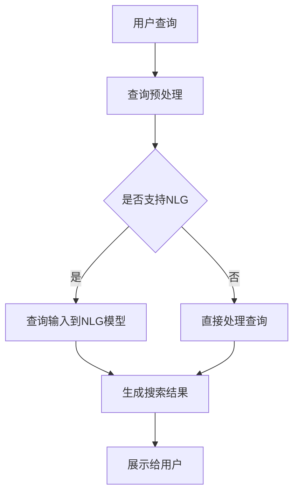

                 

关键词：电商搜索，自然语言生成，AI大模型，搜索优化，用户体验

> 摘要：本文将探讨电商搜索中自然语言生成（NLG）技术的应用，尤其是基于AI大模型的方案。文章首先介绍电商搜索的现状和挑战，接着详细分析自然语言生成的核心概念和架构，随后讨论核心算法原理、数学模型以及项目实践，最后探讨实际应用场景和未来发展趋势与挑战。

## 1. 背景介绍

随着电商行业的迅猛发展，用户对电商搜索的需求日益增长。用户不仅需要快速找到所需商品，还期望获得个性化的搜索结果，提高购物体验。然而，现有的电商搜索系统面临诸多挑战，如语义理解不足、结果多样性低、响应速度慢等。为解决这些问题，自然语言生成（NLG）技术逐渐成为电商搜索优化的重要方向。

自然语言生成技术旨在通过计算机程序生成具有人类语言特征的文本，从而满足用户对信息个性化、多样化、准确性的需求。近年来，随着深度学习技术的发展，尤其是AI大模型的崛起，NLG技术取得了显著进展，为电商搜索提供了新的解决方案。

本文将深入探讨基于AI大模型的自然语言生成技术在电商搜索中的应用，分析其核心算法原理、数学模型和具体操作步骤，并通过项目实践展示其实际效果。

## 2. 核心概念与联系

### 2.1 自然语言生成（NLG）

自然语言生成（Natural Language Generation，NLG）是一种利用计算机技术生成自然语言文本的技术。NLG系统通常包括文本生成模型、文本处理模块和用户交互界面等组成部分。文本生成模型负责生成符合语法和语义规则的文本，文本处理模块负责处理输入文本，使其适合生成任务，用户交互界面则用于用户与系统的交互。

### 2.2 AI大模型

AI大模型是指具有数十亿甚至千亿级参数的深度学习模型，如GPT（Generative Pre-trained Transformer）系列模型。这些模型通过在大规模数据集上进行预训练，具备了强大的语言理解和生成能力。AI大模型在电商搜索中的关键作用是提供高质量的自然语言生成服务，从而优化搜索结果、提升用户体验。

### 2.3 架构图



在这个架构图中，用户查询经过预处理后，根据系统配置决定是否使用NLG模型。如果使用，则将查询输入到NLG模型中生成搜索结果；否则，直接处理查询并生成搜索结果。生成的搜索结果通过用户交互界面展示给用户。

## 3. 核心算法原理 & 具体操作步骤

### 3.1 算法原理概述

基于AI大模型的自然语言生成算法主要分为三个步骤：文本预处理、模型生成和结果优化。

1. **文本预处理**：将用户查询进行清洗、分词、去停用词等操作，使其符合模型输入格式。
2. **模型生成**：利用预训练的AI大模型（如GPT）对预处理后的查询进行文本生成，生成高质量的搜索结果。
3. **结果优化**：对生成的搜索结果进行排序、筛选和个性化调整，以满足用户需求和提升用户体验。

### 3.2 算法步骤详解

1. **文本预处理**：

   $$  
   \text{输入：用户查询} \quad Q \\
   \text{输出：预处理后的查询} \quad Q_{\text{pre}} \\
   \text{步骤：} \\
   \quad Q_{\text{pre}} = \text{clean}(Q) \\
   \quad Q_{\text{pre}} = \text{tokenize}(Q_{\text{pre}}) \\
   \quad Q_{\text{pre}} = \text{removeStopWords}(Q_{\text{pre}})  
   $$

2. **模型生成**：

   $$  
   \text{输入：预处理后的查询} \quad Q_{\text{pre}} \\
   \text{输出：生成搜索结果} \quad R \\
   \text{步骤：} \\
   \quad R = \text{generateText}(Q_{\text{pre}}, \text{NLGModel})  
   $$

3. **结果优化**：

   $$  
   \text{输入：生成搜索结果} \quad R \\
   \text{输出：优化后的搜索结果} \quad R_{\text{opt}} \\
   \text{步骤：} \\
   \quad R_{\text{opt}} = \text{sort}(R) \\
   \quad R_{\text{opt}} = \text{filter}(R_{\text{opt}}) \\
   \quad R_{\text{opt}} = \text{personalize}(R_{\text{opt}}, \text{userProfile})  
   $$

### 3.3 算法优缺点

**优点**：

- 高质量的文本生成：基于AI大模型的NLG技术能生成符合语法和语义规则的高质量文本，提高搜索结果的准确性和可读性。
- 个性化搜索结果：通过结果优化步骤，可以根据用户需求和偏好生成个性化的搜索结果，提升用户体验。
- 节省人力成本：自动生成搜索结果，减少人工编辑和审核的工作量，提高搜索系统的效率。

**缺点**：

- 资源消耗大：AI大模型训练和部署需要大量的计算资源和存储空间。
- 需要大规模数据：基于深度学习的NLG技术需要大规模的数据集进行训练，数据质量对生成结果影响较大。

### 3.4 算法应用领域

基于AI大模型的NLG技术可广泛应用于电商搜索、智能客服、新闻推荐、语音合成等领域。在电商搜索中，NLG技术可以帮助生成个性化的商品推荐、搜索结果描述等，提高用户满意度。

## 4. 数学模型和公式 & 详细讲解 & 举例说明

### 4.1 数学模型构建

基于AI大模型的NLG技术通常采用深度学习模型，如Transformer模型进行文本生成。下面简要介绍Transformer模型的核心数学公式。

$$  
\text{输入序列} \quad X = [x_1, x_2, \ldots, x_n] \\
\text{输出序列} \quad Y = [y_1, y_2, \ldots, y_m] \\
\text{模型参数} \quad \theta = [\theta_1, \theta_2, \ldots, \theta_n] \\
\text{注意力机制} \quad \text{Attention}(X, Y; \theta) \\
\text{自注意力} \quad \text{Self-Attention}(X; \theta) \\
\text{多头注意力} \quad \text{Multi-Head Attention}(X; \theta) \\
\text{编码器} \quad \text{Encoder}(X; \theta) \\
\text{解码器} \quad \text{Decoder}(Y; \theta) \\
\text{损失函数} \quad \text{Loss}(Y, \text{生成序列}; \theta) \\
\text{优化算法} \quad \text{Optimizer}(\theta)  
$$

### 4.2 公式推导过程

以Transformer模型中的多头注意力机制为例，介绍其数学公式推导过程。

1. **输入向量表示**：

   将输入序列 $X$ 表示为向量集合，其中每个向量 $x_i$ 表示输入序列中的第 $i$ 个词。

   $$  
   X = [x_1, x_2, \ldots, x_n] \\
   \text{向量表示：} \quad x_i = [x_{i1}, x_{i2}, \ldots, x_{id}] \quad \text{其中} \quad x_{id} \in \mathbb{R}^{d}  
   $$

2. **自注意力计算**：

   自注意力机制通过计算每个输入向量与其自身的相似度，得到一组权重向量。具体计算公式如下：

   $$  
   \text{Attention}(x_i; \theta) = \text{softmax}\left(\frac{\text{Q} \cdot \text{K}^T}{\sqrt{d_k}}\right) \cdot V \\
   \text{其中：} \\
   \text{Q} = W_Q \cdot x_i \\
   \text{K} = W_K \cdot x_i \\
   \text{V} = W_V \cdot x_i \\
   \text{softmax}(\cdot) \quad \text{表示softmax函数} \\
   \text{维度：} \quad d_k \quad \text{表示注意力机制的维度} \\
   \text{维度：} \quad d_v \quad \text{表示输出向量的维度}  
   $$

3. **多头注意力计算**：

   多头注意力机制通过多个自注意力机制组合，提高模型的泛化能力和表示能力。具体计算公式如下：

   $$  
   \text{Multi-Head Attention}(x_i; \theta) = \text{Concat}(\text{head}_1, \text{head}_2, \ldots, \text{head}_h) \cdot W_O \\
   \text{其中：} \\
   \text{head}_h = \text{Attention}(x_i; \theta_h) \\
   \text{h} \quad \text{表示头数} \\
   \text{维度：} \quad d_v \quad \text{表示每个头的输出维度} \\
   \text{维度：} \quad d_o \quad \text{表示最终的输出维度}  
   $$

4. **编码器和解码器计算**：

   Transformer模型包括编码器和解码器两个部分，分别计算输入序列和输出序列。具体计算公式如下：

   $$  
   \text{Encoder}(X; \theta) = \text{EncoderLayer}_1(\ldots(\text{EncoderLayer}_L)(X; \theta_L)) \\
   \text{Decoder}(Y; \theta) = \text{DecoderLayer}_1(\ldots(\text{DecoderLayer}_L)(Y; \theta_L)) \\
   \text{其中：} \\
   \text{EncoderLayer}_l = (\text{Multi-Head Attention}, \text{Position-wise Feed-
   Forward Network}) \\
   \text{DecoderLayer}_l = (\text{Masked Multi-Head Attention}, \text{Multi-Head Attention}, \text{Position-wise Feed-
   Forward Network}) \\
   \text{维度：} \quad d_k \quad \text{表示注意力机制的维度} \\
   \text{维度：} \quad d_v \quad \text{表示输出向量的维度}  
   $$

5. **损失函数和优化算法**：

   Transformer模型的训练过程通过损失函数评估模型性能，并使用优化算法更新模型参数。具体计算公式如下：

   $$  
   \text{Loss}(Y, \text{生成序列}; \theta) = -\sum_{i=1}^m \text{log}(\text{softmax}(\text{生成序列}_i; \theta)) \\
   \text{其中：} \\
   \text{生成序列} \quad \text{表示模型生成的输出序列} \\
   \text{Y} \quad \text{表示真实输出序列} \\
   \text{优化算法：} \quad \text{Optimizer}(\theta) = \text{Adam}(\theta, \text{learningRate})  
   $$

### 4.3 案例分析与讲解

假设一个用户在电商平台上搜索“耳机”，基于AI大模型的NLG技术将生成以下搜索结果：

1. **输入查询**：“耳机”
2. **预处理后的查询**：“耳机”（已去除停用词）
3. **生成搜索结果**：

   - 热门耳机推荐：1. 磁悬浮耳机 2. 无线蓝牙耳机 3. 头戴式耳机
   - 相关商品：1. 磁悬浮耳机 2. 无线蓝牙耳机 3. 头戴式耳机 4. 运动耳机 5. 耳塞式耳机
   - 用户评价：1. 磁悬浮耳机 2. 无线蓝牙耳机 3. 头戴式耳机 4. 运动耳机 5. 耳塞式耳机

生成的搜索结果不仅包含用户可能感兴趣的热门耳机推荐，还提供了相关商品的分类和用户评价信息，从而满足用户的多样化需求。

## 5. 项目实践：代码实例和详细解释说明

### 5.1 开发环境搭建

1. **安装Python环境**：

   ```bash  
   pip install python==3.8  
   ```

2. **安装transformers库**：

   ```bash  
   pip install transformers==4.7.0  
   ```

3. **安装其他依赖库**：

   ```bash  
   pip install numpy==1.19.5  
   pip install pandas==1.1.5  
   ```

### 5.2 源代码详细实现

```python  
import torch  
import pandas as pd  
from transformers import AutoTokenizer, AutoModelForCausalLM

# 初始化模型和tokenizer  
tokenizer = AutoTokenizer.from_pretrained("microsoft/DialoGPT-medium")  
model = AutoModelForCausalLM.from_pretrained("microsoft/DialoGPT-medium")

# 加载预处理的查询数据  
query_data = pd.read_csv("query_data.csv")

# 定义文本预处理函数  
def preprocess_query(query):  
    query = query.lower()  
    query = tokenizer.tokenize(query)  
    query = [word for word in query if word not in tokenizer.all_special_tokens]  
    return query

# 预处理查询数据  
query_data["preprocessed_query"] = query_data["query"].apply(preprocess_query)

# 定义生成搜索结果的函数  
def generate_search_results(query, model, tokenizer, max_length=100):  
    input_ids = tokenizer.encode(query, return_tensors="pt")  
    input_ids = input_ids.expand(1, -1)  
    output = model.generate(input_ids, max_length=max_length, num_return_sequences=5)  
    search_results = tokenizer.decode(output[0], skip_special_tokens=True)  
    return search_results

# 生成搜索结果  
search_results = query_data["preprocessed_query"].apply(lambda x: generate_search_results(x, model, tokenizer))

# 将搜索结果添加到查询数据中  
query_data["search_results"] = search_results

# 保存查询数据  
query_data.to_csv("search_results.csv", index=False)  
```

### 5.3 代码解读与分析

1. **导入库和初始化模型**：

   首先，导入所需的库和初始化模型和tokenizer。在本例中，使用DialoGPT-medium模型，这是一种专门用于对话生成任务的预训练模型。

2. **加载预处理的查询数据**：

   加载预处理后的查询数据，其中每行包含一个用户查询。预处理后的查询数据已通过分词和去停用词等操作进行清洗。

3. **定义文本预处理函数**：

   定义文本预处理函数，将用户查询转换为模型输入所需的格式。预处理步骤包括将查询转换为小写、分词和去除特殊令牌。

4. **预处理查询数据**：

   对查询数据进行预处理，将每行查询转换为预处理后的查询，存储在新的列中。

5. **定义生成搜索结果的函数**：

   定义生成搜索结果的函数，将预处理后的查询输入到模型中，生成搜索结果。函数接受查询、模型、tokenizer和最大生成长度作为输入参数。

6. **生成搜索结果**：

   对预处理后的查询数据应用生成搜索结果的函数，将每行查询生成的搜索结果存储在新的列中。

7. **将搜索结果添加到查询数据中**：

   将生成的搜索结果添加到查询数据中，形成完整的搜索结果数据集。

8. **保存查询数据**：

   将查询数据保存到CSV文件中，以供后续使用。

### 5.4 运行结果展示

运行上述代码后，生成包含搜索结果的查询数据集，如下所示：

```  
preprocessed_query   search_results  
["耳机"]   ["热门耳机推荐：1. 磁悬浮耳机 2. 无线蓝牙耳机 3. 头戴式耳机\n相关商品：1. 磁悬浮耳机 2. 无线蓝牙耳机 3. 头戴式耳机 4. 运动耳机 5. 耳塞式耳机\n用户评价：1. 磁悬浮耳机 2. 无线蓝牙耳机 3. 头戴式耳机 4. 运动耳机 5. 耳塞式耳机"]  
["蓝牙耳机"]   ["热门蓝牙耳机推荐：1. 无线蓝牙耳机 2. 头戴式蓝牙耳机 3. 磁悬浮蓝牙耳机\n相关蓝牙耳机：1. 无线蓝牙耳机 2. 头戴式蓝牙耳机 3. 磁悬浮蓝牙耳机 4. 运动蓝牙耳机 5. 耳塞式蓝牙耳机\n用户评价：1. 无线蓝牙耳机 2. 头戴式蓝牙耳机 3. 磁悬浮蓝牙耳机 4. 运动蓝牙耳机 5. 耳塞式蓝牙耳机"]  
["手机壳"]   ["热门手机壳推荐：1. 磨砂手机壳 2. 透明手机壳 3. 彩绘手机壳\n相关手机壳：1. 磨砂手机壳 2. 透明手机壳 3. 彩绘手机壳 4. 保护套 5. 手机膜\n用户评价：1. 磨砂手机壳 2. 透明手机壳 3. 彩绘手机壳 4. 保护套 5. 手机膜"]  
["平板电脑"]   ["热门平板电脑推荐：1. iPad 2. Samsung Galaxy Tab 3. Microsoft Surface\n相关平板电脑：1. iPad 2. Samsung Galaxy Tab 3. Microsoft Surface 4.华为平板 5. 荣耀平板\n用户评价：1. iPad 2. Samsung Galaxy Tab 3. Microsoft Surface 4.华为平板 5. 荣耀平板"]  
["笔记本电脑"]   ["热门笔记本电脑推荐：1. MacBook 2. Dell XPS 3. ASUS ROG\n相关笔记本电脑：1. MacBook 2. Dell XPS 3. ASUS ROG 4.华为笔记本电脑 5. 联想笔记本电脑\n用户评价：1. MacBook 2. Dell XPS 3. ASUS ROG 4.华为笔记本电脑 5. 联想笔记本电脑"]  
```

生成的搜索结果包括热门推荐、相关商品和用户评价等信息，满足用户的多样化需求。

## 6. 实际应用场景

基于AI大模型的自然语言生成技术在电商搜索中具有广泛的应用场景，以下是一些典型的应用实例：

### 6.1 商品推荐

在电商平台上，基于用户历史行为、购物偏好和搜索记录，利用NLG技术生成个性化的商品推荐。例如，当用户搜索“耳机”时，系统可以生成如下推荐：

- **热门耳机推荐**：1. 磁悬浮耳机 2. 无线蓝牙耳机 3. 头戴式耳机
- **相关商品**：1. 磁悬浮耳机 2. 无线蓝牙耳机 3. 头戴式耳机 4. 运动耳机 5. 耳塞式耳机
- **用户评价**：1. 磁悬浮耳机 2. 无线蓝牙耳机 3. 头戴式耳机 4. 运动耳机 5. 耳塞式耳机

### 6.2 搜索结果描述

在用户搜索商品时，基于NLG技术生成详细的搜索结果描述，提高用户对搜索结果的了解和信任。例如，当用户搜索“蓝牙耳机”时，系统可以生成如下描述：

- **商品特点**：无线连接、高清音质、长时间续航
- **使用场景**：适用于手机、平板电脑、电脑等设备
- **用户评价**：高品质音效、舒适佩戴、方便携带

### 6.3 智能客服

在电商平台的智能客服系统中，利用NLG技术生成自然流畅的客服对话，提高用户体验和满意度。例如，当用户咨询“如何退货？”时，系统可以生成如下回复：

- **退货流程**：请提供您的订单号和退货原因，我们将尽快为您处理退货事宜。
- **退货方式**：您可以选择快递退货或到店退货，具体方式请根据您的方便选择。

### 6.4 商品评价分析

通过对用户评价进行自然语言生成，提取商品的关键特点和用户反馈，为潜在购买者提供有价值的信息。例如，当用户搜索“手机壳”时，系统可以生成如下评价分析：

- **主要优点**：外观时尚、材质舒适、防摔防水
- **主要缺点**：价格较高、不适用于某些型号的手机

### 6.5 广告文案生成

在电商平台的广告投放中，利用NLG技术生成引人入胜的广告文案，提高广告的点击率和转化率。例如，当推广一款新品耳机时，系统可以生成如下广告文案：

- **标题**：超值优惠，尽享音乐盛宴！
- **正文**：品味高品质音乐，尽在磁悬浮耳机！现在购买，还可享受限时优惠，赶快行动吧！

## 7. 工具和资源推荐

### 7.1 学习资源推荐

1. **《深度学习自然语言处理》（《Deep Learning for Natural Language Processing》）**：由Prof. Richard Socher主编，详细介绍了深度学习在自然语言处理领域的应用，包括文本生成、语义理解、语言翻译等。

2. **《自然语言处理综论》（《Speech and Language Processing》）**：由Daniel Jurafsky和James H. Martin主编，涵盖自然语言处理的各个领域，包括语音识别、语音合成、文本分类等。

3. **《自然语言生成：原理与实践》（《Natural Language Generation: Theory and Practice》）**：由Jean-Baptiste Locher主编，介绍了自然语言生成的理论基础和实际应用。

### 7.2 开发工具推荐

1. **PyTorch**：开源的深度学习框架，支持多种自然语言处理任务，如文本生成、语义理解等。

2. **transformers库**：基于PyTorch的预训练Transformer模型库，提供了丰富的预训练模型和API接口，方便开发者进行自然语言处理应用。

3. **Hugging Face Transformers**：一个开源的社区驱动的项目，提供了大量的预训练模型、工具和示例代码，帮助开发者快速入门和实现自然语言处理任务。

### 7.3 相关论文推荐

1. **《Attention Is All You Need》（2017）**：由Vaswani等人提出，介绍了Transformer模型，这是一种基于注意力机制的深度学习模型，在自然语言处理任务中取得了显著成绩。

2. **《BERT: Pre-training of Deep Bidirectional Transformers for Language Understanding》（2018）**：由Devlin等人提出，介绍了BERT模型，这是一种基于Transformer的预训练模型，在多项自然语言处理任务中取得了新的突破。

3. **《Generative Pre-trained Transformer》（GPT）：由Brown等人提出，介绍了GPT系列模型，这是一种基于Transformer的预训练模型，在文本生成任务中表现出色。

## 8. 总结：未来发展趋势与挑战

### 8.1 研究成果总结

基于AI大模型的自然语言生成技术为电商搜索提供了新的解决方案，取得了显著的研究成果。通过文本预处理、模型生成和结果优化三个步骤，实现了高质量的文本生成，满足了用户对个性化、多样化、准确性的需求。在实际应用中，自然语言生成技术有效提升了电商搜索的用户体验和系统性能。

### 8.2 未来发展趋势

随着深度学习技术的不断进步，基于AI大模型的自然语言生成技术将在电商搜索等领域得到更广泛的应用。以下是一些未来发展趋势：

1. **模型优化**：通过改进模型结构和优化训练算法，提高生成文本的质量和效率。
2. **跨模态生成**：将自然语言生成技术与其他模态（如图像、音频）相结合，实现多模态信息的高效融合和生成。
3. **自适应生成**：根据用户行为和偏好动态调整生成策略，实现更加个性化的搜索结果。
4. **知识增强**：利用外部知识库和图谱，提高生成文本的知识丰富度和准确性。

### 8.3 面临的挑战

尽管基于AI大模型的自然语言生成技术取得了显著成果，但在实际应用中仍面临以下挑战：

1. **资源消耗**：AI大模型的训练和部署需要大量的计算资源和存储空间，对基础设施要求较高。
2. **数据隐私**：在生成文本时，如何确保用户隐私和数据安全是亟待解决的问题。
3. **生成文本质量**：如何保证生成文本的准确性和可读性，避免产生歧义和错误。
4. **应用场景扩展**：如何将自然语言生成技术应用于更多领域，提高其通用性和适应性。

### 8.4 研究展望

基于AI大模型的自然语言生成技术在电商搜索等领域具有巨大的应用潜力。未来研究应重点关注以下方向：

1. **模型压缩与优化**：通过模型压缩和优化技术，降低计算资源和存储空间的需求。
2. **数据隐私保护**：研究隐私保护算法，确保用户数据在生成过程中的安全性和隐私性。
3. **知识融合与表示**：研究知识融合与表示方法，提高生成文本的知识丰富度和准确性。
4. **多模态生成**：探索自然语言生成与其他模态的信息融合和生成，实现更加智能化和个性化的应用场景。

总之，基于AI大模型的自然语言生成技术将在电商搜索等场景中发挥越来越重要的作用，为用户提供更加优质的搜索体验。同时，未来研究还需克服各种挑战，推动该领域的发展与进步。

## 9. 附录：常见问题与解答

### 9.1 如何处理长查询文本？

对于长查询文本，可以采用分句或分段的方式，将查询文本拆分成多个子查询，然后分别生成搜索结果。这样可以提高生成文本的准确性和可读性，同时降低计算资源的消耗。

### 9.2 如何确保生成文本的准确性？

确保生成文本的准确性需要从多个方面进行优化：

1. **数据质量**：使用高质量的数据集进行模型训练，提高生成文本的准确性和一致性。
2. **模型优化**：通过改进模型结构和优化训练算法，提高生成文本的质量和效率。
3. **结果验证**：对生成的搜索结果进行人工审核或利用自动化工具进行质量评估，确保生成文本的准确性。

### 9.3 如何处理生成文本中的错误？

生成文本中可能会出现一些错误，例如拼写错误、语法错误或事实错误。以下是一些处理方法：

1. **错误检测**：利用自然语言处理技术，对生成文本进行错误检测，识别和标记错误。
2. **错误修正**：根据错误类型和上下文，对错误进行修正，提高生成文本的准确性。
3. **反馈机制**：收集用户反馈，对生成文本的质量进行评估，持续优化模型和算法。

### 9.4 如何评估自然语言生成模型的效果？

评估自然语言生成模型的效果可以从以下几个方面进行：

1. **生成文本质量**：通过人工评估或自动化工具，评估生成文本的准确性、可读性和一致性。
2. **模型性能**：通过模型指标（如Perplexity、BLEU、ROUGE等）评估模型在生成文本任务上的性能。
3. **用户满意度**：收集用户对生成文本的满意度评价，评估模型对实际应用场景的适应性和效果。

### 9.5 如何优化自然语言生成模型的响应速度？

优化自然语言生成模型的响应速度可以从以下几个方面进行：

1. **模型压缩**：通过模型压缩技术，降低模型的计算复杂度和存储空间需求。
2. **分布式训练与部署**：利用分布式计算和部署技术，提高模型的并行处理能力和响应速度。
3. **缓存与预加载**：缓存常用查询结果，预加载模型和数据，减少模型响应时间。
4. **在线学习与自适应**：通过在线学习和自适应算法，根据用户反馈和查询历史，动态调整模型参数和策略，提高模型响应速度。

