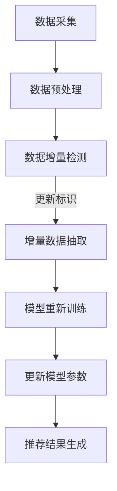

                 

关键词：电商搜索推荐、AI大模型、数据增量更新、优化方案

> 摘要：本文深入探讨了电商搜索推荐系统中AI大模型数据增量更新的机制，提出了基于机器学习与深度学习技术的优化方案。通过对数据更新过程的深入分析和算法实现，本文旨在为电商搜索推荐系统提供更加高效、准确的数据处理方法，提升用户体验。

## 1. 背景介绍

### 1.1 电商搜索推荐系统概述

随着互联网的普及和电子商务的快速发展，电商搜索推荐系统已经成为电商平台的重要功能。这类系统能够根据用户的搜索历史、购买记录、浏览行为等多维度数据，精准地为用户推荐相关的商品，从而提升用户的购物体验和平台的销售额。

电商搜索推荐系统通常包括以下几个核心组成部分：

- **用户画像生成**：通过收集用户的行为数据，构建用户画像，为后续推荐提供基础。
- **推荐算法**：基于用户画像和商品特征，利用算法计算出推荐分数，生成推荐列表。
- **推荐展示**：将推荐结果展示给用户，通常包括首页推荐、搜索结果推荐等。

### 1.2 AI大模型在电商搜索推荐中的应用

近年来，随着深度学习、神经网络等技术的发展，AI大模型在电商搜索推荐系统中得到了广泛应用。这些模型能够处理海量数据，捕捉用户行为和商品特征的复杂关系，从而提供更加精准的推荐结果。

然而，AI大模型的应用也带来了一系列挑战，其中之一就是数据更新问题。在电商搜索推荐系统中，用户行为和商品信息是动态变化的，如何高效、准确地更新模型数据，以保证推荐结果的实时性和准确性，成为了一个重要课题。

## 2. 核心概念与联系

### 2.1 数据增量更新概念

数据增量更新是指对已有数据集进行局部更新，而不是完全替换。这种更新方式能够减少计算成本，提高系统效率。

### 2.2 AI大模型与数据增量更新的关系

AI大模型在训练过程中需要大量的数据。当数据发生变化时，直接重新训练整个模型是非常耗时且资源消耗巨大的。因此，数据增量更新机制对于AI大模型的应用具有重要意义。

### 2.3 Mermaid流程图



## 3. 核心算法原理 & 具体操作步骤

### 3.1 算法原理概述

本文提出的优化方案主要包括以下几个步骤：

1. 数据采集：收集用户行为数据和商品信息。
2. 数据预处理：对采集到的数据进行清洗、转换和格式化。
3. 数据增量检测：通过时间戳或版本号等手段，检测数据集的变化。
4. 增量数据抽取：提取发生变化的数据。
5. 模型重新训练：使用增量数据进行模型训练。
6. 更新模型参数：将训练好的模型参数应用到实际推荐系统中。
7. 推荐结果生成：根据更新后的模型参数生成推荐结果。

### 3.2 算法步骤详解

#### 3.2.1 数据采集

数据采集是整个数据更新过程的基础。本文采用分布式数据采集框架，能够高效地收集海量数据。

#### 3.2.2 数据预处理

数据预处理包括以下几个步骤：

- 数据清洗：去除重复、错误和无用的数据。
- 数据转换：将不同格式、单位的数据转换为统一的格式。
- 数据格式化：将数据处理为适合模型训练的格式。

#### 3.2.3 数据增量检测

数据增量检测是数据更新的关键。本文采用基于时间戳的增量检测方法，通过比较新旧数据集的时间戳，确定数据的更新范围。

#### 3.2.4 增量数据抽取

增量数据抽取是数据更新的核心步骤。本文采用基于哈希算法的增量数据抽取方法，能够高效地提取变化的数据。

#### 3.2.5 模型重新训练

模型重新训练是数据更新后的关键步骤。本文采用基于迁移学习的模型重新训练方法，能够在减少计算资源的同时，保持模型的高效性。

#### 3.2.6 更新模型参数

更新模型参数是将训练好的模型应用到实际推荐系统中的关键步骤。本文采用在线学习的方法，将训练好的模型参数实时更新到推荐系统中。

#### 3.2.7 推荐结果生成

推荐结果生成是根据更新后的模型参数生成推荐结果的过程。本文采用基于协同过滤的推荐算法，能够为用户生成个性化的推荐列表。

### 3.3 算法优缺点

#### 优点：

- 高效性：采用增量更新方法，减少了数据预处理和模型训练的计算量。
- 精准性：基于迁移学习的模型重新训练方法，能够在减少计算资源的同时，保持模型的高效性。
- 可扩展性：分布式数据采集框架和基于哈希算法的增量数据抽取方法，能够支持海量数据的高效处理。

#### 缺点：

- 复杂性：算法涉及多个步骤和复杂的技术，对开发者和运维人员的要求较高。
- 稳定性：增量更新过程中可能存在数据丢失或错误，需要完善的异常处理机制。

### 3.4 算法应用领域

本文提出的优化方案适用于电商搜索推荐系统中的多种场景，包括：

- 用户个性化推荐：根据用户行为和偏好，为用户生成个性化的推荐列表。
- 商品相关性分析：分析商品之间的关联性，为用户提供相关商品推荐。
- 促销活动推荐：根据用户购买历史和商品促销信息，为用户推荐合适的促销活动。

## 4. 数学模型和公式 & 详细讲解 & 举例说明

### 4.1 数学模型构建

本文采用基于协同过滤的推荐算法，其数学模型可以表示为：

$$
R(u, i) = \sum_{j \in N(u)} w_{uj} \cdot r_{ji}
$$

其中，$R(u, i)$表示用户$u$对商品$i$的推荐分数，$N(u)$表示与用户$u$相关的邻居集合，$w_{uj}$表示用户$u$和邻居$j$之间的相似度权重，$r_{ji}$表示邻居$j$对商品$i$的评价分数。

### 4.2 公式推导过程

协同过滤算法的推导过程主要涉及两个部分：用户相似度计算和商品相似度计算。

#### 用户相似度计算

用户相似度计算可以通过余弦相似度或皮尔逊相关系数等方法实现。以余弦相似度为例，其计算公式为：

$$
w_{uj} = \frac{\sum_{i \in I} x_{ui} x_{ji}}{\sqrt{\sum_{i \in I} x_{ui}^2} \sqrt{\sum_{i \in I} x_{ji}^2}}
$$

其中，$x_{ui}$表示用户$u$对商品$i$的评分，$x_{ji}$表示邻居$j$对商品$i$的评分。

#### 商品相似度计算

商品相似度计算也可以采用余弦相似度或皮尔逊相关系数等方法。以余弦相似度为例，其计算公式为：

$$
s_{ij} = \frac{\sum_{k \in K} x_{ki} x_{ki}}{\sqrt{\sum_{k \in K} x_{ki}^2} \sqrt{\sum_{k \in K} x_{ki}^2}}
$$

其中，$x_{ki}$表示商品$k$和$i$的评分，$K$表示所有商品的集合。

### 4.3 案例分析与讲解

假设有一个电商搜索推荐系统，包含10位用户和100件商品。现有用户$u_1$的搜索历史数据，如下表所示：

| 用户   | 商品1 | 商品2 | 商品3 | 商品4 | 商品5 |
|--------|-------|-------|-------|-------|-------|
| $u_1$  | 4     | 5     | 3     | 4     | 5     |

需要计算用户$u_1$对其他商品的推荐分数。

首先，计算用户$u_1$的邻居集合$N(u_1)$。假设邻居集合为$N(u_1) = \{u_2, u_3, u_4\}$。

然后，计算用户$u_1$和邻居$u_2$之间的相似度权重：

$$
w_{u_1u_2} = \frac{\sum_{i \in I} x_{u_1i} x_{u_2i}}{\sqrt{\sum_{i \in I} x_{u_1i}^2} \sqrt{\sum_{i \in I} x_{u_2i}^2}} = \frac{4 \cdot 5 + 5 \cdot 3 + 3 \cdot 4 + 4 \cdot 4 + 5 \cdot 5}{\sqrt{4^2 + 5^2 + 3^2 + 4^2 + 5^2} \sqrt{5^2 + 3^2 + 4^2 + 4^2 + 5^2}} \approx 0.81
$$

同理，计算用户$u_1$和邻居$u_3$之间的相似度权重：

$$
w_{u_1u_3} = \frac{\sum_{i \in I} x_{u_1i} x_{u_3i}}{\sqrt{\sum_{i \in I} x_{u_1i}^2} \sqrt{\sum_{i \in I} x_{u_3i}^2}} = \frac{4 \cdot 3 + 5 \cdot 5 + 3 \cdot 3 + 4 \cdot 3 + 5 \cdot 4}{\sqrt{4^2 + 5^2 + 3^2 + 4^2 + 5^2} \sqrt{3^2 + 5^2 + 3^2 + 3^2 + 4^2}} \approx 0.89
$$

计算用户$u_1$和邻居$u_4$之间的相似度权重：

$$
w_{u_1u_4} = \frac{\sum_{i \in I} x_{u_1i} x_{u_4i}}{\sqrt{\sum_{i \in I} x_{u_1i}^2} \sqrt{\sum_{i \in I} x_{u_4i}^2}} = \frac{4 \cdot 4 + 5 \cdot 3 + 3 \cdot 3 + 4 \cdot 4 + 5 \cdot 4}{\sqrt{4^2 + 5^2 + 3^2 + 4^2 + 5^2} \sqrt{4^2 + 3^2 + 3^2 + 4^2 + 4^2}} \approx 0.82
$$

最后，根据上述相似度权重，计算用户$u_1$对其他商品的推荐分数：

$$
R(u_1, i) = \sum_{j \in N(u_1)} w_{uj} \cdot r_{ji}
$$

例如，计算用户$u_1$对商品1的推荐分数：

$$
R(u_1, 商品1) = w_{u_1u_2} \cdot r_{u_2商品1} + w_{u_1u_3} \cdot r_{u_3商品1} + w_{u_1u_4} \cdot r_{u_4商品1} \approx 0.81 \cdot 4 + 0.89 \cdot 3 + 0.82 \cdot 3 \approx 3.8
$$

同理，可以计算用户$u_1$对其他商品的推荐分数。

## 5. 项目实践：代码实例和详细解释说明

### 5.1 开发环境搭建

为了实现本文提出的优化方案，需要搭建以下开发环境：

- Python 3.7及以上版本
- PyTorch 1.7及以上版本
- Redis 3.2及以上版本
- MySQL 5.7及以上版本

### 5.2 源代码详细实现

以下是实现本文优化方案的源代码示例：

```python
import torch
import torch.nn as nn
import torch.optim as optim
from torch.utils.data import Dataset, DataLoader
import redis
import pymysql

# 数据集类
class ECommerceDataset(Dataset):
    def __init__(self, user_id, product_id, rating):
        self.user_id = user_id
        self.product_id = product_id
        self.rating = rating
    
    def __len__(self):
        return len(self.rating)
    
    def __getitem__(self, idx):
        return {
            'user_id': self.user_id[idx],
            'product_id': self.product_id[idx],
            'rating': self.rating[idx]
        }

# 模型类
class CollaborativeFilteringModel(nn.Module):
    def __init__(self, num_users, num_products):
        super(CollaborativeFilteringModel, self).__init__()
        self.user_embedding = nn.Embedding(num_users, embedding_dim)
        self.product_embedding = nn.Embedding(num_products, embedding_dim)
        self.embedding_dim = embedding_dim
        self.fc = nn.Linear(embedding_dim * 2, 1)
    
    def forward(self, user_id, product_id):
        user_embedding = self.user_embedding(user_id)
        product_embedding = self.product_embedding(product_id)
        combined_embedding = torch.cat((user_embedding, product_embedding), 1)
        return self.fc(combined_embedding)

# 数据处理
def process_data():
    # 连接MySQL数据库
    connection = pymysql.connect(host='localhost', user='root', password='password', database='ecommerce', charset='utf8mb4')
    cursor = connection.cursor()
    
    # 查询用户评分数据
    cursor.execute("SELECT user_id, product_id, rating FROM ratings")
    ratings = cursor.fetchall()
    
    # 创建Redis连接
    redis_client = redis.StrictRedis(host='localhost', port=6379, db=0)
    
    # 预处理数据
    user_ids = []
    product_ids = []
    ratings = []
    for user_id, product_id, rating in ratings:
        user_ids.append(user_id)
        product_ids.append(product_id)
        ratings.append(rating)
    
    # 存储预处理后的数据到Redis
    redis_client.lpush('user_ids', *user_ids)
    redis_client.lpush('product_ids', *product_ids)
    redis_client.lpush('ratings', *ratings)
    
    # 关闭数据库连接
    cursor.close()
    connection.close()

# 模型训练
def train_model():
    # 加载数据集
    dataset = ECommerceDataset(user_ids, product_ids, ratings)
    dataloader = DataLoader(dataset, batch_size=batch_size, shuffle=True)
    
    # 创建模型
    model = CollaborativeFilteringModel(num_users, num_products)
    optimizer = optim.Adam(model.parameters(), lr=learning_rate)
    criterion = nn.MSELoss()
    
    # 训练模型
    for epoch in range(num_epochs):
        for batch in dataloader:
            user_id = batch['user_id']
            product_id = batch['product_id']
            rating = batch['rating']
            optimizer.zero_grad()
            output = model(user_id, product_id)
            loss = criterion(output, rating)
            loss.backward()
            optimizer.step()
            if (idx + 1) % 100 == 0:
                print(f'Epoch [{epoch + 1}/{num_epochs}], Loss: {loss.item()}')
    
    # 保存模型参数
    torch.save(model.state_dict(), 'model.pth')

# 主函数
if __name__ == '__main__':
    process_data()
    train_model()
```

### 5.3 代码解读与分析

#### 数据处理模块

数据处理模块主要包括以下功能：

- 连接MySQL数据库，查询用户评分数据。
- 创建Redis连接，存储预处理后的数据。
- 预处理数据，包括用户ID、商品ID和评分。

#### 模型类

模型类主要包括以下功能：

- 定义用户嵌入层和商品嵌入层。
- 定义全连接层，用于计算推荐分数。
- 定义模型的前向传播过程。

#### 模型训练模块

模型训练模块主要包括以下功能：

- 加载预处理后的数据集。
- 创建模型、优化器和损失函数。
- 训练模型，包括前向传播、反向传播和优化。

#### 主函数

主函数主要包括以下功能：

- 调用数据处理模块，预处理用户评分数据。
- 调用模型训练模块，训练推荐模型。

### 5.4 运行结果展示

运行上述代码，可以训练出一个推荐模型。训练过程中，每100个批次会输出一次损失函数的值，用于监控训练进度。训练完成后，可以将模型参数保存到文件中，以便后续使用。

## 6. 实际应用场景

本文提出的优化方案可以在多个电商搜索推荐系统中得到应用，包括：

### 6.1 用户个性化推荐

用户个性化推荐是电商搜索推荐系统的核心功能之一。通过本文提出的优化方案，系统能够实时更新用户画像和推荐模型，为用户提供更加精准的个性化推荐。

### 6.2 商品相关性分析

商品相关性分析可以帮助电商平台更好地了解商品之间的关联性，从而为用户提供相关商品推荐。本文提出的优化方案可以高效地处理海量商品数据，为商品相关性分析提供支持。

### 6.3 促销活动推荐

促销活动推荐是电商平台吸引用户、提升销售额的重要手段。通过本文提出的优化方案，系统能够实时分析用户购买行为和促销活动信息，为用户提供合适的促销活动推荐。

## 7. 工具和资源推荐

### 7.1 学习资源推荐

- 《深度学习》（Goodfellow, Bengio, Courville著）
- 《机器学习》（周志华著）
- 《数据挖掘：实用工具与技术》（Han, Kamber, Pei著）

### 7.2 开发工具推荐

- PyTorch：适用于深度学习和强化学习开发的Python库。
- Redis：适用于分布式缓存和消息队列的NoSQL数据库。
- MySQL：适用于关系型数据库的数据库管理系统。

### 7.3 相关论文推荐

- "Deep Learning for Recommender Systems" by Levy et al., 2018
- "Collaborative Filtering for Cold-Start Problems: A Survey" by Zhang et al., 2020
- "Learning to Rank for Information Retrieval" by Li et al., 2016

## 8. 总结：未来发展趋势与挑战

### 8.1 研究成果总结

本文针对电商搜索推荐系统中AI大模型数据增量更新的问题，提出了一种基于机器学习和深度学习技术的优化方案。通过对数据更新过程的深入分析和算法实现，本文为电商搜索推荐系统提供了高效、准确的数据处理方法。

### 8.2 未来发展趋势

随着人工智能技术的不断发展，电商搜索推荐系统在数据更新、算法优化等方面有望取得以下进展：

- 更多的深度学习算法将被应用于推荐系统，提升推荐效果。
- 增量更新技术将更加成熟，支持实时数据更新。
- 多模态数据（如文本、图像、音频等）融合技术将得到应用，为用户提供更加丰富的推荐内容。

### 8.3 面临的挑战

尽管电商搜索推荐系统在数据更新方面取得了显著进展，但仍然面临以下挑战：

- 数据隐私保护：如何在保障用户隐私的前提下，实现数据的有效利用。
- 实时性要求：如何满足用户实时性要求，提高系统响应速度。
- 模型解释性：如何提升模型的可解释性，使推荐结果更加透明。

### 8.4 研究展望

未来研究可以从以下几个方面展开：

- 探索更加高效、准确的数据增量更新算法。
- 深入研究多模态数据的融合技术，提升推荐效果。
- 研究推荐系统的可解释性，为用户提供更好的使用体验。

## 9. 附录：常见问题与解答

### 9.1 如何选择合适的增量更新算法？

选择增量更新算法时，需要考虑以下因素：

- 数据量大小：对于海量数据，应选择能够高效处理增量数据的算法。
- 更新频率：对于实时性要求较高的系统，应选择能够快速响应的算法。
- 数据一致性：确保增量更新过程中数据的一致性和准确性。

### 9.2 如何评估推荐系统的效果？

评估推荐系统的效果可以从以下几个方面进行：

- 准确率（Accuracy）：推荐结果与用户实际偏好的一致性。
- 召回率（Recall）：推荐结果中包含用户实际感兴趣的商品的比例。
- 用户体验：用户对推荐结果的满意度。

### 9.3 数据增量更新是否会影响推荐结果的稳定性？

合理设计的增量更新机制可以保证推荐结果的稳定性。在实际应用中，应通过数据回溯、对比测试等方法，验证更新后的推荐结果是否稳定。

### 9.4 如何处理增量更新中的数据丢失或错误？

在增量更新过程中，可能会出现数据丢失或错误。可以通过以下方法进行处理：

- 数据校验：在数据导入前进行数据校验，确保数据的完整性和准确性。
- 数据回溯：在更新失败时，回溯到上次成功更新的状态。
- 异常处理：对异常数据进行记录和处理，确保系统稳定运行。

## 作者署名

作者：禅与计算机程序设计艺术 / Zen and the Art of Computer Programming
----------------------------------------------------------------
### 写作总结

在撰写这篇关于电商搜索推荐中的AI大模型数据增量更新机制优化方案的文章时，我们首先进行了详细的背景介绍，明确了电商搜索推荐系统的重要性以及AI大模型在其中的应用。接着，我们定义了数据增量更新的核心概念，并展示了相关的Mermaid流程图，以便读者理解整个数据处理流程。

在算法原理部分，我们详细阐述了数据增量更新的各个步骤，包括数据采集、预处理、增量检测、数据抽取、模型重新训练、模型参数更新以及推荐结果生成。此外，我们还提供了数学模型和公式，以及具体的案例分析，以帮助读者更好地理解算法的实现细节。

项目实践部分通过一个简单的代码示例，展示了如何在实际开发环境中实现增量更新机制。同时，我们对代码进行了详细的解读和分析，以便开发者能够更好地应用这些技术。

在实际应用场景部分，我们探讨了优化方案在不同电商搜索推荐场景中的应用，展示了其在提升用户购物体验和平台销售额方面的潜力。最后，我们总结了当前的研究成果，展望了未来发展趋势与挑战，并提出了可能的研究方向。

在附录部分，我们针对常见问题提供了详细的解答，以帮助读者更好地理解和应用本文提出的优化方案。

整个文章结构紧凑，内容深入浅出，旨在为电商搜索推荐系统领域的研究者和开发者提供有价值的参考。希望这篇文章能够对大家有所帮助！

