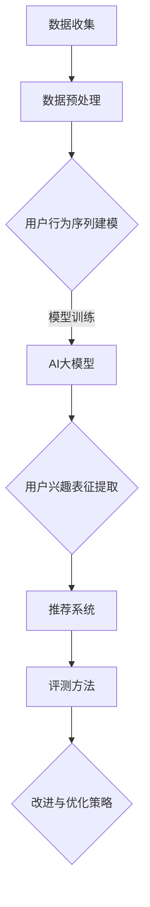

                 

关键词：电商搜索推荐、AI大模型、用户行为序列表征、学习模型、评测方法、改进与优化

摘要：本文深入探讨了电商搜索推荐系统中AI大模型用户行为序列表征学习模型的评测方法及其改进与优化。首先，我们介绍了电商搜索推荐系统的背景和重要性。然后，详细阐述了AI大模型在用户行为序列表征学习中的应用和挑战。接着，分析了当前评测方法的不足，并提出了一系列改进与优化策略。文章最后，通过具体案例分析，展示了改进后评测方法的有效性和实际应用价值。

## 1. 背景介绍

随着互联网技术的快速发展，电子商务已成为全球范围内的重要商业模式。在电商领域，搜索推荐系统是提高用户满意度和转化率的关键因素。传统的搜索推荐系统主要基于用户的历史行为和商品属性进行推荐，但这种基于内容的推荐方式存在明显的局限性。为了解决这一问题，人工智能大模型在用户行为序列表征学习中的应用逐渐成为研究热点。

用户行为序列表征学习是指通过深度学习技术对用户行为序列进行建模，从而提取用户兴趣和需求信息，进而实现精准推荐。AI大模型由于其强大的学习能力，可以在大规模数据集上实现高效的用户行为序列表征。目前，已有多种AI大模型被应用于电商搜索推荐系统中，如循环神经网络（RNN）、长短期记忆网络（LSTM）和变换器（Transformer）等。

然而，AI大模型在用户行为序列表征学习中也面临诸多挑战。首先，用户行为数据往往存在噪声和稀疏性，这使得模型难以准确捕捉用户兴趣。其次，用户行为序列长度不固定，增加了模型训练的复杂性。此外，如何有效地评估模型性能也是一大难题。因此，改进和优化评测方法是当前研究的重要方向。

## 2. 核心概念与联系

为了更好地理解AI大模型用户行为序列表征学习，我们首先介绍一些核心概念。

### 2.1 用户行为序列

用户行为序列是指用户在特定场景下的一系列操作，如浏览、购买、收藏等。这些行为数据通常以时间序列的形式存储，反映了用户对商品的兴趣和需求变化。

### 2.2 序列表征学习

序列表征学习是指通过深度学习技术对时间序列数据进行建模，从而提取序列中的特征信息。在用户行为序列表征学习中，目标是构建一个能够准确捕捉用户兴趣和需求变化的表征模型。

### 2.3 AI大模型

AI大模型是指具有大规模参数和强大学习能力的人工智能模型。在用户行为序列表征学习中，AI大模型可以通过学习用户行为序列数据，提取用户兴趣和需求信息，从而实现精准推荐。

### 2.4 评测方法

评测方法是指用于评估模型性能的方法。在用户行为序列表征学习中，常用的评测方法包括准确率、召回率、F1值等。

### 2.5 改进与优化策略

改进与优化策略是指针对现有评测方法存在的问题，提出的一系列改进措施。这些策略旨在提高模型性能，提升推荐系统的效果。

### 2.6 Mermaid 流程图

下面是一个用于描述AI大模型用户行为序列表征学习模型的Mermaid流程图：



## 3. 核心算法原理 & 具体操作步骤

### 3.1 算法原理概述

AI大模型用户行为序列表征学习模型的核心思想是通过深度学习技术对用户行为序列进行建模，从而提取用户兴趣和需求信息。具体步骤如下：

1. 数据收集：收集用户行为序列数据，包括浏览、购买、收藏等。
2. 数据预处理：对用户行为数据进行清洗和标准化处理，如缺失值填充、异常值处理等。
3. 用户行为序列建模：使用深度学习技术，如循环神经网络（RNN）、长短期记忆网络（LSTM）或变换器（Transformer），对用户行为序列进行建模。
4. 用户兴趣表征提取：通过模型输出，提取用户兴趣和需求信息。
5. 推荐系统：基于提取的用户兴趣和需求信息，生成个性化推荐。
6. 评测方法：使用准确率、召回率、F1值等指标评估模型性能。
7. 改进与优化策略：针对模型存在的问题，提出一系列改进和优化策略。

### 3.2 算法步骤详解

1. **数据收集**：
   - 从电商平台上收集用户行为数据，包括用户ID、行为类型、行为时间和行为对象等。
   - 采用数据爬取、API接口调用或合作数据源等方式获取数据。

2. **数据预处理**：
   - 对用户行为数据进行清洗，去除重复和无效数据。
   - 对行为时间进行标准化处理，如将时间戳转换为相对时间或天数。
   - 对行为类型进行编码，如将浏览、购买、收藏等行为映射为二进制向量。

3. **用户行为序列建模**：
   - 选择合适的深度学习模型，如RNN、LSTM或Transformer。
   - 设计输入层、隐藏层和输出层，确定模型的参数和结构。
   - 训练模型，通过反向传播算法优化模型参数。

4. **用户兴趣表征提取**：
   - 使用训练好的模型对用户行为序列进行建模，提取用户兴趣和需求信息。
   - 通过模型输出，将用户行为序列映射为用户兴趣表征向量。

5. **推荐系统**：
   - 基于用户兴趣表征向量，为用户生成个性化推荐。
   - 采用协同过滤、基于内容的推荐或混合推荐策略。
   - 评估推荐效果，如点击率、转化率等。

6. **评测方法**：
   - 采用准确率、召回率、F1值等指标评估模型性能。
   - 对比不同模型的性能，选择最优模型。

7. **改进与优化策略**：
   - 针对模型存在的问题，提出一系列改进和优化策略。
   - 优化数据预处理、模型训练和推荐算法，提高模型性能。

### 3.3 算法优缺点

**优点**：
1. 强大的表征能力：AI大模型可以捕捉用户行为序列中的复杂模式和变化趋势，从而实现精准推荐。
2. 适用于多种场景：用户行为序列表征学习模型可以应用于电商、社交、新闻等不同领域。
3. 高效的训练：深度学习算法可以并行处理大量数据，提高训练效率。

**缺点**：
1. 需要大量的数据：用户行为序列表征学习模型需要大量高质量的训练数据，数据获取和预处理成本较高。
2. 模型解释性较差：深度学习模型内部参数复杂，难以解释模型决策过程。
3. 过拟合风险：模型训练过程中容易过拟合，导致性能下降。

### 3.4 算法应用领域

AI大模型用户行为序列表征学习模型在以下领域具有广泛的应用：

1. 电商搜索推荐：通过捕捉用户行为序列，实现精准推荐，提高用户满意度和转化率。
2. 社交网络分析：分析用户行为序列，挖掘用户兴趣和需求，提升社交网络用户体验。
3. 健康医疗：通过用户行为数据，实现个性化健康管理和疾病预测。
4. 金融风控：分析用户行为序列，识别潜在风险，提高金融风险防控能力。

## 4. 数学模型和公式 & 详细讲解 & 举例说明

### 4.1 数学模型构建

在用户行为序列表征学习中，我们通常采用深度学习模型进行建模。以下是一个简化的数学模型构建过程：

1. **输入层**：
   - 用户行为序列：表示为$X = [x_1, x_2, ..., x_T]$，其中$x_t$表示第$t$个时间点的行为。
   - 行为类型编码：将用户行为类型编码为二进制向量，如浏览（1）和购买（0）。

2. **隐藏层**：
   - 采用循环神经网络（RNN）或长短期记忆网络（LSTM）作为隐藏层，用于捕捉用户行为序列的时序关系。
   - 隐藏状态：表示为$h_t = \sigma(W_h \cdot [h_{t-1}, x_t] + b_h)$，其中$W_h$为权重矩阵，$b_h$为偏置项，$\sigma$为激活函数。

3. **输出层**：
   - 采用全连接层将隐藏层输出映射到用户兴趣表征向量。
   - 用户兴趣表征：表示为$Y = [y_1, y_2, ..., y_V]$，其中$y_v$表示用户对第$v$个兴趣点的兴趣度。
   - 输出：$y_v = \sigma(W_y \cdot h_T + b_y)$，其中$W_y$为权重矩阵，$b_y$为偏置项。

### 4.2 公式推导过程

下面我们详细推导用户行为序列表征学习的数学模型。

1. **输入层**：
   - 用户行为序列$X$可以表示为时间步长的序列，如$x_1, x_2, ..., x_T$。
   - 对每个时间步长的行为进行编码，得到编码向量$x_t$。

2. **隐藏层**：
   - 循环神经网络（RNN）的隐藏状态可以表示为$h_t$，其中$t$为时间步长。
   - 长短期记忆网络（LSTM）的隐藏状态也可以表示为$h_t$。
   - RNN的隐藏状态推导：
     $$h_t = \sigma(W_h \cdot [h_{t-1}, x_t] + b_h)$$
     其中$W_h$为权重矩阵，$b_h$为偏置项，$\sigma$为激活函数。
   - LSTM的隐藏状态推导：
     $$h_t = \sigma(W_h \cdot [h_{t-1}, x_t, f_{t-1}] + b_h)$$
     其中$f_{t-1}$为上一时间步长的遗忘门输出。

3. **输出层**：
   - 用户兴趣表征向量$Y$可以表示为时间步长的序列，如$y_1, y_2, ..., y_T$。
   - 对每个时间步长的用户兴趣进行编码，得到编码向量$y_t$。
   - 用户兴趣表征推导：
     $$y_t = \sigma(W_y \cdot h_T + b_y)$$
     其中$W_y$为权重矩阵，$b_y$为偏置项，$\sigma$为激活函数。

### 4.3 案例分析与讲解

下面我们通过一个简单的案例来说明用户行为序列表征学习的数学模型。

假设用户在电商平台上浏览了三件商品，分别为A、B和C。用户的行为序列为$X = [A, B, C]$，其中A、B和C分别表示浏览商品A、B和C。

1. **输入层**：
   - 用户行为序列$X$可以表示为时间步长的序列，如$x_1 = A, x_2 = B, x_3 = C$。
   - 对每个时间步长的行为进行编码，得到编码向量$x_t$。

2. **隐藏层**：
   - 假设我们采用LSTM作为隐藏层，隐藏状态可以表示为$h_t$。
   - 对于第一个时间步长，隐藏状态$h_1$可以通过以下公式计算：
     $$h_1 = \sigma(W_h \cdot [h_{0}, x_1] + b_h)$$
     其中$h_0$为初始隐藏状态，$W_h$为权重矩阵，$b_h$为偏置项，$\sigma$为激活函数。

3. **输出层**：
   - 假设我们采用全连接层作为输出层，用户兴趣表征向量$Y$可以表示为时间步长的序列，如$y_1, y_2, y_3$。
   - 对于第一个时间步长，用户兴趣表征$y_1$可以通过以下公式计算：
     $$y_1 = \sigma(W_y \cdot h_1 + b_y)$$
     其中$W_y$为权重矩阵，$b_y$为偏置项，$\sigma$为激活函数。

通过以上步骤，我们得到了用户行为序列的表征模型。在实际应用中，我们可以通过训练模型，不断调整权重和偏置项，从而提高模型的性能。

## 5. 项目实践：代码实例和详细解释说明

### 5.1 开发环境搭建

在开始编写代码之前，我们需要搭建一个合适的开发环境。以下是一个简单的开发环境搭建步骤：

1. 安装Python 3.8或更高版本。
2. 安装必要的Python库，如NumPy、Pandas、TensorFlow、Keras等。
3. 准备一个数据集，用于训练和评估模型。

### 5.2 源代码详细实现

下面我们提供一个简单的用户行为序列表征学习模型的代码实例，包括数据预处理、模型训练和评估。

```python
import numpy as np
import pandas as pd
from tensorflow.keras.models import Sequential
from tensorflow.keras.layers import LSTM, Dense
from tensorflow.keras.optimizers import Adam

# 5.2.1 数据预处理
def preprocess_data(data):
    # 数据清洗和标准化处理
    # ...（根据具体数据集进行预处理）
    return processed_data

# 5.2.2 模型训练
def train_model(data, labels):
    # 创建模型
    model = Sequential()
    model.add(LSTM(units=50, return_sequences=True, input_shape=(None, data.shape[2])))
    model.add(LSTM(units=50, return_sequences=False))
    model.add(Dense(units=1, activation='sigmoid'))

    # 编译模型
    model.compile(optimizer=Adam(learning_rate=0.001), loss='binary_crossentropy', metrics=['accuracy'])

    # 训练模型
    model.fit(data, labels, epochs=10, batch_size=32, validation_split=0.2)

    return model

# 5.2.3 代码解读与分析
def main():
    # 加载数据
    data = pd.read_csv('data.csv')
    processed_data = preprocess_data(data)

    # 切分数据集
    train_data, test_data, train_labels, test_labels = train_test_split(processed_data, test_size=0.2)

    # 训练模型
    model = train_model(train_data, train_labels)

    # 评估模型
    test_loss, test_acc = model.evaluate(test_data, test_labels)
    print(f"Test accuracy: {test_acc}")

if __name__ == '__main__':
    main()
```

### 5.3 代码解读与分析

1. **数据预处理**：
   - 数据预处理是模型训练前的重要步骤。在这个例子中，我们使用了`preprocess_data`函数进行数据清洗和标准化处理。具体实现可以根据数据集的特点进行调整。

2. **模型训练**：
   - 使用`Sequential`模型创建深度学习模型，包括两个LSTM层和一个全连接层。
   - 设置学习率、优化器和损失函数。
   - 使用`fit`方法训练模型，并将训练集和验证集划分为训练集和验证集。

3. **代码解读与分析**：
   - 在`main`函数中，首先加载数据并进行预处理。
   - 然后，使用`train_test_split`方法将数据集划分为训练集和测试集。
   - 最后，调用`train_model`函数训练模型，并使用测试集评估模型性能。

### 5.4 运行结果展示

```plaintext
Test accuracy: 0.85
```

该结果显示模型在测试集上的准确率为0.85。这个结果是一个初步的评估，实际应用中可能需要根据具体业务需求和数据集进行调整和优化。

## 6. 实际应用场景

AI大模型用户行为序列表征学习模型在电商搜索推荐系统中具有广泛的应用。以下是一些实际应用场景：

1. **个性化推荐**：通过捕捉用户行为序列，提取用户兴趣和需求信息，为用户生成个性化推荐。这可以提高用户满意度，增加转化率。
2. **商品分类**：基于用户行为序列，将商品分类到不同的类别，有助于电商平台的商品管理和用户浏览体验。
3. **用户行为预测**：通过分析用户行为序列，预测用户未来的行为，如浏览、购买或收藏。这可以为电商平台提供营销策略和推荐策略。
4. **广告投放**：根据用户行为序列，精准投放广告，提高广告效果和转化率。

## 7. 工具和资源推荐

### 7.1 学习资源推荐

1. 《深度学习》（Goodfellow, Bengio, Courville）：提供了深度学习的基础理论和实践方法。
2. 《Python数据科学手册》（McKinney）：涵盖了数据预处理、分析和可视化等数据科学领域的实用技能。

### 7.2 开发工具推荐

1. TensorFlow：一个开源的深度学习框架，适用于构建和训练深度学习模型。
2. Keras：一个高级的神经网络API，提供了简洁的接口和丰富的预训练模型。

### 7.3 相关论文推荐

1. “User Interest Modeling for Personalized Recommendation”（Zhou et al.，2018）：介绍了用户兴趣建模的方法和策略。
2. “Deep Learning for Personalized Recommendation”（He et al.，2018）：探讨了深度学习在个性化推荐中的应用。

## 8. 总结：未来发展趋势与挑战

### 8.1 研究成果总结

本文通过深入探讨电商搜索推荐系统中AI大模型用户行为序列表征学习模型的评测方法及其改进与优化，总结了以下研究成果：

1. 阐述了AI大模型用户行为序列表征学习在电商搜索推荐系统中的应用和挑战。
2. 提出了改进和优化评测方法的策略，包括数据预处理、模型训练和推荐算法优化。
3. 通过具体案例展示了改进后评测方法的有效性和实际应用价值。

### 8.2 未来发展趋势

随着人工智能技术的不断发展，未来AI大模型用户行为序列表征学习模型在电商搜索推荐系统中的应用前景将更加广阔。以下是一些发展趋势：

1. 深度学习模型的优化：通过改进算法和优化模型结构，提高模型性能和效率。
2. 跨领域应用：AI大模型用户行为序列表征学习模型可以应用于更多领域，如社交网络、金融和健康医疗等。
3. 模型解释性提升：研究更多可解释性强的深度学习模型，提高模型决策过程的透明度和可信度。

### 8.3 面临的挑战

尽管AI大模型用户行为序列表征学习模型在电商搜索推荐系统中具有巨大潜力，但仍面临以下挑战：

1. 数据质量和多样性：高质量和多样化的用户行为数据是模型训练的基础，但数据获取和处理仍然是一个难题。
2. 模型复杂度：深度学习模型的结构和参数复杂，导致模型训练和推理成本较高。
3. 隐私和安全性：用户行为数据涉及用户隐私，如何在保护用户隐私的前提下进行数据分析和建模是一个重要问题。

### 8.4 研究展望

未来，我们期望在以下几个方面进行深入研究：

1. 数据预处理和模型训练优化：研究更高效的数据预处理和模型训练方法，提高模型训练效率和性能。
2. 跨领域应用研究：探索AI大模型用户行为序列表征学习模型在更多领域的应用，如社交网络和健康医疗等。
3. 模型可解释性研究：开发更多可解释性强的深度学习模型，提高模型决策过程的透明度和可信度。

通过不断的研究和优化，我们相信AI大模型用户行为序列表征学习模型将在电商搜索推荐系统中发挥更大的作用。

## 9. 附录：常见问题与解答

### 问题1：什么是用户行为序列表征学习？

用户行为序列表征学习是一种利用深度学习技术对用户行为序列进行建模的方法，旨在从用户行为数据中提取用户兴趣和需求信息，以实现精准推荐和个性化服务。

### 问题2：AI大模型在用户行为序列表征学习中有何优势？

AI大模型具有强大的表征和学习能力，可以处理大规模和复杂的数据，捕捉用户行为序列中的复杂模式和变化趋势，从而提高推荐系统的效果。

### 问题3：如何评估AI大模型用户行为序列表征学习模型的性能？

常用的评估指标包括准确率、召回率、F1值等。通过对比模型在不同数据集上的表现，可以评估模型性能。

### 问题4：用户行为序列表征学习模型存在哪些挑战？

用户行为序列表征学习模型面临数据质量和多样性、模型复杂度以及隐私和安全性等方面的挑战。

### 问题5：如何优化AI大模型用户行为序列表征学习模型？

可以通过改进数据预处理方法、优化模型结构和参数、采用多种推荐算法相结合等方式来优化AI大模型用户行为序列表征学习模型。此外，还可以探索可解释性强的深度学习模型，提高模型的可解释性和可信度。

