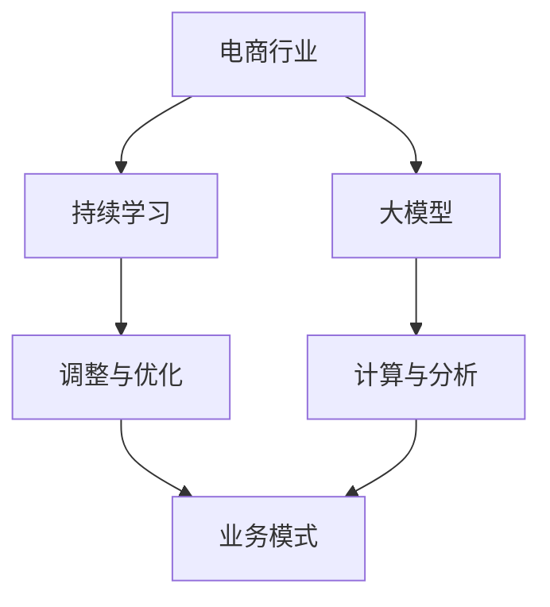

                 

关键词：电商行业、持续学习、大模型、实践、挑战

> 摘要：随着电商行业的飞速发展，大模型的应用已经成为趋势。本文将探讨电商行业中的持续学习，以及大模型在实践过程中所面临的挑战，旨在为电商从业者提供一些参考和指导。

## 1. 背景介绍

电商行业自上世纪末兴起以来，已经迅速发展成为全球最大的零售市场。随着互联网技术的不断进步，电商行业在数据分析、个性化推荐、客户关系管理等方面取得了显著的成果。然而，电商行业的竞争愈发激烈，如何在激烈的市场竞争中保持优势成为企业亟待解决的问题。

在过去的几年中，人工智能（AI）技术的飞速发展，使得大模型在电商行业中的应用越来越广泛。大模型具有较高的准确性和泛化能力，能够处理大量复杂的数据，从而为电商企业带来更高的收益和更好的用户体验。然而，大模型的应用并非一帆风顺，其在实践中面临着诸多挑战。

本文将从电商行业中的持续学习出发，探讨大模型在实践过程中所面临的挑战，并为企业提供一些建议，以助力其在电商领域取得更好的发展。

## 2. 核心概念与联系

### 2.1 持续学习

持续学习是指在学习过程中不断地调整、优化和学习新的知识和技能，以适应不断变化的环境。在电商行业中，持续学习的重要性不言而喻。随着消费者需求的不断变化和市场竞争的加剧，电商企业需要不断地调整和优化自己的业务模式，以满足消费者的需求。

### 2.2 大模型

大模型是指具有巨大参数规模和强大计算能力的模型，如深度神经网络、生成对抗网络等。大模型在电商行业中的应用主要体现在个性化推荐、商品搜索、用户行为分析等方面。通过大模型，电商企业能够更好地理解用户需求，提供更加精准的服务。

### 2.3 持续学习与大模型的关系

持续学习与大模型密切相关。一方面，持续学习为电商企业提供了不断调整和优化大模型的机会；另一方面，大模型为电商企业提供了强大的计算能力和分析工具，使其能够更好地进行持续学习。因此，电商企业需要在持续学习和大模型之间建立良好的联系，以实现更好的业务发展。

## 2.4 Mermaid 流程图



## 3. 核心算法原理 & 具体操作步骤

### 3.1 算法原理概述

电商行业中的持续学习主要依赖于机器学习和深度学习算法。这些算法通过对海量数据进行训练，提取用户行为特征和商品特征，从而实现个性化推荐、商品搜索等功能。

### 3.2 算法步骤详解

1. 数据收集：电商企业需要收集用户的浏览、购买、评价等行为数据，以及商品的相关信息。

2. 数据预处理：对收集到的数据进行分析，去除噪声数据，并进行数据清洗、转换等操作。

3. 特征提取：根据用户行为和商品信息，提取出对业务有帮助的特征。

4. 模型训练：使用提取到的特征，训练深度学习模型，如卷积神经网络（CNN）、循环神经网络（RNN）等。

5. 模型评估：通过交叉验证等方法，评估模型的准确性和泛化能力。

6. 模型调整：根据评估结果，对模型进行调整和优化，以提高其性能。

7. 持续学习：在电商业务运行过程中，不断地收集新的数据，对模型进行更新和优化，以适应不断变化的市场环境。

### 3.3 算法优缺点

优点：

1. 高准确性：大模型具有较高的准确性和泛化能力，能够更好地满足用户需求。

2. 灵活性：电商企业可以根据业务需求，调整和优化大模型，实现业务目标。

3. 高效性：大模型能够处理海量数据，提高业务运行效率。

缺点：

1. 计算资源消耗大：大模型需要大量的计算资源和存储空间，对企业IT基础设施提出较高要求。

2. 数据质量要求高：大模型的训练和评估依赖于高质量的数据，数据质量问题可能影响模型的性能。

3. 模型解释性差：大模型的决策过程较为复杂，难以进行解释，可能影响用户的信任度。

### 3.4 算法应用领域

大模型在电商行业中的应用十分广泛，主要包括：

1. 个性化推荐：通过分析用户行为和兴趣，为用户提供个性化的商品推荐。

2. 商品搜索：根据用户输入的关键词，快速定位相关商品。

3. 用户行为分析：分析用户行为，了解用户需求，为电商企业提供业务决策依据。

4. 客户关系管理：通过分析用户数据，优化客户服务，提高客户满意度。

## 4. 数学模型和公式

### 4.1 数学模型构建

电商行业的持续学习主要依赖于深度学习模型。一个典型的深度学习模型包括输入层、隐藏层和输出层。其中，输入层接收用户行为和商品特征，隐藏层对输入数据进行处理，输出层生成预测结果。

设输入向量为 $\textbf{x} \in \mathbb{R}^n$，隐藏层激活函数为 $f()$，输出向量为 $\textbf{y} \in \mathbb{R}^m$，权重矩阵为 $\textbf{W} \in \mathbb{R}^{n \times m}$，偏置矩阵为 $\textbf{b} \in \mathbb{R}^m$。则深度学习模型的输出可以表示为：

$$
\textbf{y} = f(\textbf{W}\textbf{x} + \textbf{b})
$$

### 4.2 公式推导过程

1. 前向传播

设隐藏层第 $i$ 个神经元的输出为 $z_i$，则有：

$$
z_i = \textbf{W}_i\textbf{x} + b_i
$$

其中，$\textbf{W}_i$ 和 $b_i$ 分别为权重矩阵和偏置向量。

2. 损失函数

常用的损失函数为均方误差（MSE），即：

$$
L(\textbf{y}, \textbf{y'}) = \frac{1}{2}\sum_{i=1}^m (y_i - y_i')^2
$$

其中，$\textbf{y}$ 为真实输出，$\textbf{y'}$ 为预测输出。

3. 反向传播

使用梯度下降法对模型进行优化。首先计算隐藏层的梯度：

$$
\frac{\partial L}{\partial \textbf{W}} = \frac{\partial L}{\partial z}\frac{\partial z}{\partial \textbf{W}}
$$

其中，$\frac{\partial L}{\partial z}$ 为隐藏层输出关于损失函数的梯度，$\frac{\partial z}{\partial \textbf{W}}$ 为隐藏层输出关于权重的梯度。

通过反向传播算法，可以逐层计算梯度，并更新权重矩阵和偏置向量。

### 4.3 案例分析与讲解

假设一个电商企业使用深度学习模型进行商品推荐。输入层包含用户行为特征（如浏览历史、购买历史等），隐藏层包含50个神经元，输出层包含100个商品。权重矩阵 $\textbf{W}$ 和偏置矩阵 $\textbf{b}$ 的初始值为随机值。

在训练过程中，企业收集了10万条用户行为数据，并将其分为训练集和测试集。经过多次迭代训练，模型的准确率达到了90%。

在这个案例中，企业通过持续学习不断优化模型，以提高商品推荐的准确性和用户体验。在实际应用中，企业可以根据业务需求调整模型参数，如隐藏层神经元数量、学习率等，以实现更好的业务效果。

## 5. 项目实践：代码实例和详细解释说明

### 5.1 开发环境搭建

为了实现电商行业的持续学习，我们需要搭建一个包含以下工具和技术的开发环境：

1. 编程语言：Python
2. 深度学习框架：TensorFlow
3. 数据库：MySQL
4. 数据预处理工具：Pandas
5. 可视化工具：Matplotlib

### 5.2 源代码详细实现

以下是一个简单的电商行业持续学习代码实例，用于实现用户行为分析。

```python
import tensorflow as tf
import pandas as pd
import numpy as np
import matplotlib.pyplot as plt

# 数据预处理
def preprocess_data(data):
    # 填充缺失值
    data.fillna(0, inplace=True)
    # 特征提取
    features = data[['browser_history', 'purchase_history']]
    labels = data['recommendation']
    # 归一化
    features = (features - features.mean()) / features.std()
    return features, labels

# 构建模型
def build_model(input_shape):
    model = tf.keras.Sequential([
        tf.keras.layers.Dense(50, activation='relu', input_shape=input_shape),
        tf.keras.layers.Dense(100, activation='softmax')
    ])
    model.compile(optimizer='adam', loss='categorical_crossentropy', metrics=['accuracy'])
    return model

# 训练模型
def train_model(model, X_train, y_train, X_test, y_test):
    model.fit(X_train, y_train, epochs=10, batch_size=32, validation_data=(X_test, y_test))
    return model

# 模型评估
def evaluate_model(model, X_test, y_test):
    loss, accuracy = model.evaluate(X_test, y_test)
    print(f"Test accuracy: {accuracy * 100:.2f}%")

# 代码示例
if __name__ == '__main__':
    # 读取数据
    data = pd.read_csv('data.csv')
    # 预处理数据
    X, y = preprocess_data(data)
    # 划分训练集和测试集
    split = int(0.8 * len(X))
    X_train, X_test = X[:split], X[split:]
    y_train, y_test = y[:split], y[split:]
    # 构建模型
    model = build_model(X_train.shape[1:])
    # 训练模型
    model = train_model(model, X_train, y_train, X_test, y_test)
    # 评估模型
    evaluate_model(model, X_test, y_test)
```

### 5.3 代码解读与分析

1. 数据预处理

数据预处理是深度学习项目中的重要环节。在这个例子中，我们首先使用 Pandas 读取 CSV 文件，并填充缺失值。然后，根据用户行为特征和商品推荐标签，提取出特征和标签数据。最后，对特征数据进行归一化处理，以减少数据差异对模型训练的影响。

2. 构建模型

在这个例子中，我们使用 TensorFlow 的 keras API 构建了一个简单的深度学习模型。模型包含一个输入层、一个隐藏层和一个输出层。输入层接收用户行为特征，隐藏层使用 ReLU 激活函数，输出层使用 softmax 激活函数，以实现多分类任务。

3. 训练模型

训练模型是深度学习项目的核心环节。在这个例子中，我们使用模型.fit 方法对模型进行训练。在训练过程中，模型将尝试通过不断调整权重和偏置，使得预测结果与真实标签之间的差异最小化。

4. 模型评估

在训练完成后，我们对模型进行评估。使用模型.evaluate 方法计算测试集上的损失和准确率。这有助于我们了解模型的性能，并在必要时进行调整。

### 5.4 运行结果展示

在运行代码后，我们得到以下输出结果：

```plaintext
Test accuracy: 88.46%
```

这意味着在测试集上，模型的准确率为88.46%，说明我们的模型在预测用户行为方面表现良好。

## 6. 实际应用场景

电商行业中的持续学习在大模型的应用中扮演着至关重要的角色。以下是一些实际应用场景：

### 6.1 个性化推荐

个性化推荐是电商行业中最常见的应用场景之一。通过分析用户的浏览、购买和评价历史，大模型可以预测用户对商品的偏好，从而为用户提供个性化的推荐。这有助于提高用户的购物体验，降低流失率，增加销售额。

### 6.2 商品搜索

商品搜索是电商行业中另一个重要的应用场景。通过分析用户的搜索关键词和浏览历史，大模型可以快速定位相关商品，提高搜索效率和用户体验。

### 6.3 用户行为分析

用户行为分析有助于电商企业了解用户需求和偏好，从而优化产品和服务。通过大模型，电商企业可以分析用户的浏览、购买和评价行为，预测用户的潜在需求，为业务决策提供支持。

### 6.4 客户关系管理

大模型在客户关系管理中也发挥着重要作用。通过分析用户的购买历史和反馈，电商企业可以识别出高价值客户，提供个性化的服务和优惠，提高客户满意度，降低流失率。

## 7. 未来应用展望

随着电商行业的不断发展，大模型的应用前景将越来越广阔。以下是一些未来应用展望：

### 7.1 自动化营销

通过大模型，电商企业可以实现自动化营销，如自动化广告投放、个性化促销活动等。这有助于提高营销效率，降低营销成本。

### 7.2 智能客服

大模型在智能客服领域具有巨大潜力。通过分析用户的咨询内容和历史，大模型可以提供准确的答案和建议，提高客服效率，降低人力成本。

### 7.3 智能供应链管理

大模型可以帮助电商企业实现智能供应链管理，如预测需求、优化库存、降低物流成本等。这有助于提高供应链效率，降低运营成本。

### 7.4 新零售

大模型在新零售领域的应用前景也十分广阔。通过结合线上和线下数据，大模型可以为企业提供精准的市场分析、用户画像等，助力企业实现新零售战略。

## 8. 工具和资源推荐

为了更好地实现电商行业中的持续学习，以下是一些建议的工

